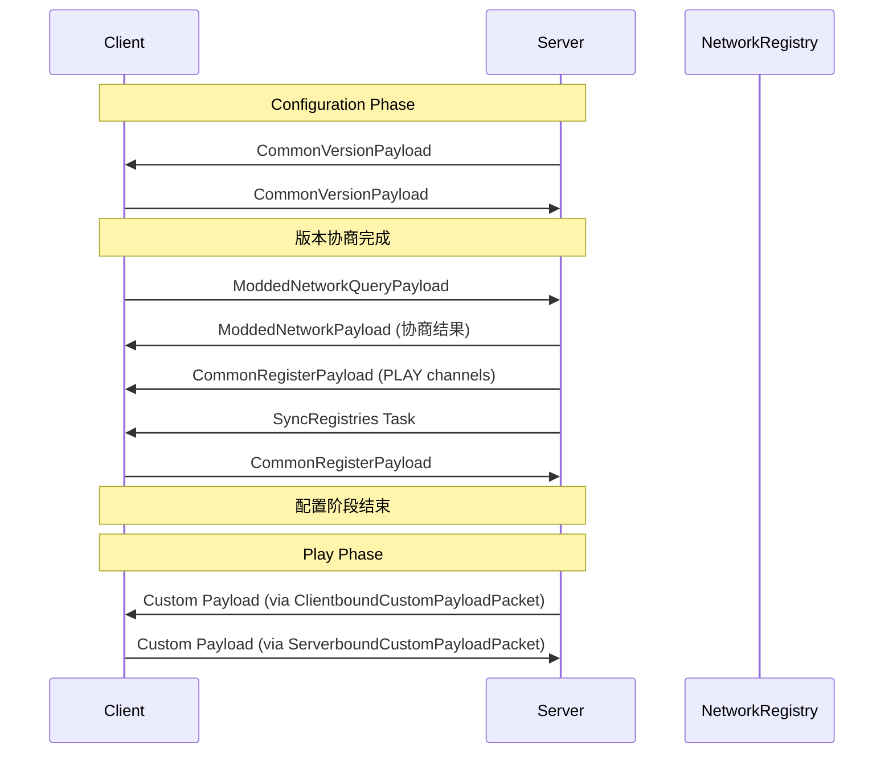
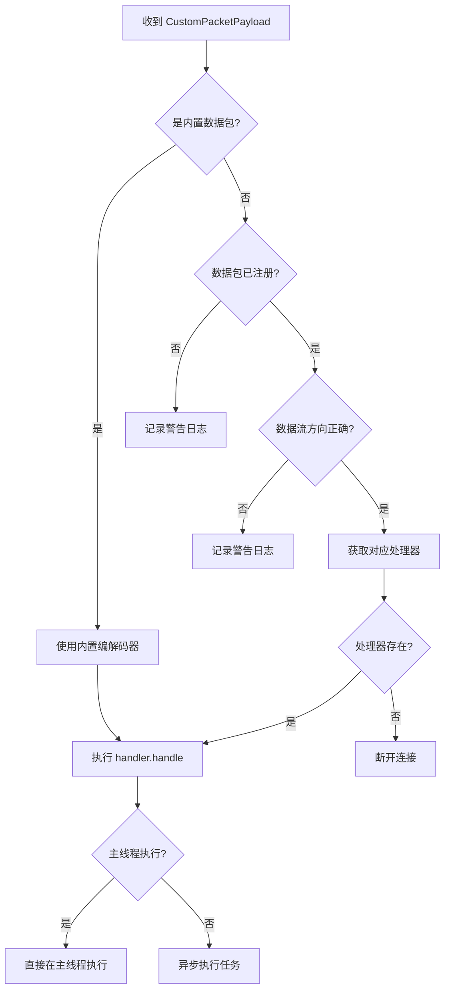
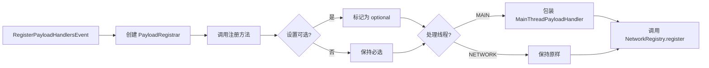

# 网络系统

## 目录

- [1. 系统概述](#1-系统概述)
- [2. 核心组件](#2-核心组件)
  - [2.1 NetworkRegistry](#21-networkregistry)
  - [2.2 PayloadRegistrar](#22-payloadregistrar)
  - [2.3 NetworkChannel](#23-networkchannel)
  - [2.4 IPayloadContext 与 IPayloadHandler](#24-ipayloadcontext-与-ipayloadhandler)
- [3. 数据包类型](#3-数据包类型)
  - [3.1 内置数据包](#31-内置数据包)
  - [3.2 注册表数据映射同步](#32-注册表数据映射同步)
  - [3.3 附件同步](#33-附件同步)
- [4. 工作流程图](#4-工作流程图)
- [5. API 使用示例](#5-api-使用示例)
- [6. 与其他系统交互](#6-与其他系统交互)
- [7. 总结](#7-总结)

## 1. 系统概述

NeoForge 1.21.x 的网络系统是 Minecraft 多人游戏通信的核心基础设施，负责在客户端和服务端之间传输自定义数据包（Payload）。与传统的 Forge 基于 `FMLHandshakeHandler` 的方式不同，NeoForge 采用现代化的 `CustomPacketPayload` API，提供了更类型安全、更灵活的网络通信机制。

### 关键术语解释

| 术语 | 说明 |
|------|------|
| **Payload** | 自定义数据包，继承自 `CustomPacketPayload`，用于在客户端与服务端之间传递数据 |
| **StreamCodec** | 流编解码器，用于将 Payload 序列化和反序列化为字节流 |
| **Channel** | 网络通道，代表一个协商后的通信线路，具有唯一的 ID 和版本 |
| **Handler** | 处理器，当收到数据包时执行的回调逻辑 |
| **Protocol** | 协议阶段，包括 `CONFIGURATION`（配置阶段）和 `PLAY`（游戏阶段） |
| **Flow** | 数据流方向，`SERVERBOUND`（客户端→服务端）或 `CLIENTBOUND`（服务端→客户端） |

### 设计理念

NeoForge 网络系统的核心设计理念：

1. **类型安全**：通过泛型和 `CustomPacketPayload` 接口确保数据包类型安全
2. **版本协商**：支持多版本兼容，允许 Mod 在不同版本间协商
3. **可选依赖**：支持可选数据包的声明，避免强制依赖导致的连接失败
4. **线程安全**：区分网络线程和主线程处理，避免阻塞游戏主循环

## 2. 核心组件

### 2.1 NetworkRegistry

`NetworkRegistry` 是整个网络系统的核心注册中心，负责管理所有自定义数据包的注册、协商和处理。

```20:21:src/main/java/net/neoforged/neoforge/network/registration/NetworkRegistry.java
@ApiStatus.Internal
public class NetworkRegistry {
```

#### 核心功能

| 功能 | 说明 |
|------|------|
| `setup()` | 初始化网络注册系统，触发 `RegisterPayloadHandlersEvent` |
| `register()` | 注册新的数据包类型、编解码器和处理器 |
| `getCodec()` | 根据 ID 获取数据包的编解码器 |
| `handleModdedPayload()` | 处理服务端收到的 mod 数据包 |
| `checkPacket()` | 验证数据包是否可以在当前连接上发送 |
| `hasChannel()` | 检查连接是否支持特定的数据包 |

#### 内置数据包

```95:102:src/main/java/net/neoforged/neoforge/network/registration/NetworkRegistry.java
protected static final Map<Identifier, StreamCodec<FriendlyByteBuf, ? extends CustomPacketPayload>> BUILTIN_PAYLOADS = ImmutableMap.of(
        MinecraftRegisterPayload.ID, MinecraftRegisterPayload.STREAM_CODEC,
        MinecraftUnregisterPayload.ID, MinecraftUnregisterPayload.STREAM_CODEC,
        ModdedNetworkQueryPayload.ID, ModdedNetworkQueryPayload.STREAM_CODEC,
        ModdedNetworkPayload.ID, ModdedNetworkPayload.STREAM_CODEC,
        ModdedNetworkSetupFailedPayload.ID, ModdedNetworkSetupFailedPayload.STREAM_CODEC,
        CommonVersionPayload.ID, CommonVersionPayload.STREAM_CODEC,
        CommonRegisterPayload.ID, CommonRegisterPayload.STREAM_CODEC);
```

这些内置数据包在通道协商之前就可以使用，包括：
- `MinecraftRegisterPayload` - 注册频道
- `MinecraftUnregisterPayload` - 取消注册频道
- `CommonVersionPayload` - 通用版本协商
- `CommonRegisterPayload` - 通用注册（用于 c:register 协议）

### 2.2 PayloadRegistrar

`PayloadRegistrar` 是用于注册数据包的建造者风格的辅助类，提供了流畅的 API 来配置数据包的各项属性。

```26:39:src/main/java/net/neoforged/neoforge/network/registration/PayloadRegistrar.java
public class PayloadRegistrar {
    private String version;
    private boolean optional = false;
    private HandlerThread thread = HandlerThread.MAIN;

    public PayloadRegistrar(String version) {
        this.version = version;
    }
```

#### 注册方法

| 方法 | 说明 |
|------|------|
| `playToClient()` | 注册客户端接收的游戏阶段数据包 |
| `playToServer()` | 注册服务端接收的游戏阶段数据包 |
| `playBidirectional()` | 注册双向游戏阶段数据包 |
| `configurationToClient()` | 注册客户端接收的配置阶段数据包 |
| `configurationToServer()` | 注册服务端接收的配置阶段数据包 |
| `commonToClient()` | 注册在所有阶段客户端接收的数据包 |
| `commonToServer()` | 注册在所有阶段服务端接收的数据包 |

#### 链式配置方法

```180:213:src/main/java/net/neoforged/neoforge/network/registration/PayloadRegistrar.java
public PayloadRegistrar executesOn(HandlerThread thread) {
    PayloadRegistrar clone = new PayloadRegistrar(this);
    clone.thread = thread;
    return clone;
}

public PayloadRegistrar versioned(String version) {
    PayloadRegistrar clone = new PayloadRegistrar(this);
    clone.version = version;
    return clone;
}

public PayloadRegistrar optional() {
    PayloadRegistrar clone = new PayloadRegistrar(this);
    clone.optional = true;
    return clone;
}
```

- `executesOn()` - 指定处理器执行的线程（MAIN 或 NETWORK）
- `versioned()` - 设置数据包的协议版本
- `optional()` - 标记数据包为可选

### 2.3 NetworkChannel

`NetworkChannel` 是一个简洁的记录类，用于存储协商后的通道信息。

```21:26:src/main/java/net/neoforged/neoforge/network/registration/NetworkChannel.java
@ApiStatus.Internal
public record NetworkChannel(Identifier id, String chosenVersion) {
    public static final StreamCodec<FriendlyByteBuf, NetworkChannel> STREAM_CODEC = StreamCodec.composite(
            Identifier.STREAM_CODEC, NetworkChannel::id,
            ByteBufCodecs.STRING_UTF8, NetworkChannel::chosenVersion,
            NetworkChannel::new);
}
```

### 2.4 IPayloadContext 与 IPayloadHandler

#### IPayloadHandler

```17:25:src/main/java/net/neoforged/neoforge/network/handling/IPayloadHandler.java
@FunctionalInterface
public interface IPayloadHandler<T extends CustomPacketPayload> {
    /**
     * Handles the payload with the supplied context.
     * <p>
     * The thread the supplied handler executes in depends on the {@link HandlerThread} set in {@link PayloadRegistrar#executesOn}.
     */
    void handle(T payload, IPayloadContext context);
}
```

`IPayloadHandler` 是一个函数式接口，用于定义数据包的处理器逻辑。

#### IPayloadContext

```28:133:src/main/java/net/neoforged/neoforge/network/handling/IPayloadContext.java
@ApiStatus.NonExtendable
public interface IPayloadContext {
    ICommonPacketListener listener();
    
    default Connection connection() {
        return this.listener().getConnection();
    }
    
    Player player();
    
    default void reply(CustomPacketPayload payload) {
        this.listener().send(payload);
    }
    
    default void disconnect(Component reason) {
        this.listener().disconnect(reason);
    }
    
    CompletableFuture<Void> enqueueWork(Runnable task);
    
    <T> CompletableFuture<T> enqueueWork(Supplier<T> task);
    
    PacketFlow flow();
    
    default ConnectionProtocol protocol() {
        return this.listener().protocol;
    }
    
    void handle(CustomPacketPayload payload);
    
    void finishCurrentTask(ConfigurationTask.Type type);
    
    default ChannelHandlerContext channelHandlerContext() {
        return this.connection().channel().pipeline().lastContext();
    }
}
```

`IPayloadContext` 提供处理数据包的上下文环境，包含以下关键功能：

| 方法 | 功能 |
|------|------|
| `listener()` | 获取关联的数据包监听器 |
| `player()` | 获取相关的玩家对象 |
| `reply()` | 向发送者回复数据包 |
| `disconnect()` | 断开连接 |
| `enqueueWork()` | 将任务提交到主线程执行 |
| `flow()` | 获取数据流方向 |
| `protocol()` | 获取当前协议阶段 |

#### ServerPayloadContext

```24:70:src/main/java/net/neoforged/neoforge/network/handling/ServerPayloadContext.java
@ApiStatus.Internal
public record ServerPayloadContext(ServerCommonPacketListener listener, Identifier payloadId) implements IPayloadContext {
    @Override
    public CompletableFuture<Void> enqueueWork(Runnable task) {
        PacketProcessor processor = listener.getPacketProcessor();
        if (processor.isSameThread()) {
            task.run();
            return CompletableFuture.completedFuture(null);
        }
        return NetworkRegistry.guard(CompletableFuture.runAsync(task, processor::scheduleIfPossible), this.payloadId);
    }

    @Override
    public ServerPlayer player() {
        if (this.listener instanceof ServerPlayerConnection spc) {
            return spc.getPlayer();
        }
        throw new UnsupportedOperationException("Cannot retrieve the sending player during the configuration phase.");
    }
    // ...
}
```

## 3. 数据包类型

### 3.1 内置数据包

#### CommonRegisterPayload

```27:50:src/main/java/net/neoforged/neoforge/network/payload/CommonRegisterPayload.java
@ApiStatus.Internal
public record CommonRegisterPayload(int version, ConnectionProtocol protocol, Set<Identifier> channels) implements CustomPacketPayload {
    public static final Identifier ID = Identifier.fromNamespaceAndPath("c", "register");
    public static final CustomPacketPayload.Type<CommonRegisterPayload> TYPE = new CustomPacketPayload.Type<>(ID);
    public static final StreamCodec<FriendlyByteBuf, CommonRegisterPayload> STREAM_CODEC = StreamCodec.composite(
            ByteBufCodecs.VAR_INT, CommonRegisterPayload::version,
            ByteBufCodecs.STRING_UTF8.map(CommonRegisterPayload::protocolById, ConnectionProtocol::id), CommonRegisterPayload::protocol,
            ByteBufCodecs.collection(HashSet::new, Identifier.STREAM_CODEC), CommonRegisterPayload::channels,
            CommonRegisterPayload::new);
    // ...
}
```

用于在配置阶段发送 play 阶段的频道信息，实现标准化的 `c:register` 协议。

#### CommonVersionPayload

```25:41:src/main/java/net/neoforged/neoforge/network/payload/CommonVersionPayload.java
@ApiStatus.Internal
public record CommonVersionPayload(List<Integer> versions) implements CustomPacketPayload {
    public static final Identifier ID = Identifier.fromNamespaceAndPath("c", "version");
    public static final CustomPacketPayload.Type<CommonVersionPayload> TYPE = new CustomPacketPayload.Type<>(ID);

    public CommonVersionPayload() {
        this(NetworkRegistry.SUPPORTED_COMMON_NETWORKING_VERSIONS);
    }
    // ...
}
```

用于协商 `c:register` 协议的版本，当前仅支持版本 1。

### 3.2 注册表数据映射同步

```30:72:src/main/java/net/neoforged/neoforge/network/payload/RegistryDataMapSyncPayload.java
@ApiStatus.Internal
@SuppressWarnings({ "unchecked", "rawtypes" })
public record RegistryDataMapSyncPayload<T>(ResourceKey<? extends Registry<T>> registryKey,
        Map<Identifier, Map<ResourceKey<T>, ?>> dataMaps) implements CustomPacketPayload {
    public static final CustomPacketPayload.Type<RegistryDataMapSyncPayload<?>> TYPE = new Type<>(Identifier.fromNamespaceAndPath("neoforge", "registry_data_map_sync"));
    // ...
}
```

此数据包用于在服务端和客户端之间同步注册表的数据映射（DataMap），确保客户端能够正确理解服务端注册表中的附加数据。

### 3.3 附件同步

```23:91:src/main/java/net/neoforged/neoforge/network/payload/SyncAttachmentsPayload.java
@ApiStatus.Internal
public record SyncAttachmentsPayload(
        Target target,
        List<AttachmentType<?>> types,
        byte[] syncPayload)
        implements CustomPacketPayload {
    public static final Type<SyncAttachmentsPayload> TYPE = new Type<>(Identifier.fromNamespaceAndPath(NeoForgeMod.MOD_ID, "sync_attachments"));
    
    public sealed interface Target {
        // 支持的目标类型
    }
    
    public record BlockEntityTarget(BlockPos pos) implements Target {}
    public record ChunkTarget(ChunkPos pos) implements Target {}
    public record EntityTarget(int entity) implements Target {}
    public record LevelTarget() implements Target {}
}
```

`SyncAttachmentsPayload` 支持多种同步目标：
- **BlockEntityTarget** - 方块实体附件
- **ChunkTarget** - 区块级别的附件
- **EntityTarget** - 实体附件
- **LevelTarget** - 世界/等级级别的附件

## 4. 工作流程图

### 连接协商流程



### 数据包处理流程



### 注册数据包流程



## 5. API 使用示例

### 基础使用：注册一个简单的数据包

#### 1. 定义数据包

```java
// MyModPayload.java
public class MyModPayload implements CustomPacketPayload {
    public static final Type<MyModPayload> TYPE = new Type<>(Identifier.of("mymod", "my_payload"));
    public static final StreamCodec<RegistryFriendlyByteBuf, MyModPayload> STREAM_CODEC = StreamCodec.composite(
            ByteBufCodecs.STRING_UTF8, MyModPayload::message,
            MyModPayload::new);

    private final String message;

    public MyModPayload(String message) {
        this.message = message;
    }

    private MyModPayload(FriendlyByteBuf buf) {
        this.message = buf.readUtf();
    }

    public void write(FriendlyByteBuf buf) {
        buf.writeUtf(this.message);
    }

    @Override
    public Type<MyModPayload> type() {
        return TYPE;
    }
}
```

#### 2. 注册数据包（服务端）

```java
// NetworkHandler.java
public class NetworkHandler {
    public static void register(final RegisterPayloadHandlersEvent event) {
        PayloadRegistrar registrar = event.registrar("1.0.0");

        // 服务端接收客户端发送的数据
        registrar.playToServer(
            MyModPayload.TYPE,
            MyModPayload.STREAM_CODEC,
            (payload, context) -> {
                // 在主线程执行游戏逻辑
                context.enqueueWork(() -> {
                    ServerPlayer player = (ServerPlayer) context.player();
                    player.sendSystemMessage(Component.literal("收到: " + payload.message));
                });
            }
        );

        // 客户端接收服务端发送的数据
        registrar.playToClient(
            AnotherPayload.TYPE,
            AnotherPayload.STREAM_CODEC,
            (payload, context) -> {
                context.enqueueWork(() -> {
                    // 处理来自服务端的数据
                    handleServerData(payload);
                });
            }
        );
    }
}
```

#### 3. 发送数据包

```java
// 在服务端发送数据包给客户端
public void sendToClient(ServerPlayer player, AnotherPayload payload) {
    player.connection.send(payload);
}

// 在客户端发送数据包给服务端
public void sendToServer(MyModPayload payload) {
    // 通过网络管理器发送
    NeoForgeForgeClientHooks.sendToServer(payload);
}
```

### 进阶使用：配置可选数据包和版本控制

```java
public class AdvancedNetworkHandler {
    public static void register(final RegisterPayloadHandlersEvent event) {
        PayloadRegistrar registrar = event.registrar("1.0.0")
            .optional()  // 所有通过此 registrar 注册的数据包都是可选的
            .executesOn(HandlerThread.MAIN);  // 处理器在主线程执行

        // 链式配置单个数据包
        registrar.versioned("2.0.0")
            .playToServer(VersionedPayload.TYPE, VersionedPayload.STREAM_CODEC, handler);

        // 双向数据包
        registrar.playBidirectional(
            BidirectionalPayload.TYPE,
            BidirectionalPayload.STREAM_CODEC,
            serverHandler,    // 服务端处理器
            clientHandler     // 客户端处理器（可为 null）
        );
    }
}
```

### 配置阶段数据包

```java
public class ConfigNetworkHandler {
    public static void register(final RegisterPayloadHandlersEvent event) {
        PayloadRegistrar registrar = event.registrar("1.0.0");

        // 配置阶段 - 服务端发送配置数据给客户端
        registrar.configurationToClient(
            ConfigSyncPayload.TYPE,
            ConfigSyncPayload.STREAM_CODEC,
            (payload, context) -> {
                context.enqueueWork(() -> {
                    applyConfig(payload);
                    // 标记配置任务完成
                    context.finishCurrentTask(CommonConfigTask.TYPE);
                });
            }
        );

        // 配置阶段 - 客户端确认配置
        registrar.configurationToServer(
            ConfigAckPayload.TYPE,
            ConfigAckPayload.STREAM_CODEC,
            handler
        );
    }
}
```

## 6. 与其他系统交互

### 与注册表系统集成

NeoForge 网络系统与注册表系统紧密集成，通过 `SyncRegistries` 配置任务在连接建立时同步注册表数据。

```10:36:src/main/java/net/neoforged/neoforge/network/configuration/SyncRegistries.java
@ApiStatus.Internal
public record SyncRegistries() implements ICustomConfigurationTask {
    private static final Identifier ID = Identifier.fromNamespaceAndPath(NeoForgeMod.MOD_ID, "sync_registries");
    public static final Type TYPE = new Type(ID);

    @Override
    public void run(Consumer<CustomPacketPayload> sender) {
        sender.accept(new FrozenRegistrySyncStartPayload(RegistryManager.getRegistryNamesForSyncToClient()));
        RegistryManager.generateRegistryPackets(false).forEach(sender);
        sender.accept(FrozenRegistrySyncCompletedPayload.INSTANCE);
    }
    // ...
}
```

同步流程：
1. 发送 `FrozenRegistrySyncStartPayload` 标记开始
2. 通过多个 `FrozenRegistryPayload` 发送冻结的注册表数据
3. 发送 `FrozenRegistrySyncCompletedPayload` 标记完成

### 与附件系统集成

`SyncAttachmentsPayload` 负责同步实体、方块实体等附件数据：

```23:27:src/main/java/net/neoforged/neoforge/network/payload/SyncAttachmentsPayload.java
public record SyncAttachmentsPayload(
        Target target,
        List<AttachmentType<?>> types,
        byte[] syncPayload)
        implements CustomPacketPayload {
```

支持的同步目标：
- **实体 (Entity)** - 玩家、生物等实体
- **方块实体 (BlockEntity)** - 箱子、熔炉等
- **区块 (Chunk)** - 区块级别的数据
- **世界 (Level)** - 世界级别的数据

### 与事件系统集成

网络数据包的注册通过 `RegisterPayloadHandlersEvent` 完成，该事件在 Mod 总线（ModBus）上触发：

```31:43:src/main/java/net/neoforged/neoforge/network/event/RegisterPayloadHandlersEvent.java
public class RegisterPayloadHandlersEvent extends Event implements IModBusEvent {
    public PayloadRegistrar registrar(String version) {
        return new PayloadRegistrar(version);
    }
}
```

Mod 应在初始化阶段订阅此事件并注册其所有网络数据包。

## 7. 总结

NeoForge 1.21.x 的网络系统是 Minecraft Mod 开发中进行客户端-服务端通信的核心框架。其主要特点包括：

### 优势

1. **类型安全**：通过 `CustomPacketPayload` 和泛型确保编译时类型检查
2. **现代化 API**：采用建造者模式和流畅接口，提供良好的开发者体验
3. **版本协商**：支持多版本兼容，便于 Mod 升级和向后兼容
4. **灵活的线程模型**：可选择主线程或网络线程处理数据包
5. **可选依赖**：支持可选数据包声明，避免强制依赖导致的连接失败
6. **标准化协议**：内置对 `c:register` 和 `c:version` 标准协议的支持

### 关键设计模式

| 模式 | 应用 |
|------|------|
| **建造者模式** | `PayloadRegistrar` 提供流畅的 API |
| **策略模式** | `IPayloadHandler` 支持不同的处理策略 |
| **单例模式** | `NetworkRegistry` 全局唯一 |
| **观察者模式** | `RegisterPayloadHandlersEvent` 事件机制 |

### 使用建议

1. **尽早注册**：所有数据包应在 `RegisterPayloadHandlersEvent` 中注册
2. **选择合适的数据流**：根据实际需求选择单向或双向
3. **注意线程安全**：主线程操作需使用 `enqueueWork()`
4. **处理可选数据包**：客户端应优雅处理服务端未发送的可选数据包
5. **版本管理**：数据包结构变化时应增加版本号

### 适用场景

- 物品/方块同步状态
- 实体数据同步
- 自定义 GUI 交互
- 游戏规则和配置同步
- Mod 间通信
- 插件系统集成

通过掌握 NeoForge 网络系统，开发者可以实现各种复杂的客户端-服务端交互功能，为玩家提供丰富的多人游戏体验。
