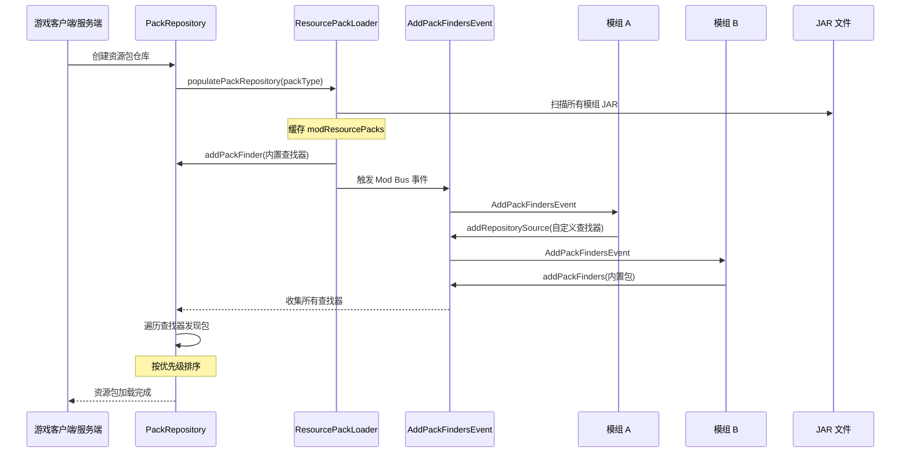
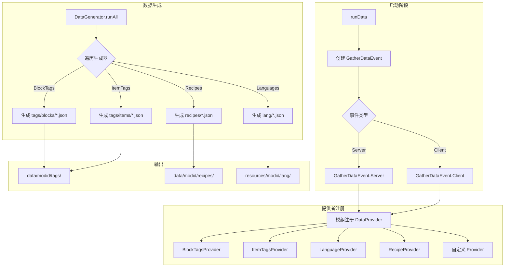
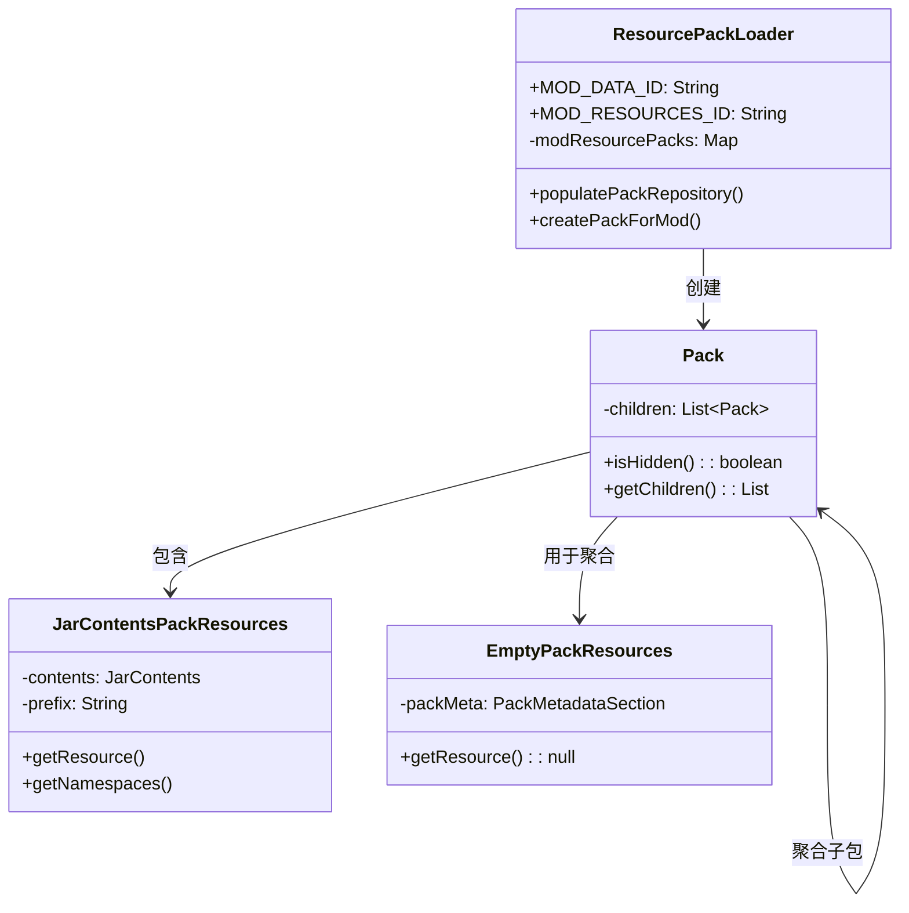
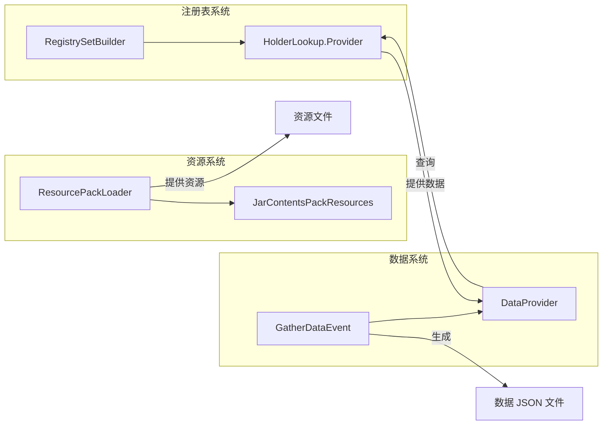

# 资源与数据系统

## 目录

- [1. 系统概述](#1-系统概述)
- [2. 资源系统](#2-资源系统)
  - [2.1 ResourcePackLoader](#21-resourcepackloader)
  - [2.2 EmptyPackResources](#22-emptypackresources)
  - [2.3 JarContentsPackResources](#23-jarcontentspackresources)
  - [2.4 AddPackFindersEvent](#24-addpackfindersevent)
- [3. 数据系统](#3-数据系统)
  - [3.1 GatherDataEvent](#31-gatherdataevent)
  - [3.2 DataProvider 类型详解](#32-dataprovider-类型详解)
  - [3.3 NeoForge 内置数据生成器](#33-neoforge-内置数据生成器)
- [4. 工作流程图](#4-工作流程图)
- [5. API 使用示例](#5-api-使用示例)
- [6. 与其他系统交互](#6-与其他系统交互)
- [7. 总结](#7-总结)

---

## 1. 系统概述

NeoForge 1.21.x 的资源与数据系统是模组加载框架的核心组成部分，负责管理游戏资源的加载和数据文件的生成。该系统分为两大子系统：

| 子系统 | 职责 | PackType |
|--------|------|----------|
| **资源系统** | 加载模组的资源包（纹理、模型、翻译等） | `CLIENT_RESOURCES` |
| **数据系统** | 生成数据文件（标签、配方、战利品表等） | `SERVER_DATA` |

**核心设计理念**：

- **资源包加载器** (`ResourcePackLoader`)：将模组 JAR 文件的内容作为资源包暴露给游戏
- **数据生成框架** (`GatherDataEvent`)：提供声明式 API，让开发者以编程方式生成数据 JSON 文件
- **统一的事件系统**：通过 `AddPackFindersEvent` 和 `GatherDataEvent` 允许模组扩展资源包和数据生成行为

---

## 2. 资源系统

### 2.1 ResourcePackLoader

**文件位置**：`D:\Minecraft-Learning\assets\NeoForge-1.21.x\src\main\java\net\neoforged\neoforge\resource\ResourcePackLoader.java`

#### 类职责

`ResourcePackLoader` 是资源包加载的核心管理器，负责：
1. 扫描所有已加载模组的 JAR 文件
2. 为每个包含 `resources` 或 `data` 目录的模组创建资源包
3. 管理资源包排序和子包层级

#### 关键常量

```java
public static final String MOD_DATA_ID = "mod_data";        // 数据包标识符
public static final String MOD_RESOURCES_ID = "mod_resources"; // 资源包标识符
```

#### 核心方法

| 方法 | 作用 |
|------|------|
| `populatePackRepository()` | 填充资源包仓库，触发 `AddPackFindersEvent` |
| `findResourcePacks()` | 同步扫描并缓存所有模组资源包 |
| `getPackFor(modId)` | 根据模组 ID 获取对应的资源包 |
| `buildPackFinder()` | 构建 `RepositorySource` 用于包发现 |
| `createPackForMod()` | 为模组创建 `Pack.ResourcesSupplier` |

#### 工作机制

```java
public static void populatePackRepository(PackRepository resourcePacks, PackType packType, boolean trusted) {
    findResourcePacks();  // Step 1: 扫描所有模组 JAR
    // Step 2: 首先添加模组内置包
    resourcePacks.addPackFinder(buildPackFinder(modResourcePacks, packType));
    // Step 3: 触发事件，允许其他模组添加更多包查找器
    ModLoader.postEvent(new AddPackFindersEvent(packType, resourcePacks::addPackFinder, trusted));
}
```

**关键特性**：
- **懒加载**：资源包扫描使用同步机制，确保只扫描一次
- **多层包结构**：支持隐藏包（`hiddenPacks`）作为子包聚合
- **版本兼容处理**：通过 `PackFormat` 处理不同版本间的兼容性

#### Pack 命名规范

```java
// 模组包命名格式
final String name = "mod/" + e.getKey().getModInfos().stream()
    .map(IModInfo::getModId)
    .collect(Collectors.joining(","));
```

---

### 2.2 EmptyPackResources

**文件位置**：`D:\Minecraft-Learning\assets\NeoForge-1.21.x\src\main\java\net\neoforged\neoforge\resource\EmptyPackResources.java`

#### 类职责

`EmptyPackResources` 是一个**空资源包实现**，用于：
1. 创建不含实际资源的"虚拟"资源包
2. 作为模组隐藏包的聚合容器
3. 提供元数据（`pack.mcmeta`）而不暴露任何资源

#### 关键实现

```java
public class EmptyPackResources extends AbstractPackResources {
    private final PackMetadataSection packMeta;

    @Override
    public Set<String> getNamespaces(PackType type) {
        return Collections.emptySet();  // 空命名空间
    }

    @Nullable
    @Override
    public IoSupplier<InputStream> getResource(PackType type, Identifier location) {
        return null;  // 不提供任何资源
    }

    public static class EmptyResourcesSupplier implements Pack.ResourcesSupplier {
        @Override
        public PackResources openPrimary(PackLocationInfo id) {
            return new EmptyPackResources(id, packMeta);
        }
    }
}
```

**使用场景**：
- `ResourcePackLoader.makePack()` 创建 "Mod Resources" / "Mod Data" 聚合包
- 这些聚合包将所有隐藏的模组包作为子包包含

---

### 2.3 JarContentsPackResources

**文件位置**：`D:\Minecraft-Learning\assets\NeoForge-1.21.x\src\main\java\net\neoforged\neoforge\resource\JarContentsPackResources.java`

#### 类职责

`JarContentsPackResources` 将 **JAR 文件内容**（模组 JAR）直接暴露为 `PackResources`，支持：

1. 从 `resources/` 和 `data/` 目录读取资源
2. 处理资源覆盖（Overlay）机制
3. 命名空间枚举

#### 关键实现

```java
public class JarContentsPackResources extends AbstractPackResources {
    private final JarContents contents;
    private final String prefix;

    // 路径转换: PackType/namespace/path -> prefix/PackType/namespace/path
    private static String getPathFromLocation(PackType packType, Identifier location) {
        return String.format(Locale.ROOT, "%s/%s/%s", 
            packType.getDirectory(), location.getNamespace(), location.getPath());
    }

    @Override
    public Set<String> getNamespaces(PackType packType) {
        Set<String> namespaces = Sets.newHashSet();
        String prefix = this.addPrefix(packType.getDirectory() + "/");
        // 遍历内容，提取命名空间
        contents.visitContent(prefix, (relativePath, resource) -> { ... });
        return namespaces;
    }
}
```

#### 资源路径映射

```
JAR 文件结构:
  mymod.jar
  ├── META-INF/
  └── resources/
      └── assets/
          └── mymod/
              ├── textures/block/example.png
              └── models/item/example.json

通过 JarContentsPackResources 访问:
  资源路径: assets/mymod/textures/block/example.png
  访问标识符: new Identifier("mymod", "textures/block/example.png")
```

---

### 2.4 AddPackFindersEvent

**文件位置**：`D:\Minecraft-Learning\assets\NeoForge-1.21.x\src\main\java\net\neoforged\neoforge\event\AddPackFindersEvent.java`

#### 类职责

`AddPackFindersEvent` 是在 **Mod Bus** 上触发的事件，允许模组：
1. 添加自定义包查找器（`RepositorySource`）
2. 注册内置资源包
3. 控制资源包优先级

#### 事件属性

| 属性 | 类型 | 说明 |
|------|------|------|
| `packType` | `PackType` | 当前操作的包类型 |
| `sources` | `Consumer<RepositorySource>` | 包查找器注册器 |
| `trusted` | `boolean` | 是否为可信仓库（避免服务端同步） |

#### 核心方法

```java
public class AddPackFindersEvent extends Event implements IModBusEvent {
    /**
     * 添加新的资源包查找器
     * @param source 包查找器
     */
    public void addRepositorySource(RepositorySource source) {
        sources.accept(source);
    }

    /**
     * 便捷方法：注册 resources/ 目录下的内置包
     */
    public void addPackFinders(
        Identifier packLocation,      // 资源位置，如 new Identifier("mymod", "mypack")
        PackType packType,             // 资源包或数据包
        Component packNameDisplay,     // 显示名称
        PackSource packSource,         // 启用策略
        boolean alwaysActive,          // 是否始终启用
        Pack.Position packPosition     // 优先级位置
    ) {
        // 创建 Pack 并注册...
    }
}
```

#### 事件触发时机

```
游戏启动流程:
  └─ PackRepository 初始化
      └─ ResourcePackLoader.populatePackRepository()
          └─ 触发 AddPackFindersEvent (Mod Bus)
              └─ 模组注册额外包查找器
```

---

## 3. 数据系统

### 3.1 GatherDataEvent

**文件位置**：`D:\Minecraft-Learning\assets\NeoForge-1.21.x\src\main\java\net\neoforged\neoforge\data\event\GatherDataEvent.java`

#### 类职责

`GatherDataEvent` 是数据生成的核心事件，提供：
1. 注册 `DataProvider` 的入口
2. 配置数据生成选项
3. 访问 `HolderLookup.Provider` 进行数据查询

#### 事件子类

| 子类 | 触发场景 |
|------|----------|
| `GatherDataEvent.Server` | 服务端数据生成（配方、标签等） |
| `GatherDataEvent.Client` | 客户端数据生成（语言、模型等） |

#### 关键方法

```java
public abstract class GatherDataEvent extends Event implements IModBusEvent {
    // 注册数据提供者
    public <T extends DataProvider> T addProvider(T provider) {
        return dataGenerator.addProvider(true, provider);
    }

    // 使用输出创建提供者
    public <T extends DataProvider> T createProvider(DataProviderFromOutput<T> builder) {
        return addProvider(builder.create(dataGenerator.getPackOutput()));
    }

    // 创建带有 HolderLookup 的提供者
    public <T extends DataProvider> T createProvider(DataProviderFromOutputLookup<T> builder) {
        return addProvider(builder.create(dataGenerator.getPackOutput(), this.getLookupProvider()));
    }

    // 创建标签提供者（自动处理依赖）
    public void createBlockAndItemTags(
        DataProviderFromOutputLookup<TagsProvider<Block>> blockTagsProvider,
        ItemTagsProvider itemTagsProvider
    ) { ... }

    // 创建数据包内置条目
    public void createDatapackRegistryObjects(RegistrySetBuilder datapackEntriesBuilder) {
        var registries = this.createProvider((output, lookupProvider) -> 
            new DatapackBuiltinEntriesProvider(output, lookupProvider, datapackEntriesBuilder, Set.of(this.modContainer.getModId())));
        this.registriesWithModdedEntries = registries.getRegistryProvider();
    }
}
```

#### 配置选项

```java
public boolean includeDev()      // 是否包含开发工具数据
public boolean includeReports()   // 是否生成报告
public boolean validate()         // 是否验证数据
public ResourceManager getResourceManager(PackType packType)  // 获取资源管理器
```

---

### 3.2 DataProvider 类型详解

#### BlockTagsProvider / ItemTagsProvider

**基类**：`IntrinsicHolderTagsProvider<T>`

```java
public abstract class BlockTagsProvider extends IntrinsicHolderTagsProvider<Block> {
    public BlockTagsProvider(PackOutput output, CompletableFuture<HolderLookup.Provider> lookupProvider, String modId) {
        super(output, Registries.BLOCK, lookupProvider, 
              block -> block.builtInRegistryHolder().key(), modId);
    }
}
```

**用法示例**：

```java
public class MyBlockTagsProvider extends BlockTagsProvider {
    public MyBlockTagsProvider(PackOutput output, CompletableFuture<HolderLookup.Provider> lookupProvider) {
        super(output, lookupProvider, "mymod");
    }

    @Override
    public void addTags(HolderLookup.Provider provider) {
        // 定义标签
        tag(Tags.Blocks.ORES).addTag(Tags.Blocks.ORES_COPPER);
        tag(Tags.Blocks.STORAGE_BLOCKS).add(Blocks.DIAMOND_BLOCK);
        
        // 可选标签（向后兼容）
        tag(tag("my_custom_tag")).addOptionalTag(Tags.Blocks.ORES);
    }
}
```

#### LanguageProvider

**文件位置**：`D:\Minecraft-Learning\assets\NeoForge-1.21.x\src\main\java\net\neoforged\neoforge\common\data\LanguageProvider.java`

```java
public abstract class LanguageProvider implements DataProvider {
    private final Map<String, Component> data = new TreeMap<>();
    
    protected abstract void addTranslations();
    
    public void addBlock(Supplier<? extends Block> key, String name) { ... }
    public void addItem(Supplier<? extends Item> key, String name) { ... }
    public void addEffect(Supplier<? extends MobEffect> key, String name) { ... }
    public void add(String key, String value) { ... }
}
```

**输出路径**：
```
resources/assets/<modid>/lang/<locale>.json
```

#### GlobalLootModifierProvider

**用途**：生成 `data/<modid>/loot_modifiers/` 和 `data/neoforge/loot_modifiers/global_loot_modifiers.json`

```java
public abstract class GlobalLootModifierProvider implements DataProvider {
    protected abstract void start();
    
    public <T extends IGlobalLootModifier> void add(
        String modifier,    // 修改器名称（文件名）
        T instance,         // 修改器实例
        ICondition... conditions  // 条件
    ) { ... }
}
```

#### SoundDefinitionsProvider

**文件位置**：`D:\Minecraft-Learning\assets\NeoForge-1.21.x\src\main\java\net\neoforged\neoforge\common\data\SoundDefinitionsProvider.java`

```java
public abstract class SoundDefinitionsProvider implements DataProvider {
    public abstract void registerSounds();
    
    protected void add(Holder<SoundEvent> soundEvent, SoundDefinition definition) { ... }
    
    // 便捷方法
    protected static SoundDefinition definition() { ... }
    protected static SoundDefinition.Sound sound(Identifier name, SoundType type) { ... }
}
```

**SoundDefinition 示例**：

```java
@Override
protected void registerSounds() {
    add(MY_SOUND_EVENT, definition()
        .subtitle("mymod.subtitle.my_sound")
        .with(sound("mymod:my_sound", SoundDefinition.SoundType.SOUND)
            .volume(0.8f)
            .pitch(1.2f)
            .weight(2)
        )
        .with(sound("mymod:my_sound_alt"))  // 备选声音
        .replace(true)
    );
}
```

#### DataMapProvider

**文件位置**：`D:\Minecraft-Learning\assets\NeoForge-1.21.x\src\main\java\net\neoforged\neoforge\common\data\DataMapProvider.java`

NeoForge 数据映射（DataMap）允许为注册表条目附加元数据：

```java
public abstract class DataMapProvider implements DataProvider {
    protected abstract void gather(HolderLookup.Provider provider);
    
    public <T, R> Builder<T, R> builder(DataMapType<R, T> type) { ... }
    
    public static class Builder<T, R> {
        public Builder<T, R> add(ResourceKey<R> key, T value, boolean replace, ICondition... conditions) { ... }
        public Builder<T, R> add(TagKey<R> tag, T value, boolean replace, ICondition... conditions) { ... }
        public Builder<T, R> remove(Identifier id) { ... }
        public Builder<T, R> replace(boolean replace) { ... }
    }
}
```

**输出结构**：
```
data/<modid>/datamaps/<registry_name>/<datamap_id>.json
```

---

### 3.3 NeoForge 内置数据生成器

#### 目录位置

`D:\Minecraft-Learning\assets\NeoForge-1.21.x\src\main\java\net\neoforged\neoforge\common\data\internal\`

#### NeoForgeBlockTagsProvider

定义 NeoForge 标准的方块标签：

```java
public final class NeoForgeBlockTagsProvider extends BlockTagsProvider {
    @Override
    public void addTags(HolderLookup.Provider p_256380_) {
        // 矿物标签
        tag(Tags.Blocks.ORES).addTags(Tags.Blocks.ORES_COAL, Tags.Blocks.ORES_COPPER, ...);
        tag(Tags.Blocks.ORES_IN_GROUND_DEEPSLATE).add(Blocks.DEEPSLATE_COAL_ORE, ...);
        
        // 存储方块
        tag(Tags.Blocks.STORAGE_BLOCKS).addTags(
            Tags.Blocks.STORAGE_BLOCKS_DIAMOND,
            Tags.Blocks.STORAGE_BLOCKS_GOLD, ...
        );
        
        // 可染色方块
        addColored(Tags.Blocks.DYED, "{color}_wool");
        addColored(Tags.Blocks.DYED, "{color}_concrete");
    }
}
```

#### NeoForgeAdvancementProvider

处理 NeoForge 特定的前进进度条件：

```java
public class NeoForgeAdvancementProvider extends AdvancementProvider {
    // 替换剪刀工具检查为物品能力检查
    // 处理猪林防具安全、冻土靴等 NeoForge 特定逻辑
}
```

#### NeoForgeDataMapsProvider

为 NeoForge 内置数据映射生成数据：

```java
public class NeoForgeDataMapsProvider extends DataMapProvider {
    @Override
    protected void gather(HolderLookup.Provider provider) {
        // 村民类型映射
        builder(NeoForgeDataMaps.VILLAGER_TYPES).add(...);
        
        // 可堆肥物品
        builder(NeoForgeDataMaps.COMPOSTABLES).add(...);
        
        // 熔炉燃料
        builder(NeoForgeDataMaps.FURNACE_FUELS).add(...);
        
        // 可氧化/打蜡方块
        builder(NeoForgeDataMaps.OXIDIZABLES).add(...);
        builder(NeoForgeDataMaps.WAXABLES).add(...);
    }
}
```

---

## 4. 工作流程图

### 资源包加载流程



### 数据生成流程



### 数据包覆盖机制



---

## 5. API 使用示例

### 示例 1：注册自定义资源包

```java
@ModEventBusSubscriber(modid = "mymod", bus = ModEventBusSubscriber.Bus.MOD)
public class MyPackFinder {
    @SubscribeEvent
    public static void onAddPackFinders(AddPackFindersEvent event) {
        if (event.getPackType() == PackType.CLIENT_RESOURCES) {
            // 注册 resources/mypack 目录作为资源包
            event.addPackFinders(
                new Identifier("mymod", "mypack"),  // 资源位置
                PackType.CLIENT_RESOURCES,
                Component.literal("My Pack"),        // 显示名称
                PackSource.DEFAULT,                  // 启用策略
                false,                               // 非始终启用
                Pack.Position.TOP                    // 高优先级
            );
        }
    }
}
```

### 示例 2：创建自定义数据提供者

```java
public class MyDataGenerator {
    @SubscribeEvent
    public static void onGatherData(GatherDataEvent.Server event) {
        PackOutput output = event.getGenerator().getPackOutput();
        CompletableFuture<HolderLookup.Provider> lookup = event.getLookupProvider();
        
        // 创建方块标签
        event.createProvider(output -> new BlockTagsProvider(output, lookup, "mymod") {
            @Override
            public void addTags(HolderLookup.Provider provider) {
                tag(Tags.Blocks.ORES).add(Blocks.DEEPSLATE_COPPER_ORE);
                tag(Tags.Blocks.STORAGE_BLOCKS).add(Blocks.COPPER_BLOCK);
            }
        });

        // 创建物品标签（依赖方块标签）
        event.createBlockAndItemTags(
            (out, prov) -> new BlockTagsProvider(out, prov, "mymod") { /* ... */ },
            (out, prov, blockTags) -> new ItemTagsProvider(out, prov, "mymod") {
                @Override
                protected void addTags(HolderLookup.Provider provider) {
                    copy(Tags.Blocks.ORES, Tags.Items.ORES);
                }
            }
        );

        // 创建语言文件
        event.createProvider(output -> new LanguageProvider(output, "mymod", "en_us") {
            @Override
            protected void addTranslations() {
                add("block.mymod.example", "Example Block");
                add("item.mymod.tool", "Magic Tool");
            }
        });
    }
}
```

### 示例 3：使用 DataMapProvider

```java
public class MyDataMapsProvider extends DataMapProvider {
    @Override
    protected void gather(HolderLookup.Provider provider) {
        // 为物品添加自定义数据
        builder(NeoForgeDataMaps.COMPOSTABLES)
            .add(Items.MAGIC_DUST, new Compostable(0.8f, false), false)
            .add(Tags.Items.DUSTS, new Compostable(0.3f, false), false);

        // 添加强制覆盖
        builder(NeoForgeDataMaps.FURNACE_FUELS)
            .add(Items.BLAZE_ROD, new FurnaceFuel(2400), true);
    }
}
```

### 示例 4：创建自定义数据包条目

```java
@SubscribeEvent
public static void onGatherData(GatherDataEvent.Server event) {
    RegistrySetBuilder builder = new RegistrySetBuilder();
    
    // 添加自定义维度的数据包条目
    builder.add(Registries.DIMENSION, bootstrap -> {
        ResourceKey<Level> myDim = ResourceKey.create(
            Registries.DIMENSION, 
            new Identifier("mymod", "my_dimension")
        );
        
        return ContextfulRegistryBootstrap.create(
            myDim,
            new DimensionType(
                OptionalLong.of(12000), // 无限时长
                true,                   // skylight
                true,                   // 模拟光源
                false,                 // 无自然光
                0.0,                   // 固定时间
                6000,                  // 白天时间
                18000,                 // 夜晚时间
                -64,                   // 最小 Y
                384,                   // 最大 Y
                384,                   // 高度
                BlockTags.INFINIBREAK,
                DimensionType.DEFAULT_GENERATION,
                -1.0,
                new LegacyDiscSectionSampler(),
                false,                 // 无无限桶
                OsmiumClimateSettings.END
            )
        );
    });
    
    event.createDatapackRegistryObjects(builder, Set.of("mymod"));
}
```

---

## 6. 与其他系统交互

### 6.1 与注册表系统集成



### 6.2 与 Mod 加载系统集成

| 组件 | 交互方式 |
|------|----------|
| `ModList` | 获取所有已加载模组，扫描资源包 |
| `ModLoadingIssue` | 报告损坏的资源包元数据 |
| `IModFileInfo` | 获取模组 JAR 内容 |

### 6.3 与条件系统集成

NeoForge 数据系统支持**条件生成**：

```java
// 使用 ICondition
public void add(String modifier, T instance, ICondition... conditions) {
    this.toSerialize.put(modifier, new WithConditions<>(conditions, instance));
}

// 常见条件类型
- `NotCondition`: 取反
- `AndCondition`: 与运算
- `OrCondition`: 或运算
- `FalseCondition`: 始终为假
```

---

## 7. 总结

### 架构优势

| 特性 | 说明 |
|------|------|
| **声明式 API** | 通过 Provider 模式，开发者只需声明数据，无需手动写入 JSON |
| **自动依赖解析** | 标签提供者自动处理块标签与物品标签的依赖关系 |
| **懒加载扫描** | 资源包扫描只在首次访问时执行，且仅执行一次 |
| **灵活的事件扩展** | `AddPackFindersEvent` 允许任意模组添加自定义包查找器 |
| **版本兼容性** | 通过 `PackFormat` 处理不同版本间的资源包兼容性 |

### 核心类图

```
IModBusEvent
    ├── AddPackFindersEvent
    │       └── PackType, RepositorySource
    └── GatherDataEvent (abstract)
            ├── Server
            └── Client
                    └── DataGenerator

AbstractPackResources
    ├── EmptyPackResources
    └── JarContentsPackResources

DataProvider
    ├── BlockTagsProvider
    ├── ItemTagsProvider
    ├── LanguageProvider
    ├── RecipeProvider
    ├── GlobalLootModifierProvider
    ├── SoundDefinitionsProvider
    ├── DataMapProvider
    └── DatapackBuiltinEntriesProvider
```

### 学习要点

1. **理解 PackType**：区分 `CLIENT_RESOURCES`（资源包）和 `SERVER_DATA`（数据包）
2. **掌握 Provider 继承链**：大多数 Provider 继承自 Minecraft 基类，NeoForge 提供了便捷的扩展
3. **熟悉数据生成流程**：`GatherDataEvent` → 注册 Provider → `DataGenerator.runAll()` → 输出 JSON
4. **善用 DataMap**：这是 NeoForge 1.21 新增的强大功能，允许为注册表条目附加元数据

---

**课后自查**

- [ ] 能说出 `ResourcePackLoader` 的三大职责
- [ ] 理解 `AddPackFindersEvent` 的触发时机和用途
- [ ] 掌握如何创建自定义 `BlockTagsProvider`
- [ ] 了解 `LanguageProvider` 的输出路径格式
- [ ] 知道如何使用 `DataMapProvider` 为注册表条目添加元数据
- [ ] 理解资源包优先级和子包机制
