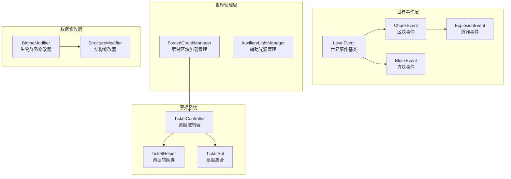
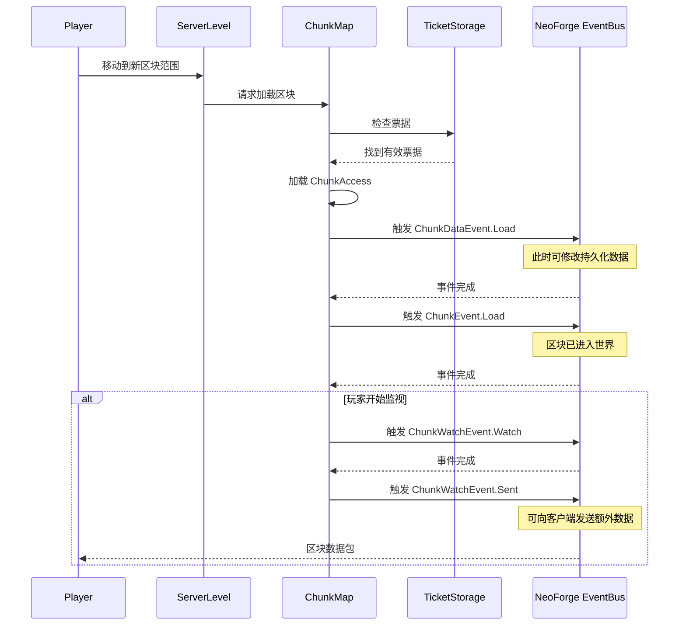
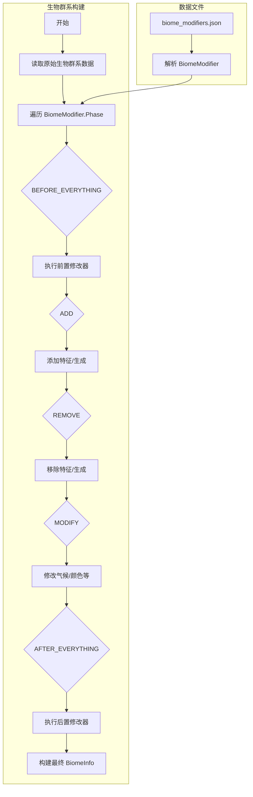

# 世界与区块系统

## 目录

- [1. 系统概述](#1-系统概述)
- [2. 世界事件系统](#2-世界事件系统)
  - [2.1 LevelEvent - 世界事件基类](#21-levelevent---世界事件基类)
  - [2.2 ChunkEvent - 区块事件](#22-chunkevent---区块事件)
  - [2.3 ChunkDataEvent - 区块数据事件](#23-chunkdataevent---区块数据事件)
  - [2.4 ChunkWatchEvent - 区块监视事件](#24-chunkwatchevent---区块监视事件)
  - [2.5 BlockEvent - 方块事件](#25-blockevent---方块事件)
  - [2.6 ExplosionEvent - 爆炸事件](#26-explosionevent---爆炸事件)
  - [2.7 GameRuleChangedEvent - 游戏规则变更](#27-gamerulechangedevent---游戏规则变更)
- [3. 世界管理器](#3-世界管理器)
  - [3.1 ForcedChunkManager - 强制加载区块管理](#31-forcedchunkmanager---强制加载区块管理)
  - [3.2 TicketController 与 TicketHelper - 票据系统](#32-ticketcontroller-与-tickethelper---票据系统)
  - [3.3 AuxiliaryLightManager - 辅助光源管理](#33-auxiliarylightmanager---辅助光源管理)
- [4. 生物群系与结构修改系统](#4-生物群系与结构修改系统)
  - [4.1 BiomeModifier - 生物群系修改器接口](#41-biomemodifier---生物群系修改器接口)
  - [4.2 BiomeModifiers - 内置生物群系修改器实现](#42-biomemodifiers---内置生物群系修改器实现)
  - [4.3 StructureModifier - 结构修改器](#43-structuremodifier---结构修改器)
- [5. 工作流程图](#5-工作流程图)
  - [5.1 区块加载流程](#51-区块加载流程)
  - [5.2 生物群系修改流程](#52-生物群系修改流程)
  - [5.3 强制区块加载流程](#53-强制区块加载流程)
- [6. API 使用示例](#6-api-使用示例)
  - [6.1 监听区块加载事件](#61-监听区块加载事件)
  - [6.2 注册强制加载票据控制器](#62-注册强制加载票据控制器)
  - [6.3 使用生物群系修改器](#63-使用生物群系修改器)
  - [6.4 方块破坏事件处理](#64-方块破坏事件处理)
- [7. 与其他系统交互](#7-与其他系统交互)
- [8. 总结](#8-总结)

---

## 1. 系统概述

NeoForge 1.21.x 的世界与区块系统是模组开发中最重要的子系统之一，它负责管理 Minecraft 世界的生命周期、区块的加载与卸载、生物群系修改以及动态光源控制等核心功能。

**关键术语解释：**

- **LevelEvent**：世界级别事件的抽象基类，涵盖世界的加载、卸载、保存等生命周期事件
- **ChunkTicket**：区块加载票据，用于控制区块的加载状态和 Tick 行为
- **BiomeModifier**：生物群系修改器，通过数据驱动的方式修改生物群系的生成属性
- **StructureModifier**：结构修改器，用于修改结构的生成和生物生成规则

**系统架构概览：**



---

## 2. 世界事件系统

世界事件系统为模组提供了拦截和响应世界级操作的能力。所有事件都通过 NeoForge 的主事件总线（`NeoForge#EVENT_BUS`）分发。

### 2.1 LevelEvent - 世界事件基类

`LevelEvent` 是所有世界相关事件的抽象基类，继承自 `Event`。

```java
// 源码路径: event/level/LevelEvent.java
public abstract class LevelEvent extends Event {
    private final LevelAccessor level;

    public LevelEvent(LevelAccessor level) {
        this.level = level;
    }

    public LevelAccessor getLevel() {
        return level;
    }
}
```

**子类事件列表：**

| 事件类 | 触发时机 | 可取消 | 触发侧 |
|--------|----------|--------|--------|
| `Load` | 世界加载时 | 否 | 双方 |
| `Unload` | 世界卸载时 | 否 | 双方 |
| `Save` | 世界保存时 | 否 | 服务器 |
| `CreateSpawnPosition` | 选择出生位置时 | 是 | 服务器 |
| `PotentialSpawns` | 计算潜在实体生成时 | 是 | 服务器 |

### 2.2 ChunkEvent - 区块事件

`ChunkEvent` 继承自 `LevelEvent`，专门处理区块相关的生命周期事件。

```java
// 源码路径: event/level/ChunkEvent.java
public abstract class ChunkEvent<T extends ChunkAccess> extends LevelEvent {
    private final T chunk;

    public ChunkEvent(T chunk) {
        super(chunk.getLevel());
        this.chunk = chunk;
    }

    public T getChunk() {
        return chunk;
    }
}
```

**子类事件：**

| 事件类 | 触发时机 | 关键方法 |
|--------|----------|----------|
| `Load` | 区块加载完成时 | `isNewChunk()` - 判断是否新生成 |
| `Unload` | 区块卸载前 | - |

### 2.3 ChunkDataEvent - 区块数据事件

`ChunkDataEvent` 处理区块数据的序列化/反序列化，提供访问 `SerializableChunkData` 的能力。

```java
// 源码路径: event/level/ChunkDataEvent.java
public abstract class ChunkDataEvent extends ChunkEvent<ChunkAccess> {
    private final SerializableChunkData data;

    public SerializableChunkData getData() {
        return data;
    }
}
```

**子类事件：**

| 事件类 | 触发时机 | 用途 |
|--------|----------|------|
| `Load` | 从磁盘加载数据时 | 修改区块的持久化数据 |
| `Save` | 保存区块数据时 | 在保存前修改数据 |

### 2.4 ChunkWatchEvent - 区块监视事件

`ChunkWatchEvent` 专门处理玩家监视区块的状态变化，**仅在服务器端触发**。

```java
// 源码路径: event/level/ChunkWatchEvent.java
public abstract class ChunkWatchEvent extends Event {
    private final ServerLevel level;
    private final ServerPlayer player;
    private final ChunkPos pos;
    
    // ...
}
```

**子类事件：**

| 事件类 | 触发时机 | 注意事项 |
|--------|----------|----------|
| `Watch` | 玩家开始监视区块时 | 不能在此发送数据给客户端 |
| `Sent` | 区块数据发送给客户端时 | 可安全发送额外数据 |
| `UnWatch` | 玩家停止监视区块时 | 区块可能从未发送到客户端 |

### 2.5 BlockEvent - 方块事件

`BlockEvent` 是方块相关事件的总基类，提供了丰富的方块交互钩子。

```java
// 源码路径: event/level/BlockEvent.java
public abstract class BlockEvent extends Event {
    private final LevelAccessor level;
    private final BlockPos pos;
    private final BlockState state;
}
```

**重要子类事件：**

| 事件类 | 用途 | 可取消 |
|--------|------|--------|
| `BreakEvent` | 玩家尝试破坏方块 | 是 |
| `EntityPlaceEvent` | 实体放置方块 | 是 |
| `EntityMultiPlaceEvent` | 实体放置多个方块 | 是 |
| `NeighborNotifyEvent` | 相邻方块通知更新 | 是 |
| `FluidPlaceBlockEvent` | 流体放置方块 | 是 |
| `FarmlandTrampleEvent` | 耕地被践踏 | 是 |
| `PortalSpawnEvent` | 地狱门生成 | 是 |
| `BlockToolModificationEvent` | 工具修改方块状态 | 是 |

### 2.6 ExplosionEvent - 爆炸事件

`ExplosionEvent` 提供了对爆炸过程的精细控制。

```java
// 源码路径: event/level/ExplosionEvent.java
public abstract class ExplosionEvent extends Event {
    private final Level level;
    private final ServerExplosion explosion;
}
```

**子类事件：**

| 事件类 | 触发时机 | 特性 |
|--------|----------|------|
| `Start` | 爆炸发生前 | 可取消，阻止爆炸 |
| `Detonate` | 爆炸计算受影响方块/实体后 | 可修改受影响列表 |

### 2.7 GameRuleChangedEvent - 游戏规则变更

`GameRuleChangedEvent` 在游戏规则值变更时触发，提供类型安全的值访问。

```java
// 源码路径: event/level/GameRuleChangedEvent.java
public final class GameRuleChangedEvent extends Event {
    private final MinecraftServer server;
    private final GameRule<?> gameRule;
    private final Object newValue;
    
    public <T> void runIfMatching(GameRule<T> gameRule, Consumer<T> action) {
        if (this.gameRule == gameRule) {
            action.accept((T) newValue);
        }
    }
}
```

---

## 3. 世界管理器

### 3.1 ForcedChunkManager - 强制加载区块管理

`ForcedChunkManager` 是 NeoForge 区块强制加载系统的核心，负责管理区块加载票据的生命周期。

```java
// 源码路径: common/world/chunk/ForcedChunkManager.java
public class ForcedChunkManager {
    private static Map<Identifier, TicketController> controllers = Map.of();
    
    public static synchronized void init() {
        // 初始化所有注册的票据控制器
    }
    
    public static boolean hasForcedChunks(ServerLevel level) {
        TicketStorage data = level.getDataStorage().get(TicketStorage.TYPE);
        return !data.getBlockForcedChunks().isEmpty() || 
               !data.getEntityForcedChunks().isEmpty();
    }
}
```

**核心功能：**

1. **票据控制器注册**：通过 `RegisterTicketControllersEvent` 注册
2. **票据激活/停用**：世界关闭时停用票据，重启时激活
3. **持久化存储**：将票据数据保存到世界存档

### 3.2 TicketController 与 TicketHelper - 票据系统

**TicketController** 是模组注册区块加载票据的入口点：

```java
// 源码路径: common/world/chunk/TicketController.java
public record TicketController(Identifier id, @Nullable LoadingValidationCallback callback) {
    public boolean forceChunk(ServerLevel level, BlockPos owner, 
                              int chunkX, int chunkZ, 
                              boolean add, boolean forceNaturalSpawning) {
        return ForcedChunkManager.forceChunk(level, id, owner, 
            chunkX, chunkZ, add, forceNaturalSpawning, 
            TicketStorage::getBlockForcedChunks);
    }
}
```

**TicketHelper** 提供了在票据激活前验证和清理票据的能力：

```java
// 源码路径: common/world/chunk/TicketHelper.java
public class TicketHelper {
    public void removeAllTickets(BlockPos owner) {
        // 移除特定 BlockPos 持有的所有票据
    }
    
    public void removeTicket(BlockPos owner, long chunk, boolean forceNaturalSpawning) {
        // 移除特定方块持有的特定区块票据
    }
}
```

**票据类型：**

| 类型 | 所有者 | 用途 |
|------|--------|------|
| 普通票据 | BlockPos/UUID | 保持区块加载 |
| 自然生成票据 | BlockPos/UUID | 允许在无玩家时生成实体 |

### 3.3 AuxiliaryLightManager - 辅助光源管理

`AuxiliaryLightManager` 允许 BlockEntity 控制动态光源，如萤石、红石灯等。

```java
// 源码路径: common/world/AuxiliaryLightManager.java
public interface AuxiliaryLightManager {
    void setLightAt(BlockPos pos, int value);
    default void removeLightAt(BlockPos pos) { setLightAt(pos, 0); }
    int getLightAt(BlockPos pos);
}
```

---

## 4. 生物群系与结构修改系统

### 4.1 BiomeModifier - 生物群系修改器接口

`BiomeModifier` 是数据驱动的生物群系修改系统核心接口。

```java
// 源码路径: common/world/BiomeModifier.java
public interface BiomeModifier {
    Codec<BiomeModifier> DIRECT_CODEC = ...;
    Codec<Holder<BiomeModifier>> REFERENCE_CODEC = ...;
    Codec<HolderSet<BiomeModifier>> LIST_CODEC = ...;
    
    void modify(Holder<Biome> biome, Phase phase, ModifiableBiomeInfo.BiomeInfo.Builder builder);
    
    MapCodec<? extends BiomeModifier> codec();
    
    enum Phase {
        BEFORE_EVERYTHING,  // 前置处理
        ADD,                // 添加内容
        REMOVE,             // 移除内容
        MODIFY,             // 修改属性
        AFTER_EVERYTHING    // 后置处理
    }
}
```

### 4.2 BiomeModifiers - 内置生物群系修改器实现

NeoForge 提供了多种内置生物群系修改器：

```java
// 源码路径: common/world/BiomeModifiers.java
public final class BiomeModifiers {
    // 1. 添加特征
    public record AddFeaturesBiomeModifier(
        HolderSet<Biome> biomes, 
        HolderSet<PlacedFeature> features,
        Decoration step
    ) implements BiomeModifier { ... }
    
    // 2. 移除特征
    public record RemoveFeaturesBiomeModifier(
        HolderSet<Biome> biomes, 
        HolderSet<PlacedFeature> features,
        Set<Decoration> steps
    ) implements BiomeModifier { ... }
    
    // 3. 添加生物生成
    public record AddSpawnsBiomeModifier(
        HolderSet<Biome> biomes, 
        WeightedList<SpawnerData> spawners
    ) implements BiomeModifier { ... }
    
    // 4. 移除生物生成
    public record RemoveSpawnsBiomeModifier(
        HolderSet<Biome> biomes,
        HolderSet<EntityType<?>> entityTypes
    ) implements BiomeModifier { ... }
    
    // 5. 添加洞穴雕刻器
    public record AddCarversBiomeModifier(...) { ... }
    
    // 6. 移除洞穴雕刻器
    public record RemoveCarversBiomeModifier(...) { ... }
    
    // 7. 添加生成成本
    public record AddSpawnCostsBiomeModifier(...) { ... }
    
    // 8. 移除生成成本
    public record RemoveSpawnCostsBiomeModifier(...) { ... }
}
```

### 4.3 StructureModifier - 结构修改器

`StructureModifier` 提供了修改结构生成设置的能力。

```java
// 源码路径: common/world/StructureModifier.java
public interface StructureModifier {
    void modify(Holder<Structure> structure, Phase phase, 
                ModifiableStructureInfo.StructureInfo.Builder builder);
    
    MapCodec<? extends StructureModifier> codec();
}
```

---

## 5. 工作流程图

### 5.1 区块加载流程



### 5.2 生物群系修改流程



### 5.3 强制区块加载流程

```mermaid
flowchart TB
    subgraph "注册阶段"
        A[模组初始化] --> B[RegisterTicketControllersEvent]
        B --> C[注册 TicketController]
        C --> D[ForcedChunkManager.init]
    end
    
    subgraph "强制加载"
        E[调用 forceChunk true] --> F{检查控制器注册}
        F -->|已注册| G[添加到 TicketTracker]
        F -->|未注册| H[抛出异常]
        G --> I[添加到 TicketStorage]
        I --> J[调用 level.getChunk]
        J --> K[区块开始加载]
    end
    
    subgraph "取消强制"
        L[调用 forceChunk false] --> M[从 TicketTracker 移除]
        M --> N[从 TicketStorage 移除票据]
        N --> O{还有其他票据?}
        O -->|否| P[区块开始卸载]
        O -->|是| Q[区块保持加载]
    end
    
    subgraph "持久化"
        R[世界关闭] --> S[停用所有票据]
        S --> T[保存到 level.dat]
        U[世界加载] --> V[读取票据数据]
        V --> W[激活验证回调]
        W --> X[validateTickets]
        X --> Y[激活票据]
    end
```



---

## 6. API 使用示例

### 6.1 监听区块加载事件

```java
import net.neoforged.bus.api.SubscribeEvent;
import net.neoforged.neoforge.event.level.ChunkEvent;
import net.neoforged.neoforge.event.level.ChunkWatchEvent;
import net.neoforged.neoforge.common.NeoForge;

public class ChunkEventExample {
    public void init() {
        NeoForge.EVENT_BUS.register(this);
    }
    
    @SubscribeEvent
    public void onChunkLoad(ChunkEvent.Load event) {
        // 获取区块
        var chunk = event.getChunk();
        var level = event.getLevel();
        
        // 判断是否新生成的区块
        if (event.isNewChunk()) {
            System.out.println("新生成的区块: " + chunk.getPos());
        } else {
            System.out.println("从磁盘加载的区块: " + chunk.getPos());
        }
    }
    
    @SubscribeEvent
    public void onChunkUnload(ChunkEvent.Unload event) {
        System.out.println("区块卸载: " + event.getChunk().getPos());
    }
    
    @SubscribeEvent
    public void onChunkWatch(ChunkWatchEvent.Watch event) {
        var player = event.getPlayer();
        var chunk = event.getChunk();
        System.out.println(player.getName() + " 开始监视区块 " + chunk.getPos());
    }
    
    @SubscribeEvent
    public void onChunkSent(ChunkWatchEvent.Sent event) {
        // 可以在这里发送自定义数据包到客户端
        // sendCustomDataPacket(event.getPlayer(), event.getChunk());
    }
}
```

### 6.2 注册强制加载票据控制器

```java
import net.minecraft.core.BlockPos;
import net.minecraft.resources.Identifier;
import net.minecraft.server.level.ServerLevel;
import net.neoforged.fml.event.imc.ForcedChunkIMCEvent;
import net.neoforged.neoforge.common.world.chunk.LoadingValidationCallback;
import net.neoforged.neoforge.common.world.chunk.RegisterTicketControllersEvent;
import net.neoforged.neoforge.common.world.chunk.TicketController;
import net.neoforged.neoforge.common.world.chunk.TicketHelper;

public class ForcedChunkExample {
    private static final Identifier MY_MOD_CONTROLLER = 
        new Identifier("mymod", "main_controller");
    
    public void init() {
        // 在 mod 初始化时注册控制器
        // 通常在 CommonSetup 或 ModBus 事件中
    }
    
    public static void registerControllers(RegisterTicketControllersEvent event) {
        event.register(new TicketController(MY_MOD_CONTROLLER, new ValidationCallback()));
    }
    
    // 强制加载区块
    public static void forceChunkAt(ServerLevel level, BlockPos owner, int chunkX, int chunkZ) {
        TicketController controller = new TicketController(MY_MOD_CONTROLLER);
        
        // 强制加载并允许自然生成
        boolean success = controller.forceChunk(
            level, owner, chunkX, chunkZ, 
            true,  // add = true 表示加载
            true   // forceNaturalSpawning = true
        );
        
        System.out.println("强制加载结果: " + success);
    }
    
    // 取消强制加载
    public static void unforceChunk(ServerLevel level, BlockPos owner, int chunkX, int chunkZ) {
        TicketController controller = new TicketController(MY_MOD_CONTROLLER);
        controller.forceChunk(level, owner, chunkX, chunkZ, false, true);
    }
    
    // 验证回调实现
    static class ValidationCallback implements LoadingValidationCallback {
        @Override
        public void validateTickets(ServerLevel level, TicketHelper ticketHelper) {
            // 检查所有票据是否仍然有效
            for (var entry : ticketHelper.getBlockTickets().entrySet()) {
                BlockPos owner = entry.getKey();
                
                // 示例：移除过远的票据
                if (isOutOfRange(owner)) {
                    entry.getValue().normal().forEach(chunk -> {
                        ticketHelper.removeTicket(owner, chunk, false);
                    });
                }
            }
        }
        
        private boolean isOutOfRange(BlockPos pos) {
            // 自定义范围检查逻辑
            return false;
        }
    }
}
```

### 6.3 使用生物群系修改器

**通过 JSON 数据包使用：**

```json
{
  "type": "mymod:custom_biome_modifier",
  "biomes": "#minecraft:is_desert",
  "features": "mymod:rare_ore_vein",
  "step": "underground_ores"
}
```

**编程式创建修改器：**

```java
import net.minecraft.core.HolderSet;
import net.minecraft.core.Registry;
import net.minecraft.resources.ResourceKey;
import net.minecraft.world.entity.EntityType;
import net.minecraft.world.level.biome.Biome;
import net.minecraft.world.level.levelgen.GenerationStep.Decoration;
import net.neoforged.neoforge.common.world.BiomeModifiers;

public class BiomeModifierExample {
    public void addSpawnsToBiome(ServerLevel level) {
        Registry<Biome> biomeRegistry = level.registryAccess()
            .registryOrThrow(Registry.BIOME_REGISTRY);
        
        HolderSet<Biome> targetBiomes = biomeRegistry.getOrCreateTag(
            ResourceKey.create(Registry.BIOME_REGISTRY, 
                new Identifier("minecraft", "is_forest"))
        );
        
        // 创建添加生成的修改器
        var spawner = BiomeModifiers.AddSpawnsBiomeModifier.singleSpawn(
            targetBiomes,
            Weighted.of(
                new MobSpawnSettings.SpawnerData(
                    EntityType.WOLF, 100, 2, 4
                ), 1
            )
        );
        
        // 应用修改器
        // 这通常由 NeoForge 自动处理
    }
}
```

### 6.4 方块破坏事件处理

```java
import net.minecraft.core.BlockPos;
import net.minecraft.world.entity.player.Player;
import net.minecraft.world.level.Level;
import net.neoforged.bus.api.SubscribeEvent;
import net.neoforged.neoforge.event.level.BlockEvent;

public class BlockEventExample {
    @SubscribeEvent
    public void onBlockBreak(BlockEvent.BreakEvent event) {
        Level level = event.getLevel();
        BlockPos pos = event.getPos();
        Player player = event.getPlayer();
        
        // 检查是否允许破坏
        if (!canPlayerBreakBlock(player, pos)) {
            event.setCanceled(true);
            return;
        }
        
        // 自定义掉落逻辑
        // dropCustomLoot(level, pos, event.getState());
    }
    
    @SubscribeEvent
    public void onBlockPlace(BlockEvent.EntityPlaceEvent event) {
        // 验证方块放置是否合法
        if (!isValidPlacement(event)) {
            event.setCanceled(true);
        }
    }
    
    @SubscribeEvent
    public void onNeighborNotify(BlockEvent.NeighborNotifyEvent event) {
        // 监听红石更新等邻居通知
        var notifiedSides = event.getNotifiedSides();
        
        // 可以修改被通知的侧面
        // notifiedSides.add(Direction.DOWN);
    }
    
    @SubscribeEvent
    public void onExplosion(ExplosionEvent.Detonate event) {
        // 修改爆炸影响的方块和实体
        var blocks = event.getAffectedBlocks();
        var entities = event.getAffectedEntities();
        
        // 移除某些方块
        blocks.removeIf(pos -> isProtectedBlock(pos));
        
        // 添加额外伤害
        entities.forEach(entity -> {
            entity.hurt(entity.damageSources().explosion(null), 2.0f);
        });
    }
}
```

---

## 7. 与其他系统交互

世界与区块系统与其他 NeoForge 系统存在紧密集成：

**1. 与数据附件系统（Data Attachment）的集成：**

```java
// ChunkDataEvent 可与数据附件配合使用
@SubscribeEvent
public void onChunkDataLoad(ChunkDataEvent.Load event) {
    // 通过数据附件 API 访问/修改区块数据
    ChunkAccess chunk = event.getChunk();
    // chunk.getData(MyAttachmentKey.KEY);
}
```

**2. 与世界事件总线的集成：**

所有世界事件都通过 `NeoForge.EVENT_BUS` 分发，支持 `@SubscribeEvent` 注解注册监听器。

**3. 与票据存储系统的集成：**

`ForcedChunkManager` 通过 `TicketStorage` 与 Minecraft 原生的区块加载系统交互，将自定义票据与游戏原生票据统一管理。

**4. 与数据包系统的集成：**

`BiomeModifier` 和 `StructureModifier` 支持通过数据包 JSON 定义，使得非代码模组也能修改世界生成。

---

## 8. 总结

NeoForge 1.21.x 的世界与区块系统提供了强大而灵活的世界管理能力：

**核心价值：**

1. **完整的事件钩子**：从世界加载到区块卸载，从方块交互到爆炸计算，都有完善的事件支持
2. **数据驱动的修改**：通过 `BiomeModifier` 和 `StructureModifier`，可以在数据包中定义世界修改，无需编写代码
3. **灵活的票据系统**：`TicketController` 和 `ForcedChunkManager` 提供了可控的区块强制加载能力
4. **持久化支持**：所有状态都可以正确保存和恢复，确保模组数据在服务器重启后不丢失

**设计亮点：**

- 使用接口+枚举的模式（如 `BiomeModifier` + `Phase`）实现灵活的多阶段修改
- 票据系统支持细粒度的权限控制（BlockPos/UUID 所有者）
- 验证回调机制允许模组在票据重新激活时进行清理
- 所有事件都标注了触发侧（服务器/客户端/双方），便于开发者理解

---

**课后自查：**

1. `ChunkEvent.Load` 和 `ChunkWatchEvent.Watch` 的区别是什么？
2. 如何使用 `TicketController` 实现模组的强制区块加载？
3. `BiomeModifier.Phase` 的执行顺序是什么？
4. 为什么 `ChunkWatchEvent.Watch` 不能向客户端发送数据，而 `ChunkWatchEvent.Sent` 可以？
5. 如何在 `GameRuleChangedEvent` 中安全地获取新值？
