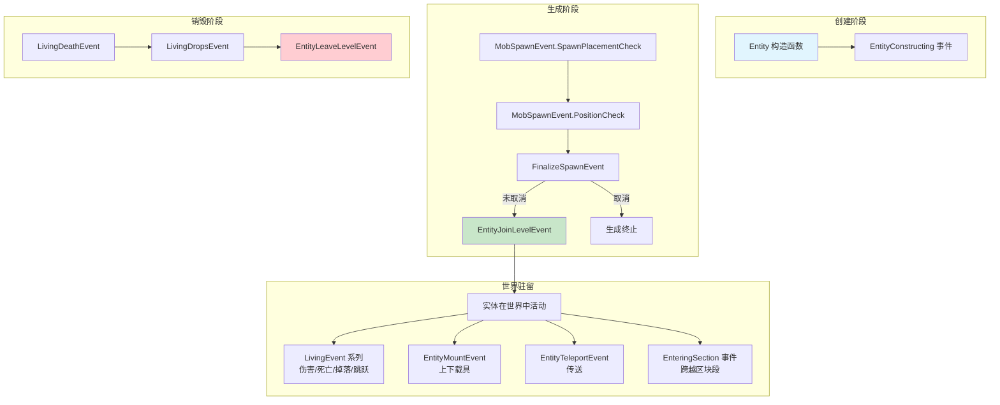
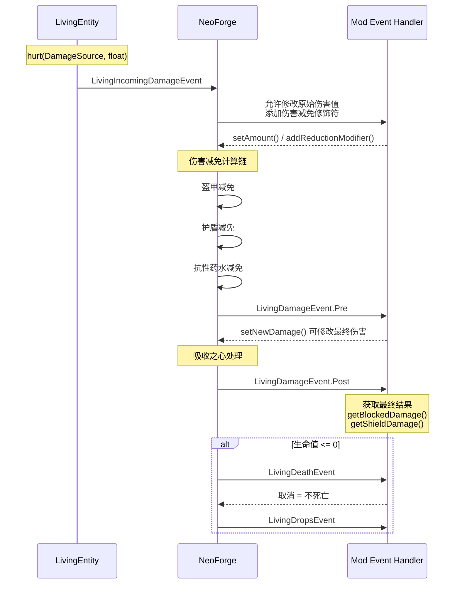
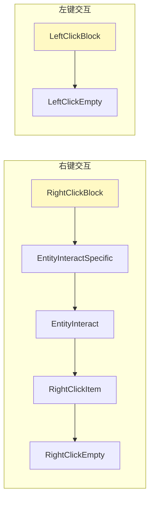

# 实体与生物系统

## 目录

- [1. 系统概述](#1-系统概述)
- [2. 实体事件](#2-实体事件)
  - [2.1 EntityEvent 基类](#21-entityevent-基类)
  - [2.2 EntityJoinLevelEvent](#22-entityjoinlevelevent)
  - [2.3 EntityLeaveLevelEvent](#23-entityleavelevelevent)
  - [2.4 EntityMountEvent](#24-entitymountevent)
  - [2.5 EntityTeleportEvent](#25-entityteleportevent)
  - [2.6 MobSpawnEvent](#26-mobspawnevent)
  - [2.7 FinalizeSpawnEvent](#27-finalizespawnevent)
- [3. 生物（Living）事件](#3-生物living事件)
  - [3.1 LivingEvent 基类](#31-livingevent-基类)
  - [3.2 LivingIncomingDamageEvent](#32-livingincomingdamageevent)
  - [3.3 LivingDamageEvent](#33-livingdamageevent)
  - [3.4 LivingDeathEvent](#34-livingdeathevent)
  - [3.5 LivingDropsEvent](#35-livingdropsevent)
  - [3.6 LivingEquipmentChangeEvent](#36-livingequipmentchangeevent)
  - [3.7 LivingFallEvent](#37-livingfallentevent)
- [4. 玩家事件](#4-玩家事件)
  - [4.1 PlayerEvent 基类](#41-playerevent-基类)
  - [4.2 PlayerInteractEvent](#42-playerinteractevent)
  - [4.3 ItemEntityPickupEvent](#43-itementitypickupevent)
- [5. 工作流程图](#5-工作流程图)
- [6. API 使用示例](#6-api-使用示例)
- [7. 与其他系统交互](#7-与其他系统交互)
- [8. 总结](#8-总结)

## 1. 系统概述

NeoForge 的实体与生物系统是 mod 开发中最核心的事件系统之一。它采用**三层继承结构**来组织事件：

```
Event (Bus Event)
  └── EntityEvent (实体事件基类)
        └── LivingEvent (生物事件基类)
              └── PlayerEvent (玩家事件基类)
```

这种层次结构使得事件可以自然地筛选目标范围：

| 层级 | 事件类型 | 适用范围 |
|------|----------|----------|
| 实体层 | `EntityEvent` | 所有实体（玩家、生物、物品、载具等） |
| 生物层 | `LivingEvent` | 所有 `LivingEntity`（有生命的实体） |
| 玩家层 | `PlayerEvent` | 仅玩家（`Player` 实体） |

NeoForge 的事件系统在 `NeoForge#EVENT_BUS`（主事件总线）上广播，遵循 **NeoBus** 的订阅机制。以下是事件系统的核心设计原则：

1. **可取消性**：`ICancellableEvent` 接口允许取消大多数事件
2. **双向通信**：事件在客户端和服务端同时触发（除特定服务端专用事件外）
3. **数据容器**：`DamageContainer` 等数据结构封装复杂的状态链

---

## 2. 实体事件

### 2.1 EntityEvent 基类

`EntityEvent` 是所有实体相关事件的抽象基类，位于 `net.neoforged.neoforge.event.entity` 包。

**源码路径**：`D:\Minecraft-Learning\assets\NeoForge-1.21.x\src\main\java\net\neoforged\neoforge\event\entity\EntityEvent.java`

```1:32:assets/NeoForge-1.21.x/src/main/java/net/neoforged/neoforge/event/entity/EntityEvent.java
public abstract class EntityEvent extends Event {
    private final Entity entity;

    public EntityEvent(Entity entity) {
        this.entity = entity;
    }

    public Entity getEntity() {
        return entity;
    }
    // ...
}
```

`EntityEvent` 包含三个内部事件类：

| 内部类 | 触发时机 | 可取消 |
|--------|----------|--------|
| `EntityConstructing` | 实体构造时（在构造函数中触发） | 否 |
| `EnteringSection` | 实体跨越 16x16x16 区块段时 | 否 |
| `Size` | 实体姿势（`Pose`）改变时，用于修改碰撞箱尺寸 | 否 |

```126:157:assets/NeoForge-1.21.x/src/main/java/net/neoforged/neoforge/event/entity/EntityEvent.java
    public static class Size extends EntityEvent {
        private final Pose pose;
        private final EntityDimensions oldSize;
        private EntityDimensions newSize;

        public void setNewSize(EntityDimensions size) {
            this.newSize = size;
        }
    }
```

### 2.2 EntityJoinLevelEvent

**源码路径**：`D:\Minecraft-Learning\assets\NeoForge-1.21.x\src\main\java\net\neoforged\neoforge\event\entity\EntityJoinLevelEvent.java`

当实体加入世界时触发，可取消（取消后实体不会加入世界）。

```30:58:assets/NeoForge-1.21.x/src/main/java/net/neoforged/neoforge/event/entity/EntityJoinLevelEvent.java
public class EntityJoinLevelEvent extends EntityEvent implements ICancellableEvent {
    private final Level level;
    private final boolean loadedFromDisk;

    public Level getLevel() {
        return level;
    }

    public boolean loadedFromDisk() {
        return loadedFromDisk;
    }
}
```

**关键特性**：

- `loadedFromDisk()` 标识实体是否从存档加载（客户端始终返回 `false`）
- **警告**：事件触发时底层区块可能尚未加载到 `FULL` 状态，直接访问区块数据可能导致死锁

### 2.3 EntityLeaveLevelEvent

**源码路径**：`D:\Minecraft-Learning\assets\NeoForge-1.21.x\src\main\java\net\neoforged\neoforge\event\entity\EntityLeaveLevelEvent.java`

当实体离开世界时触发，不可取消。

```22:36:assets/NeoForge-1.21.x/src/main/java/net/neoforged/neoforge/event/entity/EntityLeaveLevelEvent.java
public class EntityLeaveLevelEvent extends EntityEvent {
    private final Level level;

    public Level getLevel() {
        return level;
    }
}
```

### 2.4 EntityMountEvent

**源码路径**：`D:\Minecraft-Learning\assets\NeoForge-1.21.x\src\main\java\net\neoforged\neoforge\event\entity\EntityMountEvent.java`

当实体上下载具时触发，可取消。

```25:59:assets/NeoForge-1.21.x/src/main/java/net/neoforged/neoforge/event/entity/EntityMountEvent.java
public class EntityMountEvent extends EntityEvent implements ICancellableEvent {
    private final Entity entityMounting;
    private final Entity entityBeingMounted;
    private final Level level;
    private final boolean isMounting;

    public boolean isMounting() { return isMounting; }
    public boolean isDismounting() { return !isMounting; }
    public Entity getEntityMounting() { return entityMounting; }
    public Entity getEntityBeingMounted() { return entityBeingMounted; }
}
```

### 2.5 EntityTeleportEvent

**源码路径**：`D:\Minecraft-Learning\assets\NeoForge-1.21.x\src\main\java\net\neoforged\neoforge\event\entity\EntityTeleportEvent.java`

传送事件有多个子事件，针对不同的传送场景：

| 子事件 | 触发场景 |
|--------|----------|
| `TeleportCommand` | `/tp` 命令触发 |
| `SpreadPlayersCommand` | `/spreadplayers` 命令触发 |
| `EnderEntity` | 末影人/潜影盒随机传送 |
| `EnderPearl` | 玩家使用末影珍珠 |
| `ItemConsumption` | 玩家使用紫颂果 |

```32:86:assets/NeoForge-1.21.x/src/main/java/net/neoforged/neoforge/event/entity/EntityTeleportEvent.java
public class EntityTeleportEvent extends EntityEvent implements ICancellableEvent {
    protected double targetX, targetY, targetZ;

    public Vec3 getTarget() {
        return new Vec3(this.targetX, this.targetY, this.targetZ);
    }

    public Vec3 getPrev() {
        return getEntity().position();
    }
}
```

### 2.6 MobSpawnEvent

**源码路径**：`D:\Minecraft-Learning\assets\NeoForge-1.21.x\src\main\java\net\neoforged\neoforge\event\entity\living\MobSpawnEvent.java`

生物生成事件的容器，包含两个核心子事件：

```99:218:assets/NeoForge-1.21.x/src/main/java/net/neoforged/neoforge/event/entity/living/MobSpawnEvent.java
    public static class SpawnPlacementCheck extends Event {
        // 检查生物生成规则（光照、史莱姆区块等）
        // 使用 Result: SUCCEED / DEFAULT / FAIL
    }

    public static class PositionCheck extends MobSpawnEvent {
        // 检查生成位置（障碍物、路径、海洋生物群系等）
        // 使用 Result: SUCCEED / DEFAULT / FAIL
    }
```

### 2.7 FinalizeSpawnEvent

**源码路径**：`D:\Minecraft-Learning\assets\NeoForge-1.21.x\src\main\java\net\neoforged\neoforge\event\entity\living\FinalizeSpawnEvent.java`

生物生成的最终阶段事件，允许修改难度实例和生成数据。

```40:147:assets/NeoForge-1.21.x/src/main/java/net/neoforged/neoforge/event/entity/living/FinalizeSpawnEvent.java
public class FinalizeSpawnEvent extends MobSpawnEvent implements ICancellableEvent {
    private DifficultyInstance difficulty;
    @Nullable private SpawnGroupData spawnData;

    public void setDifficulty(DifficultyInstance inst) { ... }
    public void setSpawnData(@Nullable SpawnGroupData data) { ... }
    public void setSpawnCancelled(boolean cancel) { ... }  // 真正取消生成
}
```

**重要**：`setSpawnCancelled()` 是真正阻止生成的唯一方法，单纯取消事件只阻止 `finalizeSpawn` 调用。

---

## 3. 生物（Living）事件

### 3.1 LivingEvent 基类

**源码路径**：`D:\Minecraft-Learning\assets\NeoForge-1.21.x\src\main\java\net\neoforged\neoforge\event\entity\living\LivingEvent.java`

所有 `LivingEntity`（有生命实体）事件的基类，包含两个内部事件：

```21:100:assets/NeoForge-1.21.x/src/main/java/net/neoforged/neoforge/event/entity/living/LivingEvent.java
public abstract class LivingEvent extends EntityEvent {
    private final LivingEntity livingEntity;

    public static class LivingJumpEvent extends LivingEvent {
        // 实体跳跃时触发
    }

    public static class LivingVisibilityEvent extends LivingEvent {
        private double visibilityModifier;
        
        public void modifyVisibility(double mod) {
            visibilityModifier *= mod;
        }
    }
}
```

### 3.2 LivingIncomingDamageEvent

**源码路径**：`D:\Minecraft-Learning\assets\NeoForge-1.21.x\src\main\java\net\neoforged\neoforge\event\entity\living\LivingIncomingDamageEvent.java`

伤害流程的**第一阶段**，在无敌时间检查后、伤害处理之前触发。

```28:87:assets/NeoForge-1.21.x/src/main/java/net/neoforged/neoforge/event/entity/living/LivingIncomingDamageEvent.java
public class LivingIncomingDamageEvent extends LivingEvent implements ICancellableEvent {
    private final DamageContainer container;

    public float getAmount() { return container.getNewDamage(); }
    public float getOriginalAmount() { return container.getOriginalDamage(); }
    public void setAmount(float newDamage) { container.setNewDamage(newDamage); }
    
    public void addReductionModifier(DamageContainer.Reduction type, IReductionFunction reductionFunc) {
        container.addModifier(type, reductionFunc);
    }
}
```

**关键特性**：可以修改最终伤害值，并添加自定义的伤害减免修正函数。

### 3.3 LivingDamageEvent

**源码路径**：`D:\Minecraft-Learning\assets\NeoForge-1.21.x\src\main\java\net\neoforged\neoforge\event\entity\living\LivingDamageEvent.java`

伤害流程的**第二阶段**，装甲和药水效果已经应用。

```29:156:assets/NeoForge-1.21.x/src/main/java/net/neoforged/neoforge/event/entity/living/LivingDamageEvent.java
public abstract class LivingDamageEvent extends LivingEvent {
    public static class Pre extends LivingDamageEvent {
        private final DamageContainer container;
        // 可修改 container 中的 newDamage
        public void setNewDamage(float newDamage) { ... }
    }

    public static class Post extends LivingDamageEvent {
        private final float originalDamage, newDamage, blockedDamage, shieldDamage;
        private final EnumMap<DamageContainer.Reduction, Float> reductions;
        
        public float getReduction(DamageContainer.Reduction reduction) { ... }
    }
}
```

### 3.4 LivingDeathEvent

**源码路径**：`D:\Minecraft-Learning\assets\NeoForge-1.21.x\src\main\java\net\neoforged\neoforge\event\entity\living\LivingDeathEvent.java`

生物死亡事件，可取消（取消后生物不会死亡）。

```32:43:assets/NeoForge-1.21.x/src/main/java/net/neoforged/neoforge/event/entity/living/LivingDeathEvent.java
public class LivingDeathEvent extends LivingEvent implements ICancellableEvent {
    private final DamageSource source;

    public DamageSource getSource() {
        return source;
    }
}
```

### 3.5 LivingDropsEvent

**源码路径**：`D:\Minecraft-Learning\assets\NeoForge-1.21.x\src\main\java\net\neoforged\neoforge\event\entity\living\LivingDropsEvent.java`

生物死亡掉落物品事件，可取消（取消后不掉落任何物品）。

```33:56:assets/NeoForge-1.21.x/src/main/java/net/neoforged/neoforge/event/entity/living/LivingDropsEvent.java
public class LivingDropsEvent extends LivingEvent implements ICancellableEvent {
    private final DamageSource source;
    private final Collection<ItemEntity> drops;
    private final boolean recentlyHit;

    public Collection<ItemEntity> getDrops() { return drops; }
    public boolean isRecentlyHit() { return recentlyHit; }
}
```

### 3.6 LivingEquipmentChangeEvent

**源码路径**：`D:\Minecraft-Learning\assets\NeoForge-1.21.x\src\main\java\net\neoforged\neoforge\event\entity\living\LivingEquipmentChangeEvent.java`

生物装备变更事件（**不可取消**），仅在服务端触发。

```28:51:assets/NeoForge-1.21.x/src/main/java/net/neoforged/neoforge/event/entity/living/LivingEquipmentChangeEvent.java
public class LivingEquipmentChangeEvent extends LivingEvent {
    private final EquipmentSlot slot;
    private final ItemStack from;
    private final ItemStack to;

    public EquipmentSlot getSlot() { return this.slot; }
    public ItemStack getFrom() { return this.from; }
    public ItemStack getTo() { return this.to; }
}
```

### 3.7 LivingFallEvent

**源码路径**：`D:\Minecraft-Learning\assets\NeoForge-1.21.x\src\main\java\net\neoforged\neoforge\event\entity\living\LivingFallEvent.java`

生物坠落事件，可取消。

```28:53:assets/NeoForge-1.21.x/src/main/java/net/neoforged/neoforge/event/entity/living/LivingFallEvent.java
public class LivingFallEvent extends LivingEvent implements ICancellableEvent {
    private double distance;
    private float damageMultiplier;

    public void setDistance(double distance) { this.distance = distance; }
    public void setDamageMultiplier(float damageMultiplier) { ... }
}
```

---

## 4. 玩家事件

### 4.1 PlayerEvent 基类

**源码路径**：`D:\Minecraft-Learning\assets\NeoForge-1.21.x\src\main\java\net\neoforged\neoforge\event\entity\player\PlayerEvent.java`

玩家事件的基类，继承自 `LivingEvent`，包含大量玩家特定子事件：

| 子事件 | 说明 |
|--------|------|
| `HarvestCheck` | 玩家采集方块检查 |
| `BreakSpeed` | 破坏速度（可取消） |
| `NameFormat` | 玩家显示名格式化 |
| `Clone` | 玩家克隆（死亡/维度切换） |
| `StartTracking` / `StopTracking` | 实体追踪开始/结束 |
| `LoadFromFile` / `SaveToFile` | 玩家数据加载/保存 |
| `ItemCraftedEvent` / `ItemSmeltedEvent` | 合成/熔炼事件 |
| `PlayerLoggedInEvent` / `PlayerLoggedOutEvent` | 登录/登出事件 |
| `PlayerRespawnEvent` | 重生事件 |
| `PlayerChangedDimensionEvent` | 维度切换事件 |
| `PlayerChangeGameModeEvent` | 游戏模式切换（可取消） |

```52:68:assets/NeoForge-1.21.x/src/main/java/net/neoforged/neoforge/event/entity/player/PlayerEvent.java
public abstract class PlayerEvent extends LivingEvent {
    private final Player player;

    @Override
    public Player getEntity() {
        return player;
    }
}
```

### 4.2 PlayerInteractEvent

**源码路径**：`D:\Minecraft-Learning\assets\NeoForge-1.21.x\src\main\java\net\neoforged\neoforge\event\entity\player\PlayerInteractEvent.java`

最复杂的玩家事件系统，包含多个交互子事件：

| 子事件 | 说明 | 可取消 |
|--------|------|--------|
| `EntityInteractSpecific` | 右键实体（指定点击位置） | 是 |
| `EntityInteract` | 右键实体（通用） | 是 |
| `RightClickBlock` | 右键方块 | 是 |
| `RightClickItem` | 右键使用物品 | 是 |
| `RightClickEmpty` | 右键空白空间 | 否 |
| `LeftClickBlock` | 左键破坏方块 | 是 |
| `LeftClickEmpty` | 左键空白空间 | 否 |

```38:49:assets/NeoForge-1.21.x/src/main/java/net/neoforged/neoforge/event/entity/player/PlayerInteractEvent.java
public abstract class PlayerInteractEvent extends PlayerEvent {
    private final InteractionHand hand;
    private final BlockPos pos;
    @Nullable private final Direction face;

    public InteractionHand getHand() { return hand; }
    public ItemStack getItemStack() { return getEntity().getItemInHand(hand); }
    public BlockPos getPos() { return pos; }
    public Level getLevel() { return getEntity().level(); }
    public LogicalSide getSide() { ... }
}
```

### 4.3 ItemEntityPickupEvent

**源码路径**：`D:\Minecraft-Learning\assets\NeoForge-1.21.x\src\main\java\net\neoforged\neoforge\event\entity\player\ItemEntityPickupEvent.java`

物品拾取事件，包含两个阶段：

```20:117:assets/NeoForge-1.21.x/src/main/java/net/neoforged/neoforge/event/entity/player/ItemEntityPickupEvent.java
public abstract class ItemEntityPickupEvent extends Event {
    public static class Pre extends ItemEntityPickupEvent {
        private TriState canPickup = TriState.DEFAULT;
        
        public void setCanPickup(TriState state) { ... }
    }

    public static class Post extends ItemEntityPickupEvent {
        private final ItemStack originalStack;
        
        public ItemStack getOriginalStack() { ... }
        public ItemStack getCurrentStack() { ... }
    }
}
```

---

## 5. 工作流程图

### 5.1 实体生命周期事件流



### 5.2 伤害处理流程



### 5.3 玩家交互事件优先级



---

## 6. API 使用示例

### 6.1 监听实体加入世界

```java
// 监听实体加入世界事件
@SubscribeEvent
public static void onEntityJoinLevel(EntityJoinLevelEvent event) {
    Entity entity = event.getEntity();
    
    // 检测特定类型实体
    if (entity.getType() == EntityType.ZOMBIE) {
        NeoForge.EVENT_BUS.post(new MyZombieSpawnedEvent((Zombie) entity));
    }
    
    // 判断是否从存档加载
    if (event.loadedFromDisk()) {
        // 实体从存档加载（世界加载时）
    }
    
    // 取消某些实体的生成
    if (shouldPreventSpawn(entity)) {
        event.setCanceled(true);
    }
}
```

### 6.2 处理生物死亡与掉落

```java
// 处理生物死亡事件
@SubscribeEvent
public static void onLivingDeath(LivingDeathEvent event) {
    LivingEntity entity = event.getEntity();
    DamageSource source = event.getSource();
    
    // 自定义死亡逻辑
    if (entity instanceof Player player) {
        LOGGER.info("玩家 {} 在 {} 处死亡", 
            player.getName().getString(),
            source.getLocalizedDeathMessage(entity).getString());
    }
    
    // 取消死亡（免疫致死）
    if (entity.getType() == EntityType.CREEPER && hasShieldEnchant(entity)) {
        event.setCanceled(true);
    }
}

// 处理掉落物品
@SubscribeEvent
public static void onLivingDrops(LivingDropsEvent event) {
    if (event.getEntity() instanceof WitherBoss) {
        // 添加自定义掉落
        ItemStack specialDrop = new ItemStack(Items.NETHER_STAR, 1);
        ItemEntity drop = new ItemEntity(
            event.getEntity().level(),
            event.getEntity().getX(),
            event.getEntity().getY(),
            event.getEntity().getZ(),
            specialDrop
        );
        event.getDrops().add(drop);
    }
    
    // 取消所有掉落
    if (event.getEntity().getType() == EntityType.BLAZE) {
        event.setCanceled(true);
    }
}
```

### 6.3 自定义伤害处理

```java
// 拦截即将到来的伤害
@SubscribeEvent
public static void onIncomingDamage(LivingIncomingDamageEvent event) {
    LivingEntity entity = event.getEntity();
    DamageSource source = event.getSource();
    
    // 火焰伤害额外造成 50% 伤害
    if (source.is(FluidTags.WATER)) {
        event.setAmount(event.getAmount() * 1.5f);
    }
    
    // 添加自定义减免
    event.addReductionModifier(
        DamageContainer.Reduction.ARMOR,
        (amount, ctx) -> {
            // 自定义护甲计算逻辑
            return amount;
        }
    );
}

// 监听最终伤害结果
@SubscribeEvent
public static void onDamagePost(LivingDamageEvent.Post event) {
    if (event.getSource().is(DamageTypes.FALLING_BLOCK)) {
        LOGGER.debug("实体 {} 受到 {} 摔落伤害, 护盾吸收了 {}", 
            event.getEntity().getName(),
            event.getNewDamage(),
            event.getShieldDamage());
    }
}
```

### 6.4 玩家交互处理

```java
// 右键方块处理
@SubscribeEvent
public static void onRightClickBlock(PlayerInteractEvent.RightClickBlock event) {
    Player player = event.getEntity();
    Level level = event.getLevel();
    BlockPos pos = event.getPos();
    
    // 检查特定方块
    if (level.getBlockState(pos).is(Blocks.ANVIL) && player.isCrouching()) {
        // 取消原版铁砧交互
        event.setCanceled(true);
        event.setCancellationResult(InteractionResult.SUCCESS);
        
        // 执行自定义逻辑
        performCustomAnvilAction(player, pos);
    }
}

// 左键破坏方块处理
@SubscribeEvent
public static void onLeftClickBlock(PlayerInteractEvent.LeftClickBlock event) {
    Player player = event.getEntity();
    BlockState state = event.getState();
    
    // 检测 START 动作（首次点击）
    if (event.getAction() == PlayerInteractEvent.LeftClickBlock.Action.START) {
        // 添加自定义破坏效果
        addBreakEffect(player, state);
    }
}
```

### 6.5 物品拾取事件

```java
// 物品拾取前置检查
@SubscribeEvent
public static void onItemPickupPre(ItemEntityPickupEvent.Pre event) {
    ItemStack stack = event.getItemEntity().getItem();
    
    // 禁止拾取特定物品
    if (stack.is(Items.CREEPER_HEAD)) {
        event.setCanPickup(TriState.FALSE);
    }
    
    // 强制允许拾取
    if (stack.hasTag() && stack.getTag().getBoolean("special")) {
        event.setCanPickup(TriState.TRUE);
    }
}

// 物品拾取后处理
@SubscribeEvent
public static void onItemPickupPost(ItemEntityPickupEvent.Post event) {
    Player player = event.getPlayer();
    ItemStack pickedUp = event.getOriginalStack();
    
    // 播放自定义音效
    if (pickedUp.is(Items.DIAMOND)) {
        player.playSound(SoundEvents.EXPERIENCE_ORB_PICKUP, 1.0f, 1.0f);
    }
}
```

### 6.6 生物装备变更监听

```java
// 监听装备变化
@SubscribeEvent
public static void onEquipmentChange(LivingEquipmentChangeEvent event) {
    LivingEntity entity = event.getEntity();
    EquipmentSlot slot = event.getSlot();
    ItemStack from = event.getFrom();
    ItemStack to = event.getTo();
    
    // 检测是否装备了特殊物品
    if (slot == EquipmentSlot.MAINHAND && to.is(Items.NETHERITE_SWORD)) {
        // 触发自定义效果
        if (entity instanceof Player player) {
            player.displayClientMessage(
                Component.literal("手持下界合金剑！"),
                true
            );
        }
    }
    
    // 计算护甲值变化
    if (slot.isArmor()) {
        float oldArmor = from.getAttributeModifiers(EquipmentSlot.Group.ARMOR)
                .get(Attributes.ARMOR)
                .stream()
                .mapToDouble(AttributeModifier::value)
                .sum();
        float newArmor = to.getAttributeModifiers(EquipmentSlot.Group.ARMOR)
                .get(Attributes.ARMOR)
                .stream()
                .mapToDouble(AttributeModifier::value)
                .sum();
        LOGGER.debug("护甲变化: {} -> {}", oldArmor, newArmor);
    }
}
```

---

## 7. 与其他系统交互

### 7.1 与附件系统（Attachment）集成

NeoForge 的附件系统（类似 Fabric 的 Data Attachment）可以与事件系统深度结合：

```java
// 定义附件
public static final AttachmentType<Integer> KILL_COUNT = 
    AttachmentRegistry.register(builder -> builder
        .init(MY_MOD_ID, (attached, existing) -> existing != null ? existing : 0)
        .serialize(NbtOps.INSTANCE, NbtOps.INSTANCE, IntCodec.COMPACTED_CODEC)
        .build());

// 在死亡事件中读取附件
@SubscribeEvent
public static void onLivingDeath(LivingDeathEvent event) {
    LivingEntity entity = event.getEntity();
    
    // 获取击杀者信息
    if (event.getSource().getEntity() instanceof LivingEntity killer) {
        killer.getData(KILL_COUNT); // 读取附件
        killer.setData(KILL_COUNT, killer.getData(KILL_COUNT) + 1);
    }
}
```

### 7.2 与能力系统（Capabilities）集成

生物事件是访问能力系统的最佳时机：

```java
// 在实体加入世界时初始化能力
@SubscribeEvent
public static void onEntityJoinLevel(EntityJoinLevelEvent event) {
    if (event.getEntity() instanceof LivingEntity living) {
        // 检查是否有特定能力
        if (living.getCapability(CAPABILITY_EXAMPLE).isPresent()) {
            living.getCapability(CAPABILITY_EXAMPLE).ifPresent(cap -> {
                cap.initialize(event.getLevel(), living);
            });
        }
    }
}

// 在装备变更时同步能力数据
@SubscribeEvent
public static void onEquipmentChange(LivingEquipmentChangeEvent event) {
    LivingEntity entity = event.getEntity();
    entity.getCapability(CAPABILITY_EQUIPMENT).ifPresent(cap -> {
        cap.syncEquipment(event.getSlot(), event.getTo());
    });
}
```

### 7.3 与属性系统（Attributes）集成

```java
// 在生物生成时动态修改属性
@SubscribeEvent
public static void onFinalizeSpawn(FinalizeSpawnEvent event) {
    Mob mob = event.getEntity();
    
    // 在下界生成的僵尸获得额外生命值
    if (event.getLevel().getBlockState(
        mob.blockPosition().below()).is(Blocks.NETHER_BRICKS)) {
        
        AttributeInstance healthAttr = mob.getAttribute(Attributes.MAX_HEALTH);
        if (healthAttr != null) {
            healthAttr.addTransientModifier(new AttributeModifier(
                UUID.randomUUID(),
                "nether_bonus",
                20.0,
                AttributeModifier.Operation.ADD_VALUE
            ));
        }
    }
}
```

---

## 8. 总结

NeoForge 1.21.x 的实体与生物系统是一套设计精良的事件体系，具有以下核心特点：

| 特性 | 说明 |
|------|------|
| **分层设计** | EntityEvent → LivingEvent → PlayerEvent 三层继承，实现精确的事件筛选 |
| **DamageContainer** | 封装复杂的伤害计算链，支持多阶段拦截和自定义减免 |
| **可取消机制** | 大多数事件实现 `ICancellableEvent`，允许 mod 完全接管处理逻辑 |
| **双向触发** | 多数事件在客户端和服务端同时触发，保证状态同步 |
| **生命周期完整** | 从构造→生成→活动→死亡→离开，覆盖实体完整生命周期 |

### 关键设计模式

1. **观察者模式**：通过 `@SubscribeEvent` 订阅，游戏逻辑与 mod 逻辑解耦
2. **责任链模式**：`DamageContainer` 将伤害计算组织为可插拔的链式处理
3. **策略模式**：通过 `Result` 枚举提供多种处理策略（SUCCEED/DEFAULT/FAIL）

### 开发建议

- **事件选择**：优先使用最精确的事件类，避免监听过于宽泛的事件
- **性能考虑**：高频事件（如 `LivingEquipmentChangeEvent`）中的操作应保持轻量
- **服务端验证**：客户端事件仅用于视觉效果，重要逻辑必须在服务端执行
- **兼容性**：与其他 mod 交互时注意事件取消的副作用

---

## 课后自查

1. ✅ 解释 `EntityEvent`、`LivingEvent`、`PlayerEvent` 的继承关系
2. ✅ 说出伤害流程的三个关键事件及它们的触发顺序
3. ✅ 列举至少 3 种可取消的实体事件
4. ✅ 解释 `LivingDropsEvent` 和 `LivingEquipmentChangeEvent` 的区别
5. ✅ 描述玩家右键交互事件的完整调用链

---

**相关文档**：
- [附件系统分析](./03-attachment-system.md)
- [注册与事件系统](./01-registry-event-system.md)
- [能力系统分析](./02-capability-transfer-system.md)
