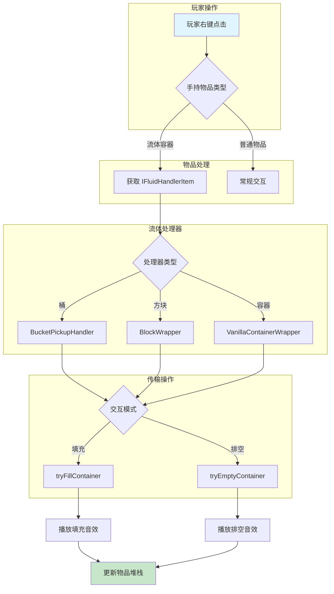
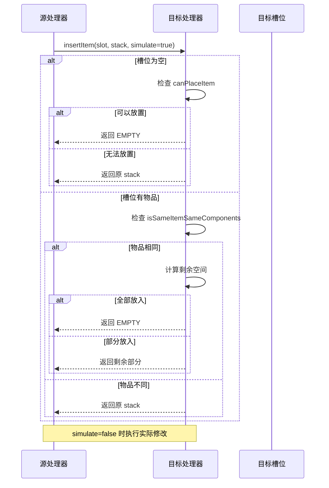
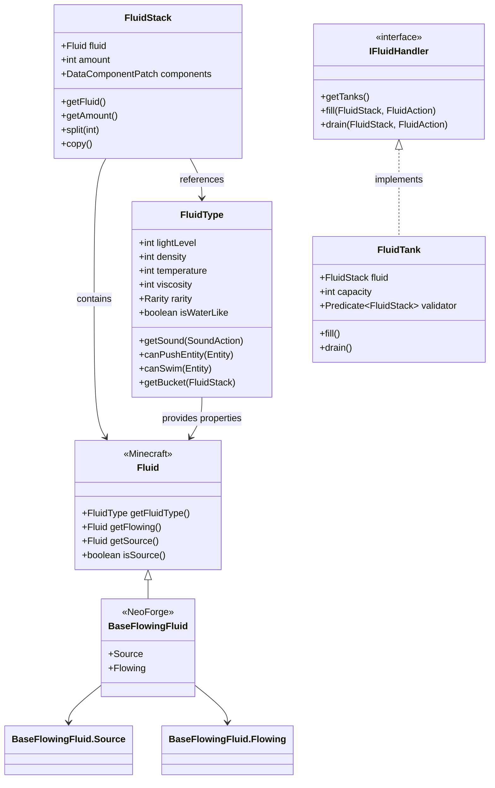

# 流体与物品系统

## 目录

- [1. 系统概述](#1-系统概述)
- [2. 流体系统](#2-流体系统)
  - [2.1 FluidType](#21-fluidtype)
  - [2.2 FluidStack](#22-fluidstack)
  - [2.3 FluidUtil](#23-fluidutil)
  - [2.4 BaseFlowingFluid](#24-baseflowingfluid)
  - [2.5 FluidInteractionRegistry](#25-fluidinteractionregistry)
  - [2.6 FluidTank](#26-fluidtank)
- [3. 物品系统](#3-物品系统)
  - [3.1 IItemHandler](#31-iitemhandler)
  - [3.2 InvWrapper](#32-invwrapper)
  - [3.3 PlayerInvWrapper](#33-playerinvwrapper)
- [4. 工作流程图](#4-工作流程图)
- [5. API 使用示例](#5-api-使用示例)
- [6. 与其他系统交互](#6-与其他系统交互)
- [7. 总结](#7-总结)

---

## 1. 系统概述

NeoForge 1.21.x 的流体与物品系统是模组开发中最核心的基础设施之一。这两个系统共同构成了游戏中资源传输的基础架构。

### 核心设计理念

**流体系统**负责管理游戏中液态资源的存储和传输，包括：
- 自定义流体的创建和管理
- 流体堆（FluidStack）的操作
- 流体与方块/物品的交互
- 流体之间的相互作用（如熔岩遇水凝固）

**物品系统**则管理物品的存储和传输：
- 物品处理器接口（IItemHandler）
- 物品堆处理器（ItemStackHandler）
- 背包包装器（InvWrapper、PlayerInvWrapper）

> **关键术语**：
> - **FluidStack**：流体堆，类似 ItemStack，代表一定数量的流体
> - **IItemHandler**：物品处理器接口，定义了物品存储的标准方法
> - **ResourceHandler**：NeoForge 1.21.9 引入的新传输系统

### 架构演进

值得注意的是，NeoForge 1.21.9 引入了全新的 **Transfer API**，原有的 `IFluidHandler` 和 `IItemHandler` 接口已被标记为 `@Deprecated`。新系统基于 `ResourceHandler<T>` 泛型类，提供更统一的资源传输接口。

---

## 2. 流体系统

### 2.1 FluidType

**源码路径**：`D:\Minecraft-Learning\assets\NeoForge-1.21.x\src\main\java\net\neoforged\neoforge\fluids\FluidType.java`

FluidType 是流体类型的定义类，定义了流体的通用属性和方法。

#### 类职责

FluidType 不代表具体的流体实例，而是为 `Fluid` 提供属性定义。这种设计将流体的视觉/行为属性与实际存储分离。

#### 核心属性

```java
// 桶的体积常量
public static final int BUCKET_VOLUME = 1000;

// 物理属性
private final int lightLevel;        // 光照等级 [0-15]
private final int density;          // 密度 kg/m³
private final int temperature;      // 温度 Kelvin
private final int viscosity;        // 粘度 m/s²
private final Rarity rarity;        // 稀有度

// 行为属性
private final boolean canPushEntity;    // 能否推动实体
private final boolean canSwim;          // 能否游泳
private final boolean canDrown;         // 能否溺水
private final boolean supportsBoating;   // 能否划船
private final boolean isWaterLike;      // 是否像水一样
```

#### 关键方法

| 方法 | 说明 |
|------|------|
| `getLightLevel()` | 获取流体光照等级 |
| `getDensity()` | 获取流体密度 |
| `getTemperature()` | 获取流体温度 |
| `getViscosity()` | 获取流体粘度 |
| `canPushEntity(Entity)` | 判断流体能否推动实体 |
| `canSwim(Entity)` | 判断实体能否在流体中游泳 |
| `getBucket(FluidStack)` | 获取装有这个流体的桶 |

#### 创建自定义 FluidType

```java
// 使用 Properties 构建器模式
public static final FluidType EXAMPLE_TYPE = new FluidType(
    FluidType.Properties.create()
        .descriptionId("fluid.example")
        .density(1000)
        .temperature(300)
        .viscosity(1000)
        .rarity(Rarity.COMMON)
        .isWaterLike(true)
        .supportsBoating(true)
        .sound(SoundActions.BUCKET_FILL, SoundEvents.BUCKET_FILL)
        .sound(SoundActions.BUCKET_EMPTY, SoundEvents.BUCKET_EMPTY)
) {};
```

#### Dripstone 滴水机制

FluidType 支持滴水石（Pointed Dripstone）滴水到炼药锅的机制：

```java
public record DripstoneDripInfo(
    float chance,                      // 每次刻触发的概率 [0.0-1.0]
    @Nullable ParticleOptions dripParticle,  // 滴水粒子
    Block filledCauldron                // 填充后的炼药锅
) {}

// 配置示例
Properties.addDripstoneDripping(
    0.2f,                        // 20% 概率
    ParticleTypes.DRIPPING_WATER, // 滴水粒子
    Blocks.WATER_CAULDRON,        // 填充后的炼药锅
    SoundEvents.CAULDRON_DRIP     // 滴水音效
);
```

---

### 2.2 FluidStack

**源码路径**：`D:\Minecraft-Learning\assets\NeoForge-1.21.x\src\main\java\net\neoforged\neoforge\fluids\FluidStack.java`

FluidStack 是流体的堆叠表示，类似于 Minecraft 中的 ItemStack。

#### 核心特性

- **必须有数量**：与 ItemStack 不同，FluidStack 必须有 amount，不能默认为 1
- **支持数据组件**：与物品系统一样支持 DataComponentPatch
- **不可变语义**：某些操作返回新实例而非修改原实例

#### 序列化支持

```java
// 标准编解码器（不接受空堆）
public static final Codec<FluidStack> CODEC = ...
public static final MapCodec<FluidStack> MAP_CODEC = ...

// 可选编解码器（接受空堆，序列化时为空对象）
public static final Codec<FluidStack> OPTIONAL_CODEC = ...

// 网络传输流编解码器
public static final StreamCodec<RegistryFriendlyByteBuf, FluidStack> STREAM_CODEC = ...

// 固定数量的编解码器
public static Codec<FluidStack> fixedAmountCodec(int amount) { ... }
```

#### 常用方法

```java
// 创建
FluidStack stack = new FluidStack(fluid, 1000);

// 查询
int amount = stack.getAmount();
Fluid fluid = stack.getFluid();
FluidType type = stack.getFluidType();
boolean isEmpty = stack.isEmpty();

// 修改
stack.setAmount(500);
stack.grow(100);      // 增加 100
stack.shrink(50);     // 减少 50

// 分割
FluidStack split = stack.split(500);  // 分割出 500，返回新实例

// 复制
FluidStack copy = stack.copy();

// 比较
boolean same = FluidStack.isSameFluid(first, second);
boolean sameWithComp = FluidStack.isSameFluidSameComponents(first, second);
boolean matches = FluidStack.matches(first, second);  // 包含数量比较
```

#### 数据组件

```java
// 设置数据组件
DataComponentType<CustomData> type = DataComponents.CUSTOM_DATA;
stack.set(type, customData);

// 获取数据组件
CustomData data = stack.getOrDefault(type, defaultValue);

// 获取组件补丁
DataComponentPatch patch = stack.getComponentsPatch();
```

---

### 2.3 FluidUtil

**源码路径**：`D:\Minecraft-Learning\assets\NeoForge-1.21.x\src\main\java\net\neoforged\neoforge\fluids\FluidUtil.java`

> **注意**：此类已在 1.21.9 标记为 `@Deprecated`，建议使用新的 Transfer API。

FluidUtil 提供了一系列处理流体交互的工具方法。

#### 核心功能

**1. 玩家与流体处理器交互**

```java
// 玩家手持流体物品右键流体处理器方块
boolean success = FluidUtil.interactWithFluidHandler(
    player,      // 玩家
    hand,        // 交互的手
    level,       // 世界
    pos,         // 方块位置
    side         // 交互的面（可为 null）
);
```

**2. 填充/排空容器**

```java
// 填充容器（从流体源）
FluidActionResult result = FluidUtil.tryFillContainer(
    emptyBucket,     // 空容器
    fluidHandler,    // 流体源
    1000,            // 最大量
    player,          // 玩家（播放音效）
    true             // 执行 vs 模拟
);

// 排空容器（到流体目标）
FluidActionResult result = FluidUtil.tryEmptyContainer(
    waterBucket,     // 水桶
    tank,            // 流体罐
    1000,
    player,
    true
);

// 带自动存储的版本（处理堆叠情况）
FluidActionResult result = FluidUtil.tryFillContainerAndStow(
    emptyContainer,  // 空容器
    fluidSource,     // 流体源
    inventory,       // 背包（存储多余的桶）
    maxAmount,
    player,
    doFill
);
```

**3. 流体传输**

```java
// 传输流体到目标处理器
FluidStack transferred = FluidUtil.tryFluidTransfer(
    destination,     // 目标处理器
    source,         // 源处理器
    1000,           // 最大量
    true            // 执行
);
```

**4. 获取流体处理器**

```java
// 获取物品的流体处理器
Optional<IFluidHandlerItem> handler = FluidUtil.getFluidHandler(itemStack);

// 获取方块的流体处理器
Optional<IFluidHandler> handler = FluidUtil.getFluidHandler(level, pos, side);
```

**5. 放置流体**

```java
// 放置流体到世界
boolean success = FluidUtil.tryPlaceFluid(
    player,
    level,
    hand,
    pos,
    container,
    resource
);
```

---

### 2.4 BaseFlowingFluid

**源码路径**：`D:\Minecraft-Learning\assets\NeoForge-1.21.x\src\main\java\net\eoforged\neoforge\fluids\BaseFlowingFluid.java`

BaseFlowingFluid 是创建自定义流动流体的基础抽象类。

#### 继承结构

```
FlowingFluid (Minecraft)
    └── BaseFlowingFluid (NeoForge)
            ├── Source (源流体，永远是满的)
            └── Flowing (流动流体，有 level 属性)
```

#### 创建自定义流体

```java
// 1. 定义源流体
public static final Fluid SOURCE = new BaseFlowingFluid.Source(
    new BaseFlowingFluid.Properties(
        () -> EXAMPLE_FLUID_TYPE,  // FluidType
        () -> SOURCE,              // 源流体自身
        () -> FLOWING               // 流动变体
    )
    .bucket(() -> EXAMPLE_BUCKET)           // 桶物品
    .block(() -> EXAMPLE_FLUID_BLOCK)       // 方块
    .slopeFindDistance(4)                   // 斜坡寻找距离
    .levelDecreasePerBlock(1)               // 每格下降量
    .tickRate(5)                            // 刻更新频率
    .explosionResistance(1.0f)              // 爆炸抗性
);

// 2. 定义流动变体
public static final Fluid FLOWING = new BaseFlowingFluid.Flowing(
    new BaseFlowingFluid.Properties(
        () -> EXAMPLE_FLUID_TYPE,
        () -> SOURCE,
        () -> FLOWING
    )
    .bucket(() -> EXAMPLE_BUCKET)
    .block(() -> EXAMPLE_FLUID_BLOCK)
);
```

#### 关键方法覆盖

```java
@Override
public FluidType getFluidType() {
    return this.fluidType.get();
}

@Override
public boolean isSame(Fluid fluidIn) {
    return fluidIn == SOURCE || fluidIn == FLOWING;
}

@Override
protected int getSlopeFindDistance(LevelReader worldIn) {
    return slopeFindDistance;
}
```

---

### 2.5 FluidInteractionRegistry

**源码路径**：`D:\Minecraft-Learning\assets\NeoForge-1.21.x\src\main\java\net\neoforged\neoforge\fluids\FluidInteractionRegistry.java`

流体交互注册表允许定义流体之间的化学反应。

#### 内置交互

```java
static {
    // 熔岩 + 水 = 黑曜石（源熔岩）/ 圆石（流动熔岩）
    addInteraction(NeoForgeMod.LAVA_TYPE.value(), new InteractionInformation(
        NeoForgeMod.WATER_TYPE.value(),
        fluidState -> fluidState.isSource() ? Blocks.OBSIDIAN.defaultBlockState() 
                                            : Blocks.COBBLESTONE.defaultBlockState()
    ));

    // 熔岩 + 灵魂土（下方）+ 蓝冰 = 玄武岩
    addInteraction(NeoForgeMod.LAVA_TYPE.value(), new InteractionInformation(
        (level, currentPos, relativePos, currentState) -> 
            level.getBlockState(currentPos.below()).is(Blocks.SOUL_SOIL) && 
            level.getBlockState(relativePos).is(Blocks.BLUE_ICE),
        Blocks.BASALT.defaultBlockState()
    ));
}
```

#### 自定义交互

```java
// 方式1：简单流体类型匹配
FluidInteractionRegistry.addInteraction(
    MY_FLUID_TYPE,
    new InteractionInformation(
        TARGET_FLUID_TYPE,
        Blocks.MY_RESULT_BLOCK.defaultBlockState()
    )
);

// 方式2：自定义条件
FluidInteractionRegistry.addInteraction(
    MY_FLUID_TYPE,
    new InteractionInformation(
        (level, currentPos, relativePos, currentState) -> {
            // 自定义判断逻辑
            return level.getBlockState(relativePos).is(Blocks.CAULDRON);
        },
        Blocks.MAGMA_BLOCK.defaultBlockState()
    )
);

// 方式3：基于流体状态的动态结果
FluidInteractionRegistry.addInteraction(
    MY_FLUID_TYPE,
    new InteractionInformation(
        TARGET_FLUID_TYPE,
        fluidState -> fluidState.isSource() ? RESULT_A : RESULT_B
    )
);
```

---

### 2.6 FluidTank

**源码路径**：`D:\Minecraft-Learning\assets\NeoForge-1.21.x\src\main\java\net\neoforged\neoforge\fluids\capability\templates\FluidTank.java`

> **注意**：此类已在 1.21.9 标记为 `@Deprecated`。

FluidTank 是流体存储的实现模板类。

#### 构造方法

```java
// 简单构造
FluidTank tank = new FluidTank(10000);  // 容量 10000

// 带验证器
FluidTank tank = new FluidTank(10000, stack -> {
    // 只接受水
    return stack.is(Fluids.WATER);
});
```

#### 核心操作

```java
// 填充
int filled = tank.fill(fluidStack, IFluidHandler.FluidAction.EXECUTE);

// 排空
FluidStack drained = tank.drain(1000, IFluidHandler.FluidAction.EXECUTE);

// 查询
FluidStack contents = tank.getFluid();
int amount = tank.getFluidAmount();
int capacity = tank.getCapacity();
int space = tank.getSpace();
boolean isEmpty = tank.isEmpty();

// 验证
boolean valid = tank.isFluidValid(fluidStack);
```

#### 容量限制

```java
// 设置容量
tank.setCapacity(20000);

// 链式调用
new FluidTank(10000)
    .setCapacity(20000)
    .setValidator(stack -> stack.is(Fluids.WATER));
```

---

## 3. 物品系统

### 3.1 IItemHandler

**源码路径**：`D:\Minecraft-Learning\assets\NeoForge-1.21.x\src\main\java\net\neoforged\neoforge\items\IItemHandler.java`

> **注意**：此类已在 1.21.9 标记为 `@Deprecated`，建议使用新的 Transfer API。

物品处理器接口定义了物品存储的标准方法。

#### 接口方法

```java
public interface IItemHandler {
    // 槽位数量
    int getSlots();
    
    // 获取槽位物品（不可修改！）
    ItemStack getStackInSlot(int slot);
    
    // 插入物品，返回剩余
    ItemStack insertItem(int slot, ItemStack stack, boolean simulate);
    
    // 提取物品
    ItemStack extractItem(int slot, int amount, boolean simulate);
    
    // 槽位容量限制
    int getSlotLimit(int slot);
    
    // 是否可以放置（不考虑当前状态）
    boolean isItemValid(int slot, ItemStack stack);
}
```

#### 适配器

```java
// 从新的 ResourceHandler 创建适配器
IItemHandler wrapper = IItemHandler.of(resourceHandler);
```

### 3.2 InvWrapper

**源码路径**：`D:\Minecraft-Learning\assets\NeoForge-1.21.x\src\main\java\net\neoforged\neoforge\items\wrapper\InvWrapper.java`

> **注意**：此类已在 1.21.9 标记为 `@Deprecated`，建议使用 `VanillaContainerWrapper`。

InvWrapper 将 Minecraft 的 `Container` 适配为 `IItemHandler`。

#### 使用方式

```java
// 包装任意 Container
Container container = new SimpleContainer(9);  // 9 槽箱子
IItemHandler handler = new InvWrapper(container);

// 操作
ItemStack stack = handler.getStackInSlot(0);
ItemStack remaining = handler.insertItem(0, new ItemStack(Items.DIAMOND, 5), false);
ItemStack extracted = handler.extractItem(0, 3, false);
```

#### 内部实现

```java
@Override
public ItemStack insertItem(int slot, ItemStack stack, boolean simulate) {
    if (stack.isEmpty()) return ItemStack.EMPTY;
    
    ItemStack stackInSlot = getInv().getItem(slot);
    
    if (!stackInSlot.isEmpty()) {
        // 槽位有物品，尝试堆叠
        if (!ItemStack.isSameItemSameComponents(stack, stackInSlot)) {
            return stack;  // 物品不同，无法堆叠
        }
        
        int space = Math.min(stack.getMaxStackSize(), getSlotLimit(slot)) - stackInSlot.getCount();
        if (stack.getCount() <= space) {
            // 全部可以放入
            if (!simulate) {
                ItemStack copy = stack.copy();
                copy.grow(stackInSlot.getCount());
                getInv().setItem(slot, copy);
            }
            return ItemStack.EMPTY;
        }
        // 部分放入
        ...
    } else {
        // 槽位为空
        int limit = Math.min(stack.getMaxStackSize(), getSlotLimit(slot));
        if (stack.getCount() <= limit) {
            if (!simulate) getInv().setItem(slot, stack);
            return ItemStack.EMPTY;
        }
        ...
    }
}
```

### 3.3 PlayerInvWrapper

**源码路径**：`D:\Minecraft-Learning\assets\NeoForge-1.21.x\src\main\java\net\neoforged\neoforge\items\wrapper\PlayerInvWrapper.java`

PlayerInvWrapper 专门包装玩家背包，包含主物品栏、装备栏和副手栏。

#### 结构

```java
public class PlayerInvWrapper extends CombinedInvWrapper {
    public PlayerInvWrapper(Inventory inv) {
        super(
            new PlayerMainInvWrapper(inv),   // 27 槽主物品栏
            new PlayerArmorInvWrapper(inv),   // 4 槽装备栏
            new PlayerOffhandInvWrapper(inv) // 1 槽副手
        );
    }
}
```

#### 槽位索引

| 范围 | 内容 |
|------|------|
| 0-26 | 主物品栏 |
| 27-30 | 装备栏（头盔、胸甲、护腿、靴子） |
| 31 | 副手 |

---

## 4. 工作流程图

### 4.1 流体交互流程



### 4.2 物品插入流程



### 4.3 流体类型与流体关系



---

## 5. API 使用示例

### 5.1 创建自定义流体

```java
// 1. 创建 FluidType
public static final FluidType MY_FLUID_TYPE = new FluidType(
    FluidType.Properties.create()
        .descriptionId("fluid.my_fluid")
        .density(1100)
        .temperature(350)
        .viscosity(1200)
        .rarity(Rarity.UNCOMMON)
        .isWaterLike(true)
        .lightLevel(4)
        .addDripstoneDripping(
            0.15f,
            ParticleTypes.DRIPPING_LAVA,
            Blocks.LAVA_CAULDRON,
            SoundEvents.CAULDRON_DRIP
        )
) {};

// 2. 创建流体方块
public static final LiquidBlock MY_FLUID_BLOCK = new LiquidBlock(
    RegistryObject<FlowingFluid> MY_FLUID,
    BlockBehaviour.Properties.of(Material.WATER, Color.MAGENTA)
) {};

// 3. 创建流体
public static final FlowingFluid MY_FLUID_SOURCE = new BaseFlowingFluid.Source(
    new BaseFlowingFluid.Properties(
        () -> MY_FLUID_TYPE,
        () -> MY_FLUID_SOURCE,
        () -> MY_FLUID_FLOWING
    )
    .bucket(() -> MY_FLUID_BUCKET.get())
    .block(() -> MY_FLUID_BLOCK.get())
    .slopeFindDistance(4)
    .tickRate(5)
);

// 4. 注册
@Mod.EventBusSubscriber(bus = Mod.EventBusSubscriber.Bus.MOD)
public static class Registration {
    @SubscribeEvent
    public static void register(RegistryEvent.Register event) {
        event.getRegistry().registerAll(
            MY_FLUID_TYPE,
            MY_FLUID_SOURCE,
            MY_FLUID_FLOWING
        );
    }
}
```

### 5.2 使用 FluidUtil 操作流体

```java
// 在方块类中使用
public class MyTankBlock extends Block {
    @Override
    public InteractionResult use(BlockState state, Level level, BlockPos pos, 
                                  Player player, InteractionHand hand, BlockHitResult hit) {
        if (level.isClientSide()) return InteractionResult.PASS;
        
        ItemStack held = player.getItemInHand(hand);
        IFluidHandler tankHandler = ...; // 获取方块对应的处理器
        
        // 尝试填充玩家手中的容器
        FluidActionResult fillResult = FluidUtil.tryFillContainerAndStow(
            held,
            tankHandler,
            new PlayerInvWrapper(player.getInventory()),
            Integer.MAX_VALUE,
            player,
            true
        );
        
        if (fillResult.isSuccess()) {
            player.setItemInHand(hand, fillResult.getResult());
            return InteractionResult.SUCCESS;
        }
        
        // 尝试从玩家手中排空到容器
        FluidActionResult emptyResult = FluidUtil.tryEmptyContainerAndStow(
            held,
            tankHandler,
            new PlayerInvWrapper(player.getInventory()),
            Integer.MAX_VALUE,
            player,
            true
        );
        
        if (emptyResult.isSuccess()) {
            player.setItemInHand(hand, emptyResult.getResult());
            return InteractionResult.SUCCESS;
        }
        
        return InteractionResult.PASS;
    }
}
```

### 5.3 创建物品处理器

```java
public class CustomItemHandler implements IItemHandler {
    private final ItemStack[] stacks;
    private final int slots;
    
    public CustomItemHandler(int slots) {
        this.slots = slots;
        this.stacks = new ItemStack[slots];
        for (int i = 0; i < slots; i++) {
            stacks[i] = ItemStack.EMPTY;
        }
    }
    
    @Override
    public int getSlots() {
        return slots;
    }
    
    @Override
    public ItemStack getStackInSlot(int slot) {
        return stacks[slot];
    }
    
    @Override
    public ItemStack insertItem(int slot, ItemStack stack, boolean simulate) {
        if (stack.isEmpty() || !isItemValid(slot, stack)) {
            return stack;
        }
        
        ItemStack current = stacks[slot];
        
        if (current.isEmpty()) {
            int limit = Math.min(stack.getMaxStackSize(), getSlotLimit(slot));
            if (stack.getCount() <= limit) {
                if (!simulate) {
                    stacks[slot] = stack.copy();
                }
                return ItemStack.EMPTY;
            } else {
                ItemStack toInsert = stack.copyWithCount(limit);
                if (!simulate) {
                    stacks[slot] = toInsert;
                }
                return stack.copyWithCount(stack.getCount() - limit);
            }
        } else if (ItemStack.isSameItemSameComponents(current, stack)) {
            int space = getSlotLimit(slot) - current.getCount();
            if (space > 0) {
                int toAdd = Math.min(space, stack.getCount());
                if (!simulate) {
                    stacks[slot].grow(toAdd);
                }
                return stack.copyWithCount(stack.getCount() - toAdd);
            }
        }
        
        return stack;
    }
    
    @Override
    public ItemStack extractItem(int slot, int amount, boolean simulate) {
        if (amount == 0) return ItemStack.EMPTY;
        
        ItemStack current = stacks[slot];
        if (current.isEmpty()) return ItemStack.EMPTY;
        
        int toExtract = Math.min(current.getCount(), amount);
        if (!simulate) {
            stacks[slot].shrink(toExtract);
        }
        return current.copyWithCount(toExtract);
    }
    
    @Override
    public int getSlotLimit(int slot) {
        return 64;
    }
    
    @Override
    public boolean isItemValid(int slot, ItemStack stack) {
        return true; // 自定义验证逻辑
    }
}
```

---

## 6. 与其他系统交互

### 6.1 与 Capability 系统集成

NeoForge 的流体和物品系统通过 Capability 系统暴露功能：

```java
// 获取方块的流体能力
var capability = level.getCapability(Capabilities.Fluid.BLOCK, pos, side);
if (capability != null) {
    // 使用新的 Transfer API
    ResourceHandler<FluidResource> handler = capability;
}

// 获取物品的流体能力
var itemCapability = itemAccess.getCapability(Capabilities.Fluid.ITEM);
if (itemCapability != null) {
    ResourceHandler<FluidResource> handler = itemCapability;
}
```

### 6.2 与 Transfer API 集成

NeoForge 1.21.9 引入的新 Transfer API：

```java
// 流体传输
ResourceHandler<FluidResource> tank = ...;
ResourceHandler<FluidResource> source = ...;

// 插入
long inserted = tank.insert(FluidResource.of(myFluid, 1000));

// 提取
FluidResource extracted = source.extract(
    FluidResource.of(myFluid), 
    1000, 
    Action.EXECUTE
);

// 移动
ResourceHandlerUtil.move(
    source,
    tank,
    filter -> filter.withFluid(myFluid),
    1000,
    Action.EXECUTE
);
```

### 6.3 与数据组件系统集成

```java
// 在 FluidStack 上设置自定义数据
public static final DataComponentType<CustomData> CUSTOM_DATA = 
    DataComponentType.<CustomData>builder()
        .persistent(CustomData.CODEC)
        .build();

// 使用
FluidStack stack = new FluidStack(MY_FLUID, 1000);
stack.set(CUSTOM_DATA, new CustomData("value"));

// 读取
CustomData data = stack.getOrDefault(CUSTOM_DATA, CustomData.DEFAULT);
```

---

## 7. 总结

### 核心要点

1. **FluidType vs Fluid**：
   - `FluidType` 定义属性和行为
   - `Fluid` 是实际的注册对象
   - `FluidStack` 代表一定数量的流体实例

2. **传输接口演进**：
   - 传统 API：`IFluidHandler`、`IItemHandler`
   - 新 API：`ResourceHandler<T>`（1.21.9+）
   - 迁移策略：使用适配器进行过渡

3. **流体交互**：
   - 通过 `FluidInteractionRegistry` 定义化学反应
   - 内置熔岩+水=黑曜石/圆石

4. **物品处理器链**：
   - `Container` → `InvWrapper` → `IItemHandler`
   - `PlayerInvWrapper` 整合背包所有槽位

### 最佳实践

1. **使用 Properties 构建器**：FluidType 和 BaseFlowingFluid 都使用链式调用
2. **模拟优先**：操作前先用 `SIMULATE` 模式验证
3. **音效反馈**：填充/排空时播放对应音效
4. **容量验证**：确保流体类型只接受合法的流体
5. **关注新 API**：1.21.9+ 使用 Transfer API 获取更好性能

### 相关文档

- [Transfer API 系统](./09-transfer-system.md)
- [Capability 系统](./04-capability-system.md)
- [物品注册系统](./content/mc/1.21/tutorials/Part-2-Block-Item/02-creating-items.md)

---

**课后自查**：

- [ ] 能够创建自定义的 FluidType 和 FlowingFluid
- [ ] 理解 FluidStack 与 Fluid/FluidType 的关系
- [ ] 能够使用 FluidUtil 进行流体填充和排空操作
- [ ] 理解 IItemHandler 接口的核心方法
- [ ] 能够将 Container 包装为 IItemHandler
- [ ] 了解 Transfer API 与旧 API 的区别
