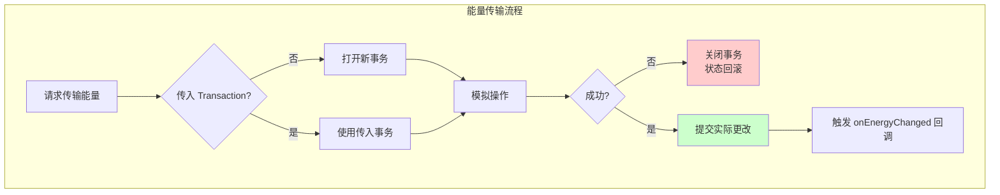
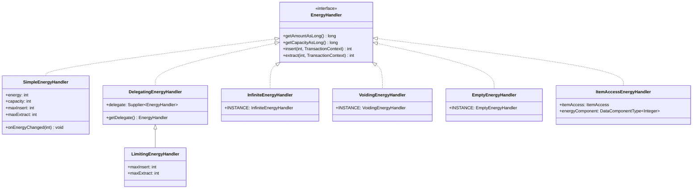
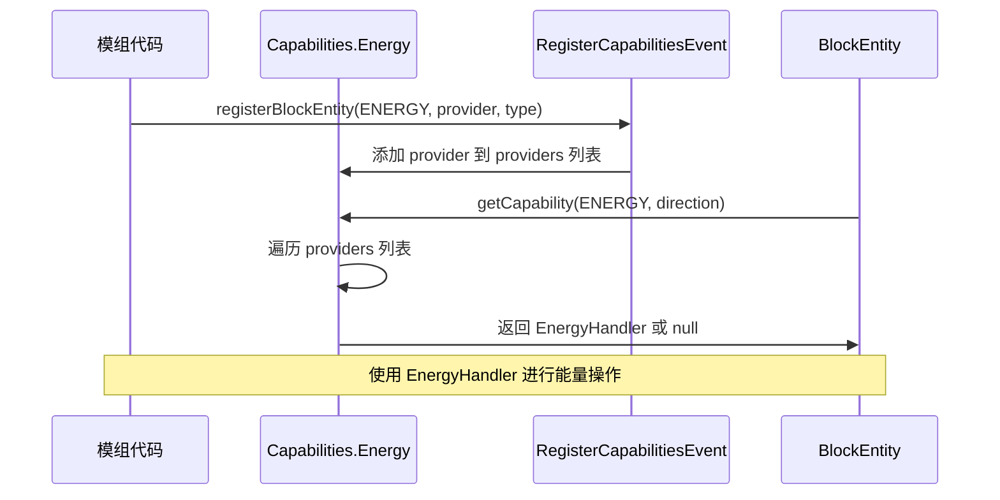
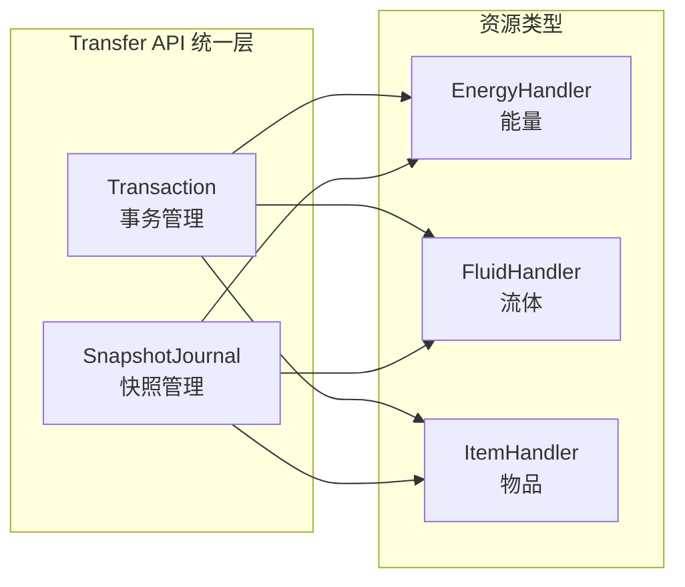

# 能量系统

## 目录

- [1. 系统概述](#1-系统概述)
- [2. 核心组件](#2-核心组件)
  - [2.1 EnergyHandler 新能量接口](#21-energyhandler-新能量接口)
  - [2.2 SimpleEnergyHandler 简单能量处理器](#22-simpleenergyhandler-简单能量处理器)
  - [2.3 DelegatingEnergyHandler 委托处理器](#23-delegatingenergyhandler-委托处理器)
  - [2.4 LimitingEnergyHandler 限制处理器](#24-limitingenergyhandler-限制处理器)
  - [2.5 InfiniteEnergyHandler 无限能量处理器](#25-infiniteenergyhandler-无限能量处理器)
  - [2.6 VoidingEnergyHandler 虚空能量处理器](#26-voidingenergyhandler-虚空能量处理器)
  - [2.7 EmptyEnergyHandler 空能量处理器](#27-emptyenergyhandler-空能量处理器)
  - [2.8 ItemAccessEnergyHandler 物品能量处理器](#28-itemaccessenergyhandler-物品能量处理器)
- [3. 遗留能量系统](#3-遗留能量系统)
- [4. 工作流程图](#4-工作流程图)
- [5. Transaction 事务系统](#5-transaction-事务系统)
- [6. API 使用示例](#6-api-使用示例)
- [7. 与其他系统交互](#7-与其他系统交互)
- [8. 与 Fabric Energy API 对比](#8-与-fabric-energy-api-对比)
- [9. 总结](#9-总结)

## 1. 系统概述

NeoForge 1.21.x 的能量系统是模组开发中管理能量存储和传输的核心框架。该系统最初基于 Redstone Flux（由 King Lemming 设计，应用于 Thermal Expansion），但在 1.21.9 版本进行了重大重构，引入了全新的 Transfer API。

**核心设计理念**：

| 理念 | 说明 |
|------|------|
| **事务性操作** | 所有能量传输操作都通过 `Transaction` 系统支持原子性回滚 |
| **长期支持接口** | 新 API（`EnergyHandler`）将获得长期支持，旧 API（`IEnergyStorage`）已标记废弃 |
| **统一 Transfer API** | 能量、流体、物品传输使用统一的 API 设计模式 |
| **支持 Long 范围** | 新 API 支持 `long` 类型的能量值（最大 `Integer.MAX_VALUE`） |

**包结构**：

```
net.neoforged.neoforge.transfer.energy  // 新版 Transfer API
net.neoforged.neoforge.energy           // 遗留系统（已废弃）
```

---

## 2. 核心组件

### 2.1 EnergyHandler 新能量接口

`EnergyHandler` 是新版能量系统的核心接口，定义了能量存储和传输的标准操作。

```java
D:\Minecraft-Learning\assets\NeoForge-1.21.x\src\main\java\net\neoforged\neoforge\transfer\energy\EnergyHandler.java
public interface EnergyHandler {
    // 获取当前存储的能量（支持 long）
    long getAmountAsLong();
    
    // 获取当前存储的能量（int 便捷方法）
    default int getAmountAsInt() {
        return Ints.saturatedCast(getAmountAsLong());
    }
    
    // 获取容量
    long getCapacityAsLong();
    default int getCapacityAsInt() {
        return Ints.saturatedCast(getCapacityAsLong());
    }
    
    // 插入能量（事务支持）
    int insert(int amount, TransactionContext transaction);
    
    // 提取能量（事务支持）
    int extract(int amount, TransactionContext transaction);
}
```

**关键特性**：
- 所有操作都接受 `TransactionContext` 参数，确保事务性
- 使用 `long` 避免 `int` 溢出问题
- 提供 `int` 便捷方法用于兼容场景

---

### 2.2 SimpleEnergyHandler 简单能量处理器

`SimpleEnergyHandler` 是 `EnergyHandler` 的标准实现，提供完整的能量存储功能。

```java
D:\Minecraft-Learning\assets\NeoForge-1.21.x\src\main\java\net\neoforged\neoforge\transfer\energy\SimpleEnergyHandler.java
public class SimpleEnergyHandler implements EnergyHandler, ValueIOSerializable {
    protected int energy;        // 当前能量
    protected int capacity;     // 最大容量
    protected int maxInsert;    // 每次最大输入
    protected int maxExtract;   // 每次最大输出
    
    private final EnergyJournal energyJournal = new EnergyJournal();
    
    // 构造函数支持多种参数组合
    public SimpleEnergyHandler(int capacity) { ... }
    public SimpleEnergyHandler(int capacity, int maxTransfer) { ... }
    public SimpleEnergyHandler(int capacity, int maxInsert, int maxExtract) { ... }
    public SimpleEnergyHandler(int capacity, int maxInsert, int maxExtract, int energy) { ... }
    
    @Override
    public int insert(int amount, TransactionContext transaction) {
        int inserted = Math.min(capacity - energy, Math.min(amount, maxInsert));
        if (inserted > 0) {
            energyJournal.updateSnapshots(transaction);
            energy += inserted;
            return inserted;
        }
        return 0;
    }
    
    @Override
    public int extract(int amount, TransactionContext transaction) {
        int extracted = Math.min(energy, Math.min(amount, maxExtract));
        if (extracted > 0) {
            energyJournal.updateSnapshots(transaction);
            energy -= extracted;
            return extracted;
        }
        return 0;
    }
    
    // 能量变化回调
    protected void onEnergyChanged(int previousAmount) {}
}
```

**构造函数参数**：

| 参数 | 说明 |
|------|------|
| `capacity` | 最大存储容量 |
| `maxInsert` | 单次最大输入能量 |
| `maxExtract` | 单次最大输出能量 |
| `energy` | 初始能量值 |

**事务支持**：内部使用 `EnergyJournal`（继承 `SnapshotJournal`）记录状态快照，支持事务回滚。

---

### 2.3 DelegatingEnergyHandler 委托处理器

`DelegatingEnergyHandler` 是装饰器模式的基类，将所有操作委托给被包装的处理器。

```java
D:\Minecraft-Learning\assets\NeoForge-1.21.x\src\main\java\net\eoforged\neoforge\transfer\energy\DelegatingEnergyHandler.java
public class DelegatingEnergyHandler implements EnergyHandler {
    protected final Supplier<EnergyHandler> delegate;
    
    public DelegatingEnergyHandler(EnergyHandler delegate) {
        this.delegate = () -> delegate;
    }
    
    public DelegatingEnergyHandler(Supplier<EnergyHandler> delegate) {
        this.delegate = delegate;
    }
    
    @Override
    public long getAmountAsLong() {
        return getDelegate().getAmountAsLong();
    }
    
    // ... 其他方法类似委托
}
```

**设计模式**：装饰器模式，支持延迟获取委托对象（通过 `Supplier`），便于构建处理器链。

---

### 2.4 LimitingEnergyHandler 限制处理器

`LimitingEnergyHandler` 在委托处理器的基础上添加额外的传输限制。

```java
D:\Minecraft-Learning\assets\NeoForge-1.21.x\src\main\java\net\eoforged\neoforge\transfer\energy\LimitingEnergyHandler.java
public class LimitingEnergyHandler extends DelegatingEnergyHandler {
    protected int maxInsert, maxExtract;
    
    public LimitingEnergyHandler(EnergyHandler delegate, int maxInsert, int maxExtract) {
        this(() -> delegate, maxInsert, maxExtract);
    }
    
    @Override
    public int insert(int amount, TransactionContext transaction) {
        int toInsert = Math.min(amount, maxInsert);
        return toInsert <= 0 ? 0 : super.insert(toInsert, transaction);
    }
    
    @Override
    public int extract(int amount, TransactionContext transaction) {
        int toExtract = Math.min(amount, maxExtract);
        return toExtract <= 0 ? 0 : super.extract(toExtract, transaction);
    }
}
```

**典型用途**：限制能量管道的传输速率。

---

### 2.5 InfiniteEnergyHandler 无限能量处理器

`InfiniteEnergyHandler` 提供无限的能量来源，仅支持提取操作。

```java
D:\Minecraft-Learning\assets\NeoForge-1.21.x\src\main\java\net\eoforged\neoforge\transfer\energy\InfiniteEnergyHandler.java
public class InfiniteEnergyHandler implements EnergyHandler {
    public static final InfiniteEnergyHandler INSTANCE = new InfiniteEnergyHandler();
    
    @Override
    public long getAmountAsLong() { return Long.MAX_VALUE; }
    
    @Override
    public long getCapacityAsLong() { return Long.MAX_VALUE; }
    
    @Override
    public int insert(int amount, TransactionContext transaction) {
        // 不接受任何输入
        return 0;
    }
    
    @Override
    public int extract(int amount, TransactionContext transaction) {
        // 接受全部提取
        return amount;
    }
}
```

**典型用途**：能量发电机的输出端。

---

### 2.6 VoidingEnergyHandler 虚空能量处理器

`VoidingEnergyHandler` 销毁所有输入的能量，仅用于接收。

```java
D:\Minecraft-Learning\assets\NeoForge-1.21.x\src\main\java\net\eoforged\neoforge\transfer\energy\VoidingEnergyHandler.java
public class VoidingEnergyHandler implements EnergyHandler {
    public static final VoidingEnergyHandler INSTANCE = new VoidingEnergyHandler();
    
    @Override
    public long getAmountAsLong() { return 0; }
    
    @Override
    public long getCapacityAsLong() { return Long.MAX_VALUE; }
    
    @Override
    public int insert(int amount, TransactionContext transaction) {
        // 接受全部输入并销毁
        return amount;
    }
    
    @Override
    public int extract(int amount, TransactionContext transaction) {
        // 不允许提取
        return 0;
    }
}
```

**典型用途**：能量消耗设备（如激光器）的输入端。

---

### 2.7 EmptyEnergyHandler 空能量处理器

`EmptyEnergyHandler` 表示一个无效的能量处理器，不存储任何能量。

```java
D:\Minecraft-Learning\assets\NeoForge-1.21.x\src\main\java\net\eoforged\neoforge\transfer\energy\EmptyEnergyHandler.java
public final class EmptyEnergyHandler implements EnergyHandler {
    public static final EmptyEnergyHandler INSTANCE = new EmptyEnergyHandler();
    
    @Override
    public long getAmountAsLong() { return 0; }
    
    @Override
    public long getCapacityAsLong() { return 0; }
    
    @Override
    public int insert(int amount, TransactionContext transaction) { return 0; }
    
    @Override
    public int extract(int amount, TransactionContext transaction) { return 0; }
}
```

**典型用途**：作为能力查询的默认值，避免空值检查。

---

### 2.8 ItemAccessEnergyHandler 物品能量处理器

`ItemAccessEnergyHandler` 是基于物品数据组件的能量存储实现。

```java
D:\Minecraft-Learning\assets\NeoForge-1.21.x\src\main\java\net\eoforged\neoforge\transfer\energy\ItemAccessEnergyHandler.java
public class ItemAccessEnergyHandler implements EnergyHandler {
    protected final ItemAccess itemAccess;           // 物品访问接口
    protected final Item validItem;                 // 有效物品类型
    protected final DataComponentType<Integer> energyComponent;  // 能量数据组件
    protected final int capacity;
    protected final int maxInsert;
    protected final int maxExtract;
    
    @Override
    public long getAmountAsLong() {
        // 能量 = 单物品能量 × 物品数量
        return (long) itemAccess.getAmount() * getAmountFrom(itemAccess.getResource());
    }
    
    @Override
    public int insert(int amount, TransactionContext transaction) {
        int amountPerItem = Math.min(maxInsert, amount / itemAccess.getAmount());
        // ... 处理单物品能量存储
        return insertedPerItem * itemAccess.exchange(filledResource, accessAmount, transaction);
    }
}
```

**关键特性**：通过 `DataComponentType<Integer>` 存储能量，支持物品堆叠。

---

## 3. 遗留能量系统

为保持向后兼容，NeoForge 保留了旧的能量系统，但标记为废弃。

| 旧类 | 替代类 | 废弃版本 |
|------|--------|----------|
| `IEnergyStorage` | `EnergyHandler` | 1.21.9 |
| `EnergyStorage` | `SimpleEnergyHandler` | 1.21.9 |
| `ComponentEnergyStorage` | `ItemAccessEnergyHandler` | 1.21.9 |
| `EmptyEnergyStorage` | `EmptyEnergyHandler` | 1.21.9 |

**迁移适配器**：

```java
D:\Minecraft-Learning\assets\NeoForge-1.21.x\src\main\java\net\eoforged\neoforge\energy\EnergyHandlerAdapter.java
@Deprecated(since = "1.21.9", forRemoval = true)
class EnergyHandlerAdapter implements IEnergyStorage {
    private final EnergyHandler handler;
    
    @Override
    public int receiveEnergy(int toReceive, boolean simulate) {
        try (var tx = Transaction.openRoot()) {
            int inserted = handler.insert(toReceive, tx);
            if (!simulate) tx.commit();
            return inserted;
        }
    }
    
    // 其他方法类似...
}
```

---

## 4. 工作流程图

### 能量传输流程



### 能量处理器继承层次



### 能量系统能力查询



---

## 5. Transaction 事务系统

NeoForge 的能量系统使用 `Transaction` 系统确保操作的原子性。

```java
D:\Minecraft-Learning\assets\NeoForge-1.21.x\src\main\java\net\neoforged\neoforge\transfer\transaction\Transaction.java
public final class Transaction implements AutoCloseable, TransactionContext {
    // 打开根事务
    public static Transaction openRoot() { ... }
    
    // 在现有事务内打开嵌套事务
    public static Transaction open(TransactionContext parent) { ... }
    
    // 提交事务
    public void commit() { ... }
    
    // 关闭事务（回滚）
    @Override
    public void close() { ... }
}
```

**使用模式**：

```java
// 模式1：显式事务
try (Transaction tx = Transaction.openRoot()) {
    int extracted = energyHandler.extract(100, tx);
    targetHandler.insert(extracted, tx);
    tx.commit();
}

// 模式2：嵌套事务（用于模拟操作）
try (Transaction simulated = Transaction.open(parentTx)) {
    int canExtract = handler.extract(maxAmount, simulated);
}
// simulated 自动回滚，但 parentTx 继续
```

**SnapshotJournal 机制**：

`SimpleEnergyHandler` 内部使用 `EnergyJournal` 继承 `SnapshotJournal<Integer>`：

```java
private class EnergyJournal extends SnapshotJournal<Integer> {
    @Override
    protected Integer createSnapshot() {
        return energy;  // 记录当前能量值
    }
    
    @Override
    protected void revertToSnapshot(Integer snapshot) {
        energy = snapshot;  // 恢复到快照
    }
    
    @Override
    protected void onRootCommit(Integer originalState) {
        if (energy != originalState) {
            onEnergyChanged(originalState);  // 通知变化
        }
    }
}
```

---

## 6. API 使用示例

### 6.1 创建能量存储方块

```java
// 1. 定义数据组件类型（用于物品能量存储）
public static final DataComponentType<Integer> ENERGY_COMPONENT = 
    DataComponentType.<Integer>builder()
        .persistent(Codecs.INTEGER.xmap(Function.identity(), Function.identity()))
        .build();

// 2. 注册能力提供者
@SubscribeEvent
public static void registerCapabilities(RegisterCapabilitiesEvent event) {
    // 方块实体能量
    event.registerBlockEntity(
        Capabilities.Energy.BLOCK,
        (level, pos, state, blockEntity, context) -> blockEntity.getEnergyHandler(),
        ModBlockEntities.ENERGY_GENERATOR.get()
    );
    
    // 物品能量
    event.registerItem(
        Capabilities.Energy.ITEM,
        (stack, context) -> new ItemAccessEnergyHandler(
            ItemAccess.forItemStack(stack),
            ModItems.ENERGY_COMPONENT.get(),
            10000,  // 容量
            100,    // 最大输入
            100     // 最大输出
        ),
        ModItems.ENERGY_CRYSTAL.get()
    );
}

// 3. 方块实体实现
public class EnergyGeneratorBlockEntity extends BlockEntity {
    private final SimpleEnergyHandler energyHandler;
    
    public EnergyGeneratorBlockEntity(BlockEntityType<?> type, BlockPos pos, BlockState state) {
        super(type, pos, state);
        this.energyHandler = new SimpleEnergyHandler(10000, 100, 100) {
            @Override
            protected void onEnergyChanged(int previousAmount) {
                setChanged();
            }
        };
    }
    
    public EnergyHandler getEnergyHandler() {
        return energyHandler;
    }
    
    @Override
    public void tickServer() {
        // 生成能量
        energyHandler.insert(10, Transaction.getCurrentOpenedTransaction());
    }
}
```

### 6.2 能量传输工具类

```java
D:\Minecraft-Learning\assets\NeoForge-1.21.x\src\main\java\net\eoforged\neoforge\transfer\energy\EnergyHandlerUtil.java
public final class EnergyHandlerUtil {
    // 检查处理器是否已满
    public static boolean isFull(EnergyHandler handler) {
        return handler.getAmountAsLong() >= handler.getCapacityAsLong();
    }
    
    // 获取红石信号强度（0-15）
    public static int getRedstoneSignalFromEnergyHandler(EnergyHandler handler) {
        long amount = handler.getAmountAsLong();
        long capacity = handler.getCapacityAsLong();
        if (amount == 0 || capacity == 0) return 0;
        return Mth.lerpDiscrete(
            Math.min(1.0f, (float) amount / capacity),
            0, 15
        );
    }
    
    // 在两个处理器之间移动能量
    public static int move(
            EnergyHandler from, EnergyHandler to,
            int amount,
            @Nullable TransactionContext transaction) {
        if (from == null || to == null || amount == 0) return 0;
        
        try (Transaction subTransaction = Transaction.open(transaction)) {
            // 模拟提取
            int maxExtracted;
            try (Transaction simulatedExtract = Transaction.open(subTransaction)) {
                maxExtracted = from.extract(amount, simulatedExtract);
            }
            if (maxExtracted == 0) return 0;
            
            // 实际插入
            int inserted = to.insert(maxExtracted, subTransaction);
            
            // 确认提取
            if (inserted != from.extract(inserted, subTransaction)) {
                return 0;
            }
            
            subTransaction.commit();
            return inserted;
        }
    }
}
```

### 6.3 能量管道实现

```java
public class EnergyCableBlockEntity extends BlockEntity {
    private EnergyHandler inputHandler;
    private EnergyHandler outputHandler;
    private final LimitingEnergyHandler limitedHandler;
    
    public EnergyCableBlockEntity(BlockEntityType<?> type, BlockPos pos, BlockState state) {
        super(type, pos, state);
        
        // 管道容量：每次最多传输 1000 能量
        this.limitedHandler = new LimitingEnergyHandler(
            this::getMainHandler,
            1000, 1000  // maxInsert, maxExtract
        );
    }
    
    @Override
    public void tickServer() {
        try (Transaction tx = Transaction.openRoot()) {
            // 从输入端接收能量
            EnergyHandler input = getAdjacentInputHandler();
            if (input != null) {
                EnergyHandlerUtil.move(input, limitedHandler, 1000, tx);
            }
            
            // 发送到输出端
            EnergyHandler output = getAdjacentOutputHandler();
            if (output != null) {
                EnergyHandlerUtil.move(limitedHandler, output, 1000, tx);
            }
            
            tx.commit();
        }
    }
}
```

---

## 7. 与其他系统交互

### 7.1 与 Capabilities 系统集成

NeoForge 的能力系统提供三种能力访问点：

```java
D:\Minecraft-Learning\assets\NeoForge-1.21.x\src\main\java\net\eoforged\neoforge\capabilities\Capabilities.java
public final class Capabilities {
    public static final class Energy {
        // 方块能力（支持方向）
        public static final BlockCapability<EnergyHandler, @Nullable Direction> BLOCK = 
            BlockCapability.createSided(create("energy_handler"), EnergyHandler.class);
        
        // 实体能力（支持方向）
        public static final EntityCapability<EnergyHandler, @Nullable Direction> ENTITY = 
            EntityCapability.createSided(create("energy_handler"), EnergyHandler.class);
        
        // 物品能力
        public static final ItemCapability<EnergyHandler, ItemAccess> ITEM = 
            ItemCapability.create(create("energy_handler"), EnergyHandler.class, ItemAccess.class);
    }
}
```

### 7.2 与 Transfer API 统一

能量系统与流体、物品传输使用统一的 `Transaction` 和 `SnapshotJournal` 机制：



---

## 8. 与 Fabric Energy API 对比

| 特性 | NeoForge Energy | Fabric Energy API |
|------|-----------------|-------------------|
| 核心接口 | `EnergyHandler` | `EnergyStorage` |
| 事务支持 | 内置 `Transaction` | 无（需第三方库） |
| 数值范围 | `long` | `int` |
| 物品存储 | `ItemAccessEnergyHandler` | `ItemEnergyStorage` |
| 装饰器模式 | 完整实现 | 有限 |
| 回调机制 | `onEnergyChanged` | 无直接支持 |

**Fabric 迁移注意点**：

Fabric 使用 `EnergyStorage` 接口，方法签名略有不同：

```java
// Fabric 风格
public interface EnergyStorage {
    int receiveEnergy(int maxReceive, boolean simulate);
    int extractEnergy(int maxExtract, boolean simulate);
    int getEnergyStored();
    int getMaxEnergyStored();
}

// NeoForge 新 API
public interface EnergyHandler {
    int insert(int amount, TransactionContext transaction);
    int extract(int amount, TransactionContext transaction);
    long getAmountAsLong();
    long getCapacityAsLong();
}
```

---

## 9. 总结

NeoForge 1.21.x 的能量系统是一个经过精心设计的模块化框架：

**核心价值**：

1. **事务性安全** - 通过 `Transaction` 和 `SnapshotJournal` 确保操作原子性
2. **统一 API 设计** - 与流体、物品传输共享相同的架构模式
3. **长期支持承诺** - 新 API 将获得长期维护
4. **向后兼容** - 通过适配器支持旧代码迁移

**关键设计模式**：

| 模式 | 应用 |
|------|------|
| **装饰器模式** | `DelegatingEnergyHandler` 作为基类 |
| **工厂模式** | `SimpleEnergyHandler` 多种构造函数 |
| **单例模式** | `InfiniteEnergyHandler.INSTANCE` |
| **策略模式** | 不同能量处理器实现不同行为 |

**最佳实践**：

1. 优先使用新版 `EnergyHandler` API
2. 在 `onEnergyChanged` 中调用 `setChanged()` 通知方块变化
3. 使用 `Transaction.openRoot()` 管理独立操作
4. 利用 `EnergyHandlerUtil.move()` 简化能量传输
5. 注册能力时使用 `RegisterCapabilitiesEvent`

这套系统是 NeoForge 能量模组开发的基础，掌握它对于理解 NeoForge 的 Transfer API 框架至关重要。
