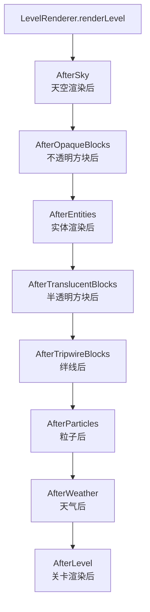
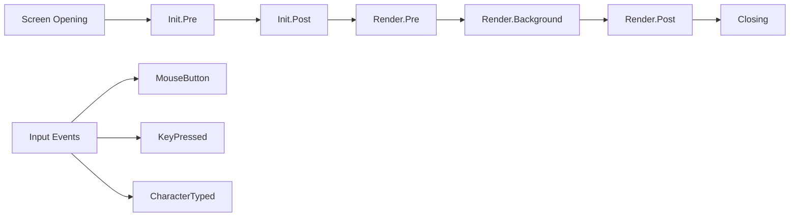
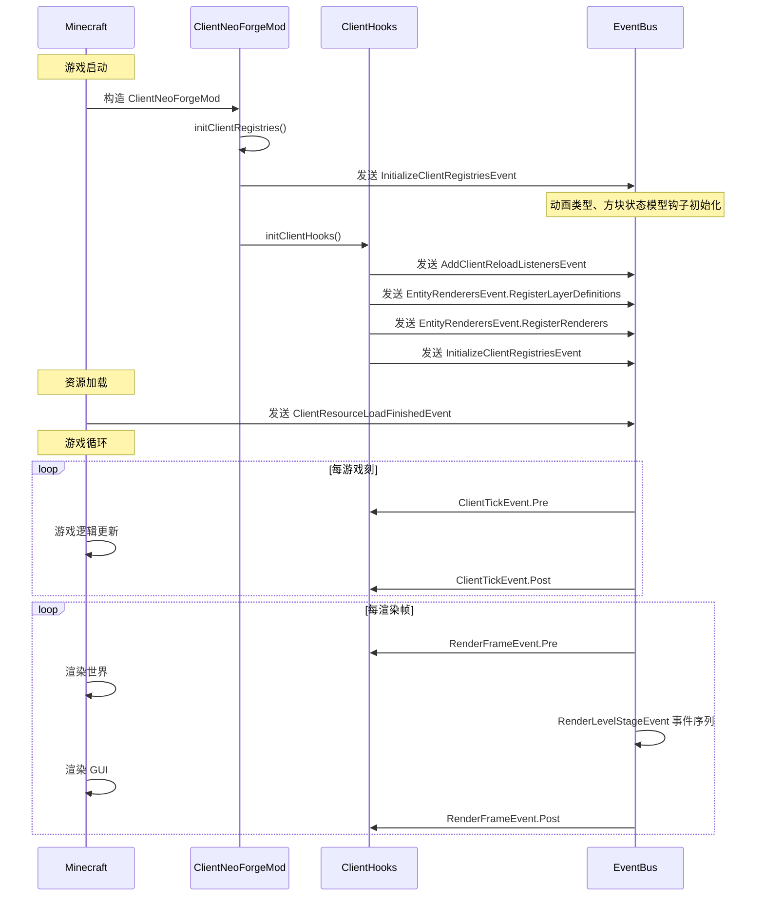
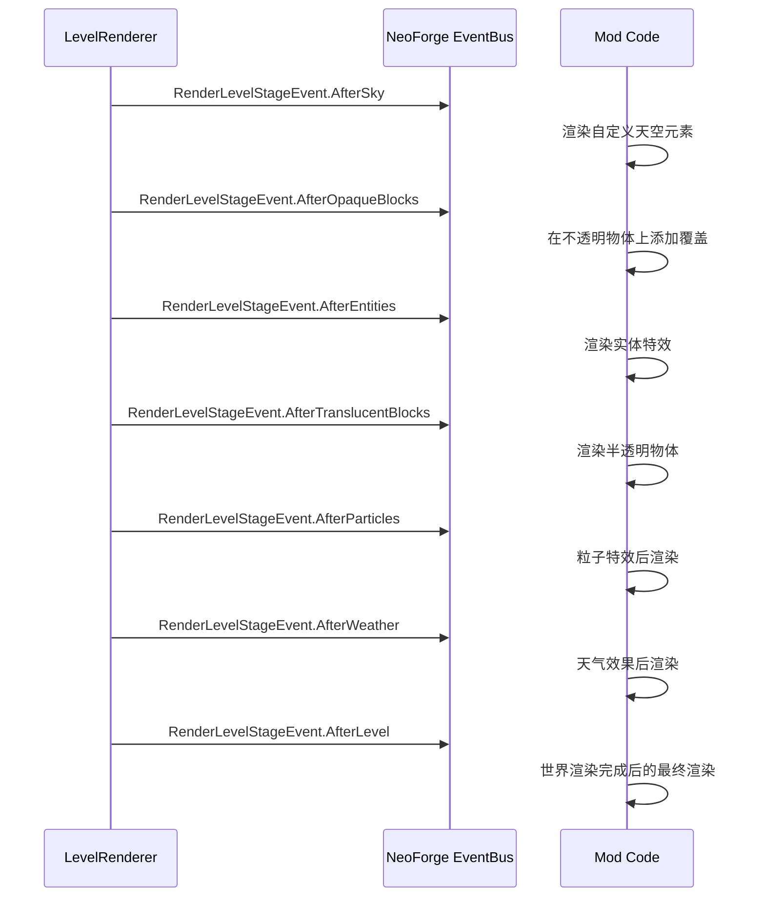
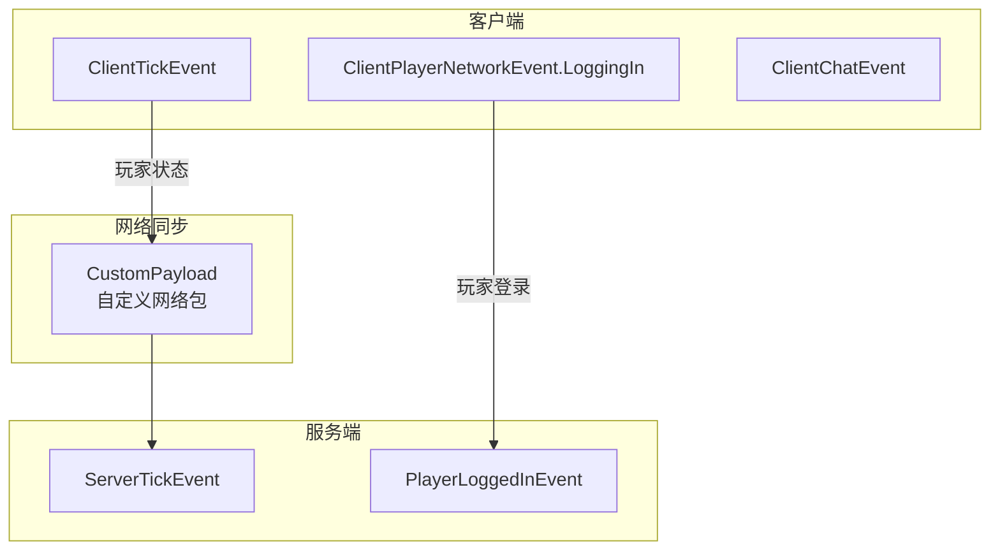

# 客户端系统

## 目录

- [1. 系统概述](#1-系统概述)
- [2. 目录结构](#2-目录结构)
- [3. 核心组件](#3-核心组件)
- [4. 客户端事件系统](#4-客户端事件系统)
- [5. 客户端扩展接口](#5-客户端扩展接口)
- [6. 工作流程图](#6-工作流程图)
- [7. API 使用示例](#7-api-使用示例)
- [8. 与服务端交互](#8-与服务端交互)
- [9. 总结](#9-总结)

## 1. 系统概述

NeoForge 1.21.x 的客户端系统是一套完整的事件驱动架构，用于处理所有仅在客户端执行的渲染、输入和资源加载逻辑。与传统 Minecraft Mod 混合客户端/服务端代码不同，NeoForge 通过 **`@Mod(dist = Dist.CLIENT)`** 注解和 **Dist 注解系统**严格分离双端代码。

### 设计理念

NeoForge 客户端系统的核心设计包含以下原则：

| 设计原则 | 说明 |
|---------|------|
| **事件驱动** | 使用 NeoForge Event Bus 处理所有客户端事件 |
| **注册机制** | 通过注册表（Registry）系统管理渲染器、粒子、模型等 |
| **扩展接口** | 通过 `IClient*Extensions` 接口为方块、物品、流体等提供客户端特定功能 |
| **生命周期管理** | 完整的客户端初始化、资源加载、渲染回调流程 |

### 关键特性

- **渲染管线集成**：支持自定义渲染类型、管线修饰符、帧图（Frame Graph）配置
- **输入处理**：完整的键盘、鼠标事件拦截和处理
- **资源管理**：纹理图集、粒子定义、模型加载器的注册
- **GUI 系统**：Screen 生命周期管理、Tooltip 定制、配置界面

## 2. 目录结构

NeoForge 客户端源码位于 `src/client/java/net/neoforged/neoforge/client/` 目录：

```
client/
├── ClientNeoForgeMod.java          # 客户端 Mod 主类
├── ClientHooks.java                 # 客户端钩子集合
├── ClientLifecycleHooks.java        # 生命周期钩子
├── ClientCommandHandler.java         # 客户端命令处理器
├── ClientTooltipFlag.java           # Tooltip 标志
├── CreativeModeTabSearchRegistry.java # 创造模式标签搜索
├── ColorResolverManager.java        # 颜色解析器管理
├── NamedRenderTypeManager.java      # 命名渲染类型管理
├── RenderTypeHelper.java           # 渲染类型辅助工具
├── RenderTypeGroup.java             # 渲染类型组
├── StencilManager.java             # 模板缓冲管理
├── NeoForgeRenderTypes.java        # NeoForge 渲染类型
├── NeoForgeRenderPipelines.java    # NeoForge 渲染管线
│
├── event/                          # 客户端事件包
│   ├── lifecycle/                  # 生命周期事件
│   ├── sound/                      # 声音相关事件
│   ├── AddClientReloadListenersEvent.java
│   ├── ClientTickEvent.java
│   ├── EntityRenderersEvent.java
│   ├── InputEvent.java
│   ├── RegisterColorHandlersEvent.java
│   ├── RegisterKeyMappingsEvent.java
│   ├── RegisterParticleProvidersEvent.java
│   ├── RenderLevelStageEvent.java
│   ├── ScreenEvent.java
│   └── ViewportEvent.java
│
├── extensions/                      # 客户端扩展接口
│   ├── common/                     # 通用扩展
│   │   ├── IClientFluidTypeExtensions.java
│   │   ├── IClientItemExtensions.java
│   │   └── IClientMobEffectExtensions.java
│   ├── blaze3d/                   # Blaze3D 渲染扩展
│   ├── BlockStateModelExtension.java
│   ├── IBlockEntityRendererExtension.java
│   └── IFontExtension.java
│
├── gui/                            # GUI 相关
│   ├── ClientTooltipComponentManager.java
│   ├── ConfigurationScreen.java
│   ├── map/                        # 地图装饰渲染
│   └── screen/                     # 屏幕相关
│
├── model/                          # 模型系统
│   ├── ao/                        # 环境光遮蔽
│   ├── block/                     # 方块模型
│   ├── generators/                 # 模型生成器
│   ├── item/                      # 物品模型
│   ├── obj/                       # OBJ 模型加载器
│   ├── pipeline/                  # 模型管线
│   └── quad/                      # 四边形处理
│
├── network/                        # 客户端网络
│   ├── ClientPacketDistributor.java
│   ├── ClientPayloadHandler.java
│   ├── event/
│   └── handling/
│
├── config/                        # 配置系统
├── data/                          # 客户端数据生成
├── entity/                        # 实体渲染相关
├── internal/                      # 内部实现
├── loading/                      # 加载流程
├── registries/                   # 客户端注册表管理
├── renderstate/                  # 渲染状态
├── resources/                    # 资源加载
├── settings/                     # 设置系统
└── textures/                    # 纹理系统
```

## 3. 核心组件

### 3.1 ClientNeoForgeMod - 客户端 Mod 主类

`ClientNeoForgeMod` 是 NeoForge 的客户端入口点，使用 `@Mod(dist = Dist.CLIENT)` 注解标记：

```java
@Mod(value = "neoforge", dist = Dist.CLIENT)
public class ClientNeoForgeMod {
    public ClientNeoForgeMod(IEventBus modEventBus, ModContainer container) {
        // 初始化客户端命令处理器
        ClientCommandHandler.init();
        
        // 注册配置
        container.registerConfig(ModConfig.Type.CLIENT, NeoForgeClientConfig.SPEC);
        
        // 注册模型加载器
        modEventBus.register(ClientNeoForgeMod.class);
    }
    
    @SubscribeEvent
    static void onRegisterModelLoaders(ModelEvent.RegisterLoaders event) {
        event.register(neoForgeId("empty"), EmptyModel.LOADER);
        event.register(neoForgeId("obj"), ObjLoader.INSTANCE);
        event.register(neoForgeId("composite"), CompositeUnbakedModel.Loader.INSTANCE);
    }
}
```

### 3.2 ClientHooks - 客户端钩子集合

`ClientHooks` 包含大量静态方法，作为客户端渲染和输入事件的桥梁：

| 类别 | 方法 | 说明 |
|------|------|------|
| **渲染** | `renderSpecificFirstPersonHand()` | 自定义第一人称手部渲染 |
|  | `renderSpecificFirstPersonArm()` | 自定义第一人称手臂渲染 |
|  | `renderBlockOverlay()` | 方块覆盖效果（如火焰、水） |
| **GUI** | `pushGuiLayer()` / `popGuiLayer()` | GUI 图层管理 |
|  | `drawScreen()` | 屏幕渲染钩子 |
| **输入** | `onScreenMouseClickedPre()` | 鼠标点击预处理 |
|  | `onScreenKeyPressedPre()` | 键盘按键预处理 |
| **FOV** | `getFieldOfViewModifier()` | 视野修改器事件 |
| **雾** | `getFogColor()` | 雾颜色计算 |
|  | `onSetupFog()` | 雾渲染设置 |

### 3.3 渲染管线

NeoForge 提供了完整的渲染管线扩展机制：

```java
// 注册自定义渲染管线
public static void gatherRenderPipelines(
        List<PipelineRegistry.PipelineTarget> targets) {
    // Mod 可添加自定义渲染目标
}

// 渲染管线修饰符
public class PipelineModifiers {
    public static void init() {
        // 初始化管线修饰符系统
    }
}
```

## 4. 客户端事件系统

NeoForge 的客户端事件分为两类：

| 事件总线 | 说明 |
|---------|------|
| **NeoForge Event Bus** (`NeoForge.EVENT_BUS`) | 主要事件总线，用于游戏循环、渲染、输入等 |
| **Mod Event Bus** (`modEventBus`) | 用于注册表初始化、模型加载器注册等 |

### 4.1 渲染阶段事件 (RenderLevelStageEvent)

在 `LevelRenderer` 渲染世界的不同阶段触发：



```java
// 监听示例：在天空渲染后添加自定义渲染
@SubscribeEvent
public static void onAfterSky(RenderLevelStageEvent.AfterSky event) {
    // 在天空渲染完成后执行自定义渲染
}
```

### 4.2 屏幕事件 (ScreenEvent)

Screen 系统提供完整的事件覆盖：



### 4.3 实体渲染器事件 (EntityRenderersEvent)

```java
// 注册实体渲染器
@SubscribeEvent
public static void onRegisterRenderers(EntityRenderersEvent.RegisterRenderers event) {
    event.registerEntityRenderer(
        MyModEntities.MY_ENTITY.get(),
        context -> new MyEntityRenderer(context)
    );
    
    event.registerBlockEntityRenderer(
        MyModBlocks.MY_BLOCK_ENTITY.get(),
        context -> new MyBlockEntityRenderer(context)
    );
}

// 注册模型层定义
@SubscribeEvent
public static void onRegisterLayers(EntityRenderersEvent.RegisterLayerDefinitions event) {
    event.registerLayerDefinition(
        MyModelLayers.MY_ARMOR,
        MyArmorModel::createBodyLayer
    );
}
```

### 4.4 粒子系统事件

```java
// 注册粒子提供者
@SubscribeEvent
public static void onRegisterParticles(RegisterParticleProvidersEvent event) {
    // 非精灵粒子（无纹理列表）
    event.registerSpecial(MyParticles.MY_PARTICLE.get(), 
        provider -> new MyParticleProvider());
    
    // 精灵粒子（有纹理列表）
    event.registerSpriteSet(MyParticles.MY_SPRITE_PARTICLE.get(),
        sprites -> new MySpriteParticleProvider(sprites));
}
```

### 4.5 关键事件列表

| 事件类 | 触发时机 | 用途 |
|--------|---------|------|
| `ClientTickEvent.Pre/Post` | 游戏刻前/后 | 每刻执行的逻辑 |
| `RenderFrameEvent.Pre/Post` | 渲染帧前/后 | 全局渲染控制 |
| `ComputeFovModifierEvent` | FOV 计算时 | 修改视野 |
| `RegisterKeyMappingsEvent` | 键位注册时 | 添加自定义键位 |
| `RegisterColorHandlersEvent` | 颜色处理器注册 | 方块/物品染色 |
| `ClientChatReceivedEvent` | 收到聊天消息 | 聊天拦截修改 |
| `ClientPlayerNetworkEvent` | 玩家网络状态变化 | 登录/登出处理 |

## 5. 客户端扩展接口

### 5.1 IClientItemExtensions

为物品提供客户端特定功能：

```java
public interface IClientItemExtensions {
    // 获取物品自定义字体
    @Nullable Font getFont(ItemStack stack, FontContext context);
    
    // 获取物品使用时的手臂姿势
    HumanoidModel.@Nullable ArmPose getArmPose(...);
    
    // 自定义第一人称手部变换
    boolean applyForgeHandTransform(...);
    
    // 获取护甲模型
    Model getHumanoidArmorModel(...);
    Model getGenericArmorModel(...);
    
    // 护甲染色
    int getArmorLayerTintColor(...);
    
    // 护甲纹理
    @Nullable Identifier getArmorTexture(...);
    
    // 第一人称覆盖层渲染
    void renderFirstPersonOverlay(...);
}
```

### 5.2 IClientFluidTypeExtensions

为流体类型提供客户端渲染功能：

```java
public interface IClientFluidTypeExtensions {
    // 静态纹理获取
    Identifier getStillTexture();
    Identifier getFlowingTexture();
    Identifier getOverlayTexture();
    
    // 动态纹理获取（基于状态和位置）
    Identifier getStillTexture(FluidState state, BlockAndTintGetter getter, BlockPos pos);
    
    // 染色颜色
    int getTintColor();
    int getTintColor(FluidState state, BlockAndTintGetter getter, BlockPos pos);
    
    // 雾效果修改
    Vector4f modifyFogColor(...);
    void modifyFogRender(...);
    
    // 水下覆盖纹理
    Identifier getRenderOverlayTexture(Minecraft mc);
    void renderOverlay(Minecraft mc, PoseStack poseStack, MultiBufferSource buffers);
    
    // 自定义流体渲染
    boolean renderFluid(...);
}
```

### 5.3 注册扩展

扩展通过 `RegisterClientExtensionsEvent` 注册：

```java
@SubscribeEvent
public static void onRegisterClientExtensions(RegisterClientExtensionsEvent event) {
    event.registerFluidType(new IClientFluidTypeExtensions() {
        @Override
        public Identifier getStillTexture() {
            return Identifier.of("modid", "block/my_fluid_still");
        }
        
        @Override
        public Identifier getFlowingTexture() {
            return Identifier.of("modid", "block/my_fluid_flowing");
        }
        
        @Override
        public int getTintColor() {
            return 0xFF8844; // ARGB 格式
        }
    }, MyModFluids.MY_FLUID_TYPE.get());
}
```

## 6. 工作流程图

### 6.1 客户端初始化流程



### 6.2 渲染事件时序



## 7. API 使用示例

### 7.1 创建自定义实体渲染器

```java
// 1. 创建渲染器类
public class MyEntityRenderer extends EntityRendererProvider<MyEntity> {
    private final EntityModelSet modelSet;
    private final RenderLayerAccess access;
    
    public MyEntityRenderer(Context context) {
        super(context);
        this.modelSet = context.getModelSet();
        this.access = context.getLayerRenderSetup();
    }
    
    @Override
    public void render(MyEntity entity, float entityYaw, float partialTick,
                       PoseStack poseStack, MultiBufferSource buffer, int packedLight) {
        // 渲染逻辑
        var model = getModel();
        model.setupAnim(entity, 0, 0, entity.tickCount, entity.getYRot(), entity.getXRot());
        
        var vertexConsumer = buffer.getBuffer(RenderType.entityCutout(getTextureLocation(entity)));
        model.renderToBuffer(poseStack, vertexConsumer, packedLight, 
            LivingEntityRenderer.getOverlayCoords(entity, 0), 1, 1, 1, 1);
    }
    
    @Override
    public ResourceLocation getTextureLocation(MyEntity entity) {
        return ResourceLocation.fromNamespaceAndPath("modid", "textures/entity/my_entity.png");
    }
}

// 2. 注册渲染器
@Mod("my-mod")
@EventBusSubscriber(bus = EventBusSubscriber.Bus.MOD)
public class MyModClient {
    @SubscribeEvent
    public static void registerRenderers(EntityRenderersEvent.RegisterRenderers event) {
        event.registerEntityRenderer(MyModEntities.MY_ENTITY.get(), 
            MyEntityRenderer::new);
    }
}
```

### 7.2 自定义屏幕

```java
@Mod("my-mod")
public class MyModClient {
    // 在 Mod 初始化时注册屏幕
    @SubscribeEvent
    public static void onRegisterScreens(RegisterMenuScreensEvent event) {
        event.register(MyModMenus.MY_CONTAINER.get(), MyContainerScreen::new);
    }
    
    // 监听屏幕事件
    @SubscribeEvent
    public static void onScreenInit(ScreenEvent.Init.Post event) {
        if (event.getScreen() instanceof MyContainerScreen screen) {
            // 添加自定义组件
            event.addListener(new MyCustomWidget());
        }
    }
    
    // 拦截屏幕渲染
    @SubscribeEvent
    public static void onScreenRender(ScreenEvent.Render.Pre event) {
        if (event.getScreen() instanceof MyContainerScreen) {
            // 在屏幕渲染前添加效果
        }
    }
}
```

### 7.3 自定义粒子

```java
// 1. 定义粒子类型（服务端注册）
public static final DeferredHolder<ParticleType<MyParticleOptions>, ParticleType<MyParticleOptions>> MY_PARTICLE = 
    REGISTER.register("my_particle", () -> 
        new ParticleType<MyParticleOptions>(false, MyParticleOptions.UI_MATERIALS) {
            // 粒子类型配置
        });

// 2. 定义粒子选项
public record MyParticleOptions(Identifier texture, float size, int color) 
    implements ParticleOptions {
    // 实现 codec 和 factory
}

// 3. 创建粒子提供者
public class MyParticleProvider implements ParticleProvider<MyParticleOptions> {
    private final SpriteSet sprites;
    
    public MyParticleProvider(SpriteSet sprites) {
        this.sprites = sprites;
    }
    
    @Override
    public Particle createParticle(MyParticleOptions options, ClientLevel level,
                                    double x, double y, double z,
                                    double xSpeed, double ySpeed, double zSpeed) {
        return new MyParticle(level, x, y, z, xSpeed, ySpeed, zSpeed, 
            this.sprites, options);
    }
}

// 4. 注册粒子
@Mod.EventBusSubscriber(bus = Mod.EventBusSubscriber.Bus.MOD, value = Dist.CLIENT)
public class MyModParticles {
    @SubscribeEvent
    public static void registerParticles(RegisterParticleProvidersEvent event) {
        event.registerSpriteSet(MyParticles.MY_PARTICLE.get(), 
            MyParticleProvider::new);
    }
}
```

### 7.4 键位注册

```java
public class MyModKeys {
    public static final KeyMapping MY_KEY = new KeyMapping(
        KeyMapping.Category.MISC.getOrCreateCategory("my_mod"),
        "key.my_mod.my_key",
        InputConstants.Type.KEYSYM,
        GLFW.GLFW_KEY_P,
        "key.categories.my_mod"
    );
    
    @SubscribeEvent
    public static void registerKeys(RegisterKeyMappingsEvent event) {
        event.register(MY_KEY);
    }
    
    @SubscribeEvent
    public static void onKeyPress(InputEvent.InteractionKeyMappingTriggered event) {
        if (event.getKeyMapping() == MY_KEY && event.hand() == InteractionHand.MAIN_HAND) {
            // 执行键位触发逻辑
        }
    }
}
```

## 8. 与服务端交互

### 8.1 Dist 注解系统

NeoForge 使用 `@Dist` 注解严格分离客户端和服务端代码：

```java
// 仅在客户端加载
@Mod(value = "my-mod", dist = Dist.CLIENT)
public class MyModClient {
    // 客户端代码
}

// 仅在物理客户端执行
@SubscribeEvent(dist = Dist.CLIENT)
public void onClientEvent(ClientTickEvent event) {
    // 仅在客户端执行
}

// 仅在服务端执行
@SubscribeEvent(dist = Dist.DEDICATED_SERVER)
public void onServerEvent(ServerTickEvent event) {
    // 仅在服务端执行
}

// 在两端都执行
@SubscribeEvent
public void onUniversalEvent(Init event) {
    // 两端都执行
}
```

### 8.2 客户端/服务端事件交互



### 8.3 自定义网络包

```java
// 定义网络包
public record MyCustomPacket(int value, String message) implements CustomPacketPayload {
    public static final ResourceLocation ID = ResourceLocation.fromNamespaceAndPath("mymod", "custom");
    public static final StreamCodec<RegistryByteBuf, MyCustomPacket> CODEC = StreamCodec.of(
        MyCustomPacket::write, MyCustomPacket::new
    );
    
    @Override
    public Id<MyCustomPacket> id() { return ID; }
    
    private void write(RegistryByteBuf buf) {
        buf.writeInt(value);
        buf.writeUtf(message);
    }
    
    private MyCustomPacket(RegistryByteBuf buf) {
        this(buf.readInt(), buf.readUtf());
    }
}

// 客户端发送包
public class MyModClientNetworking {
    public static void sendToServer(MyCustomPacket packet) {
        NeoForgeNetwork HANDLER.sendToServer(packet);
    }
}

// 服务端处理包
public class MyModServerNetworking {
    @SubscribeEvent
    public static void registerHandlers(RegisterPayloadHandlersEvent event) {
        event.registerToServer(ID, (payload, context) -> {
            context.enqueueWork(() -> {
                ServerPlayer player = context.getPlayer();
                // 处理包
            });
        });
    }
}
```

## 9. 总结

NeoForge 1.21.x 的客户端系统提供了完整、灵活的客户端开发框架：

### 核心优势

1. **严格的 Dist 分离**：通过编译期和运行期双重检查，确保客户端代码不会在服务端执行
2. **事件驱动的架构**：丰富的事件系统覆盖了渲染、输入、资源加载等所有客户端生命周期
3. **扩展接口模式**：`IClient*Extensions` 接口提供了优雅的扩展机制
4. **灵活的渲染管线**：支持自定义渲染类型、管线修饰符和帧图配置
5. **完整的生命周期管理**：从游戏启动到资源加载再到渲染帧的完整钩子

### 关键设计模式

| 模式 | 应用场景 |
|------|---------|
| **观察者模式** | 事件系统 |
| **策略模式** | 扩展接口（不同的流体类型实现） |
| **工厂模式** | EntityRendererProvider、BlockEntityRendererProvider |
| **单例模式** | ClientHooks 中的静态工具方法 |

### 学习路径建议

1. 从 `ClientNeoForgeMod` 了解客户端入口
2. 深入 `ClientHooks` 理解钩子机制
3. 研究 `RenderLevelStageEvent` 掌握渲染管线
4. 学习 `ScreenEvent` 了解 GUI 交互
5. 实践 `EntityRenderersEvent` 注册实体渲染
6. 探索扩展接口实现自定义渲染

---

> **源码路径**: `D:\Minecraft-Learning\assets\NeoForge-1.21.x\src\client\java\net\neoforged\neoforge\client\`
