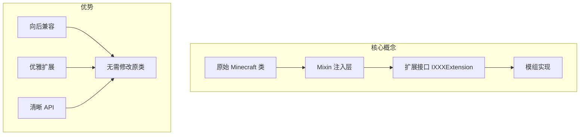
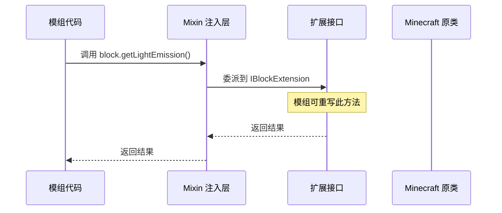

# 通用扩展与工具

## 目录

- [1. 系统概述](#1-系统概述)
- [2. 扩展接口详解](#2-扩展接口详解)
  - [2.1 核心扩展接口](#21-核心扩展接口)
  - [2.2 扩展接口与 Mixin 协作机制](#22-扩展接口与-mixin-协作机制)
- [3. 常用工具类](#3-常用工具类)
- [4. API 使用示例](#4-api-使用示例)
- [5. 总结](#5-总结)

## 1. 系统概述

NeoForge 的 `common` 模块提供了两套核心扩展机制：**扩展接口（Extension Interfaces）** 和 **工具类（Utility Classes）**。这两者相辅相成，共同为模组开发者提供强大的功能扩展能力。

### 扩展接口的设计理念

扩展接口是 NeoForge 实现向后兼容和优雅扩展的核心机制。其设计基于 **接口默认方法（Default Methods）** 和 **Mixin 注入** 的结合：



**关键术语解释：**
- **Mixin**：一种代码注入机制，允许在不修改原类的情况下向类中添加方法
- **扩展接口**：以 `I` 开头、以 `Extension` 结尾的接口，如 `IBlockExtension`

### extensions 目录结构

```
extensions/
├── IBlockExtension.java        # 方块扩展
├── IEntityExtension.java       # 实体扩展
├── IItemExtension.java         # 物品扩展
├── IItemStackExtension.java    # 物品堆扩展
├── IFluidExtension.java        # 流体扩展
├── ILevelExtension.java        # 世界扩展
├── IBlockEntityExtension.java  # 方块实体扩展
├── ILivingEntityExtension.java # 活体实体扩展
├── IPlayerExtension.java       # 玩家扩展
├── IBlockStateExtension.java  # 方块状态扩展
└── ... (共 50+ 个扩展接口)
```

### util 目录结构

```
util/
├── FakePlayer.java             # 模拟玩家
├── AttributeUtil.java          # 属性工具
├── ItemStackMap.java           # 物品堆映射
├── TransformationHelper.java   # 变换辅助
├── Lazy.java                  # 延迟加载
├── BlockSnapshot.java          # 方块快照
├── FriendlyByteBufUtil.java    # 网络缓冲区工具
├── ConcatenatedListView.java   # 列表视图
└── ... (共 30+ 个工具类)
```

## 2. 扩展接口详解

### 2.1 核心扩展接口

#### IBlockExtension（方块扩展）

`IBlockExtension` 是最常用的扩展接口之一，提供了 50+ 个可重写方法。

**核心方法分类：**

| 分类 | 方法示例 | 说明 |
|------|----------|------|
| **物理属性** | `getFriction()`, `getExplosionResistance()` | 控制摩擦力和爆炸抗性 |
| **光照系统** | `getLightEmission()`, `hasDynamicLightEmission()` | 动态光源支持 |
| **红石系统** | `canConnectRedstone()`, `shouldCheckWeakPower()` | 自定义红石连接 |
| **实体交互** | `isLadder()`, `canEntityDestroy()` | 梯子、实体破坏检测 |
| **音效粒子** | `addLandingEffects()`, `playStepSound()` | 自定义音效和粒子 |
| **工具交互** | `getToolModifiedState()` | 工具右键交互（斧子剥离等） |
| **燃烧系统** | `getFlammability()`, `onCaughtFire()` | 火焰传播控制 |

#### IEntityExtension（实体扩展）

**关键方法：**

```java
// 持久化数据存储
CompoundTag getPersistentData();

// 实体多部分支持（用于末影龙等）
boolean isMultipartEntity();
PartEntity<?>[] getParts();

// 流体交互
double getFluidTypeHeight(FluidType type);
boolean isInFluidType(FluidType type);

// 附件系统
void copyAttachmentsFrom(Entity other, boolean isDeath);
```

#### IItemExtension / IItemStackExtension（物品扩展）

```java
// 物品能力检测
boolean canPerformAction(ItemAbility itemAbility);

// 耐久和修复
int getDamage(ItemStack stack);
float getXpRepairRatio(ItemStack stack);

// 附魔支持
int getEnchantmentLevel(ItemStack stack, Holder<Enchantment> enchantment);
ItemEnchantments getAllEnchantments(ItemStack stack, RegistryLookup<Enchantment> lookup);

// 熔炉燃料
int getBurnTime(ItemStack stack, RecipeType<?> recipeType, FuelValues fuelValues);
```

#### ILevelExtension（世界扩展）

```java
// 能力系统查询
<T, C> T getCapability(BlockCapability<T, C> cap, BlockPos pos, C context);

// 能力失效通知
void invalidateCapabilities(BlockPos pos);
void invalidateCapabilities(ChunkPos pos);

// 模型数据管理
ModelDataManager getModelDataManager();
```

### 2.2 扩展接口与 Mixin 协作机制

NeoForge 使用 Mixin 在游戏类中注入扩展接口的实现，协作流程如下：



**Mixin 配置示例：**

```java
// neoforge.mixins.json 中的配置
{
  "mixins": [
    "neoforge.mixins.common.extensions.BlockMixin"
  ],
  "injectors": {
    "defaultRequire": 1
  }
}
```

## 3. 常用工具类

### 工具类功能对照表

| 工具类 | 功能 | 使用场景 |
|--------|------|----------|
| `FakePlayer` | 模拟服务器玩家执行操作 | 自动化的区块加载、实体交互测试 |
| `AttributeUtil` | 属性修饰符工具 | 物品属性提示格式化 |
| `ItemStackMap` | 基于物品类型和 NBT 的 Map | 存储玩家背包数据、缓存 |
| `TransformationHelper` | 3D 变换（旋转、缩放、平移） | 模型变换、动画 |
| `Lazy<T>` | 延迟初始化 | 避免过早初始化开销 |
| `BlockSnapshot` | 方块状态快照 | 方块操作的事务性处理 |
| `FriendlyByteBufUtil` | 网络数据包工具 | 自定义网络协议 |

### FakePlayer 详解

`FakePlayer` 是一个特殊的 `ServerPlayer` 子类，用于在服务器端模拟玩家操作，常用场景：

```java
// 创建 FakePlayer
GameProfile profile = new GameProfile(UUID.randomUUID(), "FakePlayer");
FakePlayer fakePlayer = FakePlayerFactory.getOrCreate(level, profile);

// 使用场景 1: 触发方块的 use 方法
fakePlayer.setItemInHand(InteractionHand.MAIN_HAND, myItemStack);
fakePlayer.gameMode.interact(fakePlayer, level.getBlockState(pos), 
    InteractionHand.MAIN_HAND, pos, Direction.UP);

// 使用场景 2: 触发实体交互
fakePlayer.gameMode.interact(fakePlayer, targetEntity, InteractionHand.MAIN_HAND);
```

### Lazy 延迟加载

```java
// 基本用法
private final Lazy<HeavyObject> heavyObject = Lazy.of(() -> new HeavyObject());

// 延迟获取
HeavyObject obj = heavyObject.get(); // 首次调用时初始化

// 失效并重新计算
heavyObject.invalidate(); // 下次 get() 会重新初始化
```

## 4. API 使用示例

### 示例 1: 实现自定义方块的动态光源

```java
public class GlowStoneBlock extends Block implements IBlockExtension {
    
    @Override
    public boolean hasDynamicLightEmission(BlockState state) {
        return true; // 启用动态光源
    }
    
    @Override
    public int getLightEmission(BlockState state, BlockGetter level, BlockPos pos) {
        // 从方块实体获取光源强度
        TileEntity te = level.getBlockEntity(pos);
        if (te instanceof GlowStoneTileEntity glowTile) {
            return glowTile.getLightLevel();
        }
        return 15; // 默认最大光源
    }
    
    @Override
    public void onNeighborChange(BlockState state, LevelReader level, 
                                 BlockPos pos, BlockPos neighbor) {
        // 邻居方块变化时，通知光源可能改变
        level.invalidateCapabilities(pos);
    }
}
```

### 示例 2: 实体扩展实现自定义流体行为

```java
public class LavaWalker extends LivingEntity implements ILivingEntityExtension {
    
    @Override
    public boolean canSwimInFluidType(FluidType type) {
        // 自定义熔岩游泳逻辑
        if (type == NeoForgeMod.LAVA_TYPE.value()) {
            return this.hasEffect(MobEffects.FIRE_RESISTANCE);
        }
        return IEntityExtension.super.canSwimInFluidType(type);
    }
    
    @Override
    public boolean canDrownInFluidType(FluidType type) {
        // 熔岩中不会溺水（除非没有抗火效果）
        if (type == NeoForgeMod.LAVA_TYPE.value()) {
            return !this.hasEffect(MobEffects.FIRE_RESISTANCE);
        }
        return ILivingEntityExtension.super.canDrownInFluidType(type);
    }
}
```

### 示例 3: 使用 FakePlayer 自动化操作

```java
public class ChunkLoader {
    
    public static void simulatePlayerInteraction(ServerLevel level, BlockPos pos) {
        // 创建或获取 FakePlayer
        FakePlayer player = FakePlayerFactory.getOrCreate(
            level,
            new GameProfile(UUID.randomUUID(), "ChunkLoader")
        );
        
        // 移动到目标位置
        player.setPos(pos.getX() + 0.5, pos.getY() + 1.0, pos.getZ() + 0.5);
        
        // 模拟右键点击（触发方块交互）
        ItemStack heldItem = player.getMainHandItem();
        BlockState state = level.getBlockState(pos);
        UseOnContext context = new UseOnContext(
            player, InteractionHand.MAIN_HAND, 
            new BlockHitResult(Vec3.ZERO, Direction.DOWN, pos, false)
        );
        
        state.use(level, player, InteractionHand.MAIN_HAND, context);
        
        // 通知能力系统更新
        level.invalidateCapabilities(pos);
    }
}
```

### 示例 4: 物品属性扩展

```java
public class MagicSword extends SwordItem implements IItemExtension {
    
    private static final UUID ATTACK_RANGE_UUID = UUID.fromString(
        "CB3F55D3-645C-4F38-A497-9C13A33DB5B9"
    );
    
    @Override
    public ItemAttributeModifiers getDefaultAttributeModifiers(ItemStack stack) {
        if (stack.has(DataComponents.ENCHANTMENTS)) {
            // 附魔后增加攻击范围
            return ItemAttributeModifiers.builder()
                .add(
                    Attributes.ATTACK_RANGE, 
                    new AttributeModifier(
                        ATTACK_RANGE_UUID, 
                        0.5, 
                        Operation.ADD_VALUE
                    ),
                    EquipmentSlotGroup.MAINHAND
                )
                .build();
        }
        return ItemAttributeModifiers.EMPTY;
    }
    
    @Override
    public float getXpRepairRatio(ItemStack stack) {
        // 增加修复经验效率
        return 2.0f; // 普通是 1.0f
    }
}
```

## 5. 总结

### 扩展接口使用指南

| 场景 | 推荐扩展接口 |
|------|-------------|
| 自定义方块属性/行为 | `IBlockExtension` |
| 实体生命周期/属性 | `IEntityExtension`, `ILivingEntityExtension` |
| 物品能力/属性 | `IItemExtension`, `IItemStackExtension` |
| 世界级别查询 | `ILevelExtension`, `ILevelReaderExtension` |
| 方块实体数据同步 | `IBlockEntityExtension` |
| 玩家交互/菜单 | `IPlayerExtension`, `IMenuProviderExtension` |

### 最佳实践

1. **优先使用扩展接口**：避免直接 Mixin 到游戏类，优先实现扩展接口
2. **利用默认方法**：扩展接口提供了合理的默认实现，只重写必要的方法
3. **注意线程安全**：某些扩展方法可能在不同线程调用（如渲染线程）
4. **正确处理 null**：使用 `@Nullable` 注解标记可能为 null 的参数
5. **利用 Capability 系统**：`ILevelExtension.getCapability()` 是查询方块能力的推荐方式

### NeoForge 与 Fabric 的对比

| 特性 | NeoForge | Fabric |
|------|----------|--------|
| 扩展机制 | 扩展接口 + Mixin | Mixin 直接注入 |
| API 风格 | 偏向继承/接口 | 偏向回调/事件 |
| 代码侵入性 | 较低 | 中等 |
| 扩展接口数量 | 50+ | N/A（使用 Mixin） |

NeoForge 的扩展接口机制提供了一种优雅且向后兼容的方式来扩展 Minecraft 的核心类，是其最重要的设计特色之一。
