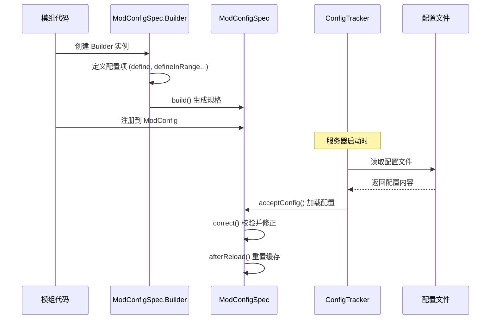

# 配置与服务器系统

## 目录

- [1. 系统概述](#1-系统概述)
- [2. 配置系统](#2-配置系统)
  - [2.1 ModConfigSpec 核心架构](#21-modconfigspec-核心架构)
  - [2.2 配置值类型](#22-配置值类型)
  - [2.3 NeoForge 内置配置](#23-neoforge-内置配置)
- [3. 权限系统](#3-权限系统)
  - [3.1 PermissionAPI 核心接口](#31-permissionapi-核心接口)
  - [3.2 PermissionNode 权限节点](#32-permissionnode-权限节点)
  - [3.3 权限类型系统](#33-权限类型系统)
  - [3.4 动态上下文](#34-动态上下文)
  - [3.5 权限处理器](#35-权限处理器)
- [4. 服务器生命周期](#4-服务器生命周期)
- [5. 工作流程图](#5-工作流程图)
- [6. API 使用示例](#6-api-使用示例)
- [7. 服务端命令系统](#7-服务端命令系统)
- [8. 总结](#8-总结)

---

## 1. 系统概述

NeoForge 1.21.x 的配置与服务器系统是模组框架的核心基础设施，主要由三大子系统组成：

| 子系统 | 职责 | 源码位置 |
|--------|------|----------|
| **配置系统** | 管理模组配置的声明、加载、验证和持久化 | `common/ModConfigSpec.java` |
| **权限系统** | 提供细粒度的玩家权限检查机制 | `server/permission/` |
| **生命周期管理** | 处理服务器启动、运行、停止各阶段的事件 | `server/ServerLifecycleHooks.java` |

**关键设计目标**：
- **声明式配置**：使用 Builder 模式定义配置项，支持类型安全的验证
- **热重载支持**：区分 `NONE`、`WORLD`、`GAME` 三种重启级别
- **可扩展权限**：允许第三方实现自定义权限处理器
- **事件驱动**：通过事件总线与游戏生命周期深度集成

---

## 2. 配置系统

### 2.1 ModConfigSpec 核心架构

`ModConfigSpec` 是 NeoForge 配置系统的核心类，它基于 NightConfig 库构建，提供了一套类型安全的配置声明 API。

```12:58:D:\Minecraft-Learning\assets\NeoForge-1.21.x\src\main\java\net\neoforged\neoforge\common\ModConfigSpec.java
public class ModConfigSpec implements IConfigSpec {
    // 存储配置的规格定义（类型验证器、范围限制等）
    private final UnmodifiableConfig spec;
    // 存储实际的配置值（带缓存）
    private final UnmodifiableConfig values;
    // 当前加载的配置实例
    @Nullable
    private ILoadedConfig loadedConfig;
    // 中间层级（分类）的注释和翻译键
    private final Map<List<String>, String> levelComments;
    private final Map<List<String>, String> levelTranslationKeys;
```

#### 配置加载流程



#### Builder 模式使用

```56:100:D:\Minecraft-Learning\assets\NeoForge-1.21.x\src\main\java\net\neoforged\neoforge\common\ModConfigSpec.java
public static class Builder {
    // 配置规格（内部使用）
    private final Config spec = Config.of(LinkedHashMap::new, InMemoryFormat.withUniversalSupport());
    // 构建上下文（当前路径、注释、翻译键等）
    private BuilderContext context = new BuilderContext();
    // 分类级别的注释
    private final Map<List<String>, String> levelComments = new HashMap<>();
    // 分类级别的翻译键
    private final Map<List<String>, String> levelTranslationKeys = new HashMap<>();
    // 当前构建路径
    private final List<String> currentPath = new ArrayList<>();
    // 所有配置值的列表
    private final List<ConfigValue<?>> values = new ArrayList<>();
```

关键方法：

| 方法 | 用途 |
|------|------|
| `define(path, defaultValue)` | 定义通用配置项 |
| `defineInRange(path, default, min, max)` | 定义带数值范围的配置 |
| `defineEnum(path, defaultValue)` | 定义枚举配置 |
| `defineList(path, default, validator)` | 定义列表配置 |
| `comment(String)` | 添加注释/说明 |
| `translation(String)` | 设置翻译键 |
| `worldRestart()` | 标记需要世界重启 |
| `gameRestart()` | 标记需要游戏重启 |
| `push(String)` | 进入分类 |
| `pop()` | 返回上级分类 |

### 2.2 配置值类型

NeoForge 提供了多种类型安全的配置值包装类：

```1186:1282:D:\Minecraft-Learning\assets\NeoForge-1.21.x\src\main\java\net\neoforged\neoforge\common\ModConfigSpec.java
public static class ConfigValue<T> implements Supplier<T> {
    private final Builder parent;
    private final List<String> path;
    private final Supplier<T> defaultSupplier;
    @Nullable
    private T cachedValue = null;  // 值缓存，支持热重载
    @Nullable
    private ModConfigSpec spec;
```

专用类型封装：

| 类型 | 实现类 | 特殊方法 |
|------|--------|----------|
| `Boolean` | `BooleanValue` | `isTrue()`, `isFalse()`, `getAsBoolean()` |
| `Integer` | `IntValue` | `getAsInt()` |
| `Long` | `LongValue` | `getAsLong()` |
| `Double` | `DoubleValue` | `getAsDouble()` |
| `Enum` | `EnumValue<T>` | 支持自定义转换器 |
| `List` | `ConfigValue<List>` | 支持元素验证和大小限制 |

#### 重启类型枚举

```1379:1409:D:\Minecraft-Learning\assets\NeoForge-1.21.x\src\main\java\net\neoforged\neoforge\common\ModConfigSpec.java
public enum RestartType {
    NONE,      // 无需重启，立即生效
    WORLD,     // 需要重载世界（关闭/重新打开存档）
    GAME;      // 需要完全重启游戏（不支持 SERVER 类型配置）
}
```

### 2.3 NeoForge 内置配置

#### NeoForgeCommonConfig

通用配置，在服务器启动前就需要可用：

```16:49:D:\Minecraft-Learning\assets\NeoForge-1.21.x\src\main\java\net\neoforged\neoforge\common\config\NeoForgeCommonConfig.java
public final class NeoForgeCommonConfig {
    // 记录未翻译的物品标签警告
    public final ModConfigSpec.EnumValue<TagConventionLogWarning.LogWarningMode> logUntranslatedItemTagWarnings;
    
    // 记录使用 legacy 命名空间标签的警告
    public final ModConfigSpec.EnumValue<TagConventionLogWarning.LogWarningMode> logLegacyTagWarnings;
    
    // 显示物品属性的高级调试信息
    public final ModConfigSpec.BooleanValue attributeAdvancedTooltipDebugInfo;
}
```

#### NeoForgeServerConfig

服务端配置，需要同步到客户端或按世界配置：

```16:66:D:\Minecraft-Learning\assets\NeoForge-1.21.x\src\main\java\net\neoforged\neoforge\common\config\NeoForgeServerConfig.java
public final class NeoForgeServerConfig {
    // 移除抛出错误的 BlockEntity（而不是关闭服务器）
    public final ModConfigSpec.BooleanValue removeErroringBlockEntities;
    
    // 移除抛出错误的 Entity
    public final ModConfigSpec.BooleanValue removeErroringEntities;
    
    // 使用完整碰撞箱检测梯子
    public final ModConfigSpec.BooleanValue fullBoundingBoxLadders;
    
    // 权限处理器选择
    public final ModConfigSpec.ConfigValue<String> permissionHandler;
    
    // 向 LAN 客户端广播服务器
    public final ModConfigSpec.BooleanValue advertiseDedicatedServerToLan;
}
```

---

## 3. 权限系统

NeoForge 的权限系统提供了一套灵活、可扩展的权限检查机制，与传统 Minecraft 权限（基于命令权限等级）不同，它允许模组定义任意类型的权限节点。

### 3.1 PermissionAPI 核心接口

```29:122:D:\Minecraft-Learning\assets\NeoForge-1.21.x\src\main\java\net\neoforged\neoforge\server\permission\PermissionAPI.java
public final class PermissionAPI {
    // 当前激活的权限处理器
    private static IPermissionHandler activeHandler = null;
    
    // 获取所有已注册的权限节点
    public static Collection<PermissionNode<?>> getRegisteredNodes() {
        return activeHandler == null ? Collections.emptySet() : activeHandler.getRegisteredNodes();
    }
    
    // 查询在线玩家的权限
    public static <T> T getPermission(ServerPlayer player, PermissionNode<T> node, 
                                       PermissionDynamicContext<?>... context) {
        if (!activeHandler.getRegisteredNodes().contains(node)) 
            throw new UnregisteredPermissionException(node);
        return activeHandler.getPermission(player, node, context);
    }
    
    // 查询离线玩家的权限
    public static <T> T getOfflinePermission(UUID player, PermissionNode<T> node,
                                             PermissionDynamicContext<?>... context) {
        if (!activeHandler.getRegisteredNodes().contains(node)) 
            throw new UnregisteredPermissionException(node);
        return activeHandler.getOfflinePermission(player, node, context);
    }
    
    // 初始化权限 API（仅由 ServerLifecycleHooks 调用）
    public static void initializePermissionAPI() {
        // 触发 PermissionGatherEvent.Handler 事件
        PermissionGatherEvent.Handler handlerEvent = new PermissionGatherEvent.Handler();
        NeoForge.EVENT_BUS.post(handlerEvent);
        
        // 获取所有可用的权限处理器工厂
        Map<Identifier, IPermissionHandlerFactory> availableHandlers = 
            handlerEvent.getAvailablePermissionHandlerFactories();
        
        // 根据配置选择处理器
        Identifier selectedPermissionHandler = 
            Identifier.parse(NeoForgeServerConfig.INSTANCE.permissionHandler.get());
        
        // 触发 PermissionGatherEvent.Nodes 事件收集节点
        PermissionGatherEvent.Nodes nodesEvent = new PermissionGatherEvent.Nodes();
        NeoForge.EVENT_BUS.post(nodesEvent);
        
        // 创建权限处理器实例
        IPermissionHandlerFactory factory = availableHandlers.get(selectedPermissionHandler);
        PermissionAPI.activeHandler = factory.create(nodesEvent.getNodes());
    }
}
```

### 3.2 PermissionNode 权限节点

`PermissionNode` 是权限系统的基本单元：

```44:163:D:\Minecraft-Learning\assets\NeoForge-1.21.x\src\main\java\net\neoforged\neoforge\server\permission\nodes\PermissionNode.java
public final class PermissionNode<T> {
    private final String nodeName;        // 权限节点名称，如 "mymod.admin.bypass"
    private final PermissionType<T> type; // 权限类型
    private final PermissionResolver<T> defaultResolver; // 默认解析器
    private final PermissionDynamicContextKey<?>[] dynamics; // 动态上下文键
    
    @Nullable
    private Component readableName;        // 可读名称（用于 UI）
    @Nullable
    private Component description;        // 描述
```

**节点命名规范**：建议使用 `modid.action.target` 格式，如：
- `my mod.kick.player` - 踢出玩家权限
- `my mod.teleport.bypass` - 传送绕过限制权限

#### 权限解析器

```140:150:D:\Minecraft-Learning\assets\NeoForge-1.21.x\src\main\java\net\neoforged\neoforge\server\permission\nodes\PermissionNode.java
@FunctionalInterface
public interface PermissionResolver<T> {
    /**
     * @param player     在线玩家（离线查询时为 null）
     * @param playerUUID 玩家 UUID
     * @param context    动态上下文
     * @return 权限值
     */
    T resolve(@Nullable ServerPlayer player, UUID playerUUID, 
              PermissionDynamicContext<?>... context);
}
```

### 3.3 权限类型系统

NeoForge 内置了四种基本权限类型：

```14:32:D:\Minecraft-Learning\assets\NeoForge-1.21.x\src\main\java\net\neoforged\neoforge\server\permission\nodes\PermissionTypes.java
public final class PermissionTypes {
    // 布尔类型 - 最常用
    public static final PermissionType<Boolean> BOOLEAN = 
        new PermissionType<>(Boolean.class, "boolean");
    
    // 整数类型 - 用于等级或次数限制
    public static final PermissionType<Integer> INTEGER = 
        new PermissionType<>(Integer.class, "integer");
    
    // 字符串类型 - 用于角色名称等
    public static final PermissionType<String> STRING = 
        new PermissionType<>(String.class, "string");
    
    // 组件类型 - 用于返回富文本消息
    public static final PermissionType<Component> COMPONENT = 
        new PermissionType<>(Component.class, "component");
}
```

`PermissionType` 类的定义：

```15:51:D:\Minecraft-Learning\assets\NeoForge-1.21.x\src\main\java\net\neoforged\neoforge\server\permission\nodes\PermissionType.java
public final class PermissionType<T> {
    private final Class<T> typeToken;  // 类型标记
    private final String typeName;     // 类型名称
}
```

### 3.4 动态上下文

动态上下文允许在权限检查时提供额外的环境信息，类似于 BlockState 的 Property 概念：

```19:51:D:\Minecraft-Learning\assets\NeoForge-1.21.x\src\main\java\net\neoforged\neoforge\server\permission\nodes\PermissionDynamicContext.java
public final class PermissionDynamicContext<T> {
    private PermissionDynamicContextKey<T> dynamic;  // 上下文键
    private T value;                                 // 值
}
```

**上下文键定义**（Record 类型）：

```19:23:D:\Minecraft-Learning\assets\NeoForge-1.21.x\src\main\java\net\neoforged\neoforge\server\permission\nodes\PermissionDynamicContextKey.java
public record PermissionDynamicContextKey<T>(
    Class<T> typeToken,                              // 类型标记
    String name,                                     // 键名称
    Function<T, String> serializer                   // 序列化函数
) {
    public PermissionDynamicContext<T> createContext(T value) {
        return new PermissionDynamicContext<>(this, value);
    }
}
```

**使用示例**：创建一个维度上下文键

```java
// 定义维度上下文键
PermissionDynamicContextKey<ResourceKey<Level>> DIMENSION_KEY = 
    new PermissionDynamicContextKey<>(
        DimensionType.class,
        "dimension",
        ResourceKey::location
    );

// 查询权限时传入上下文
var context = DIMENSION_KEY.createContext(Level.END);
boolean canBuild = PermissionAPI.getPermission(
    player, 
    BUILD_PERMISSION_NODE, 
    context
);
```

### 3.5 权限处理器

#### IPermissionHandler 接口

```26:64:D:\Minecraft-Learning\assets\NeoForge-1.21.x\src\main\java\net\neoforged\neoforge\server\permission\handler\IPermissionHandler.java
public interface IPermissionHandler {
    // 获取处理器标识符
    Identifier getIdentifier();
    
    // 获取所有已注册的权限节点
    Set<PermissionNode<?>> getRegisteredNodes();
    
    // 查询在线玩家权限
    <T> T getPermission(ServerPlayer player, PermissionNode<T> node, 
                        PermissionDynamicContext<?>... context);
    
    // 查询离线玩家权限
    <T> T getOfflinePermission(UUID player, PermissionNode<T> node, 
                               PermissionDynamicContext<?>... context);
}
```

#### 默认权限处理器

```18:46:D:\Minecraft-Learning\assets\NeoForge-1.21.x\src\main\java\net\neoforged\neoforge\server\permission\handler\DefaultPermissionHandler.java
public final class DefaultPermissionHandler implements IPermissionHandler {
    public static final Identifier IDENTIFIER = 
        Identifier.fromNamespaceAndPath("neoforge", "default_handler");
    
    private final Set<PermissionNode<?>> registeredNodes = new HashSet<>();
    
    // 默认处理器将所有查询转发到节点的默认解析器
    @Override
    public <T> T getPermission(ServerPlayer player, PermissionNode<T> node, 
                               PermissionDynamicContext<?>... context) {
        return node.getDefaultResolver().resolve(player, player.getUUID(), context);
    }
    
    @Override
    public <T> T getOfflinePermission(UUID player, PermissionNode<T> node, 
                                      PermissionDynamicContext<?>... context) {
        return node.getDefaultResolver().resolve(null, player, context);
    }
}
```

#### 权限处理器工厂

```11:14:D:\Minecraft-Learning\assets\NeoForge-1.21.x\src\main\java\net\neoforged\neoforge\server\permission\handler\IPermissionHandlerFactory.java
@FunctionalInterface
public interface IPermissionHandlerFactory {
    IPermissionHandler create(Collection<PermissionNode<?>> permissions);
}
```

### 3.6 权限事件

```31:83:D:\Minecraft-Learning\assets\NeoForge-1.21.x\src\main\java\net\neoforged\neoforge\server\permission\events\PermissionGatherEvent.java
public abstract class PermissionGatherEvent extends Event {
    
    // Handler 子事件：注册权限处理器
    public static class Handler extends PermissionGatherEvent {
        private Map<Identifier, IPermissionHandlerFactory> availableHandlers = new HashMap<>();
        
        public void addPermissionHandler(Identifier id, IPermissionHandlerFactory factory) {
            availableHandlers.put(id, factory);
        }
    }
    
    // Nodes 子事件：注册权限节点
    public static class Nodes extends PermissionGatherEvent {
        private final Set<PermissionNode<?>> nodes = new HashSet<>();
        
        public void addNodes(PermissionNode<?>... nodes) {
            for (PermissionNode<?> node : nodes) {
                this.nodes.add(node);
            }
        }
    }
}
```

---

## 4. 服务器生命周期

`ServerLifecycleHooks` 管理服务器的完整生命周期：

```56:216:D:\Minecraft-Learning\assets\NeoForge-1.21.x\src\main\java\net\neoforged\neoforge\server\ServerLifecycleHooks.java
public class ServerLifecycleHooks {
    @Nullable
    private static volatile CountDownLatch exitLatch = null;
    @Nullable
    private static MinecraftServer currentServer;
    
    // 服务器即将启动
    public static void handleServerAboutToStart(final MinecraftServer server) {
        currentServer = server;
        // 加载服务端配置
        ConfigTracker.INSTANCE.loadConfigs(ModConfig.Type.SERVER, 
            FMLPaths.CONFIGDIR.get(), 
            getServerConfigPath(server));
        // 运行生物群系和结构修改器
        runModifiers(server);
        // 触发事件
        NeoForge.EVENT_BUS.post(new ServerAboutToStartEvent(server));
    }
    
    // 服务器正在启动
    public static void handleServerStarting(final MinecraftServer server) {
        if (FMLEnvironment.getDist().isDedicatedServer()) {
            LanguageHook.loadModLanguages(server);
        }
        // 初始化权限 API
        PermissionAPI.initializePermissionAPI();
        NeoForge.EVENT_BUS.post(new ServerStartingEvent(server));
    }
    
    // 服务器已启动
    public static void handleServerStarted(final MinecraftServer server) {
        NeoForge.EVENT_BUS.post(new ServerStartedEvent(server));
    }
    
    // 服务器正在停止
    public static void handleServerStopping(final MinecraftServer server) {
        NeoForge.EVENT_BUS.post(new ServerStoppingEvent(server));
    }
    
    // 服务器已停止
    public static void handleServerStopped(final MinecraftServer server) {
        NeoForge.EVENT_BUS.post(new ServerStoppedEvent(server));
        currentServer = null;
        ConfigTracker.INSTANCE.unloadConfigs(ModConfig.Type.SERVER);
    }
}
```

---

## 5. 工作流程图

### 配置系统架构图

```mermaid
flowchart TB
    subgraph Mod["模组代码"]
        Config["ModConfigSpec.Builder"]
    end
    
    subgraph Spec["配置规格"]
        ValueSpec["ValueSpec<br/>验证器、默认值、范围"]
        Range["Range<br/>数值范围限制"]
        Restart["RestartType<br/>重启级别"]
    end
    
    subgraph Runtime["运行时"]
        File["配置文件<br/>.toml/.json"]
        Loader["ConfigTracker<br/>配置加载器"]
        Cache["ConfigValue 缓存"]
    end
    
    Mod -->|build()| Spec
    Config -->|define()| ValueSpec
    Config -->|defineInRange()| Range
    Config -->|worldRestart/gameRestart| Restart
    
    File -->|加载| Loader
    Loader -->|acceptConfig()| Spec
    Spec -->|缓存| Cache
    
    classDef spec fill:#e1f5fe
    classDef runtime fill:#fff3e0
    class ValueSpec,Range,Restart spec
    class File,Loader,Cache runtime
```

### 权限系统架构图

```mermaid
flowchart LR
    subgraph Init["初始化阶段"]
        E1["PermissionGatherEvent.Handler"]
        E2["PermissionGatherEvent.Nodes"]
        Factory["IPermissionHandlerFactory"]
    end
    
    subgraph Runtime["运行时"]
        API["PermissionAPI"]
        Handler["IPermissionHandler"]
        Node["PermissionNode"]
        Context["PermissionDynamicContext"]
    end
    
    E1 -->|注册| Factory
    E2 -->|注册| Node
    Factory -->|创建| Handler
    Handler -->|管理| Node
    
    API -->|getPermission()| Handler
    Handler -->|查询| Node
    Node -->|上下文| Context
    
    classDef event fill:#f3e5f5
    classDef runtime fill:#e8f5e9
    class E1,E2 event
    class API,Handler,Node runtime
```

---

## 6. API 使用示例

### 6.1 创建模组配置

```java
// MyModConfig.java
public final class MyModConfig {
    public static final ModConfigSpec SPEC;
    public static final MyModConfig INSTANCE;
    
    // 布尔配置
    public final ModConfigSpec.BooleanValue enableFeature;
    
    // 整数配置（带范围）
    public final ModConfigSpec.IntValue maxCacheSize;
    
    // 枚举配置
    public final ModConfigSpec.EnumValue<Difficulty> difficulty;
    
    // 列表配置
    public final ModConfigSpec.ConfigValue<List<String>> whitelist;
    
    private MyModConfig(ModConfigSpec.Builder builder) {
        builder.comment("功能设置")
               .push("features");
        
        enableFeature = builder
            .comment("启用实验性功能")
            .define("enableFeature", false);
        
        builder.pop();
        
        builder.comment("性能设置")
               .push("performance");
        
        maxCacheSize = builder
            .comment("最大缓存大小", "范围: 100 - 10000")
            .worldRestart()  // 需要世界重启
            .defineInRange("maxCacheSize", 1000, 100, 10000);
        
        builder.pop();
        
        builder.comment("游戏设置")
               .push("gameplay");
        
        difficulty = builder
            .comment("游戏难度")
            .defineEnum("difficulty", Difficulty.NORMAL);
        
        whitelist = builder
            .comment("白名单玩家")
            .define("whitelist", List.of());
        
        builder.pop();
    }
    
    static {
        final Pair<MyModConfig, ModConfigSpec> pair = 
            new ModConfigSpec.Builder().configure(MyModConfig::new);
        INSTANCE = pair.getLeft();
        SPEC = pair.getRight();
    }
}

// 在 mod 初始化时注册
@Mod.EventBusSubscriber(modid = "mymod", bus = Mod.EventBusSubscriber.Bus.MOD)
public class MyModSetup {
    @SubscribeEvent
    public static void onConfigLoad(ModConfig.Loading event) {
        if (event.getConfig().getSpec() == MyModConfig.SPEC) {
            // 配置加载完成
        }
    }
    
    @SubscribeEvent
    public static void onConfigReload(ModConfig.Reloading event) {
        if (event.getConfig().getSpec() == MyModConfig.SPEC) {
            // 配置重新加载，刷新缓存
        }
    }
}
```

### 6.2 创建权限节点

```java
// MyPermissions.java
public final class MyPermissions {
    // 布尔权限 - 管理员绕过限制
    public static final PermissionNode<Boolean> BYPASS_LIMIT = 
        new PermissionNode<>(
            "mymod", "admin.bypass",
            PermissionTypes.BOOLEAN,
            (player, uuid, ctx) -> false  // 默认不允许
        );
    
    // 整数权限 - 每日传送次数
    public static final PermissionNode<Integer> DAILY_TELEPORTS = 
        new PermissionNode<>(
            "mymod", "teleport.daily_limit",
            PermissionTypes.INTEGER,
            (player, uuid, ctx) -> 10  // 默认每天 10 次
        );
    
    // 带动态上下文的权限 - 按维度限制
    public static final PermissionNode<Boolean> BUILD_IN_DIMENSION = 
        new PermissionNode<>(
            "mymod", "build.dimension",
            PermissionTypes.BOOLEAN,
            (player, uuid, ctx) -> {
                for (var c : ctx) {
                    if (c.getDynamic().name().equals("dimension")) {
                        ResourceKey<Level> dim = c.getValue();
                        return dim == Level.OVERWORLD;  // 默认只允许在主世界
                    }
                }
                return false;
            },
            DIMENSION_CONTEXT_KEY  // 维度上下文键
        );
    
    // 维度上下文键
    public static final PermissionDynamicContextKey<ResourceKey<Level>> DIMENSION_CONTEXT_KEY = 
        new PermissionDynamicContextKey<>(
            (Class<ResourceKey<Level>>)(Class<?>)ResourceKey.class,
            "dimension",
            ResourceKey::location
        );
    
    // 注册所有权限节点
    @SubscribeEvent
    public static void onPermissionGather(PermissionGatherEvent.Nodes event) {
        event.addNodes(
            BYPASS_LIMIT,
            DAILY_TELEPORTS,
            BUILD_IN_DIMENSION
        );
    }
}
```

### 6.3 使用权限检查

```java
// 在命令或事件中使用权限
public class TeleportCommand {
    public static int execute(CommandContext<CommandSourceStack> context) {
        ServerPlayer player = context.getSource().getPlayerOrException();
        String target = context.getArgument("target", String.class);
        
        // 检查玩家是否有足够的每日传送次数
        int remaining = PermissionAPI.getPermission(player, MyPermissions.DAILY_TELEPORTS);
        if (remaining <= 0) {
            player.sendSystemMessage(Component.literal("今日传送次数已用完！"));
            return 0;
        }
        
        // 检查是否在指定维度有建造权限
        ResourceKey<Level> currentDim = player.level().dimension();
        boolean canBuild = PermissionAPI.getPermission(
            player, 
            MyPermissions.BUILD_IN_DIMENSION,
            MyPermissions.DIMENSION_CONTEXT_KEY.createContext(currentDim)
        );
        
        if (!canBuild) {
            player.sendSystemMessage(Component.literal("你不能在这里建造！"));
            return 0;
        }
        
        // 执行传送逻辑...
        return 1;
    }
}
```

### 6.4 自定义权限处理器

```java
// 注册自定义权限处理器
@SubscribeEvent
public static void onHandlerGather(PermissionGatherEvent.Handler event) {
    event.addPermissionHandler(
        MyPermissionHandler.IDENTIFIER,
        MyPermissionHandler::new
    );
}

// 自定义处理器实现
public class MyPermissionHandler implements IPermissionHandler {
    public static final Identifier IDENTIFIER = 
        Identifier.fromNamespaceAndPath("mymod", "handler");
    
    private final Map<UUID, Map<String, Object>> playerPermissions = new HashMap<>();
    
    @Override
    public Identifier getIdentifier() {
        return IDENTIFIER;
    }
    
    @Override
    public Set<PermissionNode<?>> getRegisteredNodes() {
        return Set.of();
    }
    
    @Override
    public <T> T getPermission(ServerPlayer player, PermissionNode<T> node, 
                               PermissionDynamicContext<?>... context) {
        Map<String, Object> perms = playerPermissions.get(player.getUUID());
        if (perms != null && perms.containsKey(node.getNodeName())) {
            return (T) perms.get(node.getNodeName());
        }
        return node.getDefaultResolver().resolve(player, player.getUUID(), context);
    }
    
    @Override
    public <T> T getOfflinePermission(UUID player, PermissionNode<T> node, 
                                      PermissionDynamicContext<?>... context) {
        Map<String, Object> perms = playerPermissions.get(player);
        if (perms != null && perms.containsKey(node.getNodeName())) {
            return (T) perms.get(node.getNodeName());
        }
        return node.getDefaultResolver().resolve(null, player, context);
    }
}
```

---

## 7. 服务端命令系统

NeoForge 提供了一组内置的服务端命令，通过 `/config`、`/neoforge` 等命令提供管理功能。

### ConfigCommand

```24:69:D:\Minecraft-Learning\assets\NeoForge-1.21.x\src\main\java\net\neoforged\neoforge\server\command\ConfigCommand.java
public class ConfigCommand {
    public static void register(CommandDispatcher<CommandSourceStack> dispatcher) {
        dispatcher.register(
            Commands.literal("config")
                .then(ShowFile.register())
        );
    }
    
    // /config showfile <mod> <type>
    // type: COMMON 或 SERVER
    public static class ShowFile {
        static ArgumentBuilder<CommandSourceStack, ?> register() {
            return Commands.literal("showfile")
                .requires(Commands.hasPermission(Commands.LEVEL_ALL))
                .then(Commands.argument("mod", ModIdArgument.modIdArgument())
                    .then(Commands.argument("type", 
                        EnumArgument.enumArgument(ServerModConfigType.class))
                        .executes(ShowFile::showFile)));
        }
        
        private static int showFile(final CommandContext<CommandSourceStack> context) {
            final String modId = context.getArgument("mod", String.class);
            final ModConfig.Type type = ModConfig.Type.valueOf(
                context.getArgument("type", ServerModConfigType.class).toString());
            var configFileNames = ModConfigs.getConfigFileNames(modId, type);
            
            for (var configFileName : configFileNames) {
                File f = new File(configFileName);
                MutableComponent fileComponent = Component.literal(f.getName())
                    .withStyle(ChatFormatting.UNDERLINE);
                
                // 单人游戏可点击打开文件
                ServerPlayer caller = context.getSource().getPlayer();
                if (FMLEnvironment.getDist().isClient() && 
                    caller != null && 
                    caller.connection.getConnection().isMemoryConnection()) {
                    fileComponent.withStyle(s -> s.withClickEvent(
                        new ClickEvent.OpenFile(f)));
                }
                
                context.getSource().sendSuccess(() -> 
                    CommandUtils.makeTranslatableWithFallback(
                        "commands.config.getwithtype",
                        modId, type.toString(), fileComponent), true);
            }
            return 0;
        }
    }
}
```

---

## 8. 总结

NeoForge 1.21.x 的配置与服务器系统具有以下核心特性：

### 配置系统特点

| 特性 | 说明 |
|------|------|
| **类型安全** | 使用范型和专用 Value 类避免配置值类型错误 |
| **声明式 API** | Builder 模式支持链式调用，代码简洁清晰 |
| **三级重启** | `NONE`（即时）、`WORLD`（重载世界）、`GAME`（完全重启） |
| **值缓存** | 避免频繁读取配置文件，提高性能 |
| **自动修正** | 配置文件损坏或缺失键值时自动修复 |

### 权限系统特点

| 特性 | 说明 |
|------|------|
| **泛型设计** | 支持 Boolean、Integer、String、Component 等多种类型 |
| **动态上下文** | 支持按维度、时间、位置等条件动态判断权限 |
| **可扩展** | 通过事件系统注册自定义权限处理器 |
| **离线支持** | 支持查询离线玩家的权限 |
| **默认解析器** | 每个节点可定义自己的默认权限值解析逻辑 |

### 生命周期管理

| 阶段 | 关键操作 |
|------|----------|
| `handleServerAboutToStart` | 加载服务端配置、运行生物群系/结构修改器 |
| `handleServerStarting` | 加载语言文件、初始化权限 API |
| `handleServerStarted` | 服务器完全启动 |
| `handleServerStopping` | 服务器即将关闭 |
| `handleServerStopped` | 清理配置、释放资源 |

这套系统为模组开发者提供了强大且灵活的基础设施，能够满足从简单配置到复杂权限管理的各种需求。

---

## 课后自查

1. **配置值何时需要调用 `worldRestart()` 或 `gameRestart()`？**  
   答：当配置项需要在不重启游戏/世界的情况下保持原值时。例如，影响游戏核心逻辑的配置应使用 `gameRestart()`，需要重载世界才能生效的配置使用 `worldRestart()`。

2. **如何实现一个检查玩家是否可以在某个维度建造的权限？**  
   答：创建一个带有 `PermissionDynamicContextKey<ResourceKey<Level>>` 维度的 `PermissionNode<Boolean>`，在解析器中根据传入的维度上下文返回相应结果。

3. **权限系统与命令权限等级有什么区别？**  
   答：命令权限等级（0-4）是 Minecraft 原生的简单权限系统，只能控制是否能执行某命令；NeoForge 权限系统是细粒度的，支持任意类型的权限值，可用于自定义业务逻辑。

4. **为什么 `PermissionAPI.initializePermissionAPI()` 只允许 `ServerLifecycleHooks` 调用？**  
   答：这是为了确保权限系统在服务器生命周期的正确阶段初始化，且只初始化一次，避免多个模组意外重复初始化导致状态混乱。

5. **NeoForge 默认的 `DefaultPermissionHandler` 如何处理权限查询？**  
   答：它简单地将所有查询转发给对应 `PermissionNode` 的 `defaultResolver`，不支持存储或修改玩家的实际权限值。
