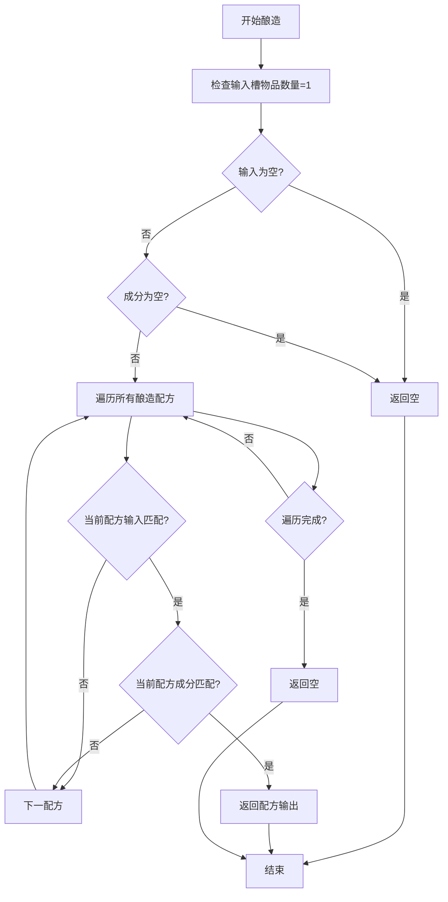
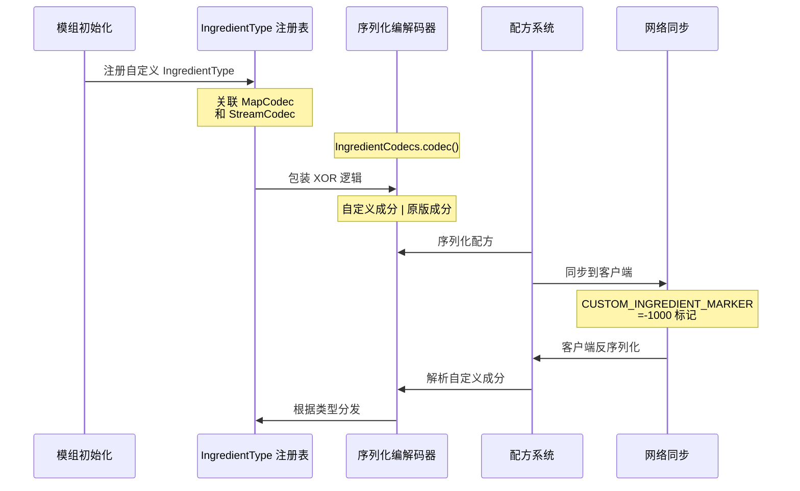

# 配方与酿造系统

---
title: 配方与酿造系统
readingTime: 25
---

## 目录

- [1. 系统概述](#1-系统概述)
- [2. 配方系统](#2-配方系统)
  - [2.1 ICustomIngredient 接口](#21-icustomingredient-接口)
  - [2.2 IngredientType 类型注册](#22-ingredienttype-类型注册)
  - [2.3 内置自定义成分](#23-内置自定义成分)
  - [2.4 SizedIngredient 带数量成分](#24-sizedingredient-带数量成分)
- [3. 酿造系统](#3-酿造系统)
  - [3.1 IBrewingRecipe 接口](#31-ibrewingrecipe-接口)
  - [3.2 BrewingRecipe 配方实现](#32-brewingrecipe-配方实现)
  - [3.3 BrewingRecipeRegistry 注册表](#33-brewingreciperegistry-注册表)
  - [3.4 酿造事件系统](#34-酿造事件系统)
- [4. 工作流程图](#4-工作流程图)
- [5. API 使用示例](#5-api-使用示例)
- [6. 与其他系统交互](#6-与其他系统交互)
- [7. 总结](#7-总结)

## 1. 系统概述

NeoForge 1.21.x 的配方（Crafting）与酿造（Brewing）系统为模组开发者提供了强大的物品合成和药水酿造扩展能力。

**配方系统** 基于原版 `Ingredient` 类的扩展机制，通过 `ICustomIngredient` 接口允许开发者创建自定义匹配逻辑的特殊成分类型，如组合成分、交集成分、差集成分等。这些自定义成分通过 `IngredientType` 注册到 NeoForge 注册表中，支持数据驱动（datapack）加载和网络同步。

**酿造系统** 则提供了完整的药水酿造扩展框架，包含 `IBrewingRecipe` 接口用于定义酿造配方、`BrewingRecipeRegistry` 管理配方注册，以及 `PotionBrewEvent` 和 `PlayerBrewedPotionEvent` 等事件钩子用于在酿造流程中插入自定义逻辑。

## 2. 配方系统

### 2.1 ICustomIngredient 接口

`ICustomIngredient` 是 NeoForge 配方系统的核心接口，允许模组开发者为 `Ingredient` 类添加自定义匹配行为。

```20:94:D:\Minecraft-Learning\assets\NeoForge-1.21.x\src\main\java\net\neoforged\neoforge\common\crafting\ICustomIngredient.java
public interface ICustomIngredient {
    /**
     * 检查物品堆栈是否符合此成分
     */
    boolean test(ItemStack stack);

    /**
     * 返回此成分接受的所有物品
     */
    Stream<Holder<Item>> items();

    /**
     * 判断是否需要直接测试物品堆栈
     */
    boolean isSimple();

    /**
     * 获取成分类型（需注册到 INGREDIENT_TYPES）
     */
    IngredientType<?> getType();

    /**
     * 获取显示信息
     */
    default SlotDisplay display() { ... }

    /**
     * 转换为原版 Ingredient
     */
    default Ingredient toVanilla() {
        return new Ingredient(this);
    }
}
```

**关键方法说明：**

| 方法 | 作用 | 注意事项 |
|------|------|----------|
| `test(ItemStack)` | 核心匹配逻辑 | 不得修改传入的堆栈 |
| `items()` | 返回可能的物品列表 | 至少返回一个物品，否则配方无效 |
| `isSimple()` | 是否忽略 NBT 数据 | 返回 true 时可优化匹配性能 |
| `getType()` | 返回注册的成分类型 | 类型必须已注册 |

**实现约束：** 必须重写 `equals()` 和 `hashCode()` 方法以确保正确比较。

### 2.2 IngredientType 类型注册

`IngredientType` 负责封装自定义成分的序列化编解码器：

```18:25:D:\Minecraft-Learning\assets\NeoForge-1.21.x\src\main\java\net\neoforged\neoforge\common\crafting\IngredientType.java
public record IngredientType<T extends ICustomIngredient>(
    MapCodec<T> codec, 
    StreamCodec<? super RegistryFriendlyByteBuf, T> streamCodec
) {
    /**
     * 构造函数，使用常规 codec 自动生成 streamCodec
     */
    public IngredientType(MapCodec<T> codec) {
        this(codec, ByteBufCodecs.fromCodecWithRegistries(codec.codec()));
    }
}
```

**注册流程：**

```java
// 在 NeoForgeRegistries 中定义
public static final DeferredHolder<Registry<?>, ResourceKey<Registry<?>>> INGREDIENT_TYPES = ...;

// 注册自定义类型
RegistryEvent.Register<IngredientType<?>> event = ...;
event.getRegistry().register(
    IngredientType.of(new MyCustomIngredientCodec())
);
```

### 2.3 内置自定义成分

NeoForge 提供了多种开箱即用的自定义成分实现：

#### CompoundIngredient（组合成分）

匹配**任一**子成分匹配的物品，即逻辑"或"关系。

```20:72:D:\Minecraft-Learning\assets\NeoForge-1.21.x\src\main\java\net\neoforged\neoforge\common\crafting\CompoundIngredient.java
public record CompoundIngredient(List<Ingredient> children) implements ICustomIngredient {
    @Override
    public boolean test(ItemStack stack) {
        for (var child : children) {
            if (child.test(stack)) return true;
        }
        return false;
    }

    public static Ingredient of(Ingredient... children) {
        if (children.length == 1) return children[0];
        return new CompoundIngredient(List.of(children)).toVanilla();
    }
}
```

**JSON 数据格式：**

```json
{
  "type": "neoforge:compound",
  "children": [
    { "item": "minecraft:diamond" },
    { "item": "minecraft:emerald" }
  ]
}
```

#### IntersectionIngredient（交集成分）

匹配**所有**子成分都匹配的物品，即逻辑"与"关系。

```20:77:D:\Minecraft-Learning\assets\NeoForge-1.21.x\src\main\java\net\neoforged\neoforge\common\crafting\IntersectionIngredient.java
public record IntersectionIngredient(List<Ingredient> children) implements ICustomIngredient {
    @Override
    public boolean test(ItemStack stack) {
        for (var child : children) {
            if (!child.test(stack)) return false;
        }
        return true;
    }
}
```

#### DifferenceIngredient（差集成分）

匹配第一个成分中**排除**第二个成分的物品。

```18:56:D:\Minecraft-Learning\assets\NeoForge-1.21.x\src\main\java\net\neoforged\neoforge\common\crafting\DifferenceIngredient.java
public record DifferenceIngredient(Ingredient base, Ingredient subtracted) implements ICustomIngredient {
    @Override
    public boolean test(ItemStack stack) {
        return base.test(stack) && !subtracted.test(stack);
    }

    public static Ingredient of(Ingredient base, Ingredient subtracted) {
        return new DifferenceIngredient(base, subtracted).toVanilla();
    }
}
```

#### BlockTagIngredient（方块标签成分）

基于 `TagKey<Block>` 匹配的成分，用于方块标签没有对应物品标签的场景。

```33:106:D:\Minecraft-Learning\assets\NeoForge-1.21.x\src\main\java\net\neoforged\neoforge\common\crafting\BlockTagIngredient.java
public class BlockTagIngredient implements ICustomIngredient {
    public static final MapCodec<BlockTagIngredient> CODEC = TagKey.codec(Registries.BLOCK)
        .xmap(BlockTagIngredient::new, BlockTagIngredient::getTag)
        .fieldOf("tag");

    @Override
    public boolean test(@Nullable ItemStack stack) {
        if (stack == null) return false;
        return dissolve().contains(stack.getItemHolder());
    }
}
```

#### DataComponentIngredient（数据组件成分）

支持**精确数据组件匹配**的成分，可匹配带有特定 NBT/Potion/Food 等组件的物品。

```35:177:D:\Minecraft-Learning\assets\NeoForge-1.21.x\src\main\java\net\neoforged\neoforge\common\crafting\DataComponentIngredient.java
public class DataComponentIngredient implements ICustomIngredient {
    private final boolean strict;

    @Override
    public boolean test(ItemStack stack) {
        if (strict) {
            // 严格模式：必须完全匹配
            return ItemStack.isSameItemSameComponents(stack, expectedStack);
        } else {
            // 部分匹配：只需包含指定组件
            return items.contains(stack.getItemHolder()) && components.test(stack);
        }
    }

    public static Ingredient of(boolean strict, DataComponentMap map, ItemLike... items) {
        return new DataComponentIngredient(items, DataComponentExactPredicate.allOf(map), strict).toVanilla();
    }
}
```

#### CustomDisplayIngredient（自定义显示成分）

包装其他成分并覆盖其显示效果。

```21:52:D:\Minecraft-Learning\assets\NeoForge-1.21.x\src\main\java\net\neoforged\neoforge\common\crafting\CustomDisplayIngredient.java
public record CustomDisplayIngredient(Ingredient base, SlotDisplay display) implements ICustomIngredient {
    public static Ingredient of(Ingredient base, SlotDisplay display) {
        return new CustomDisplayIngredient(base, display).toVanilla();
    }
}
```

### 2.4 SizedIngredient 带数量成分

原版 `Ingredient` 不检查物品数量，`SizedIngredient` 解决了这一问题：

```26:102:D:\Minecraft-Learning\assets\NeoForge-1.21.x\src\main\java\net\neoforged\neoforge\common\crafting\SizedIngredient.java
public final class SizedIngredient {
    public static final Codec<SizedIngredient> NESTED_CODEC = RecordCodecBuilder.create(instance -> instance.group(
        Ingredient.CODEC.fieldOf("ingredient").forGetter(SizedIngredient::ingredient),
        NeoForgeExtraCodecs.optionalFieldAlwaysWrite(ExtraCodecs.POSITIVE_INT, "count", 1).forGetter(SizedIngredient::count)
    ).apply(instance, SizedIngredient::new));

    private final Ingredient ingredient;
    private final int count;

    /**
     * 检查堆栈是否符合成分且数量足够
     */
    public boolean test(ItemStack stack) {
        return ingredient.test(stack) && stack.getCount() >= count;
    }

    public static SizedIngredient of(ItemLike item, int count) {
        return new SizedIngredient(Ingredient.of(item), count);
    }
}
```

**JSON 数据格式：**

```json
{
  "ingredient": { "item": "minecraft:apple" },
  "count": 3
}
```

## 3. 酿造系统

### 3.1 IBrewingRecipe 接口

`IBrewingRecipe` 是酿造配方的基础接口：

```18:38:D:\Minecraft-Learning\assets\NeoForge-1.21.x\src\main\java\net\neoforged\neoforge\common\brewing\IBrewingRecipe.java
public interface IBrewingRecipe {
    /**
     * 判断是否为有效输入（下层槽位，如水瓶）
     */
    boolean isInput(ItemStack input);

    /**
     * 判断是否为有效成分（上层槽位，如地狱疣）
     */
    boolean isIngredient(ItemStack ingredient);

    /**
     * 获取酿造输出
     */
    ItemStack getOutput(ItemStack input, ItemStack ingredient);
}
```

### 3.2 BrewingRecipe 配方实现

`BrewingRecipe` 提供了基于 `Ingredient` 的便捷实现：

```11:48:D:\Minecraft-Learning\assets\NeoForge-1.21.x\src\main\java\net\neoforged\neoforge\common\brewing\BrewingRecipe.java
public class BrewingRecipe implements IBrewingRecipe {
    private final Ingredient input;
    private final Ingredient ingredient;
    private final ItemStack output;

    public BrewingRecipe(Ingredient input, Ingredient ingredient, ItemStack output) {
        this.input = input;
        this.ingredient = ingredient;
        this.output = output;
    }

    @Override
    public boolean isInput(ItemStack stack) {
        return this.input.test(stack);
    }

    @Override
    public ItemStack getOutput(ItemStack input, ItemStack ingredient) {
        return isInput(input) && isIngredient(ingredient) ? getOutput().copy() : ItemStack.EMPTY;
    }
}
```

### 3.3 BrewingRecipeRegistry 注册表

`BrewingRecipeRegistry` 持有所有 `IBrewingRecipe` 实例：

```20:72:D:\Minecraft-Learning\assets\NeoForge-1.21.x\src\main\java\net\neoforged\neoforge\common\brewing\BrewingRecipeRegistry.java
public record BrewingRecipeRegistry(List<IBrewingRecipe> recipes) {
    /**
     * 获取酿造输出
     */
    public ItemStack getOutput(ItemStack input, ItemStack ingredient) {
        if (input.isEmpty() || input.getCount() != 1) return ItemStack.EMPTY;
        if (ingredient.isEmpty()) return ItemStack.EMPTY;

        for (IBrewingRecipe recipe : recipes) {
            ItemStack output = recipe.getOutput(input, ingredient);
            if (!output.isEmpty()) return output;
        }
        return ItemStack.EMPTY;
    }

    /**
     * 检查是否为有效成分
     */
    public boolean isValidIngredient(ItemStack stack) {
        for (IBrewingRecipe recipe : recipes) {
            if (recipe.isIngredient(stack)) return true;
        }
        return false;
    }

    /**
     * 检查是否为有效输入
     */
    public boolean isValidInput(ItemStack stack) {
        for (IBrewingRecipe recipe : recipes) {
            if (recipe.isInput(stack)) return true;
        }
        return false;
    }
}
```

### 3.4 酿造事件系统

#### RegisterBrewingRecipesEvent

用于注册自定义酿造配方的事件：

```18:35:D:\Minecraft-Learning\assets\NeoForge-1.21.x\src\main\java\net\neoforged\neoforge\event\brewing\RegisterBrewingRecipesEvent.java
public class RegisterBrewingRecipesEvent extends Event {
    private final PotionBrewing.Builder builder;
    private final RegistryAccess registryAccess;

    public PotionBrewing.Builder getBuilder() {
        return builder;
    }

    public RegistryAccess getRegistryAccess() {
        return registryAccess;
    }
}
```

#### PotionBrewEvent

酿造过程事件，分为 `Pre`（可取消）和 `Post`：

```14:73:D:\Minecraft-Learning\assets\NeoForge-1.21.x\src\main\java\net\neoforged\neoforge\event\brewing\PotionBrewEvent.java
public abstract class PotionBrewEvent extends Event {
    private NonNullList<ItemStack> stacks;

    public ItemStack getItem(int index) { ... }
    public void setItem(int index, ItemStack stack) { ... }
    public int getLength() { ... }

    /** 酿造前事件 - 可取消 */
    public static class Pre extends PotionBrewEvent implements ICancellableEvent { ... }

    /** 酿造后事件 */
    public static class Post extends PotionBrewEvent { ... }
}
```

#### PlayerBrewedPotionEvent

玩家从酿造台拿起药水时触发：

```15:29:D:\Minecraft-Learning\assets\NeoForge-1.21.x\src\main\java\net\neoforged\neoforge\event\brewing\PlayerBrewedPotionEvent.java
public class PlayerBrewedPotionEvent extends PlayerEvent {
    private final ItemStack stack;

    public PlayerBrewedPotionEvent(Player player, ItemStack stack) {
        super(player);
        this.stack = stack;
    }

    public ItemStack getStack() { return stack; }
}
```

## 4. 工作流程图

### 酿造配方匹配流程



### 自定义成分注册与使用流程



## 5. API 使用示例

### 注册自定义酿造配方

```java
// 在 ModEventBusListener 中
@SubscribeEvent
public static void registerBrewingRecipes(RegisterBrewingRecipesEvent event) {
    // 使用 BrewingRecipe 便捷类
    event.getBuilder().addRecipe(
        new BrewingRecipe(
            Ingredient.of(Items.POTION, PotionUtils.setPotion(new ItemStack(Items.POTION), Potions.AWKWARD)),
            Ingredient.of(Items.BLAZE_POWDER),
            PotionUtils.setPotion(new ItemStack(Items.POTION), MyPotions.STRENGTH_POTION)
        )
    );
}
```

### 实现自定义酿造配方

```java
public class CustomBrewingRecipe implements IBrewingRecipe {
    private final Ingredient input;
    private final ItemStack ingredient;
    private final ItemStack output;

    public CustomBrewingRecipe(Ingredient input, ItemStack ingredient, ItemStack output) {
        this.input = input;
        this.ingredient = ingredient;
        this.output = output;
    }

    @Override
    public boolean isInput(ItemStack stack) {
        return input.test(stack);
    }

    @Override
    public boolean isIngredient(ItemStack stack) {
        return ItemStack.isSameItemSameComponents(stack, ingredient);
    }

    @Override
    public ItemStack getOutput(ItemStack input, ItemStack ingredient) {
        if (isInput(input) && isIngredient(ingredient)) {
            return output.copy();
        }
        return ItemStack.EMPTY;
    }
}

// 注册
@SubscribeEvent
public static void registerBrewingRecipes(RegisterBrewingRecipesEvent event) {
    event.getBuilder().addRecipe(new CustomBrewingRecipe(...));
}
```

### 监听酿造事件

```java
// 在 ModEventBusListener 中
@SubscribeEvent
public static void onPotionBrewPre(PotionBrewEvent.Pre event) {
    // 修改酿造结果
    if (event.getItem(0).is(Items.POTION)) {
        ItemStack newPotion = event.getItem(0).copy();
        // 添加自定义效果
        event.setItem(0, newPotion);
    }
}

@SubscribeEvent
public static void onPotionBrewPost(PotionBrewEvent.Post event) {
    // 酿造完成的处理
}

@SubscribeEvent
public static void onPlayerBrewedPotion(PlayerBrewedPotionEvent event) {
    // 玩家拿起药水时的处理
    Player player = event.getPlayer();
    ItemStack potion = event.getStack();
    player.giveExperiencePoints(10); // 给予经验
}
```

### 创建自定义成分类型

```java
// 1. 定义成分实现
public class MyCustomIngredient implements ICustomIngredient {
    public static final MapCodec<MyCustomIngredient> CODEC = ...;
    public static final IngredientType<MyCustomIngredient> TYPE = 
        new IngredientType<>(CODEC);

    private final int minDurability;

    @Override
    public boolean test(ItemStack stack) {
        return stack.isDamageableItem() && 
               stack.getMaxDamage() - stack.getDamage() >= minDurability;
    }

    @Override
    public Stream<Holder<Item>> items() { ... }
    @Override
    public boolean isSimple() { return false; }
    @Override
    public IngredientType<?> getType() { return TYPE; }
}

// 2. 注册成分类型
@SubscribeEvent
public static void registerIngredientTypes(RegisterEvent event) {
    event.register(NeoForgeRegistries.Keys.INGREDIENT_TYPES, 
        helper -> helper.register(MyCustomIngredient.TYPE, "my_custom_ingredient"));
}

// 3. 在配方中使用
// JSON: { "type": "modid:my_custom_ingredient", "min_durability": 50 }
```

### 使用内置自定义成分

```java
// 组合成分：钻石或绿宝石
Ingredient.or(Items.DIAMOND, Items.EMERALD);
// 等同于 CompoundIngredient.of(...)

// 差集成分：木头但不是白桦木
Ingredient.of(Blocks.OAK_PLANKS).except(Blocks.BIRCH_PLANKS);
// 等同于 DifferenceIngredient.of(...)

// 带数量成分
SizedIngredient.of(Items.DIAMOND, 3).test(player.getInventory().getStack(0));

// 数据组件成分：带有附魔光效的剑
Ingredient.of(true, 
    Map.of(DataComponents.ENCHANTMENTS, ...), 
    Items.DIAMOND_SWORD);
```

## 6. 与其他系统交互

### 与数据生成系统（DataGen）集成

自定义成分通过 `IngredientCodecs` 自动支持数据驱动：

```java
// DataComponentIngredient 的 JSON 格式
{
    "type": "neoforge:data_component",
    "items": ["minecraft:diamond_sword"],
    "components": {
        "minecraft:enchantments": { "levels": { "minecraft:sharpness": 1 } }
    },
    "strict": false
}
```

### 与物品系统集成

- `ItemStack.isEmpty()` - 检查物品是否为空
- `ItemStack.getCount()` - 获取物品数量
- `ItemStack.getItem()` - 获取物品实例
- `ItemStack.isSameItemSameComponents()` - 精确比较

### 与数据组件系统集成

`DataComponentIngredient` 使用 `DataComponentExactPredicate` 进行精确匹配：

```java
// 匹配带有特定药水的物品
DataComponentIngredient.of(false, 
    DataComponents.POTION_CONTENTS, 
    PotionContents.EMPTY, 
    Items.POTION);
```

### 与网络同步系统集成

通过 `IngredientCodecs.streamCodec()` 实现客户端/服务端同步：

```java
// CUSTOM_INGREDIENT_MARKER = -1000 标记自定义成分
// 发送时写入标记 + 类型ID + 序列化数据
// 接收时根据类型分发到对应编解码器
```

## 7. 总结

NeoForge 1.21.x 的配方与酿造系统提供了两大核心扩展能力：

**配方系统扩展：**
- `ICustomIngredient` 接口允许创建任意匹配逻辑的成分
- `IngredientType` 提供类型安全的序列化机制
- 内置 6 种自定义成分类型（组合、交集、差集、方块标签、数据组件、自定义显示）
- `SizedIngredient` 解决了原版成分无法检查数量的问题

**酿造系统扩展：**
- `IBrewingRecipe` 接口支持灵活的配方定义
- `RegisterBrewingRecipesEvent` 提供安全的配方注册时机
- `PotionBrewEvent.Pre/Post` 支持酿造过程拦截和修改
- `PlayerBrewedPotionEvent` 支持酿造完成后的自定义处理

这些系统通过 `IngredientCodecs` 统一处理序列化、网络同步和数据生成，为模组开发者提供了完整且一致的扩展框架。

## 课后自查

- [ ] 能否说出 `ICustomIngredient` 和 `IngredientType` 的关系？
- [ ] `CompoundIngredient`、`IntersectionIngredient`、`DifferenceIngredient` 的区别是什么？
- [ ] 如何使用 `SizedIngredient` 检查配方需要的物品数量？
- [ ] 酿造配方的注册时机和方式是什么？
- [ ] `PotionBrewEvent.Pre` 和 `PotionBrewEvent.Post` 的使用场景有何不同？
