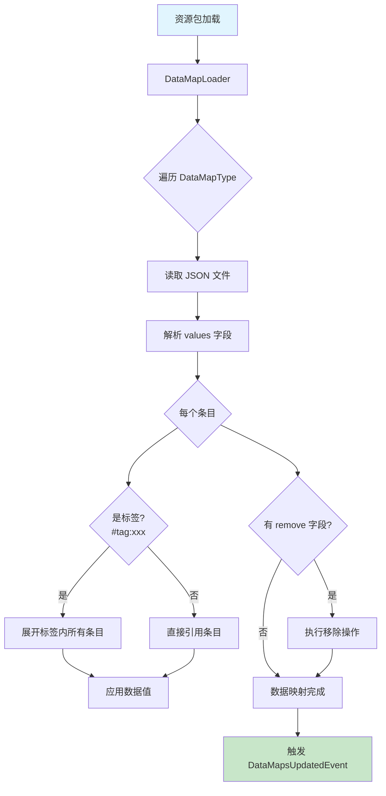
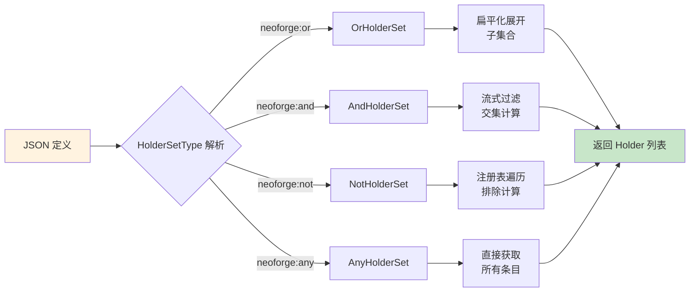

# 数据映射与 Holder 集合

---
title: 数据映射与 Holder 集合
readingTime: 25
---

## 目录

- [1. 系统概述](#1-系统概述)
- [2. 数据映射系统](#2-数据映射系统)
  - [2.1 核心类解析](#21-核心类解析)
  - [2.2 高级数据映射](#22-高级数据映射)
  - [2.3 内置数据映射](#23-内置数据映射)
- [3. Holder 集合系统](#3-holder-集合系统)
  - [3.1 核心接口与类型](#31-核心接口与类型)
  - [3.2 集合运算实现](#32-集合运算实现)
- [4. 工作流程图](#4-工作流程图)
- [5. API 使用示例](#5-api-使用示例)
- [6. 总结](#6-总结)

## 1. 系统概述

NeoForge 1.21.x 引入了两套强大的数据驱动系统，用于在运行时为注册表对象附加元数据：

| 系统 | 用途 | 数据来源 |
|------|------|----------|
| **数据映射 (Data Maps)** | 为注册表条目附加键值对数据 | JSON 文件 (`data_maps/` 目录) |
| **Holder 集合 (Holder Sets)** | 定义注册表条目的复杂集合 | JSON 文件中的 `minecraft:tagged` 字段 |

**关键术语解释**：

- **Holder**：对注册表条目的引用，支持直接引用和标签引用两种模式
- **Registry**：注册表，管理特定类型（如方块、物品、生物群系）的所有条目
- **DataMapType**：数据映射类型的定义，指定数据格式和目标注册表

## 2. 数据映射系统

数据映射系统允许模组通过 JSON 文件为注册表条目添加自定义数据，无需修改代码。

### 2.1 核心类解析

#### DataMapType

`DataMapType<R, T>` 是数据映射的核心类，使用密封类（sealed class）限制继承：

```java
public sealed class DataMapType<R, T> permits AdvancedDataMapType {
    private final ResourceKey<Registry<R>> registryKey;  // 目标注册表
    private final Identifier id;                           // 映射类型 ID
    private final Codec<T> codec;                         // JSON 解码器
    private final @Nullable Codec<T> networkCodec;        // 网络同步编码器
    private final boolean mandatorySync;                  // 是否强制同步
}
```

**关键方法**：

- `builder()`: 创建类型构建器
- `synced(codec, mandatory)`: 标记为可网络同步

#### DataMapEntry

数据映射条目记录，包含值和替换标志：

```java
public record DataMapEntry<T>(T value, boolean replace) {
    // 支持两种格式：
    // 1. 直接值: "minecraft:oak_log": 0.65
    // 2. 对象格式: "minecraft:oak_log": { "value": 0.65, "replace": false }
}
```

### 2.2 高级数据映射

`AdvancedDataMapType` 提供冲突处理和定向移除功能：

- **Merger（合并器）**：处理多个数据包为同一对象附加数据时的冲突
- **Remover（移除器）**：支持精确移除数据的特定部分

```java
public final class AdvancedDataMapType<R, T, VR extends DataMapValueRemover<R, T>> 
        extends DataMapType<R, T> {
    private final Codec<VR> remover;
    private final DataMapValueMerger<R, T> merger;
}
```

### 2.3 内置数据映射

NeoForge 提供了 12 种内置数据映射，替代原有的硬编码注册：

| 数据映射 | 注册表 | 用途 | JSON 路径 |
|----------|--------|------|-----------|
| `COMPOSTABLES` | Item | 堆肥概率和村民堆肥支持 | `neoforge/data_maps/item/compostables.json` |
| `FURNACE_FUELS` | Item | 熔炉燃料燃烧时间 | `neoforge/data_maps/item/furnace_fuels.json` |
| `STRIPPABLES` | Block | 斧头剥皮结果方块 | `neoforge/data_maps/block/strippables.json` |
| `OXIDIZABLES` | Block | 铜块氧化下一阶段 | `neoforge/data_maps/block/oxidizables.json` |
| `WAXABLES` | Block | 蜜蜡涂蜡结果方块 | `neoforge/data_maps/block/waxables.json` |
| `PARROT_IMITATIONS` | EntityType | 鹦鹉模仿实体声音 | `neoforge/data_maps/entity_type/parrot_imitations.json` |
| `VIBRATION_FREQUENCIES` | GameEvent | 游戏事件振动频率 | `neoforge/data_maps/game_event/vibration_frequencies.json` |
| `MONSTER_ROOM_MOBS` | EntityType | 怪物房间刷怪权重 | `neoforge/data_maps/entity_type/monster_room_mobs.json` |
| `VILLAGER_TYPES` | Biome | 生物群系村民类型 | `neoforge/data_maps/worldgen/biome/villager_types.json` |
| `ACCEPTABLE_VILLAGER_DISTANCES` | EntityType | 敌对生物与村民距离 | `neoforge/data_maps/entity_type/acceptable_villager_distances.json` |
| `RAID_HERO_GIFTS` | VillagerProfession | 袭击胜利礼物战利品表 | `neoforge/data_maps/villager_profession/raid_hero_gifts.json` |

## 3. Holder 集合系统

Holder 集合系统扩展了原版标签（Tag）功能，支持更复杂的集合运算。

### 3.1 核心接口与类型

#### HolderSetType

工厂接口，用于创建编解码器：

```java
public interface HolderSetType {
    <T> MapCodec<? extends ICustomHolderSet<T>> makeCodec(...);
    <T> StreamCodec<RegistryFriendlyByteBuf, ? extends ICustomHolderSet<T>> makeStreamCodec(...);
}
```

#### ICustomHolderSet

自定义 Holder 集合的标记接口：

```java
public interface ICustomHolderSet<T> extends HolderSet<T> {
    HolderSetType type();
    
    @Override
    default SerializationType serializationType() {
        return SerializationType.OBJECT;  // JSON 中序列化为对象
    }
}
```

### 3.2 集合运算实现

NeoForge 提供了 4 种自定义 Holder 集合类型：

| 类型 | 标识符 | JSON 格式 | 集合运算 |
|------|--------|-----------|----------|
| `OrHolderSet` | `neoforge:or` | `{ "type": "or", "values": [...] }` | 并集 (A ∪ B) |
| `AndHolderSet` | `neoforge:and` | `{ "type": "and", "values": [...] }` | 交集 (A ∩ B) |
| `NotHolderSet` | `neoforge:not` | `{ "type": "not", "value": ... }` | 补集 (U \ A) |
| `AnyHolderSet` | `neoforge:any` | `{ "type": "any" }` | 全集 (所有注册表条目) |

**CompositeHolderSet** 是 `OrHolderSet` 和 `AndHolderSet` 的基类，提供了缓存和失效机制：

```java
public abstract class CompositeHolderSet<T> implements ICustomHolderSet<T> {
    private final List<HolderSet<T>> components;
    
    protected abstract Set<Holder<T>> createSet();  // 子类实现集合运算
    
    // 惰性缓存：只在首次访问时计算
    public Set<Holder<T>> getSet() { ... }
    
    // 失效监听：当组件变更时清除缓存
    private void invalidate() { ... }
}
```

## 4. 工作流程图

### 数据映射加载流程



### Holder 集合求值流程



## 5. API 使用示例

### 创建自定义数据映射

```java
// 1. 定义数据映射类型
public static final DataMapType<Block, MyBlockData> MY_BLOCK_DATA = 
    DataMapType.<Block, MyBlockData>builder(
            Identifier.fromNamespaceAndPath(MOD_ID, "my_data"),
            Registries.BLOCK,
            MyBlockData.CODEC
    ).synced(MyBlockData.NETWORK_CODEC, false).build();

// 2. 注册数据映射类型
@SubscribeEvent
private static void registerDataMaps(RegisterDataMapTypesEvent event) {
    event.register(MY_BLOCK_DATA);
}

// 3. 在代码中访问数据
public Optional<MyBlockData> getData(Holder<Block> block) {
    return block.getData(MY_BLOCK_DATA);
}
```

### 数据映射 JSON 示例

```json
{
  "replace": false,
  "values": {
    "minecraft:oak_log": {
      "value": 0.65,
      "replace": false
    },
    "#minecraft:logs": {
      "value": 0.3
    }
  },
  "remove": ["examplemod:unwanted_item"]
}
```

### 创建自定义 Holder 集合

```java
// 注册自定义 HolderSetType
public static final HolderSetType EXAMPLE_SET = new ExampleHolderSet.Type();

@SubscribeEvent
private static void registerHolderSets(RegisterHolderSetTypesEvent event) {
    event.register(EXAMPLE_SET, "example");
}
```

### Holder 集合 JSON 示例

```json
{
  "type": "neoforge:or",
  "values": [
    "#minecraft:creeper_droppable",
    "#minecraft:skeletons",
    {
      "type": "neoforge:not",
      "value": "#minecraft:bosses"
    }
  ]
}
```

## 6. 总结

NeoForge 的数据映射与 Holder 集合系统为模组开发提供了强大的数据驱动能力：

**核心优势**：

1. **数据映射**：
   - 通过 JSON 文件扩展注册表数据，无需修改 Java 代码
   - 支持网络同步，客户端可访问模组数据
   - 支持标签引用，自动继承标签内所有条目
   - 内置 12 种数据映射替代硬编码注册

2. **Holder 集合**：
   - 扩展标签功能，支持交、并、补运算
   - 惰性计算 + 缓存失效机制保证性能
   - 完整的编解码器支持网络传输

**使用建议**：

- 优先使用内置数据映射，保持与 NeoForge 生态兼容
- 创建自定义数据映射时，确保提供网络同步 Codec
- Holder 集合的 `NotHolderSet` 适用于排除少量元素的场景
- 大型集合操作注意性能，考虑使用 `AndHolderSet` 代替 `NotHolderSet`

---

**课后自查**：

- [ ] 理解 DataMapType 的 sealed class 设计及其意义
- [ ] 掌握内置数据映射与硬编码注册的区别
- [ ] 能够创建自定义数据映射类型
- [ ] 理解 4 种 Holder 集合类型的集合运算语义
- [ ] 了解 CompositeHolderSet 的缓存失效机制
