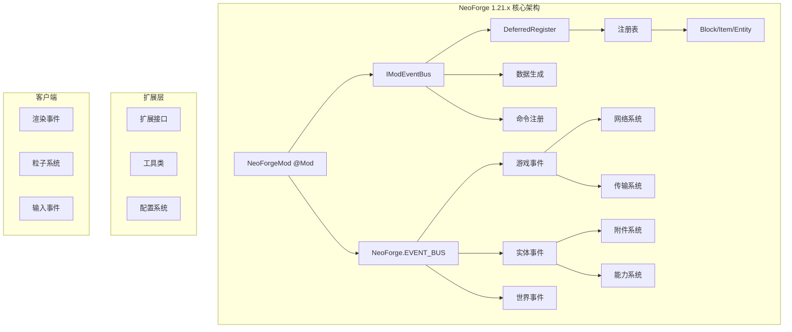
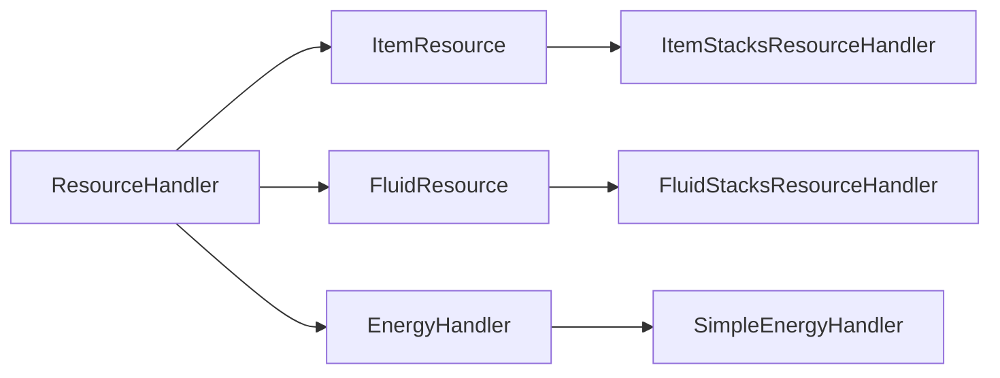

# NeoForge 1.21.x 架构分析总结

## 概述

本文档是对 NeoForge 1.21.x 模组框架的全面架构分析总结，涵盖 14 个核心子系统的详细分析。

**源码路径**：`D:\Minecraft-Learning\assets\NeoForge-1.21.x\src`

**分析文件数**：862 个 Java 文件

---

## 目录

- [1. 注册与事件系统](./01-registry-event-system.md)
- [2. 能力与传输系统](./02-capability-transfer-system.md)
- [3. 附件系统](./03-attachment-system.md)
- [4. 网络系统](./04-network-system.md)
- [5. 资源与数据系统](./05-resource-data-system.md)
- [6. 世界与区块系统](./06-world-chunk-system.md)
- [7. 实体与生物系统](./07-entity-living-system.md)
- [8. 流体与物品系统](./08-fluid-item-system.md)
- [9. 能量系统](./09-energy-system.md)
- [10. 客户端系统](./10-client-system.md)
- [11. 通用扩展与工具](./11-common-extensions-utils.md)
- [12. 配置与服务器系统](./12-config-server-system.md)
- [13. 配方与酿造系统](./13-recipe-brewing-system.md)
- [14. 数据映射与 Holder 集合](./14-datamap-holdersets.md)

---

## 子系统总览



### 子系统依赖关系

| 子系统 | 依赖 | 被依赖 |
|--------|------|--------|
| 注册系统 | 无 | 所有系统 |
| 事件系统 | 注册系统 | 所有系统 |
| 能力系统 | 事件系统 | 传输、物品、流体 |
| 传输系统 | 能力系统 | 物品、流体、能量 |
| 附件系统 | 事件系统 | 网络同步 |
| 网络系统 | 注册系统 | 客户端、服务端 |
| 数据系统 | 注册系统 | 游戏内容 |
| 世界系统 | 事件、附件 | 生物群系、结构 |

---

## 核心设计模式

### 1. 延迟注册模式 (Deferred Registration)

```java
public static final DeferredRegister<Block> BLOCKS = 
    DeferredRegister.create(BuiltInRegistries.BLOCKS, MOD_ID);

public static final DeferredHolder<Block, Block> EXAMPLE_BLOCK = 
    BLOCKS.register("example_block", () -> new Block(...));
```

**优势**：
- 避免注册顺序问题
- 提供类型安全的引用
- 与原版 Registry 系统无缝集成

### 2. 强类型事件模式 (Strongly-Typed Events)

```java
@SubscribeEvent
public static void onLivingJump(LivingEvent.LivingJumpEvent event) {
    // 强类型，无需类型转换
}
```

**优势**：
- 编译时类型检查
- IDE 自动补全
- 更好的代码导航

### 3. 扩展接口模式 (Extension Interfaces)

```java
public interface IBlockExtension {
    default void appendHoverText(...) { }
}
```

**优势**：
- 向后兼容
- 无需继承
- Mixin 注入实现

### 4. 事务性操作模式 (Transactional Operations)

```java
try (var tx = Transaction.openRoot()) {
    handler.extract(resource, amount, tx);
    handler.insert(target, resource, amount, tx);
    tx.commit();
}
```

**优势**：
- 自动回滚
- 支持嵌套事务
- 线程安全

---

## 关键架构演进

### NeoForge 1.21.x 重大变化

| 变化 | 旧版 (Forge) | NeoForge 1.21.x |
|------|---------------|------------------|
| 事件系统 | 反射式 | 强类型 GenericEvent |
| 注册系统 | RegistryEvent | DeferredRegister |
| 传输 API | IItemHandler/IFluidHandler | ResourceHandler<T> |
| 能量系统 | IEnergyStorage | EnergyHandler |
| 配置系统 | Configuration | ModConfigSpec |

### Transfer API 统一



---

## 与 Minecraft 1.21 集成

### Registry 系统

- 使用 Minecraft 原生 `Registry<T>` 接口
- 通过 `BuiltInRegistries` 访问原版注册表
- 支持自定义注册表扩展

### Data Components

NeoForge 1.21.x 适配 Minecraft 1.21 的 Data Components 系统：

- `DataComponents` 替代部分 NBT 用法
- `ComponentItemHandler` 提供组件访问
- 与附件系统互补使用

### Network Protocol

- 复用原版 `FriendlyByteBuf`
- 通过 `RegistryByteBuf` 提供注册表感知的编解码
- 支持 Play/CONFIG/LOGIN 三种通道

---

## 学习路径建议

### 入门阶段

1. [注册与事件系统](./01-registry-event-system.md) - 基础中的基础
2. [配方与酿造系统](./13-recipe-brewing-system.md) - 实际开发常用

### 进阶阶段

3. [能力与传输系统](./02-capability-transfer-system.md)
4. [流体与物品系统](./08-fluid-item-system.md)
5. [世界与区块系统](./06-world-chunk-system.md)

### 高级阶段

6. [网络系统](./04-network-system.md)
7. [附件系统](./03-attachment-system.md)
8. [数据映射与 Holder 集合](./14-datamap-holdersets.md)

### 专家阶段

9. [能量系统](./09-energy-system.md)
10. [客户端系统](./10-client-system.md)
11. [通用扩展与工具](./11-common-extensions-utils.md)
12. [配置与服务器系统](./12-config-server-system.md)

---

## 常见问题

### Q: NeoForge 与 Forge 的区别是什么？

**A**: NeoForge 是 Forge 的社区分支，主要区别：
- 更现代的代码风格（强类型事件、延迟注册）
- 更快的发布周期
- 更好的 API 文档
- 与 Minecraft 最新版本同步更快

### Q: 何时使用 Attachment vs Data Component？

**A**:
- **Attachment**: 服务端持久化数据、需要网络同步
- **Data Component**: 物品堆栈的即时状态、不需要网络同步

### Q: Transfer API 和 Capability 有什么区别？

**A**:
- **Capability**: 声明式，查询对象"能做什么"
- **Transfer API**: 操作式，执行资源的插入/提取

---

## 参考资源

- [NeoForge 官方文档](https://docs.neoforged.net/)
- [NeoForge GitHub 仓库](https://github.com/neoforged/NeoForge)
- [Minecraft 官方 Wiki](https://minecraft.wiki/)

---

## 文档贡献者

本系列文档由 Claude Code 分析 NeoForge 1.21.x 源码自动生成。

**生成时间**：2026-03-24

**源码版本**：NeoForge 1.21.x (latest)
