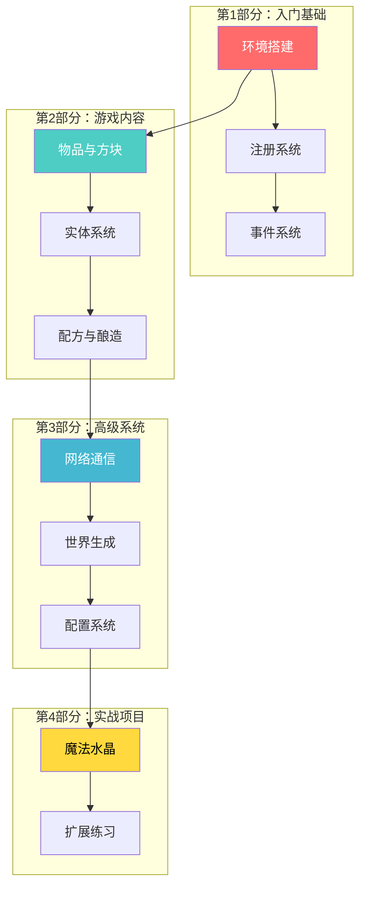

# NeoForge 1.21.x 模组开发教程

> 面向零基础开发者的 NeoForge 模组完全指南

---

## 学习路线图



---

## 教程目录

### Part-1：入门基础 (3章)

| 章节 | 文件 | 内容 |
|------|------|------|
| 环境搭建 | `part-1-getting-started/01-environment-setup.md` | MDK 安装、项目结构、运行调试 |
| 注册系统 | `part-1-getting-started/02-registry-system.md` | DeferredRegister、DeferredHolder |
| 事件系统 | `part-1-getting-started/03-event-system.md` | 双事件总线、@SubscribeEvent |

### Part-2：游戏内容 (1章)

| 章节 | 文件 | 内容 |
|------|------|------|
| 物品与方块 | `part-2-blocks-items/01-blocks-and-items.md` | Block、Item、BlockEntity、IItemHandler |

### Part-3：实体系统 (1章)

| 章节 | 文件 | 内容 |
|------|------|------|
| 实体系统 | `part-3-entities/01-entity-system.md` | EntityType、Entity、Attribute、事件监听 |

### Part-4：网络通信 (1章)

| 章节 | 文件 | 内容 |
|------|------|------|
| 网络通信 | `part-4-networking/01-network-system.md` | Payload、StreamCodec、网络同步 |

### Part-5：世界生成 (1章)

| 章节 | 文件 | 内容 |
|------|------|------|
| 世界系统 | `part-5-world-gen/01-world-system.md` | ChunkEvent、BiomeModifier、ForcedChunkManager |

### Part-6：配方与酿造 (1章)

| 章节 | 文件 | 内容 |
|------|------|------|
| 配方系统 | `part-6-recipes/01-recipe-system.md` | 自定义成分、酿造配方 |

### Part-7：配置系统 (1章)

| 章节 | 文件 | 内容 |
|------|------|------|
| 配置系统 | `part-7-config/01-config-system.md` | ModConfigSpec、权限系统 |

### Part-8：实战项目 (1章)

| 章节 | 文件 | 内容 |
|------|------|------|
| 魔法水晶 | `part-8-projects/01-magic-crystal.md` | 完整模组开发实战 |

---

## 快速导航

### 按难度分类

| 难度 | 教程 |
|------|------|
| ⭐ 入门 | 环境搭建、注册系统 |
| ⭐⭐ 进阶 | 事件系统、物品与方块 |
| ⭐⭐⭐ 高级 | 实体系统、网络通信、世界生成、配方系统 |
| ⭐⭐⭐⭐ 实战 | 配置系统、魔法水晶项目 |

### 按功能分类

| 功能 | 教程 |
|------|------|
| 方块开发 | 物品与方块、魔法水晶 |
| 物品开发 | 物品与方块、配方系统、魔法水晶 |
| 实体开发 | 实体系统 |
| 交互功能 | 事件系统、网络通信、魔法水晶 |
| 配置管理 | 配置系统 |
| 资源生成 | 配方系统 |

---

## 学习建议

### 萌新学习路径

```
第1天:   环境搭建 + 第一个 Mod
第2-3天: 注册系统（核心！）
第4-5天: 事件系统
第6-7天: 物品与方块
第8-9天: 实体系统
第10天:  网络通信
第11天:  世界生成
第12天:  配方与酿造
第13天:  配置系统
第14天+: 实战项目
```

### 每章节学习方法

1. **先看图** - Mermaid 图是理解概念的最佳方式
2. **再看文字** - 带着图的理解去读文字
3. **然后看代码** - 代码是概念的具体实现
4. **最后做练习** - 巩固所学知识

---

## 参考资源

- [NeoForge 官方文档](https://docs.neoforged.net/)
- [NeoForge GitHub](https://github.com/neoforged/NeoForge)
- [NeoForge 源码分析](../analysis/) - 详细架构分析
- [源码路径](../../assets/NeoForge-1.21.x/src)

---

## 相关教程

- [Minecraft 1.21 源码教程](../../mc/1.21/tutorials/) - Minecraft 底层原理
- [Fabric 模组开发](../../fabric/tutorials/) - Fabric 框架教程
- [Iris 着色器开发](../../iris/tutorials/) - 着色器编程

---

*教程版本: NeoForge 1.21.x | Minecraft 1.21+*
*最后更新: 2026-03-24*
