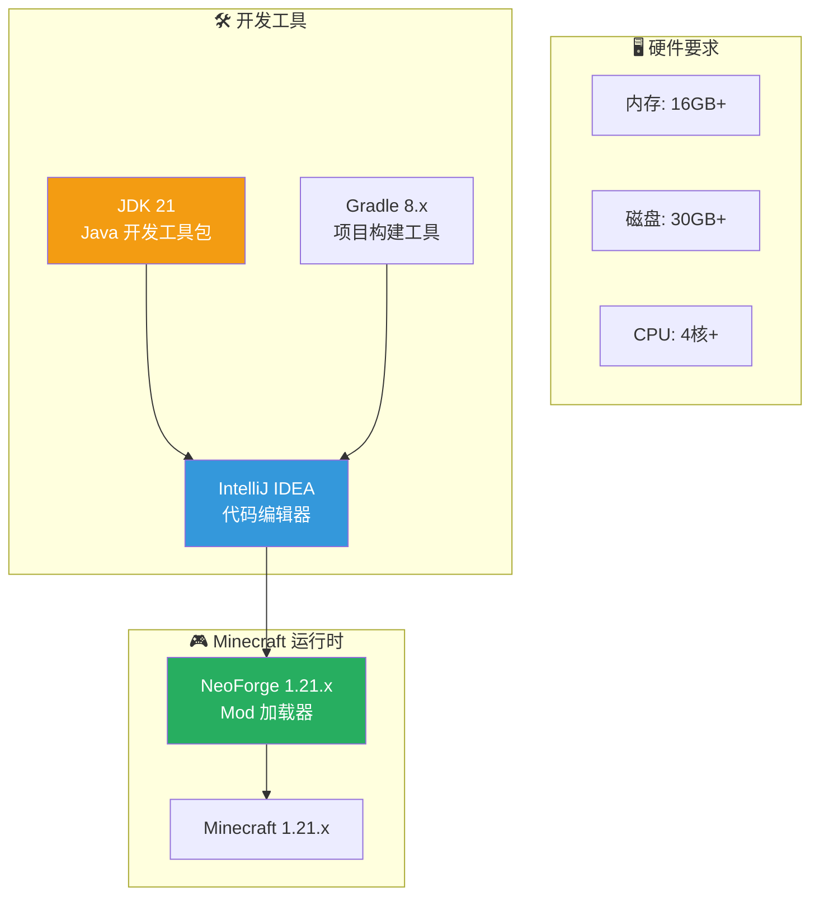
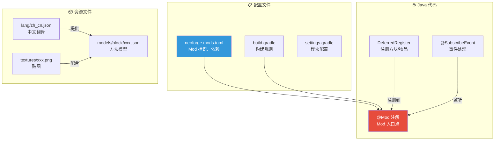
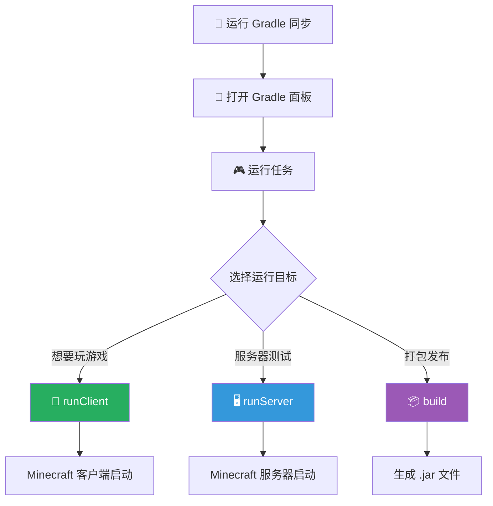

# NeoForge 1.21.x 环境搭建与第一个 Mod

> **面向读者**：想学习 NeoForge mod 开发的零基础新手
>
> **目标**：从零开始搭建开发环境，创建并运行你的第一个 NeoForge mod

> ⚠️ **NeoForge vs Forge**：NeoForge 是 Forge 的社区分支，专为 Minecraft 1.20.4+ 设计，提供更快的更新速度和更现代的代码架构。如果你想开发 1.20.4 以下版本，请使用传统 Forge。

---

## 目标

学完本章后，你将理解：

```
✅ NeoForge 是什么，以及它与 Minecraft Forge 的关系
✅ 搭建完整的 NeoForge 开发环境（JDK + Gradle + IDEA）
✅ 使用 NeoForge MDK 创建新项目
✅ 理解项目结构和 build.gradle 配置
✅ 编写并运行你的第一个 Mod（@Mod 注解）
✅ 掌握常用的开发工具和调试技巧
```

---

## 前置知识

```
☕ Java 基础（会写简单的类和方法）
💻 电脑操作（会解压文件、使用命令行）
📦 16GB 以上可用内存（跑 Minecraft 很吃内存）
💾 30GB 以上可用磁盘空间（IDE + 项目 + Minecraft）
⏱️ 30-60 分钟的空闲时间
```

---

## 目录

- [🎮 什么是 NeoForge？](#什么是-neoforge)
- [🛠️ 开发环境要求](#开发环境要求)
- [📦 创建第一个项目](#创建第一个项目)
- [🏗️ 项目结构解析](#项目结构解析)
- [💻 编写第一个 Mod](#编写第一个-mod)
- [▶️ 运行和调试](#运行和调试)
- [🧰 常用开发工具推荐](#常用开发工具推荐)
- [📝 小结与练习](#小结与练习)

---

## 什么是 NeoForge？

### Forge 的前世今生

> **NeoForge** 是 **Minecraft Forge** 的社区分支（fork），你可以理解为"Forge 2.0"。

```
传统 Forge 时间线：
Forge 1.12 ──→ Forge 1.16 ──→ Forge 1.18 ──→ (发展停滞)

NeoForge 时间线：
Forge 1.20.4 ──→ NeoForge 1.20.4 ──→ NeoForge 1.21.x ──→ ...
```

### 为什么选择 NeoForge？

| 特性 | 传统 Forge | NeoForge |
|------|-----------|----------|
| Minecraft 版本 | 1.12 - 1.20.x | 1.20.4+ |
| 更新速度 | 较慢 | 快速跟进新版本 |
| 代码风格 | 传统 | 现代化、类型安全 |
| 社区支持 | 减少中 | 活跃发展 |
| 推荐程度 | ⭐⭐ (老项目) | ⭐⭐⭐⭐⭐ (新项目) |

### NeoForge 核心优势

> 💡 **强类型事件系统** - 比传统 Forge 的反射方式更安全、更高效
> 
> 💡 **现代化的 API** - 使用 `DeferredRegister` 等新特性
> 
> 💡 **更快的编译** - 改进的 Gradle 配置

---

## 开发环境要求

### 组件架构图



### 1. 安装 JDK 21

> **JDK（Java Development Kit）** 是 Java 程序的运行环境，没有它，Java 代码就是一堆普通文本。

```
下载地址：
https://adoptium.net/temurin/releases/?version=21

安装步骤：
1. 下载 Windows x64 Installer (.msi)
2. 双击运行安装程序
3. 记住安装路径（默认：C:\Program Files\Eclipse Adoptium\jdk-21...）
4. 配置环境变量：
   - 新建 JAVA_HOME = C:\Program Files\Eclipse Adoptium\jdk-21...
   - 编辑 Path，添加 %JAVA_HOME%\bin
5. 验证：打开 PowerShell，输入：
   java -version
```

验证成功会看到类似输出：

```
openjdk version "21.0.x" ...
Java HotSpot(TM) 64-Bit Server VM ...
```

### 2. 安装 IntelliJ IDEA

> **IntelliJ IDEA** 是 JetBrains 公司出品的 Java 专用编辑器，比 VS Code 更适合 Java 开发。

```
下载地址：
https://www.jetbrains.com/idea/download/
推荐：IntelliJ IDEA Community Edition（免费开源）

安装步骤：
1. 下载 Community 版
2. 运行安装程序
3. 勾选"创建桌面快捷方式"
4. 勾选".java 文件关联"（方便双击打开）
5. 完成后启动 IDEA
```

### 3. Gradle（内置在 MDK 中）

> **Gradle** 是项目构建工具，负责下载依赖、编译代码、打包 Mod。

```
好消息：NeoForge MDK 已经内置了 Gradle Wrapper
坏消息：你不需要手动安装它

但是！如果你的网络较慢，可以配置国内镜像：
在 gradle.properties 中添加阿里云镜像源
```

---

## 创建第一个项目

### 使用 NeoForge MDK

> **MDK（Mod Development Kit）** 是官方提供的 mod 开发模板，包含所有必要的配置文件。

### 下载 MDK

```
1. 访问 NeoForge 官方下载页面：
   https://github.com/neoforged/NeoForge/releases

2. 找到对应 Minecraft 1.21.x 版本的 MDK 下载
   例如：neoforge-1.21.1-53.0.27-mdk.zip

3. 解压到你的工作目录，例如：
   D:\MinecraftMods\my-first-mod
```

### 命令行方式（推荐）

```bash
# 如果你安装了 Git Bash 或 WSL，可以直接用命令行创建
# 克隆 MDK 模板（需要先 fork 或下载）

# 解压后进入目录
cd neoforge-1.21.1-53.0.27-mdk

# 初始化项目（自动下载依赖）
./gradlew
```

### 项目创建流程


---

## 项目结构解析

### 完整目录结构

```
my-first-mod/
├── build.gradle                 # 📦 项目构建配置
├── gradle.properties            # ⚙️ Gradle 属性（JVM 参数等）
├── settings.gradle              # 🔧 项目设置（模块名、仓库）
├── gradlew / gradlew.bat        # 🚀 Gradle 包装脚本
├── src/
│   ├── main/
│   │   ├── java/                # ☕ Java 源代码
│   │   │   └── com/example/
│   │   │       └── mymod/
│   │   │           └── ExampleMod.java
│   │   └── resources/
│   │       ├── META-INF/
│   │       │   └── neoforge.mods.toml    # 📋 Mod 元信息
│   │       └── pack.mcmeta               # 📦 资源包配置
│   └── test/                     # 🧪 测试代码（可选）
└── .gradle/                      # (自动生成) Gradle 缓存
```

### 关键文件解析

#### build.gradle - 构建配置

```java
plugins {
    // 应用 NeoForge 开发插件
    id 'neoforge'
}

version = '1.0.0'
group = 'com.example.mymod'

// Minecraft 和 NeoForge 版本
base {
    // 格式：NeoForge_MC版本-Forge版本
    archivesName = 'mymod-1.21.1'
}

java.toolchain.languageVersion = JavaLanguageVersion.of(21)

// 依赖配置
dependencies {
    // NeoForge 运行时（运行时可用，编译时也可用）
    implementation fg.deobf("net.neoforged:neoforge:21.1.69")
}

repositories {
    // 添加第三方依赖仓库（如果需要）
    maven {
        name = "ModMaven"
        url = "https://maven.example.com/releases"
    }
}

// 运行配置
tasks.withType(JavaExec).configureEach {
    // 分配更多内存给 Minecraft 客户端
    jvmArgs = ['-Xmx4G']
}
```

#### neoforge.mods.toml - Mod 信息清单

```toml
modLoader = "javafml"                    # 固定值
loaderVersion = "[53,)"                  # NeoForge 版本范围
license = "MIT"                          # 许可证（MIT/CC0/GPL 等）

[[mods]]
modId = "mymod"                          # Mod 唯一标识符
version = "${version}"                   # 版本号（引用 build.gradle）
displayName = "My First Mod"             # 显示名称
description = '''
这是我的第一个 NeoForge Mod！
用来学习 NeoForge 开发基础。
'''                                       # 描述（支持多行）

# 依赖声明
[[dependencies.mymod]]
modId = "neoforge"
type = "required"                        # required / optional / transitive
versionRange = "[21.0,)"
ordering = "NONE"
side = "BOTH"                            # BOTH / CLIENT / SERVER
```

### 文件对应关系图



---

## 编写第一个 Mod

### 创建 Mod 入口类

> **@Mod 注解** 是 NeoForge 识别你的 Mod 的关键，没有它，NeoForge 就不知道这是一个 Mod。

在 `src/main/java/com/example/mymod/` 目录下创建 `ExampleMod.java`：

```java
package com.example.mymod;

import net.neoforged.bus.api.SubscribeEvent;
import net.neoforged.fml.common.Mod;
import net.neoforged.neoforge.event.BuildCreativeModeTabContentsEvent;
import org.slf4j.Logger;
import org.slf4j.LoggerFactory;

// 定义 Mod 唯一标识符（要与 neoforge.mods.toml 中的 modId 一致）
@Mod(ExampleMod.MOD_ID)
public class ExampleMod {
    // 定义一个日志记录器，用于在控制台输出信息
    public static final Logger LOGGER = LoggerFactory.getLogger("MyFirstMod");
    
    // Mod ID 常量
    public static final String MOD_ID = "mymod";

    // Mod 构造方法
    public ExampleMod() {
        // 注册到 NeoForge 事件总线
        // 事件总线会自动发现 @SubscribeEvent 注解的方法
        NeoForge.EVENT_BUS.register(this);
        
        // 初始化完成，打印日志
        LOGGER.info("🎮 My First Mod 已加载！");
        LOGGER.info("NeoForge 版本: " + NeoForge.class.getPackage().getImplementationVersion());
    }

    // 监听事件：当玩家打开创造模式物品栏时触发
    @SubscribeEvent
    public void buildContents(BuildCreativeModeTabContentsEvent event) {
        // 稍后我们会在这个方法里添加自定义物品
        LOGGER.info("正在构建创造模式物品栏...");
    }
}
```

### 添加依赖到 neoforge.mods.toml

确保你的 `neoforge.mods.toml` 中声明了正确的依赖：

```toml
[[dependencies.mymod]]
modId = "neoforge"
type = "required"
versionRange = "[21.0,)"
ordering = "NONE"
side = "BOTH"
```

### 验证 Mod 加载

运行游戏后，打开日志文件（位于 `.gradle/loom-cache/logs/` 或游戏日志），搜索 "My First Mod"，如果看到以下输出，说明 Mod 加载成功：

```
[MyFirstMod/INFO] [MyFirstMod]: 🎮 My First Mod 已加载！
[MyFirstMod/INFO] [MyFirstMod]: 正在构建创造模式物品栏...
```

---

## 运行和调试

### 在 IDEA 中运行



### 运行步骤

```
1. 在 IDEA 右侧打开 Gradle 面板（可能需要点击右侧的"大象"图标）

2. 找到以下任务：
   → mymod
     → Tasks
       → forge
         → runClient    ← 双击这个！
         → runServer    ← 或者这个（测试服务器）

3. 等待 Minecraft 启动...
   首次运行可能需要 5-10 分钟下载资源

4. 游戏启动后，你应该能在主菜单看到你的 Mod
```

### 配置运行参数

如果你觉得游戏太卡，可以在 `build.gradle` 中调整 JVM 参数：

```java
tasks.named('runClient', type: RunGame) {
    jvmArgs = [
        '-Xmx4G',           // 最大 4GB 内存
        '-Xms2G',           // 初始 2GB 内存
        '-XX:+UseG1GC',     // 使用 G1 垃圾回收器
        '-XX:+ParallelRefProcEnabled'
    ]
}
```

### 常见运行问题

| 问题 | 解决方案 |
|------|----------|
| Gradle 同步失败 | 检查网络，使用代理或国内镜像 |
| 游戏启动报错 | 查看错误日志，搜索解决方案 |
| 内存不足 | 减少 jvmArgs 中的 -Xmx 值 |
| Mod 未加载 | 检查 modId 是否匹配，文件是否放对位置 |

---

## 常用开发工具推荐

### IDEA 插件

```
安装方法：File → Settings → Plugins → Marketplace

推荐插件清单：
┌─────────────────────────────────────────────────────────┐
│ 1. Minecraft Development                                │
│    ├─ 识别 .mcfunction 文件                              │
│    ├─ 命令补全 & 高亮                                    │
│    ├─ 数据包支持                                        │
│    └─ 推荐指数：⭐⭐⭐⭐⭐                                  │
├─────────────────────────────────────────────────────────┤
│ 2. Minecraft Bytecode Viewer                            │
│    ├─ 查看编译后的字节码                                 │
│    ├─ 理解 Java 编译细节                                │
│    └─ 推荐指数：⭐⭐⭐⭐                                   │
├─────────────────────────────────────────────────────────┤
│ 3. Rainbow Brackets                                    │
│    ├─ 彩虹括号，方便匹配括号                              │
│    └─ 推荐指数：⭐⭐⭐                                     │
├─────────────────────────────────────────────────────────┤
│ 4. Translation (或 anytrans)                           │
│    ├─ 翻译插件，方便查文档                               │
│    └─ 推荐指数：⭐⭐⭐                                     │
└─────────────────────────────────────────────────────────┘
```

### 国内镜像配置

如果下载依赖太慢，可以在 `settings.gradle` 中添加阿里云镜像：

```groovy
pluginManagement {
    repositories {
        mavenLocal()
        maven { url = 'https://maven.aliyun.com/repository/central' }
        maven { url = 'https://maven.aliyun.com/repository/public' }
        maven { url = 'https://maven.aliyun.com/repository/forge' }
        gradlePluginPortal()
        maven { url = 'https://maven.neoforged.net/releases' }
    }
}
```

### 常用快捷键

| 快捷键 | 功能 |
|--------|------|
| `Ctrl + Shift + N` | 全局搜索文件 |
| `Ctrl + Shift + F` | 全局搜索文本 |
| `Ctrl + 点击` | 跳转到定义 |
| `Ctrl + Alt + 左箭头` | 返回上一个位置 |
| `两下 Shift` | 快速搜索（文件名/类名） |
| `Ctrl + /` | 注释/取消注释 |
| `Alt + Enter` | 快速修复建议 |

---

## 小结与练习

### 本章知识点回顾

```
✅ NeoForge 是 Forge 的现代化分支，专为 MC 1.20.4+
✅ JDK 21 是必须的运行环境
✅ IDEA + Gradle 是标准开发工具组合
✅ @Mod 注解是 Mod 入口点
✅ build.gradle 和 neoforge.mods.toml 是核心配置文件
✅ runClient 用于测试客户端 Mod
✅ 国内镜像可以加速依赖下载
```

### 课后自查清单

```
□ 1. 成功安装 JDK 21 并验证版本
□ 2. 成功安装 IntelliJ IDEA Community
□ 3. 下载并解压 NeoForge MDK
□ 4. 用 IDEA 打开项目并完成 Gradle 同步
□ 5. 创建了 ExampleMod.java 并添加了 @Mod 注解
□ 6. 运行 runClient 成功启动 Minecraft
□ 7. 在游戏日志中看到 Mod 加载信息
□ 8. 安装了 Minecraft Development 插件
```

### 思考题

1. **NeoForge 和传统 Forge 最大的区别是什么？**
   - 为什么 NeoForge 要重新创建而不是继续在 Forge 上开发？

2. **@Mod 注解的作用是什么？**
   - 如果没有这个注解，Mod 还能被加载吗？

3. **build.gradle 中的 `implementation` 和 `modImplementation` 有什么区别？**
   - 什么时候该用哪一个？

### 行动清单

```
下一步行动：
□ 在 Mod 中添加一个自定义方块（参考官方教程）
□ 添加方块到创造模式物品栏
□ 为方块创建简单的纹理
□ 尝试运行 runServer 测试服务器端
□ 查看 NeoForge 源码中的示例 Mod
```

---

## 相关链接

| 内容 | 链接 |
|------|------|
| NeoForge 官方文档 | https://docs.neoforged.net/ |
| NeoForge GitHub | https://github.com/neoforged/NeoForge |
| MDK 下载地址 | https://github.com/neoforged/NeoForge/releases |
| JDK 21 下载 | https://adoptium.net/temurin/releases/?version=21 |
| IDEA 下载 | https://www.jetbrains.com/idea/download/ |
| 源码路径 | `D:\Minecraft-Learning\assets\NeoForge-1.21.x\src` |

---

> **下一章预告**：[NeoForge 事件系统](./02-event-system.md) - 深入理解强类型事件总线，学会监听和处理各种游戏事件

---

*文档更新时间: 2026-03-24*