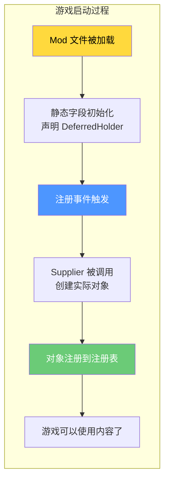
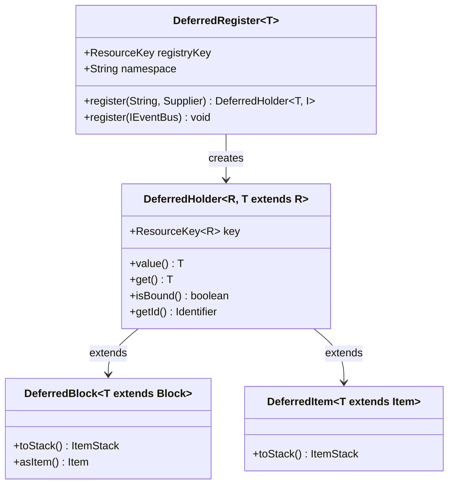
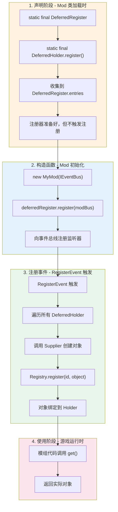
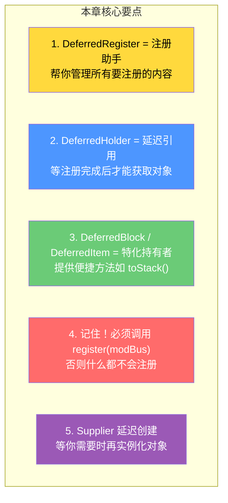

# 第二章：注册系统 - DeferredRegister 完全指南

> ⭐ **这是 NeoForge 模组开发的核心技能！学完这章，你就能像专业人士一样注册方块、物品和实体。**

---

## 目标

学完本章后，你将理解：

1. **为什么需要延迟注册** - 理解注册时机的重要性
2. **DeferredRegister 的核心概念** - NeoForge 推荐的注册方式
3. **如何注册各种内容** - 方块、物品、方块实体、实体类型
4. **DeferredHolder 的使用** - 如何获取已注册的对象
5. **常见错误与解决方案** - 避免新手常犯的错误

---

## 前置知识

- 了解 Java 的基本语法（类、接口、泛型、`Supplier`）
- 知道什么是 `Registry`（注册表）- Minecraft 用来管理所有游戏内容的地方
- 了解模组的 Mod ID 概念

💡 **不知道什么是 Registry？** 想象 Registry 就是一个超大的"图书馆目录"，里面记录了所有游戏里的方块、物品、生物...每个内容都有一个唯一的编号（ID），就像图书的 ISBN 一样。

---

## 为什么需要延迟注册？

### 古老的注册方式 vs 现代的延迟注册

**❌ 古老的直接注册方式**（想象你在图书馆还没开门时就要借书）：

```java
// 错误示例 - 不要这样做！
public class MyMod {
    // 游戏还没初始化好，你就想创建物品？
    public static final Item MY_ITEM = new Item(new Item.Properties());
    // 这时候注册表可能还没准备好，会出问题！
}
```

**✅ 现代的延迟注册方式**（等图书馆开门再去借书）：

```java
// 正确示例
public class MyMod {
    // 先"预订"一个物品位子
    public static final DeferredItem<Item> MY_ITEM = ITEMS.register("my_item", 
        () -> new Item(new Item.Properties().durability(100)));
    
    // 等游戏准备好了，NeoForge 自动帮我们完成注册
}
```

### 为什么要这样做？



**好处是什么？**

| 好处 | 说明 |
|------|------|
| ✅ 避免空指针 | 游戏完全启动后再创建对象 |
| ✅ 依赖管理 | 确保依赖的模组先完成注册 |
| ✅ 数据生成 | 可以在数据生成阶段正确引用 |
| ✅ 调试方便 | 出问题容易定位是注册阶段还是使用阶段 |

---

## DeferredRegister 核心概念

### 什么是 DeferredRegister？

`DeferredRegister` 是 NeoForge 提供的一个**注册助手类**，它帮你：

1. **收集** 所有要注册的内容（不用马上创建）
2. **等待** 游戏注册阶段
3. **注册** 所有内容到正确的注册表
4. **返回** 一个 `DeferredHolder` 供后续使用

### 核心类图



### 创建 DeferredRegister 的方法

```java
// 方法1：使用内置子类（最常用！）
public static final DeferredRegister.Blocks BLOCKS = DeferredRegister.createBlocks(MODID);
public static final DeferredRegister.Items ITEMS = DeferredRegister.createItems(MODID);
public static final DeferredRegister.Entities ENTITIES = DeferredRegister.createEntities(MODID);

// 方法2：通过已存在的注册表
public static final DeferredRegister<BlockEntityType<?>> BLOCK_ENTITIES = 
    DeferredRegister.create(BuiltInRegistries.BLOCK_ENTITY_TYPE, MODID);

// 方法3：通过 ResourceKey
public static final DeferredRegister<SoundEvent> SOUNDS = 
    DeferredRegister.create(Registries.SOUND_EVENT, MODID);

// 方法4：通过 Identifier
public static final DeferredRegister<CustomData> CUSTOM_DATA = 
    DeferredRegister.create(new Identifier(MODID, "custom_data"), MODID);
```

---

## 注册方块

### 基本注册流程

```java
public class ExampleMod {
    // 1. 创建 DeferredRegister
    public static final DeferredRegister.Blocks BLOCKS = DeferredRegister.createBlocks(ExampleMod.MODID);
    
    // 2. 注册方块
    public static final DeferredBlock<Block> MAGIC_BLOCK = BLOCKS.register("magic_block",
        () -> new Block(BlockBehaviour.Properties.of()
            .strength(3.0f)
            .requiresCorrectToolForDrops()
            .sound(SoundType.METAL)));
    
    // 3. 在 mod 构造函数中注册到事件总线
    public ExampleMod(IEventBus modBus) {
        BLOCKS.register(modBus);  // 重要！不调用就不会注册
    }
}
```

### 注册带自定义类的方块

```java
// 1. 定义自定义方块类
public class MagicBlock extends Block {
    public MagicBlock(Properties properties) {
        super(properties);
    }
    
    // 你的方块逻辑...
    @Override
    public void neighborChanged(BlockState state, Level level, BlockPos pos, Block block, BlockPos fromPos, boolean isMoving) {
        // 村民被吓到时会变成铁傀儡！（开玩笑的）
        level.levelEvent(2001, pos, Block.getId(state));
    }
}

// 2. 使用泛型注册
public static final DeferredBlock<MagicBlock> MAGIC_BLOCK = BLOCKS.register("magic_block",
    MagicBlock::new,  // 构造函数引用
    BlockBehaviour.Properties.of()
        .strength(2.0f)
        .lightLevel(state -> 7));  // 发光的方块！
```

### 注册简单方块（一行搞定）

```java
// 最简单的情况，不需要自定义类
public static final DeferredBlock<Block> SIMPLE_BLOCK = BLOCKS.registerSimpleBlock(
    "simple_stone",
    BlockBehaviour.Properties.of()
        .strength(1.5f)
        .sound(SoundType.STONE));
```

---

## 注册物品

### 基本注册流程

```java
public class ExampleMod {
    // 1. 创建 DeferredRegister
    public static final DeferredRegister.Items ITEMS = DeferredRegister.createItems(ExampleMod.MODID);
    
    // 2. 注册普通物品
    public static final DeferredItem<Item> COOL_ITEM = ITEMS.register("cool_item",
        () -> new Item(new Item.Properties()
            .durability(64)
            .stacksTo(16)));
    
    // 3. 注册到事件总线
    public ExampleMod(IEventBus modBus) {
        ITEMS.register(modBus);
    }
}
```

### 注册带自定义类的物品

```java
// 1. 定义自定义物品类
public class MagicWandItem extends Item {
    private final int magicPower;
    
    public MagicWandItem(Properties properties, int magicPower) {
        super(properties.durability(100));
        this.magicPower = magicPower;
    }
    
    @Override
    public boolean isEnchantable(ItemStack stack) {
        return true;
    }
    
    @Override
    public int getEnchantmentValue() {
        return this.magicPower;
    }
    
    // 右键使用时的逻辑
    @Override
    public UseAnim getUseAnimation(ItemStack stack) {
        return UseAnim.STAFF;
    }
    
    @Override
    public UseOnContext releaseUsing(ItemStack stack, Level level, LivingEntity entity, int timeCharged) {
        // 释放魔法！
        if (!level.isClientSide) {
            level.explode(null, entity.getX(), entity.getY(), entity.getZ(), 
                2.0f, Level.ExplosionInteraction.NONE);
        }
        stack.hurtAndBreak(1, entity, LivingEntity.getSlotForHand(entity.getUsedItemHand()));
        return stack;
    }
}

// 2. 注册
public static final DeferredItem<MagicWandItem> MAGIC_WAND = ITEMS.register("magic_wand",
    () -> new MagicWandItem(new Item.Properties().stacksTo(1), 15));
```

### 注册方块物品（自动创建对应的物品）

```java
// 方式1：自动使用方块名称
public static final DeferredItem<BlockItem> MAGIC_BLOCK_ITEM = ITEMS.registerSimpleBlockItem(MAGIC_BLOCK);

// 方式2：指定自定义名称
public static final DeferredItem<BlockItem> CUSTOM_NAMED_ITEM = ITEMS.registerSimpleBlockItem(
    "custom_name",  // 可以和方块名不同
    MAGIC_BLOCK::get);

// 方式3：带属性的方块物品
public static final DeferredItem<BlockItem> FANCY_BLOCK_ITEM = ITEMS.registerSimpleBlockItem(
    MAGIC_BLOCK,
    props -> props.fireResistant());  // 添加防火属性
```

---

## 注册方块实体（BlockEntity）

### 什么是方块实体？

方块实体就像方块的"大脑"——普通的方块只是静态的，但带有方块实体的方块可以：

- **存储数据**（比如箱子里的物品、命令方块里的命令）
- **定时更新**（比如红石更新、蜡烛熄灭）
- **和玩家交互**（比如打开 GUI）

### 注册流程

```java
public class ExampleMod {
    // 1. 创建 DeferredRegister
    public static final DeferredRegister<BlockEntityType<?>> BLOCK_ENTITIES = 
        DeferredRegister.create(BuiltInRegistries.BLOCK_ENTITY_TYPE, ExampleMod.MODID);
    
    // 2. 定义自定义方块实体
    public static class MagicChestBlockEntity extends BlockEntity {
        private NonNullList<ItemStack> items = NonNullList.withSize(27, ItemStack.EMPTY);
        
        public MagicChestBlockEntity(BlockPos pos, BlockState state) {
            super(BLOCK_ENTITY_TYPE.get(), pos, state);
        }
        
        // 你的逻辑...
        public NonNullList<ItemStack> getItems() {
            return items;
        }
    }
    
    // 3. 注册方块实体类型
    public static final Supplier<BlockEntityType<MagicChestBlockEntity>> MAGIC_CHEST_BE = 
        BLOCK_ENTITIES.register("magic_chest",
            () -> BlockEntityType.Builder.of(MagicChestBlockEntity::new, MAGIC_BLOCK.get())
                .build(null));
    
    // 4. 注册到事件总线
    public ExampleMod(IEventBus modBus) {
        BLOCK_ENTITIES.register(modBus);
    }
}
```

💡 **注意**：注册 `BlockEntityType` 时，需要传入方块的引用。使用 `MAGIC_BLOCK.get()` 可以获取实际注册的方块对象。

---

## 注册实体类型

```java
public class ExampleMod {
    public static final DeferredRegister<EntityType<?>> ENTITIES = 
        DeferredRegister.createEntities(ExampleMod.MODID);
    
    // 注册一个自定义实体（这里是魔法史莱姆）
    public static final DeferredHolder<EntityType<?>, EntityType<MagicSlime>> MAGIC_SLIME = 
        ENTITIES.registerEntityType("magic_slime",
            MagicSlime::new,                    // 实体工厂方法
            MobCategory.CREATURE,                // 生物类别
            builder -> builder
                .sized(1.2f, 1.2f)              // 碰撞箱大小
                .clientTrackingRange(8)         // 客户端追踪范围
        );
    
    public ExampleMod(IEventBus modBus) {
        ENTITIES.register(modBus);
    }
}

// 自定义实体类
public class MagicSlime extends Mob {
    public MagicSlime(EntityType<? extends MagicSlime> type, Level level) {
        super(type, level);
    }
    
    // 你的逻辑...
    @Override
    protected void registerGoals() {
        this.goalSelector.addGoal(0, new FloatGoal(this));
        this.goalSelector.addGoal(1, new RandomStrollGoal(this, 1.0));
        this.goalSelector.addGoal(2, new NearestAttackableTargetGoal<>(this, Player.class, true));
    }
}
```

---

## DeferredHolder 的使用

### 什么是 DeferredHolder？

`DeferredHolder` 就像是注册内容的"预订券"——它包含了：
- 这个东西叫什么名字（ResourceKey）
- 怎么找到它（Registry 信息）

等你需要用的时候，再"兑换"成真正的对象。

### 基本操作

```java
public static final DeferredBlock<MagicBlock> MAGIC_BLOCK = BLOCKS.register("magic_block", MagicBlock::new);
public static final DeferredItem<MagicWandItem> MAGIC_WAND = ITEMS.register("magic_wand", () -> new MagicWandItem());

// 获取实际对象（会触发绑定）
Block block = MAGIC_BLOCK.get();        // 获取方块
Block block2 = MAGIC_BLOCK.value();     // 和 get() 一样
Item item = MAGIC_WAND.get();           // 获取物品

// 检查是否已绑定
boolean ready = MAGIC_BLOCK.isBound(); // true = 已注册

// 获取 ID 信息
Identifier id = MAGIC_BLOCK.getId();   // "modid:magic_block"
ResourceKey<Block> key = MAGIC_BLOCK.getKey();  // 完整的 ResourceKey
```

### 在事件中使用

```java
// 监听玩家使用物品事件
@SubscribeEvent
public static void onItemUse(PlayerInteractEvent.RightClickItem event) {
    // 使用 DeferredHolder 获取实际物品
    if (event.getItemStack().is(MAGIC_WAND.get())) {
        // 玩家手里拿着魔法杖！
        event.getPlayer().displayClientMessage(
            Component.literal("你挥舞着魔法杖！"), true);
    }
}
```

### 在数据包中使用

```java
// 创建配方
@SubscribeEvent
public static void onRegisterRecipes(RegisterEvent event) {
    event.register(Registries.RECIPE_TYPE, "crafting_shaped", () -> new ShapedRecipe(
        ShapedRecipe.Pattern.of(
            " M ",
            "MIM",
            " I "
        ),
        ShapedRecipe.Ingredient.of(MAGIC_WAND),      // 引用物品
        new ItemStack(MAGIC_WAND.get(), 1)
    ));
}
```

### 便捷方法

```java
// DeferredBlock 和 DeferredItem 提供额外的便捷方法
public static final DeferredBlock<MagicBlock> MAGIC_BLOCK = BLOCKS.register("magic_block", MagicBlock::new);
public static final DeferredItem<MagicWandItem> MAGIC_WAND = ITEMS.register("magic_wand", () -> new MagicWandItem());

// 直接创建物品堆栈（超方便！）
ItemStack stack1 = MAGIC_WAND.toStack();              // 1个
ItemStack stack8 = MAGIC_WAND.toStack(8);             // 8个
ItemStack stack2 = MAGIC_BLOCK.get().asItem().getDefaultInstance();  // 这个也可以
stack2.setCount(2);
```

---

## 完整示例：创建一个自定义物品

让我们来一个完整的例子，创建一个"火焰宝石"物品：

```java
public class ExampleMod {
    // ===== Mod 信息 =====
    public static final String MODID = "examplemod";
    public static final Logger LOGGER = LogManager.getLogger(MODID);
    
    // ===== DeferredRegisters =====
    public static final DeferredRegister.Items ITEMS = DeferredRegister.createItems(MODID);
    public static final DeferredRegister.Blocks BLOCKS = DeferredRegister.createBlocks(MODID);
    public static final DeferredRegister<BlockEntityType<?>> BLOCK_ENTITIES = 
        DeferredRegister.create(BuiltInRegistries.BLOCK_ENTITY_TYPE, MODID);
    
    // ===== 注册方块：火焰宝石矿石 =====
    public static final DeferredBlock<OreBlock> FLAME_ORE = BLOCKS.register("flame_ore",
        () -> new OreBlock(
            BlockBehaviour.Properties.of()
                .strength(3.0f)
                .requiresCorrectToolForDrops()
                .lightLevel(state -> 5),  // 发光！
            UniformInt.of(3, 7));          // 掉落 3-7 个火焰宝石
    
    // ===== 注册物品：火焰宝石 =====
    public static final DeferredItem<Item> FLAME_GEM = ITEMS.register("flame_gem",
        () -> new Item(new Item.Properties()
            .stacksTo(64)
            .fireResistant()  // 防火
            .rarity(Rarity.RARE)));
    
    // ===== 注册物品：火焰宝石块 =====
    public static final DeferredBlock<Block> FLAME_BLOCK = BLOCKS.register("flame_block",
        () -> new Block(BlockBehaviour.Properties.of()
            .strength(5.0f)
            .lightLevel(state -> 15)  // 超亮！
            .sound(SoundType.METAL)));
    
    // 注册方块物品（自动创建对应的物品）
    public static final DeferredItem<BlockItem> FLAME_BLOCK_ITEM = ITEMS.registerSimpleBlockItem(FLAME_BLOCK);
    
    // ===== 构造函数 =====
    public ExampleMod(IEventBus modBus) {
        LOGGER.info("ExampleMod 正在初始化...");
        
        // 注册所有内容
        ITEMS.register(modBus);
        BLOCKS.register(modBus);
        BLOCK_ENTITIES.register(modBus);
        
        LOGGER.info("ExampleMod 初始化完成！");
    }
}
```

### 在 resources 文件夹添加语言文件

`src/main/resources/assets/examplemod/lang/zh_cn.json`:

```json
{
    "item.examplemod.flame_gem": "火焰宝石",
    "block.examplemod.flame_ore": "火焰矿石",
    "block.examplemod.flame_block": "火焰宝石块"
}
```

### 完整的项目结构

```
src/main/java/com/example/examplemod/
├── ExampleMod.java              # 主类
├── item/
│   ├── FlameGemItem.java        # 自定义物品
│   └── FlameWandItem.java       # 魔法杖
├── block/
│   ├── FlameOreBlock.java       # 自定义矿石
│   └── FlameLampBlock.java      # 自定义灯
└── blockentity/
    └── FlameFurnaceBlockEntity.java

src/main/resources/assets/examplemod/
├── lang/
│   ├── zh_cn.json
│   └── en_us.json
├── models/
│   ├── item/
│   │   ├── flame_gem.json
│   │   └── flame_wand.json
│   └── block/
│       ├── flame_ore.json
│       └── flame_lamp.json
└── textures/
    ├── item/
    │   ├── flame_gem.png
    │   └── flame_wand.png
    └── block/
        ├── flame_ore.png
        └── flame_lamp.png
```

---

## 常见错误与解决方案

### 错误 1：忘记注册到事件总线

```java
// ❌ 错误：物品永远不会被注册！
public static final DeferredItem<Item> MY_ITEM = ITEMS.register("my_item", () -> new Item());

// ✅ 正确：别忘了在构造函数中注册！
public ExampleMod(IEventBus modBus) {
    ITEMS.register(modBus);  // 这行很重要！
}
```

### 错误 2：Mod ID 不匹配

```java
// ❌ 错误：方块用 modid1，物品用 modid2
public static final DeferredRegister.Blocks BLOCKS = DeferredRegister.createBlocks("modid1");
public static final DeferredRegister.Items ITEMS = DeferredRegister.createItems("modid2");

// ✅ 正确：保持一致的 Mod ID
public static final String MODID = "examplemod";
public static final DeferredRegister.Blocks BLOCKS = DeferredRegister.createBlocks(MODID);
public static final DeferredRegister.Items ITEMS = DeferredRegister.createItems(MODID);
```

### 错误 3：在声明时就获取对象

```java
// ❌ 错误：游戏还没注册，你就想用？
public static final Item MY_ITEM = ITEMS.register("my_item", () -> new Item());
public static final ItemStack STACK = new ItemStack(MY_ITEM.get());  // 可能为 null！

// ✅ 正确：等游戏完全启动后再使用
public static final DeferredItem<Item> MY_ITEM = ITEMS.register("my_item", () -> new Item());
// 在事件处理器中使用
@SubscribeEvent
public static void onItemCrafted(ItemCraftedEvent event) {
    ItemStack STACK = MY_ITEM.toStack();  // 安全获取
}
```

### 错误 4：Duplicate Registration

```java
// ❌ 错误：同一个名称注册了两次
public static final DeferredItem<Item> ITEM1 = ITEMS.register("my_item", () -> new Item());
public static final DeferredItem<Item> ITEM2 = ITEMS.register("my_item", () -> new Item()); // 同名！

// ✅ 正确：每个注册项使用唯一的名称
public static final DeferredItem<Item> ITEM1 = ITEMS.register("my_item", () -> new Item());
public static final DeferredItem<Item> ITEM2 = ITEMS.register("another_item", () -> new Item());
```

### 错误 5：在注册前访问 BlockEntityType

```java
// ❌ 错误：BlockEntityType 还没注册，你就想创建方块实体
public static final Supplier<BlockEntityType<MyBE>> BE_TYPE = BLOCK_ENTITIES.register("my_be", ...);
public static final DeferredBlock<MyBlock> MY_BLOCK = BLOCKS.register("my_block",
    () -> new MyBlock(..., BE_TYPE.get()));  // 错误！

// ✅ 正确：在方块的构造函数中延迟获取
public static final Supplier<BlockEntityType<MyBE>> BE_TYPE = BLOCK_ENTITIES.register("my_be", ...);
public static final DeferredBlock<MyBlock> MY_BLOCK = BLOCKS.register("my_block",
    () -> new MyBlock(..., BE_TYPE));  // 传入 Supplier
```

---

## 注册系统工作流程图



---

## 小结



### 记住这个顺序

```
声明静态字段 (DeferredRegister + register)
         ↓
在构造函数中调用 register(modBus)
         ↓
RegisterEvent 触发
         ↓
Supplier 被调用 → 对象创建
         ↓
对象注册到注册表
         ↓
你的代码调用 get() → 获取实际对象
```

---

## 课后自查

完成本章学习后，请检查你是否能够：

- [ ] **理解原理**：解释为什么需要延迟注册，而不是直接创建对象
- [ ] **创建注册器**：使用 `DeferredRegister.createBlocks()` 和 `DeferredRegister.createItems()` 创建注册器
- [ ] **注册物品**：使用 `ITEMS.register()` 注册普通物品和自定义物品
- [ ] **注册方块**：使用 `BLOCKS.register()` 注册普通方块和自定义方块
- [ ] **注册 BlockEntity**：创建并注册 `BlockEntityType`
- [ ] **获取对象**：使用 `deferredHolder.get()` 获取实际对象
- [ ] **避免错误**：说出至少 3 个常见错误及如何避免

---

## 相关链接

### 源码文件

| 文件 | 路径 | 作用 |
|------|------|------|
| `DeferredRegister.java` | `net.neoforged.neoforge.registries` | 延迟注册器核心类 |
| `DeferredHolder.java` | `net.neoforged.neoforge.registries` | 延迟持有者 |
| `DeferredBlock.java` | `net.neoforged.neoforge.registries` | 方块特化持有者 |
| `DeferredItem.java` | `net.neoforged.neoforge.registries` | 物品特化持有者 |
| `RegisterEvent.java` | `net.neoforged.neoforge.registries` | 注册事件 |
| `RegistryBuilder.java` | `net.neoforged.neoforge.registries` | 注册表构建器 |

### 进阶阅读

- 下一章：[事件系统](./02-event-system.md) - 理解 NeoForge 的事件总线和事件监听
- 架构分析：[注册与事件系统分析](../analysis/01-registry-event-system.md) - 深入理解注册系统底层原理

---

> 💡 **提示**：NeoForge 的 DeferredRegister 系统是业界最佳实践之一。掌握它之后，你会发现注册任何游戏内容都变得简单明了！如果遇到问题，查看官方示例模组和 NeoForge 源码是最好的学习方法。

---

*文档版本：NeoForge 1.21.x, Minecraft 1.21*
*最后更新：2026-03-24*
