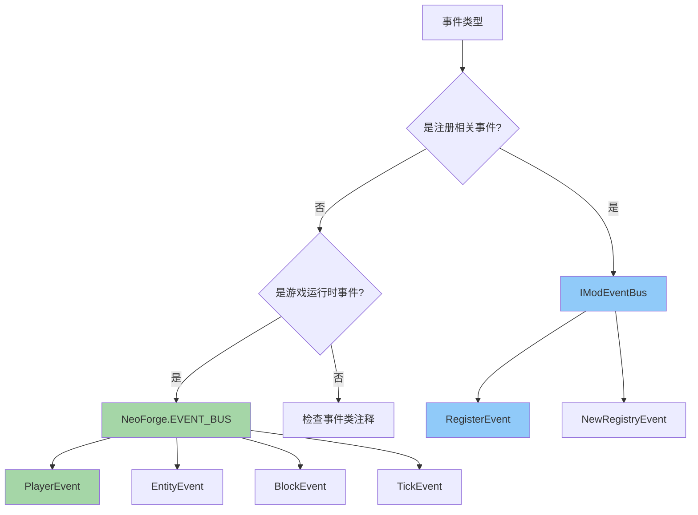
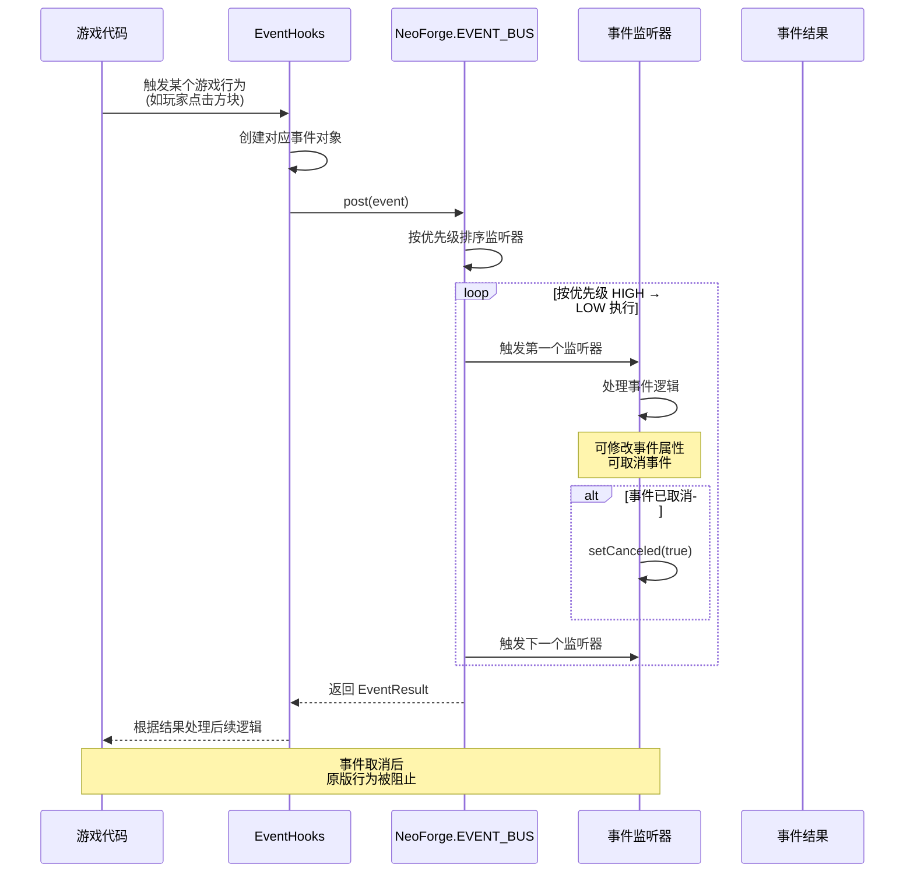
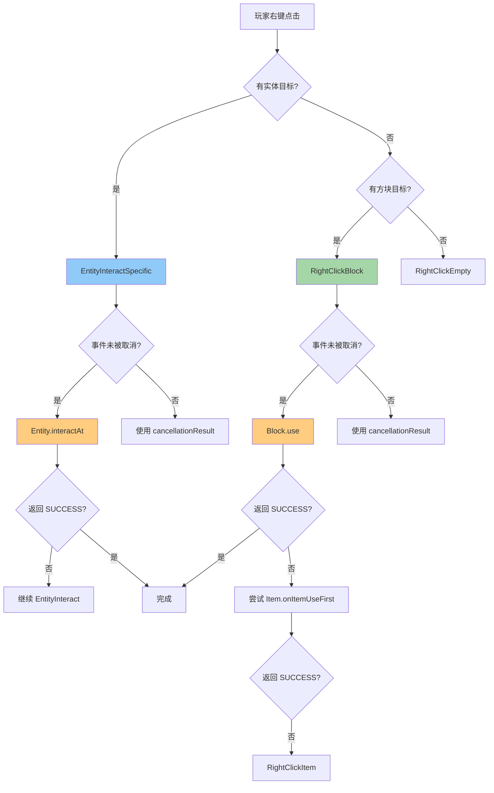

# NeoForge 事件系统完全指南

## 目录

- [1. 前言与学习目标](#1-前言与学习目标)
- [2. 事件系统概述](#2-事件系统概述)
  - [2.1 什么是事件系统？](#21-什么是事件系统)
  - [2.2 NeoForge vs 旧版 Forge](#22-neoforge-vs-旧版-forge)
- [3. 双事件总线架构](#3-双事件总线架构)
  - [3.1 NeoForge.EVENT_BUS 游戏事件总线](#31-neoforgeevent_bus-游戏事件总线)
  - [3.2 IModEventBus 模组事件总线](#32-imodeventbus-模组事件总线)
  - [3.3 总线选择指南](#33-总线选择指南)
- [4. @SubscribeEvent 注解详解](#4-subscribeevent-注解详解)
  - [4.1 基本用法](#41-基本用法)
  - [4.2 事件优先级](#42-事件优先级)
  - [4.3 取消事件](#43-取消事件)
- [5. 常用事件类型](#5-常用事件类型)
  - [5.1 PlayerEvent 玩家事件](#51-playerevent-玩家事件)
  - [5.2 BlockEvent 方块事件](#52-blockevent-方块事件)
  - [5.3 EntityEvent 实体事件](#53-entityevent-实体事件)
  - [5.4 LivingEvent 生物事件](#54-livingevent-生物事件)
- [6. 完整示例：监听玩家交互事件](#6-完整示例监听玩家交互事件)
- [7. 事件传播流程图](#7-事件传播流程图)
- [8. 课后自查](#8-课后自查)

---

## 1. 前言与学习目标

### 学习目标

在本章结束时，你将能够：

- ✅ 理解 NeoForge 双事件总线架构
- ✅ 正确区分 `NeoForge.EVENT_BUS` 和 `IModEventBus` 的使用场景
- ✅ 掌握 `@SubscribeEvent` 注解的各种用法
- ✅ 熟练使用常见的玩家、方块、实体事件
- ✅ 实现一个完整的玩家交互事件监听器

### 前置知识

- ✅ 了解 Java 基础（注解、泛型、Lambda 表达式）
- ✅ 熟悉 Minecraft 模组项目结构
- ✅ 掌握 DeferredRegister 注册系统（参考注册系统教程）

### 关键术语

| 术语 | 解释 |
|------|------|
| **EventBus** | 事件总线，负责事件的注册、分发和调用监听器 |
| **@SubscribeEvent** | 注解，用于标记事件监听方法 |
| **ICancellableEvent** | 可取消事件的接口，实现此接口的事件可以被监听器取消 |
| **EventPriority** | 事件优先级，控制监听器的执行顺序 |

---

## 2. 事件系统概述

### 2.1 什么是事件系统？

事件系统是一种**观察者模式**的实现，允许模组在不修改游戏原代码的情况下响应游戏中的各种行为。

```
┌─────────────────────────────────────────────────────────┐
│                      游戏核心                             │
│  ┌─────────────────────────────────────────────────┐    │
│  │                  事件触发点                       │    │
│  │  (玩家攻击、方块放置、实体生成...)                │    │
│  └─────────────────────────────────────────────────┘    │
└─────────────────────────────────────────────────────────┘
                           │
                           ▼ post(event)
┌─────────────────────────────────────────────────────────┐
│                      EventBus                           │
│  ┌───────────┐  ┌───────────┐  ┌───────────┐            │
│  │ 监听器 A  │  │ 监听器 B  │  │ 监听器 C  │  ...        │
│  └───────────┘  └───────────┘  └───────────┘            │
└─────────────────────────────────────────────────────────┘
                           │
                           ▼ notify listeners
┌─────────────────────────────────────────────────────────┐
│                      模组代码                            │
│  对事件做出响应：修改数据、发送消息、取消行为...          │
└─────────────────────────────────────────────────────────┘
```

### 2.2 NeoForge vs 旧版 Forge

NeoForge 1.21.x 对事件系统进行了**重大重构**，与旧版 Forge 有显著区别：

| 特性 | 旧版 Forge | NeoForge 1.21.x |
|------|------------|------------------|
| **事件分发** | 反射机制，性能开销大 | 强类型直接调用，性能优化 |
| **注册方式** | `@EventBusSubscriber` 自动注册 | 显式注册到事件总线 |
| **双总线** | 单一 `ForgeEvents` 总线 | `NeoForge.EVENT_BUS` + `IModEventBus` |
| **取消机制** | `setCanceled()` 通用方法 | `ICancellableEvent` 接口标识 |
| **优先级** | 注解参数 | `EventPriority` 枚举 |

**NeoForge 的优势**：

- 💡 **性能更优**：直接方法调用替代反射
- 💡 **类型安全**：编译器检查减少运行时错误
- 💡 **清晰分离**：注册事件与游戏事件分开处理
- 💡 **灵活控制**：细粒度的事件控制能力

---

## 3. 双事件总线架构

NeoForge 使用两个独立的事件总线，每个总线处理不同类型的任务。

### 3.1 NeoForge.EVENT_BUS 游戏事件总线

`NeoForge.EVENT_BUS` 是游戏运行时事件的主要总线。

```java
17:21:D:\Minecraft-Learning\assets\NeoForge-1.21.x\src\main\java\net\neoforged\neoforge\common\NeoForge.java
public static final IEventBus EVENT_BUS = BusBuilder.builder()
    .startShutdown()
    .classChecker(eventType -> {
        if (IModBusEvent.class.isAssignableFrom(eventType)) {
            throw new IllegalArgumentException("IModBusEvent events are not allowed on the common NeoForge bus!");
        }
    }).build();
```

**特点**：

- 用于游戏运行时事件（如 `PlayerTickEvent`、`EntityJoinLevelEvent`）
- 两端（客户端和服务端）都会收到事件
- 不允许 `IModBusEvent` 类型的事件

### 3.2 IModEventBus 模组事件总线

`IModEventBus` 用于模组的初始化和注册事件。

```java
public MyMod(IEventBus modBus) {
    // 注册 DeferredRegister
    BLOCKS.register(modBus);
    ITEMS.register(modBus);
    
    // 注册初始化监听器
    modBus.addListener(this::commonSetup);
}
```

**特点**：

- 用于初始化阶段的 `RegisterEvent`、`NewRegistryEvent`
- 仅在 mod 加载时触发一次
- 不应在运行时使用此总线

### 3.3 总线选择指南



**快速对照表**：

| 事件总线 | 事件示例 | 使用场景 |
|----------|----------|----------|
| `IModEventBus` | `RegisterEvent`, `NewRegistryEvent` | 模组初始化、资源注册 |
| `NeoForge.EVENT_BUS` | `PlayerTickEvent`, `EntityJoinLevelEvent`, `PlayerInteractEvent` | 游戏运行时逻辑 |

---

## 4. @SubscribeEvent 注解详解

### 4.1 基本用法

`@SubscribeEvent` 注解用于标记事件监听方法。

```java
// 定义一个事件监听器类
public class MyModEvents {
    
    // 监听玩家登录事件
    @SubscribeEvent
    public static void onPlayerLogin(PlayerEvent.PlayerLoggedInEvent event) {
        Player player = event.getEntity();
        player.sendSystemMessage(Component.literal("欢迎来到服务器！"));
    }
    
    // 监听实体加入世界事件
    @SubscribeEvent
    public static void onEntitySpawn(EntityJoinLevelEvent event) {
        if (event.getEntity() instanceof Zombie zombie) {
            zombie.setSpeed(0.5f);  // 给所有僵尸加速
        }
    }
}
```

**注册监听器到总线**：

```java
public MyMod(IEventBus modBus) {
    // 注册到 NeoForge.EVENT_BUS
    NeoForge.EVENT_BUS.addListener(MyModEvents::onPlayerLogin);
    NeoForge.EVENT_BUS.addListener(MyModEvents::onEntitySpawn);
}
```

### 4.2 事件优先级

`EventPriority` 枚举控制监听器的执行顺序：

```java
public enum EventPriority {
    HIGHEST,    // 最先执行
    HIGH,       // 较早执行
    NORMAL,     // 默认优先级
    LOW,        // 较晚执行
    LOWEST      // 最后执行
}
```

**执行顺序示意**：

```
事件触发
    │
    ▼
┌───────────────────────────────────┐
│ HIGHEST  ←── 首先执行             │
│ HIGH      ←──                    │
│ NORMAL    ←── 默认优先级          │
│ LOW       ←──                    │
│ LOWEST    ←── 最后执行            │
└───────────────────────────────────┘
```

**使用示例**：

```java
@SubscribeEvent(priority = EventPriority.HIGH)  // 先执行
public static void onHighPriority(PlayerTickEvent event) {
    // 这个方法会在其他监听器之前执行
}

@SubscribeEvent(priority = EventPriority.LOW)   // 后执行
public static void onLowPriority(PlayerTickEvent event) {
    // 这个方法会在其他监听器之后执行
}
```

**💡 何时使用不同优先级**：

- `HIGHEST/HIGH`：数据修改、限制其他监听器
- `NORMAL`：常规业务逻辑
- `LOW/LOWEST`：日志记录、统计、覆写其他监听器的修改

### 4.3 取消事件

只有实现 `ICancellableEvent` 接口的事件才能被取消。

```java
@SubscribeEvent
public static void onRightClickBlock(PlayerInteractEvent.RightClickBlock event) {
    Player player = event.getEntity();
    BlockPos pos = event.getPos();
    
    // 检查条件
    if (event.getLevel().getBlockState(pos).is(Blocks.DIAMOND_BLOCK)) {
        // 取消事件 - 阻止玩家右键钻石块
        event.setCanceled(true);
    }
}
```

**取消事件的后果**：

```java
// PlayerInteractEvent.RightClickBlock 事件取消后：
// - Block.use() 不会被调用
// - Item.onItemUseFirst() 不会被调用
// - Item.useOn() 不会被调用
```

**💡 重要提示**：

取消事件时，原版行为会被完全阻止。如果只想改变行为结果，使用 `setCancellationResult()` 更合适：

```java
@SubscribeEvent
public static void onRightClickBlock(PlayerInteractEvent.RightClickBlock event) {
    // 取消事件并设置返回值
    event.setCanceled(true);
    event.setCancellationResult(InteractionResult.SUCCESS);
}
```

---

## 5. 常用事件类型

### 5.1 PlayerEvent 玩家事件

`PlayerEvent` 是玩家相关事件的基类。

**主要子类**：

| 事件 | 触发时机 |
|------|----------|
| `PlayerLoggedInEvent` | 玩家加入游戏时 |
| `PlayerLoggedOutEvent` | 玩家离开游戏时 |
| `PlayerRespawnEvent` | 玩家重生时 |
| `PlayerChangedDimensionEvent` | 玩家切换维度时 |
| `PlayerTickEvent` | 玩家每刻更新时 |
| `HarvestCheck` | 玩家尝试采集方块时 |
| `BreakSpeed` | 玩家破坏速度计算时 |

```java
@SubscribeEvent
public static void onPlayerLogin(PlayerEvent.PlayerLoggedInEvent event) {
    Player player = event.getEntity();
    player.sendSystemMessage(Component.literal("欢迎回来，" + player.getName().getString() + "！"));
}

@SubscribeEvent
public static void onPlayerRespawn(PlayerEvent.PlayerRespawnEvent event) {
    if (event.isEndConquered()) {
        // 玩家从末地重生（击败末影龙）
        event.getEntity().sendSystemMessage(
            Component.literal("你征服了末地！").withStyle(ChatFormatting.GOLD)
        );
    }
}
```

### 5.2 BlockEvent 方块事件

**主要子类**：

| 事件 | 触发时机 |
|------|----------|
| `BlockPlaceEvent` | 方块被放置时 |
| `BlockBreakEvent` | 方块被破坏时 |
| `EntityPlaceEvent` | 实体放置方块时 |
| `EntityBreaksBlockEvent` | 实体破坏方块时 |

```java
@SubscribeEvent
public static void onBlockBreak(BlockEvent.BlockBreakEvent event) {
    Player player = event.getPlayer();
    BlockState state = event.getLevel().getBlockState(event.getPos());
    
    if (state.is(Blocks.GOLD_ORE)) {
        // 给玩家奖励经验
        player.giveExperiencePoints(10);
        player.sendSystemMessage(Component.literal("挖掘金矿获得额外经验！"));
    }
}

@SubscribeEvent
public static void onBlockPlace(BlockEvent.EntityPlaceEvent event) {
    if (event.getEntity() instanceof Player player && event.getPlacedBlock().is(Blocks.LAVA)) {
        event.setCanceled(true);  // 阻止玩家放置岩浆
    }
}
```

### 5.3 EntityEvent 实体事件

**主要子类**：

| 事件 | 触发时机 |
|------|----------|
| `EntityConstructing` | 实体构造时 |
| `EntityJoinLevelEvent` | 实体加入世界时 |
| `EnteringSection` | 实体进入新区块时 |
| `Size` | 实体大小改变时 |

```java
@SubscribeEvent
public static void onEntityJoinWorld(EntityJoinLevelEvent event) {
    Entity entity = event.getEntity();
    
    if (entity instanceof Cow cow) {
        // 将所有牛的名称设置为 "Moo"
        cow.setCustomName(Component.literal("Moo"));
        cow.setCustomNameVisible(true);
    }
}

@SubscribeEvent
public static void onEntityConstructing(EntityEvent.EntityConstructing event) {
    // 可以在这里给实体添加扩展数据
}
```

### 5.4 LivingEvent 生物事件

`LivingEvent` 是所有生物（包含玩家）相关事件的基类。

**主要子类**：

| 事件 | 触发时机 |
|------|----------|
| `LivingAttackEvent` | 生物受到攻击时 |
| `LivingHurtEvent` | 生物受到伤害时（可修改伤害值） |
| `LivingDeathEvent` | 生物死亡时 |
| `LivingHealEvent` | 生物治疗时 |
| `LivingJumpEvent` | 生物跳跃时 |
| `LivingVisibilityEvent` | 生物可见度计算时 |

```java
@SubscribeEvent
public static void onLivingHurt(LivingHurtEvent event) {
    LivingEntity entity = event.getEntity();
    float damage = event.getAmount();
    
    // 如果是摔落伤害，减少 50%
    if (event.getSource().is(DamageTypes.FALL)) {
        event.setAmount(damage * 0.5f);
        if (entity instanceof Player player) {
            player.sendSystemMessage(Component.literal("摔落伤害减半！"));
        }
    }
}

@SubscribeEvent
public static void onLivingJump(LivingEvent.LivingJumpEvent event) {
    LivingEntity entity = event.getEntity();
    if (entity instanceof Cow) {
        // 给牛额外的跳跃能力
        entity.setDeltaMovement(entity.getDeltaMovement().add(0, 0.5, 0));
    }
}
```

---

## 6. 完整示例：监听玩家交互事件

### 项目结构

```
src/
└── main/
    └── java/
        └── com/
            └── example/
                └── mymod/
                    ├── MyMod.java
                    └── event/
                        └── PlayerInteractHandler.java
```

### 事件处理器

```java
17:438:D:\Minecraft-Learning\assets\NeoForge-1.21.x\src\main\java\net\neoforged\neoforge\event\entity\player\PlayerInteractEvent.java
```

`PlayerInteractEvent` 是玩家交互事件的基类，包含多个子类处理不同交互场景：

| 子类 | 触发时机 |
|------|----------|
| `RightClickBlock` | 玩家右键点击方块 |
| `RightClickItem` | 玩家右键使用物品 |
| `RightClickEmpty` | 玩家右键空白处 |
| `LeftClickBlock` | 玩家左键点击方块 |
| `LeftClickEmpty` | 玩家左键点击空白处 |
| `EntityInteract` | 玩家右键实体 |
| `EntityInteractSpecific` | 玩家右键实体特定位置 |

### 实现代码

**`PlayerInteractHandler.java`**：

```java
package com.example.mymod.event;

import net.minecraft.ChatFormatting;
import net.minecraft.core.BlockPos;
import net.minecraft.network.protocol.game.ServerboundPlayerActionPacket;
import net.minecraft.world.InteractionHand;
import net.minecraft.world.InteractionResult;
import net.minecraft.world.entity.Entity;
import net.minecraft.world.entity.animal.Cow;
import net.minecraft.world.entity.player.Player;
import net.minecraft.world.level.Level;
import net.minecraft.world.level.block.Blocks;
import net.minecraft.world.phys.BlockHitResult;
import net.minecraft.world.phys.Vec3;
import net.neoforged.bus.api.SubscribeEvent;
import net.neoforged.neoforge.common.NeoForge;
import net.neoforged.neoforge.event.entity.player.PlayerInteractEvent;

public class PlayerInteractHandler {

    public PlayerInteractHandler() {
        // 在构造函数中注册到事件总线
        NeoForge.EVENT_BUS.addListener(this::onRightClickBlock);
        NeoForge.EVENT_BUS.addListener(this::onLeftClickBlock);
        NeoForge.EVENT_BUS.addListener(this::onRightClickEntity);
        NeoForge.EVENT_BUS.addListener(this::onRightClickItem);
    }

    /**
     * 处理玩家右键点击方块事件
     */
    @SubscribeEvent
    public void onRightClickBlock(PlayerInteractEvent.RightClickBlock event) {
        Player player = event.getEntity();
        Level level = event.getLevel();
        BlockPos pos = event.getPos();
        InteractionHand hand = event.getHand();
        
        // 获取点击的方块
        var blockState = level.getBlockState(pos);
        
        // 案例 1：当玩家右键工作台时，显示欢迎消息
        if (blockState.is(Blocks.CRAFTING_TABLE)) {
            player.displayClientMessage(
                net.minecraft.network.chat.Component.literal("你正在使用工作台！").withStyle(ChatFormatting.GREEN),
                true
            );
        }
        
        // 案例 2：当玩家右键熔炉时，触发特殊效果
        if (blockState.is(Blocks.FURNACE)) {
            player.displayClientMessage(
                net.minecraft.network.chat.Component.literal("熔炉正在燃烧...").withStyle(ChatFormatting.ORANGE),
                true
            );
        }
        
        // 案例 3：阻止玩家在特定位置放置方块（创建一个"保护区"）
        if (pos.getY() == 64 && pos.getX() >= 0 && pos.getX() <= 10 
            && pos.getZ() >= 0 && pos.getZ() <= 10) {
            player.displayClientMessage(
                net.minecraft.network.chat.Component.literal("此处禁止放置方块！").withStyle(ChatFormatting.RED),
                true
            );
            event.setCanceled(true);
        }
        
        // 案例 4：控制物品使用
        // 如果玩家手持钻石右键泥土，只允许使用主手
        if (event.getItemStack().is(net.minecraft.world.item.Items.DIAMOND) 
            && blockState.is(Blocks.DIRT)) {
            if (hand == InteractionHand.OFF_HAND) {
                event.setCanceled(true);
            }
        }
    }

    /**
     * 处理玩家左键点击方块事件
     */
    @SubscribeEvent
    public void onLeftClickBlock(PlayerInteractEvent.LeftClickBlock event) {
        Player player = event.getEntity();
        BlockPos pos = event.getPos();
        
        // 获取点击动作类型
        PlayerInteractEvent.LeftClickBlock.Action action = event.getAction();
        
        switch (action) {
            case START -> {
                // 玩家开始破坏方块
                player.displayClientMessage(
                    net.minecraft.network.chat.Component.literal("开始破坏方块: " + pos),
                    true
                );
            }
            case STOP -> {
                // 玩家完成破坏
                player.displayClientMessage(
                    net.minecraft.network.chat.Component.literal("方块被破坏: " + pos),
                    true
                );
            }
            case ABORT -> {
                // 玩家取消破坏
                player.displayClientMessage(
                    net.minecraft.network.chat.Component.literal("取消破坏"),
                    true
                );
            }
            case CLIENT_HOLD -> {
                // 客户端持续按住（每 tick 触发）
                // 注意：这个动作只在客户端触发
            }
        }
        
        // 案例：阻止破坏特定方块
        if (pos.equals(new BlockPos(0, 64, 0)) && 
            player.level().getBlockState(pos).is(Blocks.BEDROCK)) {
            player.displayClientMessage(
                net.minecraft.network.chat.Component.literal("基岩不能被破坏！").withStyle(ChatFormatting.DARK_GRAY),
                true
            );
            event.setCanceled(true);
        }
    }

    /**
     * 处理玩家右键实体事件
     */
    @SubscribeEvent
    public void onRightClickEntity(PlayerInteractEvent.EntityInteract event) {
        Player player = event.getEntity();
        Entity target = event.getTarget();
        InteractionHand hand = event.getHand();
        
        // 案例 1：当玩家右键牛时，发送消息
        if (target instanceof Cow) {
            player.displayClientMessage(
                net.minecraft.network.chat.Component.literal("你右键了一只牛！").withStyle(ChatFormatting.YELLOW),
                true
            );
        }
        
        // 案例 2：阻止玩家右键末影龙
        if (target.getType().toString().contains("ender_dragon")) {
            event.setCanceled(true);
            event.setCancellationResult(InteractionResult.FAIL);
            player.displayClientMessage(
                net.minecraft.network.chat.Component.literal("你不能右键末影龙！"),
                true
            );
        }
    }

    /**
     * 处理玩家右键使用物品事件（不在方块/实体上时）
     */
    @SubscribeEvent
    public void onRightClickItem(PlayerInteractEvent.RightClickItem event) {
        Player player = event.getEntity();
        InteractionHand hand = event.getHand();
        
        // 获取使用的物品
        var itemStack = event.getItemStack();
        
        // 案例：检测玩家使用特定物品
        if (itemStack.is(net.minecraft.world.item.Items.BLAZE_ROD)) {
            player.displayClientMessage(
                net.minecraft.network.chat.Component.literal("你正在使用烈焰棒！").withStyle(ChatFormatting.GOLD),
                true
            );
        }
    }
}
```

**`MyMod.java`**：

```java
package com.example.mymod;

import net.neoforged.bus.api.IEventBus;
import net.neoforged.neoforge.common.NeoForge;
import net.neoforged.neoforge.fml.common.Mod;
import com.example.mymod.event.PlayerInteractHandler;

@Mod(MyMod.MODID)
public class MyMod {
    public static final String MODID = "mymod";
    
    public MyMod(IEventBus modBus) {
        // 注册 DeferredRegister
        // BLOCKS.register(modBus);
        // ITEMS.register(modBus);
        
        // 注册事件监听器
        new PlayerInteractHandler();
        
        NeoForge.LOGGER.info("MyMod 初始化完成！");
    }
}
```

---

## 7. 事件传播流程图

### 完整事件生命周期



### 交互事件执行顺序



---

## 8. 课后自查

检查你是否掌握了以下内容：

1. **✅ 区分两个事件总线**
   - 什么时候使用 `NeoForge.EVENT_BUS`？什么时候使用 `IModEventBus`？

2. **✅ 正确使用 @SubscribeEvent 注解**
   - 监听方法必须是什么签名？
   - 为什么推荐使用静态方法？

3. **✅ 理解事件优先级**
   - 如果你希望自己的监听器最后执行，应该使用哪个优先级？

4. **✅ 正确取消事件**
   - `setCanceled(true)` 和 `setCancellationResult()` 有什么区别？
   - 哪些事件可以被取消？

5. **✅ 理解 PlayerInteractEvent 子类**
   - `RightClickBlock` 和 `RightClickItem` 的区别是什么？
   - `EntityInteract` 和 `EntityInteractSpecific` 有什么区别？

---

### 扩展练习

尝试实现以下功能：

1. 创建一个"右键提示"功能：玩家右键任意方块时，发送一条显示方块名称的消息

2. 创建一个"保护区"功能：在服务器中创建一个区域（坐标范围自定），阻止玩家在该区域内放置或破坏方块

3. 创建一个"自定义附魔"效果：当玩家受到摔落伤害时，有几率完全免疫

---

### 下一步

- 📖 [NeoForge 附件系统](./04-attachment-system.md) - 学习如何为实体添加持久化数据
- 📖 [NeoForge 网络系统](./05-network-system.md) - 了解客户端与服务端通信
- 📖 [NeoForge 配方系统](./06-recipe-system.md) - 创建自定义合成配方
