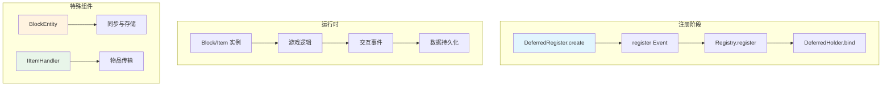
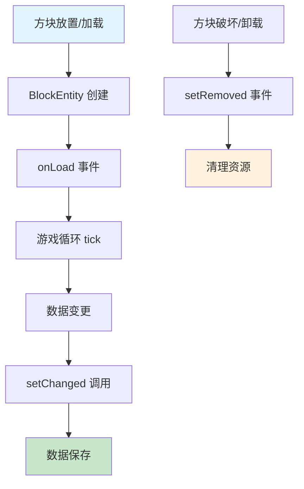
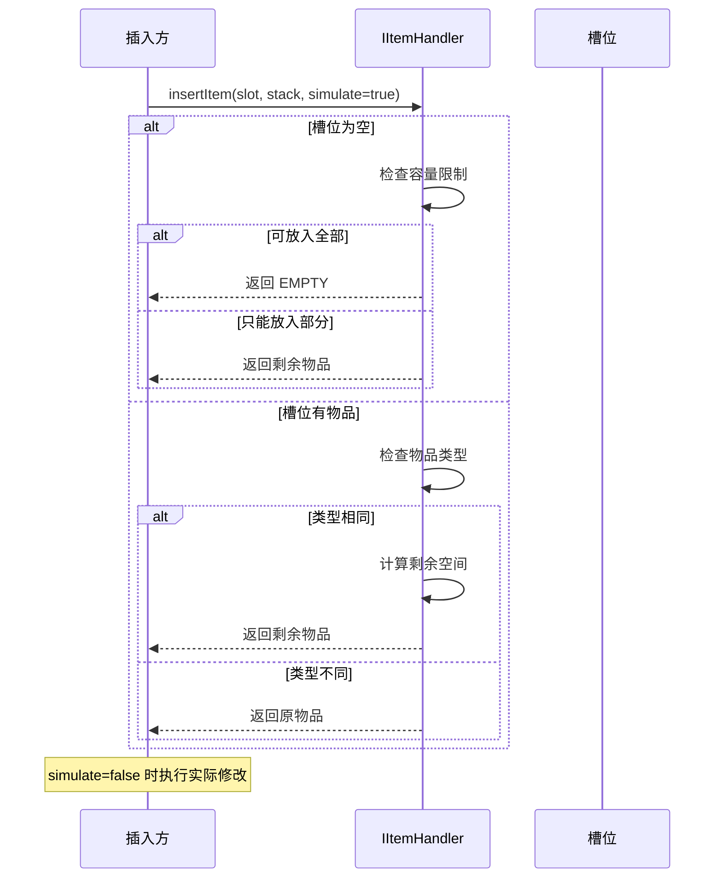
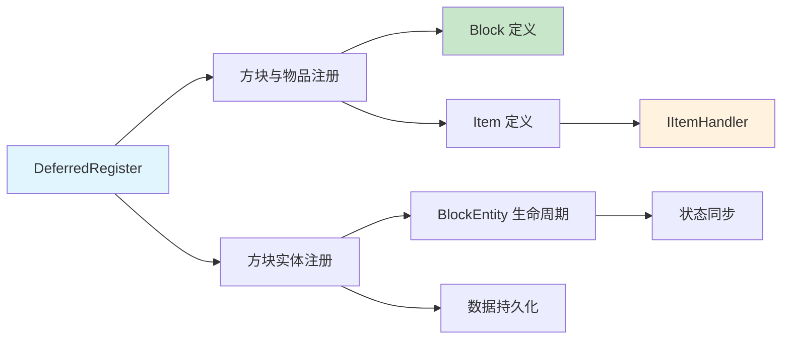

# NeoForge 方块与物品开发完全指南

## 目录

- [1. 前置知识](#1-前置知识)
- [2. 系统概述](#2-系统概述)
- [3. 创建自定义方块](#3-创建自定义方块)
- [4. 创建自定义物品](#4-创建自定义物品)
- [5. 方块实体详解](#5-方块实体详解)
- [6. 物品处理器简介](#6-物品处理器简介)
- [7. 完整示例：交互式发光方块](#7-完整示例交互式发光方块)
- [8. 总结与自查](#8-总结与自查)

---

## 1. 前置知识

### 1.1 本章目标

- 掌握 NeoForge 中自定义方块的创建方法
- 掌握自定义物品的实现
- 理解方块实体（BlockEntity）的生命周期
- 了解物品处理器（IItemHandler）接口
- 通过完整示例巩固所学知识

### 1.2 前置要求

- 已完成 [NeoForge 入门指南](../01-getting-started.md) 或具备以下基础：
- 熟悉 Java 基础语法和面向对象编程
- 了解 Minecraft 模组开发的基本概念
- 熟悉 Gradle 项目构建

### 1.3 关键术语

| 术语 | 英文 | 解释 |
|------|------|------|
| **Block** | 方块 | Minecraft 世界中的基本组成单位 |
| **Item** | 物品 | 玩家可以手持或存储的实体 |
| **BlockEntity** | 方块实体 | 与方块关联的持久化数据容器 |
| **DeferredRegister** | 延迟注册器 | NeoForge 的注册系统核心类 |
| **ItemStack** | 物品堆 | 代表一组物品的实例 |

> **💡 提示**：NeoForge 1.21.x 使用强类型事件系统和延迟注册模式，与传统 Forge 有显著区别。

---

## 2. 系统概述

### 2.1 方块与物品在 NeoForge 中的地位

方块和物品是 Minecraft 模组开发中最基础的游戏内容。NeoForge 提供了一套完整的注册系统来管理这些对象的生命周期。

### 2.2 架构流程图



### 2.3 核心类说明

|| 类 | 位置 | 作用 |
||---|------|------|------|
| `DeferredRegister<T>` | `neoforge.registries` | 延迟注册核心 |
| `DeferredBlock<T>` | `neoforge.registries` | 方块专用持有者 |
| `DeferredItem<T>` | `neoforge.registries` | 物品专用持有者 |
| `BlockEntity` | `net.minecraft.world` | 方块实体基类 |
| `IItemHandler` | `neoforge.items` | 物品处理器接口 |

---

## 3. 创建自定义方块

### 3.1 基本步骤

创建自定义方块需要以下步骤：

```
1. 声明 DeferredRegister<Block>
2. 创建方块实例
3. 注册到事件总线
4. （可选）创建方块实体
```

### 3.2 第一步：声明注册器

```java
// ModItems.java
public class ModBlocks {
    public static final String MODID = "mymod";
    
    // 创建方块注册器
    public static final DeferredRegister<Block> BLOCKS = 
        DeferredRegister.createBlocks(MODID);
}
```

### 3.3 第二步：注册方块

```java
// ModBlocks.java
public class ModBlocks {
    // 注册简单方块
    public static final DeferredBlock<Block> MY_BLOCK = 
        BLOCKS.register("my_block", 
            () -> new Block(BlockBehaviour.Properties.of()
                .strength(1.5f)           // 硬度与抗爆性
                .requiresCorrectToolForDrops()  // 需要正确工具掉落
                .noLootTable()            // 无掉落表
            )
        );
    
    // 注册石头类方块
    public static final DeferredBlock<Block> MY_STONE = 
        BLOCKS.register("my_stone",
            () -> new Block(BlockBehaviour.Properties.of()
                .strength(1.5f, 6.0f)    // 硬度, 抗爆性
                .sound(SoundType.STONE)
            )
        );
}
```

### 3.4 BlockBehaviour.Properties 常用配置

|| 方法 | 说明 | 示例值 |
||------|------|--------|
| `strength(float)` | 设置硬度和抗爆性 | `1.5f` |
| `strength(float, float)` | 分别为硬度和抗爆性 | `1.5f, 6.0f` |
| `sound(SoundType)` | 脚步声类型 | `SoundType.STONE` |
| `requiresCorrectToolForDrops()` | 需要正确工具 | - |
| `noLootTable()` | 无自然掉落 | - |
| `color(BlockColor)` | 方块颜色 | - |
| `isValidSpawn()` | 生物是否可生成 | `Blocks::isValidSpawn` |

### 3.5 第三步：在 Mod 主类中注册

```java
@Mod(ExampleMod.MODID)
public class ExampleMod {
    public static final String MODID = "mymod";
    
    public ExampleMod(IEventBus modBus) {
        // 注册所有方块
        ModBlocks.BLOCKS.register(modBus);
    }
}
```

### 3.6 创建自定义方块类

有时需要为方块添加特殊行为：

```java
// MyCustomBlock.java
public class MyCustomBlock extends Block {
    
    public MyCustomBlock() {
        super(BlockBehaviour.Properties.of()
            .strength(2.0f)
            .sound(SoundType.METAL)
        );
    }
    
    // 重写交互方法
    @Override
    public InteractionResult use(BlockState state, Level level, 
                                  BlockPos pos, Player player, 
                                  InteractionHand hand, BlockHitResult hit) {
        if (!level.isClientSide()) {
            // 服务端逻辑
            level.destroyBlock(pos, true);
            return InteractionResult.SUCCESS;
        }
        return InteractionResult.PASS;
    }
    
    // 重写破坏方法
    @Override
    public void destroy(Level level, BlockPos pos, BlockState state) {
        // 破坏时的额外逻辑
        super.destroy(level, pos, state);
    }
}
```

---

## 4. 创建自定义物品

### 4.1 物品注册流程

物品注册与方块类似：

```java
// ModItems.java
public class ModItems {
    public static final String MODID = "mymod";
    
    // 创建物品注册器
    public static final DeferredRegister<Item> ITEMS = 
        DeferredRegister.createItems(MODID);
    
    // 注册简单物品
    public static final DeferredItem<Item> MY_ITEM = 
        ITEMS.register("my_item", 
            () -> new Item(new Item.Properties()
                .stacksTo(64)      // 最大堆叠数
            )
        );
}
```

### 4.2 Item.Properties 常用配置

|| 方法 | 说明 |
||------|------|
| `stacksTo(int)` | 最大堆叠数，默认 64 |
| `durability(int)` | 耐久度（非堆叠物品） |
| `craftRemainder()` | 合成后剩余物品 |
| `tab(CreativeModeTab)` | 所在创造模式标签 |
| `fireResistant()` | 防火 |
| `food(FoodProperties)` | 食物属性 |

### 4.3 创建工具类物品

```java
// MySwordItem.java
public class MySwordItem extends SwordItem {
    
    public MySwordItem(Tier tier, int attackDamageBonus, float attackSpeedBonus) {
        super(tier, 
              new Item.Properties()
                  .attributes(SwordItem.createAttributes(tier, attackDamageBonus, attackSpeedBonus))
                  .stacksTo(1)
                  .durability(500)
        );
    }
    
    // 使用物品时的逻辑
    @Override
    public InteractionResultHolder<ItemStack> use(Level level, Player player, 
                                                   InteractionHand hand) {
        if (!level.isClientSide()) {
            // 服务端：造成伤害或施放效果
            player.hurt(player.damageSources().magic(), 2.0f);
        }
        return super.use(level, player, hand);
    }
    
    // 物品损坏时
    @Override
    public boolean isBarVisible(ItemStack stack) {
        return true; // 显示耐久条
    }
}
```

### 4.4 注册工具物品

```java
// 继承工具属性
public static final DeferredItem<MySwordItem> MY_SWORD = 
    ITEMS.register("my_sword",
        () -> new MySwordItem(Tiers.DIAMOND, 3, -2.4f)
    );
```

### 4.5 方块对应的物品（BlockItem）

NeoForge 提供便捷方法自动创建方块对应的物品：

```java
// 自动创建方块物品
public static final DeferredItem<BlockItem> MY_BLOCK_ITEM = 
    ITEMS.registerSimpleBlockItem(ModBlocks.MY_BLOCK);

// 或者自定义 BlockItem
public static final DeferredItem<BlockItem> MY_CUSTOM_BLOCK_ITEM = 
    ITEMS.register("my_block",
        () -> new BlockItem(ModBlocks.MY_BLOCK.get(), 
            new Item.Properties().tab(CreativeModeTab.TAB_BUILDING_BLOCKS)
        )
    );
```

### 4.6 在 Mod 主类中注册物品

```java
@Mod(ExampleMod.MODID)
public class ExampleMod {
    public ExampleMod(IEventBus modBus) {
        // 注册物品
        ModItems.ITEMS.register(modBus);
        
        // 注册方块
        ModBlocks.BLOCKS.register(modBus);
    }
}
```

---

## 5. 方块实体详解

### 5.1 什么是方块实体

**BlockEntity（方块实体）** 是与特定方块关联的持久化数据容器。适用于：
- 需要存储额外数据的方块（如箱子内容物）
- 需要定时更新的方块（如熔炉、投掷器）
- 需要客户端/服务端数据同步的方块

### 5.2 方块实体生命周期



### 5.3 创建方块实体

**第一步：创建方块实体类**

```java
// MyBlockEntity.java
public class MyBlockEntity extends BlockEntity {
    
    // 数据字段
    private int counter = 0;
    private boolean isActive = false;
    
    public MyBlockEntity(BlockEntityType<?> type, BlockPos pos, BlockState state) {
        super(type, pos, state);
    }
    
    // 每次 tick 时调用
    @Override
    public void tick() {
        super.tick();
        counter++;
        if (counter % 20 == 0) {
            this.isActive = !this.isActive;
            setChanged();
        }
    }
    
    // 保存数据到 NBT
    @Override
    protected void saveAdditional(CompoundTag tag) {
        super.saveAdditional(tag);
        tag.putInt("counter", counter);
        tag.putBoolean("isActive", isActive);
    }
    
    // 从 NBT 加载数据
    @Override
    public void load(CompoundTag tag) {
        super.load(tag);
        counter = tag.getInt("counter");
        isActive = tag.getBoolean("isActive");
    }
}
```

**第二步：创建方块实体类型**

```java
// MyBlockEntities.java
public class MyBlockEntities {
    public static final String MODID = "mymod";
    
    // 创建方块实体注册器
    public static final DeferredRegister<BlockEntityType<?>> BLOCK_ENTITIES = 
        DeferredRegister.create(BuiltInRegistries.BLOCK_ENTITY_TYPE, MODID);
    
    // 注册方块实体类型
    public static final DeferredHolder<BlockEntityType<?>, BlockEntityType<MyBlockEntity>> MY_BLOCK_ENTITY = 
        BLOCK_ENTITIES.register("my_block_entity",
            () -> BlockEntityType.Builder.of(
                MyBlockEntity::new,           // 构造方法引用
                ModBlocks.MY_BLOCK.get()      // 关联的方块
            ).build(null)
        );
}
```

**第三步：创建带方块实体的方块**

```java
// MyBlockWithEntity.java
public class MyBlockWithEntity extends BlockWithEntity {
    
    public MyBlockWithEntity() {
        super(BlockBehaviour.Properties.of().strength(2.0f));
    }
    
    // 创建对应的方块实体
    @Override
    public BlockEntity newBlockEntity(BlockPos pos, BlockState state) {
        return MyBlockEntities.MY_BLOCK_ENTITY.get().create(pos, state);
    }
    
    // 定义方块实体的客户端渲染
    @Override
    public RenderShape getRenderShape(BlockState state) {
        return RenderShape.MODEL;
    }
}
```

**第四步：在 Mod 主类中注册**

```java
@Mod(ExampleMod.MODID)
public class ExampleMod {
    public ExampleMod(IEventBus modBus) {
        // 注册顺序：BlockEntity -> Block -> Item
        MyBlockEntities.BLOCK_ENTITIES.register(modBus);
        ModBlocks.BLOCKS.register(modBus);
        ModItems.ITEMS.register(modBus);
    }
}
```

### 5.4 方块实体数据同步

**服务端到客户端同步**：

```java
// 在 BlockEntity 中重写
@Override
public void onDataPacket(net.minecraft.network.Connection net, 
                          ClientboundBlockEntityDataPacket pkt) {
    load(pkt.getTag());
}

// 在 BlockEntity 中重写
@Override
public CompoundTag getUpdateTag() {
    CompoundTag tag = new CompoundTag();
    saveAdditional(tag);
    return tag;
}
```

### 5.5 方块实体方法速查表

|| 方法 | 调用时机 | 用途 |
||------|---------|------|
| `onLoad()` | 加载到世界时 | 初始化、数据验证 |
| `tick()` | 每游戏刻 | 定时逻辑处理 |
| `setChanged()` | 数据变更时 | 标记需要保存 |
| `saveAdditional()` | 保存时 | 写入 NBT 数据 |
| `load()` | 加载时 | 从 NBT 恢复数据 |
| `setRemoved()` | 移除时 | 清理资源 |

---

## 6. 物品处理器简介

### 6.1 IItemHandler 接口概述

**IItemHandler** 是 NeoForge 定义的标准物品存储接口，类似于原版 Minecraft 的 `Container` 但更加通用。

> **💡 注意**：NeoForge 1.21.9 引入了新的 Transfer API，建议在新项目中使用 `ResourceHandler<ItemResource>` 替代 `IItemHandler`。

### 6.2 IItemHandler 核心方法

```java
public interface IItemHandler {
    // 获取槽位数量
    int getSlots();
    
    // 获取槽位中的物品（返回副本，不可修改！）
    ItemStack getStackInSlot(int slot);
    
    // 插入物品到槽位，返回剩余未插入的物品
    ItemStack insertItem(int slot, ItemStack stack, boolean simulate);
    
    // 从槽位提取物品，返回提取的物品
    ItemStack extractItem(int slot, int amount, boolean simulate);
    
    // 获取槽位的容量限制
    int getSlotLimit(int slot);
    
    // 检查物品是否可放入指定槽位
    boolean isItemValid(int slot, ItemStack stack);
}
```

### 6.3 物品插入流程图



### 6.4 简单物品处理器实现

```java
// SimpleItemHandler.java
public class SimpleItemHandler implements IItemHandler {
    
    private final ItemStack[] stacks;
    private final int slots;
    
    public SimpleItemHandler(int slots) {
        this.slots = slots;
        this.stacks = new ItemStack[slots];
        for (int i = 0; i < slots; i++) {
            stacks[i] = ItemStack.EMPTY;
        }
    }
    
    @Override
    public int getSlots() {
        return slots;
    }
    
    @Override
    public ItemStack getStackInSlot(int slot) {
        return stacks[slot];
    }
    
    @Override
    public ItemStack insertItem(int slot, ItemStack stack, boolean simulate) {
        if (stack.isEmpty()) return ItemStack.EMPTY;
        
        ItemStack current = stacks[slot];
        
        if (current.isEmpty()) {
            int limit = Math.min(stack.getMaxStackSize(), getSlotLimit(slot));
            if (stack.getCount() <= limit) {
                if (!simulate) stacks[slot] = stack.copy();
                return ItemStack.EMPTY;
            } else {
                ItemStack toInsert = stack.copyWithCount(limit);
                if (!simulate) stacks[slot] = toInsert;
                return stack.copyWithCount(stack.getCount() - limit);
            }
        } else if (ItemStack.isSameItemSameComponents(current, stack)) {
            int space = getSlotLimit(slot) - current.getCount();
            if (space > 0) {
                int toAdd = Math.min(space, stack.getCount());
                if (!simulate) current.grow(toAdd);
                return stack.copyWithCount(stack.getCount() - toAdd);
            }
        }
        
        return stack;
    }
    
    @Override
    public ItemStack extractItem(int slot, int amount, boolean simulate) {
        if (amount == 0) return ItemStack.EMPTY;
        
        ItemStack current = stacks[slot];
        if (current.isEmpty()) return ItemStack.EMPTY;
        
        int toExtract = Math.min(current.getCount(), amount);
        if (!simulate) stacks[slot].shrink(toExtract);
        return current.copyWithCount(toExtract);
    }
    
    @Override
    public int getSlotLimit(int slot) {
        return 64;
    }
    
    @Override
    public boolean isItemValid(int slot, ItemStack stack) {
        return true;
    }
}
```

### 6.5 与方块实体集成

```java
// InventoryBlockEntity.java
public class InventoryBlockEntity extends BlockEntity {
    
    private final SimpleItemHandler inventory;
    
    public InventoryBlockEntity(BlockEntityType<?> type, BlockPos pos, BlockState state) {
        super(type, pos, state);
        this.inventory = new SimpleItemHandler(9); // 9 槽
    }
    
    public IItemHandler getInventory() {
        return inventory;
    }
    
    @Override
    protected void saveAdditional(CompoundTag tag) {
        super.saveAdditional(tag);
        // 保存物品数据
        ListTag items = new ListTag();
        for (int i = 0; i < inventory.getSlots(); i++) {
            if (!inventory.getStackInSlot(i).isEmpty()) {
                CompoundTag itemTag = new CompoundTag();
                itemTag.putInt("Slot", i);
                inventory.getStackInSlot(i).save(itemTag);
                items.add(itemTag);
            }
        }
        tag.put("Items", items);
    }
    
    @Override
    public void load(CompoundTag tag) {
        super.load(tag);
        // 加载物品数据
        ListTag items = tag.getList("Items", Tag.TAG_COMPOUND);
        for (int i = 0; i < items.size(); i++) {
            CompoundTag itemTag = items.getCompound(i);
            int slot = itemTag.getInt("Slot");
            if (slot >= 0 && slot < inventory.getSlots()) {
                inventory.insertItem(slot, ItemStack.of(itemTag), false);
            }
        }
    }
}
```

---

## 7. 完整示例：交互式发光方块

### 7.1 示例概述

创建一个右键会发光的方块，带有方块实体存储发光状态。

```
┌─────────────────────────────────────────────┐
│  目标：创建一个可交互的发光方块              │
│  功能：                                      │
│  - 右键切换发光状态                          │
│  - 发光时提供光源                            │
│  - 使用方块实体存储状态                      │
│  - 数据持久化保存                            │
└─────────────────────────────────────────────┘
```

### 7.2 项目结构

```
src/main/java/com/example/mod/
├── ExampleMod.java
├── init/
│   ├── ModBlocks.java
│   ├── ModItems.java
│   ├── ModBlockEntities.java
│   └── CreativeTab.java
└── block/
    ├── GlowBlock.java
    └── GlowBlockEntity.java
```

### 7.3 完整代码实现

**ModBlocks.java** - 方块注册

```java
public class ModBlocks {
    public static final String MODID = "examplemod";
    
    public static final DeferredRegister<Block> BLOCKS = 
        DeferredRegister.createBlocks(MODID);
    
    public static final DeferredBlock<GlowBlock> GLOW_BLOCK = 
        BLOCKS.register("glow_block", 
            () -> new GlowBlock(BlockBehaviour.Properties.of()
                .strength(1.5f)
                .sound(SoundType.GLASS)
                .noLootTable()
            )
        );
    
    // 注册对应的方块物品
    public static final DeferredItem<BlockItem> GLOW_BLOCK_ITEM = 
        ModItems.ITEMS.registerSimpleBlockItem(GLOW_BLOCK);
}
```

**GlowBlock.java** - 发光方块

```java
public class GlowBlock extends BlockWithEntity {
    
    public GlowBlock(Properties properties) {
        super(properties);
    }
    
    @Override
    public BlockEntity newBlockEntity(BlockPos pos, BlockState state) {
        return ModBlockEntities.GLOW_BLOCK_ENTITY.get().create(pos, state);
    }
    
    @Override
    public RenderShape getRenderShape(BlockState state) {
        return RenderShape.MODEL;
    }
    
    @Override
    public InteractionResult use(BlockState state, Level level, 
                                 BlockPos pos, Player player, 
                                 InteractionHand hand, BlockHitResult hit) {
        if (!level.isClientSide() && level.getBlockEntity(pos) instanceof GlowBlockEntity entity) {
            // 切换发光状态
            boolean newState = !entity.isGlowing();
            entity.setGlowing(newState);
            
            // 发送消息给玩家
            String message = newState ? "灯亮了！" : "灯灭了！";
            player.displayClientMessage(
                Component.literal(message), 
                true
            );
            
            return InteractionResult.SUCCESS;
        }
        return InteractionResult.PASS;
    }
    
    // 设置方块光源
    @Override
    public int getLightEmission(BlockState state, LevelReader level, BlockPos pos) {
        if (level.getBlockEntity(pos) instanceof GlowBlockEntity entity) {
            return entity.isGlowing() ? 15 : 0;
        }
        return 0;
    }
    
    // 添加自定义方块状态属性
    @Override
    protected void createBlockStateDefinition(StateDefinition.Builder<Block, BlockState> builder) {
        builder.add(GLOWING);
    }
    
    public static final BooleanProperty GLOWING = BooleanProperty.create("glowing");
}
```

**GlowBlockEntity.java** - 发光方块实体

```java
public class GlowBlockEntity extends BlockEntity {
    
    private boolean glowing = false;
    
    public GlowBlockEntity(BlockEntityType<?> type, BlockPos pos, BlockState state) {
        super(type, pos, state);
    }
    
    public boolean isGlowing() {
        return glowing;
    }
    
    public void setGlowing(boolean glowing) {
        this.glowing = glowing;
        setChanged(); // 标记数据已变更，需要保存
        level.updateNeighborsAt(worldPosition, getBlockState().getBlock());
        syncToClient(); // 同步到客户端
    }
    
    // 同步到客户端
    private void syncToClient() {
        if (level != null && !level.isClientSide()) {
            level.blockEntityUpdated(worldPosition, true);
            level.sendBlockUpdated(worldPosition, getBlockState(), getBlockState(), 3);
        }
    }
    
    @Override
    protected void saveAdditional(CompoundTag tag) {
        super.saveAdditional(tag);
        tag.putBoolean("Glowing", glowing);
    }
    
    @Override
    public void load(CompoundTag tag) {
        super.load(tag);
        glowing = tag.getBoolean("Glowing");
    }
    
    @Override
    public CompoundTag getUpdateTag() {
        CompoundTag tag = super.getUpdateTag();
        saveAdditional(tag);
        return tag;
    }
    
    @Override
    public void onDataPacket(Connection net, ClientboundBlockEntityDataPacket pkt) {
        load(pkt.getTag());
        level.updateNeighborsAt(worldPosition, getBlockState().getBlock());
    }
}
```

**ModBlockEntities.java** - 方块实体注册

```java
public class ModBlockEntities {
    public static final String MODID = "examplemod";
    
    public static final DeferredRegister<BlockEntityType<?>> BLOCK_ENTITIES = 
        DeferredRegister.create(BuiltInRegistries.BLOCK_ENTITY_TYPE, MODID);
    
    public static final DeferredHolder<BlockEntityType<?>, BlockEntityType<GlowBlockEntity>> 
        GLOW_BLOCK_ENTITY = BLOCK_ENTITIES.register("glow_block_entity",
            () -> BlockEntityType.Builder.of(
                GlowBlockEntity::new,
                ModBlocks.GLOW_BLOCK.get()
            ).build(null)
        );
}
```

**ExampleMod.java** - 主类

```java
@Mod(ExampleMod.MODID)
public class ExampleMod {
    public static final String MODID = "examplemod";
    
    public ExampleMod(IEventBus modBus) {
        ModBlockEntities.BLOCK_ENTITIES.register(modBus);
        ModBlocks.BLOCKS.register(modBus);
        ModItems.ITEMS.register(modBus);
    }
}
```

### 7.4 运行效果

```
玩家放置方块
     │
     ▼
┌──────────────┐
│ 右键点击方块  │
└──────────────┘
     │
     ▼
┌──────────────────┐
│ GlowBlock.use()  │
│ 调用 entity.toggle() │
└──────────────────┘
     │
     ▼
┌──────────────────┐
│ GlowBlockEntity  │
│ - 切换状态       │
│ - setChanged()   │
│ - 同步到客户端   │
└──────────────────┘
     │
     ▼
┌──────────────────┐
│ 更新光照等级     │
│ getLightEmission │
└──────────────────┘
     │
     ▼
✅ 方块发光！
```

---

## 8. 总结与自查

### 8.1 本章要点回顾



### 8.2 关键知识点

|| 主题 | 核心概念 |
||------|---------|
| 方块创建 | `DeferredBlock` + `BlockBehaviour.Properties` |
| 物品创建 | `DeferredItem` + `Item.Properties` |
| 方块实体 | `BlockEntity` + 生命周期方法 |
| 物品处理 | `IItemHandler` 接口核心方法 |
| 数据持久化 | `saveAdditional()` / `load()` |
| 状态同步 | `getUpdateTag()` / `onDataPacket()` |

### 8.3 最佳实践

- ✅ 始终使用 `DeferredRegister` 进行注册
- ✅ 在 Mod 构造函数中注册到事件总线
- ✅ 方块实体数据变更后调用 `setChanged()`
- ✅ 物品处理器操作前先使用 `simulate=true` 预检
- ✅ 方块实体卸载时清理资源

---

**课后自查**：

- [ ] 能够创建自定义方块并注册到游戏中
- [ ] 能够创建自定义物品，包括工具类物品
- [ ] 理解方块实体与普通方块的区别及适用场景
- [ ] 能够实现带方块实体的自定义方块
- [ ] 理解 IItemHandler 接口的插入/提取机制
- [ ] 能够实现一个简单的交互式方块

---

**下一步学习**：

- [NeoForge 实体系统](../part-3-entities/01-entity-basics.md) - 创建自定义生物和实体
- [NeoForge 事件系统](../02-event-system.md) - 深入理解事件处理

---

**参考文档**：

- [NeoForge 注册与事件系统](../analysis/01-registry-event-system.md)
- [NeoForge 流体与物品系统](../analysis/08-fluid-item-system.md)
- [NeoForge 能力与传输系统](../analysis/02-capability-transfer-system.md)
