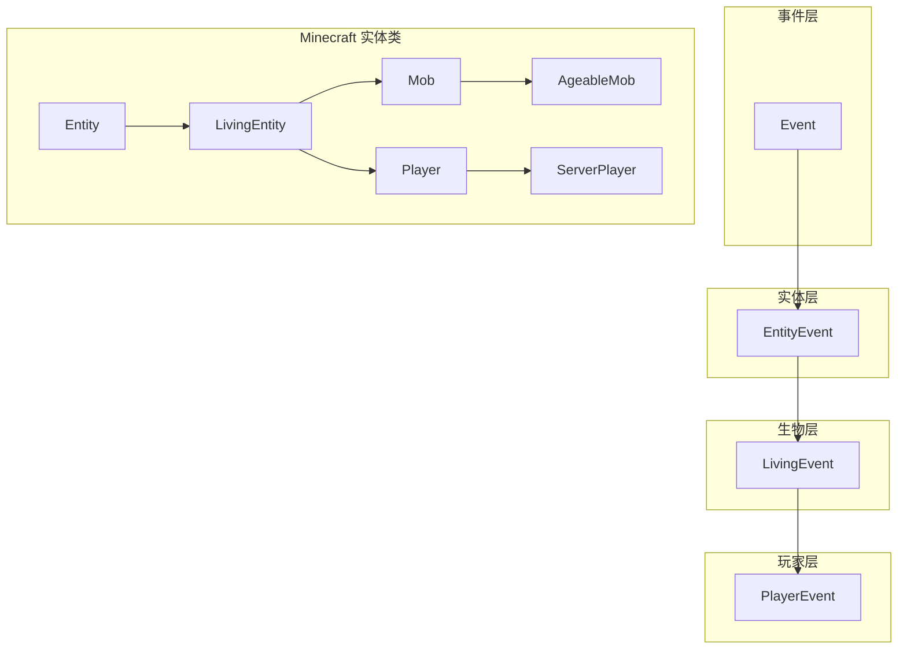
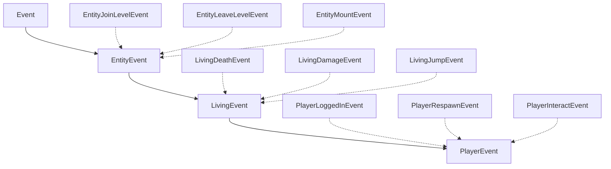
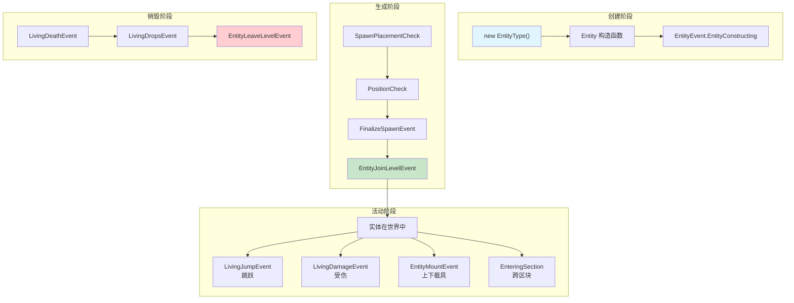

# NeoForge 实体系统完全指南

> 🎯 **本章目标**：学完本章后，你将能够创建自己的自定义生物，理解实体事件系统，并掌握属性系统的使用。

---

## 前置知识

- 了解 Java 基础（类继承、接口、事件监听）
- 熟悉 [注册系统](./part-1-getting-started/02-registry-system.md) 的 `DeferredRegister` 用法
- 知道什么是 `EntityType`（实体类型）和 `Mob`（生物）

💡 **Entity vs LivingEntity**：简单来说，`Entity` 是所有游戏实体的基类（包括物品实体、载具等），而 `LivingEntity` 特指"有生命的实体"（玩家、动物、怪物等）。我们需要的大部分功能都在 `LivingEntity` 上。

---

## 目录

- [1. 实体概述](#1-实体概述)
  - [1.1 Entity 继承体系](#11-entity-继承体系)
  - [1.2 常见的实体类型](#12-常见的实体类型)
- [2. 创建自定义实体](#2-创建自定义实体)
  - [2.1 定义实体类](#21-定义实体类)
  - [2.2 注册 EntityType](#22-注册-entitytype)
  - [2.3 添加实体渲染器（客户端）](#23-添加实体渲染器客户端)
- [3. 实体事件系统](#3-实体事件系统)
  - [3.1 事件继承结构](#31-事件继承结构)
  - [3.2 常用实体事件](#32-常用实体事件)
  - [3.3 生物（Living）事件](#33-生物living事件)
  - [3.4 玩家（Player）事件](#34-玩家player事件)
- [4. 属性系统](#4-属性系统)
  - [4.1 内置属性](#41-内置属性)
  - [4.2 自定义属性](#42-自定义属性)
- [5. 完整示例：魔法水晶鸟](#5-完整示例魔法水晶鸟)
  - [5.1 项目结构](#51-项目结构)
  - [5.2 完整代码](#52-完整代码)
- [6. 课后自查](#6-课后自查)

---

## 1. 实体概述

### 1.1 Entity 继承体系

NeoForge 的实体系统采用三层继承结构：



**层级说明**：

| 层级 | 事件类 | 适用范围 |
|------|--------|----------|
| 实体层 | `EntityEvent` | 所有实体（玩家、生物、物品、箭矢、载具等） |
| 生物层 | `LivingEvent` | 所有有生命的实体（玩家、生物） |
| 玩家层 | `PlayerEvent` | 仅玩家 |

💡 **为什么要分层？** 想象你在开一个派对邀请函：
- "所有人"都能来 = `EntityEvent`
- 只有"有生命的"才能来 = `LivingEvent`
- 只有"玩家"才能来 = `PlayerEvent`

层级越具体，你能获取的信息越多，但范围也越小。

### 1.2 常见的实体类型

Minecraft 中最常用的实体基类：

| 类名 | 说明 | 示例 |
|------|------|------|
| `Entity` | 所有实体的基类 | 物品实体、箭矢 |
| `LivingEntity` | 有生命的实体 | 玩家、动物、怪物 |
| `Mob` | 怪物/动物基类 | 僵尸、骷髅、狼 |
| `AgeableMob` | 可繁殖的生物 | 牛、猪、村民 |
| `Monster` | 敌对生物 | 僵尸、爬行者、末影人 |
| `FlyingMob` | 飞行生物 | 蝙蝠、幻翼 |

---

## 2. 创建自定义实体

### 2.1 定义实体类

首先，创建一个基础的实体类：

```java
public class MagicSlime extends Mob {
    
    public MagicSlime(EntityType<? extends MagicSlime> type, Level level) {
        super(type, level);
    }
    
    @Override
    protected void registerGoals() {
        // 注册 AI 行为
        this.goalSelector.addGoal(0, new FloatGoal(this));           // 漂浮
        this.goalSelector.addGoal(1, new RandomStrollGoal(this, 1.0)); // 随机游荡
        this.goalSelector.addGoal(2, new LookAtPlayerGoal(this, Player.class, 8.0f)); // 看玩家
    }
    
    @Override
    protected void defineSynchedData() {
        // 定义同步数据
        super.defineSynchedData();
    }
}
```

💡 **关键点**：
- 构造函数必须接受 `EntityType` 和 `Level` 两个参数
- `registerGoals()` 用于注册 AI 行为（目标）
- `defineSynchedData()` 用于注册客户端/服务端同步的数据

### 2.2 注册 EntityType

使用 `DeferredRegister` 注册实体类型：

```java
public class ExampleMod {
    public static final String MODID = "examplemod";
    
    // 创建实体注册器
    public static final DeferredRegister<EntityType<?>> ENTITY_TYPES = 
        DeferredRegister.createEntities(MODID);
    
    // 注册实体类型
    public static final DeferredHolder<EntityType<?>, EntityType<MagicSlime>> MAGIC_SLIME = 
        ENTITY_TYPES.register("magic_slime",
            builder -> builder
                .type(MagicSlime::new)          // 实体工厂
                .category(MobCategory.CREATURE)   // 生物类别
                .sized(1.0f, 1.0f)              // 碰撞箱 (宽, 高)
                .clientTrackingRange(8)          // 客户端追踪范围
                .updateInterval(3)               // 更新间隔
    );
    
    // 在构造函数中注册
    public ExampleMod(IEventBus modBus) {
        ENTITY_TYPES.register(modBus);
    }
}
```

**`MobCategory` 常用值**：

| 值 | 说明 | 生成条件 |
|---|------|----------|
| `MobCategory.CREATURE` | 被动生物 | 白天、光照充足 |
| `MobCategory.MONSTER` | 敌对生物 | 黑暗处、晚上 |
| `MobCategory.AMBIENT` | 环境生物 | 蝙蝠 |
| `MobCategory.WATER_CREATURE` | 水生生物 | 海洋 |
| `MobCategory.AXOLOTLS` | 美西螈 | 海洋（忠诚生物群系） |

### 2.3 添加实体渲染器（客户端）

在客户端模组中注册渲染器：

```java
public class ExampleModClient implements ClientModInit {
    
    @Override
    public void onClientSetup(ClientSetupEvent event) {
        // 注册实体渲染器
        EntityRenderers.register(ExampleMod.MAGIC_SLIME.get(), 
            ctx -> new MobRenderer<>(ctx, new MagicSlimeModel(), 0.5f));
    }
}
```

---

## 3. 实体事件系统

### 3.1 事件继承结构

NeoForge 的实体事件采用三层继承：



### 3.2 常用实体事件

#### EntityJoinLevelEvent - 实体加入世界

```java
@SubscribeEvent
public static void onEntityJoinLevel(EntityJoinLevelEvent event) {
    Entity entity = event.getEntity();
    
    // 检测特定实体
    if (entity.getType() == EntityType.ZOMBIE) {
        LOGGER.info("一只僵尸加入了世界！");
    }
    
    // 检查是否从存档加载
    if (event.loadedFromDisk()) {
        // 从存档加载的实体
    }
}
```

#### EntityLeaveLevelEvent - 实体离开世界

```java
@SubscribeEvent
public static void onEntityLeaveLevel(EntityLeaveLevelEvent event) {
    // 实体离开世界时触发
    LOGGER.debug("实体 {} 离开了世界", event.getEntity().getName());
}
```

#### EntityMountEvent - 上下载具

```java
@SubscribeEvent
public static void onEntityMount(EntityMountEvent event) {
    if (event.isMounting()) {
        // 正在骑上
        LOGGER.info("{} 骑上了 {}", 
            event.getEntityMounting().getName(),
            event.getEntityBeingMounted().getName());
    } else {
        // 正在下骑
        LOGGER.info("{} 从 {} 下来了", 
            event.getEntityMounting().getName(),
            event.getEntityBeingMounted().getName());
    }
}
```

### 3.3 生物（Living）事件

#### LivingJumpEvent - 实体跳跃

```java
@SubscribeEvent
public static void onLivingJump(LivingJumpEvent event) {
    LivingEntity entity = event.getEntity();
    
    // 给实体一个额外的跳跃力度
    if (entity.hasEffect(YOUR_MOD_ID, "jump_boost")) {
        entity.setDeltaMovement(entity.getDeltaMovement().add(0, 0.5, 0));
    }
}
```

#### LivingDeathEvent - 实体死亡

```java
@SubscribeEvent
public static void onLivingDeath(LivingDeathEvent event) {
    LivingEntity entity = event.getEntity();
    DamageSource source = event.getSource();
    
    // 自定义死亡逻辑
    if (entity instanceof Player player) {
        LOGGER.info("玩家 {} 死亡，原因为：{}", 
            player.getName().getString(),
            source.getLocalizedDeathMessage(entity).getString());
    }
    
    // 取消死亡（让实体永生）
    if (entity.hasTag("immortal")) {
        event.setCanceled(true);
    }
}
```

#### LivingDropsEvent - 死亡掉落

```java
@SubscribeEvent
public static void onLivingDrops(LivingDropsEvent event) {
    LivingEntity entity = event.getEntity();
    
    // 添加自定义掉落
    if (entity.getType() == EntityType.BLAZE) {
        ItemStack specialDrop = new ItemStack(Items.BLAZE_POWDER, 2);
        ItemEntity drop = new ItemEntity(
            entity.level(),
            entity.getX(), entity.getY(), entity.getZ(),
            specialDrop
        );
        event.getDrops().add(drop);
    }
}
```

#### LivingDamageEvent - 伤害事件

```java
// 伤害即将到来（可修改）
@SubscribeEvent
public static void onIncomingDamage(LivingIncomingDamageEvent event) {
    // 火焰伤害加倍！
    if (event.getSource().is(DamageTypes.IN_FIRE)) {
        event.setAmount(event.getAmount() * 2.0f);
    }
}

// 伤害已应用（只读）
@SubscribeEvent
public static void onDamagePost(LivingDamageEvent.Post event) {
    LOGGER.debug("实体 {} 受到了 {} 点伤害，护盾吸收了 {}",
        event.getEntity().getName(),
        event.getNewDamage(),
        event.getShieldDamage());
}
```

### 3.4 玩家（Player）事件

#### PlayerLoggedInEvent - 玩家登录

```java
@SubscribeEvent
public static void onPlayerLogin(PlayerEvent.PlayerLoggedInEvent event) {
    Player player = event.getEntity();
    
    // 发送欢迎消息
    player.displayClientMessage(
        Component.literal("欢迎来到服务器！"),
        true
    );
}
```

#### PlayerRespawnEvent - 玩家重生

```java
@SubscribeEvent
public static void onPlayerRespawn(PlayerEvent.PlayerRespawnEvent event) {
    Player player = event.getEntity();
    
    if (event.isEndConquered()) {
        // 玩家击败末影龙后重生
        player.sendSystemMessage(
            Component.literal("你击败了末影龙！")
        );
    }
}
```

#### PlayerInteractEvent - 玩家交互

```java
// 右键方块
@SubscribeEvent
public static void onRightClickBlock(PlayerInteractEvent.RightClickBlock event) {
    Player player = event.getEntity();
    Level level = event.getLevel();
    BlockPos pos = event.getPos();
    
    // 检测特定方块
    if (level.getBlockState(pos).is(Blocks.TORCH)) {
        player.displayClientMessage(
            Component.literal("这是一个火把！"),
            true
        );
    }
}
```

---

## 4. 属性系统

### 4.1 内置属性

Minecraft 提供了一系列内置属性，你可以通过 `getAttribute()` 获取：

```java
// 获取属性实例
AttributeInstance healthAttr = entity.getAttribute(Attributes.MAX_HEALTH);

// 添加临时修改器
healthAttr.addTransientModifier(new AttributeModifier(
    UUID.randomUUID(),
    "magic_bonus",
    20.0,                              // 增加值
    AttributeModifier.Operation.ADD_VALUE  // 操作类型
));

// 获取当前值
double currentHealth = entity.getAttributeValue(Attributes.MAX_HEALTH);
```

**常用内置属性**：

| 属性 | 说明 | 默认值 |
|------|------|--------|
| `MAX_HEALTH` | 最大生命值 | 20.0 |
| `FOLLOW_RANGE` | 追踪范围 | 32.0 |
| `KNOCKBACK_RESISTANCE` | 击退抗性 | 0.0 |
| `MOVEMENT_SPEED` | 移动速度 | 0.7 |
| `ATTACK_DAMAGE` | 攻击伤害 | 1.0 |
| `ARMOR` | 护甲值 | 0.0 |
| `ARMOR_TOUGHNESS` | 护甲韧性 | 0.0 |
| `ATTACK_SPEED` | 攻击速度 | 4.0 |
| `FLYING_SPEED` | 飞行速度 | 0.4 |

### 4.2 自定义属性

创建自定义属性需要两步：

**第一步：注册属性**

```java
public static final DeferredHolder<Attribute, Attribute> MAGIC_POWER = ATTRIBUTES.register(
    "magic_power",
    () -> new RangedAttribute(
        MOD_ATTRS.get(),          // 父属性（一般用 BASE）
        "attribute.name.examplemod.magic_power",
        0.0,                      // 最小值
        0.0,                      // 默认值
        100.0                     // 最大值
    )
);
```

**第二步：在实体上使用**

```java
@SubscribeEvent
public static void onFinalizeSpawn(FinalizeSpawnEvent event) {
    if (event.getEntity() instanceof LivingEntity living) {
        AttributeInstance attr = living.getAttribute(MAGIC_POWER.get());
        if (attr != null) {
            attr.setBaseValue(50.0);
        }
    }
}
```

---

## 5. 完整示例：魔法水晶鸟

让我们创建一个完整的"魔法水晶鸟"实体，它有以下特性：
- 飞行生物（FlyingMob）
- 会在空中漂浮
- 受到攻击时会发出粒子效果
- 死亡时掉落水晶碎片

### 5.1 项目结构

```
src/main/java/com/example/examplemod/
├── ExampleMod.java              # 主类
├── entity/
│   └── CrystalBirdEntity.java   # 魔法水晶鸟实体
├── init/
│   ├── ModEntities.java         # 实体注册
│   └── ModAttributes.java       # 属性注册
└── event/
    └── EntityEventHandler.java  # 事件监听

src/main/java/com/example/examplemod/client/
└── ExampleModClient.java        # 客户端渲染器注册
```

### 5.2 完整代码

**1. 主类 `ExampleMod.java`**

```java
public class ExampleMod {
    public static final String MODID = "examplemod";
    public static final Logger LOGGER = LogManager.getLogger(MODID);
    
    public ExampleMod(IEventBus modBus) {
        LOGGER.info("ExampleMod 正在初始化...");
        
        // 注册所有内容
        ModEntities.ENTITY_TYPES.register(modBus);
        ModAttributes.ATTRIBUTES.register(modBus);
        
        LOGGER.info("ExampleMod 初始化完成！");
    }
}
```

**2. 实体类 `CrystalBirdEntity.java`**

```java
public class CrystalBirdEntity extends FlyingMob {
    
    private static final EntityDimensions CRYSTAL_BIRD_SIZE = 
        EntityDimensions.scalable(0.8f, 0.8f);
    
    public CrystalBirdEntity(EntityType<? extends CrystalBirdEntity> type, Level level) {
        super(type, level);
        this.setNoGravity(true);  // 不受重力影响
    }
    
    @Override
    protected void registerGoals() {
        super.registerGoals();
        this.goalSelector.addGoal(0, new FloatGoal(this));           // 保持漂浮
        this.goalSelector.addGoal(1, new RandomHoverAroundGoal(
            this, 1.0, 3.0, 10.0));                                  // 随机悬停
        this.goalSelector.addGoal(2, new LookAtPlayerGoal(
            this, Player.class, 8.0f));                              // 看玩家
    }
    
    @Override
    public EntityDimensions getDimensions(Pose pose) {
        return CRYSTAL_BIRD_SIZE;
    }
    
    @Override
    protected float getSoundVolume() {
        return 0.2f;
    }
    
    @Override
    protected SoundEvent getAmbientSound() {
        return SoundEvents.AMBIENT_CAVE;
    }
}
```

**3. 实体注册 `ModEntities.java`**

```java
public class ModEntities {
    public static final DeferredRegister<EntityType<?>> ENTITY_TYPES = 
        DeferredRegister.createEntities(ExampleMod.MODID);
    
    public static final DeferredHolder<EntityType<?>, EntityType<CrystalBirdEntity>> CRYSTAL_BIRD = 
        ENTITY_TYPES.register("crystal_bird",
            builder -> builder
                .type(CrystalBirdEntity::new)
                .category(MobCategory.CREATURE)
                .sized(0.8f, 0.8f)
                .clientTrackingRange(8)
                .updateInterval(3)
    );
}
```

**4. 事件处理 `EntityEventHandler.java`**

```java
public static final class EntityEvents {
    
    @SubscribeEvent
    public static void onLivingHurt(LivingDamageEvent.Pre event) {
        LivingEntity entity = event.getEntity();
        
        // 当水晶鸟受伤时，产生粒子效果
        if (entity.getType() == ModEntities.CRYSTAL_BIRD.get()) {
            if (entity.level().isClientSide) {
                // 客户端：生成粒子
                entity.level().addParticle(
                    ParticleTypes.END_ROD,
                    entity.getX(), entity.getY(), entity.getZ(),
                    0, 0.1, 0
                );
            }
        }
    }
    
    @SubscribeEvent
    public static void onLivingDrops(LivingDropsEvent event) {
        LivingEntity entity = event.getEntity();
        
        // 水晶鸟死亡时掉落水晶碎片
        if (entity.getType() == ModEntities.CRYSTAL_BIRD.get()) {
            RandomSource random = entity.getRandom();
            
            // 掉落 1-3 个水晶碎片
            int count = random.nextInt(3) + 1;
            for (int i = 0; i < count; i++) {
                ItemStack drop = new ItemStack(Items.AMETHYST_SHARD);
                ItemEntity itemEntity = new ItemEntity(
                    entity.level(),
                    entity.getX(), entity.getY(), entity.getZ(),
                    drop
                );
                itemEntity.setDefaultPickUpDelay();
                event.getDrops().add(itemEntity);
            }
        }
    }
    
    @SubscribeEvent
    public static void onEntityJoin(EntityJoinLevelEvent event) {
        Entity entity = event.getEntity();
        
        // 检测水晶鸟加入世界
        if (entity.getType() == ModEntities.CRYSTAL_BIRD.get()) {
            LOGGER.info("一只魔法水晶鸟出现了！");
            
            // 设置初始生命值
            if (entity instanceof LivingEntity living) {
                living.setHealth(10.0f);
            }
        }
    }
}
```

**5. 客户端渲染器 `ExampleModClient.java`**

```java
public class ExampleModClient implements ClientModInit {
    
    @Override
    public void onClientSetup(ClientSetupEvent event) {
        // 注册水晶鸟渲染器
        EntityRenderers.register(ModEntities.CRYSTAL_BIRD.get(), 
            context -> new MobRenderer<>(context, new CrystalBirdModel(), 0.4f));
    }
}
```

**6. 事件总线注册**

在 `ExampleMod` 构造函数中注册事件监听器：

```java
public ExampleMod(IEventBus modBus) {
    // ... 其他注册 ...
    
    // 注册事件监听器
    NeoForge.EVENT_BUS.register(EntityEvents.class);
}
```

---

## 实体生命周期图



---

## 6. 课后自查

完成本章学习后，请检查你是否能够：

- [ ] **理解继承体系**：解释 `Entity`、`LivingEntity`、`PlayerEvent` 的继承关系
- [ ] **创建自定义实体**：使用 `EntityType` 和 `DeferredRegister` 创建自定义生物
- [ ] **注册实体渲染器**：在客户端正确注册实体的渲染器
- [ ] **监听实体事件**：使用 `@SubscribeEvent` 监听并处理实体事件
- [ ] **操作属性系统**：获取、修改实体的属性值
- [ ] **实现生物 AI**：使用 `registerGoals()` 为生物添加 AI 行为
- [ ] **自定义死亡掉落**：在 `LivingDropsEvent` 中添加自定义掉落

---

## 相关链接

### 源码参考

| 文件 | 路径 |
|------|------|
| `EntityEvent.java` | `net.neoforged.neoforge.event.entity` |
| `LivingEvent.java` | `net.neoforged.neoforge.event.entity.living` |
| `PlayerEvent.java` | `net.neoforged.neoforge.event.entity.player` |

### 进阶阅读

- [实体与生物系统分析](../analysis/07-entity-living-system.md) - 深入理解实体事件底层机制
- [事件系统](./part-1-getting-started/03-event-system.md) - NeoForge 事件总线详解
- [注册系统](./part-1-getting-started/02-registry-system.md) - DeferredRegister 完整指南

---

> 💡 **提示**：创建自定义生物时，最重要的是理解它的 AI 行为。Minecraft 提供了丰富的 Goal 类（如 `RandomStrollGoal`、`NearestAttackableTargetGoal` 等），组合使用它们可以创建出有趣的行为模式！

---

*文档版本：NeoForge 1.21.x, Minecraft 1.21*
*最后更新：2026-03-24*
