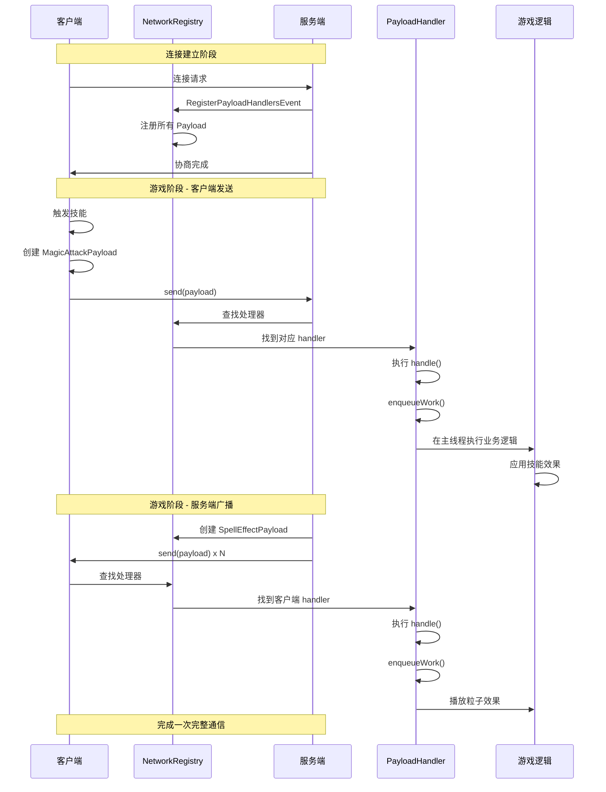
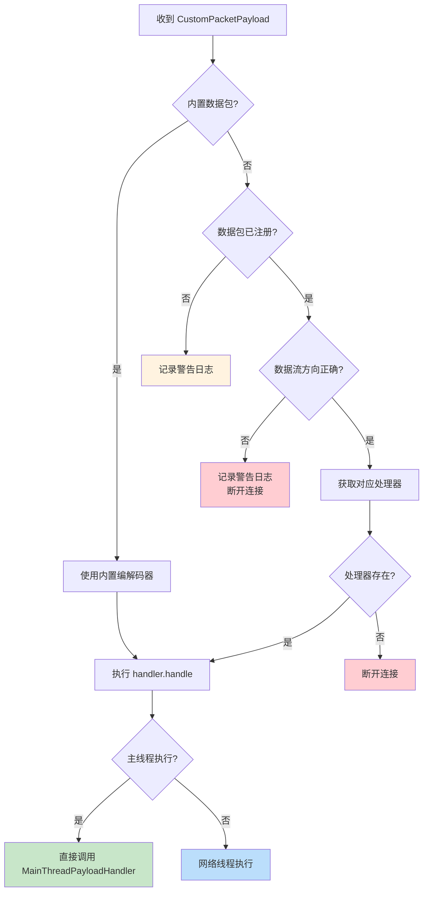

# NeoForge 网络通信完全指南

## 目录

- [1. 前言与学习目标](#1-前言与学习目标)
- [2. 网络系统概述](#2-网络系统概述)
  - [2.1 什么是 Payload？](#21-什么是-payload)
  - [2.2 核心概念图解](#22-核心概念图解)
- [3. 数据包架构](#3-数据包架构)
  - [3.1 CustomPacketPayload 接口](#31-custompacketpayload-接口)
  - [3.2 StreamCodec 编解码器](#32-streamcodec-编解码器)
- [4. PayloadRegistrar 注册系统](#4-payloadregistrar-注册系统)
  - [4.1 注册方法一览](#41-注册方法一览)
  - [4.2 链式配置方法](#42-链式配置方法)
- [5. IPayloadContext 上下文处理](#5-ipayloadcontext-上下文处理)
  - [5.1 常用方法详解](#5-常用方法详解)
  - [5.2 主线程 vs 网络线程](#52-主线程-vs-网络线程)
- [6. 发送与接收数据](#6-发送与接收数据)
  - [6.1 服务端发送数据给客户端](#61-服务端发送数据给客户端)
  - [6.2 客户端发送数据给服务端](#62-客户端发送数据给服务端)
- [7. 完整示例：魔法攻击系统](#7-完整示例魔法攻击系统)
  - [7.1 项目结构](#71-项目结构)
  - [7.2 定义 Payload](#72-定义-payload)
  - [7.3 创建网络处理器](#73-创建网络处理器)
  - [7.4 服务端技能实现](#74-服务端技能实现)
  - [7.5 客户端触发器实现](#75-客户端触发器实现)
- [8. 进阶主题](#8-进阶主题)
  - [8.1 配置阶段数据包](#81-配置阶段数据包)
  - [8.2 可选数据包](#82-可选数据包)
  - [8.3 版本控制](#83-版本控制)
- [9. 工作流程图](#9-工作流程图)
- [10. 课后自查](#10-课后自查)

---

## 1. 前言与学习目标

### 学习目标

在本章结束时，你将能够：

- ✅ 理解 NeoForge 网络系统的核心组件和设计理念
- ✅ 掌握 `CustomPacketPayload` 和 `StreamCodec` 的定义方法
- ✅ 使用 `PayloadRegistrar` 注册网络数据包
- ✅ 实现客户端与服务端之间的双向通信
- ✅ 处理数据包的线程安全问题
- ✅ 构建一个完整的魔法攻击网络同步示例

### 前置知识

- ✅ Java 基础（泛型、Lambda 表达式、函数式接口）
- ✅ NeoForge 模组项目结构
- ✅ 事件系统基础（参考事件系统教程）
- ✅ Minecraft 坐标系和实体概念

### 关键术语

| 术语 | 解释 |
|------|------|
| **Payload** | 自定义数据包，继承自 `CustomPacketPayload`，用于客户端与服务端之间传递数据 |
| **StreamCodec** | 流编解码器，将 Payload 序列化和反序列化为字节流 |
| **Channel** | 网络通道，代表一个协商后的通信线路，具有唯一 ID 和版本 |
| **Handler** | 处理器，当收到数据包时执行的回调逻辑 |
| **Flow** | 数据流方向，`SERVERBOUND`（客户端→服务端）或 `CLIENTBOUND`（服务端→客户端） |

---

## 2. 网络系统概述

### 2.1 什么是 Payload？

Payload 是 NeoForge 网络系统的核心概念，它是一个轻量级数据包，用于在客户端和服务端之间传递自定义数据。

```
┌─────────────────────────────────────────────────────────────┐
│                      客户端 (Client)                          │
│  ┌─────────────┐      Payload       ┌─────────────┐         │
│  │  魔法攻击    │ ──────────────────► │  技能系统   │         │
│  │  触发器      │   SERVERBOUND      │             │         │
│  └─────────────┘                     └──────┬──────┘         │
└──────────────────────────────────────────────┼───────────────┘
                                               │
                                               │ 网络
                                               │
┌──────────────────────────────────────────────┼───────────────┐
│                      服务端 (Server)          │               │
│  ┌─────────────┐      Payload       ┌────────▼────────┐        │
│  │  效果应用   │ ◄───────────────── │  网络处理器    │        │
│  │  系统        │   CLIENTBOUND     │                │        │
│  └─────────────┘                    └────────────────┘        │
└──────────────────────────────────────────────────────────────┘
```

**为什么使用 Payload？**

1. **类型安全**：编译时检查，减少运行时错误
2. **版本协商**：支持多版本兼容，便于 Mod 升级
3. **可选依赖**：支持可选数据包，避免强制依赖导致的连接失败
4. **线程安全**：区分网络线程和主线程处理

### 2.2 核心概念图解

```
┌─────────────────────────────────────────────────────────────────┐
│                      NetworkRegistry                             │
│                  (全局网络注册中心)                                │
│  ┌──────────────────────────────────────────────────────────┐    │
│  │  PAYLOAD_REGISTRATIONS: Map<Protocol, Map<ID, Payload>>  │    │
│  │  SERVERBOUND_HANDLERS: Map<Protocol, Map<ID, Handler>>    │    │
│  │  CLIENTBOUND_HANDLERS: Map<Protocol, Map<ID, Handler>>    │    │
│  └──────────────────────────────────────────────────────────┘    │
└─────────────────────────────────────────────────────────────────┘
                              ▲
                              │ RegisterPayloadHandlersEvent
                              │
┌─────────────────────────────────────────────────────────────────┐
│                      PayloadRegistrar                             │
│                  (建造者风格的注册助手)                            │
│  ┌──────────────────────────────────────────────────────────┐    │
│  │  playToServer()  │  playToClient()  │  playBidirectional │    │
│  │  executesOn()    │  versioned()      │  optional()         │    │
│  └──────────────────────────────────────────────────────────┘    │
└─────────────────────────────────────────────────────────────────┘
```

---

## 3. 数据包架构

### 3.1 CustomPacketPayload 接口

`CustomPacketPayload` 是所有自定义数据包的基类，使用 Java Record 实现最简洁。

```java
package com.example.mymod.network;

import net.minecraft.network.RegistryFriendlyByteBuf;
import net.minecraft.network.codec.StreamCodec;
import net.minecraft.network.protocol.common.custom.CustomPacketPayload;
import net.minecraft.resources.Identifier;
import net.minecraft.world.phys.Vec3;

public record MagicAttackPayload(
        int spellId,        // 技能ID
        Vec3 targetPos      // 目标位置
) implements CustomPacketPayload {

    // 定义 Payload 类型（全局唯一标识）
    public static final Type<MagicAttackPayload> TYPE = 
            new Type<>(Identifier.fromNamespaceAndPath("mymod", "magic_attack"));

    // 定义编解码器
    public static final StreamCodec<RegistryFriendlyByteBuf, MagicAttackPayload> STREAM_CODEC = 
            StreamCodec.composite(
                    StreamCodec.of(
                            RegistryFriendlyByteBuf::writeInt,
                            RegistryFriendlyByteBuf::readInt
                    ),
                    MagicAttackPayload::spellId,
                    Vec3.STREAM_CODEC,
                    MagicAttackPayload::targetPos,
                    MagicAttackPayload::new
            );

    @Override
    public Type<MagicAttackPayload> type() {
        return TYPE;
    }
}
```

### 3.2 StreamCodec 编解码器

NeoForge 使用 `StreamCodec` 进行数据序列化，支持多种内置编解码器：

| 编解码器 | 用途 |
|---------|------|
| `ByteBufCodecs.BOOL` | 布尔值 |
| `ByteBufCodecs.BYTE` | 字节 |
| `ByteBufCodecs.INT` / `VAR_INT` | 整数 |
| `ByteBufCodecs.FLOAT` | 浮点数 |
| `ByteBufCodecs.STRING_UTF8` | UTF-8 字符串 |
| `Identifier.STREAM_CODEC` | 资源标识符 |
| `ItemStack.STREAM_CODEC` | 物品堆 |
| `BlockPos.STREAM_CODEC` | 方块坐标 |
| `Vec3.STREAM_CODEC` | 三维向量 |
| `ByteBufCodecs.collection()` | 集合类型 |

**组合编解码器示例**：

```java
// 简单类型组合
public static final StreamCodec<RegistryFriendlyByteBuf, SimplePayload> CODEC = 
        StreamCodec.composite(
                ByteBufCodecs.STRING_UTF8, SimplePayload::message,
                ByteBufCodecs.INT, SimplePayload::value,
                SimplePayload::new
        );

// 集合类型
public static final StreamCodec<RegistryFriendlyByteBuf, MultiPayload> COLLECTION_CODEC = 
        StreamCodec.composite(
                ByteBufCodecs.collection(
                        LinkedList::new,           // 集合工厂
                        Identifier.STREAM_CODEC     // 元素编解码器
                ),
                MultiPayload::items,
                MultiPayload::new
        );

// 复合数据类型
public static final StreamCodec<RegistryFriendlyByteBuf, ComplexPayload> COMPLEX_CODEC = 
        StreamCodec.composite(
                ItemStack.STREAM_CODEC, ComplexPayload::item,
                BlockPos.STREAM_CODEC, ComplexPayload::pos,
                CompoundTag.SPECIALIST_CODEC, ComplexPayload::tag,
                ComplexPayload::new
        );
```

---

## 4. PayloadRegistrar 注册系统

### 4.1 注册方法一览

`PayloadRegistrar` 提供多种注册方法，覆盖不同的使用场景：

```java
public class PayloadRegistrar {
    
    // ============ 游戏阶段 (Play Phase) ============
    
    // 服务端 → 客户端（服务端发送，客户端接收）
    public <T> PayloadRegistrar playToClient(Type<T>, StreamCodec, IPayloadHandler<T>)
    
    // 客户端 → 服务端（客户端发送，服务端接收）
    public <T> PayloadRegistrar playToServer(Type<T>, StreamCodec, IPayloadHandler<T>)
    
    // 双向（需要提供两个方向的处理器）
    public <T> PayloadRegistrar playBidirectional(Type<T>, StreamCodec, 
                                                   IPayloadHandler<T> serverHandler, 
                                                   IPayloadHandler<T> clientHandler)
    
    // ============ 配置阶段 (Configuration Phase) ============
    
    public <T> PayloadRegistrar configurationToClient(...)
    public <T> PayloadRegistrar configurationToServer(...)
    public <T> PayloadRegistrar configurationBidirectional(...)
    
    // ============ 通用 (所有阶段) ============
    
    public <T> PayloadRegistrar commonToClient(...)
    public <T> PayloadRegistrar commonToServer(...)
    public <T> PayloadRegistrar commonBidirectional(...)
}
```

### 4.2 链式配置方法

`PayloadRegistrar` 支持建造者模式的链式调用：

```java
// 基础用法
event.registrar("1.0.0")
    .playToServer(MyPayload.TYPE, MyPayload.CODEC, handler);

// 设置处理线程（默认主线程）
event.registrar("1.0.0")
    .executesOn(HandlerThread.MAIN)    // 主线程执行（默认）
    .executesOn(HandlerThread.NETWORK)  // 网络线程执行
    .playToServer(MyPayload.TYPE, MyPayload.CODEC, handler);

// 标记为可选
event.registrar("1.0.0")
    .optional()  // 此 registrar 下所有数据包都是可选的
    .playToServer(OptPayload.TYPE, OptPayload.CODEC, handler);

// 版本控制
event.registrar("1.0.0")
    .versioned("2.0.0")  // 使用特定版本
    .playToServer(V2Payload.TYPE, V2Payload.CODEC, handler);

// 组合使用
event.registrar("1.0.0")
    .optional()
    .executesOn(HandlerThread.NETWORK)
    .playToClient(GuiSyncPayload.TYPE, GuiSyncPayload.CODEC, handler);
```

---

## 5. IPayloadContext 上下文处理

### 5.1 常用方法详解

`IPayloadContext` 是处理数据包时的上下文对象，提供丰富的 API：

```java
public interface IPayloadContext {
    
    // 获取关联的数据包监听器
    ICommonPacketListener listener();
    
    // 获取连接的 Connection 对象
    default Connection connection() {
        return this.listener().getConnection();
    }
    
    // 获取相关的玩家对象
    // PLAY 阶段返回 ServerPlayer（服务端）或 LocalPlayer（客户端）
    Player player();
    
    // 向发送者回复数据包
    default void reply(CustomPacketPayload payload) {
        this.listener().send(payload);
    }
    
    // 断开连接
    default void disconnect(Component reason) {
        this.listener().disconnect(reason);
    }
    
    // 将任务提交到主线程执行（关键方法！）
    CompletableFuture<Void> enqueueWork(Runnable task);
    
    // 获取数据流方向
    PacketFlow flow();
    
    // 获取当前协议阶段
    default ConnectionProtocol protocol() {
        return this.listener().protocol();
    }
    
    // 标记配置任务完成
    void finishCurrentTask(ConfigurationTask.Type type);
}
```

### 5.2 主线程 vs 网络线程

数据包处理可以在两种线程模式下执行：

```java
// 模式1：主线程处理（默认，推荐）
// 所有游戏逻辑必须在主线程执行
event.registrar("1.0.0")
    .executesOn(HandlerThread.MAIN)  // 默认模式
    .playToServer(Payload.TYPE, Payload.CODEC, (payload, ctx) -> {
        ctx.enqueueWork(() -> {
            // ✅ 可以安全访问和修改游戏状态
            ServerPlayer player = (ServerPlayer) ctx.player();
            player.getLevel().explode(...);
            player.sendSystemMessage(...);
        });
    });

// 模式2：网络线程处理
// 适合简单的数据处理，避免线程切换开销
event.registrar("1.0.0")
    .executesOn(HandlerThread.NETWORK)
    .playToServer(Payload.TYPE, Payload.CODEC, (payload, ctx) -> {
        // ⚠️ 不要在此线程中访问游戏实体方块等
        // 只适合日志记录、统计等简单操作
        LOGGER.info("Received packet: " + payload.getData());
    });
```

**💡 重要提示**：

```java
// ❌ 错误：在网络线程中直接修改游戏状态
(payload, ctx) -> {
    ServerPlayer player = (ServerPlayer) ctx.player();
    player.sendSystemMessage(...);  // 可能导致线程安全问题！
};

// ✅ 正确：使用 enqueueWork 提交到主线程
(payload, ctx) -> {
    ctx.enqueueWork(() -> {
        ServerPlayer player = (ServerPlayer) ctx.player();
        player.sendSystemMessage(...);  // 安全！
    });
};

// ✅ 也正确：使用返回值的 enqueueWork
(payload, ctx) -> {
    ctx.enqueueWork(() -> {
        // 返回值可以用于后续处理
        return computeGameState();
    }).thenAccept(result -> {
        // 在主线程处理结果
    });
};
```

---

## 6. 发送与接收数据

### 6.1 服务端发送数据给客户端

**方式一：通过 Player 连接发送**

```java
// 在服务端代码中
public class MagicSpellEffects {
    
    // 向单个玩家发送数据包
    public static void sendToClient(ServerPlayer player, SpellEffectPayload payload) {
        player.connection.send(payload);
    }
    
    // 向所有玩家发送数据包
    public static void sendToAllClients(ServerLevel level, SpellEffectPayload payload) {
        for (ServerPlayer player : level.getServer().getPlayerList().getPlayers()) {
            player.connection.send(payload);
        }
    }
    
    // 向指定范围内的玩家发送数据包
    public static void sendToNearbyPlayers(ServerLevel level, Vec3 pos, 
                                           double radius, SpellEffectPayload payload) {
        for (ServerPlayer player : level.getPlayers(p -> 
                p.distanceToSqr(pos.x, pos.y, pos.z) <= radius * radius)) {
            player.connection.send(payload);
        }
    }
}
```

**方式二：使用 reply() 方法**

```java
// 在服务端处理器中回复客户端
registrar.playToServer(
    MagicAttackPayload.TYPE,
    MagicAttackPayload.CODEC,
    (payload, context) -> {
        context.enqueueWork(() -> {
            ServerPlayer player = (ServerPlayer) context.player();
            
            // 执行技能逻辑...
            applyMagicEffect(player, payload.targetPos());
            
            // 回复客户端
            context.reply(new SpellResultPayload(payload.spellId(), true));
        });
    }
);
```

### 6.2 客户端发送数据给服务端

**方式一：通过 ClientPacketListener 发送**

```java
// 在客户端代码中（需要有 ClientPlayerEntity）
public class MagicAttackInput {
    
    public static void sendToServer(MagicAttackPayload payload) {
        Minecraft mc = Minecraft.getInstance();
        if (mc.getConnection() != null) {
            // 发送数据包到服务端
            mc.getConnection().send(payload);
        }
    }
}
```

**方式二：在物品使用时触发**

```java
// 自定义物品类
public class MagicWandItem extends Item {
    
    @Override
    public InteractionResultHolder<ItemStack> use(Level level, Player player, 
                                                    InteractionHand hand) {
        if (!level.isClientSide()) {
            // 服务端：直接执行效果
            return useOnServer(level, player, hand);
        } else {
            // 客户端：发送数据包到服务端
            MagicAttackPayload payload = new MagicAttackPayload(
                SPELL_ID_FIREBALL, 
                getLookTarget(player)
            );
            MagicAttackInput.sendToServer(payload);
            return InteractionResultHolder.success(player.getItemInHand(hand));
        }
    }
}
```

---

## 7. 完整示例：魔法攻击系统

### 7.1 项目结构

```
src/
└── main/
    └── java/
        └── com/
            └── example/
                └── mymod/
                    ├── MyMod.java
                    ├── network/
                    │   ├── MagicAttackPayload.java
                    │   ├── SpellEffectPayload.java
                    │   └── ModNetworkHandler.java
                    └── item/
                        └── MagicWandItem.java
```

### 7.2 定义 Payload

**`MagicAttackPayload.java`** - 客户端发送给服务端的攻击请求：

```java
package com.example.mymod.network;

import net.minecraft.core.Vec3;
import net.minecraft.network.RegistryFriendlyByteBuf;
import net.minecraft.network.codec.StreamCodec;
import net.minecraft.network.protocol.common.custom.CustomPacketPayload;
import net.minecraft.resources.Identifier;

public record MagicAttackPayload(
        int spellId,
        Vec3 targetPos
) implements CustomPacketPayload {

    public static final Type<MagicAttackPayload> TYPE = 
            new Type<>(Identifier.fromNamespaceAndPath("mymod", "magic_attack"));

    public static final StreamCodec<RegistryFriendlyByteBuf, MagicAttackPayload> STREAM_CODEC = 
            StreamCodec.composite(
                    ByteBufCodecs.VAR_INT, MagicAttackPayload::spellId,
                    Vec3.STREAM_CODEC, MagicAttackPayload::targetPos,
                    MagicAttackPayload::new
            );

    @Override
    public Type<MagicAttackPayload> type() {
        return TYPE;
    }
}
```

**`SpellEffectPayload.java`** - 服务端发送给客户端的效果通知：

```java
package com.example.mymod.network;

import net.minecraft.core.particles.ParticleOptions;
import net.minecraft.core.particles.ParticleTypes;
import net.minecraft.network.RegistryFriendlyByteBuf;
import net.minecraft.network.codec.StreamCodec;
import net.minecraft.network.protocol.common.custom.CustomPacketPayload;
import net.minecraft.resources.Identifier;
import net.minecraft.world.phys.Vec3;

public record SpellEffectPayload(
        int spellId,
        Vec3 origin,
        Vec3 target,
        boolean success
) implements CustomPacketPayload {

    public static final Type<SpellEffectPayload> TYPE = 
            new Type<>(Identifier.fromNamespaceAndPath("mymod", "spell_effect"));

    public static final StreamCodec<RegistryFriendlyByteBuf, SpellEffectPayload> STREAM_CODEC = 
            StreamCodec.composite(
                    ByteBufCodecs.VAR_INT, SpellEffectPayload::spellId,
                    Vec3.STREAM_CODEC, SpellEffectPayload::origin,
                    Vec3.STREAM_CODEC, SpellEffectPayload::target,
                    ByteBufCodecs.BOOL, SpellEffectPayload::success,
                    SpellEffectPayload::new
            );

    @Override
    public Type<SpellEffectPayload> type() {
        return TYPE;
    }
}
```

### 7.3 创建网络处理器

**`ModNetworkHandler.java`** - 网络数据包注册与处理：

```java
package com.example.mymod.network;

import net.minecraft.server.level.ServerPlayer;
import net.minecraft.world.level.Level;
import net.minecraft.world.phys.Vec3;
import net.neoforged.neoforge.network.event.RegisterPayloadHandlersEvent;
import net.neoforged.neoforge.network.registration.PayloadRegistrar;
import org.slf4j.Logger;

public class ModNetworkHandler {
    
    public static final String PROTOCOL_VERSION = "1.0.0";
    private static final Logger LOGGER = MyMod.LOGGER;
    
    // ========== 技能常量 ==========
    public static final int SPELL_FIREBALL = 1;
    public static final int SPELL_LIGHTNING = 2;
    public static final int SPELL_HEAL = 3;
    
    public static void register(final RegisterPayloadHandlersEvent event) {
        PayloadRegistrar registrar = event.registrar(PROTOCOL_VERSION);
        
        // ========== 服务端接收客户端数据包 ==========
        registrar.playToServer(
            MagicAttackPayload.TYPE,
            MagicAttackPayload.STREAM_CODEC,
            (payload, context) -> {
                context.enqueueWork(() -> {
                    ServerPlayer player = (ServerPlayer) context.player();
                    int spellId = payload.spellId();
                    Vec3 target = payload.targetPos();
                    
                    LOGGER.info("Player {} cast spell {} at {}", 
                        player.getName().getString(), spellId, target);
                    
                    // 执行技能效果
                    boolean success = executeSpell(player, spellId, target);
                    
                    // 向周围玩家广播效果
                    broadcastSpellEffect(player.serverLevel(), spellId, 
                        player.position(), target, success);
                });
            }
        );
        
        // ========== 客户端接收服务端数据包 ==========
        registrar.playToClient(
            SpellEffectPayload.TYPE,
            SpellEffectPayload.STREAM_CODEC,
            (payload, context) -> {
                context.enqueueWork(() -> {
                    // 播放客户端粒子效果
                    playSpellParticles(payload);
                });
            }
        );
    }
    
    /**
     * 在服务端执行技能逻辑
     */
    private static boolean executeSpell(ServerPlayer player, int spellId, Vec3 target) {
        Level level = player.serverLevel();
        
        switch (spellId) {
            case SPELL_FIREBALL -> {
                // 火球术：在目标位置生成火焰
                if (!level.getBlockState(targetToBlockPos(target)).isAir()) {
                    level.setBlock(targetToBlockPos(target), 
                        net.minecraft.world.level.block.Blocks.FIRE.defaultBlockState(), 3);
                }
                return true;
            }
            case SPELL_LIGHTNING -> {
                // 雷击：在目标位置生成闪电
                if (level.isThundering()) {
                    level.thunderHit(targetToBlockPos(target));
                    return true;
                }
                return false;
            }
            case SPELL_HEAL -> {
                // 治疗术：恢复玩家生命值
                if (player.getHealth() < player.getMaxHealth()) {
                    player.heal(4.0f);
                    return true;
                }
                return false;
            }
            default -> {
                LOGGER.warn("Unknown spell ID: {}", spellId);
                return false;
            }
        }
    }
    
    /**
     * 向周围玩家广播技能效果
     */
    private static void broadcastSpellEffect(Level level, int spellId, 
                                              Vec3 origin, Vec3 target, boolean success) {
        SpellEffectPayload payload = new SpellEffectPayload(spellId, origin, target, success);
        
        double broadcastRadius = 50.0;
        for (ServerPlayer nearbyPlayer : level.players()) {
            if (nearbyPlayer.distanceToSqr(origin.x, origin.y, origin.z) 
                    <= broadcastRadius * broadcastRadius) {
                nearbyPlayer.connection.send(payload);
            }
        }
    }
    
    /**
     * 播放客户端粒子效果
     */
    private static void playSpellParticles(SpellEffectPayload payload) {
        // 注意：这里需要客户端粒子系统
        // 在实际实现中，应该调用客户端粒子管理器
        LOGGER.info("Playing particle effect for spell {} at {}", 
            payload.spellId(), payload.target());
    }
    
    private static net.minecraft.core.BlockPos targetToBlockPos(Vec3 vec) {
        return net.minecraft.core.BlockPos.containing(vec.x, vec.y, vec.z);
    }
}
```

### 7.4 服务端技能实现

**`MagicWandItem.java`** - 魔法杖物品：

```java
package com.example.mymod.item;

import com.example.mymod.network.MagicAttackPayload;
import com.example.mymod.network.ModNetworkHandler;
import net.minecraft.ChatFormatting;
import net.minecraft.network.chat.Component;
import net.minecraft.server.level.ServerPlayer;
import net.minecraft.sounds.SoundEvents;
import net.minecraft.sounds.SoundSource;
import net.minecraft.world.InteractionHand;
import net.minecraft.world.InteractionResultHolder;
import net.minecraft.world.entity.player.Player;
import net.minecraft.world.item.Item;
import net.minecraft.world.item.ItemStack;
import net.minecraft.world.item.TooltipFlag;
import net.minecraft.world.level.Level;
import net.minecraft.world.phys.Vec3;

import java.util.List;

public class MagicWandItem extends Item {
    
    public MagicWandItem() {
        super(new Properties()
            .stacksTo(1)
            .durability(500)
        );
    }
    
    @Override
    public InteractionResultHolder<ItemStack> use(Level level, Player player, 
                                                    InteractionHand hand) {
        ItemStack wand = player.getItemInHand(hand);
        
        if (!level.isClientSide()) {
            // ========== 服务端逻辑 ==========
            ServerPlayer serverPlayer = (ServerPlayer) player;
            
            // 计算视线目标位置
            Vec3 targetPos = calculateTargetPosition(player);
            
            // 创建并发送数据包
            MagicAttackPayload payload = new MagicAttackPayload(
                ModNetworkHandler.SPELL_FIREBALL,
                targetPos
            );
            
            serverPlayer.connection.send(payload);
            
            // 消耗耐久度
            wand.hurtAndBreak(1, serverPlayer, 
                ServerPlayer.getSlotForHand(hand));
            
            // 播放使用音效
            level.playSound(null, player.getX(), player.getY(), player.getZ(),
                SoundEvents.FIRECHARGE_USE, SoundSource.PLAYERS, 0.5f, 1.5f);
            
            // 发送反馈消息
            player.sendSystemMessage(Component.literal("施放火球术！")
                .withStyle(ChatFormatting.GOLD));
            
            return InteractionResultHolder.success(wand);
        } else {
            // ========== 客户端逻辑 ==========
            // 播放音效反馈
            level.playSound(player, player.getX(), player.getY(), player.getZ(),
                SoundEvents.FIRECHARGE_USE, SoundSource.PLAYERS, 0.5f, 1.5f);
            
            return InteractionResultHolder.success(wand);
        }
    }
    
    @Override
    public void appendHoverText(ItemStack stack, TooltipContext context, 
                                 List<Component> tooltipComponents,
                                 TooltipFlag tooltipFlag) {
        tooltipComponents.add(Component.literal("右键施放火球术")
            .withStyle(ChatFormatting.GRAY));
        tooltipComponents.add(Component.literal("耐久度: " + 
            (stack.getMaxDamage() - stack.getDamageValue()) + " / " + 
            stack.getMaxDamage())
            .withStyle(ChatFormatting.DARK_GRAY));
    }
    
    /**
     * 计算玩家视线指向的目标位置
     */
    private Vec3 calculateTargetPosition(Player player) {
        // 获取玩家视线方向
        Vec3 eyePos = player.getEyePosition();
        Vec3 lookVec = player.getViewVector(1.0f);
        
        // 最多投射 50 格距离
        double maxDistance = 50.0;
        
        // 简化版：返回视线终点
        return eyePos.add(lookVec.scale(maxDistance));
    }
}
```

### 7.5 客户端触发器实现

如果需要更复杂的客户端逻辑，可以创建单独的客户端网络处理器：

```java
package com.example.mymod.client.network;

import com.example.mymod.network.MagicAttackPayload;
import com.example.mymod.network.ModNetworkHandler;
import net.minecraft.client.Minecraft;
import net.minecraft.world.InteractionHand;
import net.minecraft.world.phys.Vec3;

public class ClientNetworkHandler {
    
    /**
     * 客户端发送技能攻击数据包
     */
    public static void sendMagicAttack(int spellId, Vec3 targetPos) {
        Minecraft mc = Minecraft.getInstance();
        
        if (mc.getConnection() != null) {
            MagicAttackPayload payload = new MagicAttackPayload(spellId, targetPos);
            mc.getConnection().send(payload);
        }
    }
    
    /**
     * 在客户端执行技能视觉反馈
     * （如果需要客户端预测）
     */
    public static void playLocalSpellEffect(int spellId, Vec3 origin, Vec3 target) {
        Minecraft mc = Minecraft.getInstance();
        
        // 在客户端播放临时粒子效果作为预测
        // 实际效果由服务端同步回来后确认
        switch (spellId) {
            case ModNetworkHandler.SPELL_FIREBALL -> {
                // 播放火焰粒子轨迹
                mc.particleEngine.emitParticles(...)
            }
        }
    }
}
```

---

## 8. 进阶主题

### 8.1 配置阶段数据包

配置阶段（Configuration Phase）发生在游戏连接建立时，用于同步配置数据：

```java
public static void registerConfigPackets(final RegisterPayloadHandlersEvent event) {
    PayloadRegistrar registrar = event.registrar("1.0.0");
    
    // 配置阶段 - 服务端发送配置数据给客户端
    registrar.configurationToClient(
        ConfigSyncPayload.TYPE,
        ConfigSyncPayload.CODEC,
        (payload, context) -> {
            context.enqueueWork(() -> {
                // 应用配置
                applyServerConfig(payload);
                
                // ⚠️ 必须标记配置任务完成！
                context.finishCurrentTask(CommonConfigTask.TYPE);
            });
        }
    );
}
```

### 8.2 可选数据包

可选数据包允许 Mod 在某些 Mod 不存在时仍然正常工作：

```java
public static void registerOptionalPackets(final RegisterPayloadHandlersEvent event) {
    // 方式1：全局标记
    event.registrar("1.0.0")
        .optional()  // 所有通过此 registrar 注册的都是可选的
        .playToServer(OptPayload.TYPE, OptPayload.CODEC, handler);
    
    // 方式2：单个数据包标记
    PayloadRegistrar base = event.registrar("1.0.0");
    base.playToServer(RequiredPayload.TYPE, RequiredPayload.CODEC, requiredHandler);
    base.optional().playToServer(OptPayload.TYPE, OptPayload.CODEC, optionalHandler);
}
```

### 8.3 版本控制

版本控制确保服务端和客户端的数据包结构兼容：

```java
public static void registerVersionedPackets(final RegisterPayloadHandlersEvent event) {
    PayloadRegistrar v1 = event.registrar("1.0.0");
    PayloadRegistrar v2 = event.registrar("2.0.0");
    
    // 基础版本
    v1.playToServer(V1Payload.TYPE, V1Payload.CODEC, v1Handler);
    
    // 升级版本（使用 versioned() 方法）
    v2.versioned("2.0.0")
       .playToServer(V2Payload.TYPE, V2Payload.CODEC, v2Handler);
}
```

---

## 9. 工作流程图

### 完整数据包生命周期



### 数据包处理流程



---

## 10. 课后自查

检查你是否掌握了以下内容：

1. **✅ 理解 Payload 架构**
   - `CustomPacketPayload` 接口的作用是什么？
   - `StreamCodec` 如何实现序列化和反序列化？

2. **✅ 掌握注册方法**
   - `playToServer()` 和 `playToClient()` 的区别是什么？
   - 什么时候使用 `playBidirectional()`？

3. **✅ 理解上下文处理**
   - `enqueueWork()` 方法的作用是什么？
   - 为什么需要在主线程执行游戏逻辑？
   - `HandlerThread.MAIN` 和 `HandlerThread.NETWORK` 的区别是什么？

4. **✅ 掌握发送方法**
   - 服务端如何向客户端发送数据包？
   - 客户端如何向服务端发送数据包？
   - `context.reply()` 和直接发送有什么区别？

5. **✅ 理解进阶特性**
   - 什么是可选数据包？什么时候需要使用？
   - 配置阶段和游戏阶段的区别是什么？

---

### 扩展练习

尝试实现以下功能：

1. **双向技能系统**：玩家使用魔法杖时，不仅服务端执行效果，还向施法者发送成功/失败反馈

2. **范围技能**：创建一个"闪电链"技能，将伤害传递给目标周围的其他实体

3. **同步冷却系统**：服务端维护技能冷却，客户端显示冷却进度

---

### 参考资源

- [NeoForge 网络系统分析](../analysis/04-network-system.md) - 深入理解网络系统架构
- [NeoForge 事件系统](./03-event-system.md) - 了解事件处理基础
- [NeoForge 附件系统](../analysis/03-attachment-system.md) - 实体数据持久化
