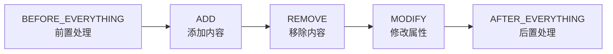
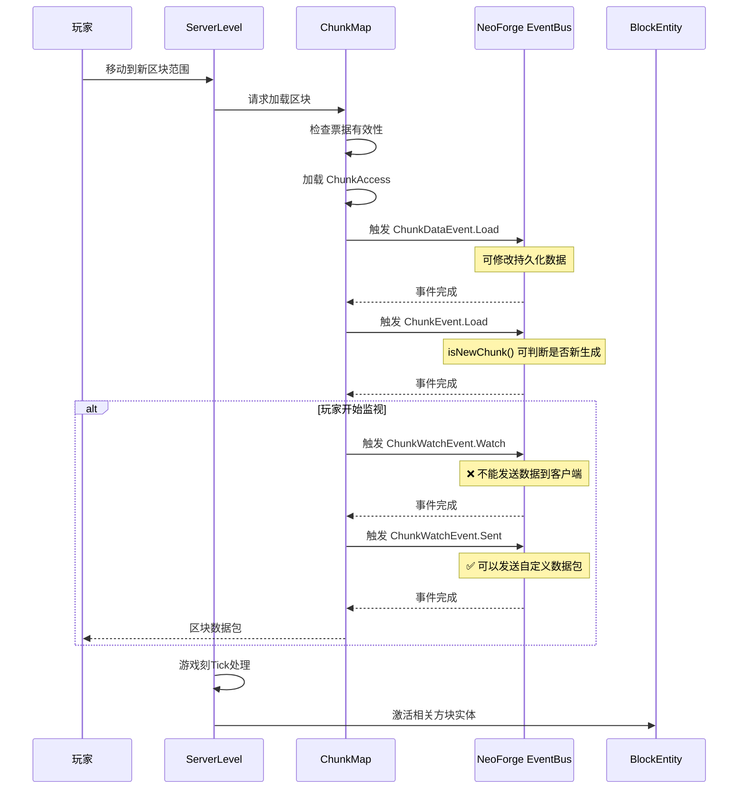
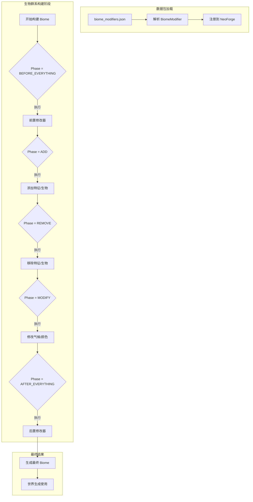

# NeoForge 世界生成与区块系统

## 目录

- [1. 前言](#1-前言)
  - [1.1 本章目标](#11-本章目标)
  - [1.2 前置知识](#12-前置知识)
  - [1.3 关键术语](#13-关键术语)
- [2. 世界事件系统](#2-世界事件系统)
  - [2.1 LevelEvent - 世界事件基类](#21-levelevent---世界事件基类)
  - [2.2 ChunkEvent - 区块事件](#22-chunkevent---区块事件)
  - [2.3 ChunkWatchEvent - 区块监视事件](#23-chunkwatchevent---区块监视事件)
  - [2.4 BlockEvent - 方块事件](#24-blockevent---方块事件)
- [3. 生物群系修改系统](#3-生物群系修改系统)
  - [3.1 BiomeModifier 接口](#31-biomemodifier-接口)
  - [3.2 内置生物群系修改器](#32-内置生物群系修改器)
  - [3.3 Phase 执行顺序](#33-phase-执行顺序)
- [4. 强制区块加载系统](#4-强制区块加载系统)
  - [4.1 ForcedChunkManager 核心机制](#41-forcedchunkmanager-核心机制)
  - [4.2 TicketController 票据控制器](#42-ticketcontroller-票据控制器)
  - [4.3 票据生命周期](#43-票据生命周期)
- [5. 完整示例：注册自定义生物群系](#5-完整示例注册自定义生物群系)
  - [5.1 数据包 JSON 文件](#51-数据包-json-文件)
  - [5.2 编程式创建生物群系](#52-编程式创建生物群系)
  - [5.3 监听区块事件](#53-监听区块事件)
- [6. 工作流程图](#6-工作流程图)
- [7. 课后自查](#7-课后自查)

---

## 1. 前言

### 1.1 本章目标

本章将带你掌握 NeoForge 1.21.x 的世界生成与区块系统。学完本章后，你将能够：

- ✅ 监听和处理各种世界级别的事件（区块加载、方块变化等）
- ✅ 使用 `BiomeModifier` 数据驱动地修改生物群系
- ✅ 实现自定义生物群系的注册和生成
- ✅ 使用 `ForcedChunkManager` 实现区块强制加载
- ✅ 构建一个完整的自定义生物群系模组

### 1.2 前置知识

学习本章前，你应该熟悉：

| 知识领域 | 要求程度 | 参考章节 |
|---------|---------|---------|
| Java 基础 | 掌握 | [Java 基础教程](../part-0-prerequisites/01-java-basics.md) |
| NeoForge 注册系统 | 了解 | [注册系统教程](../part-1-getting-started/02-registry-system.md) |
| 事件总线机制 | 了解 | [事件系统教程](../part-1-getting-started/03-event-system.md) |
| Minecraft 生物群系 | 了解 | [Minecraft Wiki 生物群系](https://minecraft.wiki/w/Biome) |

### 1.3 关键术语

本章涉及的关键术语解释：

| 术语 | 英文 | 解释 |
|-----|------|------|
| **区块** | Chunk | Minecraft 世界的基本存储单元，通常为 16×16×256 的方块柱 |
| **生物群系** | Biome | 具有特定气候、植被和生物的地理区域，如森林、沙漠 |
| **票据** | Ticket | 用于控制区块加载状态的机制 |
| **特征** | Feature | 世界生成的结构，如树木、矿石矿脉 |
| **雕刻器** | Carver | 洞穴和峡谷等空腔的生成器 |

---

## 2. 世界事件系统

NeoForge 提供了丰富的事件系统来拦截世界级别的操作。所有事件都通过 `NeoForge.EVENT_BUS` 分发。

### 2.1 LevelEvent - 世界事件基类

`LevelEvent` 是所有世界相关事件的抽象基类。

```java
public abstract class LevelEvent extends Event {
    private final LevelAccessor level;

    public LevelEvent(LevelAccessor level) {
        this.level = level;
    }

    public LevelAccessor getLevel() {
        return level;
    }
}
```

**常见子类事件：**

| 事件类 | 触发时机 | 可取消 |
|-------|---------|--------|
| `LevelEvent.Load` | 世界加载时 | 否 |
| `LevelEvent.Unload` | 世界卸载时 | 否 |
| `LevelEvent.Save` | 世界保存时 | 否 |
| `LevelEvent.CreateSpawnPosition` | 选择出生位置时 | 是 |
| `LevelEvent.PotentialSpawns` | 计算潜在实体生成时 | 是 |

### 2.2 ChunkEvent - 区块事件

`ChunkEvent` 专门处理区块的生命周期事件，是最常用的世界事件之一。

```java
public abstract class ChunkEvent<T extends ChunkAccess> extends LevelEvent {
    private final T chunk;

    public ChunkEvent(T chunk) {
        super(chunk.getLevel());
        this.chunk = chunk;
    }

    public T getChunk() {
        return chunk;
    }
}
```

**两个重要子类：**

```
┌─────────────────────────────────────────────────────────┐
│                    ChunkEvent<T>                        │
├─────────────────────────────────────────────────────────┤
│  Load extends ChunkEvent<LevelChunk>                     │
│  ├── isNewChunk(): boolean  // 判断是否新生成            │
│  │                                                       │
│  Unload extends ChunkEvent<LevelChunk>                   │
│  └── 在区块保存后、卸载前触发                            │
└─────────────────────────────────────────────────────────┘
```

💡 **提示**：`isNewChunk()` 在客户端始终返回 `false`，因为客户端不会生成区块。

### 2.3 ChunkWatchEvent - 区块监视事件

`ChunkWatchEvent` 处理玩家监视区块的状态变化，**仅在服务器端触发**。

```java
public abstract class ChunkWatchEvent extends Event {
    private final ServerLevel level;
    private final ServerPlayer player;
    private final ChunkPos pos;
}
```

**子类事件：**

| 事件类 | 触发时机 | 注意事项 |
|-------|---------|---------|
| `Watch` | 玩家开始监视区块时 | ❌ 不能向客户端发送数据 |
| `Sent` | 区块数据发送给客户端时 | ✅ 可以安全发送额外数据 |
| `UnWatch` | 玩家停止监视区块时 | 区块可能从未发送到客户端 |

### 2.4 BlockEvent - 方块事件

`BlockEvent` 提供了丰富的方块交互钩子。

```java
public abstract class BlockEvent extends Event {
    private final LevelAccessor level;
    private final BlockPos pos;
    private final BlockState state;
}
```

**常用子类事件：**

| 事件类 | 用途 | 可取消 |
|-------|------|--------|
| `BreakEvent` | 玩家破坏方块 | ✅ |
| `EntityPlaceEvent` | 实体放置方块 | ✅ |
| `NeighborNotifyEvent` | 相邻方块通知更新 | ✅ |
| `FarmlandTrampleEvent` | 耕地被践踏 | ✅ |

---

## 3. 生物群系修改系统

### 3.1 BiomeModifier 接口

`BiomeModifier` 是数据驱动的生物群系修改核心接口，支持通过 JSON 数据包定义修改规则。

```java
public interface BiomeModifier {
    // 内联编解码器，用于数据生成
    Codec<BiomeModifier> DIRECT_CODEC = ...;
    
    // 引用编解码器，用于数据包引用
    Codec<Holder<BiomeModifier>> REFERENCE_CODEC = ...;
    
    /**
     * 修改生物群系信息
     * @param biome   被修改的生物群系（可读取原始数据）
     * @param phase   修改阶段
     * @param builder 可变生物群系信息构建器
     */
    void modify(Holder<Biome> biome, Phase phase, ModifiableBiomeInfo.BiomeInfo.Builder builder);
    
    MapCodec<? extends BiomeModifier> codec();
}
```

### 3.2 内置生物群系修改器

NeoForge 提供了多种内置修改器，开箱即用：

```java
public final class BiomeModifiers {
    // 1. 添加特征到生物群系
    public record AddFeaturesBiomeModifier(
        HolderSet<Biome> biomes,      // 目标生物群系
        HolderSet<PlacedFeature> features,  // 要添加的特征
        Decoration step                // 生成阶段
    ) implements BiomeModifier { ... }

    // 2. 移除特征
    public record RemoveFeaturesBiomeModifier(
        HolderSet<Biome> biomes,
        HolderSet<PlacedFeature> features,
        Set<Decoration> steps
    ) implements BiomeModifier { ... }

    // 3. 添加生物生成
    public record AddSpawnsBiomeModifier(
        HolderSet<Biome> biomes,
        WeightedList<SpawnerData> spawners
    ) implements BiomeModifier { ... }

    // 4. 移除生物生成
    public record RemoveSpawnsBiomeModifier(
        HolderSet<Biome> biomes,
        HolderSet<EntityType<?>> entityTypes
    ) implements BiomeModifier { ... }

    // 5. 添加洞穴雕刻器
    public record AddCarversBiomeModifier(...) { ... }

    // 6. 移除洞穴雕刻器
    public record RemoveCarversBiomeModifier(...) { ... }
}
```

### 3.3 Phase 执行顺序

`BiomeModifier.Phase` 定义了修改的执行顺序：



| Phase | 用途 | 使用场景 |
|-------|------|---------|
| `BEFORE_EVERYTHING` | 前置处理 | 需要在其他修改之前执行的逻辑 |
| `ADD` | 添加内容 | 添加特征、生物、雕刻器 |
| `REMOVE` | 移除内容 | 移除不需要的特征或生物 |
| `MODIFY` | 修改属性 | 修改气候、颜色等属性 |
| `AFTER_EVERYTHING` | 后置处理 | 确保在其他修改之后执行 |

---

## 4. 强制区块加载系统

### 4.1 ForcedChunkManager 核心机制

`ForcedChunkManager` 管理区块强制加载的票据生命周期：

```java
public class ForcedChunkManager {
    private static Map<Identifier, TicketController> controllers = Map.of();
    
    public static synchronized void init() {
        // 通过 RegisterTicketControllersEvent 注册控制器
    }
    
    public static boolean hasForcedChunks(ServerLevel level) {
        TicketStorage data = level.getDataStorage().get(TicketStorage.TYPE);
        return !data.getBlockForcedChunks().isEmpty() || 
               !data.getEntityForcedChunks().isEmpty();
    }
    
    static <T extends Comparable<? super T>> boolean forceChunk(
            ServerLevel level, Identifier id, T owner, 
            int chunkX, int chunkZ, boolean add,
            boolean forceNaturalSpawning, 
            Function<TicketStorage, TicketTracker<T>> ticketGetter) {
        // 核心强制加载逻辑
    }
}
```

### 4.2 TicketController 票据控制器

`TicketController` 是模组注册区块加载票据的入口点：

```java
public record TicketController(Identifier id, @Nullable LoadingValidationCallback callback) {
    public boolean forceChunk(ServerLevel level, BlockPos owner, 
                              int chunkX, int chunkZ, 
                              boolean add, boolean forceNaturalSpawning) {
        return ForcedChunkManager.forceChunk(level, id, owner, 
            chunkX, chunkZ, add, forceNaturalSpawning, 
            TicketStorage::getBlockForcedChunks);
    }
}
```

### 4.3 票据生命周期

```
┌─────────────────────────────────────────────────────────────┐
│                    票据生命周期                              │
├─────────────────────────────────────────────────────────────┤
│  1. 注册阶段                                                │
│     Mod 初始化 → RegisterTicketControllersEvent → 注册控制器 │
│                                                             │
│  2. 激活阶段                                                │
│     forceChunk(true) → 添加票据 → 区块开始加载               │
│                                                             │
│  3. 活跃阶段                                                │
│     区块保持加载 → 支持 Tick 处理 → 自然生成                 │
│                                                             │
│  4. 停用阶段                                                │
│     世界关闭 → 票据停用 → 保存到 level.dat                   │
│                                                             │
│  5. 重新激活阶段                                            │
│     世界加载 → 读取票据 → 验证回调 → 激活票据                │
└─────────────────────────────────────────────────────────────┘
```

---

## 5. 完整示例：注册自定义生物群系

### 5.1 数据包 JSON 文件

首先创建生物群系修改器 JSON 文件：

**文件路径**：`data/mymod/worldgen/biome_modifier/mystic_forest_modifier.json`

```json
{
  "type": "neoforge:add_features",
  "biomes": "#mymod:mystic_forests",
  "features": [
    "mymod:mystic_tree",
    "mymod:magic_crystal_cluster",
    "mymod:glowing_mushroom_patch"
  ],
  "step": "vegetal_decoration"
}
```

### 5.2 编程式创建生物群系

**Java 代码**：`src/main/java/com/mymod/world/ModBiomes.java`

```java
package com.mymod.world;

import com.mojang.datafixers.kinds.App;
import com.mojang.serialization.Codec;
import com.mojang.serialization.codecs.RecordCodecBuilder;
import net.minecraft.core.BlockPos;
import net.minecraft.core.Holder;
import net.minecraft.core.HolderGetter;
import net.minecraft.core.HolderSet;
import net.minecraft.core.Registry;
import net.minecraft.data.worldgen.BootstrapContext;
import net.minecraft.resources.RegistryFileCodec;
import net.minecraft.resources.ResourceKey;
import net.minecraft.resources.ResourceLocation;
import net.minecraft.world.level.biome.Biome;
import net.minecraft.world.level.biome.BiomeGenerationSettings;
import net.minecraft.world.level.biome.BiomeSpecialEffects;
import net.minecraft.world.level.biome.MobSpawnSettings;
import net.minecraft.world.level.levelgen.GenerationStep;
import net.minecraft.world.level.levelgen.placement.PlacedFeature;
import net.neoforged.neoforge.common.world.BiomeModifier;
import net.neoforged.neoforge.common.world.ModifiableBiomeInfo;
import net.neoforged.neoforge.registries.NeoForgeRegistries;

import java.util.List;

public class ModBiomes {
    // 定义生物群系资源键
    public static final ResourceKey<Biome> MYSTIC_FOREST = 
        ResourceKey.create(Registry.BIOME_REGISTRY, 
            new ResourceLocation("mymod", "mystic_forest"));

    // 定义生物群系修改器资源键
    public static final ResourceKey<BiomeModifier> MYSTIC_FOREST_MODIFIER = 
        ResourceKey.create(NeoForgeRegistries.Keys.BIOME_MODIFIERS,
            new ResourceLocation("mymod", "mystic_forest_modifier"));

    // 注册生物群系
    public static void bootstrap(BootstrapContext<Biome> context) {
        HolderGetter<PlacedFeature> placedFeatures = context.lookup(Registry.PLACED_FEATURE_REGISTRY);
        
        // 创建神秘森林生物群系
        context.register(MYSTIC_FOREST, createMysticForest(placedFeatures));
    }

    private static Biome createMysticForest(HolderGetter<PlacedFeature> placedFeatures) {
        // 生物生成设置 - 添加自定义生物
        MobSpawnSettings.Builder spawnBuilder = new MobSpawnSettings.Builder()
            .addSpawn(MobSpawnSettings.SpawnerData.CREATURE,
                new MobSpawnSettings.SpawnerData(
                    net.minecraft.world.entity.EntityType.WOLF, 5, 2, 4))
            .addSpawn(MobSpawnSettings.SpawnerData.CREATURE,
                new MobSpawnSettings.SpawnerData(
                    net.minecraft.world.entity.EntityType.FOX, 3, 2, 4));

        // 生成设置 - 添加特征
        BiomeGenerationSettings.Builder genBuilder = new BiomeGenerationSettings.Builder(placedFeatures)
            .addFeature(GenerationStep.Decoration.VEGETAL_DECORATION, 
                placedFeatures.getOrThrow(ModPlacedFeatures.MYSTIC_TREE_KEY))
            .addFeature(GenerationStep.Decoration.VEGETAL_DECORATION,
                placedFeatures.getOrThrow(ModPlacedFeatures.MAGIC_CRYSTAL_CLUSTER_KEY));

        // 特殊效果 - 自定义氛围
        BiomeSpecialEffects.Builder effectsBuilder = new BiomeSpecialEffects.Builder()
            .fogColor(0x9966CC)      // 紫色雾气
            .waterColor(0x3300CC)   // 深紫蓝色水
            .waterFogColor(0x220088) // 水下雾色
            .skyColor(0x7766AA)      // 紫色天空
            .ambientMoodSound(
                net.minecraft.world.level.biome.AmbientMoodSettings.CaveSound.INSTANCE);

        return new Biome.BiomeBuilder()
            .hasPrecipitation(true)
            .temperature(0.7f)
            .downfall(0.8f)
            .temperatureModifier(Biome.TemperatureModifier.FROZEN)
            .specialEffects(effectsBuilder.build())
            .mobSpawnSettings(spawnBuilder.build())
            .generationSettings(genBuilder.build())
            .build();
    }

    // 创建自定义生物群系修改器（带 Codec）
    public static class MysticForestBiomeModifier implements BiomeModifier {
        public static final MapCodec<MysticForestBiomeModifier> CODEC = RecordCodecBuilder.mapCodec(
            instance -> instance.group(
                BiomeModifier.LIST_CODEC.fieldOf("biomes").forGetter(m -> m.biomes),
                PlacedFeature.LIST_CODEC.fieldOf("features").forGetter(m -> m.features),
                GenerationStep.Decoration.CODEC.listOf().fieldOf("steps").forGetter(m -> m.steps)
            ).apply(instance, MysticForestBiomeModifier::new)
        );

        private final HolderSet<Biome> biomes;
        private final HolderSet<PlacedFeature> features;
        private final List<GenerationStep.Decoration> steps;

        public MysticForestBiomeModifier(HolderSet<Biome> biomes, 
                                         HolderSet<PlacedFeature> features,
                                         List<GenerationStep.Decoration> steps) {
            this.biomes = biomes;
            this.features = features;
            this.steps = steps;
        }

        @Override
        public void modify(Holder<Biome> biome, Phase phase, 
                          ModifiableBiomeInfo.BiomeInfo.Builder builder) {
            if (phase == Phase.ADD && this.biomes.contains(biome)) {
                for (GenerationStep.Decoration step : this.steps) {
                    builder.getGenerationSettings().addFeature(step, this.features);
                }
            }
        }

        @Override
        public MapCodec<? extends BiomeModifier> codec() {
            return CODEC;
        }
    }
}
```

### 5.3 监听区块事件

**事件监听器**：`src/main/java/com/mymod/event/ModWorldEvents.java`

```java
package com.mymod.event;

import com.mymod.block.ModBlocks;
import com.mymod.world.ModBiomes;
import net.minecraft.core.BlockPos;
import net.minecraft.server.level.ServerLevel;
import net.minecraft.world.entity.Entity;
import net.minecraft.world.entity.player.Player;
import net.minecraft.world.level.Level;
import net.minecraft.world.level.block.state.BlockState;
import net.neoforged.bus.api.SubscribeEvent;
import net.neoforged.neoforge.common.NeoForge;
import net.neoforged.neoforge.event.level.BlockEvent;
import net.neoforged.neoforge.event.level.ChunkEvent;
import net.neoforged.neoforge.event.level.ChunkWatchEvent;
import net.neoforged.neoforge.event.level.LevelEvent;
import org.slf4j.Logger;
import org.slf4j.LoggerFactory;

public class ModWorldEvents {
    private static final Logger LOGGER = LoggerFactory.getLogger(ModWorldEvents.class);
    private static final int CRYSTAL_SPAWN_CHANCE = 100; // 1/100

    public static void register() {
        NeoForge.EVENT_BUS.register(ModWorldEvents.class);
        LOGGER.info("世界事件监听器已注册");
    }

    /**
     * 世界加载事件
     */
    @SubscribeEvent
    public static void onWorldLoad(LevelEvent.Load event) {
        Level level = event.getLevel();
        if (!level.isClientSide()) {
            LOGGER.info("服务器世界已加载: {}", level.dimension().location());
        }
    }

    /**
     * 区块加载事件 - 检测新生成的区块
     */
    @SubscribeEvent
    public static void onChunkLoad(ChunkEvent.Load event) {
        if (event.getLevel().isClientSide()) return;
        
        var chunk = event.getChunk();
        var pos = chunk.getPos();
        
        if (event.isNewChunk()) {
            LOGGER.info("新生成的区块: [{}, {}]", pos.x, pos.z);
            handleNewChunkGeneration((ServerLevel) event.getLevel(), chunk);
        } else {
            LOGGER.debug("从磁盘加载的区块: [{}, {}]", pos.x, pos.z);
        }
    }

    /**
     * 区块卸载事件
     */
    @SubscribeEvent
    public static void onChunkUnload(ChunkEvent.Unload event) {
        if (event.getLevel().isClientSide()) return;
        
        var pos = event.getChunk().getPos();
        LOGGER.debug("区块卸载: [{}, {}]", pos.x, pos.z);
    }

    /**
     * 玩家开始监视区块 - 这里不能发送数据包！
     */
    @SubscribeEvent
    public static void onChunkWatch(ChunkWatchEvent.Watch event) {
        Player player = event.getPlayer();
        LOGGER.debug("{} 开始监视区块 [{}, {}]", 
            player.getName().getString(),
            event.getChunk().getPos().x,
            event.getChunk().getPos().z);
    }

    /**
     * 区块数据发送到客户端 - 可以在这里发送额外数据
     */
    @SubscribeEvent
    public static void onChunkSent(ChunkWatchEvent.Sent event) {
        // 可以在此处发送自定义数据包到客户端
        // ExamplePacket.send(event.getPlayer(), event.getChunk());
        LOGGER.debug("区块数据已发送到: {}", event.getPlayer().getName().getString());
    }

    /**
     * 方块破坏事件 - 可取消
     */
    @SubscribeEvent
    public static void onBlockBreak(BlockEvent.BreakEvent event) {
        Player player = event.getPlayer();
        BlockPos pos = event.getPos();
        BlockState state = event.getState();
        
        // 示例：阻止破坏神秘水晶
        if (state.is(ModBlocks.MYSTIC_CRYSTAL.get())) {
            if (!player.hasPermissions(2)) {
                LOGGER.info("玩家 {} 尝试破坏神秘水晶被阻止", player.getName().getString());
                event.setCanceled(true);
            }
        }
    }

    /**
     * 方块放置事件
     */
    @SubscribeEvent
    public static void onBlockPlace(BlockEvent.EntityPlaceEvent event) {
        // 可以在此处验证方块放置是否合法
    }

    /**
     * 处理新生成区块的特殊生成逻辑
     */
    private static void handleNewChunkGeneration(ServerLevel level, var chunk) {
        BlockPos.MutableBlockPos mutable = new BlockPos.MutableBlockPos();
        
        // 遍历区块内的一些随机位置
        for (int i = 0; i < 16; i++) {
            int x = chunk.getPos().getMinBlockX() + level.random.nextInt(16);
            int z = chunk.getPos().getMinBlockZ() + level.random.nextInt(16);
            int y = level.getHeightmapPos(
                net.minecraft.world.level.Heightmap.Types.MOTION_BLOCKING_NO_LEAVES,
                new BlockPos(x, 0, z)
            ).getY();
            
            // 在顶层放置一些草丛
            if (y > 60 && level.random.nextInt(CRYSTAL_SPAWN_CHANCE) == 0) {
                BlockPos crystalPos = new BlockPos(x, y + 1, z);
                if (level.getBlockState(crystalPos).isAir()) {
                    level.setBlock(crystalPos, 
                        ModBlocks.MYSTIC_CRYSTAL.get().defaultBlockState(), 
                        net.minecraft.world.level.block.state.BlockState.BlockStatePairPolicy.DEFAULT);
                }
            }
        }
    }
}
```

---

## 6. 工作流程图

### 区块加载完整流程



### 生物群系修改器执行流程



---

## 7. 课后自查

完成本章学习后，请尝试回答以下问题：

| # | 问题 | 考察点 |
|---|------|--------|
| 1 | `ChunkEvent.Load` 和 `ChunkWatchEvent.Watch` 有何本质区别？ | 区块生命周期 vs 玩家监视 |
| 2 | 如何使用 `TicketController` 为模组注册强制区块加载？ | 票据系统使用 |
| 3 | `BiomeModifier.Phase` 的五个阶段按什么顺序执行？ | 生物群系修改流程 |
| 4 | 为什么 `ChunkWatchEvent.Watch` 不能向客户端发送数据包？ | 事件触发时机 |
| 5 | 如何在模组中创建一个自定义的生物群系？ | 综合应用 |
| 6 | `LoadingValidationCallback` 在票据生命周期中起什么作用？ | 票据持久化 |
| 7 | 数据驱动的生物群系修改与编程式修改各有何优缺点？ | 设计权衡 |

---

**参考答案提示**：

1. `ChunkEvent.Load` 在区块加载到世界时触发（服务器和客户端都会触发），而 `ChunkWatchEvent.Watch` 仅在玩家开始监视区块时触发（仅服务器）
2. 在 `RegisterTicketControllersEvent` 中注册 `TicketController`，然后通过 `controller.forceChunk()` 方法控制区块加载
3. `BEFORE_EVERYTHING` → `ADD` → `REMOVE` → `MODIFY` → `AFTER_EVERYTHING`
4. 因为 `ChunkWatchEvent.Watch` 触发时区块数据还未打包发送给客户端，而 `ChunkWatchEvent.Sent` 触发时数据正在发送
5. 定义 `ResourceKey<Biome>`，在 `BootstrapContext` 中注册，创建 `Biome.Builder` 并配置生成设置和特殊效果
6. 在世界重新加载时验证票据是否仍然有效，可以清理过期的或不存在的票据
7. 数据驱动：可被数据包覆盖、易于非程序员修改；编程式：更灵活、可包含复杂逻辑

---

**延伸阅读**：

- [NeoForge 官方文档 - 生物群系修改](https://docs.neoforged.net/)
- [Minecraft Wiki - 生物群系](https://minecraft.wiki/w/Biome)
- [World Generation Wiki](https://minecraft.wiki/w/World_generation)
