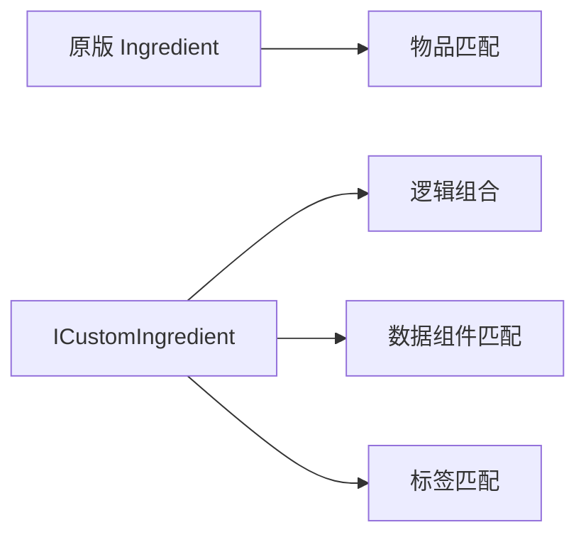
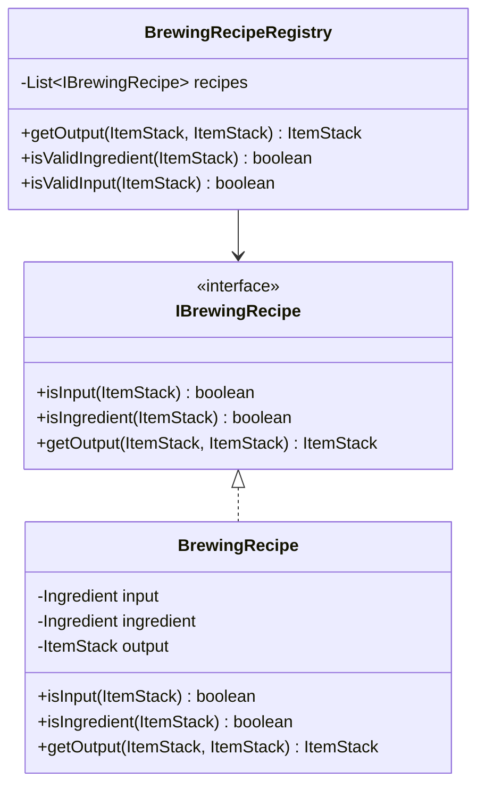
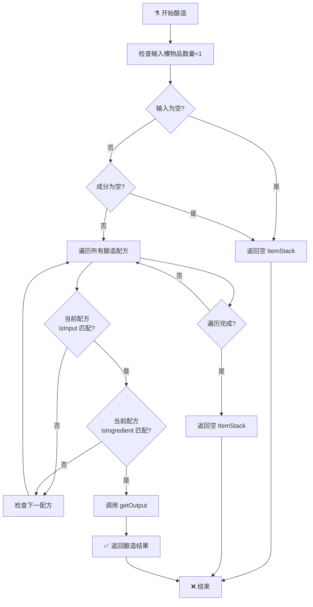
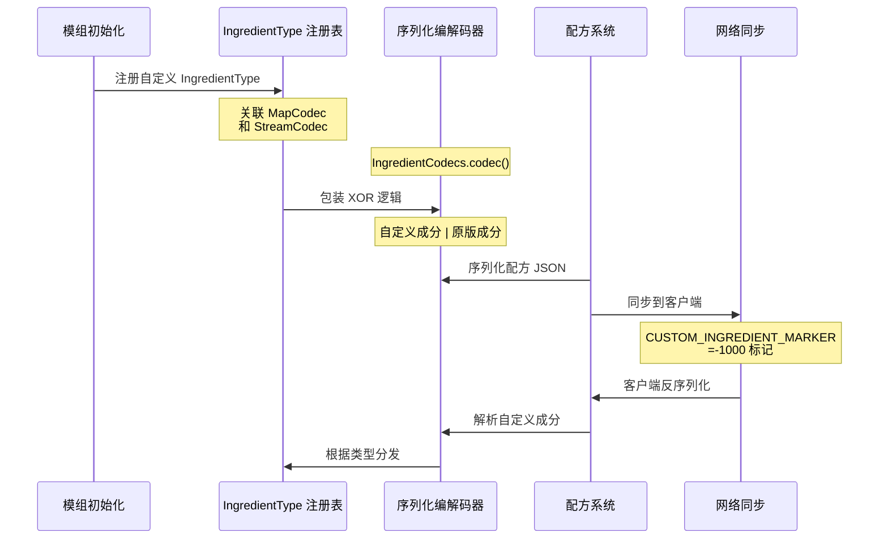
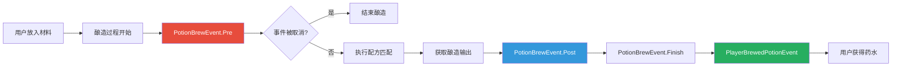

# NeoForge 配方与酿造系统

> **面向读者**：已完成环境搭建和基础 Java 语法的 NeoForge 开发者
>
> **目标**：掌握 NeoForge 配方系统的扩展机制，学会创建自定义酿造配方

> 💡 **前置知识**：建议先阅读 [NeoForge 环境搭建与第一个 Mod](./part-1-getting-started/01-environment-setup.md)，了解 `@Mod` 注解和事件系统基础。

---

## 目标

学完本章后，你将理解：

```
✅ ICustomIngredient 接口与自定义成分类型的创建方法
✅ IngredientType 的序列化编解码器注册机制
✅ 内置自定义成分（组合、交集、差集）的使用场景
✅ SizedIngredient 带数量成分的匹配逻辑
✅ IBrewingRecipe 接口与酿造配方注册
✅ PotionBrewEvent 事件的监听与处理
✅ 创建完整的自定义酿造配方示例
```

---

## 前置知识

```
☕ Java 基础（接口、record 语法、泛型）
📦 DeferredRegister（物品/方块注册）
🎮 Minecraft 物品系统（ItemStack、Ingredient）
🔧 NeoForge 事件总线（@SubscribeEvent）
```

---

## 目录

- [🎯 配方系统概述](#1-配方系统概述)
- [🧪 自定义成分类型（ICustomIngredient）](#2-自定义成分类型icustomingredient)
- [📦 内置自定义成分](#3-内置自定义成分)
- [🔢 SizedIngredient 带数量成分](#4-sizedingredient-带数量成分)
- [⚗️ 酿造系统基础](#5-酿造系统基础)
- [🔧 酿造事件（PotionBrewEvent）](#6-酿造事件potionbrewevent)
- [💻 完整示例：创建自定义酿造配方](#7-完整示例创建自定义酿造配方)
- [📊 系统流程图](#8-系统流程图)
- [📝 课后自查](#9-课后自查)

---

## 1. 配方系统概述

### 1.1 什么是自定义成分？

> **Ingredient（成分）** 是 Minecraft 配方系统中用于表示"需要什么物品"的机制。原版 `Ingredient` 只支持简单的物品匹配，无法表达"钻石或绿宝石"、"带有附魔的钻石剑"等复杂逻辑。

NeoForge 通过 **`ICustomIngredient`** 接口扩展了这一能力：



### 1.2 核心组件关系

```
┌─────────────────────────────────────────────────────────────┐
│                      配方系统架构                           │
├─────────────────────────────────────────────────────────────┤
│                                                             │
│  ICustomIngredient                                          │
│  ├── test(ItemStack)     → 核心匹配逻辑                    │
│  ├── items()             → 返回可能的物品列表                │
│  ├── isSimple()          → 是否忽略 NBT 数据               │
│  └── getType()           → 返回注册的成分类型              │
│                                                             │
│  IngredientType<T>                                          │
│  ├── MapCodec<T>          → JSON 序列化                    │
│  └── StreamCodec          → 网络传输编码                   │
│                                                             │
│  注册表                                                       │
│  NeoForgeRegistries.Keys.INGREDIENT_TYPES                  │
│                                                             │
└─────────────────────────────────────────────────────────────┘
```

---

## 2. 自定义成分类型（ICustomIngredient）

### 2.1 接口定义

`ICustomIngredient` 是 NeoForge 配方系统的核心接口：

```java
package net.neoforged.neoforge.common.crafting;

public interface ICustomIngredient {
    /**
     * 检查物品堆栈是否符合此成分
     * @param stack 要检查的物品堆栈
     * @return 是否匹配
     */
    boolean test(ItemStack stack);

    /**
     * 返回此成分接受的所有物品
     * 至少返回一个物品，否则配方无效
     */
    Stream<Holder<Item>> items();

    /**
     * 判断是否需要直接测试物品堆栈
     * 返回 true 时可优化匹配性能（忽略 NBT）
     */
    boolean isSimple();

    /**
     * 获取成分类型（需注册到 INGREDIENT_TYPES）
     */
    IngredientType<?> getType();

    /**
     * 获取显示信息（可选）
     */
    default SlotDisplay display() {
        return new SlotDisplay() {};
    }

    /**
     * 转换为原版 Ingredient
     */
    default Ingredient toVanilla() {
        return new Ingredient(this);
    }
}
```

### 2.2 创建自定义成分

假设我们需要创建一个"耐久度足够"的成分，只匹配耐久度高于指定值的物品：

```java
package com.example.mymod.crafting;

import com.google.common.collect.Streams;
import net.minecraft.core.Holder;
import net.minecraft.network.RegistryFriendlyByteBuf;
import net.minecraft.network.codec.StreamCodec;
import net.minecraft.world.item.Item;
import net.minecraft.world.item.ItemStack;
import net.neoforged.neoforge.common.crafting.ICustomIngredient;
import net.neoforged.neoforge.common.crafting.IngredientType;

import java.util.stream.Stream;

public class DurabilityIngredient implements ICustomIngredient {
    // 定义成分类型的编解码器
    public static final MapCodec<DurabilityIngredient> CODEC = RecordCodecBuilder.mapCodec(instance ->
        instance.group(
            ExtraCodecs.POSITIVE_INT.fieldOf("min_durability").forGetter(DurabilityIngredient::getMinDurability)
        ).apply(instance, DurabilityIngredient::new)
    );

    public static final StreamCodec<RegistryFriendlyByteBuf, DurabilityIngredient> STREAM_CODEC =
        StreamCodec.of(DurabilityIngredient::write, DurabilityIngredient::read);

    public static final IngredientType<DurabilityIngredient> TYPE =
        new IngredientType<>(CODEC, STREAM_CODEC);

    private final int minDurability;

    private DurabilityIngredient(int minDurability) {
        this.minDurability = minDurability;
    }

    public int getMinDurability() {
        return minDurability;
    }

    @Override
    public boolean test(ItemStack stack) {
        // 检查是否是可损坏物品，且剩余耐久 >= 最小值
        if (!stack.isDamageableItem()) {
            return false;
        }
        int remaining = stack.getMaxDamage() - stack.getDamage();
        return remaining >= minDurability;
    }

    @Override
    public Stream<Holder<Item>> items() {
        // 返回所有可损坏物品（保守估计）
        // 实际应用中可以通过更精确的过滤
        return Stream.empty(); // 空流表示需要动态检查
    }

    @Override
    public boolean isSimple() {
        return false; // 需要检查耐久度，不能简化
    }

    @Override
    public IngredientType<?> getType() {
        return TYPE;
    }

    private void write(RegistryFriendlyByteBuf buffer) {
        buffer.writeVarInt(minDurability);
    }

    private static DurabilityIngredient read(RegistryFriendlyByteBuf buffer) {
        return new DurabilityIngredient(buffer.readVarInt());
    }

    // 便捷工厂方法
    public static Ingredient of(int minDurability) {
        return new DurabilityIngredient(minDurability).toVanilla();
    }
}
```

### 2.3 注册成分类型

在 Mod 初始化时注册成分类型：

```java
package com.example.mymod;

import com.example.mymod.crafting.DurabilityIngredient;
import net.neoforged.bus.api.SubscribeEvent;
import net.neoforged.fml.common.Mod;
import net.neoforged.neoforge.event.OnRegistersEvent;
import net.neoforged.neoforge.registries.NeoForgeRegistries;

@Mod(ExampleMod.MOD_ID)
public class ExampleMod {
    public static final String MOD_ID = "mymod";

    @SubscribeEvent
    public static void registerIngredientTypes(OnRegistersEvent event) {
        // 注册自定义成分类型
        event.register(NeoForgeRegistries.Keys.INGREDIENT_TYPES,
            helper -> helper.register(DurabilityIngredient.TYPE, "durability")
        );
    }
}
```

### 2.4 在 JSON 配方中使用

注册后，可以在数据包中使用自定义成分：

```json
{
  "type": "minecraft:crafting_shaped",
  "pattern": [
    " D ",
    "DBD",
    " D "
  ],
  "key": {
    "D": {
      "type": "mymod:durability",
      "min_durability": 100
    },
    "B": {
      "item": "minecraft:diamond_block"
    }
  },
  "result": {
    "item": "minecraft:diamond"
  }
}
```

---

## 3. 内置自定义成分

NeoForge 提供了多种开箱即用的自定义成分，无需手动注册。

### 3.1 成分类型对比

| 类型 | 用途 | JSON type | 代码创建 |
|------|------|------------|----------|
| **CompoundIngredient** | 逻辑"或" | `neoforge:compound` | `Ingredient.or()` |
| **IntersectionIngredient** | 逻辑"与" | `neoforge:intersection` | `Ingredient.and()` |
| **DifferenceIngredient** | 逻辑"差" | `neoforge:difference` | `Ingredient.except()` |
| **BlockTagIngredient** | 方块标签 | `neoforge:block_tag` | 内部使用 |
| **DataComponentIngredient** | 组件匹配 | `neoforge:data_component` | `Ingredient.of()` |

### 3.2 CompoundIngredient（组合成分）

匹配**任一**子成分匹配的物品：

```
┌─────────────────────────────────────┐
│  CompoundIngredient (钻石 OR 绿宝石)  │
├─────────────────────────────────────┤
│  钻石  ✅ → 匹配                    │
│  绿宝石  ✅ → 匹配                  │
│  铁锭   ❌ → 不匹配                 │
└─────────────────────────────────────┘
```

```java
// 代码创建
Ingredient diamondOrEmerald = Ingredient.or(
    Items.DIAMOND,
    Items.EMERALD
);

// 等价于
Ingredient diamondOrEmerald = CompoundIngredient.of(
    Ingredient.of(Items.DIAMOND),
    Ingredient.of(Items.EMERALD)
).toVanilla();
```

```json
{
  "type": "neoforge:compound",
  "children": [
    { "item": "minecraft:diamond" },
    { "item": "minecraft:emerald" }
  ]
}
```

### 3.3 IntersectionIngredient（交集成分）

匹配**所有**子成分都匹配的物品：

```
┌─────────────────────────────────────┐
│  IntersectionIngredient              │
│  (带锋利附魔 AND 钻石剑)              │
├─────────────────────────────────────┤
│  带锋利附魔的钻石剑  ✅ → 匹配        │
│  无附魔的钻石剑      ❌ → 不匹配      │
│  铁剑（任何状态）    ❌ → 不匹配      │
└─────────────────────────────────────┘
```

```java
// 匹配同时满足多个条件的物品
Ingredient enchantedDiamondSword = Ingredient.of(true,
    Map.of(DataComponents.ENCHANTMENTS, EnchantmentHelper.enchantmentContentsPredicate(
        new EnchantmentInstance(Enchantments.SHARPNESS, 1)
    )),
    Items.DIAMOND_SWORD
);
```

### 3.4 DifferenceIngredient（差集成分）

匹配第一个成分中**排除**第二个成分的物品：

```
┌─────────────────────────────────────┐
│  DifferenceIngredient                │
│  (所有木头 EXCEPT 白桦木)             │
├─────────────────────────────────────┤
│  橡木木板  ✅ → 匹配                │
│  云杉木板  ✅ → 匹配                │
│  白桦木木板 ❌ → 不匹配（被排除）    │
└─────────────────────────────────────┘
```

```java
// 代码创建：所有木头方块，但排除白桦木
Ingredient allWoodExceptBirch = Ingredient.of(Blocks.OAK_PLANKS)
    .except(Blocks.BIRCH_PLANKS);

// 等价于
Ingredient allWoodExceptBirch = DifferenceIngredient.of(
    Ingredient.of(Blocks.OAK_PLANKS),
    Ingredient.of(Blocks.BIRCH_PLANKS)
).toVanilla();
```

```json
{
  "type": "neoforge:difference",
  "base": { "tag": "minecraft:planks" },
  "subtracted": { "tag": "minecraft:birch_planks" }
}
```

### 3.5 DataComponentIngredient（数据组件成分）

支持**精确数据组件匹配**的成分：

```java
// 匹配带有附魔光效的剑（非严格模式）
Ingredient enchantedSword = Ingredient.of(
    false,  // strict = false：只需包含指定组件
    Map.of(DataComponents.ENCHANTMENTS, 
           DataComponentExactPredicate.allOf(Map.of())),
    Items.DIAMOND_SWORD
);

// 匹配特定药水的药水瓶（严格模式）
Ingredient awkwardPotion = Ingredient.of(
    true,   // strict = true：必须完全匹配
    Map.of(DataComponents.POTION_CONTENTS, 
           new PotionContents(Potions.AWKWARD, Optional.empty(), Optional.empty(), List.of())),
    Items.POTION
);
```

```json
{
  "type": "neoforge:data_component",
  "items": ["minecraft:diamond_sword"],
  "components": {
    "minecraft:enchantments": {
      "levels": { "minecraft:sharpness": 1 }
    }
  },
  "strict": false
}
```

---

## 4. SizedIngredient 带数量成分

### 4.1 问题背景

原版 `Ingredient` 不检查物品数量，只检查物品类型：

```
原版 Ingredient.test() 行为：
┌─────────────────────────────────────┐
│  配方需要 3 个钻石                    │
│  玩家背包有 1 个钻石  → ❌ 配方不显示  │
│  玩家背包有 3 个钻石  → ✅ 配方显示   │
│  玩家背包有 5 个钻石  → ✅ 配方显示   │
│                                     │
│  实际扣取时：只扣 1 个！              │
└─────────────────────────────────────┘
```

### 4.2 SizedIngredient 解决方案

```java
package net.neoforged.neoforge.common.crafting;

public final class SizedIngredient {
    private final Ingredient ingredient;
    private final int count;

    /**
     * 检查堆栈是否符合成分且数量足够
     */
    public boolean test(ItemStack stack) {
        return ingredient.test(stack) && stack.getCount() >= count;
    }

    public static SizedIngredient of(ItemLike item, int count) {
        return new SizedIngredient(Ingredient.of(item), count);
    }
}
```

### 4.3 使用示例

```java
// 创建需要 3 个钻石的成分
SizedIngredient threeDiamonds = SizedIngredient.of(Items.DIAMOND, 3);

// 在配方中使用
public static final RecipeType<CustomRecipe> CUSTOM_CRAFTING = 
    RecipeType.register("mymod:custom_crafting");

// 检查物品是否满足配方要求
public boolean matches(Container container) {
    ItemStack stack = container.getItem(0); // 第一个格子
    return threeDiamonds.test(stack);
}
```

```json
{
  "type": "mymod:custom_crafting",
  "ingredients": [
    {
      "ingredient": { "item": "minecraft:diamond" },
      "count": 3
    }
  ],
  "result": {
    "item": "minecraft:diamond_block"
  }
}
```

---

## 5. 酿造系统基础

### 5.1 核心接口

NeoForge 酿造系统围绕 `IBrewingRecipe` 接口构建：



### 5.2 IBrewingRecipe 接口

```java
package net.neoforged.neoforge.common.brewing;

public interface IBrewingRecipe {
    /**
     * 判断是否为有效输入（下层槽位，如水瓶）
     * @param input 输入槽位的物品堆栈
     * @return 是否是有效的酿造输入
     */
    boolean isInput(ItemStack input);

    /**
     * 判断是否为有效成分（上层槽位，如地狱疣）
     * @param ingredient 成分槽位的物品堆栈
     * @return 是否是有效的酿造成分
     */
    boolean isIngredient(ItemStack ingredient);

    /**
     * 获取酿造输出
     * @param input 输入物品（如水瓶）
     * @param ingredient 成分物品（如地狱疣）
     * @return 酿造结果，如果配方不匹配则返回空堆栈
     */
    ItemStack getOutput(ItemStack input, ItemStack ingredient);
}
```

### 5.3 BrewingRecipe 便捷实现

```java
package net.neoforged.neoforge.common.brewing;

public class BrewingRecipe implements IBrewingRecipe {
    private final Ingredient input;      // 输入（如药水瓶）
    private final Ingredient ingredient;   // 成分（如烈焰粉）
    private final ItemStack output;       // 输出（如力量药水）

    public BrewingRecipe(Ingredient input, Ingredient ingredient, ItemStack output) {
        this.input = input;
        this.ingredient = ingredient;
        this.output = output;
    }

    @Override
    public boolean isInput(ItemStack stack) {
        return this.input.test(stack);
    }

    @Override
    public boolean isIngredient(ItemStack stack) {
        return this.ingredient.test(stack);
    }

    @Override
    public ItemStack getOutput(ItemStack input, ItemStack ingredient) {
        if (isInput(input) && isIngredient(ingredient)) {
            return getOutput().copy();
        }
        return ItemStack.EMPTY;
    }

    public ItemStack getOutput() {
        return output;
    }
}
```

### 5.4 注册酿造配方

使用 `RegisterBrewingRecipesEvent` 注册自定义酿造配方：

```java
package com.example.mymod.brewing;

import com.example.mymod.items.ModItems;
import com.example.mymod.potions.ModPotions;
import net.minecraft.world.item.ItemStack;
import net.minecraft.world.item.Items;
import net.minecraft.world.item.alchemy.PotionUtils;
import net.neoforged.bus.api.SubscribeEvent;
import net.neoforged.neoforge.common.brewing.BrewingRecipe;
import net.neoforged.neoforge.event.brewing.RegisterBrewingRecipesEvent;

public class ModBrewingRecipes {

    @SubscribeEvent
    public static void registerBrewingRecipes(RegisterBrewingRecipesEvent event) {
        var builder = event.getBuilder();

        // 示例 1：从普通药水酿造
        // 输入：虚弱药水 + 发酵蛛眼 = 隐身药水
        builder.addRecipe(new BrewingRecipe(
            Ingredient.of(PotionUtils.setPotion(new ItemStack(Items.POTION), 
                Potions.WEAKNESS)),
            Ingredient.of(Items.FERMENTED_SPIDER_EYE),
            PotionUtils.setPotion(new ItemStack(Items.POTION), Potions.INVISIBILITY)
        ));

        // 示例 2：使用自定义物品作为成分
        // 输入：虚弱药水 + 自定义"魔粉" = 自定义药水效果
        builder.addRecipe(new BrewingRecipe(
            Ingredient.of(PotionUtils.setPotion(new ItemStack(Items.POTION), 
                Potions.WEAKNESS)),
            Ingredient.of(ModItems.MAGIC_DUST.get()),
            PotionUtils.setPotion(new ItemStack(Items.POTION), 
                ModPotions.MAGIC_EFFECT.get())
        ));
    }
}
```

---

## 6. 酿造事件（PotionBrewEvent）

### 6.1 事件类型

```
PotionBrewEvent 事件层级：
┌─────────────────────────────────────────────┐
│                  Event                       │
│                      │                        │
│              PotionBrewEvent                 │
│                      │                        │
│          ┌───────────┴───────────┐          │
│    PotionBrewEvent.Pre        PotionBrewEvent.Post │
│    (可取消，可修改结果)       (仅通知，不可取消)   │
└─────────────────────────────────────────────┘

PlayerBrewedPotionEvent
  → 玩家从酿造台拿起药水时触发
```

### 6.2 PotionBrewEvent.Pre（酿造前事件）

可以取消酿造过程，或修改酿造输入：

```java
package com.example.mymod.events;

import net.minecraft.world.item.ItemStack;
import net.minecraft.world.item.Items;
import net.neoforged.bus.api.SubscribeEvent;
import net.neoforged.neoforge.event.brewing.PotionBrewEvent;

public class BrewingEventHandlers {

    @SubscribeEvent
    public static void onBrewingPre(PotionBrewEvent.Pre event) {
        // 获取酿造台的三个槽位
        ItemStack slot0 = event.getItem(0); // 左槽
        ItemStack slot1 = event.getItem(1); // 中槽
        ItemStack slot2 = event.getItem(2); // 右槽

        // 示例：阻止酿造虚弱药水（mod 平衡性考虑）
        if (slot0.is(Items.POTION) && 
            PotionUtils.getPotion(slot0).is(Potions.WEAKNESS)) {
            event.setCanceled(true);
            return;
        }

        // 示例：修改酿造结果
        // 将普通治疗药水变成治疗药水（去除 1 秒延迟）
        if (slot0.is(Items.POTION)) {
            var potion = PotionUtils.getPotion(slot0);
            if (potion.is(Potions.HEAL)) {
                ItemStack newPotion = PotionUtils.setPotion(
                    slot0.copy(), 
                    Potions.HEALING  // 使用 INSTANT_HEAL
                );
                event.setItem(0, newPotion);
            }
        }
    }
}
```

### 6.3 PotionBrewEvent.Post（酿造后事件）

用于记录、播放声音等后续处理：

```java
@SubscribeEvent
public static void onBrewingPost(PotionBrewEvent.Post event) {
    ItemStack result = event.getItem(0);

    if (!result.isEmpty()) {
        // 示例：播放自定义音效
        // Minecraft.getInstance().player.playSound(
        //     ModSounds.BREWING_COMPLETE.get(), 1.0f, 1.0f);

        // 示例：给予玩家经验
        // Minecraft.getInstance().player.giveExperiencePoints(5);
    }
}
```

### 6.4 PlayerBrewedPotionEvent（玩家完成酿造）

玩家从酿造台拿起药水时触发：

```java
@SubscribeEvent
public static void onPlayerBrewedPotion(PlayerBrewedPotionEvent event) {
    Player player = event.getPlayer();
    ItemStack potion = event.getStack();

    // 示例：给予玩家经验奖励
    player.giveExperiencePoints(10);

    // 示例：发送消息
    player.sendSystemMessage(Component.literal("药水酿造完成！"));

    // 示例：给予额外物品奖励
    if (PotionUtils.getPotion(potion).is(ModPotions.MAGIC_EFFECT.get())) {
        ItemStack bonus = new ItemStack(ModItems.MAGIC_ESSENCE.get());
        player.getInventory().add(bonus);
    }
}
```

---

## 7. 完整示例：创建自定义酿造配方

### 7.1 项目结构

```
src/main/java/com/example/mymod/
├── ExampleMod.java
├── items/
│   └── ModItems.java
├── potions/
│   └── ModPotions.java
├── brewing/
│   ├── ModBrewingRecipes.java
│   └── MagicBrewingRecipe.java
└── events/
    └── BrewingEventHandlers.java
```

### 7.2 定义自定义药水

```java
// ModPotions.java
package com.example.mymod.potions;

import net.minecraft.core.registries.Registries;
import net.minecraft.world.effect.MobEffect;
import net.minecraft.world.effect.MobEffectInstance;
import net.minecraft.world.effect.MobEffects;
import net.minecraft.world.item.alchemy.Potion;
import net.neoforged.bus.api.SubscribeEvent;
import net.neoforged.fml.common.Mod;
import net.neoforged.neoforge.registries.DeferredHolder;
import net.neoforged.neoforge.registries.DeferredRegister;

import static com.example.mymod.ExampleMod.MOD_ID;

public class ModPotions {
    // 创建延迟注册器
    public static final DeferredRegister<Potion> POTIONS = 
        DeferredRegister.create(Registries.POTION, MOD_ID);

    // 注册自定义药水
    public static final DeferredHolder<Potion, Potion> MAGIC_EFFECT = POTIONS.register(
        "magic_effect",
        () -> new Potion(new MobEffectInstance(MobEffects.GLOWING, 600, 0))
    );

    public static final DeferredHolder<Potion, Potion> ULTIMATE_EFFECT = POTIONS.register(
        "ultimate_effect",
        () -> new Potion(
            new MobEffectInstance(MobEffects.STRENGTH, 480, 2),
            new MobEffectInstance(MobEffects.SPEED, 480, 1),
            new MobEffectInstance(MobEffects.JUMP_BOOST, 480, 0)
        )
    );
}
```

### 7.3 定义自定义物品

```java
// ModItems.java
package com.example.mymod.items;

import net.minecraft.core.registries.Registries;
import net.minecraft.world.item.Item;
import net.neoforged.bus.api.SubscribeEvent;
import net.neoforged.fml.common.Mod;
import net.neoforged.neoforge.registries.DeferredHolder;
import net.neoforged.neoforge.registries.DeferredRegister;

import static com.example.mymod.ExampleMod.MOD_ID;

public class ModItems {
    public static final DeferredRegister<Item> ITEMS = 
        DeferredRegister.create(Registries.ITEM, MOD_ID);

    // 魔粉 - 酿造成分
    public static final DeferredHolder<Item, Item> MAGIC_DUST = ITEMS.register(
        "magic_dust",
        () -> new Item(Item.Properties.stacksTo(64))
    );

    // 魔法精华 - 高级酿造成分
    public static final DeferredHolder<Item, Item> MAGIC_ESSENCE = ITEMS.register(
        "magic_essence",
        () -> new Item(Item.Properties.stacksTo(32))
    );

    // 附魔瓶 - 特殊酿造原料
    public static final DeferredHolder<Item, Item> ENCHANTED_BOTTLE = ITEMS.register(
        "enchanted_bottle",
        () -> new Item(Item.Properties.stacksTo(16))
    );
}
```

### 7.4 创建自定义酿造配方类

```java
// MagicBrewingRecipe.java
package com.example.mymod.brewing;

import com.example.mymod.items.ModItems;
import com.example.mymod.potions.ModPotions;
import net.minecraft.core.component.DataComponents;
import net.minecraft.world.item.ItemStack;
import net.minecraft.world.item.Items;
import net.minecraft.world.item.alchemy.PotionContents;
import net.minecraft.world.item.alchemy.Potions;
import net.minecraft.world.item.components.DataComponentTypes;
import net.minecraft.world.item.components.EnchantableComponent;
import net.minecraft.world.item.enchantment.Enchantments;
import net.neoforged.neoforge.common.brewing.IBrewingRecipe;

import java.util.Optional;

public class MagicBrewingRecipe implements IBrewingRecipe {
    // 配方 1：普通药水 + 魔粉 = 魔法药水
    private static final IBrewingRecipe MAGIC_DUST_RECIPE = new SimpleBrewingRecipe(
        Potions.AWKWARD,
        ModItems.MAGIC_DUST.get(),
        ModPotions.MAGIC_EFFECT.get()
    );

    // 配方 2：魔法药水 + 魔法精华 = 终极药水
    private static final IBrewingRecipe ULTIMATE_RECIPE = new SimpleBrewingRecipe(
        ModPotions.MAGIC_EFFECT.get(),
        ModItems.MAGIC_ESSENCE.get(),
        ModPotions.ULTIMATE_EFFECT.get()
    );

    // 配方 3：附魔剑 + 药水 = 附魔药水（特殊逻辑）
    private static final IBrewingRecipe ENCHANTED_BOTTLE_RECIPE = new IBrewingRecipe() {
        @Override
        public boolean isInput(ItemStack stack) {
            return stack.is(Items.POTION) && 
                   PotionContents.EMPTY.equals(
                       stack.getOrDefault(DataComponents.POTION_CONTENTS, PotionContents.EMPTY)
                   );
        }

        @Override
        public boolean isIngredient(ItemStack stack) {
            return stack.is(ModItems.ENCHANTED_BOTTLE.get());
        }

        @Override
        public ItemStack getOutput(ItemStack input, ItemStack ingredient) {
            if (!isInput(input) || !isIngredient(ingredient)) {
                return ItemStack.EMPTY;
            }

            // 从附魔瓶中提取附魔信息
            var enchantments = ingredient.get(DataComponentTypes.ENCHANTMENTS);
            if (enchantments == null || enchantments.enchantments().isEmpty()) {
                return ItemStack.EMPTY;
            }

            // 创建新的药水并附加附魔
            ItemStack result = new ItemStack(Items.POTION);
            PotionContents potionContents = new PotionContents(
                Potions.WATER,
                Optional.empty(),
                Optional.empty(),
                List.of()
            );
            result.set(DataComponents.POTION_CONTENTS, potionContents);
            
            // 将附魔转移给药水瓶
            result.set(DataComponentTypes.ENCHANTMENTS, enchantments);
            
            return result;
        }
    };

    @Override
    public boolean isInput(ItemStack stack) {
        return MAGIC_DUST_RECIPE.isInput(stack) ||
               ULTIMATE_RECIPE.isInput(stack) ||
               ENCHANTED_BOTTLE_RECIPE.isInput(stack);
    }

    @Override
    public boolean isIngredient(ItemStack stack) {
        return MAGIC_DUST_RECIPE.isIngredient(stack) ||
               ULTIMATE_RECIPE.isIngredient(stack) ||
               ENCHANTED_BOTTLE_RECIPE.isIngredient(stack);
    }

    @Override
    public ItemStack getOutput(ItemStack input, ItemStack ingredient) {
        ItemStack output = MAGIC_DUST_RECIPE.getOutput(input, ingredient);
        if (!output.isEmpty()) return output;

        output = ULTIMATE_RECIPE.getOutput(input, ingredient);
        if (!output.isEmpty()) return output;

        return ENCHANTED_BOTTLE_RECIPE.getOutput(input, ingredient);
    }

    // 简单酿造配方辅助类
    private static class SimpleBrewingRecipe implements IBrewingRecipe {
        private final Potion inputPotion;
        private final Item ingredient;
        private final Potion outputPotion;

        SimpleBrewingRecipe(Potion inputPotion, Item ingredient, Potion outputPotion) {
            this.inputPotion = inputPotion;
            this.ingredient = ingredient;
            this.outputPotion = outputPotion;
        }

        @Override
        public boolean isInput(ItemStack stack) {
            if (!stack.is(Items.POTION)) return false;
            var potion = stack.getOrDefault(DataComponents.POTION_CONTENTS, PotionContents.EMPTY);
            return potion.potion().is(inputPotion);
        }

        @Override
        public boolean isIngredient(ItemStack stack) {
            return stack.is(ingredient);
        }

        @Override
        public ItemStack getOutput(ItemStack input, ItemStack ingredient) {
            if (!isInput(input) || !isIngredient(ingredient)) {
                return ItemStack.EMPTY;
            }
            return net.minecraft.world.item.alchemy.PotionUtils.setPotion(
                new ItemStack(Items.POTION),
                outputPotion
            );
        }
    }
}
```

### 7.5 注册酿造配方和事件

```java
// ModBrewingRecipes.java
package com.example.mymod.brewing;

import com.example.mymod.events.BrewingEventHandlers;
import net.neoforged.bus.api.SubscribeEvent;
import net.neoforged.neoforge.event.brewing.RegisterBrewingRecipesEvent;

public class ModBrewingRecipes {

    @SubscribeEvent
    public static void registerBrewingRecipes(RegisterBrewingRecipesEvent event) {
        // 注册自定义酿造配方
        event.getBuilder().addRecipe(new MagicBrewingRecipe());
    }
}
```

```java
// ExampleMod.java
package com.example.mymod;

import com.example.mymod.brewing.ModBrewingRecipes;
import com.example.mymod.items.ModItems;
import com.example.mymod.potions.ModPotions;
import net.neoforged.bus.api.SubscribeEvent;
import net.neoforged.fml.common.Mod;
import net.neoforged.neoforge.event.brewing.RegisterBrewingRecipesEvent;
import org.slf4j.Logger;
import org.slf4j.LoggerFactory;

@Mod(ExampleMod.MOD_ID)
public class ExampleMod {
    public static final String MOD_ID = "mymod";
    public static final Logger LOGGER = LoggerFactory.getLogger("MyMod");

    public ExampleMod() {
        // 注册物品
        ModItems.ITEMS.registerEventListeners(this);
        // 注册药水
        ModPotions.POTIONS.registerEventListeners(this);
    }

    @SubscribeEvent
    public static void registerBrewing(RegisterBrewingRecipesEvent event) {
        ModBrewingRecipes.registerBrewingRecipes(event);
        LOGGER.info("自定义酿造配方注册完成！");
    }

    @SubscribeEvent
    public static void registerBrewingEvents(net.neoforged.neoforge.event.brewing.PotionBrewEvent.Pre event) {
        BrewingEventHandlers.onBrewingPre(event);
    }

    @SubscribeEvent
    public static void registerBrewingPostEvents(net.neoforged.neoforge.event.brewing.PotionBrewEvent.Post event) {
        BrewingEventHandlers.onBrewingPost(event);
    }
}
```

### 7.6 资源文件

**`resources/assets/mymod/lang/zh_cn.json`：**

```json
{
  "item.mymod.magic_dust": "魔粉",
  "item.mymod.magic_essence": "魔法精华",
  "item.mymod.enchanted_bottle": "附魔瓶",
  "effect.mymod.magic_effect": "魔法光环",
  "effect.mymod.ultimate_effect": "终极力量",
  "potion.effect.mymod.magic_effect": "魔法药水",
  "potion.effect.mymod.ultimate_effect": "终极药水",
  "itemGroup.mymod": "我的模组"
}
```

---

## 8. 系统流程图

### 8.1 酿造配方匹配流程



### 8.2 自定义成分注册与使用流程



### 8.3 酿造事件触发时机



---

## 9. 课后自查

```
□ 1. 能否说出 ICustomIngredient 接口中 test() 和 isSimple() 方法的作用？
□ 2. IngredientType 中的 MapCodec 和 StreamCodec 分别用于什么场景？
□ 3. CompoundIngredient、IntersectionIngredient、DifferenceIngredient 
     三种内置成分的逻辑关系是什么？
□ 4. SizedIngredient 解决了原版 Ingredient 的什么问题？
□ 5. 如何监听 PotionBrewEvent.Pre 事件来阻止或修改酿造结果？
□ 6. 在 RegisterBrewingRecipesEvent 中注册配方和使用事件拦截有什么区别？
```

---

## 相关链接

| 内容 | 链接 |
|------|------|
| NeoForge 官方文档 | https://docs.neoforged.net/ |
| 配方系统分析 | [配方与酿造系统分析](../analysis/13-recipe-brewing-system.md) |
| NeoForge 源码 | `D:\Minecraft-Learning\assets\NeoForge-1.21.x\src\main\java\net\neoforged\neoforge\common\crafting\` |
| 酿造系统源码 | `D:\Minecraft-Learning\assets\NeoForge-1.21.x\src\main\java\net\neoforged\neoforge\common\brewing\` |

---

> **下一章预告**：[NeoForge 数据生成系统](./part-5-data/01-data-generation.md) - 学习使用 DataGenerator 自动生成物品标签、配方、LootTable 等数据文件

---

*文档更新时间: 2026-03-24*
