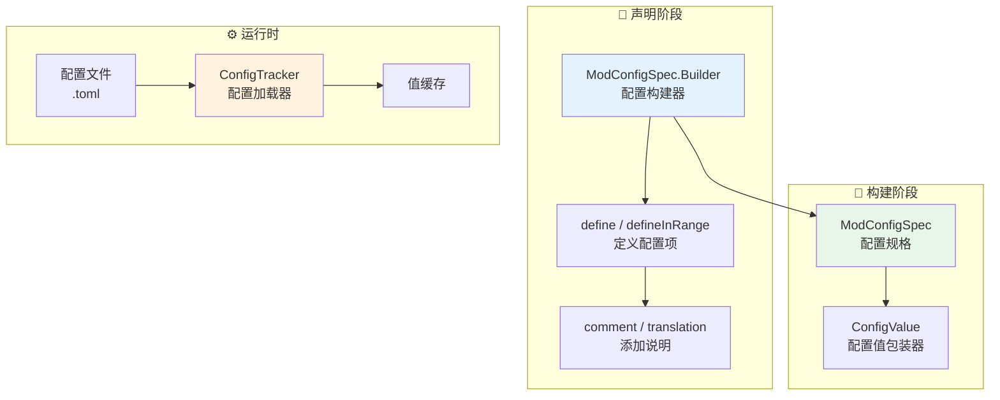
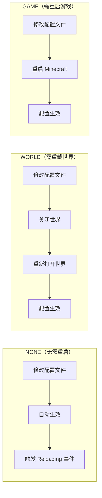
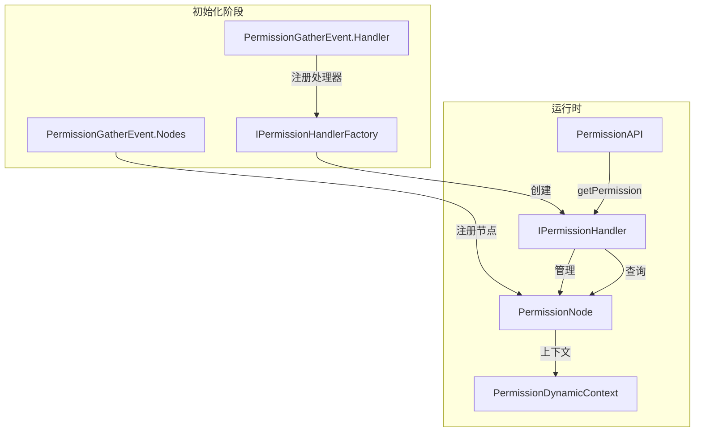

# NeoForge 配置系统完全指南

---
title: NeoForge 配置系统完全指南
readingTime: 25
---

> **面向读者**：已掌握 Java 基础和 NeoForge 事件系统，希望为 Mod 添加可配置选项的开发者

> **前置知识**：理解 `@Mod` 注解、事件总线概念、Java 泛型基础

> **目标**：掌握 NeoForge 配置系统的完整用法，包括配置声明、类型、运行时管理和权限系统

---

## 目录

- [1. 配置系统概述](#1-配置系统概述)
  - [什么是配置系统？](#什么是配置系统)
  - [核心组件：ModConfigSpec](#核心组件-modconfigspec)
- [2. 配置规范定义](#2-配置规范定义)
  - [Builder 模式](#builder-模式)
  - [配置分类](#配置分类)
  - [常用配置类型](#常用配置类型)
- [3. 配置类型详解](#3-配置类型详解)
  - [COMMON 配置](#common-配置)
  - [CLIENT 配置](#client-配置)
  - [SERVER 配置](#server-配置)
- [4. 运行时配置读取](#4-运行时配置读取)
  - [配置事件监听](#配置事件监听)
  - [配置热重载](#配置热重载)
  - [配置修改与保存](#配置修改与保存)
- [5. 权限系统简介](#5-权限系统简介)
  - [PermissionAPI 核心](#permissionapi-核心)
  - [权限节点定义](#权限节点定义)
  - [动态上下文](#动态上下文)
- [6. 完整示例：创建模组配置界面](#6-完整示例创建模组配置界面)
  - [示例：魔法水晶 Mod 配置](#示例魔法水晶-mod-配置)
- [7. 课后自查](#7-课后自查)

---

## 1. 配置系统概述

### 什么是配置系统？

配置系统让玩家和服务器管理员能够**在不修改代码的情况下调整 Mod 行为**。例如：

```
# 不需要配置
经验塔最大等级 = 100

# 需要配置
经验塔最大等级 = 可在配置文件中修改（默认100，范围10-500）
```

**为什么需要配置系统？**

```
┌─────────────────────────────────────────────────────────────┐
│                    配置系统的价值                           │
├─────────────────────────────────────────────────────────────┤
│  🎮 玩家定制  │ 调整难度、功能开关、游戏体验                 │
│  🖥️ 服务器管理 │ 统一多人服务器配置，避免作弊                │
│  🔧 开发者调试 │ 不用改代码就能测试不同参数                   │
│  📦 模组兼容  │ 不同 Mod 可共享配置格式                      │
└─────────────────────────────────────────────────────────────┘
```

### 核心组件：ModConfigSpec

`ModConfigSpec` 是 NeoForge 配置系统的核心类，基于 **NightConfig** 库构建：



---

## 2. 配置规范定义

### Builder 模式

NeoForge 使用 **Builder 模式**（链式调用）来声明配置项：

```java
// 基本结构
public static final ModConfigSpec SPEC;
public static final MyConfig INSTANCE;

private MyConfig(ModConfigSpec.Builder builder) {
    // 在这里定义所有配置项
}

static {
    // Pair 包含 (实例, 规格)
    Pair<MyConfig, ModConfigSpec> pair = 
        new ModConfigSpec.Builder().configure(MyConfig::new);
    INSTANCE = pair.getLeft();
    SPEC = pair.getRight();
}
```

**关键 Builder 方法：**

| 方法 | 用途 |
|------|------|
| `define(path, defaultValue)` | 定义通用配置项 |
| `defineInRange(path, default, min, max)` | 定义带数值范围的配置 |
| `defineEnum(path, defaultValue)` | 定义枚举配置 |
| `defineList(path, default, validator)` | 定义列表配置 |
| `comment(String)` | 添加注释/说明 |
| `translation(String)` | 设置翻译键（用于配置界面） |
| `worldRestart()` | 标记需要世界重启 |
| `gameRestart()` | 标记需要游戏重启 |
| `push(String)` | 进入分类 |
| `pop()` | 返回上级分类 |

### 配置分类

使用 `push()` 和 `pop()` 组织配置项：

```java
private MyConfig(ModConfigSpec.Builder builder) {
    // 第一层分类：功能设置
    builder.comment("功能开关")
           .push("features");
    
    enableMagic = builder
        .comment("启用魔法系统")
        .define("enableMagic", true);
    
    enableCrafting = builder
        .comment("启用高级合成")
        .define("enableCrafting", true);
    
    builder.pop();  // 返回顶层
    
    // 第二层分类：数值设置
    builder.comment("数值平衡")
           .push("balance");
    
    maxLevel = builder
        .comment("最大等级", "范围: 1-100")
        .defineInRange("maxLevel", 50, 1, 100);
    
    experienceMultiplier = builder
        .comment("经验倍率", "影响升级速度")
        .worldRestart()  // 需要重载世界才生效
        .defineInRange("experienceMultiplier", 1.0, 0.1, 10.0);
    
    builder.pop();
}
```

**生成的配置结构：**

```toml
[features]
# 启用魔法系统
enableMagic = true
# 启用高级合成
enableCrafting = true

[balance]
# 最大等级
# 范围: 1-100
maxLevel = 50
# 经验倍率
# 影响升级速度
experienceMultiplier = 1.0
```

### 常用配置类型

```java
public final class MyConfig {
    // 布尔配置
    public final ModConfigSpec.BooleanValue enableFeature;
    
    // 整数配置（带范围）
    public final ModConfigSpec.IntValue maxCacheSize;
    
    // 长整数配置
    public final ModConfigSpec.LongValue maxDuration;
    
    // 双精度浮点配置
    public final ModConfigSpec.DoubleValue dropRate;
    
    // 字符串配置
    public final ModConfigSpec.ConfigValue<String> serverAddress;
    
    // 枚举配置
    public final ModConfigSpec.EnumValue<Difficulty> difficulty;
    
    // 列表配置
    public final ModConfigSpec.ConfigValue<List<String>> whitelist;
    
    // 分类配置（需要 push/pop）
    public final ModConfigSpec.BooleanValue categoryEnabled;
    
    private MyConfig(ModConfigSpec.Builder builder) {
        // 布尔类型
        enableFeature = builder
            .comment("启用实验性功能")
            .define("enableFeature", false);
        
        // 整数范围
        maxCacheSize = builder
            .comment("最大缓存大小", "范围: 100-10000")
            .defineInRange("maxCacheSize", 1000, 100, 10000);
        
        // 长整数
        maxDuration = builder
            .comment("最大持续时间（毫秒）")
            .defineInRange("maxDuration", 60000L, 1000L, 3600000L);
        
        // 双精度浮点
        dropRate = builder
            .comment("物品掉落率", "1.0 = 100%")
            .defineInRange("dropRate", 0.5, 0.0, 1.0);
        
        // 字符串
        serverAddress = builder
            .comment("服务器地址")
            .define("serverAddress", "localhost:25565");
        
        // 枚举
        difficulty = builder
            .comment("游戏难度")
            .defineEnum("difficulty", Difficulty.NORMAL);
        
        // 列表（带验证器）
        whitelist = builder
            .comment("白名单玩家名称")
            .define("whitelist", List.of(), 
                list -> list.stream().allMatch(s -> s.matches("[a-zA-Z0-9_]+")));
    }
}
```

---

## 3. 配置类型详解

### COMMON 配置

> **COMMON** 配置在服务器启动前就需要可用，不需要同步到客户端。

适用场景：
- 通用功能开关
- 开发调试选项
- 不影响游戏平衡的设置

```java
// MyCommonConfig.java
public final class MyCommonConfig {
    public static final ModConfigSpec SPEC;
    public static final MyCommonConfig INSTANCE;
    
    public final ModConfigSpec.BooleanValue enableDebugMode;
    public final ModConfigSpec.BooleanValue logNetworkTraffic;
    
    private MyCommonConfig(ModConfigSpec.Builder builder) {
        builder.comment("通用设置");
        
        enableDebugMode = builder
            .comment("启用调试模式", "会显示更多信息")
            .define("enableDebugMode", false);
        
        logNetworkTraffic = builder
            .comment("记录网络流量", "用于排查网络问题")
            .define("logNetworkTraffic", false);
    }
    
    static {
        Pair<MyCommonConfig, ModConfigSpec> pair = 
            new ModConfigSpec.Builder().configure(MyCommonConfig::new);
        INSTANCE = pair.getLeft();
        SPEC = pair.getRight();
    }
}

// Mod 入口中注册
@Mod(MyMod.MOD_ID)
public class MyMod {
    @SubscribeEvent
    public static void onCommonSetup(final FMLCommonSetupEvent event) {
        // COMMON 配置在此时已经可用
        ModLoadingContext.get().registerConfig(
            Type.COMMON,  // 配置类型
            MyCommonConfig.SPEC,  // 配置规格
            "mymod-common.toml"  // 配置文件名
        );
    }
}
```

**配置文件位置：**

```
.config/
└── mymod-common.toml    # COMMON 配置
```

### CLIENT 配置

> **CLIENT** 配置只影响客户端，不同步到服务器。

适用场景：
- 图形设置
- UI 自定义
- 音效开关

```java
// MyClientConfig.java
public final class MyClientConfig {
    public static final ModConfigSpec SPEC;
    public static final MyClientConfig INSTANCE;
    
    public final ModConfigSpec.BooleanValue enableParticles;
    public final ModConfigSpec.EnumValue<ParticleQuality> particleQuality;
    public final ModConfigSpec.IntValue uiScale;
    
    public enum ParticleQuality {
        OFF, LOW, MEDIUM, HIGH, ULTRA
    }
    
    private MyClientConfig(ModConfigSpec.Builder builder) {
        builder.comment("客户端设置");
        
        enableParticles = builder
            .comment("启用粒子效果")
            .define("enableParticles", true);
        
        particleQuality = builder
            .comment("粒子质量")
            .defineEnum("particleQuality", ParticleQuality.HIGH);
        
        uiScale = builder
            .comment("UI 缩放", "范围: 50-200")
            .gameRestart()  // 需要重启游戏
            .defineInRange("uiScale", 100, 50, 200);
    }
    
    static {
        Pair<MyClientConfig, ModConfigSpec> pair = 
            new ModConfigSpec.Builder().configure(MyClientConfig::new);
        INSTANCE = pair.getLeft();
        SPEC = pair.getRight();
    }
}

// 在客户端初始化时注册
@Mod.EventBusSubscriber(modid = MyMod.MOD_ID, bus = Mod.EventBusSubscriber.Bus.MOD, value = Dist.CLIENT)
public class MyModClient {
    @SubscribeEvent
    public static void onClientSetup(final FMLClientSetupEvent event) {
        ModLoadingContext.get().registerConfig(
            Type.CLIENT,
            MyClientConfig.SPEC,
            "mymod-client.toml"
        );
    }
}
```

### SERVER 配置

> **SERVER** 配置需要同步到客户端或按世界配置。

适用场景：
- 游戏规则
- 数值平衡
- 服务器管理选项

```java
// MyServerConfig.java
public final class MyServerConfig {
    public static final ModConfigSpec SPEC;
    public static final MyServerConfig INSTANCE;
    
    public final ModConfigSpec.BooleanValue allowPvP;
    public final ModConfigSpec.IntValue spawnProtectionRadius;
    public final ModConfigSpec.ConfigValue<List<String>> disabledCommands;
    
    private MyServerConfig(ModConfigSpec.Builder builder) {
        builder.comment("服务器设置");
        
        allowPvP = builder
            .comment("允许 PvP", "在服务器范围内启用玩家对战")
            .worldRestart()  // 需要重载世界
            .define("allowPvP", false);
        
        spawnProtectionRadius = builder
            .comment("出生点保护半径", "设为 0 可禁用")
            .defineInRange("spawnProtectionRadius", 16, 0, 256);
        
        disabledCommands = builder
            .comment("禁用的命令列表")
            .define("disabledCommands", List.of("home", "warp"));
    }
    
    static {
        Pair<MyServerConfig, ModConfigSpec> pair = 
            new ModConfigSpec.Builder().configure(MyServerConfig::new);
        INSTANCE = pair.getLeft();
        SPEC = pair.getRight();
    }
}

// 注册到服务器生命周期
@Mod.EventBusSubscriber(modid = MyMod.MOD_ID, bus = Mod.EventBusSubscriber.Bus.MOD)
public class MyModServer {
    @SubscribeEvent
    public static void onServerSetup(final FMLCommonSetupEvent event) {
        ModLoadingContext.get().registerConfig(
            Type.SERVER,
            MyServerConfig.SPEC,
            "mymod-server.toml"
        );
    }
}
```

---

## 4. 运行时配置读取

### 配置事件监听

NeoForge 提供了配置加载/重载事件：

```java
@Mod.EventBusSubscriber(modid = MyMod.MOD_ID, bus = Mod.EventBusSubscriber.Bus.MOD)
public class MyModConfigEvents {
    
    @SubscribeEvent
    public static void onConfigLoad(ModConfig.Loading event) {
        if (event.getConfig().getSpec() == MyConfig.SPEC) {
            LOGGER.info("配置已加载: {}", MyConfig.INSTANCE.enableFeature.get());
            // 初始化依赖此配置的组件
            initializeComponents();
        }
    }
    
    @SubscribeEvent
    public static void onConfigReload(ModConfig.Reloading event) {
        if (event.getConfig().getSpec() == MyConfig.SPEC) {
            LOGGER.info("配置已重载，正在刷新缓存...");
            // 清除旧缓存
            clearCache();
            // 重新读取配置
            refreshFromConfig();
        }
    }
}
```

### 配置热重载

根据重启类型，配置有不同的生效时机：



### 配置修改与保存

在运行时修改配置值：

```java
public class ConfigManager {
    
    // 读取配置值
    public static boolean isFeatureEnabled() {
        return MyConfig.INSTANCE.enableFeature.get();
    }
    
    // 运行时修改（仅在支持热重载的配置上有效）
    public static void setFeatureEnabled(boolean enabled) {
        MyConfig.INSTANCE.enableFeature.set(enabled);
        saveConfig();
    }
    
    // 保存配置到磁盘
    public static void saveConfig() {
        for (ModConfig config : ModConfigs.getConfigs(MyConfig.SPEC)) {
            config.save();
        }
    }
    
    // 重置为默认值
    public static void resetToDefaults() {
        MyConfig.INSTANCE.enableFeature.reset();
        MyConfig.INSTANCE.maxCacheSize.reset();
        saveConfig();
    }
}
```

---

## 5. 权限系统简介

> **权限系统**提供细粒度的玩家权限检查机制，与命令权限等级不同，它允许模组定义任意类型的权限节点。

### PermissionAPI 核心



### 权限节点定义

```java
// MyPermissions.java
public final class MyPermissions {
    
    // 布尔权限 - 管理员绕过限制
    public static final PermissionNode<Boolean> BYPASS_LIMIT = 
        new PermissionNode<>(
            "mymod",                    // 命名空间
            "admin.bypass",             // 节点名称
            PermissionTypes.BOOLEAN,    // 类型
            (player, uuid, ctx) -> false  // 默认解析器
        );
    
    // 整数权限 - 每日传送次数
    public static final PermissionNode<Integer> DAILY_TELEPORTS = 
        new PermissionNode<>(
            "mymod",
            "teleport.daily_limit",
            PermissionTypes.INTEGER,
            (player, uuid, ctx) -> 10  // 默认每天10次
        );
    
    // 字符串权限 - 玩家称号
    public static final PermissionNode<String> PLAYER_TITLE = 
        new PermissionNode<>(
            "mymod",
            "player.title",
            PermissionTypes.STRING,
            (player, uuid, ctx) -> "新人"
        );
    
    // 注册所有权限节点
    @SubscribeEvent
    public static void onPermissionGather(PermissionGatherEvent.Nodes event) {
        event.addNodes(
            BYPASS_LIMIT,
            DAILY_TELEPORTS,
            PLAYER_TITLE
        );
    }
}
```

### 动态上下文

动态上下文允许在权限检查时提供额外的环境信息：

```java
// 维度上下文键
public static final PermissionDynamicContextKey<ResourceKey<Level>> DIMENSION_KEY = 
    new PermissionDynamicContextKey<>(
        (Class<ResourceKey<Level>>)(Class<?>)ResourceKey.class,
        "dimension",
        ResourceKey::location
    );

// 带上下文的权限节点
public static final PermissionNode<Boolean> BUILD_IN_DIMENSION = 
    new PermissionNode<>(
        "mymod",
        "build.dimension",
        PermissionTypes.BOOLEAN,
        (player, uuid, ctx) -> {
            for (var c : ctx) {
                if (c.getDynamic().name().equals("dimension")) {
                    ResourceKey<Level> dim = c.getValue();
                    return dim == Level.OVERWORLD;
                }
            }
            return false;
        },
        DIMENSION_KEY
    );

// 使用权限检查
public class TeleportCommand {
    public static int execute(CommandContext<CommandSourceStack> context) {
        ServerPlayer player = context.getSource().getPlayerOrException();
        
        // 检查基础权限
        boolean canBypass = PermissionAPI.getPermission(player, MyPermissions.BYPASS_LIMIT);
        
        // 检查每日次数
        int remaining = PermissionAPI.getPermission(player, MyPermissions.DAILY_TELEPORTS);
        
        // 检查维度权限
        ResourceKey<Level> currentDim = player.level().dimension();
        boolean canBuild = PermissionAPI.getPermission(
            player, 
            MyPermissions.BUILD_IN_DIMENSION,
            MyPermissions.DIMENSION_KEY.createContext(currentDim)
        );
        
        return 1;
    }
}
```

---

## 6. 完整示例：创建模组配置界面

### 示例：魔法水晶 Mod 配置

下面创建一个完整的魔法水晶 Mod 配置类：

```java
// 文件: src/main/java/com/example/mymod/config/MagicCrystalConfig.java
package com.example.mymod.config;

import net.neoforged.neoforge.common.ModConfigSpec;
import org.apache.commons.lang3.tuple.Pair;

public final class MagicCrystalConfig {
    
    // ========== 静态实例 ==========
    public static final ModConfigSpec SPEC;
    public static final MagicCrystalConfig INSTANCE;
    
    // ========== 功能开关 ==========
    public final ModConfigSpec.BooleanValue enableMagicSystem;
    public final ModConfigSpec.BooleanValue enableCrystalCharging;
    public final ModConfigSpec.BooleanValue enableSpellCrafting;
    
    // ========== 数值平衡 ==========
    public final ModConfigSpec.IntValue maxCrystalLevel;
    public final ModConfigSpec.IntValue baseExperience;
    public final ModConfigSpec.DoubleValue experienceMultiplier;
    public final ModConfigSpec.IntValue maxManaCapacity;
    public final ModConfigSpec.IntValue manaRegenRate;
    
    // ========== 物品设置 ==========
    public final ModConfigSpec.ConfigValue<String> crystalItemId;
    public final ModConfigSpec.BooleanValue crystalsOnlyCraftable;
    
    // ========== 权限设置 ==========
    public final ModConfigSpec.BooleanValue requirePermission;
    public final ModConfigSpec.ConfigValue<String> requiredPermission;
    
    // ========== 构造函数 ==========
    private MagicCrystalConfig(ModConfigSpec.Builder builder) {
        // ========== 功能开关分类 ==========
        builder.comment("======== 功能开关 ========")
               .push("features");
        
        enableMagicSystem = builder
            .comment("启用魔法系统", "设为 false 可完全禁用魔法水晶功能")
            .define("enableMagicSystem", true);
        
        enableCrystalCharging = builder
            .comment("启用水晶充能", "允许玩家通过经验值为水晶充能")
            .define("enableCrystalCharging", true);
        
        enableSpellCrafting = builder
            .comment("启用法术合成", "允许使用水晶合成特殊法术")
            .define("enableSpellCrafting", true);
        
        builder.pop();  // 结束 features 分类
        
        // ========== 数值平衡分类 ==========
        builder.comment("======== 数值平衡 ========")
               .push("balance");
        
        maxCrystalLevel = builder
            .comment("水晶最大等级", "水晶可达到的最高等级", "范围: 1-100")
            .worldRestart()
            .defineInRange("maxCrystalLevel", 50, 1, 100);
        
        baseExperience = builder
            .comment("基础经验值", "每级所需的基础经验")
            .defineInRange("baseExperience", 100, 10, 10000);
        
        experienceMultiplier = builder
            .comment("经验倍率", "每级递增的经验倍数", "1.0 = 线性增长")
            .defineInRange("experienceMultiplier", 1.5, 1.0, 3.0);
        
        maxManaCapacity = builder
            .comment("最大魔力容量", "水晶可存储的最大魔力值")
            .defineInRange("maxManaCapacity", 1000, 100, 10000);
        
        manaRegenRate = builder
            .comment("魔力恢复速度", "每秒恢复的魔力值")
            .defineInRange("manaRegenRate", 5, 0, 100);
        
        builder.pop();  // 结束 balance 分类
        
        // ========== 物品设置分类 ==========
        builder.comment("======== 物品设置 ========")
               .push("items");
        
        crystalItemId = builder
            .comment("水晶物品 ID", "格式: modid:item_name")
            .gameRestart()
            .define("crystalItemId", "mymod:magic_crystal");
        
        crystalsOnlyCraftable = builder
            .comment("水晶仅可通过合成获得", "如果为 true，生物掉落的水晶将无效")
            .define("crystalsOnlyCraftable", false);
        
        builder.pop();  // 结束 items 分类
        
        // ========== 权限设置分类 ==========
        builder.comment("======== 权限设置 ========")
               .push("permissions");
        
        requirePermission = builder
            .comment("需要权限才能使用魔法", "启用后玩家需要有对应权限")
            .define("requirePermission", false);
        
        requiredPermission = builder
            .comment("所需权限节点", "当 requirePermission 为 true 时生效")
            .define("requiredPermission", "mymod.magic.use");
        
        builder.pop();  // 结束 permissions 分类
    }
    
    // ========== 静态初始化 ==========
    static {
        Pair<MagicCrystalConfig, ModConfigSpec> pair = 
            new ModConfigSpec.Builder().configure(MagicCrystalConfig::new);
        INSTANCE = pair.getLeft();
        SPEC = pair.getRight();
    }
}
```

**对应的配置监听器：**

```java
// 文件: src/main/java/com/example/mymod/config/MagicCrystalConfigEvents.java
package com.example.mymod.config;

import net.neoforged.bus.api.SubscribeEvent;
import net.neoforged.neoforge.common.ModConfig;
import org.slf4j.Logger;
import org.slf4j.LoggerFactory;

public class MagicCrystalConfigEvents {
    
    private static final Logger LOGGER = LoggerFactory.getLogger("MagicCrystal");
    
    @SubscribeEvent
    public static void onConfigLoad(ModConfig.Loading event) {
        if (event.getConfig().getSpec() == MagicCrystalConfig.SPEC) {
            LOGGER.info("魔法水晶配置已加载!");
            LOGGER.info("  魔法系统: {}", 
                MagicCrystalConfig.INSTANCE.enableMagicSystem.get() ? "启用" : "禁用");
            LOGGER.info("  最大等级: {}", 
                MagicCrystalConfig.INSTANCE.maxCrystalLevel.get());
            LOGGER.info("  魔力容量: {}", 
                MagicCrystalConfig.INSTANCE.maxManaCapacity.get());
        }
    }
    
    @SubscribeEvent
    public static void onConfigReload(ModConfig.Reloading event) {
        if (event.getConfig().getSpec() == MagicCrystalConfig.SPEC) {
            LOGGER.info("魔法水晶配置已重载!");
            LOGGER.info("  经验倍率: {}", 
                MagicCrystalConfig.INSTANCE.experienceMultiplier.get());
        }
    }
}
```

**Mod 入口中注册：**

```java
// 文件: src/main/java/com/example/mymod/MagicCrystalMod.java
package com.example.mymod;

import net.neoforged.bus.api.SubscribeEvent;
import net.neoforged.fml.common.Mod;
import net.neoforged.neoforge.common.ModConfigSpec;
import net.neoforged.neoforge.event.server.ServerAboutToStartEvent;
import com.example.mymod.config.MagicCrystalConfig;
import com.example.mymod.config.MagicCrystalConfigEvents;

@Mod(MagicCrystalMod.MOD_ID)
public class MagicCrystalMod {
    
    public static final String MOD_ID = "magiccrystal";
    public static final Logger LOGGER = LoggerFactory.getLogger("MagicCrystal");
    
    public MagicCrystalMod() {
        // 注册配置监听器
        NeoForge.EVENT_BUS.register(MagicCrystalConfigEvents.class);
    }
    
    @SubscribeEvent
    public static void onServerAboutToStart(ServerAboutToStartEvent event) {
        // SERVER 配置在此时加载完成
        if (MagicCrystalConfig.INSTANCE.enableMagicSystem.get()) {
            LOGGER.info("魔法系统已启用!");
            LOGGER.info("水晶最大等级: {}", 
                MagicCrystalConfig.INSTANCE.maxCrystalLevel.get());
        }
    }
}
```

**生成的配置文件示例：**

```toml
# 文件: config/magiccrystal-common.toml
# ========= 功能开关 ========
[features]
    # 启用魔法系统
    # 设为 false 可完全禁用魔法水晶功能
    enableMagicSystem = true
    # 启用水晶充能
    # 允许玩家通过经验值为水晶充能
    enableCrystalCharging = true
    # 启用法术合成
    # 允许使用水晶合成特殊法术
    enableSpellCrafting = true

# ========= 数值平衡 ========
[balance]
    # 水晶最大等级
    # 水晶可达到的最高等级
    # 范围: 1-100
    # 需要世界重启
    maxCrystalLevel = 50
    # 基础经验值
    # 每级所需的基础经验
    baseExperience = 100
    # 经验倍率
    # 每级递增的经验倍数
    # 1.0 = 线性增长
    experienceMultiplier = 1.5
    # 最大魔力容量
    # 水晶可存储的最大魔力值
    maxManaCapacity = 1000
    # 魔力恢复速度
    # 每秒恢复的魔力值
    manaRegenRate = 5

# ========= 物品设置 ========
[items]
    # 水晶物品 ID
    # 格式: modid:item_name
    # 需要游戏重启
    crystalItemId = "mymod:magic_crystal"
    # 水晶仅可通过合成获得
    # 如果为 true，生物掉落的水晶将无效
    crystalsOnlyCraftable = false

# ========= 权限设置 ========
[permissions]
    # 需要权限才能使用魔法
    # 启用后玩家需要有对应权限
    requirePermission = false
    # 所需权限节点
    # 当 requirePermission 为 true 时生效
    requiredPermission = "mymod.magic.use"
```

---

## 7. 课后自查

完成本章学习后，请确认你能够：

```
□ 1. 理解 ModConfigSpec 的 Builder 模式，能够声明各种类型的配置项

□ 2. 知道 COMMON、CLIENT、SERVER 三种配置类型的区别和适用场景

□ 3. 能够在 Mod 中注册配置，并监听加载/重载事件

□ 4. 理解 worldRestart() 和 gameRestart() 的区别，知道何时使用

□ 5. 了解权限系统的基本概念，知道如何定义 PermissionNode

□ 6. 能够创建一个完整的 Mod 配置类，包含功能开关和数值平衡
```

---

### 思考题

1. **为什么有些配置需要 `worldRestart()` 而有些不需要？**  
   > 提示：考虑哪些配置修改需要重置世界状态才能生效。

2. **COMMON 配置和 SERVER 配置的主要区别是什么？**  
   > 提示：考虑配置同步和生命周期。

3. **如果要在配置界面中显示中文提示，应该使用哪个方法？**  
   > 提示：不是 `comment`。

4. **权限系统中的 `PermissionTypes.BOOLEAN` 和 `PermissionTypes.INTEGER` 有什么区别？**  
   > 提示：考虑返回值类型和使用场景。

---

## 参考资料

| 内容 | 链接/路径 |
|------|----------|
| NeoForge 官方文档 | https://docs.neoforged.net/ |
| 配置系统源码 | `assets/NeoForge-1.21.x/src/main/java/net/neoforged/neoforge/common/config/` |
| 权限系统源码 | `assets/NeoForge-1.21.x/src/main/java/net/neoforged/neoforge/server/permission/` |
| 配置分析文档 | `content/neoforge/analysis/12-config-server-system.md` |

---

> **下一章预告**：[NeoForge 调试与日志系统](./02-logging-debugging.md) - 学习使用日志进行调试，掌握常见问题排查技巧

---

*文档更新时间: 2026-03-24*
