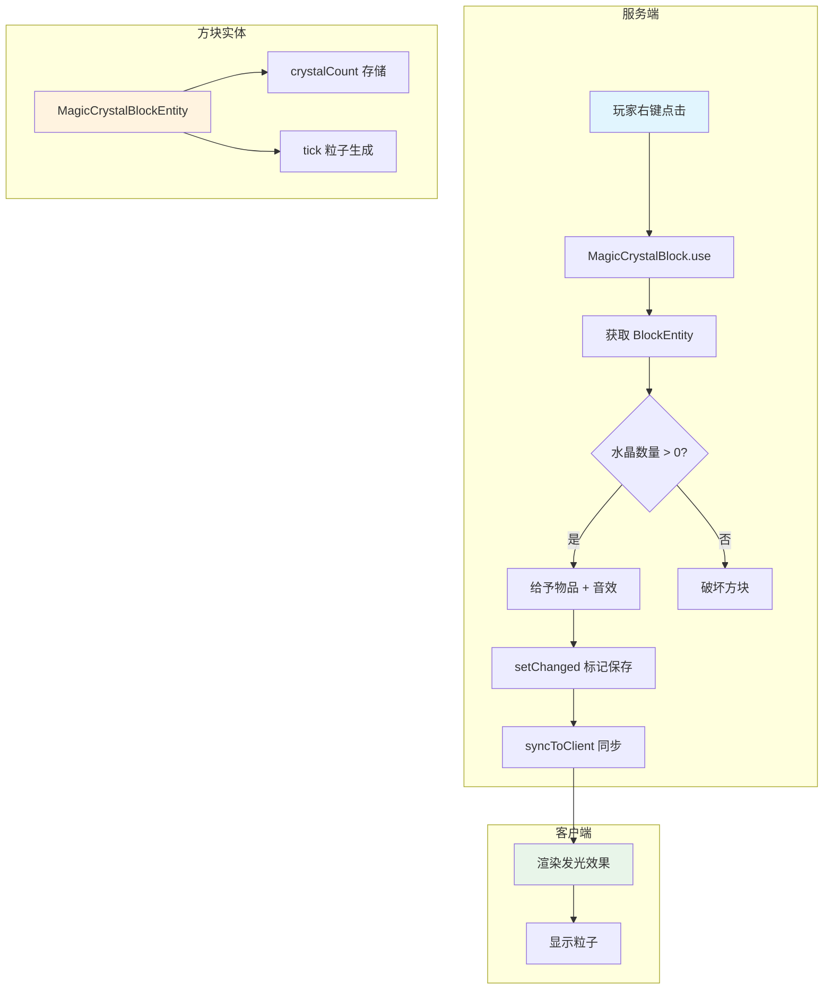
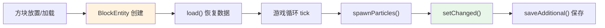
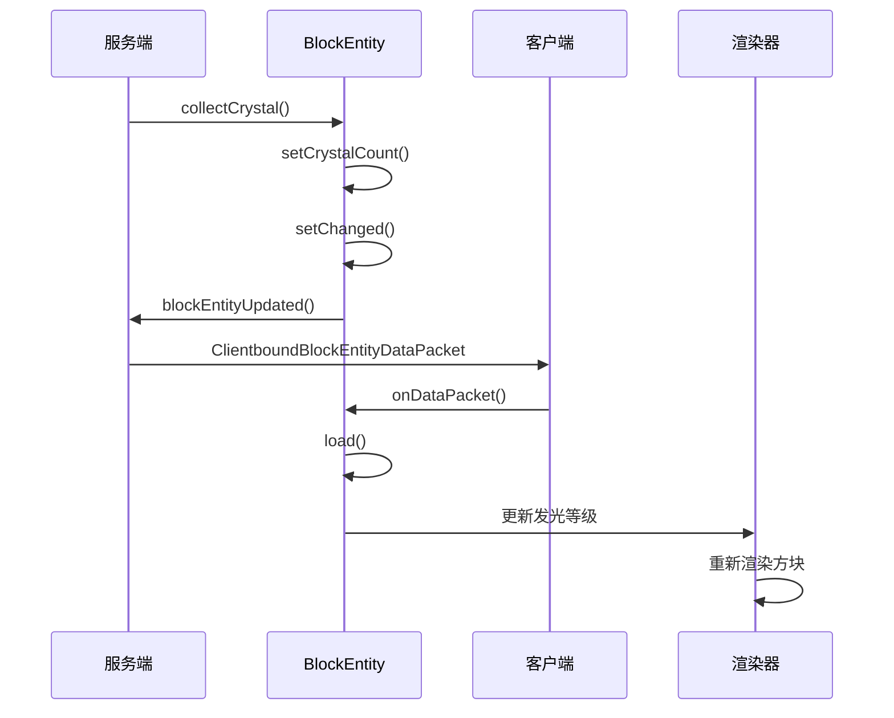

# 魔法水晶方块 - NeoForge 实战项目

> **目标**：从零开始创建一个完整的"魔法水晶"模组，包含发光方块、可收集物品、方块实体存储和粒子效果。
>
> **前置知识**：建议完成 [环境搭建](../part-1-getting-started/01-environment-setup.md) 和 [方块与物品开发](../part-2-blocks-items/01-blocks-and-items.md)

---

## 目录

- [1. 项目概述](#1-项目概述)
- [2. 创建方块类](#2-创建方块类)
- [3. 创建方块实体](#3-创建方块实体)
- [4. 创建物品形态](#4-创建物品形态)
- [5. 注册与资源文件](#5-注册与资源文件)
- [6. 事件监听与玩家交互](#6-事件监听与玩家交互)
- [7. 数据同步](#7-数据同步)
- [8. 完整代码汇总](#8-完整代码汇总)
- [9. 测试运行](#9-测试运行)
- [课后自查](#课后自查)

---

## 1. 项目概述

### 1.1 功能规划

```
┌─────────────────────────────────────────────────────────────┐
│                    🎮 魔法水晶方块功能                        │
├─────────────────────────────────────────────────────────────┤
│  ✨ 发光效果     - 方块发出紫罗兰色光芒                       │
│  📦 水晶存储     - 每个方块存储 9 个水晶                      │
│  🖱️ 右键收集     - 右键方块收集一个水晶，获得物品             │
│  💫 粒子特效     - 持续产生魔法粒子                          │
│  🔄 数据持久化   - 方块破坏/加载时保存水晶数量               │
└─────────────────────────────────────────────────────────────┘
```

### 1.2 技术要点

| 概念 | 说明 |
|------|------|
| **BlockWithEntity** | 需要存储数据的方块必须继承此类 |
| **BlockEntity** | 方块实体，用于存储额外数据 |
| **DeferredRegister** | NeoForge 延迟注册系统 |
| **NetworkSync** | 客户端/服务端数据同步 |
| **ParticleSystem** | 粒子效果生成 |

### 1.3 架构流程图



---

## 2. 创建方块类

### 2.1 项目结构

```
src/main/java/com/example/mymod/
├── ExampleMod.java
├── init/
│   ├── ModBlocks.java
│   ├── ModItems.java
│   └── ModBlockEntities.java
├── block/
│   ├── MagicCrystalBlock.java
│   └── MagicCrystalBlockEntity.java
└── item/
    └── MagicCrystalItem.java
```

### 2.2 定义方块

创建 `block/MagicCrystalBlock.java`：

```java
package com.example.mymod.block;

import com.example.mymod.init.ModBlockEntities;
import net.minecraft.core.BlockPos;
import net.minecraft.world.level.block.Block;
import net.minecraft.world.level.block.BlockWithEntity;
import net.minecraft.world.level.block.RenderShape;
import net.minecraft.world.level.block.entity.BlockEntity;
import net.minecraft.world.level.block.state.BlockState;
import net.minecraft.world.phys.shapes.VoxelShape;

/**
 * 魔法水晶方块
 * 特性：
 * - 发光效果（亮度等级 10）
 * - 存储水晶数量（通过 BlockEntity）
 * - 右键收集水晶
 */
public class MagicCrystalBlock extends BlockWithEntity {
    
    // 方块形状（完整方块）
    protected static final VoxelShape SHAPE = Block.box(0, 0, 0, 16, 16, 16);
    
    public MagicCrystalBlock(Properties properties) {
        super(properties);
    }
    
    // 创建对应的方块实体
    @Override
    public BlockEntity newBlockEntity(BlockPos pos, BlockState state) {
        return ModBlockEntities.MAGIC_CRYSTAL.get().create(pos, state);
    }
    
    // 设置渲染类型
    @Override
    public RenderShape getRenderShape(BlockState state) {
        return RenderShape.MODEL;
    }
    
    // 方块发光等级
    @Override
    public int getLightEmission(BlockState state, net.minecraft.world.level.BlockGetter level, BlockPos pos) {
        return 10;  // 亮度等级 10（类似萤石）
    }
    
    // 获取方块形状（用于碰撞检测）
    @Override
    public VoxelShape getShape(BlockState state, net.minecraft.world.level.BlockGetter level, 
                               BlockPos pos, net.minecraft.world.phys.shapes.CollisionContext context) {
        return SHAPE;
    }
}
```

---

## 3. 创建方块实体

### 3.1 方块实体概述

**BlockEntity（方块实体）** 是与特定方块关联的持久化数据容器。我们的魔法水晶需要存储：

- `crystalCount`：当前水晶数量
- `particleTick`：粒子生成计时器



### 3.2 创建方块实体类

创建 `block/MagicCrystalBlockEntity.java`：

```java
package com.example.mymod.block;

import com.example.mymod.init.ModBlockEntities;
import net.minecraft.core.BlockPos;
import net.minecraft.core.particles.ParticleTypes;
import net.minecraft.nbt.CompoundTag;
import net.minecraft.network.protocol.game.ClientGamePacketListener;
import net.minecraft.network.protocol.game.ClientboundBlockEntityDataPacket;
import net.minecraft.server.level.ServerLevel;
import net.minecraft.world.level.block.entity.BlockEntity;
import net.minecraft.world.level.block.state.BlockState;
import net.minecraft.world.level.gameevent.GameEvent;
import net.minecraft.world.phys.AABB;
import net.minecraft.world.phys.Vec3;

import java.util.random.Random;

/**
 * 魔法水晶方块实体
 * 存储水晶数量并生成粒子效果
 */
public class MagicCrystalBlockEntity extends BlockEntity {
    
    // 水晶数量（最大 9 个）
    private int crystalCount = 9;
    private static final int MAX_CRYSTALS = 9;
    
    // 粒子计时器（每 10 tick 生成一次）
    private int particleTick = 0;
    
    public MagicCrystalBlockEntity(BlockPos pos, BlockState state) {
        super(ModBlockEntities.MAGIC_CRYSTAL.get(), pos, state);
    }
    
    // ========== 数据持久化 ==========
    
    // 保存数据到 NBT
    @Override
    protected void saveAdditional(CompoundTag tag) {
        super.saveAdditional(tag);
        tag.putInt("crystalCount", this.crystalCount);
    }
    
    // 从 NBT 加载数据
    @Override
    public void load(CompoundTag tag) {
        super.load(tag);
        this.crystalCount = tag.getInt("crystalCount");
    }
    
    // ========== 客户端/服务端同步 ==========
    
    // 获取同步数据包（发送给客户端）
    @Override
    public CompoundTag getUpdateTag() {
        CompoundTag tag = new CompoundTag();
        saveAdditional(tag);
        return tag;
    }
    
    // 处理收到的同步数据包
    @Override
    public void onDataPacket(net.minecraft.network.Connection net, 
                             ClientboundBlockEntityDataPacket pkt) {
        if (pkt.getTag() != null) {
            load(pkt.getTag());
        }
    }
    
    // ========== 业务逻辑 ==========
    
    // 获取水晶数量
    public int getCrystalCount() {
        return crystalCount;
    }
    
    // 设置水晶数量
    public void setCrystalCount(int count) {
        this.crystalCount = Math.max(0, Math.min(count, MAX_CRYSTALS));
        setChanged();  // 标记数据已变更，需要保存
    }
    
    // 收集一个水晶
    public boolean collectCrystal() {
        if (crystalCount > 0) {
            setCrystalCount(crystalCount - 1);
            return true;
        }
        return false;
    }
    
    // 检查是否为空
    public boolean isEmpty() {
        return crystalCount <= 0;
    }
    
    // ========== 粒子效果 ==========
    
    // 游戏刻更新（每 tick 调用）
    @Override
    public void tick() {
        if (level == null || level.isClientSide) return;
        
        // 粒子生成计时
        particleTick++;
        if (particleTick >= 10) {
            spawnParticles();
            particleTick = 0;
        }
    }
    
    // 生成魔法粒子
    private void spawnParticles() {
        if (crystalCount <= 0 || !(level instanceof ServerLevel serverLevel)) {
            return;
        }
        
        Random random = level.getRandom();
        
        // 根据水晶数量生成粒子
        for (int i = 0; i < crystalCount; i++) {
            double x = worldPosition.getX() + 0.3 + random.nextDouble() * 0.4;
            double y = worldPosition.getY() + 0.3 + random.nextDouble() * 0.6;
            double z = worldPosition.getZ() + 0.3 + random.nextDouble() * 0.4;
            
            serverLevel.sendParticles(
                ParticleTypes.ENCHANTED_HIT,  // 魔法粒子类型
                x, y, z,
                1,                              // 粒子数量
                0.02, 0.02, 0.02,              // 速度偏移
                0.05                            // 速度
            );
        }
    }
    
    // ========== 同步方法 ==========
    
    // 通知客户端数据已更新
    public void syncToClient() {
        if (level != null && !level.isClientSide) {
            level.blockEntityUpdated(worldPosition);
            level.sendBlockUpdated(worldPosition, getBlockState(), getBlockState(), 3);
            level.gameEvent(GameEvent.BLOCK_CHANGE, worldPosition, GameEvent.Context.of(getBlockState()));
        }
    }
}
```

---

## 4. 创建物品形态

### 4.1 自定义物品类

创建 `item/MagicCrystalItem.java`：

```java
package com.example.mymod.item;

import net.minecraft.network.chat.Component;
import net.minecraft.world.item.BlockItem;
import net.minecraft.world.item.ItemStack;
import net.minecraft.world.item.TooltipFlag;
import net.minecraft.world.level.block.Block;

import java.util.List;

/**
 * 魔法水晶物品
 * 继承 BlockItem，自动绑定到 MagicCrystalBlock
 */
public class MagicCrystalItem extends BlockItem {
    
    public MagicCrystalItem(Block block, Properties properties) {
        super(block, properties);
    }
    
    // 添加自定义工具提示
    @Override
    public void appendHoverText(ItemStack stack, TooltipContext context, 
                                List<Component> tooltipComponents, TooltipFlag tooltipFlag) {
        super.appendHoverText(stack, context, tooltipComponents, tooltipFlag);
        tooltipComponents.add(Component.literal("§d蕴含魔法的水晶"));
        tooltipComponents.add(Component.literal("§7右键放置可生成发光方块"));
    }
}
```

---

## 5. 注册与资源文件

### 5.1 注册方块实体类型

创建 `init/ModBlockEntities.java`：

```java
package com.example.mymod.init;

import com.example.mymod.ExampleMod;
import com.example.mymod.block.MagicCrystalBlock;
import com.example.mymod.block.MagicCrystalBlockEntity;
import net.minecraft.core.registries.BuiltInRegistries;
import net.minecraft.world.level.block.entity.BlockEntityType;
import net.neoforged.bus.api.IEventBus;
import net.neoforged.neoforge.registries.DeferredHolder;
import net.neoforged.neoforge.registries.DeferredRegister;

/**
 * 方块实体注册
 */
public class ModBlockEntities {
    
    // 延迟注册器
    public static final DeferredRegister<BlockEntityType<?>> BLOCK_ENTITIES = 
        DeferredRegister.create(BuiltInRegistries.BLOCK_ENTITY_TYPE, ExampleMod.MOD_ID);
    
    // 魔法水晶方块实体
    public static final DeferredHolder<BlockEntityType<?>, BlockEntityType<MagicCrystalBlockEntity>> 
        MAGIC_CRYSTAL = BLOCK_ENTITIES.register("magic_crystal",
            () -> BlockEntityType.Builder.of(
                MagicCrystalBlockEntity::new,
                ModBlocks.MAGIC_CRYSTAL.get()
            ).build(null)
        );
    
    // 注册到事件总线
    public static void register(IEventBus eventBus) {
        BLOCK_ENTITIES.register(eventBus);
    }
}
```

### 5.2 注册方块

创建 `init/ModBlocks.java`：

```java
package com.example.mymod.init;

import com.example.mymod.ExampleMod;
import com.example.mymod.block.MagicCrystalBlock;
import net.minecraft.core.registries.BuiltInRegistries;
import net.minecraft.world.level.block.Block;
import net.minecraft.world.level.block.SoundType;
import net.neoforged.bus.api.IEventBus;
import net.neoforged.neoforge.registries.DeferredBlock;
import net.neoforged.neoforge.registries.DeferredRegister;

/**
 * 方块注册
 */
public class ModBlocks {
    
    // 延迟注册器
    public static final DeferredRegister<Block> BLOCKS = 
        DeferredRegister.createBlocks(ExampleMod.MOD_ID);
    
    // 魔法水晶方块
    public static final DeferredBlock<Block> MAGIC_CRYSTAL = BLOCKS.register("magic_crystal",
        () -> new MagicCrystalBlock(BlockBehaviour.Properties.of()
            .strength(0.5f)                    // 硬度低，容易挖掘
            .sound(SoundType.GLASS)            // 玻璃音效
            .noLootTable()                     // 无自然掉落表
            .lightLevel(state -> 10)           // 发光等级 10
        )
    );
    
    // 注册到事件总线
    public static void register(IEventBus eventBus) {
        BLOCKS.register(eventBus);
    }
}
```

### 5.3 注册物品

创建 `init/ModItems.java`：

```java
package com.example.mymod.init;

import com.example.mymod.ExampleMod;
import com.example.mymod.item.MagicCrystalItem;
import net.minecraft.core.registries.BuiltInRegistries;
import net.minecraft.world.item.Item;
import net.neoforged.bus.api.IEventBus;
import net.neoforged.neoforge.registries.DeferredItem;
import net.neoforged.neoforge.registries.DeferredRegister;

/**
 * 物品注册
 */
public class ModItems {
    
    // 延迟注册器
    public static final DeferredRegister<Item> ITEMS = 
        DeferredRegister.createItems(ExampleMod.MOD_ID);
    
    // 魔法水晶物品（使用自定义类）
    public static final DeferredItem<Item> MAGIC_CRYSTAL = ITEMS.register("magic_crystal",
        () -> new MagicCrystalItem(ModBlocks.MAGIC_CRYSTAL.get(), 
            new Item.Properties().stacksTo(64))
    );
    
    // 注册到事件总线
    public static void register(IEventBus eventBus) {
        ITEMS.register(eventBus);
    }
}
```

### 5.4 主 Mod 类

创建 `ExampleMod.java`：

```java
package com.example.mymod;

import com.example.mymod.init.ModBlockEntities;
import com.example.mymod.init.ModBlocks;
import com.example.mymod.init.ModItems;
import net.neoforged.bus.api.IEventBus;
import net.neoforged.fml.common.Mod;
import org.slf4j.Logger;
import org.slf4j.LoggerFactory;

/**
 * 魔法水晶 Mod 主类
 */
@Mod(ExampleMod.MOD_ID)
public class ExampleMod {
    
    public static final String MOD_ID = "mymod";
    public static final Logger LOGGER = LoggerFactory.getLogger("MagicCrystalMod");
    
    public ExampleMod(IEventBus modBus) {
        LOGGER.info("开始加载魔法水晶 Mod...");
        
        // 注册顺序：方块实体 -> 方块 -> 物品
        ModBlockEntities.register(modBus);
        ModBlocks.register(modBus);
        ModItems.register(modBus);
        
        LOGGER.info("魔法水晶 Mod 加载完成！");
    }
}
```

### 5.5 资源文件

**模型文件** `src/main/resources/assets/mymod/models/block/magic_crystal.json`：

```json
{
  "parent": "minecraft:block/cube_all",
  "textures": {
    "all": "mymod:block/magic_crystal"
  }
}
```

**中文语言文件** `src/main/resources/assets/mymod/lang/zh_cn.json`：

```json
{
  "block.mymod.magic_crystal": "魔法水晶",
  "item.mymod.magic_crystal": "魔法水晶"
}
```

**英文语言文件** `src/main/resources/assets/mymod/lang/en_us.json`：

```json
{
  "block.mymod.magic_crystal": "Magic Crystal",
  "item.mymod.magic_crystal": "Magic Crystal"
}
```

---

## 6. 事件监听与玩家交互

### 6.1 添加右键交互逻辑

更新 `MagicCrystalBlock.java`，添加 `use()` 方法处理玩家交互：

```java
// 在 MagicCrystalBlock.java 中添加

import net.minecraft.core.BlockPos;
import net.minecraft.core.Direction;
import net.minecraft.sounds.SoundEvents;
import net.minecraft.sounds.SoundSource;
import net.minecraft.world.InteractionHand;
import net.minecraft.world.InteractionResult;
import net.minecraft.world.entity.player.Player;
import net.minecraft.world.item.ItemStack;
import net.minecraft.world.level.Level;
import net.minecraft.world.level.block.RenderShape;
import net.minecraft.world.level.block.state.BlockState;
import net.minecraft.world.phys.BlockHitResult;
import net.minecraft.world.phys.shapes.VoxelShape;

// ... 在类中添加 use() 方法

@Override
public InteractionResult use(BlockState state, Level level, BlockPos pos, 
                              Player player, InteractionHand hand, BlockHitResult hit) {
    // 只在服务端处理
    if (level.isClientSide) {
        return InteractionResult.SUCCESS;
    }
    
    // 获取方块实体
    MagicCrystalBlockEntity blockEntity = null;
    if (level.getBlockEntity(pos) instanceof MagicCrystalBlockEntity entity) {
        blockEntity = entity;
    }
    
    if (blockEntity == null) {
        return InteractionResult.FAIL;
    }
    
    // 检查是否还有水晶
    if (blockEntity.isEmpty()) {
        // 播放空音效
        level.playSound(null, pos, SoundEvents.GLASS_BREAK, SoundSource.BLOCKS, 1.0f, 0.5f);
        // 破坏方块
        level.destroyBlock(pos, false);
        return InteractionResult.SUCCESS;
    }
    
    // 收集水晶
    if (blockEntity.collectCrystal()) {
        // 给予玩家魔法水晶物品
        ItemStack crystalStack = new ItemStack(ModItems.MAGIC_CRYSTAL.get());
        player.getInventory().add(crystalStack);
        
        // 播放收集音效
        level.playSound(null, pos, SoundEvents.EXPERIENCE_ORB_PICKUP, 
                       SoundSource.PLAYERS, 0.8f, 1.2f);
        
        // 发送消息给玩家
        player.displayClientMessage(
            net.minecraft.network.chat.Component.literal("§d收集了 1 个魔法水晶！"),
            true
        );
        
        // 同步到客户端
        blockEntity.syncToClient();
        
        // 如果已空则破坏方块
        if (blockEntity.isEmpty()) {
            level.destroyBlock(pos, false);
        }
        
        return InteractionResult.SUCCESS;
    }
    
    return InteractionResult.PASS;
}
```

### 6.2 方块破坏事件

更新 `MagicCrystalBlockEntity.java` 或在方块类中添加破坏处理：

```java
// 在 MagicCrystalBlock.java 中添加 onBlockDestroyed 方法

@Override
public void destroy(BlockState state, LevelAccessor level, BlockPos pos, 
                    BlockState newState, boolean moved) {
    super.destroy(state, level, pos, newState, moved);
    
    // 如果方块被破坏且不是被替换，掉落剩余水晶
    if (!state.is(newState.getBlock()) && level.getBlockEntity(pos) == null) {
        // 方块实体已在破坏前清理，这里不需要额外处理
        // Minecraft 默认会掉落方块物品
    }
}
```

### 6.3 注册方块实体 tick

确保方块实体能够接收 tick 事件。在 `ModBlockEntities.java` 中：

```java
// BlockEntityType.Builder 默认支持 tick
// 但如果需要手动启用，可以：

public static final DeferredHolder<BlockEntityType<?>, BlockEntityType<MagicCrystalBlockEntity>> 
    MAGIC_CRYSTAL = BLOCK_ENTITIES.register("magic_crystal",
        () -> BlockEntityType.Builder.of(
            MagicCrystalBlockEntity::new,
            ModBlocks.MAGIC_CRYSTAL.get()
        )
        // .clientTick()  // 如果需要客户端 tick
        // .serverTick()  // 如果需要服务端 tick（默认已启用）
        .build(null)
    );
```

> 💡 **提示**：NeoForge 1.21.x 中，`BlockEntityType.Builder` 默认已启用 tick，不需要额外配置。

---

## 7. 数据同步

### 7.1 同步机制概述



### 7.2 关键同步点

| 场景 | 触发方式 | 同步内容 |
|------|---------|---------|
| 方块加载 | 世界加载时 | `load()` 从 NBT 恢复 |
| 数据变更 | `setChanged()` | `updateNeighbours()` 触发 |
| 主动同步 | `syncToClient()` | `sendBlockUpdated()` |

### 7.3 完整同步实现

在 `MagicCrystalBlockEntity.java` 中的 `setCrystalCount` 方法：

```java
public void setCrystalCount(int count) {
    this.crystalCount = Math.max(0, Math.min(count, MAX_CRYSTALS));
    setChanged();
    
    // 通知相邻方块更新
    if (level != null) {
        level.updateNeighborsAt(worldPosition, getBlockState().getBlock());
        syncToClient();
    }
}
```

---

## 8. 完整代码汇总

### 8.1 项目结构图

```
src/main/java/com/example/mymod/
├── ExampleMod.java              # Mod 主入口
├── init/
│   ├── ModBlocks.java          # 方块注册
│   ├── ModItems.java           # 物品注册
│   └── ModBlockEntities.java   # 方块实体注册
├── block/
│   ├── MagicCrystalBlock.java      # 方块类
│   └── MagicCrystalBlockEntity.java # 方块实体
└── item/
    └── MagicCrystalItem.java    # 自定义物品

src/main/resources/assets/mymod/
├── models/block/magic_crystal.json
└── lang/
    ├── zh_cn.json
    └── en_us.json
```

### 8.2 完整代码文件

**ExampleMod.java**

```java
package com.example.mymod;

import com.example.mymod.init.ModBlockEntities;
import com.example.mymod.init.ModBlocks;
import com.example.mymod.init.ModItems;
import net.neoforged.bus.api.IEventBus;
import net.neoforged.fml.common.Mod;
import org.slf4j.Logger;
import org.slf4j.LoggerFactory;

@Mod(ExampleMod.MOD_ID)
public class ExampleMod {
    public static final String MOD_ID = "mymod";
    public static final Logger LOGGER = LoggerFactory.getLogger("MagicCrystalMod");
    
    public ExampleMod(IEventBus modBus) {
        LOGGER.info("开始加载魔法水晶 Mod...");
        
        ModBlockEntities.register(modBus);
        ModBlocks.register(modBus);
        ModItems.register(modBus);
        
        LOGGER.info("魔法水晶 Mod 加载完成！");
    }
}
```

**ModBlockEntities.java**

```java
package com.example.mymod.init;

import com.example.mymod.ExampleMod;
import com.example.mymod.block.MagicCrystalBlock;
import com.example.mymod.block.MagicCrystalBlockEntity;
import net.minecraft.core.registries.BuiltInRegistries;
import net.minecraft.world.level.block.entity.BlockEntityType;
import net.neoforged.bus.api.IEventBus;
import net.neoforged.neoforge.registries.DeferredHolder;
import net.neoforged.neoforge.registries.DeferredRegister;

public class ModBlockEntities {
    public static final DeferredRegister<BlockEntityType<?>> BLOCK_ENTITIES = 
        DeferredRegister.create(BuiltInRegistries.BLOCK_ENTITY_TYPE, ExampleMod.MOD_ID);
    
    public static final DeferredHolder<BlockEntityType<?>, BlockEntityType<MagicCrystalBlockEntity>> 
        MAGIC_CRYSTAL = BLOCK_ENTITIES.register("magic_crystal",
            () -> BlockEntityType.Builder.of(
                MagicCrystalBlockEntity::new,
                ModBlocks.MAGIC_CRYSTAL.get()
            ).build(null)
        );
    
    public static void register(IEventBus eventBus) {
        BLOCK_ENTITIES.register(eventBus);
    }
}
```

**ModBlocks.java**

```java
package com.example.mymod.init;

import com.example.mymod.ExampleMod;
import com.example.mymod.block.MagicCrystalBlock;
import net.minecraft.core.registries.BuiltInRegistries;
import net.minecraft.world.level.block.Block;
import net.minecraft.world.level.block.SoundType;
import net.neoforged.bus.api.IEventBus;
import net.neoforged.neoforge.registries.DeferredBlock;
import net.neoforged.neoforge.registries.DeferredRegister;

public class ModBlocks {
    public static final DeferredRegister<Block> BLOCKS = 
        DeferredRegister.createBlocks(ExampleMod.MOD_ID);
    
    public static final DeferredBlock<Block> MAGIC_CRYSTAL = BLOCKS.register("magic_crystal",
        () -> new MagicCrystalBlock(BlockBehaviour.Properties.of()
            .strength(0.5f)
            .sound(SoundType.GLASS)
            .noLootTable()
            .lightLevel(state -> 10)
        )
    );
    
    public static void register(IEventBus eventBus) {
        BLOCKS.register(eventBus);
    }
}
```

**ModItems.java**

```java
package com.example.mymod.init;

import com.example.mymod.ExampleMod;
import com.example.mymod.item.MagicCrystalItem;
import net.minecraft.core.registries.BuiltInRegistries;
import net.minecraft.world.item.Item;
import net.neoforged.bus.api.IEventBus;
import net.neoforged.neoforge.registries.DeferredItem;
import net.neoforged.neoforge.registries.DeferredRegister;

public class ModItems {
    public static final DeferredRegister<Item> ITEMS = 
        DeferredRegister.createItems(ExampleMod.MOD_ID);
    
    public static final DeferredItem<Item> MAGIC_CRYSTAL = ITEMS.register("magic_crystal",
        () -> new MagicCrystalItem(ModBlocks.MAGIC_CRYSTAL.get(), 
            new Item.Properties().stacksTo(64))
    );
    
    public static void register(IEventBus eventBus) {
        ITEMS.register(eventBus);
    }
}
```

**MagicCrystalBlock.java**

```java
package com.example.mymod.block;

import com.example.mymod.init.ModBlockEntities;
import com.example.mymod.init.ModItems;
import net.minecraft.core.BlockPos;
import net.minecraft.core.particles.ParticleTypes;
import net.minecraft.sounds.SoundEvents;
import net.minecraft.sounds.SoundSource;
import net.minecraft.world.InteractionHand;
import net.minecraft.world.InteractionResult;
import net.minecraft.world.entity.player.Player;
import net.minecraft.world.item.ItemStack;
import net.minecraft.world.level.Level;
import net.minecraft.world.level.LevelAccessor;
import net.minecraft.world.level.block.Block;
import net.minecraft.world.level.block.RenderShape;
import net.minecraft.world.level.block.SoundType;
import net.minecraft.world.level.block.entity.BlockEntity;
import net.minecraft.world.level.block.state.BlockBehaviour;
import net.minecraft.world.level.block.state.BlockState;
import net.minecraft.world.phys.BlockHitResult;
import net.minecraft.world.phys.shapes.VoxelShape;

public class MagicCrystalBlock extends BlockWithEntity {
    
    protected static final VoxelShape SHAPE = Block.box(0, 0, 0, 16, 16, 16);
    
    public MagicCrystalBlock(Properties properties) {
        super(properties);
    }
    
    @Override
    public BlockEntity newBlockEntity(BlockPos pos, BlockState state) {
        return ModBlockEntities.MAGIC_CRYSTAL.get().create(pos, state);
    }
    
    @Override
    public RenderShape getRenderShape(BlockState state) {
        return RenderShape.MODEL;
    }
    
    @Override
    public int getLightEmission(BlockState state, net.minecraft.world.level.BlockGetter level, BlockPos pos) {
        return 10;
    }
    
    @Override
    public VoxelShape getShape(BlockState state, net.minecraft.world.level.BlockGetter level, 
                               BlockPos pos, net.minecraft.world.phys.shapes.CollisionContext context) {
        return SHAPE;
    }
    
    @Override
    public InteractionResult use(BlockState state, Level level, BlockPos pos, 
                                  Player player, InteractionHand hand, BlockHitResult hit) {
        if (level.isClientSide) {
            return InteractionResult.SUCCESS;
        }
        
        if (level.getBlockEntity(pos) instanceof MagicCrystalBlockEntity blockEntity) {
            if (blockEntity.isEmpty()) {
                level.playSound(null, pos, SoundEvents.GLASS_BREAK, SoundSource.BLOCKS, 1.0f, 0.5f);
                level.destroyBlock(pos, false);
                return InteractionResult.SUCCESS;
            }
            
            if (blockEntity.collectCrystal()) {
                ItemStack crystalStack = new ItemStack(ModItems.MAGIC_CRYSTAL.get());
                player.getInventory().add(crystalStack);
                
                level.playSound(null, pos, SoundEvents.EXPERIENCE_ORB_PICKUP, 
                               SoundSource.PLAYERS, 0.8f, 1.2f);
                
                player.displayClientMessage(
                    net.minecraft.network.chat.Component.literal("§d收集了 1 个魔法水晶！"),
                    true
                );
                
                blockEntity.syncToClient();
                
                if (blockEntity.isEmpty()) {
                    level.destroyBlock(pos, false);
                }
                
                return InteractionResult.SUCCESS;
            }
        }
        
        return InteractionResult.PASS;
    }
    
    @Override
    public void destroy(BlockState state, LevelAccessor level, BlockPos pos, 
                        BlockState newState, boolean moved) {
        super.destroy(state, level, pos, newState, moved);
    }
}
```

**MagicCrystalBlockEntity.java**

```java
package com.example.mymod.block;

import com.example.mymod.init.ModBlockEntities;
import net.minecraft.core.BlockPos;
import net.minecraft.core.particles.ParticleTypes;
import net.minecraft.nbt.CompoundTag;
import net.minecraft.network.protocol.game.ClientGamePacketListener;
import net.minecraft.network.protocol.game.ClientboundBlockEntityDataPacket;
import net.minecraft.server.level.ServerLevel;
import net.minecraft.world.level.block.entity.BlockEntity;
import net.minecraft.world.level.block.state.BlockState;
import net.minecraft.world.level.gameevent.GameEvent;

import java.util.random.Random;

public class MagicCrystalBlockEntity extends BlockEntity {
    
    private int crystalCount = 9;
    private static final int MAX_CRYSTALS = 9;
    private int particleTick = 0;
    
    public MagicCrystalBlockEntity(BlockPos pos, BlockState state) {
        super(ModBlockEntities.MAGIC_CRYSTAL.get(), pos, state);
    }
    
    @Override
    protected void saveAdditional(CompoundTag tag) {
        super.saveAdditional(tag);
        tag.putInt("crystalCount", this.crystalCount);
    }
    
    @Override
    public void load(CompoundTag tag) {
        super.load(tag);
        this.crystalCount = tag.getInt("crystalCount");
    }
    
    @Override
    public CompoundTag getUpdateTag() {
        CompoundTag tag = new CompoundTag();
        saveAdditional(tag);
        return tag;
    }
    
    @Override
    public void onDataPacket(net.minecraft.network.Connection net, 
                             ClientboundBlockEntityDataPacket pkt) {
        if (pkt.getTag() != null) {
            load(pkt.getTag());
        }
    }
    
    public int getCrystalCount() {
        return crystalCount;
    }
    
    public void setCrystalCount(int count) {
        this.crystalCount = Math.max(0, Math.min(count, MAX_CRYSTALS));
        setChanged();
        if (level != null) {
            level.updateNeighborsAt(worldPosition, getBlockState().getBlock());
            syncToClient();
        }
    }
    
    public boolean collectCrystal() {
        if (crystalCount > 0) {
            setCrystalCount(crystalCount - 1);
            return true;
        }
        return false;
    }
    
    public boolean isEmpty() {
        return crystalCount <= 0;
    }
    
    @Override
    public void tick() {
        if (level == null || level.isClientSide) return;
        
        particleTick++;
        if (particleTick >= 10) {
            spawnParticles();
            particleTick = 0;
        }
    }
    
    private void spawnParticles() {
        if (crystalCount <= 0 || !(level instanceof ServerLevel serverLevel)) {
            return;
        }
        
        Random random = level.getRandom();
        
        for (int i = 0; i < crystalCount; i++) {
            double x = worldPosition.getX() + 0.3 + random.nextDouble() * 0.4;
            double y = worldPosition.getY() + 0.3 + random.nextDouble() * 0.6;
            double z = worldPosition.getZ() + 0.3 + random.nextDouble() * 0.4;
            
            serverLevel.sendParticles(
                ParticleTypes.ENCHANTED_HIT,
                x, y, z,
                1,
                0.02, 0.02, 0.02,
                0.05
            );
        }
    }
    
    public void syncToClient() {
        if (level != null && !level.isClientSide) {
            level.blockEntityUpdated(worldPosition);
            level.sendBlockUpdated(worldPosition, getBlockState(), getBlockState(), 3);
            level.gameEvent(GameEvent.BLOCK_CHANGE, worldPosition, GameEvent.Context.of(getBlockState()));
        }
    }
}
```

**MagicCrystalItem.java**

```java
package com.example.mymod.item;

import net.minecraft.network.chat.Component;
import net.minecraft.world.item.BlockItem;
import net.minecraft.world.item.ItemStack;
import net.minecraft.world.item.TooltipFlag;
import net.minecraft.world.level.block.Block;

import java.util.List;

public class MagicCrystalItem extends BlockItem {
    
    public MagicCrystalItem(Block block, Properties properties) {
        super(block, properties);
    }
    
    @Override
    public void appendHoverText(ItemStack stack, TooltipContext context, 
                                List<Component> tooltipComponents, TooltipFlag tooltipFlag) {
        super.appendHoverText(stack, context, tooltipComponents, tooltipFlag);
        tooltipComponents.add(Component.literal("§d蕴含魔法的水晶"));
        tooltipComponents.add(Component.literal("§7右键放置可生成发光方块"));
    }
}
```

---

## 9. 测试运行

### 9.1 运行步骤

```
1. 编译项目
   ./gradlew build

2. 启动游戏
   ./gradlew runClient

3. 进入游戏后使用命令获取方块
   /give @p mymod:magic_crystal
```

### 9.2 预期效果

| 功能 | 预期结果 |
|------|---------|
| 方块放置 | 发出紫罗兰色光芒 |
| 粒子效果 | 每秒产生紫色魔法粒子 |
| 右键交互 | 收集一个水晶，获得物品 |
| 全部收集 | 方块消失 |
| 破坏方块 | 掉落方块物品 |

### 9.3 调试技巧

```
💡 调试建议：
1. 使用 /reload 重新加载资源
2. 打开 F3 调试信息查看方块 ID
3. 使用 /particle 命令测试粒子效果
4. 查看游戏日志中的 Mod 加载信息
```

---

## 课后自查

```
□ 1. 理解 BlockWithEntity 与普通 Block 的区别
□ 2. 掌握 BlockEntity 的生命周期（load -> tick -> saveAdditional）
□ 3. 能够使用 DeferredRegister 注册方块、物品、方块实体
□ 4. 实现方块的右键交互逻辑（use 方法）
□ 5. 理解客户端/服务端数据同步机制
□ 6. 能够添加粒子效果（ServerWorld.sendParticles）
□ 7. 理解 NeoForge 1.21.x 的 IEventBus 注册模式
```

---

> **下一步学习**：
> - [NeoForge 实体系统](../part-3-entities/01-entity-system.md) - 创建自定义生物和实体
> - [NeoForge 网络系统](../part-4-networking/01-network-system.md) - 数据包与同步

---

*魔法水晶是最基础的魔法材料，接下来我们将用它来制作更强大的魔法工具！*
