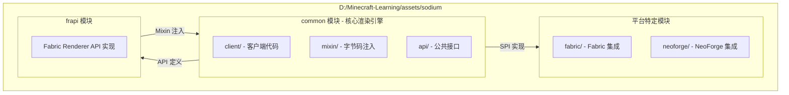
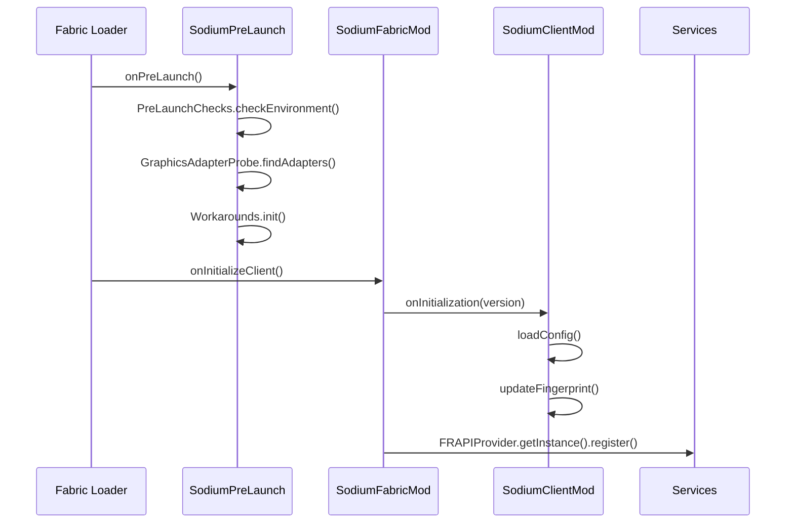
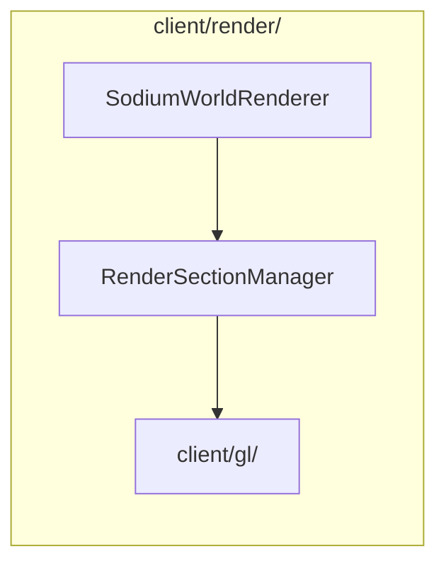
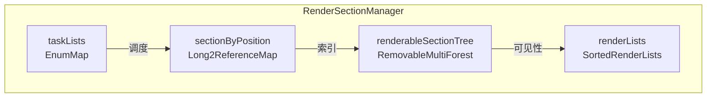

# Sodium 架构概述

> 高性能 Minecraft 渲染优化 Mod 的整体架构设计、模块划分与核心组件分析

---

```yaml
---
title: Sodium 架构概述
description: 分析 Sodium mod 的整体架构设计、模块划分和核心组件
readingTime: 25
subsystem: architecture-overview
---
```

## 目录

[架构设计原则](#架构设计原则)
[模块划分](#模块划分)
[核心入口与初始化流程](#核心入口与初始化流程)
[主要包及职责](#主要包及职责)
[核心类详解](#核心类详解)
[设计模式分析](#设计模式分析)
[课后自查](#课后自查)

---

## 架构设计原则

Sodium 是一个专注于渲染性能优化的 Minecraft 客户端 Mod。其架构设计遵循以下核心原则：

### 平台无关性优先

Sodium 的核心渲染逻辑完全独立于任何模组加载器（Fabric/NeoForge）。通过 **SPI（Service Provider Interface）** 模式将平台特定的代码抽象为服务接口，由各平台模块提供实现。这种设计使得核心代码可以在不同的模组生态系统中复用。

### 异步处理驱动

原版 Minecraft 将所有区块网格构建放在主线程执行，当地图发生大规模变化时（如挖矿、爆炸），会导致明显的帧率下降。Sodium 通过 **工作线程池** 将网格构建任务异步化，确保渲染线程不被阻塞。

### 内存拷贝最小化

区块数据在渲染前需要从主世界状态中「克隆」出来。Sodium 采用 **对象池化** 和 **直接内存操作**，避免频繁的 GC 压力和内存分配开销。

---

## 模块划分

Sodium 项目采用 Gradle 多模块结构，各模块职责明确：



### 模块依赖关系

| 模块 | 依赖 | 职责 |
|------|------|------|
| **common** | Minecraft, Mixin | 包含所有渲染优化逻辑、遮挡剔除、多线程构建、批处理渲染 |
| **fabric** | common, Fabric API | Fabric 平台的入口点、服务注册、Mixin 配置 |
| **neoforge** | common, NeoForge API | NeoForge 平台的入口点、服务注册、Mixin 配置 |
| **frapi** | common, Fabric Renderer API | 为第三方 mod 提供渲染 API 访问能力 |

### 源码目录结构

```
assets/sodium/
├── common/src/main/java/net/caffeinemc/mods/sodium/
│   ├── client/                    # 客户端核心代码
│   │   ├── SodiumClientMod.java  # 客户端入口类
│   │   ├── render/               # 渲染系统
│   │   │   ├── SodiumWorldRenderer.java
│   │   │   ├── chunk/            # 区块渲染子系统
│   │   │   └── gl/               # OpenGL 封装
│   │   ├── model/                # 模型/光照处理
│   │   ├── gui/                  # 配置 GUI
│   │   ├── config/               # 配置系统
│   │   └── services/             # 平台服务接口
│   └── mixin/                    # Mixin 注入代码
├── fabric/src/main/java/
│   └── net/caffeinemc/mods/sodium/fabric/
│       ├── SodiumFabricMod.java  # Fabric 入口
│       └── SodiumPreLaunch.java  # Pre-launch 钩子
├── neoforge/                     # NeoForge 平台代码
└── frapi/                        # Fabric Renderer API 实现
```

---

## 核心入口与初始化流程

### Fabric 平台的初始化链

Sodium 在 Fabric 上的初始化流程分为多个阶段：



### 核心入口类

**1. `SodiumFabricMod` - Fabric 入口点**

```1:32:D:/Minecraft-Learning/assets/sodium/fabric/src/main/java/net/caffeinemc/mods/sodium/fabric/SodiumFabricMod.java
public class SodiumFabricMod implements ClientModInitializer {
    @Override
    public void onInitializeClient() {
        ModContainer mod = FabricLoader.getInstance()
                .getModContainer("sodium")
                .orElseThrow(NullPointerException::new);

        SodiumClientMod.onInitialization(mod.getMetadata().getVersion().getFriendlyString());

        ConfigLoaderFabric.collectConfigEntryPoints();
        ConfigManager.registerConfigsEarly();

        FabricLoader.getInstance()
                .getEntrypoints("frex_flawless_frames", Consumer.class)
                .forEach(api -> api.accept(FlawlessFrames.getProvider()));

        FRAPIProvider.getInstance().register();
    }
}
```

**2. `SodiumClientMod` - 客户端核心**

```1:124:D:/Minecraft-Learning/assets/sodium/common/src/main/java/net/caffeinemc/mods/sodium/client/SodiumClientMod.java
public class SodiumClientMod {
    private static SodiumOptions OPTIONS;
    private static final Logger LOGGER = LoggerFactory.getLogger("Sodium");
    
    public static void onInitialization(String version) {
        // 注册调试屏幕入口
        entries.put(SODIUM_DEBUG_ENTRY_FULL, new SodiumDebugEntry(true));
        
        MOD_VERSION = version;
        OPTIONS = loadConfig();
        updateFingerprint();
    }
    
    public static SodiumOptions options() {
        if (OPTIONS == null) {
            throw new IllegalStateException("Config not yet available");
        }
        return OPTIONS;
    }
}
```

### Pre-Launch 阶段

`SodiumPreLaunch` 在游戏主类初始化之前执行，用于：

```1:15:D:/Minecraft-Learning/assets/sodium/fabric/src/main/java/net/caffeinemc/mods/sodium/fabric/SodiumPreLaunch.java
public class SodiumPreLaunch implements PreLaunchEntrypoint {
    @Override
    public void onPreLaunch() {
        PreLaunchChecks.checkEnvironment();      // 环境检测
        GraphicsAdapterProbe.findAdapters();      // GPU 适配器探测
        Workarounds.init();                        // 驱动兼容性问题修复
    }
}
```

---

## 主要包及职责

### `client/services/` - 平台服务层

这是 Sodium 架构中最关键的设计，通过 SPI 实现平台抽象：

```1:30:D:/Minecraft-Learning/assets/sodium/common/src/main/java/net/caffeinemc/mods/sodium/client/services/Services.java
public class Services {
    public static <T> T load(Class<T> clazz) {
        final T loadedService = ServiceLoader.load(clazz)
                .findFirst()
                .orElseThrow(() -> new NullPointerException("Failed to load service for " + clazz.getName()));
        return loadedService;
    }

    public static <T> T loadOr(Class<T> clazz, Supplier<T> supplier) {
        final T loadedService = ServiceLoader.load(clazz)
                .findFirst()
                .orElse(supplier.get());
        return loadedService;
    }
}
```

核心服务接口包括：

| 接口 | 职责 |
|------|------|
| `PlatformRuntimeInformation` | 提供运行环境信息（开发模式、配置目录） |
| `PlatformBlockAccess` | 平台特定的方块属性查询 |
| `PlatformLevelAccess` | 世界级别数据访问 |
| `PlatformModelAccess` | 模型相关操作 |
| `FluidRendererFactory` | 流体渲染器工厂 |

### `client/render/` - 渲染系统



- **SodiumWorldRenderer**: 世界渲染协调器，持有 `RenderSectionManager`
- **RenderSectionManager**: 管理所有区块渲染节（RenderSection）
- **client/gl/**: OpenGL 函数封装

### `client/render/chunk/` - 区块渲染子系统

这是性能优化的核心区域，包含：

| 包 | 职责 |
|-----|------|
| `compile/` | 异步网格构建任务 |
| `compile/executor/` | 工作线程池（ChunkBuilder） |
| `occlusion/` | 遮挡剔除算法 |
| `region/` | GPU 缓冲区管理 |
| `terrain/` | 地形渲染 Pass |
| `translucent_sorting/` | 半透明区块排序 |

### `client/model/` - 模型与光照

- `light/flat/` - 平面光照管线
- `light/smooth/` - 平滑光照（软阴影）
- `quad/` - 四边形（quad）数据处理

---

## 核心类详解

### 1. `RenderDevice` - OpenGL 设备抽象

```1:27:D:/Minecraft-Learning/assets/sodium/common/src/main/java/net/caffeinemc/mods/sodium/client/gl/device/RenderDevice.java
public interface RenderDevice {
    RenderDevice INSTANCE = new GLRenderDevice();

    CommandList createCommandList();
    
    static void enterManagedCode() {
        RenderDevice.INSTANCE.makeActive();
    }
    
    static void exitManagedCode() {
        RenderDevice.INSTANCE.makeInactive();
    }

    void makeActive();
    void makeInactive();

    GLCapabilities getCapabilities();
    DeviceFunctions getDeviceFunctions();
    int getSubTexelPrecisionBits();
}
```

**职责**：
- 封装所有 OpenGL 操作
- 提供线程安全的命令缓冲
- 管理 OpenGL 上下文状态

**设计模式**：**单例模式** + **工厂方法**（`createCommandList()`）

### 2. `SodiumWorldRenderer` - 世界渲染协调器

```59:103:D:/Minecraft-Learning/assets/sodium/common/src/main/java/net/caffeinemc/mods/sodium/client/render/SodiumWorldRenderer.java
public class SodiumWorldRenderer {
    private final Minecraft client;
    private ClientLevel level;
    private int renderDistance;
    private Vector3d lastCameraPos;
    private RenderSectionManager renderSectionManager;

    public static SodiumWorldRenderer instance() {
        var instance = instanceNullable();
        if (instance == null) {
            throw new IllegalStateException("No renderer attached to active level");
        }
        return instance;
    }
    
    public static SodiumWorldRenderer instanceNullable() {
        var level = Minecraft.getInstance().levelRenderer;
        if (level instanceof LevelRendererExtension extension) {
            return extension.sodium$getWorldRenderer();
        }
        return null;
    }
}
```

**职责**：
- 管理 `RenderSectionManager` 的生命周期
- 处理相机变化检测
- 协调区块更新与渲染
- 支持实体剔除（Entity Culling）

**关键方法**：

| 方法 | 功能 |
|------|------|
| `setupTerrain()` | 每帧开始时设置渲染状态 |
| `drawChunkLayer()` | 执行单个渲染 Pass |
| `scheduleRebuildForChunk()` | 调度区块重建任务 |
| `isEntityVisible()` | 判断实体是否可见 |

### 3. `RenderSectionManager` - 区块渲染管理器

```64:152:D:/Minecraft-Learning/assets/sodium/common/src/main/java/net/caffeinemc/mods/sodium/client/render/chunk/RenderSectionManager.java
public class RenderSectionManager {
    private final ChunkBuilder builder;                    // 工作线程池
    private final RenderRegionManager regions;             // GPU 缓冲区
    private final ClonedChunkSectionCache sectionCache;   // 克隆数据缓存
    private final Long2ReferenceMap<RenderSection> sectionByPosition;
    private final OcclusionCuller occlusionCuller;        // 遮挡剔除器
    private final SortBehavior sortBehavior;               // 半透明排序策略

    public RenderSectionManager(ClientLevel level, int renderDistance, 
                                 SortBehavior sortBehavior, CommandList commandList) {
        this.chunkRenderer = new DefaultChunkRenderer(RenderDevice.INSTANCE, ChunkMeshFormats.COMPACT);
        this.builder = new ChunkBuilder(level, ChunkMeshFormats.COMPACT);
        this.regions = new RenderRegionManager(commandList);
        this.sectionCache = new ClonedChunkSectionCache(this.level);
        this.occlusionCuller = new OcclusionCuller(...);
    }
}
```

**职责**：
- 管理所有可见的 `RenderSection`
- 协调遮挡剔除与可见性更新
- 调度区块构建任务
- 处理区块加载/卸载事件

**核心数据结构**：



### 4. `ChunkBuilder` - 异步构建执行器

```22:106:D:/Minecraft-Learning/assets/sodium/common/src/main/java/net/caffeinemc/mods/sodium/client/render/chunk/compile/executor/ChunkBuilder.java
public class ChunkBuilder {
    private final ChunkJobQueue queue = new ChunkJobQueue();
    private final List<Thread> threads = new ArrayList<>();
    private final ChunkBuildContext localContext;

    public ChunkBuilder(ClientLevel level, ChunkVertexType vertexType) {
        int count = getThreadCount();
        for (int i = 0; i < count; i++) {
            ChunkBuildContext context = new ChunkBuildContext(level, vertexType);
            WorkerRunnable worker = new WorkerRunnable(...);
            Thread thread = new Thread(worker, "Chunk Render Task Executor #" + i);
            thread.setPriority(Math.max(0, Thread.NORM_PRIORITY - 2));
            thread.start();
            this.threads.add(thread);
        }
    }
    
    private static int getOptimalThreadCount() {
        return Mth.clamp(Math.max(getMaxThreadCount() / 3, getMaxThreadCount() - 6), 1, 10);
    }
}
```

**职责**：
- 管理工作线程池
- 调度网格构建任务
- 支持任务窃取负载均衡
- 控制帧预算（frame budget）

**线程数量策略**：自动检测 CPU 核心数，使用 `max(1, min(processors/3, processors-6, 10))`

### 5. `LevelSlice` - 世界数据快照

```48:106:D:/Minecraft-Learning/assets/sodium/common/src/main/java/net/caffeinemc/mods/sodium/client/world/LevelSlice.java
public final class LevelSlice implements BlockAndTintGetter {
    private static final int NEIGHBOR_BLOCK_RADIUS = 2;
    private static final int NEIGHBOR_CHUNK_RADIUS = Mth.roundToward(NEIGHBOR_BLOCK_RADIUS, 16) >> 4;
    
    private final BlockState[][] blockArrays;           // 方块状态数组
    private final DataLayer[][] lightArrays;            // 光照数据
    private final Int2ReferenceMap<BlockEntity>[] blockEntityArrays;
    private final SodiumAuxiliaryLightManager[] auxLightManager;
    private final LevelBiomeSlice biomeSlice;
    private final LevelColorCache biomeColors;

    public static ChunkRenderContext prepare(Level level, SectionPos pos, ClonedChunkSectionCache cache) {
        // 克隆区块数据用于离线程访问
    }
}
```

**职责**：
- 为每个区块构建任务创建数据快照
- 确保线程看到一致的区块状态
- 缓存方块状态、光照、生物群系数据

**内存布局**：
- 每个 `LevelSlice` 包含 5x5x5 = 125 个区块段的副本
- 半径为 2 的邻居区块用于正确的光照计算

---

## 设计模式分析

### 1. SPI（Service Provider Interface）

Sodium 使用 Java 标准 `ServiceLoader` 实现平台抽象：

```mermaid
graph TB
    S["Services.load()<br/>ServiceLoader.load()"]
    
    I1["PlatformRuntimeInformation"]
    I2["PlatformBlockAccess"]
    I3["FluidRendererFactory"]
    
    F1["FabricPlatformImpl"]
    F2["FabricBlockAccess"]
    
    N1["NeoForgePlatformImpl"]
    N2["NeoForgeBlockAccess"]
    
    S --> I1
    S --> I2
    S --> I3
    
    I1 <|-- F1
    I1 <|-- N1
    
    I2 <|-- F2
    I2 <|-- N2
```

通过 `META-INF/services/` 配置文件指定实现类：

```
META-INF/services/net.caffeinemc.mods.sodium.client.services.PlatformRuntimeInformation
= net.caffeinemc.mods.sodium.fabric.FabricPlatformImpl
```

### 2. Mixin 注入模式

Mixin 用于在不修改原版类的情况下扩展功能：

```1:46:D:/Minecraft-Learning/assets/sodium/frapi/src/main/java/net/caffeinemc/mods/sodium/mixin/frapi/BakedModelMixin.java
@Mixin(BlockStateModel.class)
public interface BakedModelMixin extends FabricBlockStateModel {
    @Override
    default void emitQuads(QuadEmitter emitter, BlockAndTintGetter blockView, 
                           BlockPos pos, BlockState state, RandomSource random, 
                           Predicate<@Nullable Direction> cullTest) {
        // 自定义模型渲染逻辑
        List<BlockModelPart> parts = PlatformModelAccess.getInstance()
            .collectPartsOf((BlockStateModel) this, blockView, pos, state, random, ...);
        
        for (int i = 0; i < partCount; ++i) {
            ((FabricBlockModelPart) parts.get(i)).emitQuads(emitter, cullTest);
        }
    }
}
```

### 3. 工厂模式

`FRAPIProvider` 使用简单工厂模式：

```1:14:D:/Minecraft-Learning/assets/sodium/common/src/main/java/net/caffeinemc/mods/sodium/client/services/FRAPIProvider.java
public interface FRAPIProvider {
    FRAPIProvider INSTANCE = Services.loadOr(FRAPIProvider.class, () -> () -> {});
    
    static FRAPIProvider getInstance() {
        return INSTANCE;
    }
    
    void register();
}
```

### 4. 策略模式

半透明排序使用策略模式：

```java
// SortBehavior.java
public interface SortBehavior {
    enum SortMode { OFF, STATIC, DYNAMIC, DYNAMIC_DEFER_NEARBY_ZERO_FRAMES }
    DeferMode getDeferMode();
    PriorityMode getPriorityMode();
}
```

---

## 课后自查

完成本章节学习后，请确认你能够：

- [ ] 绘制 Sodium 的模块依赖关系图，并解释每个模块的职责
- [ ] 描述 Fabric 平台的完整初始化流程（Pre-Launch → ClientModInitializer → onInitialization）
- [ ] 解释 `RenderSectionManager` 如何协调区块的加载、构建和渲染
- [ ] 说明 `LevelSlice` 的设计目的（为异步任务提供一致的世界快照）
- [ ] 分析 Sodium 如何通过 SPI 实现 Fabric/NeoForge 双平台支持

---

## 相关文档

- [02-chunk-render-system.md](02-chunk-render-system.md) - 区块渲染系统详解
- [03-occlusion-culling.md](03-occlusion-culling.md) - 遮挡剔除算法
- [04-render-pipeline.md](04-render-pipeline.md) - 渲染管线流程
- [05-shader-system.md](05-shader-system.md) - 着色器系统
- [06-platform-integration.md](06-platform-integration.md) - 平台集成机制
- [08-configuration-system.md](08-configuration-system.md) - 配置系统

---

*分析时间: 2026-03-24*
*基于 Sodium 源码 v0.8.6+*
