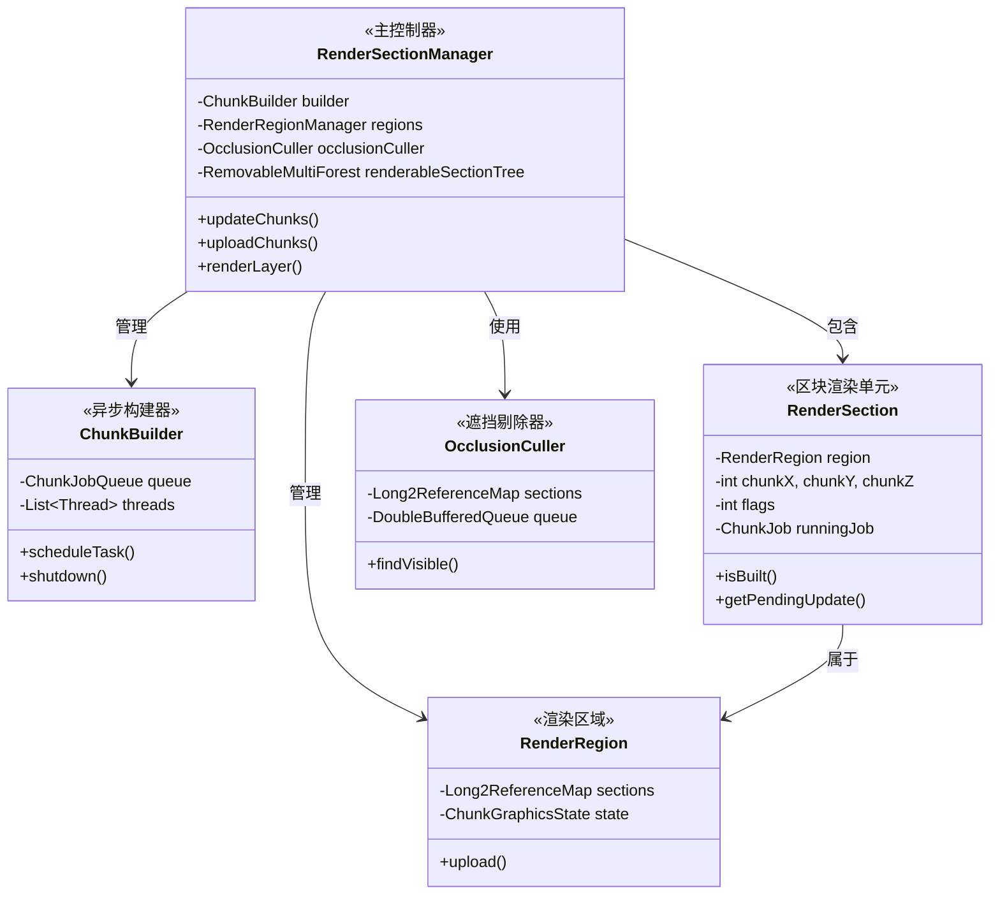
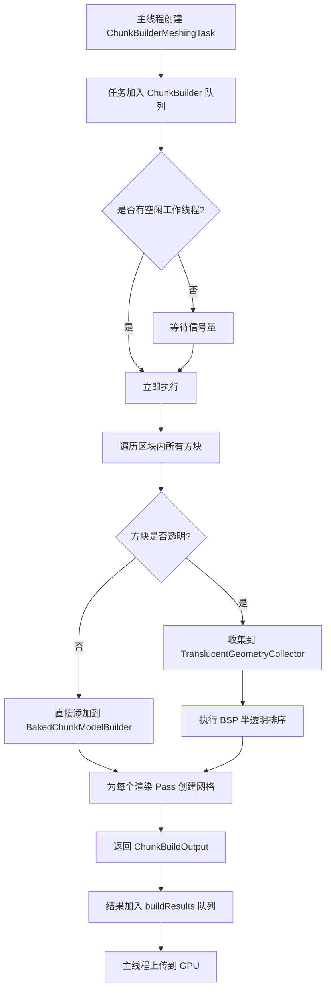
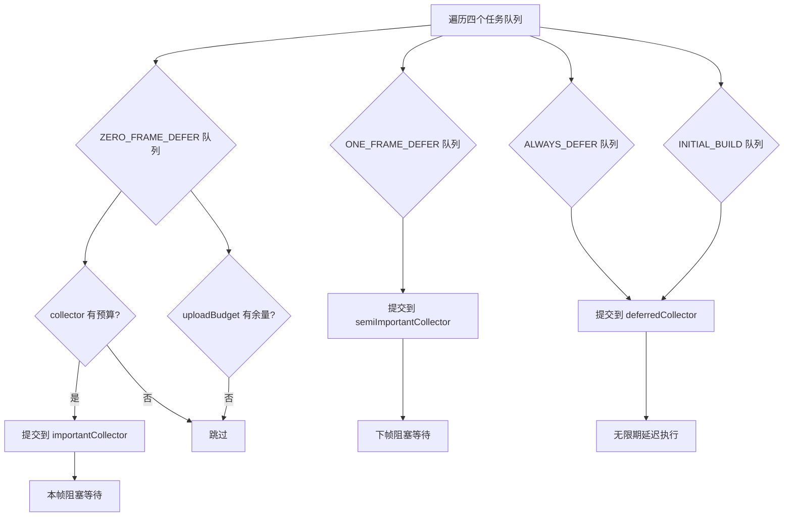
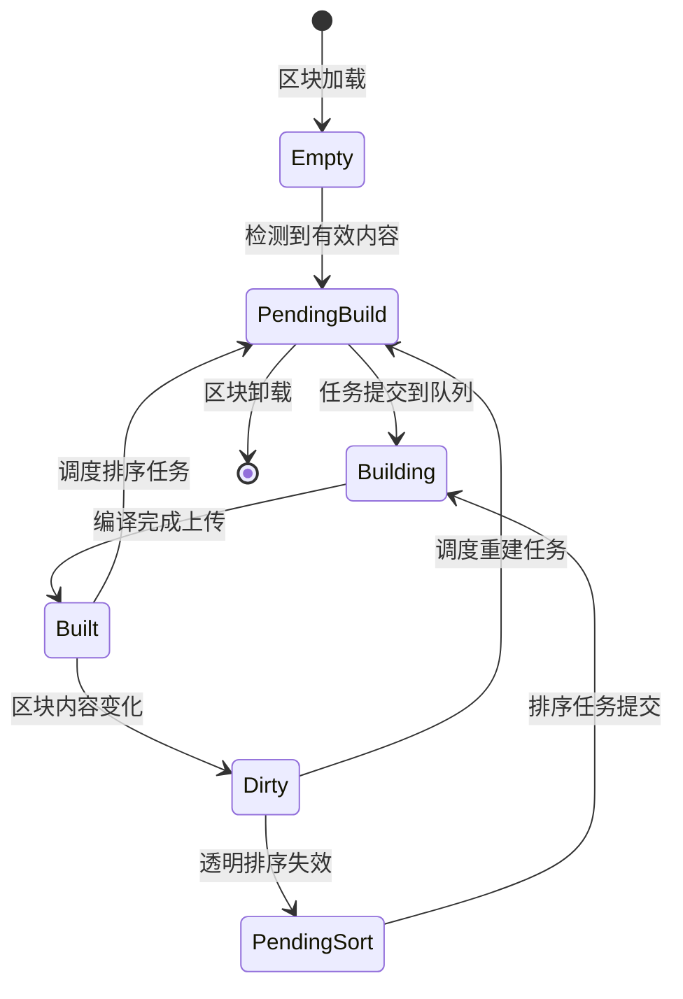
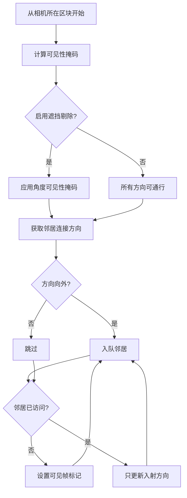

# Sodium 区块渲染系统 (Chunk Render System)

## 目录

- [系统概述](#系统概述)
- [核心组件](#核心组件)
- [区块数据结构](#区块数据结构)
- [异步构建机制](#异步构建机制)
- [多线程调度策略](#多线程调度策略)
- [区块状态管理](#区块状态管理)
- [渲染数据存储结构](#渲染数据存储结构)
- [帧预算控制机制](#帧预算控制机制)
- [遮挡剔除算法](#遮挡剔除算法)
- [课后自查](#课后自查)

---

## 系统概述

Sodium 的区块渲染系统是其高性能渲染的核心子系统，负责将 Minecraft 的区块（Chunk）数据转换为高效的 GPU 渲染指令。该系统通过以下关键技术实现了显著的性能提升：

| 技术 | 作用 |
|------|------|
| **异步网格构建** | 将耗时的区块编译任务从主线程分离到工作线程池 |
| **多级任务队列** | 根据任务重要性分级调度，保证帧率稳定性 |
| **遮挡剔除** | 利用区块间的可见性关系减少不必要的渲染 |
| **增量更新** | 仅在区块内容变化时重新编译，避免全量重建 |
| **帧预算控制** | 智能限制每帧的构建和上传工作量，防止卡顿 |

### 核心设计思想

Sodium 将区块渲染任务分解为两个主要阶段：

1. **编译阶段 (Build Phase)** - 在工作线程中执行，包括：
   - 区块数据采样
   - 模型构建
   - 半透明排序
   
2. **上传阶段 (Upload Phase)** - 在主线程中执行，包括：
   - GPU 数据传输
   - 渲染列表更新

---

## 核心组件

### 组件关系图



### 核心类职责

| 类名 | 职责 | 源码位置 |
|------|------|----------|
| `RenderSectionManager` | 主控制器，协调所有渲染子系统 | `render/chunk/RenderSectionManager.java` |
| `ChunkBuilder` | 工作线程池管理，任务调度 | `render/chunk/compile/executor/ChunkBuilder.java` |
| `RenderSection` | 单个区块的渲染状态持有者 | `render/chunk/RenderSection.java` |
| `RenderRegion` | 区块组管理，优化批量渲染 | `render/chunk/region/RenderRegion.java` |
| `OcclusionCuller` | 区块可见性判断 | `render/chunk/occlusion/OcclusionCuller.java` |
| `BuiltSectionInfo` | 区块编译结果数据 | `render/chunk/data/BuiltSectionInfo.java` |

---

## 区块数据结构

### RenderSection 核心结构

`RenderSection` 是区块渲染的核心状态对象，管理单个 16x16x16 区块的所有渲染相关数据。

```11:60:src/common/src/main/java/net/caffeinemc/mods/sodium/client/render/chunk/RenderSection.java
public class RenderSection {
    // 区块位置信息
    private final int chunkX, chunkY, chunkZ;

    // 遮挡剔除状态 - 可见性数据和邻居连接
    private long visibilityData = VisibilityEncoding.NULL;
    private int incomingDirections;
    private int lastVisibleFrame = -1;
    private int adjacentMask;
    public RenderSection
            adjacentDown, adjacentUp,
            adjacentNorth, adjacentSouth,
            adjacentWest, adjacentEast;

    // 渲染状态
    private boolean built = false;
    private int flags = RenderSectionFlags.NONE;
    private BlockEntity @Nullable[] globalBlockEntities;
    private BlockEntity @Nullable[] culledBlockEntities;
    private TextureAtlasSprite @Nullable[] animatedSprites;
    
    // 半透明排序数据
    @Nullable
    private TranslucentData translucentData;

    // 异步构建状态
    @Nullable
    private ChunkJob runningJob = null;
    private int pendingUpdateType;
    private long pendingUpdateSince;
    
    // 上传状态追踪
    private int lastUploadFrame = -1;
    private int lastSubmittedFrame = -1;
}
```

### 区块标志位系统

`RenderSectionFlags` 使用位标志表示区块包含的内容类型：

```1:50:src/common/src/main/java/net/caffeinemc/mods/sodium/client/render/chunk/RenderSectionFlags.java
public class RenderSectionFlags {
    public static final int NONE = 0;
    public static final int HAS_BLOCK_GEOMETRY = 0;      // 位 0: 有方块几何体
    public static final int HAS_BLOCK_ENTITIES = 1;       // 位 1: 有方块实体
    public static final int HAS_ANIMATED_SPRITES = 2;     // 位 2: 有动画纹理
    // ... 其他标志
}
```

### BuiltSectionInfo 数据容器

编译阶段产出的完整区块信息：

```22:58:src/common/src/main/java/net/caffeinemc/mods/sodium/client/render/chunk/data/BuiltSectionInfo.java
public class BuiltSectionInfo {
    public static final BuiltSectionInfo EMPTY = createEmptyData();

    public final int flags;                    // 渲染标志位
    public final long visibilityData;         // 遮挡可见性数据
    public final BlockEntity @Nullable[] globalBlockEntities;     // 全局方块实体
    public final BlockEntity @Nullable[] culledBlockEntities;      // 可剔除方块实体
    public final TextureAtlasSprite @Nullable[] animatedSprites;     // 动画纹理

    private BuiltSectionInfo(...) {
        // 根据内容构建标志位
        if (!blockRenderPasses.isEmpty()) {
            flags |= 1 << RenderSectionFlags.HAS_BLOCK_GEOMETRY;
        }
        if (!culledBlockEntities.isEmpty()) {
            flags |= 1 << RenderSectionFlags.HAS_BLOCK_ENTITIES;
        }
        if (!animatedSprites.isEmpty()) {
            flags |= 1 << RenderSectionFlags.HAS_ANIMATED_SPRITES;
        }
        
        // 编码遮挡数据
        this.visibilityData = VisibilityEncoding.encode(occlusionData);
    }
}
```

---

## 异步构建机制

### ChunkBuilder 工作线程池

`ChunkBuilder` 使用固定数量的工作线程处理区块编译任务：

```22:47:src/common/src/main/java/net/caffeinemc/mods/sodium/client/render/chunk/compile/executor/ChunkBuilder.java
public class ChunkBuilder {
    private final ChunkJobQueue queue = new ChunkJobQueue();
    private final List<Thread> threads = new ArrayList<>();
    private final AtomicInteger busyThreadCount = new AtomicInteger();

    public ChunkBuilder(ClientLevel level, ChunkVertexType vertexType) {
        int count = getThreadCount();

        for (int i = 0; i < count; i++) {
            ChunkBuildContext context = new ChunkBuildContext(level, vertexType);
            WorkerRunnable worker = new WorkerRunnable("Chunk Render Task Executor #" + i, context);

            Thread thread = new Thread(worker, "Chunk Render Task Executor #" + i);
            thread.setPriority(Math.max(0, Thread.NORM_PRIORITY - 2)); // 降低优先级
            thread.start();

            this.threads.add(thread);
        }
    }

    private static int getOptimalThreadCount() {
        return Mth.clamp(Math.max(getMaxThreadCount() / 3, getMaxThreadCount() - 6), 1, 10);
    }
}
```

**线程数量计算逻辑**：
- 默认策略：`可用CPU核心数 / 3` 或 `可用核心数 - 6`（取较大值）
- 最大限制：10 个线程
- 用户可通过配置 `chunkBuilderThreads` 覆盖

### 工作线程执行循环

```159:202:src/common/src/main/java/net/caffeinemc/mods/sodium/client/render/chunk/compile/executor/ChunkBuilder.java
private class WorkerRunnable implements Runnable {
    @Override
    public void run() {
        while (ChunkBuilder.this.queue.isRunning()) {
            ChunkJob job;
            try {
                job = ChunkBuilder.this.queue.waitForNextJob();
            } catch (InterruptedException ignored) {
                continue;
            }

            if (job == null) {
                continue;
            }

            ChunkBuilder.this.busyThreadCount.getAndIncrement();

            try {
                job.execute(this.context);
            } finally {
                this.context.cleanup();
                ChunkBuilder.this.busyThreadCount.decrementAndGet();
            }
        }
    }
}
```

### 任务队列机制

`ChunkJobQueue` 使用信号量实现线程安全的任务分发：

```12:108:src/common/src/main/java/net/caffeinemc/mods/sodium/client/render/chunk/compile/executor/ChunkJobQueue.java
class ChunkJobQueue {
    private final ConcurrentLinkedDeque<ChunkJob> jobs = new ConcurrentLinkedDeque<>();
    private final AtomicLong jobDurationSum = new AtomicLong();
    private final Semaphore semaphore = new Semaphore(0);
    private final AtomicBoolean isRunning = new AtomicBoolean(true);

    public void add(ChunkJob job, boolean important) {
        if (important) {
            this.jobs.addFirst(job);  // 重要任务插入队首
        } else {
            this.jobs.addLast(job);   // 普通任务加入队尾
        }
        this.jobDurationSum.addAndGet(job.getEstimatedDuration());
        this.semaphore.release(1);
    }

    public ChunkJob waitForNextJob() throws InterruptedException {
        this.semaphore.acquire();
        var job = this.jobs.poll();
        if (job != null) {
            this.jobDurationSum.addAndGet(-job.getEstimatedDuration());
        }
        return job;
    }
}
```

### 区块编译任务流程



### MeshingTask 核心实现

```54:100:src/common/src/main/java/net/caffeinemc/mods/sodium/client/render/chunk/compile/tasks/ChunkBuilderMeshingTask.java
public class ChunkBuilderMeshingTask extends ChunkBuilderTask<ChunkBuildOutput> {
    @Override
    public ChunkBuildOutput execute(ChunkBuildContext buildContext, CancellationToken cancellationToken) {
        BuiltSectionInfo.Builder renderData = new BuiltSectionInfo.Builder();
        VisGraph occluder = new VisGraph();

        ChunkBuildBuffers buffers = buildContext.buffers;
        buffers.init(renderData, this.render.getSectionIndex());

        BlockRenderCache cache = buildContext.cache;
        cache.init(this.renderContext);

        LevelSlice slice = cache.getWorldSlice();

        // 遍历区块内所有方块
        for (int y = minY; y < maxY; y++) {
            for (int z = minZ; z < maxZ; z++) {
                for (int x = minX; x < maxX; x++) {
                    BlockState blockState = slice.getBlockState(x, y, z);

                    if (blockState.isSolidRender()) {
                        occluder.setOpaque(blockPos);  // 记录遮挡数据
                    }
                    // ... 模型渲染逻辑
                }
            }
        }

        // 创建各个渲染 Pass 的网格
        Map<TerrainRenderPass, BuiltSectionMeshParts> meshes = ...;
        
        return new ChunkBuildOutput(this.render, this.submitTime, 
                                   translucentData, renderData.build(), meshes);
    }
}
```

---

## 多线程调度策略

### 任务优先级系统

Sodium 使用多级任务队列系统，根据任务重要性分配不同的执行时机：

```10:54:src/common/src/main/java/net/caffeinemc/mods/sodium/client/render/chunk/ChunkUpdateTypes.java
public class ChunkUpdateTypes {
    public static final int SORT = 0b001;        // 排序任务
    public static final int REBUILD = 0b010;    // 重建任务
    public static final int IMPORTANT = 0b100;  // 重要标记
    public static final int INITIAL_BUILD = 0b1000;  // 初始构建

    public static int getQueueType(int type, ...) {
        if (isInitialBuild(type)) {
            return TaskQueueType.INITIAL_BUILD;
        }
        if (isImportant(type)) {
            if (isRebuild(type)) {
                return importantRebuildQueueType;
            } else {
                return importantSortQueueType;
            }
        }
        return TaskQueueType.ALWAYS_DEFER;
    }
}
```

### 任务队列类型

| 队列类型 | 描述 | 延迟 |
|----------|------|------|
| `ZERO_FRAME_DEFER` | 零帧延迟，重要任务立即执行 | 0 帧 |
| `ONE_FRAME_DEFER` | 一帧延迟，半重要任务 | 1 帧 |
| `ALWAYS_DEFER` | 始终延迟，普通任务 | 无限制 |
| `INITIAL_BUILD` | 初始构建队列 | 初始加载时 |

### 三层收集器架构

`RenderSectionManager.updateChunks()` 使用三个收集器管理不同优先级的任务：

```548:591:src/common/src/main/java/net/caffeinemc/mods/sodium/client/render/chunk/RenderSectionManager.java
public void updateChunks(boolean updateImmediately) {
    this.thisFrameBlockingTasks = 0;
    this.nextFrameBlockingTasks = 0;
    this.deferredTasks = 0;

    var thisFrameBlockingCollector = this.lastBlockingCollector;
    this.lastBlockingCollector = null;
    if (thisFrameBlockingCollector == null) {
        thisFrameBlockingCollector = new ChunkJobCollector(this.buildResults::add);
    }

    if (updateImmediately) {
        // 完美帧：等待所有任务完成
        this.submitSectionTasks(thisFrameBlockingCollector, 
                               thisFrameBlockingCollector, 
                               thisFrameBlockingCollector, 
                               UnlimitedResourceBudget.INSTANCE);
        thisFrameBlockingCollector.awaitCompletion(this.builder);
    } else {
        var remainingDuration = this.builder.getTotalRemainingDuration(this.averageFrameDuration);
        var uploadBudget = new LimitedResourceBudget(...);

        var nextFrameBlockingCollector = new ChunkJobCollector(...);
        var deferredCollector = new ChunkJobCollector(remainingDuration, ...);

        this.submitSectionTasks(thisFrameBlockingCollector, 
                               nextFrameBlockingCollector, 
                               deferredCollector, 
                               uploadBudget);

        // 等待本帧重要任务
        thisFrameBlockingCollector.awaitCompletion(this.builder);
        // 保存半重要任务供下帧等待
        this.lastBlockingCollector = nextFrameBlockingCollector;
    }
}
```

### 任务提交流程图



### 重要性判断逻辑

任务是否标记为"重要"取决于以下因素：

```787:805:src/common/src/main/java/net/caffeinemc/mods/sodium/client/render/chunk/RenderSectionManager.java
public void scheduleRebuild(int x, int y, int z, boolean playerChanged) {
    this.sectionCache.invalidate(x, y, z);
    RenderSection section = this.sectionByPosition.get(SectionPos.asLong(x, y, z));

    if (section != null && section.isBuilt()) {
        int pendingUpdate;

        // 玩家附近且玩家变化 → 标记为重要
        if (playerChanged && this.shouldPrioritizeTask(section, NEARBY_REBUILD_DISTANCE)) {
            pendingUpdate = ChunkUpdateTypes.join(ChunkUpdateTypes.REBUILD, 
                                                  ChunkUpdateTypes.IMPORTANT);
        } else {
            pendingUpdate = ChunkUpdateTypes.REBUILD;
        }

        this.upgradePendingUpdate(section, pendingUpdate);
    }
}

private static final float NEARBY_REBUILD_DISTANCE = Mth.square(16.0f);
```

---

## 区块状态管理

### 区块状态转换



### 区块生命周期管理

```257:285:src/common/src/main/java/net/caffeinemc/mods/sodium/client/render/chunk/RenderSectionManager.java
public void onSectionAdded(int x, int y, int z) {
    long key = SectionPos.asLong(x, y, z);

    if (this.sectionByPosition.containsKey(key)) {
        return;
    }

    // 创建渲染区域和区块对象
    RenderRegion region = this.regions.createForChunk(x, y, z);
    RenderSection renderSection = new RenderSection(region, x, y, z);
    region.addSection(renderSection);

    this.sectionByPosition.put(key, renderSection);

    ChunkAccess chunk = this.level.getChunk(x, z);
    LevelChunkSection section = chunk.getSections()[this.level.getSectionIndexFromSectionY(y)];

    if (section.hasOnlyAir()) {
        this.updateSectionInfo(renderSection, BuiltSectionInfo.EMPTY);
    } else {
        this.renderableSectionTree.add(renderSection);
        renderSection.setPendingUpdate(ChunkUpdateTypes.INITIAL_BUILD, this.lastFrameAtTime);
    }

    this.connectNeighborNodes(renderSection);
    this.markGraphDirty();
}
```

### 邻居节点连接

区块之间通过六方向邻居引用形成图结构，用于遮挡剔除：

```833:855:src/common/src/main/java/net/caffeinemc/mods/sodium/client/render/chunk/RenderSectionManager.java
private void connectNeighborNodes(RenderSection render) {
    for (int direction = 0; direction < GraphDirection.COUNT; direction++) {
        RenderSection adj = this.getRenderSection(render.getChunkX() + GraphDirection.x(direction),
                render.getChunkY() + GraphDirection.y(direction),
                render.getChunkZ() + GraphDirection.z(direction));

        if (adj != null) {
            adj.setAdjacentNode(GraphDirection.opposite(direction), render);
            render.setAdjacentNode(direction, adj);
        }
    }
}
```

### 区块可见性追踪

```358:366:src/common/src/main/java/net/caffeinemc/mods/sodium/client/render/chunk/RenderSectionManager.java
public boolean isSectionVisible(int x, int y, int z) {
    RenderSection render = this.getRenderSection(x, y, z);

    if (render == null) {
        return false;
    }

    return render.getLastVisibleFrame() == this.lastUpdatedFrame;
}
```

---

## 渲染数据存储结构

### RenderRegion 区域管理

`RenderRegion` 将相邻的多个区块组合成更大的渲染单元，以减少 OpenGL 绘制调用次数：

```1:40:src/common/src/main/java/net/caffeinemc/mods/sodium/client/render/chunk/region/RenderRegionManager.java
public class RenderRegionManager {
    private final Long2ReferenceOpenHashMap<RenderRegion> regions = new Long2ReferenceOpenHashMap<>();
    private final StagingBuffer stagingBuffer;

    public RenderRegion createForChunk(int chunkX, int chunkY, int chunkZ) {
        return this.create(chunkX >> RenderRegion.REGION_WIDTH_SH,
                chunkY >> RenderRegion.REGION_HEIGHT_SH,
                chunkZ >> RenderRegion.REGION_LENGTH_SH);
    }

    @NonNull
    private RenderRegion create(int x, int y, int z) {
        var key = RenderRegion.key(x, y, z);
        var instance = this.regions.get(key);

        if (instance == null) {
            this.regions.put(key, instance = new RenderRegion(x, y, z, this.stagingBuffer));
        }
        return instance;
    }
}
```

### 网格数据上传流程

```57:100:src/common/src/main/java/net/caffeinemc/mods/sodium/client/render/chunk/region/RenderRegionManager.java
public void uploadResults(CommandList commandList, Collection<BuilderTaskOutput> results) {
    for (var entry : this.createMeshUploadQueues(results)) {
        this.uploadResults(commandList, entry.getKey(), entry.getValue());
    }
}

private void uploadResults(CommandList commandList, RenderRegion region, 
                          Collection<BuilderTaskOutput> results) {
    var uploads = new ArrayList<PendingSectionMeshUpload>();
    var indexUploads = new ArrayList<PendingSectionIndexBufferUpload>();

    for (BuilderTaskOutput result : results) {
        if (result instanceof ChunkBuildOutput chunkBuildOutput) {
            for (TerrainRenderPass pass : DefaultTerrainRenderPasses.ALL) {
                BuiltSectionMeshParts mesh = chunkBuildOutput.getMesh(pass);
                if (mesh != null) {
                    uploads.add(new PendingSectionMeshUpload(
                        result.render, meshTime, mesh, pass, 
                        new PendingUpload(mesh.getVertexData())));
                }
            }
        }
        // ... 处理索引缓冲区
    }

    // 上传到 GPU
    var resources = region.createResources(commandList);
    if (!uploads.isEmpty()) {
        var arena = resources.getGeometryArena();
        arena.upload(commandList, uploads.stream()
                .map(upload -> upload.vertexUpload), regionFillFractionInv);
    }
}
```

### ChunkBuildBuffers 临时缓冲区

每个工作线程持有独立的缓冲区实例，避免锁竞争：

```23:50:src/common/src/main/java/net/caffeinemc/mods/sodium/client/render/chunk/compile/ChunkBuildBuffers.java
public class ChunkBuildBuffers {
    private final Reference2ReferenceOpenHashMap<TerrainRenderPass, 
                                                   BakedChunkModelBuilder> builders = 
        new Reference2ReferenceOpenHashMap<>();

    public ChunkBuildBuffers(ChunkVertexType vertexType) {
        this.vertexType = vertexType;

        for (TerrainRenderPass pass : DefaultTerrainRenderPasses.ALL) {
            var vertexBuffers = new ChunkMeshBufferBuilder[ModelQuadFacing.COUNT];

            for (int facing = 0; facing < ModelQuadFacing.COUNT; facing++) {
                // 每个朝向一个缓冲区，初始 128KB
                vertexBuffers[facing] = new ChunkMeshBufferBuilder(
                    this.vertexType, 128 * 1024);
            }

            this.builders.put(pass, new BakedChunkModelBuilder(vertexBuffers));
        }
    }
}
```

---

## 帧预算控制机制

### 帧时长追踪

`RenderSectionManager` 持续监控帧时长并计算指数移动平均值：

```154:168:src/common/src/main/java/net/caffeinemc/mods/sodium/client/render/chunk/RenderSectionManager.java
public void prepareFrame(Vector3dc cameraPosition) {
    var now = System.nanoTime();
    this.lastFrameDuration = now - this.lastFrameAtTime;
    this.lastFrameAtTime = now;
    
    if (this.averageFrameDuration == -1) {
        this.averageFrameDuration = this.lastFrameDuration;
    } else {
        this.averageFrameDuration = MathUtil.exponentialMovingAverage(
            this.averageFrameDuration, this.lastFrameDuration, 
            FRAME_DURATION_UPDATE_RATIO);
    }
    this.averageFrameDuration = Mth.clamp(this.averageFrameDuration, 1_000_100, 100_000_000);

    this.frame += 1;
    this.cameraPosition = cameraPosition;
}

private static final float FRAME_DURATION_UPDATE_RATIO = 0.05f;
```

### 资源预算计算

```1:22:src/common/src/main/java/net/caffeinemc/mods/sodium/client/render/chunk/compile/estimation/LimitedResourceBudget.java
public class LimitedResourceBudget implements UploadResourceBudget {
    private long duration;   // 时间预算（纳秒）
    private long size;       // 大小预算（字节）

    @Override
    public boolean isAvailable() {
        return this.duration > 0 && this.size > 0;
    }

    @Override
    public void consume(long duration, long size) {
        this.duration -= duration;
        this.size -= size;
    }
}
```

### 任务调度预算限制

```601:620:src/common/src/main/java/net/caffeinemc/mods/sodium/client/render/chunk/RenderSectionManager.java
private void submitSectionTasks(ChunkJobCollector collector, 
                               UploadResourceBudget uploadBudget, 
                               TaskQueueType queueType) {
    var taskList = this.taskLists.get(queueType);

    // 只要有任务、collector 有预算、uploadBudget 有余量，就继续提交
    while (!taskList.isEmpty() && collector.hasBudgetRemaining() 
           && (uploadBudget.isAvailable() || queueType.allowsUnlimitedUploadDuration())) {
        RenderSection section = taskList.poll();

        if (section == null) {
            break;
        }

        var pendingUpdate = section.getPendingUpdate();
        if (pendingUpdate != 0) {
            submitSectionTask(collector, section, pendingUpdate, 
                            uploadBudget, queueType == TaskQueueType.ZERO_FRAME_DEFER);
        }
    }
}
```

### 任务估算器

系统使用机器学习风格的估算器预测任务耗时：

```270:274:src/common/src/main/java/net/caffeinemc/mods/sodium/client/render/chunk/compile/tasks/ChunkBuilderMeshingTask.java
@Override
public long estimateTaskSizeWith(MeshTaskSizeEstimator estimator) {
    return estimator.estimateSize(this.render);
}
```

---

## 遮挡剔除算法

### 可见性图结构

每个区块存储其遮挡数据，用于判断从特定方向是否能"看到"相邻区块：

```mermaid
flowchart LR
    subgraph ChunkA["区块 A (当前位置)"]
        A1[北向可见]
        A2[东向可见]
        A3[南向可见]
    end
    
    subgraph ChunkB["区块 B"]
        B1[可见性连接]
    end
    
    subgraph ChunkC["区块 C"]
        C1[可见性连接]
    end
    
    A1 --> B1 : 北侧连接
    A2 --> C1 : 东侧连接
```

### OcclusionCuller 剔除逻辑

```31:60:src/common/src/main/java/net/caffeinemc/mods/sodium/client/render/chunk/occlusion/OcclusionCuller.java
public void findVisible(RenderSectionVisitor visitor,
                        Viewport viewport,
                        float searchDistance,
                        boolean useOcclusionCulling,
                        int frame)
{
    final var queues = this.queue;
    queues.reset();

    var initWriteQueue = this.queue.write();
    this.init(visitor, initWriteQueue, viewport, useOcclusionCulling, frame);

    // 逐层遍历
    while (queues.flip()) {
        if (this.outOfWorldRadius > 0) {
            this.initOutsideWorldHeight(queues.write(), viewport, searchDistance, frame);
            this.outOfWorldRadius++;
        }

        processQueue(visitor, viewport, searchDistance, 
                    useOcclusionCulling, frame, queues.read(), queues.write());
    }

    this.addNearbySections(visitor, viewport, frame);
}
```

### 角度可见性计算

根据相机与区块的相对位置关系，计算可能被遮挡的方向：

```111:129:src/common/src/main/java/net/caffeinemc/mods/sodium/client/render/chunk/occlusion/OcclusionCuller.java
private static long getAngleVisibilityMask(Viewport viewport, RenderSection section) {
    var transform = viewport.getTransform();
    var dx = Math.abs(transform.x - section.getCenterX());
    var dy = Math.abs(transform.y - section.getCenterY());
    var dz = Math.abs(transform.z - section.getCenterZ());

    var angleOcclusionMask = 0L;
    // 如果 X 或 Z 距离大于 Y，则上下方向可能被遮挡
    if (dx > dy || dz > dy) {
        angleOcclusionMask |= UP_DOWN_OCCLUDED;
    }
    // 如果 X 或 Y 距离大于 Z，则南北方向可能被遮挡
    if (dx > dz || dy > dz) {
        angleOcclusionMask |= NORTH_SOUTH_OCCLUDED;
    }
    // 如果 Y 或 Z 距离大于 X，则东西方向可能被遮挡
    if (dy > dx || dz > dx) {
        angleOcclusionMask |= WEST_EAST_OCCLUDED;
    }

    return ~angleOcclusionMask;
}
```

### 可见性连接传播

```62:105:src/common/src/main/java/net/caffeinemc/mods/sodium/client/render/chunk/occlusion/OcclusionCuller.java
private static void processQueue(...) {
    RenderSection section;

    while ((section = readQueue.dequeue()) != null) {
        if (!isSectionVisible(section, viewport, searchDistance)) {
            continue;
        }

        visitor.visit(section);

        int connections;

        if (useOcclusionCulling) {
            var sectionVisibilityData = section.getVisibilityData();

            // 应用角度可见性掩码
            sectionVisibilityData &= getAngleVisibilityMask(viewport, section);

            // 获取可通行的邻居方向
            connections = VisibilityEncoding.getConnections(
                sectionVisibilityData, section.getIncomingDirections());
        } else {
            connections = GraphDirectionSet.ALL;  // 无遮挡剔除时所有方向
        }

        // 只向远离相机的方向遍历
        connections &= getOutwardDirections(viewport.getChunkCoord(), section);

        visitNeighbors(writeQueue, section, connections, frame);
    }
}
```

### 剔除流程图



---

## 课后自查

完成本章节学习后，请确认您能够回答以下问题：

### 基础概念

1. **RenderSection 和 RenderRegion 的区别是什么？**
   - 提示：`RenderSection` 对应单个 16x16x16 区块，而 `RenderRegion` 是区块的组合。

2. **为什么 ChunkBuilder 要降低工作线程的优先级？**
   - 提示：考虑与主渲染线程的关系。

3. **任务队列中 `addFirst` 和 `addLast` 的区别是什么？**
   - 提示：重要任务 vs 普通任务的处理顺序。

### 核心机制

4. **帧预算控制是如何避免帧时间超限的？**
   - 提示：`LimitedResourceBudget` 跟踪时间和大小预算。

5. **遮挡剔除算法如何利用区块间的可见性关系？**
   - 提示：`VisibilityEncoding` 和 `getAngleVisibilityMask`。

6. **三层收集器（important/semi-important/deferred）的设计目的是什么？**
   - 提示：考虑帧率稳定性和加载速度的平衡。

### 高级理解

7. **为什么透明区块需要 BSP 排序？**
   - 提示：考虑透明方块的渲染顺序问题。

8. **任务窃取（Task Stealing）机制在什么场景下会触发？**
   - 提示：`awaitCompletion` 方法中的逻辑。

9. **如果一个区块在编译过程中被卸载，会发生什么？**
   - 提示：`isDisposed` 检查和 `setCancelled` 调用。

### 实践应用

10. **如何在 Sodium 基础上实现自定义的区块剔除策略？**
    - 提示：扩展 `OcclusionCuller` 或实现 `RenderSectionVisitor`。

---

## 参考资源

- 源码位置：`D:\Minecraft-Learning\assets\sodium\common\src\main\java\net\caffeinemc\mods\sodium\client\render\chunk\`
- 相关文档：
  - [Sodium 架构概览](./01-architecture-overview.md)
  - [Sodium 渲染管线](./01-architecture-overview.md#渲染管线)
