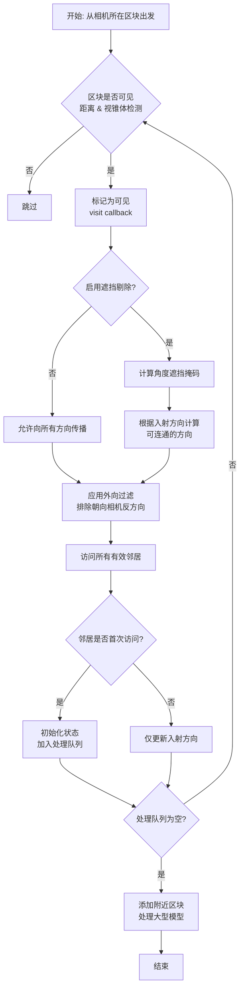
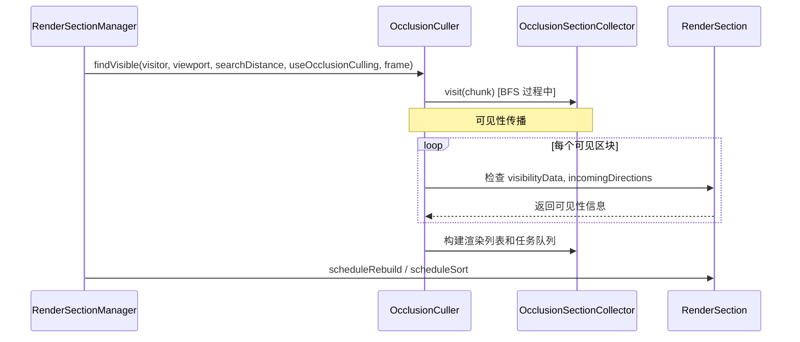

# Sodium 遮挡剔除系统 (Occlusion Culling)

> 分析 Sodium 的遮挡剔除系统，包括可见性传播算法、位掩码编码和角度优化策略

## 基本信息

| 属性 | 值 |
|------|-----|
| 源文件目录 | `assets/Sodium/common/src/main/java/net/caffeinemc/mods/sodium/client/render/chunk/occlusion/` |
| 核心类 | `OcclusionCuller.java`, `VisibilityEncoding.java`, `GraphDirection.java` |
| 分析版本 | Sodium v0.8.6 |
| 预估阅读时间 | 25 分钟 |

---

## 目录

[系统概述](#系统概述)
[核心数据结构](#核心数据结构)
[可见性传播算法](#可见性传播算法)
[位掩码编码机制](#位掩码编码机制)
[角度优化策略](#角度优化策略)
[运行时性能考虑](#运行时性能考虑)
[与渲染系统集成](#与渲染系统集成)
[课后自查](#课后自查)

---

## 系统概述

### 什么是遮挡剔除？

**遮挡剔除（Occlusion Culling）** 是一种渲染优化技术，通过判断物体是否被其他物体遮挡来决定是否需要渲染。在 Minecraft 区块渲染场景中，当玩家看向一堵墙时，墙后面的所有区块理论上都不需要被渲染。

### Sodium 的实现特点

Sodium 的遮挡剔除系统采用**基于图的广度优先搜索（BFS）**算法，而非传统的硬件遮挡查询或深度缓冲检测。这种方法的优势在于：

- **可预测的性能**：算法复杂度与可见区块数量成正比
- **缓存友好**：使用位操作而非条件分支
- **增量更新**：只在区块内容改变时重建可见性数据

### 核心文件一览

| 文件 | 职责 |
|------|------|
| `OcclusionCuller.java` | 主剔除器，实现 BFS 可见性传播 |
| `VisibilityEncoding.java` | 可见性位掩码编码与解码 |
| `GraphDirection.java` | 6 个方向常量定义 |
| `GraphDirectionSet.java` | 方向集合位运算工具 |
| `BlockOcclusionCache.java` | 方块面遮挡判断缓存 |

---

## 核心数据结构

### 图的表示

Sodium 将世界划分为 16x16x16 的**区块切片（Chunk Section）**，每个切片在剔除系统中表示为一个**节点**。节点之间通过 6 个方向的邻接关系形成一张稀疏图。

```startLine:23:44:D:/Minecraft-Learning/assets/Sodium/common/src/main/java/net/caffeinemc/mods/sodium/client/render/chunk/RenderSection.java
public class RenderSection {
    // Occlusion Culling State
    private long visibilityData = VisibilityEncoding.NULL;

    private int incomingDirections;
    private int lastVisibleFrame = -1;

    private int adjacentMask;
    public RenderSection
            adjacentDown,
            adjacentUp,
            adjacentNorth,
            adjacentSouth,
            adjacentWest,
            adjacentEast;
```

每个 `RenderSection` 维护以下遮挡相关状态：

- **`visibilityData`**：64 位长整型，编码该区块的可见性信息
- **`incomingDirections`**：记录当前帧中有哪些方向"看到"了这个区块
- **`lastVisibleFrame`**：该区块最近一次被判定为可见的帧编号
- **`adjacentMask`**：位掩码，标记哪些方向的邻居区块存在

### 方向枚举

```startLine:1:14:D:/Minecraft-Learning/assets/Sodium/common/src/main/java/net/caffeinemc/mods/sodium/client/render/chunk/occlusion/GraphDirection.java
public class GraphDirection {
    public static final int DOWN    = 0;
    public static final int UP      = 1;
    public static final int NORTH   = 2;
    public static final int SOUTH   = 3;
    public static final int WEST    = 4;
    public static final int EAST    = 5;

    public static final int COUNT   = 6;
```

6 个方向使用 0-5 的整数索引，配合 `GraphDirectionSet` 进行位运算：

```startLine:1:14:D:/Minecraft-Learning/assets/Sodium/common/src/main/java/net/caffeinemc/mods/sodium/client/render/chunk/occlusion/GraphDirectionSet.java
public class GraphDirectionSet {
    public static final int NONE    = 0;
    public static final int ALL     = (1 << GraphDirection.COUNT) - 1;  // = 0b111111 = 63
```

### 区块邻接关系

区块的 6 个邻居通过 `setAdjacentNode` 方法设置，同时更新 `adjacentMask`：

```startLine:97:113:D:/Minecraft-Learning/assets/Sodium/common/src/main/java/net/caffeinemc/mods/sodium/client/render/chunk/RenderSection.java
public void setAdjacentNode(int direction, RenderSection node) {
    if (node == null) {
        this.adjacentMask &= ~GraphDirectionSet.of(direction);
    } else {
        this.adjacentMask |= GraphDirectionSet.of(direction);
    }

    switch (direction) {
        case GraphDirection.DOWN -> this.adjacentDown = node;
        case GraphDirection.UP -> this.adjacentUp = node;
        // ... 其他方向
    }
}
```

---

## 可见性传播算法

### 算法流程图



### BFS 核心实现

```startLine:31:60:D:/Minecraft-Learning/assets/Sodium/common/src/main/java/net/caffeinemc/mods/sodium/client/render/chunk/occlusion/OcclusionCuller.java
public void findVisible(RenderSectionVisitor visitor,
                        Viewport viewport,
                        float searchDistance,
                        boolean useOcclusionCulling,
                        int frame)
{
    final var queues = this.queue;
    queues.reset();

    var initWriteQueue = this.queue.write();
    this.init(visitor, initWriteQueue, viewport, useOcclusionCulling, frame);

    // 处理相机在世界高度范围外的情况（钻石螺旋初始化）
    if (this.outOfWorldRadius == 0) {
        while (initWriteQueue.isEmpty() && this.initOutsideWorldHeight(initWriteQueue, viewport, searchDistance, frame)) {
            this.outOfWorldRadius++;
        }
    }

    // 双缓冲队列：读写交替执行
    while (queues.flip()) {
        if (this.outOfWorldRadius > 0) {
            this.initOutsideWorldHeight(queues.write(), viewport, searchDistance, frame);
            this.outOfWorldRadius++;
        }

        processQueue(visitor, viewport, searchDistance, useOcclusionCulling, frame, queues.read(), queues.write());
    }

    // 处理相机附近可能有大型模型的区块
    this.addNearbySections(visitor, viewport, frame);
}
```

### 双缓冲队列机制

Sodium 使用**双缓冲队列**避免在遍历过程中修改数据结构：

```startLine:1:50:D:/Minecraft-Learning/assets/Sodium/common/src/main/java/net/caffeinemc/mods/sodium/client/util/collections/DoubleBufferedQueue.java
public final class DoubleBufferedQueue<E> {
    private QueueImpl<E> read, write;

    public boolean flip() {
        if (this.write.size() == 0) {
            return false;
        }

        var tmp = this.read;
        this.read = this.write;
        this.write = tmp;

        this.write.clear();

        return true;
    }
```

流程：
1. 初始时，所有节点入队到 `write` 队列
2. `flip()` 交换读写队列
3. 从 `read` 队列出队处理，将新发现的邻居入队到 `write` 队列
4. 重复直到 `write` 队列为空

### 处理队列主循环

```startLine:62:105:D:/Minecraft-Learning/assets/Sodium/common/src/main/java/net/caffeinemc/mods/sodium/client/render/chunk/occlusion/OcclusionCuller.java
private static void processQueue(RenderSectionVisitor visitor,
                                 Viewport viewport,
                                 float searchDistance,
                                 boolean useOcclusionCulling,
                                 int frame,
                                 ReadQueue<RenderSection> readQueue,
                                 WriteQueue<RenderSection> writeQueue)
{
    RenderSection section;

    while ((section = readQueue.dequeue()) != null) {
        if (!isSectionVisible(section, viewport, searchDistance)) {
            continue;
        }

        visitor.visit(section);

        int connections;

        {
            if (useOcclusionCulling) {
                var sectionVisibilityData = section.getVisibilityData();

                // 应用角度优化：排除不可能被看到的相反方向
                sectionVisibilityData &= getAngleVisibilityMask(viewport, section);

                // 计算连通方向：根据入射方向和可见性数据获取可传播的方向
                connections = VisibilityEncoding.getConnections(
                    sectionVisibilityData, 
                    section.getIncomingDirections()
                );
            } else {
                // 未启用遮挡剔除：允许向所有方向传播
                connections = GraphDirectionSet.ALL;
            }

            // 过滤：只允许从相机位置向外传播
            connections &= getOutwardDirections(viewport.getChunkCoord(), section);
        }

        visitNeighbors(writeQueue, section, connections, frame);
    }
}
```

### 入射方向与可见性传播

关键洞察：当光从方向 A 进入一个区块后，可能会从多个方向出去。这通过 **`incomingDirections`** 累积实现：

```startLine:174:185:D:/Minecraft-Learning/assets/Sodium/common/src/main/java/net/caffeinemc/mods/sodium/client/render/chunk/occlusion/OcclusionCuller.java
private static void visitNode(final WriteQueue<RenderSection> queue, @NonNull RenderSection render, int incoming, int frame) {
    if (render.getLastVisibleFrame() != frame) {
        // 首次访问：初始化状态并加入队列
        render.setLastVisibleFrame(frame);
        render.setIncomingDirections(GraphDirectionSet.NONE);

        queue.enqueue(render);
    }

    // 累积入射方向（可能有多个方向同时"看到"这个区块）
    render.addIncomingDirections(incoming);
}
```

### 外向过滤

外向过滤确保搜索只从相机位置向外扩散，不会往回走：

```startLine:187:200:D:/Minecraft-Learning/assets/Sodium/common/src/main/java/net/caffeinemc/mods/sodium/client/render/chunk/occlusion/OcclusionCuller.java
private static int getOutwardDirections(SectionPos origin, RenderSection section) {
    int planes = 0;

    planes |= section.getChunkX() <= origin.getX() ? 1 << GraphDirection.WEST  : 0;
    planes |= section.getChunkX() >= origin.getX() ? 1 << GraphDirection.EAST  : 0;

    planes |= section.getChunkY() <= origin.getY() ? 1 << GraphDirection.DOWN  : 0;
    planes |= section.getChunkY() >= origin.getY() ? 1 << GraphDirection.UP    : 0;

    planes |= section.getChunkZ() <= origin.getZ() ? 1 << GraphDirection.NORTH : 0;
    planes |= section.getChunkZ() >= origin.getZ() ? 1 << GraphDirection.SOUTH : 0;

    return planes;
}
```

---

## 位掩码编码机制

### 6x6 可见性矩阵

每个区块维护一个 **6x6 的可见性矩阵**，表示"从方向 X 可以看到方向 Y"的关系：

```
       → 能看到的方向 (to)
       DOWN  UP  NORTH SOUTH WEST EAST
       ┌─────┬─────┬─────┬─────┬─────┬─────┐
 DOWN  │  0  │  1  │  0  │  0  │  0  │  0  │
       ├─────┼─────┼─────┼─────┼─────┼─────┤
 UP    │  1  │  0  │  0  │  0  │  0  │  0  │
       ├─────┼─────┼─────┼─────┼─────┼─────┤
FROM   NORTH│  0  │  0  │  0  │  1  │  0  │  0  │
       ├─────┼─────┼─────┼─────┼─────┼─────┤
       │  0  │  0  │  1  │  0  │  0  │  0  │
       ├─────┼─────┼─────┼─────┼─────┼─────┤
 WEST  │  0  │  0  │  0  │  0  │  0  │  1  │
       ├─────┼─────┼─────┼─────┼─────┼─────┤
 EAST  │  0  │  0  │  0  │  0  │  1  │  0  │
       └─────┴─────┴─────┴─────┴─────┴─────┘
```

例如：
- 石头方块（实心）：只有主对角线为 1（完全阻挡视线）
- 树叶方块：几乎所有方向都可以通过
- 玻璃方块：可能只有部分方向阻挡

### 位打包方式

Sodium 使用 **64 位长整型** 打包 36 个布尔值（6x6），每个位置占 1 位：

```startLine:24:26:D:/Minecraft-Learning/assets/Sodium/common/src/main/java/net/caffeinemc/mods/sodium/client/render/chunk/occlusion/VisibilityEncoding.java
public static int bit(int from, int to) {
    return (from * 8) + to;
}
```

**位索引计算**：`bit(from, to) = from * 8 + to`

```
方向索引:  DOWN=0, UP=1, NORTH=2, SOUTH=3, WEST=4, EAST=5

位分布：
┌────────────────────────────────────────────────────────────────────────────┐
│ Bit 63-56 │ Bit 55-48 │ Bit 47-40 │ Bit 39-32 │ Bit 31-24 │ Bit 23-16 │ B15-8 │ B7-0 │
│   FROM=6  │  FROM=5   │  FROM=4   │  FROM=3   │  FROM=2   │  FROM=1   │FROM=0 │  --   │
│  (unused) │  (EAST)   │  (WEST)  │  (SOUTH)  │  (NORTH) │   (UP)   │(DOWN) │       │
└────────────────────────────────────────────────────────────────────────────┘

实际使用 36 位，每组 8 位，但只使用前 6 位

DOWN 行 (from=0):  bit 0-5  存储 [DOWN→D, DOWN→U, DOWN→N, DOWN→S, DOWN→W, DOWN→E]
UP 行 (from=1):    bit 8-13 存储 [UP→D, UP→U, UP→N, UP→S, UP→W, UP→E]
NORTH 行 (from=2): bit 16-21
SOUTH 行 (from=3): bit 24-29
WEST 行 (from=4):  bit 32-37
EAST 行 (from=5):  bit 40-45
```

### 从 Minecraft VisibilitySet 编码

Minecraft 原版使用 `VisibilitySet` 存储方向集合，Sodium 将其编码为位掩码：

```startLine:10:22:D:/Minecraft-Learning/assets/Sodium/common/src/main/java/net/caffeinemc/mods/sodium/client/render/chunk/occlusion/VisibilityEncoding.java
public static long encode(@NonNull VisibilitySet occlusionData) {
    long visibilityData = 0;

    for (int from = 0; from < GraphDirection.COUNT; from++) {
        for (int to = 0; to < GraphDirection.COUNT; to++) {
            if (occlusionData.visibilityBetween(GraphDirection.toEnum(from), GraphDirection.toEnum(to))) {
                visibilityData |= 1L << bit(from, to);
            }
        }
    }

    return visibilityData;
}
```

### 连接计算：折叠算法

给定入射方向集合，计算所有可能的出射方向：

```startLine:29:36:D:/Minecraft-Learning/assets/Sodium/common/src/main/java/net/caffeinemc/mods/sodium/client/render/chunk/occlusion/VisibilityEncoding.java
// Returns a merged bit-field of the outgoing directions for each incoming direction
public static int getConnections(long visibilityData, int incoming) {
    return foldOutgoingDirections(visibilityData & createMask(incoming));
}

// Returns a merged bit-field of any possible outgoing directions
public static int getConnections(long visibilityData) {
    return foldOutgoingDirections(visibilityData);
}
```

### 折叠算法详解

`createMask` 将入射方向的 6 位扩展为 36 位的掩码：

```startLine:38:41:D:/Minecraft-Learning/assets/Sodium/common/src/main/java/net/caffeinemc/mods/sodium/client/render/chunk/occlusion/VisibilityEncoding.java
private static long createMask(int incoming) {
    // 扩展：每个入射方向复制 6 次
    var expanded = (0b0000001_0000001_0000001_0000001_0000001_0000001L * Integer.toUnsignedLong(incoming));
    // 掩码：只保留每组的前 6 位
    return (expanded & 0b00000001_00000001_00000001_00000001_00000001_00000001L) * 0xFF;
}
```

示例：假设 `incoming = 0b001010`（UP 和 NORTH 方向）

```
expanded = 0b001010001010001010001010001010001010001010
mask     = 0b00000001_00000001_00000001_00000001_00000001_00000001
结果 = 每组只有 bit 0 被置位
```

折叠操作将 6 个方向列压缩为 1 个方向位：

```startLine:43:50:D:/Minecraft-Learning/assets/Sodium/common/src/main/java/net/caffeinemc/mods/sodium/client/render/chunk/occlusion/VisibilityEncoding.java
private static int foldOutgoingDirections(long data) {
    long folded = data;
    folded |= folded >> 32; // 折叠高 32 位到低 32 位
    folded |= folded >> 16; // 折叠高 16 位到低 16 位
    folded |= folded >> 8;  // 折叠高 8 位到低 8 位

    return (int) (folded & GraphDirectionSet.ALL); // 只取低 6 位
}
```

**折叠过程可视化**：

```
折叠前 (36 位，分 6 组):
┌──────────┬──────────┬──────────┬──────────┬──────────┬──────────┐
│ GROUP_5  │ GROUP_4  │ GROUP_3  │ GROUP_2  │ GROUP_1  │ GROUP_0  │
│ EAST     │ WEST     │ SOUTH    │ NORTH    │ UP       │ DOWN     │
└──────────┴──────────┴──────────┴──────────┴──────────┴──────────┘
 001010      000000      000000      100100      000000      000000

折叠后:
Step 1: >>= 32
        [GROUP_5+4]    [GROUP_3+2]    [GROUP_1+0]
        001010          100100         000000
        OR 001010       OR 100100      = 100100
        
Step 2: >>= 16  
        [top 16]        [bottom 16]
        100100          100100
        OR = 100100
        
Step 3: >>= 8
        [top 8]         [bottom 8]
        100100          100100
        OR = 100100

最终结果 = 0b100100 = NORTH | SOUTH
```

---

## 角度优化策略

### 核心思想

当相机偏离区块中心时，某些相反方向（如正北和正南）不可能同时被看到。角度优化通过**预计算并排除不可能的视线路径**来减少搜索空间。

### 实现逻辑

```startLine:111:129:D:/Minecraft-Learning/assets/Sodium/common/src/main/java/net/caffeinemc/mods/sodium/client/render/chunk/occlusion/OcclusionCuller.java
private static long getAngleVisibilityMask(Viewport viewport, RenderSection section) {
    var transform = viewport.getTransform();
    var dx = Math.abs(transform.x - section.getCenterX());
    var dy = Math.abs(transform.y - section.getCenterY());
    var dz = Math.abs(transform.z - section.getCenterZ());

    var angleOcclusionMask = 0L;
    
    // Y 轴距离最大：排除上下方向
    if (dx > dy || dz > dy) {
        angleOcclusionMask |= UP_DOWN_OCCLUDED;
    }
    
    // Z 轴距离最大：排除南北方向
    if (dx > dz || dy > dz) {
        angleOcclusionMask |= NORTH_SOUTH_OCCLUDED;
    }
    
    // X 轴距离最大：排除东西方向
    if (dy > dx || dz > dx) {
        angleOcclusionMask |= WEST_EAST_OCCLUDED;
    }

    return ~angleOcclusionMask; // 返回保留的方向
}
```

### 预定义遮挡掩码

```startLine:107:109:D:/Minecraft-Learning/assets/Sodium/common/src/main/java/net/caffeinemc/mods/sodium/client/render/chunk/occlusion/OcclusionCuller.java
private static final long UP_DOWN_OCCLUDED = 
    (1L << VisibilityEncoding.bit(GraphDirection.DOWN, GraphDirection.UP)) | 
    (1L << VisibilityEncoding.bit(GraphDirection.UP, GraphDirection.DOWN));
private static final long NORTH_SOUTH_OCCLUDED = 
    (1L << VisibilityEncoding.bit(GraphDirection.NORTH, GraphDirection.SOUTH)) | 
    (1L << VisibilityEncoding.bit(GraphDirection.SOUTH, GraphDirection.NORTH));
private static final long WEST_EAST_OCCLUDED = 
    (1L << VisibilityEncoding.bit(GraphDirection.WEST, GraphDirection.EAST)) | 
    (1L << VisibilityEncoding.bit(GraphDirection.EAST, GraphDirection.WEST));
```

### 几何解释

```
相机位置与区块中心的关系：

情况 1: dy 最大（相机在上方或下方）
         相机
           ▼
    ┌───────────┐
    │           │
    │    ███    │  ← 区块
    │           │
    └───────────┘
    不能同时看到 DOWN→UP 或 UP→DOWN

情况 2: dz 最大（相机在正北或正南）
    相机在北 → 不能同时看到 NORTH→SOUTH
    相机在南 → 不能同时看到 SOUTH→NORTH

情况 3: dx 最大（相机在正东或正西）
    相机在东 → 不能同时看到 EAST→WEST
    相机在西 → 不能同时看到 WEST→EAST
```

### 优化效果

假设相机在区块正上方附近：
- `dx ≈ 0, dz ≈ 0, dy >> 0`
- 触发 `UP_DOWN_OCCLUDED`
- 所有经过上下方向的可见性路径被排除

---

## 运行时性能考虑

### 距离计算优化

使用**圆柱形雾距**算法（vanilla 风格）：

```startLine:202:218:D:/Minecraft-Learning/assets/Sodium/common/src/main/java/net/caffeinemc/mods/sodium/client/render/chunk/occlusion/OcclusionCuller.java
private static boolean isWithinRenderDistance(CameraTransform camera, RenderSection section, float maxDistance) {
    // 计算区块边界到相机位置的最近点
    int ox = section.getOriginX() - camera.intX;
    int oy = section.getOriginY() - camera.intY;
    int oz = section.getOriginZ() - camera.intZ;

    float dx = nearestToZero(ox - 1, ox + 17) - camera.fracX;
    float dy = nearestToZero(oy - 1, oy + 17) - camera.fracY;
    float dz = nearestToZero(oz - 1, oz + 17) - camera.fracZ;

    // 圆柱距离 = max(水平距离, 垂直距离)
    return (((dx * dx) + (dz * dz)) < (maxDistance * maxDistance)) && (Math.abs(dy) < maxDistance);
}
```

### 早期退出

```startLine:135:148:D:/Minecraft-Learning/assets/Sodium/common/src/main/java/net/caffeinemc/mods/sodium/client/render/chunk/occlusion/OcclusionCuller.java
private static void visitNeighbors(final WriteQueue<RenderSection> queue, RenderSection section, int outgoing, int frame) {
    // 只处理存在的邻居
    outgoing &= section.getAdjacentMask();

    // 快速退出：没有有效连接
    if (outgoing == GraphDirectionSet.NONE) {
        return;
    }

    // 帮助编译器优化：预分配容量
    queue.ensureCapacity(6);
```

### 视锥体剔除集成

在 BFS 之前先做视锥体检测：

```startLine:131:133:D:/Minecraft-Learning/assets/Sodium/common/src/main/java/net/caffeinemc/mods/sodium/client/render/chunk/occlusion/OcclusionCuller.java
private static boolean isSectionVisible(RenderSection section, Viewport viewport, float maxDistance) {
    return isWithinRenderDistance(viewport.getTransform(), section, maxDistance) && isWithinFrustum(viewport, section);
}
```

### 大型模型特殊处理

对于附近可能有大型模型的区块（如大型建筑、植物），使用更宽松的包围盒检测：

```startLine:238:268:D:/Minecraft-Learning/assets/Sodium/common/src/main/java/net/caffeinemc/mods/sodium/client/render/chunk/occlusion/OcclusionCuller.java
private void addNearbySections(RenderSectionVisitor visitor, Viewport viewport, int frame) {
    var origin = viewport.getChunkCoord();

    // 检查相机所在区块周围的 26 个邻居（3x3x3 减 1）
    for (var dx = -1; dx <= 1; dx++) {
        for (var dy = -1; dy <= 1; dy++) {
            for (var dz = -1; dz <= 1; dz++) {
                if (dx == 0 && dy == 0 && dz == 0) {
                    continue;
                }

                var section = this.getRenderSection(originX + dx, originY + dy, originZ + dz);

                // 使用宽松视锥体检测（更大的边距）
                if (section != null && section.getLastVisibleFrame() != frame 
                    && isWithinNearbySectionFrustum(viewport, section)) {
                    section.setLastVisibleFrame(frame);
                    visitor.visit(section);
                }
            }
        }
    }
}
```

---

## 与渲染系统集成

### 调用流程



### 渲染管理器集成

```startLine:176:205:D:/Minecraft-Learning/assets/Sodium/common/src/main/java/net/caffeinemc/mods/sodium/client/render/chunk/RenderSectionManager.java
private boolean createTerrainRenderList(Camera camera, Viewport viewport, FogParameters fogParameters, int frame, boolean spectator) {
    this.resetRenderLists();

    final var searchDistance = this.getSearchDistance(fogParameters);
    final var useOcclusionCulling = this.shouldUseOcclusionCulling(camera, spectator);

    if (this.isOutOfGraph(viewport.getChunkCoord())) {
        // 图不完整：使用树遍历
        var visitor = new TreeSectionCollector(...);
        this.renderableSectionTree.traverse(visitor, viewport, searchDistance);
    } else {
        // 图完整：使用遮挡剔除
        var visitor = new OcclusionSectionCollector(frame, importantRebuildQueueType, importantSortQueueType);
        this.occlusionCuller.findVisible(visitor, viewport, searchDistance, useOcclusionCulling, frame);
    }

    this.sectionCollector = visitor;
    this.taskLists = this.sectionCollector.getTaskLists();

    return this.sectionCollector.needsRevisitForPendingUpdates();
}
```

### 遮挡数据生成

区块网格构建时生成可见性数据：

```startLine:46:58:D:/Minecraft-Learning/assets/Sodium/common/src/main/java/net/caffeinemc/mods/sodium/client/render/chunk/data/BuiltSectionInfo.java
private BuiltSectionInfo(@NonNull Collection<TerrainRenderPass> blockRenderPasses,
                         @NonNull Collection<BlockEntity> globalBlockEntities,
                         @NonNull Collection<BlockEntity> culledBlockEntities,
                         @NonNull Collection<TextureAtlasSprite> animatedSprites,
                         @NonNull VisibilitySet occlusionData) {
    // ...

    this.visibilityData = VisibilityEncoding.encode(occlusionData);
}
```

### 区块面遮挡判断

`BlockOcclusionCache` 负责判断单个方块的面是否应该被渲染：

```startLine:40:82:D:/Minecraft-Learning/assets/Sodium/common/src/main/java/net/caffeinemc/mods/sodium/client/render/chunk/compile/pipeline/BlockOcclusionCache.java
public boolean shouldDrawSide(BlockState selfBlockState, BlockGetter view, BlockPos selfPos, Direction facing) {
    BlockPos.MutableBlockPos neighborPos = this.cachedPositionObject;
    neighborPos.setWithOffset(selfPos, facing);

    BlockState neighborBlockState = view.getBlockState(neighborPos);
    VoxelShape neighborShape = neighborBlockState.getFaceOcclusionShape(DirectionUtil.getOpposite(facing));

    // 完全遮挡：邻居是完全方块
    if (isFullShape(neighborShape)) {
        return false;
    }

    // 跳过渲染：特殊方块行为（如树叶内部面）
    if (selfBlockState.skipRendering(neighborBlockState, facing)) {
        return false;
    }

    // 透明邻居：不能遮挡任何东西
    if (isEmptyShape(neighborShape) || !neighborBlockState.canOcclude()) {
        return true;
    }

    // 需要精确形状比较
    return this.lookup(selfShape, neighborShape);
}
```

---

## 算法复杂度分析

### 时间复杂度

| 阶段 | 复杂度 | 说明 |
|------|--------|------|
| BFS 遍历 | O(V + E) | V=可见区块数, E=邻接边数 |
| 角度优化 | O(1) | 简单的距离比较和位运算 |
| 位掩码操作 | O(1) | 固定大小的位运算 |

最坏情况下 V 接近渲染距离内的所有区块数，E ≈ 6V（每个区块最多 6 条边）。

### 空间复杂度

| 数据结构 | 空间 | 说明 |
|----------|------|------|
| 双缓冲队列 | O(W) | W = 当前帧处理的区块数 |
| 可见性矩阵 | O(1) | 每区块 64 位 |
| 方向集合 | O(1) | 每区块 1 个 int |

### 性能优化技巧

1. **位操作代替分支**：方向检测使用 `GraphDirectionSet.contains()` 而非 switch
2. **缓存友好**：BFS 按层遍历，访问模式连续
3. **早期退出**：无效方向立即跳过
4. **零分配**：使用 `DoubleBufferedQueue` 避免 GC

---

## 课后自查

完成本章节学习后，请确认你能够：

- [ ] 解释 Sodium 遮挡剔除系统使用 BFS 而非硬件遮挡查询的原因
- [ ] 描述 6x6 可见性矩阵中 `visibilityBetween(from, to)` 的含义
- [ ] 计算位掩码索引：`bit(Direction.NORTH, Direction.SOUTH)` 返回多少？
- [ ] 解释双缓冲队列 `flip()` 的作用，为什么不能直接用单个队列？
- [ ] 说明角度优化 `getAngleVisibilityMask` 如何排除不可能的视线路径
- [ ] 追踪从 `RenderSectionManager.update()` 到 `OcclusionCuller.findVisible()` 的调用链
- [ ] 分析当 `useOcclusionCulling = false` 时，算法退化为简单的什么搜索？

---

## 相关文档

- [01-architecture-overview.md](01-architecture-overview.md) - Sodium 整体架构
- [02-chunk-render-system.md](02-chunk-render-system.md) - 区块渲染系统
- [04-render-pipeline.md](04-render-pipeline.md) - 渲染管线流程

---

*生成时间: 2026-03-24*
*基于 Sodium v0.8.6 源码分析*
