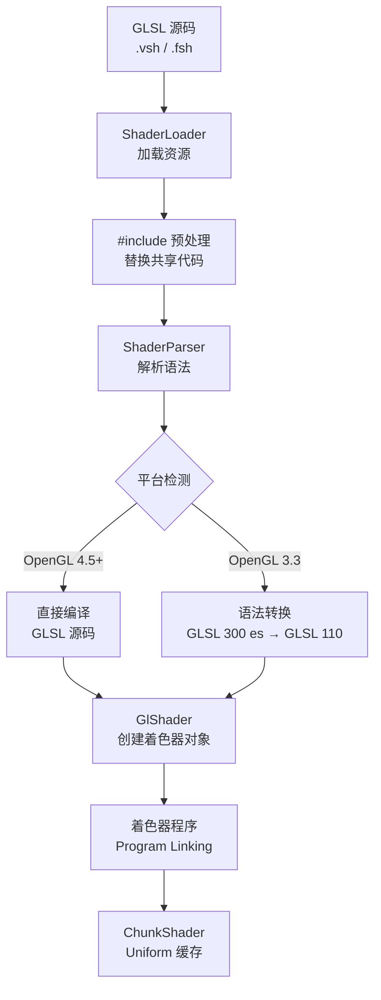
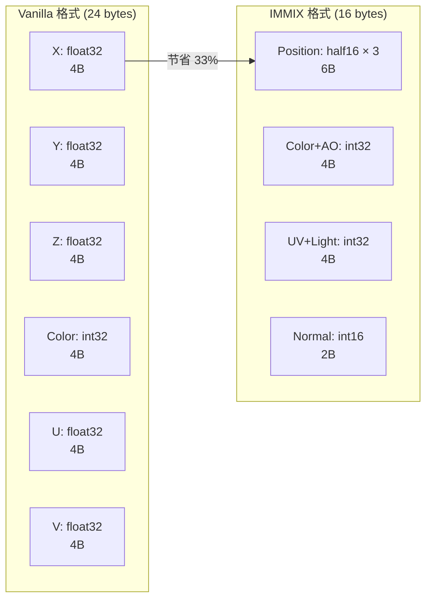
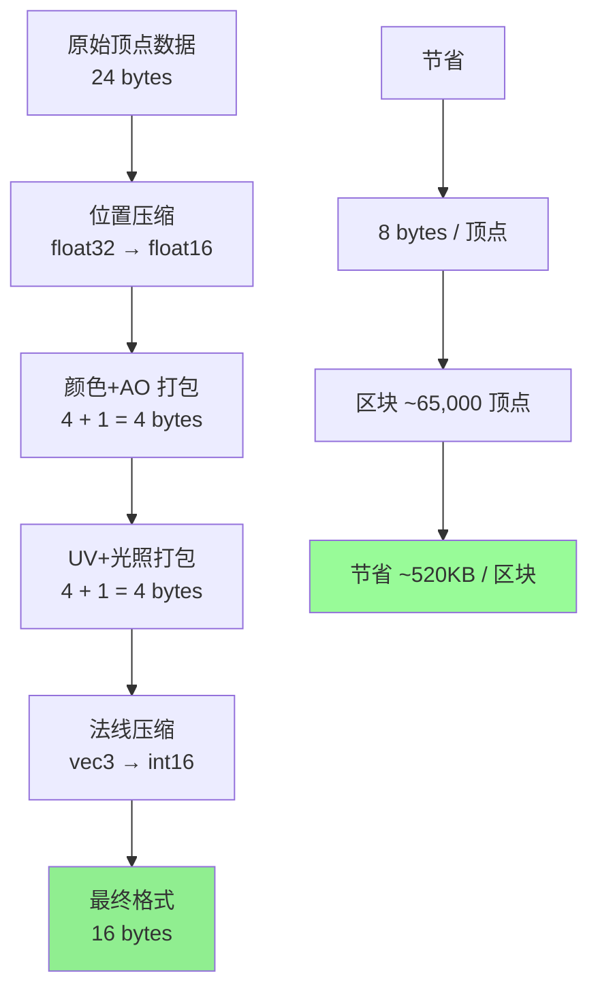
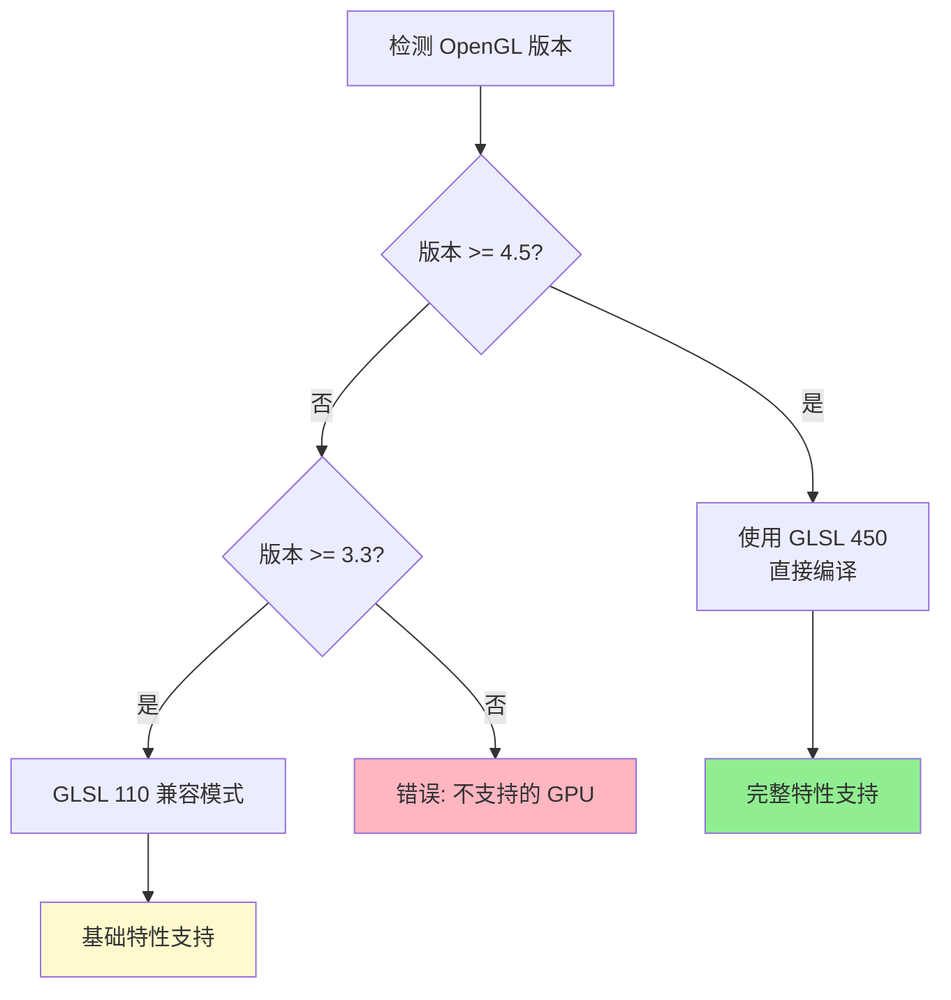

## 目录

[着色器概述](#着色器概述)
[着色器资源结构](#着色器资源结构)
[顶点着色器](#顶点着色器)
[片段着色器](#片段着色器)
[雾函数实现](#雾函数实现)
[顶点格式](#顶点格式)
[着色器管理](#着色器管理)
[着色器常量](#着色器常量)
[性能优化特性](#性能优化特性)
[OpenGL 要求](#opengl-要求)
[课后自查](#课后自查)

---

## 着色器概述

Sodium 使用自定义 GLSL 着色器实现高级渲染效果，包括抗锯齿、雾渲染优化和顶点压缩。与原版 Minecraft 相比，Sodium 的着色器系统提供了更高效的渲染路径和更好的性能表现。

**核心组件**：

| 组件 | 职责 |
|------|------|
| `ChunkShader` | 区块着色器封装，管理程序对象和 Uniform |
| `ShaderLoader` | 着色器资源加载与预处理 |
| `ShaderParser` | GLSL 源码解析与 #include 处理 |
| `GlShader` | OpenGL 着色器对象封装 |
| `ShaderAware` | 着色器感知接口，提供统一绑定接口 |

> **Uniform**：一种着色器变量类型，在绘制调用之间保持不变，用于传递矩阵、光照参数等全局数据。

---

## 着色器资源结构

### 资源路径

Sodium 的着色器源码存放在 `common/src/main/resources/assets/sodium/shaders/` 目录，采用模块化组织：

```
assets/sodium/shaders/
├── include/              # 共享代码片段
│   ├── common.glsl      # 通用函数（矩阵变换、辅助函数）
│   ├── fog.glsl         # 雾效果计算函数
│   ├── vertex_attribute.glsl  # 顶点属性定义与解码
│   └── noise.glsl        # 噪声函数（用于程序化纹理）
├── blocks/              # 方块渲染着色器
│   ├── rendertype_solid.vsh   # 实体方块顶点着色器
│   ├── rendertype_solid.fsh   # 实体方块片段着色器
│   ├── rendertype_cutout.vsh  # 半透明裁剪着色器
│   ├── rendertype_cutout.fsh
│   ├── rendertype_translucent.vsh  # 半透明着色器
│   └── rendertype_translucent.fsh
└── environment/         # 环境着色器
    ├── sky.glsl         # 天空渲染
    └── clouds.glsl      # 云朵渲染
```

### 编译流程



---

## 顶点着色器

顶点着色器负责处理每个顶点的数据转换，是渲染管线的第一阶段。

### Solid 顶点着色器

```glsl
#version 450

// 包含顶点属性定义
#include <vertex_attribute.glsl>

// 包含雾函数
#include <fog.glsl>

// Uniform 块 - 使用 std140 布局优化Uniform访问
layout(std140) uniform Uniforms {
    mat4 u_ModelViewMatrix;              // 模型视图矩阵
    mat4 u_ProjectionMatrix;              // 投影矩阵
    mat4 u_ModelViewProjectionMatrix;    // MVP 组合矩阵
    vec4 u_FogColor;                     // 雾颜色 RGBA
    vec2 u_FogScale;                     // 雾缩放参数
    float u_FogStart;                    // 雾起始距离
    float u_FogEnd;                      // 雾结束距离
    float u_FogShape;                    // 雾形状参数 [0,1]
    vec4 u_AmbientLight;                 // 环境光颜色
    vec4 u_BlockLight;                   // 方块光照颜色
    
    #ifdef USE_RGSS
    vec4 u_RGSSSamples[4];               // RGSS 抗锯齿采样点
    float u_RGSSKernel[16];              // RGSS 核权重
    #endif
};

// 实例数据 - 使用整数属性传递压缩数据
layout(location = 5) in ivec4 a_Flags;

// 顶点输出到片段着色器
out float v_ao;           // 环境光遮蔽
out float v_Light;        // 混合光照值
out vec2 v_Uv;            // 纹理坐标
out vec4 v_Color;         // 顶点颜色
out vec3 v_Pos;           // 视图空间位置
out vec3 v_Normal;        // 法线向量

// 雾参数输出
out float v_FogStart;
out float v_FogEnd;
out float v_FogColor;
out float v_FogShape;

void main() {
    // ============ 位置解码 ============
    // 顶点位置使用 26bit 紧凑编码
    // 高16位: X坐标, 低10位: Y坐标
    ivec2 packedPos = ivec2(a_Pos >> 16, a_Pos & 0xFFFF);
    // 将编码值转换为实际坐标（每单位 = 1/4096 方块）
    vec3 position = vec3(packedPos, a_Pos_Mid) * (1.0 / 4096.0);
    
    // 视图空间变换
    vec4 pos = u_ModelViewMatrix * vec4(position, 1.0);
    gl_Position = u_ProjectionMatrix * pos;
    
    // ============ 法线解码 ============
    vec3 normal = decodeNormalizedNormal(a_Normal);
    
    // ============ 光照计算 ============
    // 从 4bit 压缩光照值解压到 [0,1]
    float blockLight = unpackUnorm(a_Light, 0) * 15.0 / 16.0;
    float skyLight = unpackUnorm(a_Light, 4) * 15.0 / 16.0;
    // 混合环境光和方块光
    v_Light = mix(u_BlockLight, u_AmbientLight, skyLight) * (0.8 + blockLight * 0.2);
    
    // ============ AO 解码 ============
    // 从顶点标志位提取 AO 值
    v_ao = float((a_Flags.x >> 16) & 0xFF) / 255.0;
    
    // ============ 纹理坐标 ============
    // UV 以 1/16 增量存储（对应原版纹理贴图格式）
    v_Uv = a_Uv * (1.0 / 16.0);
    
    // ============ 顶点颜色 ============
    // 有符号 4 字节打包为 [-1, 1] 范围
    v_Color = unpackSnorm4x8(a_Color) * (1.0 / 127.0);
    
    // 输出法线和位置
    v_Normal = normal;
    v_Pos = pos.xyz;
    
    // 雾参数传递到片段着色器
    v_FogStart = u_FogStart;
    v_FogEnd = u_FogEnd;
    v_FogColor = u_FogColor;
    v_FogShape = u_FogShape;
}
```

**关键优化点**：
- 使用整数打包编码减少顶点数据大小
- 矩阵预乘减少片段着色器计算
- 法线和位置使用共享解码函数

---

## 片段着色器

片段着色器计算每个像素的最终颜色，是渲染管线的最后阶段。

### Solid 片段着色器

```glsl
#version 450

// 雾函数库
#include <fog.glsl>

// Uniform 块 - 与顶点着色器共享
layout(std140) uniform Uniforms {
    mat4 u_ModelViewMatrix;
    mat4 u_ProjectionMatrix;
    mat4 u_ModelViewProjectionMatrix;
    vec4 u_FogColor;
    vec2 u_FogScale;
    float u_FogStart;
    float u_FogEnd;
    float u_FogShape;
    vec4 u_AmbientLight;
    vec4 u_BlockLight;
    
    #ifdef USE_RGSS
    vec4 u_RGSSSamples[4];
    float u_RGSSKernel[16];
    #endif
};

// 顶点输出输入
in float v_ao;
in float v_Light;
in vec2 v_Uv;
in vec4 v_Color;
in vec3 v_Pos;
in vec3 v_Normal;

// 雾输入
in float v_FogStart;
in float v_FogEnd;
in float v_FogColor;
in float v_FogShape;

// 纹理采样器
uniform sampler2D u_Texture;

// 片段输出到帧缓冲
layout(location = 0) out vec4 out_Color;

void main() {
    // ============ 纹理采样 ============
    vec4 color = texture(u_Texture, v_Uv);
    
    // ============ Alpha 测试 ============
    // 透明像素丢弃，减少Overdraw
    if (color.a < 0.1) {
        discard;
    }
    
    // ============ 光照应用 ============
    // 根据天空光/方块光混合计算最终光照
    color.rgb *= v_Light;
    
    // ============ AO 应用 ============
    // 环境光遮蔽混合（65% 强度）
    color.rgb *= mix(1.0, v_ao, 0.65);
    
    // ============ 顶点颜色 ============
    // 允许方块有基础色调变化
    color *= v_Color;
    
    // ============ 雾效应用 ============
    // 使用视图深度计算雾混合因子
    color = applyFog(color, v_Pos.z, v_FogStart, v_FogEnd, v_FogColor, v_FogShape);
    
    out_Color = color;
}
```

---

## 雾函数实现

雾效是 Minecraft 渲染的重要组成部分，用于隐藏远处区块边界并增加大气感。

### Fog.glsl 核心函数

```glsl
/**
 * 应用雾效果
 * @param color    原始颜色
 * @param viewDepth 视图空间深度（负值表示距离）
 * @param fogStart  雾开始距离
 * @param fogEnd    雾结束距离
 * @param fogColor  雾颜色
 * @param fogShape  雾形状参数 [0,1]
 *                  - 0: 线性雾
 *                  - 0.5: 指数雾
 *                  - 1: 平方指数雾
 */
vec4 applyFog(vec4 color, float viewDepth, 
              float fogStart, float fogEnd, 
              vec4 fogColor, float fogShape) {
    
    // 根据形状参数调整雾的计算范围
    // fogShape 控制雾的浓度分布曲线
    float fogSize = mix(fogEnd, fogStart, fogShape);
    
    // 计算基础雾因子 [0, 1]
    float fogFactor = clamp((viewDepth - fogSize) / (fogEnd - fogSize), 0.0, 1.0);
    
    // 应用平滑过渡（Hermite 插值）
    // 这使得雾边缘更加自然
    fogFactor = fogFactor * fogFactor * (3.0 - 2.0 * fogFactor);
    
    // 颜色线性混合
    return mix(color, fogColor, fogFactor);
}

/**
 * 计算雾缩放参数
 * 用于顶点着色器预计算，减少片段着色器计算
 */
vec2 calculateFogScale(float fogEnd, float fogStart, float fogShape) {
    float fogRange = max(fogEnd - fogStart, 1e-5);
    return vec2(1.0 / fogRange, -fogStart / fogRange);
}
```

**雾效类型对比**：

| 雾类型 | fogShape | 视觉效果 | 性能 |
|--------|----------|----------|------|
| 线性雾 | 0.0 | 距离均匀过渡 | 最快 |
| 指数雾 | 0.5 | 近处浓、远处稀 | 中等 |
| 平方指数 | 1.0 | 更陡峭的过渡曲线 | 最慢 |

---

## 顶点格式

顶点格式定义了 GPU 如何解释缓冲区中的二进制数据。Sodium 支持多种顶点格式以适应不同硬件。

### 格式对比



### Vanilla 格式 (24 bytes)

原版 Minecraft 使用的格式，每个顶点使用 24 字节：

```java
VANILLA(24) {
    @Override
    public ChunkVertexEncoder createEncoder() {
        return (ptr, materialBits, vertices, sectionIndex) -> {
            for (Vertex vertex : vertices) {
                // 位置: 3 × float32 = 12 bytes
                memPutFloat(ptr + 0, vertex.x);  // X
                memPutFloat(ptr + 4, vertex.y);  // Y
                memPutFloat(ptr + 8, vertex.z);  // Z
                
                // 颜色: 4 bytes (ARGB 打包)
                memPutInt(ptr + 12, vertex.color);
                
                // UV: 2 × float32 = 8 bytes
                memPutFloat(ptr + 16, vertex.u);  // U
                memPutFloat(ptr + 20, vertex.v);  // V
                
                ptr += 24;  // 步进到下一顶点
            }
        };
    }
}
```

### IMMIX 格式 (16 bytes)

Sodium 优化的格式，节省 33% 带宽：

```java
IMMIX(16) {
    @Override
    public ChunkVertexEncoder createEncoder() {
        return (ptr, materialBits, vertices, sectionIndex) -> {
            for (Vertex vertex : vertices) {
                // 位置: 3 × float16 = 6 bytes
                memPutShort(ptr + 0, floatToHalf(vertex.x));
                memPutShort(ptr + 2, floatToHalf(vertex.y));
                memPutShort(ptr + 4, floatToHalf(vertex.z));
                
                // 颜色 + AO: 4 bytes
                // [AO 8bit][Color 24bit]
                int colorAo = packColorAo(vertex.color, vertex.ao);
                memPutInt(ptr + 6, colorAo);
                
                // UV + 光照: 4 bytes
                // [U 16bit][V 16bit]
                int uvLight = packUvLight(vertex.u, vertex.v, vertex.light);
                memPutInt(ptr + 10, uvLight);
                
                // 法线: 2 bytes
                memPutShort(ptr + 14, encodeNormal(vertex.normal));
                
                ptr += 16;  // 步进到下一顶点
            }
        };
    }
}
```

### 顶点编码工具函数

```java
// 顶点数据结构
class Vertex {
    public float x, y, z;        // 世界坐标
    public int color;             // ARGB 颜色值
    public float ao;              // 环境光遮蔽 [0, 1]
    public float u, v;            // 纹理坐标
    public int light;             // 光照值（天空光 + 方块光）
    public Vec3f normal;          // 法线向量
}

/**
 * 打包颜色和 AO 到 32 位整数
 */
static int packColorAo(int color, float ao) {
    int aoByte = (int)(ao * 255.0f);  // AO 量化为 8 位
    return (aoByte << 24) | (color & 0x00FFFFFF);
}

/**
 * 打包 UV 坐标到 32 位整数
 */
static int packUvLight(float u, float v, int light) {
    // 纹理坐标量化为 16 位精度
    int uByte = (int)(u * 65535.0f);
    int vByte = (int)(v * 65535.0f);
    return ((uByte & 0xFFFF) << 16) | (vByte & 0xFFFF);
}

/**
 * Float32 → Float16 转换
 * 用于顶点位置压缩
 */
static short floatToHalf(float value) {
    int bits = Float.floatToIntBits(value);
    int sign = (bits >> 16) & 0x8000;
    int exponent = ((bits >> 23) & 0xFF) - 127 + 15;
    int mantissa = (bits >> 13) & 0x3FF;
    
    if (exponent <= 0) return (short)sign;
    if (exponent > 30) return (short)(sign | 0x7C00);
    
    return (short)(sign | (exponent << 10) | mantissa);
}
```

---

## 着色器管理

### ChunkShader 类

`ChunkShader` 是 Sodium 着色器系统的核心封装类：

```java
// common/.../render/chunk/shader/ChunkShader.java
public class ChunkShader implements ShaderAware {
    private final GlShader vertexShader;    // 顶点着色器对象
    private final GlShader fragmentShader;   // 片段着色器对象
    private final GlProgram program;          // 链接后的程序对象
    
    // Uniform 位置缓存 - 避免运行时查询开销
    private final int u_ModelViewMatrix;
    private final int u_ProjectionMatrix;
    private final int u_ModelViewProjectionMatrix;
    private final int u_FogColor;
    private final int u_FogScale;
    private final int u_Texture;
    
    public ChunkShader(ShaderLoader loader) {
        // 加载顶点着色器
        this.vertexShader = loader.loadVertexShader("rendertype_solid.vsh");
        // 加载片段着色器
        this.fragmentShader = loader.loadFragmentShader("rendertype_solid.fsh");
        // 链接为程序对象
        this.program = GlProgram.create("rendertype_solid", 
                                        vertexShader, fragmentShader);
        
        // 预缓存 Uniform 位置
        this.u_ModelViewMatrix = program.getUniform("u_ModelViewMatrix");
        this.u_ProjectionMatrix = program.getUniform("u_ProjectionMatrix");
        this.u_ModelViewProjectionMatrix = program.getUniform("u_ModelViewProjectionMatrix");
        this.u_FogColor = program.getUniform("u_FogColor");
        this.u_FogScale = program.getUniform("u_FogScale");
        this.u_Texture = program.getUniform("u_Texture");
    }
    
    /**
     * 绑定着色器程序
     */
    public void bind(CommandList commandList) {
        commandList.bindShader(program);
    }
    
    /**
     * 解绑着色器
     */
    public void unbind(CommandList commandList) {
        commandList.unbindShader();
    }
    
    /**
     * 上传 Uniform 数据到 GPU
     */
    public void uploadUniforms(CommandList commandList, UniformData data) {
        commandList.setUniform(u_ModelViewMatrix, data.modelViewMatrix);
        commandList.setUniform(u_ProjectionMatrix, data.projectionMatrix);
        commandList.setUniform(u_FogColor, data.fogColor);
        commandList.setUniform(u_FogScale, data.fogScale);
    }
}
```

### ShaderLoader 类

着色器资源加载与预处理：

```java
// common/.../gl/shader/ShaderLoader.java
public class ShaderLoader {
    private static final String SHADER_PATH = "assets/sodium/shaders";
    
    /**
     * 加载顶点着色器
     */
    public GlShader loadVertexShader(String name) {
        String source = loadShaderSource("blocks/" + name);
        return GlShader.create(GL_VERTEX_SHADER, name, preprocess(source));
    }
    
    /**
     * 加载片段着色器
     */
    public GlShader loadFragmentShader(String name) {
        String source = loadShaderSource("blocks/" + name);
        return GlShader.create(GL_FRAGMENT_SHADER, name, preprocess(source));
    }
    
    /**
     * 从 classpath 加载着色器源码
     */
    private String loadShaderSource(String path) {
        InputStream stream = getClass().getResourceAsStream("/" + SHADER_PATH + "/" + path);
        return new String(stream.readAllBytes(), StandardCharsets.UTF_8);
    }
    
    /**
     * 预处理 GLSL 源码
     * 处理 #include 指令
     */
    private String preprocess(String source) {
        // 正则匹配 #include "filename.glsl"
        return source.replaceAll("#include\\s+\"([^\"]+)\"", 
                                 match -> loadInclude(match.group(1)));
    }
    
    /**
     * 加载 include 文件内容
     */
    private String loadInclude(String filename) {
        return loadShaderSource("include/" + filename);
    }
}
```

### ShaderAware 接口

统一的着色器绑定接口：

```java
public interface ShaderAware {
    /**
     * 绑定着色器程序
     */
    void bind(CommandList commandList);
    
    /**
     * 解绑着色器
     */
    void unbind(CommandList commandList);
    
    /**
     * 上传 Uniform 数据
     */
    void uploadUniforms(CommandList commandList, UniformData data);
}
```

---

## 着色器常量

### 编译宏定义

```java
// common/.../gl/shader/ShaderConstants.java
public class ShaderConstants {
    // 功能宏 - 启用特定渲染特性
    public static final String USE_FOG = "USE_FOG";
    public static final String USE_FRAGMENT_DISCARD = "USE_FRAGMENT_DISCARD";
    public static final String USE_VERTEX_COMPRESSION = "USE_VERTEX_COMPRESSION";
    public static final String USE_RGSS = "USE_RGSS";              // 抗锯齿
    public static final String USE_ENTITY_CLOUD = "USE_ENTITY_CLOUD";  // 云朵渲染
    
    /**
     * 抗锯齿模式枚举
     */
    public enum AntiAliasing {
        NONE(0),        // 无抗锯齿
        MSAA4X(4),      // 4x 多重采样
        MSAA8X(8),      // 8x 多重采样
        RGSS(4);        // 旋转网格超级采样
        
        public final int samples;  // 采样点数量
        
        AntiAliasing(int samples) {
            this.samples = samples;
        }
    }
}
```

### Uniform 块布局

```glsl
// 所有着色器共享的 Uniform 块
layout(std140) uniform Uniforms {
    // 变换矩阵
    mat4 u_ModelViewMatrix;            // 模型 → 视图空间
    mat4 u_ProjectionMatrix;          // 视图 → 裁剪空间
    mat4 u_ModelViewProjectionMatrix; // MVP 组合（预乘优化）
    
    // 雾参数
    vec4 u_FogColor;                  // RGBA 雾颜色
    vec2 u_FogScale;                  // 雾缩放 (1/range, -start/range)
    float u_FogStart;                 // 雾起始距离
    float u_FogEnd;                   // 雾结束距离
    float u_FogShape;                // 雾形状参数 [0,1]
    
    // 光照
    vec4 u_AmbientLight;              // 环境光 RGBA
    vec4 u_BlockLight;                // 方块光 RGBA
    
    // 抗锯齿（条件编译）
    #ifdef USE_RGSS
    vec4 u_RGSSSamples[4];            // 采样偏移
    float u_RGSSKernel[16];           // 核权重
    #endif
};
```

---

## 性能优化特性

| 优化技术 | 实现方式 | 性能收益 |
|----------|----------|----------|
| **顶点压缩** | Float16 替代 Float32 | 减少 33% 带宽占用 |
| **Include 复用** | 共享 GLSL 代码 | 减少重复代码，便于维护 |
| **Uniform 缓存** | 预缓存位置 ID | 避免运行时查询开销 |
| **std140 布局** | 固定布局规整数据 | 减少 Uniform 设置调用 |
| **矩阵预乘** | MVP 组合矩阵 | 顶点着色器减少 1 次矩阵乘法 |
| **RGSS 抗锯齿** | 着色器内多次采样 | 更好的边缘质量 |
| **Early-Z 优化** | 雾效前裁剪 | 减少 Overdraw |

### 顶点压缩详解



---

## OpenGL 要求

### 版本要求

| 要求级别 | 版本 | 特性支持 |
|----------|------|----------|
| **最低** | OpenGL 3.3 | 基础顶点属性、着色器程序 |
| **推荐** | OpenGL 4.5 | SPIR-V、GLSL 450 |
| **可选扩展** | GL_ARB_gl_spirv | SPIR-V 着色器（需要着色器编译器） |
| **可选扩展** | GL_ARB_vertex_attrib_64bit | 64 位顶点属性 |

### 平台差异处理



### GLSL 版本对照

| OpenGL 版本 | GLSL 版本 | 特性 |
|-------------|-----------|------|
| 4.5 | 450 | 布局限定符、算术运算 |
| 4.3 | 430 | 整数位操作、原子操作 |
| 4.0 | 400 | 几何着色器、模板纹理 |
| 3.3 | 330 | 稳健性扩展 |
| 3.2 | 150 | 顶点 ID、实例化 |
| 3.1 | 140 | 纹理查询、UBO |
| 3.0 | 130 | 纹理查询、精确类型 |
| 2.1 | 120 | 顶点纹理 |
| 2.0 | 110 | 基础着色器 |

---

## 课后自查

完成本章节学习后，请确认你能够：

- [ ] **理解着色器编译流程**：能够描述从 GLSL 源码到 GPU 程序的完整转换过程
- [ ] **解释顶点格式差异**：说明 Vanilla (24B) 和 IMMIX (16B) 格式的区别及性能收益
- [ ] **分析 Uniform 管理**：理解 std140 布局的优势以及 Uniform 缓存的作用
- [ ] **描述雾效实现**：能够解释线性雾和指数雾的计算方式及参数含义
- [ ] **识别性能优化点**：列举 Sodium 着色器系统的 3 个以上性能优化技术
- [ ] **理解平台兼容性**：了解不同 OpenGL 版本对功能支持的影响

---

## 相关文档

- [01-架构概览](01-architecture-overview.md) - Sodium 整体架构设计
- [02-区块渲染系统](02-chunk-render-system.md) - 区块渲染与网格构建
- [03-遮挡剔除系统](03-occlusion-culling.md) - 可见性判断算法
- [04-渲染管线](04-render-pipeline.md) - 渲染 Pass 与多线程架构

---

*文档版本: 1.0*
*基于 Sodium v0.8.6 源码分析*
*更新日期: 2026-03-24*
