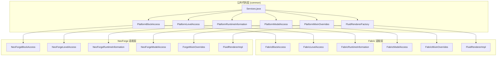
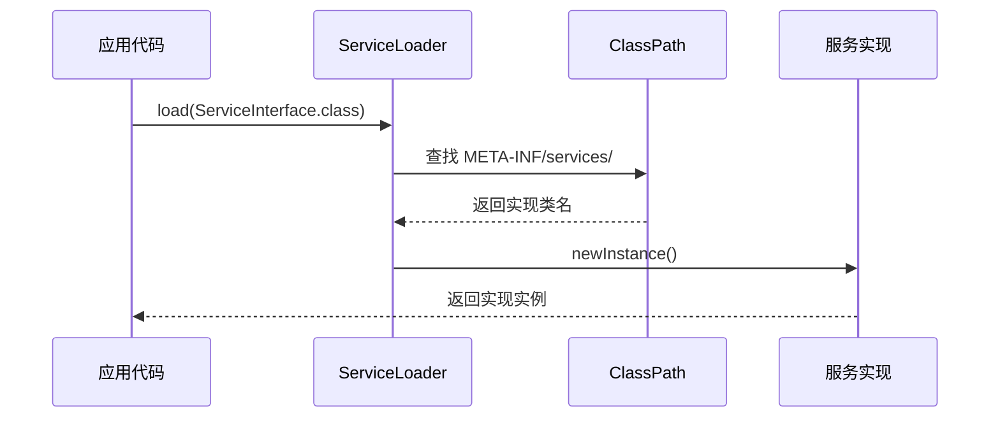
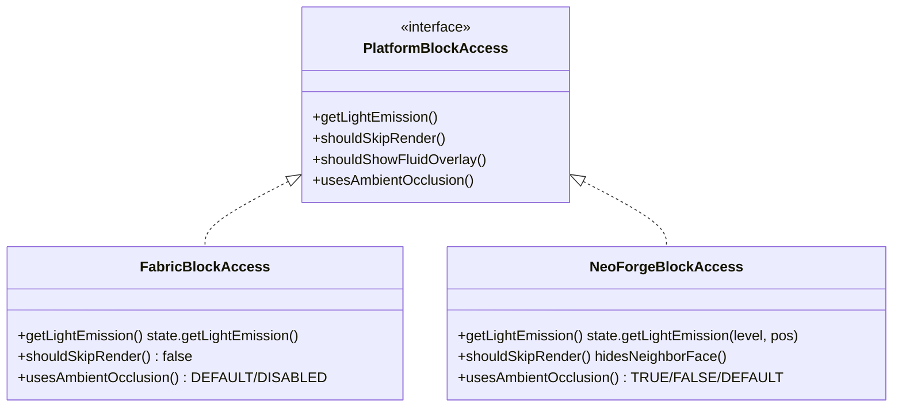
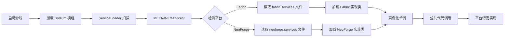

# Sodium 平台集成 (Platform Integration)

## 目录

- [平台抽象概述](#平台抽象概述)
- [SPI 机制](#spi-机制)
- [核心服务接口](#核心服务接口)
- [Fabric 平台实现](#fabric-平台实现)
- [NeoForge 平台实现](#neoforge-平台实现)
- [平台差异对比](#平台差异对比)
- [服务加载流程](#服务加载流程)
- [课后自查](#课后自查)

---

## 平台抽象概述

Sodium 是一个高性能渲染优化模组，同时支持 **Fabric** 和 **NeoForge** 两个模组加载器。为了实现代码复用，Sodium 采用了**平台抽象层（Platform Abstraction Layer）** 设计模式，将平台特定的 API 调用封装在统一接口后面。



> **关键概念**：平台抽象层使得公共代码可以通过统一接口调用平台特定功能，无需关心当前运行在哪个模组加载器上。

---

## SPI 机制

### ServiceLoader 原理

Sodium 使用 Java 标准库中的 **ServiceLoader** 机制实现服务发现与加载。这是 JDK 6+ 内置的 **SPI（Service Provider Interface）** 框架。



### Services.java 核心实现

```12:30:assets/Sodium/common/src/main/java/net/caffeinemc/mods/sodium/client/services/Services.java
public class Services {
    private static final Logger LOGGER = LoggerFactory.getLogger("Sodium (Service)");

    public static <T> T load(Class<T> clazz) {
        final T loadedService = ServiceLoader.load(clazz)
                .findFirst()
                .orElseThrow(() -> new NullPointerException("Failed to load service for " + clazz.getName()));
        LOGGER.debug("Loaded {} for service {}", loadedService, clazz);
        return loadedService;
    }

    public static <T> T loadOr(Class<T> clazz, Supplier<T> supplier) {
        final T loadedService = ServiceLoader.load(clazz)
                .findFirst()
                .orElse(supplier.get());
        LOGGER.debug("Loaded {} for service {}", loadedService, clazz);
        return loadedService;
    }
}
```

**两种加载模式**：
- `load()` - 必须找到实现，否则抛出异常
- `loadOr()` - 可选的兜底实现

### 服务配置文件

每个平台需要在 `META-INF/services/` 目录下放置服务配置文件：

```
META-INF/services/
├── net.caffeinemc.mods.sodium.client.services.PlatformBlockAccess
├── net.caffeinemc.mods.sodium.client.services.PlatformLevelAccess
├── net.caffeinemc.mods.sodium.client.services.PlatformRuntimeInformation
├── net.caffeinemc.mods.sodium.client.services.PlatformModelAccess
├── net.caffeinemc.mods.sodium.client.services.PlatformMixinOverrides
├── net.caffeinemc.mods.sodium.client.services.FluidRendererFactory
└── ...
```

配置文件内容只需一行：**实现类的全限定名**。

---

## 核心服务接口

### 1. PlatformBlockAccess - 方块访问接口

定义方块渲染相关的平台特定操作：

```16:94:assets/Sodium/common/src/main/java/net/caffeinemc/mods/sodium/client/services/PlatformBlockAccess.java
public interface PlatformBlockAccess {
    PlatformBlockAccess INSTANCE = Services.load(PlatformBlockAccess.class);

    /**
     * 获取方块的光照发射值
     */
    int getLightEmission(BlockState state, BlockAndTintGetter level, BlockPos pos);

    /**
     * 检查是否应跳过渲染特定面
     */
    boolean shouldSkipRender(BlockGetter level, BlockState selfState, BlockState otherState, 
                             BlockPos selfPos, BlockPos otherPos, Direction facing);

    /**
     * 检查流体覆盖层是否应显示
     */
    boolean shouldShowFluidOverlay(BlockState block, BlockAndTintGetter level, 
                                   BlockPos pos, FluidState fluidState);

    /**
     * 平台是否支持方块实体数据
     */
    boolean platformHasBlockData();

    /**
     * 获取法向量着色值
     */
    float getNormalVectorShade(ModelQuadView quad, BlockAndTintGetter level, boolean shade);

    /**
     * 环境光遮蔽模式
     */
    AmbientOcclusionMode usesAmbientOcclusion(BlockModelPart model, BlockState state, 
                                             ChunkSectionLayer renderType, 
                                             BlockAndTintGetter level, BlockPos pos);

    /**
     * 方块实体是否应发光
     */
    boolean shouldBlockEntityGlow(BlockEntity blockEntity, LocalPlayer player);

    /**
     * 检查方块是否应遮挡相邻流体
     */
    boolean shouldOccludeFluid(Direction adjDirection, BlockState adjBlockState, FluidState fluid);
}
```

### 2. PlatformLevelAccess - 维度访问接口

```9:31:assets/Sodium/common/src/main/java/net/caffeinemc/mods/sodium/client/services/PlatformLevelAccess.java
public interface PlatformLevelAccess {
    PlatformLevelAccess INSTANCE = Services.load(PlatformLevelAccess.class);

    /**
     * 获取方块实体的渲染数据
     */
    @Nullable
    Object getBlockEntityData(BlockEntity blockEntity);

    /**
     * 获取区块的光照管理器
     */
    @Nullable SodiumAuxiliaryLightManager getLightManager(LevelChunk chunk, SectionPos pos);
}
```

### 3. PlatformRuntimeInformation - 运行时信息接口

```9:50:assets/Sodium/common/src/main/java/net/caffeinemc/mods/sodium/client/services/PlatformRuntimeInformation.java
public interface PlatformRuntimeInformation {
    PlatformRuntimeInformation INSTANCE = Services.load(PlatformRuntimeInformation.class);

    /**
     * 是否为开发环境
     */
    boolean isDevelopmentEnvironment();

    /**
     * 获取游戏目录路径
     */
    Path getGameDirectory();

    /**
     * 获取配置目录路径
     */
    Path getConfigDirectory();

    /**
     * 平台是否有早期加载画面
     */
    boolean platformHasEarlyLoadingScreen();

    /**
     * 平台是否使用 refmap
     */
    boolean platformUsesRefmap();

    /**
     * 检查模组是否在加载列表中
     */
    boolean isModInLoadingList(String modId);

    /**
     * 是否使用顶点 alpha 乘法
     */
    boolean usesAlphaMultiplication();
}
```

### 4. PlatformModelAccess - 模型访问接口

```21:59:assets/Sodium/common/src/main/java/net/caffeinemc/mods/sodium/client/services/PlatformModelAccess.java
public interface PlatformModelAccess {
    PlatformModelAccess INSTANCE = Services.load(PlatformModelAccess.class);

    /**
     * 获取模型使用的四边形列表
     */
    List<BakedQuad> getQuads(BlockAndTintGetter level, BlockPos pos, BlockModelPart model, 
                             BlockState state, Direction face, RandomSource random, 
                             ChunkSectionLayer renderType);

    /**
     * 获取区块的模型数据容器
     */
    SodiumModelDataContainer getModelDataContainer(Level level, SectionPos sectionPos);

    /**
     * 获取空的模型数据
     */
    SodiumModelData getEmptyModelData();

    /**
     * 获取部件渲染类型
     */
    ChunkSectionLayer getPartRenderType(BlockModelPart part, BlockState state, 
                                        ChunkSectionLayer defaultType);

    /**
     * 收集方块状态模型的部件
     */
    List<BlockModelPart> collectPartsOf(BlockStateModel blockStateModel, 
                                        BlockAndTintGetter blockView, BlockPos pos, 
                                        BlockState state, RandomSource random, 
                                        @Nullable ListStorage emitter);
}
```

### 5. PlatformMixinOverrides - Mixin 配置接口

```5:16:assets/Sodium/common/src/main/java/net/caffeinemc/mods/sodium/client/services/PlatformMixinOverrides.java
public interface PlatformMixinOverrides {
    PlatformMixinOverrides INSTANCE = Services.load(PlatformMixinOverrides.class);

    /**
     * 应用第三方模组的 Mixin 配置覆盖
     */
    List<MixinOverride> applyModOverrides();

    record MixinOverride(String modId, String option, boolean enabled) {}
}
```

---

## Fabric 平台实现

### FabricBlockAccess

```19:96:assets/Sodium/fabric/src/main/java/net/caffeinemc/mods/sodium/fabric/block/FabricBlockAccess.java
public class FabricBlockAccess implements PlatformBlockAccess {
    @Override
    public int getLightEmission(BlockState state, BlockAndTintGetter level, BlockPos pos) {
        return state.getLightEmission();  // 简单调用
    }

    @Override
    public boolean shouldSkipRender(BlockGetter level, BlockState selfState, 
                                   BlockState otherState, BlockPos selfPos, 
                                   BlockPos otherPos, Direction facing) {
        return false;  // Fabric 不支持外部面隐藏
    }

    @Override
    public boolean shouldShowFluidOverlay(BlockState block, BlockAndTintGetter level, 
                                         BlockPos pos, FluidState fluidState) {
        return FluidRenderHandlerRegistry.INSTANCE.isBlockTransparent(block.getBlock());
    }

    @Override
    public float getNormalVectorShade(ModelQuadView quad, BlockAndTintGetter level, boolean shade) {
        // 自定义法向量着色计算（来自 Indigo）
        return normalShade(level, NormI8.unpackX(quad.getFaceNormal()), ...);
    }

    @Override
    public AmbientOcclusionMode usesAmbientOcclusion(...) {
        return model.useAmbientOcclusion() ? AmbientOcclusionMode.DEFAULT 
                                           : AmbientOcclusionMode.DISABLED;
    }

    @Override
    public boolean shouldBlockEntityGlow(BlockEntity blockEntity, LocalPlayer player) {
        return false;  // Fabric 不支持自定义轮廓渲染
    }
}
```

### FabricLevelAccess

```26:36:assets/Sodium/fabric/src/main/java/net/caffeinemc/mods/sodium/fabric/level/FabricLevelAccess.java
public class FabricLevelAccess implements PlatformLevelAccess {
    @Override
    public @Nullable Object getBlockEntityData(BlockEntity blockEntity) {
        return blockEntity.getRenderData();  // 使用 Fabric API
    }

    @Override
    public @Nullable SodiumAuxiliaryLightManager getLightManager(LevelChunk chunk, SectionPos pos) {
        return null;  // Fabric 不支持辅助光照
    }
}
```

### FabricRuntimeInformation

```8:43:assets/Sodium/fabric/src/main/java/net/caffeinemc/mods/sodium/fabric/FabricRuntimeInformation.java
public class FabricRuntimeInformation implements PlatformRuntimeInformation {
    @Override
    public boolean isDevelopmentEnvironment() {
        return FabricLoader.getInstance().isDevelopmentEnvironment();
    }

    @Override
    public Path getGameDirectory() {
        return FabricLoader.getInstance().getGameDir();
    }

    @Override
    public Path getConfigDirectory() {
        return FabricLoader.getInstance().getConfigDir();
    }

    @Override
    public boolean platformHasEarlyLoadingScreen() {
        return false;  // Fabric 默认不支持
    }

    @Override
    public boolean platformUsesRefmap() {
        return true;  // Fabric 使用 refmap
    }

    @Override
    public boolean usesAlphaMultiplication() {
        return false;  // Fabric 不需要
    }
}
```

### 服务配置文件

```1:1:assets/Sodium/fabric/src/main/resources/META-INF/services/net.caffeinemc.mods.sodium.client.services.PlatformBlockAccess
net.caffeinemc.mods.sodium.fabric.block.FabricBlockAccess
```

---

## NeoForge 平台实现

### NeoForgeBlockAccess

```19:63:assets/Sodium/neoforge/src/mod/java/net/caffeinemc/mods/sodium/neoforge/block/NeoForgeBlockAccess.java
public class NeoForgeBlockAccess implements PlatformBlockAccess {
    @Override
    public int getLightEmission(BlockState state, BlockAndTintGetter level, BlockPos pos) {
        return state.getLightEmission(level, pos);  // NeoForge 支持上下文参数
    }

    @Override
    public boolean shouldSkipRender(BlockGetter level, BlockState selfState, 
                                   BlockState otherState, BlockPos selfPos, 
                                   BlockPos otherPos, Direction facing) {
        // NeoForge 支持外部面隐藏 API
        return selfState.supportsExternalFaceHiding() && 
               (otherState.hidesNeighborFace(level, otherPos, selfState, 
                                            DirectionUtil.getOpposite(facing)));
    }

    @Override
    public boolean shouldShowFluidOverlay(BlockState block, BlockAndTintGetter level, 
                                         BlockPos pos, FluidState fluidState) {
        return block.shouldDisplayFluidOverlay(level, pos, fluidState);  // NeoForge API
    }

    @Override
    public float getNormalVectorShade(ModelQuadView quad, BlockAndTintGetter level, boolean shade) {
        // 使用 Level 的 getShade 方法
        return level.getShade(NormI8.unpackX(quad.getFaceNormal()), ...);
    }

    @Override
    public AmbientOcclusionMode usesAmbientOcclusion(...) {
        return switch (model.ambientOcclusion()) {
            case TRUE -> AmbientOcclusionMode.ENABLED;
            case FALSE -> AmbientOcclusionMode.DISABLED;
            case DEFAULT -> AmbientOcclusionMode.DEFAULT;
        };
    }

    @Override
    public boolean shouldBlockEntityGlow(BlockEntity blockEntity, LocalPlayer player) {
        return blockEntity.hasCustomOutlineRendering(player);  // NeoForge API
    }
}
```

### NeoForgeLevelAccess

```10:20:assets/Sodium/neoforge/src/mod/java/net/caffeinemc/mods/sodium/neoforge/level/NeoForgeLevelAccess.java
public class NeoForgeLevelAccess implements PlatformLevelAccess {
    @Override
    public @Nullable Object getBlockEntityData(BlockEntity blockEntity) {
        return null;  // NeoForge 没有等效 API
    }

    @Override
    public @Nullable SodiumAuxiliaryLightManager getLightManager(LevelChunk chunk, SectionPos pos) {
        // NeoForge 支持辅助光照管理器
        return (SodiumAuxiliaryLightManager) chunk.getAuxLightManager(pos.origin());
    }
}
```

### NeoForgeRuntimeInformation

```10:45:assets/Sodium/neoforge/src/mod/java/net/caffeinemc/mods/sodium/neoforge/NeoForgeRuntimeInformation.java
public class NeoForgeRuntimeInformation implements PlatformRuntimeInformation {
    @Override
    public boolean isDevelopmentEnvironment() {
        return !FMLLoader.getCurrent().isProduction();
    }

    @Override
    public Path getGameDirectory() {
        return FMLPaths.GAMEDIR.get();
    }

    @Override
    public Path getConfigDirectory() {
        return FMLPaths.CONFIGDIR.get();
    }

    @Override
    public boolean platformHasEarlyLoadingScreen() {
        return true;  // NeoForge 支持早期加载画面
    }

    @Override
    public boolean platformUsesRefmap() {
        return false;  // NeoForge 不使用 refmap
    }

    @Override
    public boolean usesAlphaMultiplication() {
        return true;  // NeoForge 需要顶点 alpha 乘法
    }
}
```

### 服务配置文件

```1:1:assets/Sodium/neoforge/src/mod/resources/META-INF/services/net.caffeinemc.mods.sodium.client.services.PlatformBlockAccess
net.caffeinemc.mods.sodium.neoforge.block.NeoForgeBlockAccess
```

---

## 平台差异对比

| 功能特性 | Fabric 实现 | NeoForge 实现 | 差异说明 |
|---------|-----------|--------------|---------|
| **光照获取** | `state.getLightEmission()` | `state.getLightEmission(level, pos)` | NeoForge 支持上下文参数 |
| **面隐藏检测** | 始终返回 `false` | 使用 `hidesNeighborFace()` API | NeoForge 支持更精细控制 |
| **流体覆盖层** | `FluidRenderHandlerRegistry` | `shouldDisplayFluidOverlay()` | 两者使用不同 API |
| **法向量着色** | 自定义 `normalShade()` 方法 | 直接使用 `level.getShade()` | NeoForge 可直接获取 |
| **环境光遮蔽** | 仅 `DEFAULT/DISABLED` | 支持 `TRUE/FALSE/DEFAULT` | NeoForge 支持强制启用 |
| **方块发光轮廓** | 不支持（返回 `false`） | `hasCustomOutlineRendering()` | NeoForge 独有功能 |
| **流体遮挡** | 比较流体类型 | `shouldHideAdjacentFluidFace()` | 两者逻辑相似 |
| **辅助光照** | 不支持（返回 `null`） | 使用 `getAuxLightManager()` | NeoForge 支持完整功能 |
| **模型数据** | 使用空容器 | 使用 `ModelData` 系统 | NeoForge 有完整实现 |
| **渲染类型检测** | 返回默认类型 | `part.getRenderType(state)` | NeoForge 可动态判断 |



---

## 服务加载流程



### 初始化时序

1. **模组加载阶段**：Fabric/NeoForge 启动器加载模组 JAR
2. **SPI 扫描**：JVM 通过 `ServiceLoader.load()` 扫描 `META-INF/services/`
3. **配置读取**：读取服务配置文件获取实现类名
4. **类加载**：通过反射加载实现类
5. **实例化**：创建单例实例存储在 `INSTANCE` 字段
6. **运行时调用**：公共代码通过 `PlatformXXX.INSTANCE.method()` 调用

---

## 课后自查

- [ ] 理解 SPI（Service Provider Interface）机制及其在 Sodium 中的应用
- [ ] 能够绘制 Sodium 平台抽象层的架构图
- [ ] 掌握 `Services.load()` 和 `Services.loadOr()` 的区别
- [ ] 了解 Fabric 和 NeoForge 在 `PlatformBlockAccess` 接口上的主要差异
- [ ] 能够解释为什么 NeoForge 支持辅助光照而 Fabric 不支持

---

## 参考源码

- `Services.java` - 服务加载器核心
- `PlatformBlockAccess.java` - 方块访问接口
- `PlatformLevelAccess.java` - 维度访问接口
- `PlatformRuntimeInformation.java` - 运行时信息接口
- `FabricBlockAccess.java` - Fabric 方块实现
- `NeoForgeBlockAccess.java` - NeoForge 方块实现
- `META-INF/services/` - SPI 配置文件目录
