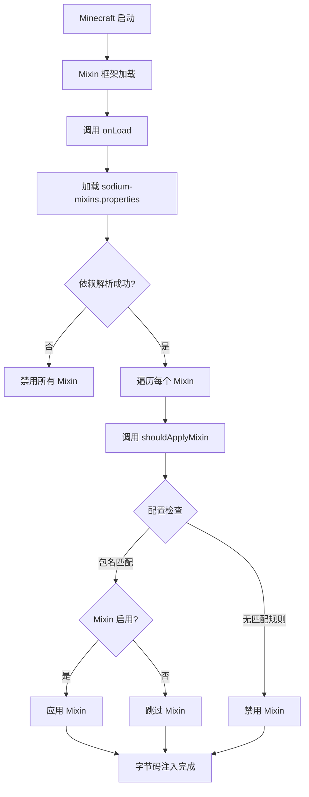
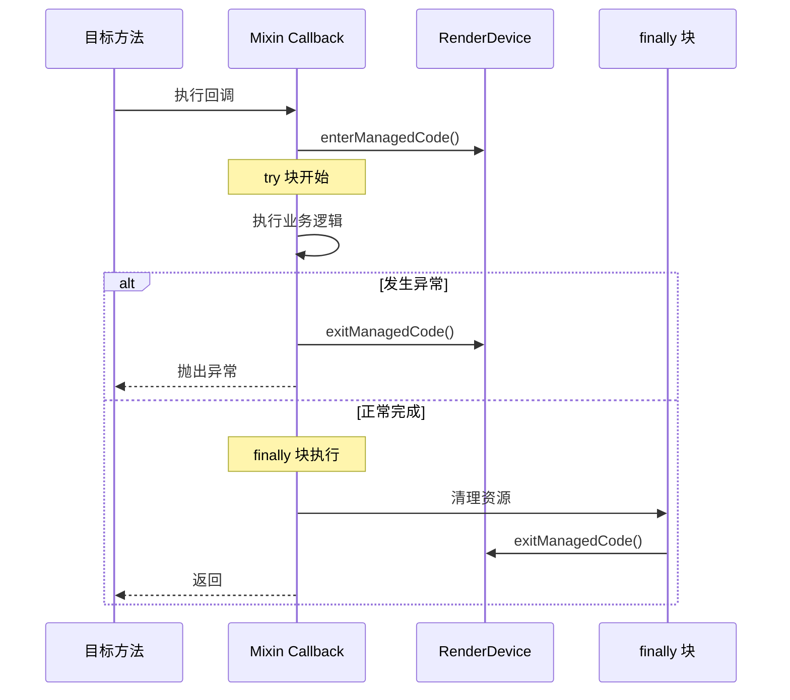

# Sodium Mixin 注入机制分析

> 深入分析 Sodium 的 Mixin 注入机制、配置管理和字节码修改策略

## 文档信息

| 属性 | 值 |
|------|-----|
| 分析版本 | Sodium v0.8.6 |
| Minecraft 版本 | 1.21.11 |
| 文档类型 | 架构分析 |
| 依赖框架 | SpongePowered Mixin |

---

## 目录

[Mixin 概述](#mixin-概述)
[配置结构](#配置结构)
[插件机制](#插件机制)
[注入点类型](#注入点类型)
[回调方法](#回调方法)
[方法覆写](#方法覆写)
[优先级与顺序](#优先级与顺序)
[原子性保证](#原子性保证)
[冲突处理](#冲突处理)
[实战示例](#实战示例)
[课后自查](#课后自查)

---

## Mixin 概述

**Mixin** 是一种运行时字节码修改框架，允许在不修改原源码的情况下对目标类进行扩展和修改。Sodium 使用 Mixin 框架对 Minecraft 的渲染系统进行深度优化。

### 核心概念速查

| 概念 | 说明 |
|------|------|
| **Target Class** | 被修改的目标类（如 `LevelRenderer`） |
| **Mixin Class** | 包含注入代码的类（继承目标类） |
| **Injection Point** | 注入点，指定在目标方法的何处插入代码 |
| **Callback** | 回调方法，在注入点执行的代码 |
| **Shadow** | 影子字段，访问目标类私有成员的机制 |

---

## 配置结构

### Mixin 配置文件

Sodium 的 Mixin 配置位于 `sodium-common.mixins.json`：

```startLine:1:25:D:/Minecraft-Learning/assets/Sodium/common/src/main/resources/sodium-common.mixins.json
{
  "package": "net.caffeinemc.mods.sodium.mixin",
  "required": true,
  "compatibilityLevel": "JAVA_17",
  "plugin": "net.caffeinemc.mods.sodium.mixin.SodiumMixinPlugin",
  "injectors": {
    "defaultRequire": 1
  },
  "overwrites": {
    "conformVisibility": true
  },
  "client": [
    "core.GlCommandEncoderAccessor",
    "core.MinecraftMixin",
    "core.WindowMixin",
    // ... 80+ Mixin 类
  ]
}
```

### 配置项说明

| 配置项 | 作用 |
|--------|------|
| `package` | Mixin 类的包名前缀 |
| `required` | 设为 `true` 表示必须成功应用 |
| `compatibilityLevel` | Java 版本兼容性要求 |
| `plugin` | 自定义插件类，用于条件性应用 Mixin |
| `defaultRequire` | 默认注入点必须满足的条件数 |
| `overwrites.conformVisibility` | 自动调整方法可见性 |

### Mixin 类分组结构

```
sodium/mixin/
├── core/                    # 核心渲染 Mixin（不可禁用）
│   ├── MinecraftMixin.java
│   ├── render/
│   │   └── world/
│   │       └── LevelRendererMixin.java
│   └── world/
│       └── chunk/
│           ├── PalettedContainerMixin.java
│           ├── SimpleBitStorageMixin.java
│           └── ZeroBitStorageMixin.java
├── features/               # 功能性 Mixin（可配置）
│   ├── render/
│   │   ├── immediate/
│   │   │   └── buffer_builder/
│   │   │       └── intrinsics/
│   │   │           └── BufferBuilderMixin.java
│   │   └── world/
│   │       └── clouds/
│   │           └── CloudRendererMixin.java
│   └── textures/
│       └── animations/
│           └── tracking/
│               └── SpriteContentsMixin.java
└── workarounds/            # 平台兼容性修复
    ├── context_creation/
    ├── event_loop/
    └── window_minimized_state/
```

---

## 插件机制

### SodiumMixinPlugin

Sodium 实现了 `IMixinConfigPlugin` 接口，提供精细的 Mixin 应用控制：

```startLine:16:60:D:/Minecraft-Learning/assets/Sodium/common/src/main/java/net/caffeinemc/mods/sodium/mixin/SodiumMixinPlugin.java
public class SodiumMixinPlugin implements IMixinConfigPlugin {
    private static final String MIXIN_PACKAGE_ROOT = "net.caffeinemc.mods.sodium.mixin.";

    private final Logger logger = LogManager.getLogger("Sodium");
    private MixinConfig config;
    private boolean dependencyResolutionFailed;

    @Override
    public void onLoad(String mixinPackage) {
        try {
            this.config = MixinConfig.load(new File("./config/sodium-mixins.properties"));
        } catch (Exception e) {
            throw new RuntimeException("Could not load configuration file for Sodium", e);
        }

        this.dependencyResolutionFailed = PlatformRuntimeInformation.getInstance().isModInLoadingList("embeddium");

        if (dependencyResolutionFailed) {
            this.logger.error("Not applying any Sodium mixins; dependency resolution has failed.");
        }

        this.logger.info("Loaded configuration file for Sodium: {} options available, {} override(s) found",
                this.config.getOptionCount(), this.config.getOptionOverrideCount());
    }

    @Override
    public boolean shouldApplyMixin(String targetClassName, String mixinClassName) {
        if (dependencyResolutionFailed) {
            return false;
        }

        if (!mixinClassName.startsWith(MIXIN_PACKAGE_ROOT)) {
            this.logger.error("Expected mixin '{}' to start with package root '{}', treating as foreign and " +
                    "disabling!", mixinClassName, MIXIN_PACKAGE_ROOT);

            return false;
        }

        String mixin = mixinClassName.substring(MIXIN_PACKAGE_ROOT.length());
        MixinOption option = this.config.getEffectiveOptionForMixin(mixin);

        if (option == null) {
            this.logger.error("No rules matched mixin '{}', treating as foreign and disabling!", mixin);

            return false;
        }

        if (option.isOverridden()) {
            String source = "[unknown]";

            if (option.isUserDefined()) {
                source = "user configuration";
            } else if (option.isModDefined()) {
                source = "mods [" + String.join(", ", option.getDefiningMods()) + "]";
            }

            if (option.isEnabled()) {
                this.logger.warn("Force-enabling mixin '{}' as rule '{}' (added by {}) enables it", mixin,
                        option.getName(), source);
            } else {
                this.logger.warn("Force-disabling mixin '{}' as rule '{}' (added by {}) disables it and children", mixin,
                        option.getName(), source);
            }
        }

        return option.isEnabled();
    }
}
```

### 插件核心职责



### MixinConfig 配置系统

```startLine:17:80:D:/Minecraft-Learning/assets/Sodium/common/src/main/java/net/caffeinemc/mods/sodium/client/data/config/MixinConfig.java
public class MixinConfig {
    private final Map<String, MixinOption> options = new HashMap<>();

    protected MixinConfig() {
        // 核心包默认启用
        this.addMixinRule("core", true);

        // 功能包默认启用
        this.addMixinRule("features", true);

        // 子包配置
        this.addMixinRule("features.gui", true);
        this.addMixinRule("features.gui.hooks", true);
        this.addMixinRule("features.gui.hooks.console", true);
        this.addMixinRule("features.gui.hooks.debug", true);
        this.addMixinRule("features.gui.hooks.settings", true);

        // 渲染相关
        this.addMixinRule("features.render", true);
        this.addMixinRule("features.render.entity", true);
        this.addMixinRule("features.render.entity.cull", true);
        this.addMixinRule("features.render.entity.shadow", true);

        // 纹理动画
        this.addMixinRule("features.textures", true);
        this.addMixinRule("features.textures.animations", true);

        // 兼容性修复
        this.addMixinRule("workarounds", true);
        this.addMixinRule("workarounds.context_creation", true);
        this.addMixinRule("workarounds.event_loop", true);
        this.addMixinRule("workarounds.window_minimized_state", true);
    }
```

### 配置继承规则

```startLine:148:171:D:/Minecraft-Learning/assets/Sodium/common/src/main/java/net/caffeinemc/mods/sodium/client/data/config/MixinConfig.java
public MixinOption getEffectiveOptionForMixin(String mixinClassName) {
    int lastSplit = 0;
    int nextSplit;

    MixinOption rule = null;

    // 从包路径逐层向上查找配置规则
    while ((nextSplit = mixinClassName.indexOf('.', lastSplit)) != -1) {
        String key = getMixinRuleName(mixinClassName.substring(0, nextSplit));

        MixinOption candidate = this.options.get(key);

        if (candidate != null) {
            rule = candidate;

            // 如果找到禁用规则，立即返回
            if (!rule.isEnabled()) {
                return rule;
            }
        }

        lastSplit = nextSplit + 1;
    }

    return rule;
}
```

配置继承规则：
1. 从包路径根部开始逐层向下查找
2. 遇到 `false` 配置立即禁用
3. 子包配置优先于父包配置

---

## 注入点类型

### 常用注入点

| 注入点类型 | 说明 | 使用场景 |
|-----------|------|---------|
| `HEAD` | 方法开头 | 初始化、资源分配 |
| `RETURN` | 方法返回前 | 后置处理、清理 |
| `TAIL` | 方法末尾 | 与 RETURN 类似 |
| `INVOKE` | 指定方法调用处 | 修改方法行为 |
| `FIELD` | 字段访问处 | 拦截字段读写 |
| `NEW` | 对象创建处 | 替换对象构造 |

### @Inject 注入

```startLine:113:116:D:/Minecraft-Learning/assets/Sodium/common/src/main/java/net/caffeinemc/mods/sodium/mixin/core/render/world/LevelRendererMixin.java
@Inject(method = "<init>", at = @At("RETURN"))
private void init(Minecraft client, EntityRenderDispatcher entityRenderDispatcher, 
                  BlockEntityRenderDispatcher blockEntityRenderDispatcher, 
                  RenderBuffers renderBuffers, LevelRenderState levelRenderState, 
                  FeatureRenderDispatcher featureRenderDispatcher, CallbackInfo ci) {
    this.renderer = new SodiumWorldRenderer(client);
}
```

### 带条件的 INVOKE 注入

```startLine:163:166:D:/Minecraft-Learning/assets/Sodium/common/src/main/java/net/caffeinemc/mods/sodium/mixin/core/render/world/LevelRendererMixin.java
@Inject(method = "renderLevel", 
        at = @At(value = "INVOKE", 
                 target = "Lnet/minecraft/client/renderer/LevelRenderer;cullTerrain(...)V"))
private void sodium$setMatrices(GraphicsResourceAllocator graphicsResourceAllocator, 
                                 DeltaTracker deltaTracker, boolean bl, Camera camera, 
                                 Matrix4f matrix4f, Matrix4f matrix4f2, Matrix4f matrix4f3, 
                                 GpuBufferSlice gpuBufferSlice, Vector4f vector4f, 
                                 boolean bl2, CallbackInfo ci) {
    matrices = new ChunkRenderMatrices(matrix4f2, matrix4f);
}
```

### 带 Shift 的注入

```startLine:31:42:D:/Minecraft-Learning/assets/Sodium/common/src/main/java/net/caffeinemc/mods/sodium/mixin/core/world/map/ClientChunkCacheMixin.java
@Inject(
    method = "drop",
    at = @At(
        value = "INVOKE",
        target = "Lnet/minecraft/client/multiplayer/ClientChunkCache$Storage;drop(ILnet/minecraft/world/level/chunk/LevelChunk;)V",
        shift = At.Shift.AFTER  // 在目标方法调用之后注入
    )
)
private void onChunkUnloaded(ChunkPos pos, CallbackInfo ci) {
    ChunkTrackerHolder.get(this.level)
            .onChunkStatusRemoved(pos.x, pos.z, ChunkStatus.FLAG_HAS_BLOCK_DATA);
}
```

---

## 回调方法

### CallbackInfo - 无返回值回调

```startLine:38:67:D:/Minecraft-Learning/assets/Sodium/common/src/main/java/net/caffeinemc/mods/sodium/mixin/core/MinecraftMixin.java
@Inject(method = "runTick", at = @At("HEAD"))
private void preRender(boolean tick, CallbackInfo ci) {
    ProfilerFiller profiler = Profiler.get();
    profiler.push("wait_for_gpu");

    while (this.fences.size() > SodiumClientMod.options().advanced.cpuRenderAheadLimit) {
        var fence = this.fences.dequeueLong();
        // GPU 同步处理
        GL32C.glClientWaitSync(fence, GL32C.GL_SYNC_FLUSH_COMMANDS_BIT, Long.MAX_VALUE);
        GL32C.glDeleteSync(fence);
    }

    profiler.pop();
}
```

### CallbackInfoReturnable - 可修改返回值

```startLine:25:36:D:/Minecraft-Learning/assets/Sodium/common/src/main/java/net/caffeinemc/mods/sodium/mixin/core/world/biome/ClientLevelMixin.java
@Inject(method = "<init>", at = @At("RETURN"))
private void captureSeed(ClientPacketListener packetListener,
                         ClientLevel.ClientLevelData levelData,
                         ResourceKey<Level> dimension,
                         Holder<DimensionType> dimensionType,
                         int loadDistance,
                         int simulationDistance,
                         LevelRenderer renderer,
                         boolean isDebug,
                         long biomeZoomSeed, int k,
                         CallbackInfo ci) {
    this.biomeZoomSeed = biomeZoomSeed;  // 捕获生物群系缩放种子
}
```

### 带参数捕获

```startLine:25:36:D:/Minecraft-Learning/assets/Sodium/common/src/main/java/net/caffeinemc/mods/sodium/mixin/core/model/colors/BlockColorsMixin.java
@Inject(method = "register", at = @At("HEAD"))
private void preRegisterColorProvider(BlockColor provider, Block[] blocks, CallbackInfo ci) {
    for (Block block : blocks) {
        // 检测是否被其他 mod 替换
        if (this.blocksToColor.put(block, provider) != null) {
            this.overridenBlocks.add(block);
            SodiumClientMod.logger().info("Block {} had its color provider replaced", 
                BuiltInRegistries.BLOCK.getKey(block));
        }
    }
}
```

---

## 方法覆写

### @Overwrite 完全替换

```startLine:133:136:D:/Minecraft-Learning/assets/Sodium/common/src/main/java/net/caffeinemc/mods/sodium/mixin/core/render/world/LevelRendererMixin.java
/**
 * @reason Redirect to our renderer
 * @author JellySquid
 */
@Overwrite
public int countRenderedSections() {
    return this.renderer.getVisibleChunkCount();
}
```

### @Overwrite 示例：地形剔除

```startLine:172:195:D:/Minecraft-Learning/assets/Sodium/common/src/main/java/net/caffeinemc/mods/sodium/mixin/core/render/world/LevelRendererMixin.java
/**
 * @reason Redirect the terrain setup phase to our renderer
 * @author JellySquid
 */
@Overwrite
private void cullTerrain(Camera camera, Frustum frustum, boolean spectator) {
    var viewport = ((ViewportProvider) frustum).sodium$createViewport();
    var updateChunksImmediately = FlawlessFrames.isActive();

    int sectionX = SectionPos.posToSectionCoord(camera.position().x());
    int sectionY = SectionPos.posToSectionCoord(camera.position().y());
    int sectionZ = SectionPos.posToSectionCoord(camera.position().z());

    if (this.lastCameraSectionX != sectionX || this.lastCameraSectionY != sectionY 
        || this.lastCameraSectionZ != sectionZ) {
        this.lastCameraSectionX = sectionX;
        this.lastCameraSectionY = sectionY;
        this.lastCameraSectionZ = sectionZ;
        this.worldBorderRenderer.invalidate();
    }

    RenderDevice.enterManagedCode();

    try {
        this.renderer.setupTerrain(camera, viewport, 
            ((FogStorage) this.minecraft.gameRenderer).sodium$getFogParameters(), 
            spectator, updateChunksImmediately, matrices);
    } finally {
        RenderDevice.exitManagedCode();
    }
}
```

### @Overwrite 使用注意事项

> **警告**：`@Overwrite` 会完全替换目标方法，可能与其他 Mixin 冲突。仅在需要完全重写方法逻辑时使用。

---

## 优先级与顺序

### Injector 配置

```json
{
  "injectors": {
    "defaultRequire": 1
  }
}
```

| 配置项 | 说明 |
|--------|------|
| `defaultRequire` | 每个注入点需要的最小 Mixin 数量 |

### Require 参数

```startLine:253:258:D:/Minecraft-Learning/assets/Sodium/common/src/main/java/net/caffeinemc/mods/sodium/mixin/core/render/world/LevelRendererMixin.java
@Inject(method = "extractVisibleBlockEntities(Lnet/minecraft/client/Camera;FLnet/minecraft/client/renderer/state/LevelRenderState;)V", 
        at = @At("HEAD"), 
        cancellable = true, 
        require = 1)  // 必须成功注入
private void extractVisibleBlockEntities(Camera camera, float f, 
                                         LevelRenderState levelRenderState, CallbackInfo ci) {
    ci.cancel();  // 取消原方法执行
    this.renderer.extractBlockEntities(camera, f, this.destructionProgress, levelRenderState);
}
```

### Require vs Optional

| 参数 | 含义 |
|------|------|
| `require = 1` | 至少 1 个 Mixin 必须成功注入，否则报错 |
| `optional = true` | 即使注入失败也继续执行 |

---

## 原子性保证

### RenderDevice 上下文管理

```startLine:118:127:D:/Minecraft-Learning/assets/Sodium/common/src/main/java/net/caffeinemc/mods/sodium/mixin/core/render/world/LevelRendererMixin.java
@Inject(method = "setLevel", at = @At("RETURN"))
private void onWorldChanged(ClientLevel level, CallbackInfo ci) {
    RenderDevice.enterManagedCode();

    try {
        this.renderer.setLevel(level);
    } finally {
        RenderDevice.exitManagedCode();
    }
}
```

### 异常安全模式



---

## 冲突处理

### Shadow 字段访问

```startLine:14:37:D:/Minecraft-Learning/assets/Sodium/common/src/main/java/net/caffeinemc/mods/sodium/mixin/core/world/chunk/SimpleBitStorageMixin.java
@Mixin(SimpleBitStorage.class)
public class SimpleBitStorageMixin implements BitStorageExtension {
    @Shadow
    @Final
    private long[] data;

    @Shadow
    @Final
    private int valuesPerLong;

    @Shadow
    @Final
    private long mask;

    @Shadow
    @Final
    private int bits;

    @Shadow
    @Final
    private int size;

    @Override
    public <T> void sodium$unpack(T[] out, Palette<T> palette) {
        int idx = 0;

        for (long word : this.data) {  // 访问 @Shadow 字段
            long l = word;

            for (int j = 0; j < this.valuesPerLong; ++j) {
                out[idx] = Objects.requireNonNull(palette.valueFor((int) (l & this.mask)),
                        "Palette does not contain entry for value in storage");
                l >>= this.bits;

                if (++idx >= this.size) {
                    return;
                }
            }
        }
    }
}
```

### Unique 扩展方法

```startLine:18:19:D:/Minecraft-Learning/assets/Sodium/common/src/main/java/net/caffeinemc/mods/sodium/mixin/core/render/world/LevelRendererMixin.java
@Unique
private static final EnumMap<ChunkSectionLayer, List<RenderPass.Draw<GpuBufferSlice[]>>> STATIC_MAP = new EnumMap<>(ChunkSectionLayer.class);

@Unique
private SodiumWorldRenderer renderer;

@Unique
private ChunkRenderMatrices matrices;
```

### 接口实现扩展

```startLine:16:17:D:/Minecraft-Learning/assets/Sodium/common/src/main/java/net/caffeinemc/mods/sodium/mixin/core/render/world/LevelRendererMixin.java
@Mixin(LevelRenderer.class)
public abstract class LevelRendererMixin implements LevelRendererExtension {
    // 通过实现接口添加新方法
    @Override
    public SodiumWorldRenderer sodium$getWorldRenderer() {
        return this.renderer;
    }
}
```

### 多 Mixin 协同时段

当多个 Mixin 需要修改同一方法时，Mixin 框架保证：

1. **按优先级顺序执行**：优先级高的 Mixin 先执行
2. **独立的 CallbackInfo**：每个 Mixin 有独立的回调信息
3. **cancellable 控制**：可通过 `ci.cancel()` 取消后续执行

---

## 实战示例

### 示例 1：区块状态追踪

```startLine:31:56:D:/Minecraft-Learning/assets/Sodium/common/src/main/java/net/caffeinemc/mods/sodium/mixin/core/world/map/ClientChunkCacheMixin.java
@Mixin(ClientChunkCache.class)
public class ClientChunkCacheMixin {
    @Shadow
    @Final
    ClientLevel level;

    // 区块卸载时触发
    @Inject(
        method = "drop",
        at = @At(
            value = "INVOKE",
            target = "Lnet/minecraft/client/multiplayer/ClientChunkCache$Storage;drop(ILnet/minecraft/world/level/chunk/LevelChunk;)V",
            shift = At.Shift.AFTER
        )
    )
    private void onChunkUnloaded(ChunkPos pos, CallbackInfo ci) {
        ChunkTrackerHolder.get(this.level)
            .onChunkStatusRemoved(pos.x, pos.z, ChunkStatus.FLAG_HAS_BLOCK_DATA);
    }

    // 区块加载时触发
    @Inject(
        method = "replaceWithPacketData",
        at = @At(
            value = "INVOKE",
            target = "Lnet/minecraft/client/multiplayer/ClientLevel;onChunkLoaded(Lnet/minecraft/world/level/ChunkPos;)V",
            shift = At.Shift.AFTER
        )
    )
    private void onChunkLoaded(int chunkX, int chunkZ, FriendlyByteBuf friendlyByteBuf, 
                               Map<Heightmap.Types, long[]> map, 
                               Consumer<ClientboundLevelChunkPacketData.BlockEntityTagOutput> consumer, 
                               CallbackInfoReturnable<LevelChunk> cir) {
        ChunkTrackerHolder.get(this.level)
            .onChunkStatusAdded(chunkX, chunkZ, ChunkStatus.FLAG_HAS_BLOCK_DATA);
    }
}
```

### 示例 2：快速顶点写入

```startLine:17:69:D:/Minecraft-Learning/assets/Sodium/common/src/main/java/net/caffeinemc/mods/sodium/mixin/features/render/immediate/buffer_builder/intrinsics/BufferBuilderMixin.java
@Mixin(BufferBuilder.class)
public abstract class BufferBuilderMixin implements VertexConsumer {
    @Shadow
    @Final
    private boolean fastFormat;

    @Override
    public void putBulkData(PoseStack.Pose matrices, BakedQuad bakedQuad, 
                            float r, float g, float b, float a, int light, int overlay) {
        // 检测快速格式模式
        if (!this.fastFormat) {
            // 回退到原始实现
            VertexConsumer.super.putBulkData(matrices, bakedQuad, r, g, b, a, light, overlay);

            if (bakedQuad.sprite() != null) {
                SpriteUtil.INSTANCE.markSpriteActive(bakedQuad.sprite());
            }

            return;
        }

        // 使用优化的写入路径
        VertexBufferWriter writer = VertexBufferWriter.of(this);
        ModelQuadView quad = (ModelQuadView) (Object) bakedQuad;

        int color = ColorABGR.pack(r, g, b, a);
        BakedModelEncoder.writeQuadVertices(writer, matrices, quad, color, light, overlay, false);

        if (quad.getSprite() != null) {
            SpriteUtil.INSTANCE.markSpriteActive(quad.getSprite());
        }
    }
}
```

### 示例 3：资源释放追踪

```startLine:69:78:D:/Minecraft-Learning/assets/Sodium/common/src/main/java/net/caffeinemc/mods/sodium/mixin/core/MinecraftMixin.java
@Inject(method = "runTick", at = @At("RETURN"))
private void postRender(boolean tick, CallbackInfo ci) {
    var fence = GL32C.glFenceSync(GL32C.GL_SYNC_GPU_COMMANDS_COMPLETE, 0);

    if (fence == 0) {
        throw new RuntimeException("Failed to create fence object");
    }

    this.fences.enqueue(fence);
}
```

---

## Mixin 注入流程图

```mermaid
flowchart TD
    subgraph Mixin框架层
        A[sodium-common.mixins.json] --> B[SodiumMixinPlugin]
        B --> C{shouldApplyMixin?}
        C -->|是| D[应用 Mixin]
        C -->|否| E[跳过]
    end

    subgraph 字节码转换
        D --> F[解析目标类]
        F --> G[定位注入点]
        G --> H[生成 Callback 代码]
        H --> I[修改字节码]
    end

    subgraph 运行时
        I --> J[ClassLoader 加载]
        J --> K[方法调用时触发]
        K --> L{Mixin 类型}
        L -->|@Inject| M[执行 Callback]
        L -->|@Overwrite| N[完全替换方法]
        L -->|@Redirect| O[重定向调用]
    end

    M --> P[调用原方法]
    O --> Q[返回修改结果]
    N --> R[直接返回新实现]
```

---

## 课后自查

### 自查清单

1. **配置加载流程**
   - [ ] 了解 `SodiumMixinPlugin.onLoad()` 的执行时机
   - [ ] 理解 `MixinConfig.getEffectiveOptionForMixin()` 的继承规则

2. **注入点类型**
   - [ ] 能区分 `HEAD`、`RETURN`、`TAIL` 的区别
   - [ ] 理解 `At.Shift.BEFORE`、`AFTER`、`by` 的作用

3. **回调方法**
   - [ ] 知道何时使用 `CallbackInfo` vs `CallbackInfoReturnable`
   - [ ] 理解 `ci.cancel()` 的效果

4. **原子性保证**
   - [ ] 能在 Mixin 中正确使用 try-finally
   - [ ] 理解 `RenderDevice.enterManagedCode()` 的必要性

5. **冲突处理**
   - [ ] 掌握 `@Shadow` 访问私有字段
   - [ ] 理解 `@Unique` 添加新成员的机制
   - [ ] 知道如何通过接口扩展添加新方法

---

## 相关文档

| 文档 | 说明 |
|------|------|
| [01-architecture-overview.md](01-architecture-overview.md) | Sodium 整体架构 |
| [02-chunk-render-system.md](02-chunk-render-system.md) | 区块渲染系统 |
| [04-render-pipeline.md](04-render-pipeline.md) | 渲染管线 |

---

*文档版本: v1.0*
*分析时间: 2026-03-24*
*基于 Sodium v0.8.6 源码*
