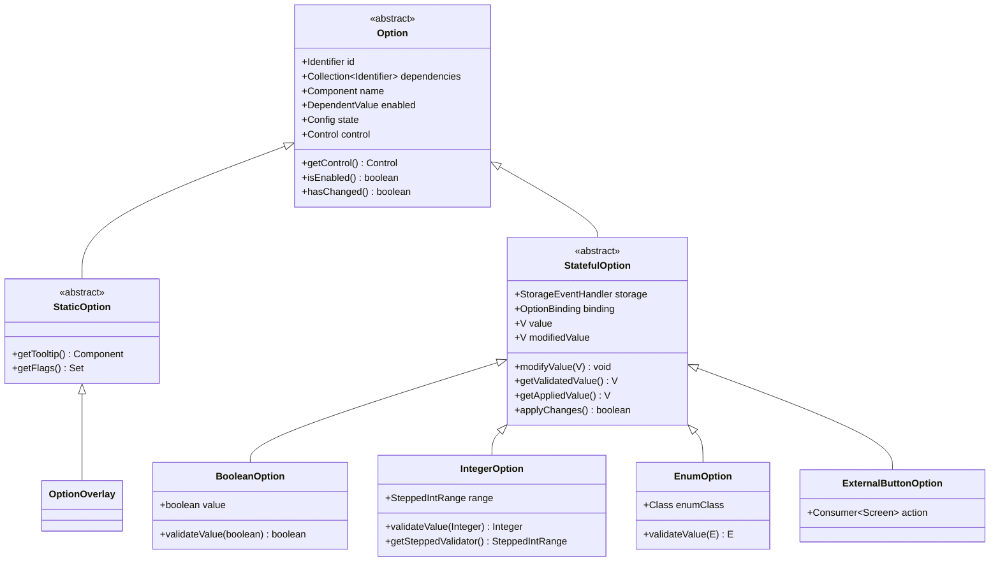
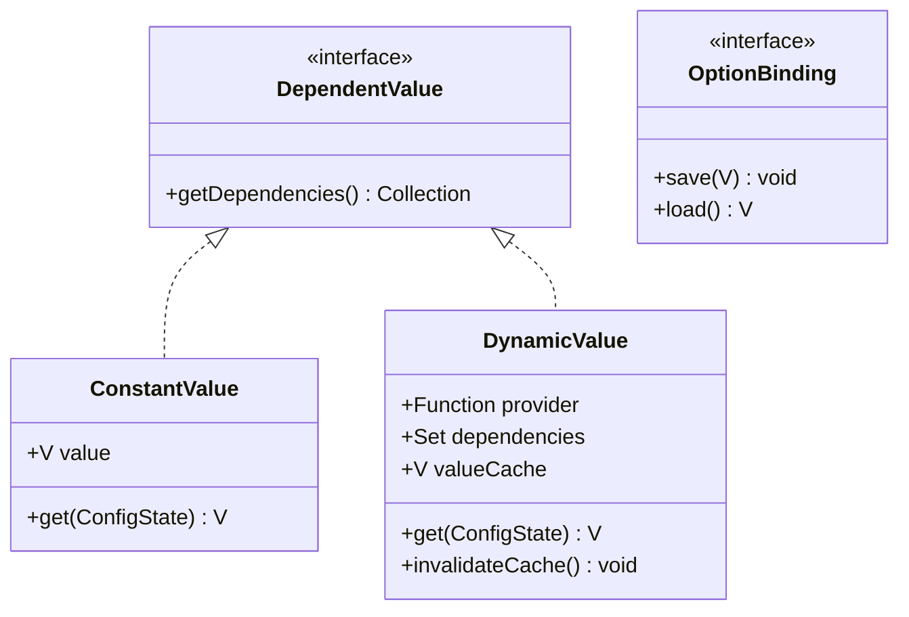
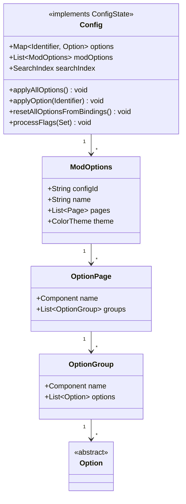
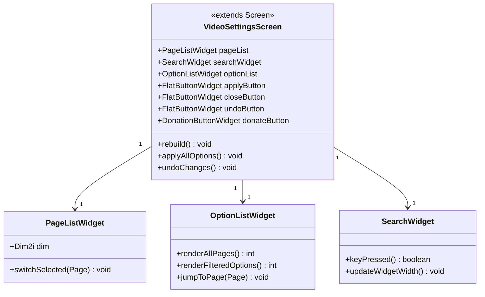

# Sodium 配置系统分析

> 高性能 Minecraft 渲染优化 Mod 配置架构设计文档

---

## 文档信息

| 属性 | 值 |
|------|-----|
| 分析对象 | Sodium v0.8.6 配置系统 |
| 源码分支 | `dev` |
| 核心模块 | `config/`、`gui/` |
| 分析日期 | 2026-03-24 |

---

## 目录

[配置概述](#配置概述)  
[配置持久化机制](#配置持久化机制)  
[选项定义系统](#选项定义系统)  
[选项构建器模式](#选项构建器模式)  
[值类型与依赖系统](#值类型与依赖系统)  
[配置状态与变更管理](#配置状态与变更管理)  
[页面与分组结构](#页面与分组结构)  
[配置界面实现](#配置界面实现)  
[控件系统](#控件系统)  
[搜索与索引](#搜索与索引)  
[错误恢复与只读模式](#错误恢复与只读模式)  
[课后自查](#课后自查)  

---

## 配置概述

Sodium 的配置系统是一套完整的**声明式配置框架**，分为数据层与展示层两大模块：

- **数据层**（`config/` 包）：负责选项的定义、绑定、验证、持久化与依赖追踪
- **展示层**（`gui/` 包）：负责将选项渲染为可交互的 GUI 控件，提供搜索、分类浏览等功能

### 核心设计原则

1. **Builder 模式**：所有配置对象通过链式调用构建（Builder Pattern）
2. **双缓冲编辑**：内存中的 `modifiedValue` 与已应用的 `value` 分离，支持撤销
3. **依赖追踪**：选项之间可以声明依赖关系，依赖变更时自动刷新缓存
4. **平台无关**：核心逻辑在 `common/` 源码集中实现，平台集成层提供文件路径等环境信息
5. **第三方扩展**：提供 Overlay 机制，允许第三方 mod 劫持/修改任意选项

### 配置文件

Sodium 使用三类配置文件：

| 文件名 | 用途 | 持久化 |
|--------|------|--------|
| `sodium-options.json` | 游戏内配置选项 | 是 |
| `sodium-mixins.properties` | 运行时补丁控制 | 否（仅开发用） |
| `sodium-fingerprint.json` | 安装指纹 | 否（版本标识） |

`sodium-options.json` 结构示例：

```json
{
  "quality": {
    "hidden_fluid_culling": true,
    "improved_fluid_shaping": false
  },
  "performance": {
    "chunk_builder_threads": 0,
    "use_entity_culling": true,
    "use_fog_occlusion": true
  },
  "notifications": {
    "has_seen_donation_prompt": false
  }
}
```

---

## 配置持久化机制

### `SodiumOptions` 类结构

`SodiumOptions` 是直接对应 JSON 文件的 POJO 类：

```startLine:1:40:D:/Minecraft-Learning/assets/sodium/src/common/src/main/java/net/caffeinemc/mods/sodium/client/gui/SodiumOptions.java
public class SodiumOptions {
    public final QualitySettings quality = new QualitySettings();
    public final PerformanceSettings performance = new PerformanceSettings();
    public final AdvancedSettings advanced = new AdvancedSettings();
    public @NonNull DebugSettings debug = new DebugSettings();
    public final NotificationSettings notifications = new NotificationSettings();
    private boolean readOnly;

    public static SodiumOptions loadFromDisk() { ... }
    public static void writeToDisk(SodiumOptions config) throws IOException { ... }
}
```

### 安全写入策略

Sodium 使用**原子写入**防止配置损坏：

```startLine:90:130:D:/Minecraft-Learning/assets/sodium/src/common/src/main/java/net/caffeinemc/mods/sodium/client/gui/SodiumOptions.java
public static void writeToDisk(SodiumOptions config) throws IOException {
    if (config.isReadOnly()) {
        throw new IllegalStateException("Config file is read-only");
    }
    Path path = getConfigPath();
    Path dir = path.getParent();

    if (!Files.exists(dir)) {
        Files.createDirectories(dir);
    } else if (!Files.isDirectory(dir)) {
        throw new IOException("Not a directory: " + dir);
    }
    FileUtil.writeTextRobustly(GSON.toJson(config), path);
}
```

`FileUtil.writeTextRobustly()` 内部使用**写临时文件再移动**的策略：

1. 先写入 `sodium-options.json.tmp`
2. 确认写入成功后再原子移动为 `sodium-options.json`
3. 若中途崩溃，原文件不受影响

### 配置损坏检测

`VideoSettingsScreen` 在构造时调用 `ConfigManager.CONFIG.resetAllOptionsFromBindings()` 重新从 Binding 读取值。若 JSON 解析失败，会回退到默认值并显示 `ConfigCorruptedScreen`：

```startLine:60:80:D:/Minecraft-Learning/assets/sodium/src/common/src/main/java/net/caffeinemc/mods/sodium/client/gui/VideoSettingsScreen.java
private VideoSettingsScreen(Screen prevScreen, @Nullable OptionPage initiallyFocusedPage) {
    super(Component.literal("Sodium Renderer Settings"));
    this.prevScreen = prevScreen;
    this.initiallyFocusedPage = initiallyFocusedPage;
    this.checkPromptTimers();
    ConfigManager.CONFIG.resetAllOptionsFromBindings();
}
```

---

## 选项定义系统

### 类继承层次



### `Option` 基类

```startLine:1:50:D:/Minecraft-Learning/assets/sodium/src/common/src/main/java/net/caffeinemc/mods/sodium/client/config/structure/Option.java
public abstract class Option {
    final Identifier id;
    final Collection dependencies;
    final Component name;
    final DependentValue enabled;
    Config state;
    Control control;

    Option(Identifier id, Collection dependencies, Component name, DependentValue enabled) {
        if (dependencies.contains(id)) {
            throw new IllegalArgumentException("Option cannot depend on itself");
        }
        this.id = id;
        this.dependencies = dependencies;
        this.name = name;
        this.enabled = enabled;
    }

    abstract Control createControl();

    public Control getControl() {
        if (this.control == null) {
            this.control = this.createControl();
        }
        return this.control;
    }

    public boolean isEnabled() {
        return this.enabled.get(this.state);
    }
}
```

### `StatefulOption` — 带状态的选项

`StatefulOption` 是最核心的选项类型，支持运行时编辑与持久化：

```startLine:1:60:D:/Minecraft-Learning/assets/sodium/src/common/src/main/java/net/caffeinemc/mods/sodium/client/config/structure/StatefulOption.java
public abstract class StatefulOption extends Option {
    final StorageEventHandler storage;
    final Function tooltipProvider;
    final OptionImpact impact;
    final Set flags;
    final DependentValue defaultValue;
    final Boolean controlHiddenWhenDisabled;
    final OptionBinding binding;
    final Consumer applyHook;

    private final Collection > dependents = new ObjectOpenHashSet<>(0);
    private final Collection > applyDependents = new ObjectOpenHashSet<>(0);

    private V value;         // 已应用的最终值
    private V modifiedValue; // 编辑中的临时值

    public void modifyValue(V value) {
        if (this.modifiedValue != value) {
            this.modifiedValue = value;
            this.state.invalidateDependents(this.dependents);
        }
    }

    @Override
    boolean applyChanges() {
        if (this.hasChanged()) {
            this.value = this.modifiedValue;
            this.binding.save(this.value);
            this.state.notifyStorageWrite(this.storage);
            this.state.invalidateDependents(this.applyDependents);
            return true;
        }
        return false;
    }

    @Override
    public boolean hasChanged() {
        return this.modifiedValue != this.value;
    }
}
```

**关键设计**：**双缓冲值模式**：
- `value`：已确认并保存到磁盘的值
- `modifiedValue`：用户正在编辑但尚未保存的值
- `hasChanged()` 返回两者是否不同，从而判断是否有待应用的变更

---

## 选项构建器模式

Sodium 使用**链式 Builder** 模式定义选项，每个选项类型对应一个 Builder：

```
ConfigBuilder
  └── registerModOptions() → ModOptionsBuilder
        └── createOptionPage() → OptionPageBuilder
              └── createOptionGroup() → OptionGroupBuilder
                    └── createBooleanOption() → BooleanOptionBuilder
                          ├── setName()
                          ├── setTooltip()
                          ├── setDefaultValue()
                          ├── setBinding()
                          └── build() → BooleanOption
```

### `ConfigBuilderImpl` — 配置构建入口

```startLine:1:50:D:/Minecraft-Learning/assets/sodium/src/common/src/main/java/net/caffeinemc/mods/sodium/client/config/builder/ConfigBuilderImpl.java
public class ConfigBuilderImpl implements ConfigBuilder {
    public Collection build() {
        var configs = new ArrayList(this.pendingModConfigBuilders.size());
        for (var builder : this.pendingModConfigBuilders) {
            configs.add(builder.build());
        }
        return configs;
    }

    @Override
    public ModOptionsBuilder registerModOptions(String configId, String name, String version) {
        var builder = new ModOptionsBuilderImpl(configId, name, version);
        this.pendingModConfigBuilders.add(builder);
        return builder;
    }

    @Override
    public BooleanOptionBuilder createBooleanOption(Identifier id) {
        return new BooleanOptionBuilderImpl(id);
    }

    @Override
    public IntegerOptionBuilder createIntegerOption(Identifier id) {
        return new IntegerOptionBuilderImpl(id);
    }

    @Override
    public EnumOptionBuilder createEnumOption(Identifier id, Class enumClass) {
        return new EnumOptionBuilderImpl<>(id, enumClass);
    }
}
```

### `BooleanOptionBuilderImpl` — 布尔选项构建

```startLine:1:90:D:/Minecraft-Learning/assets/sodium/src/common/src/main/java/net/caffeinemc/mods/sodium/client/config/builder/BooleanOptionBuilderImpl.java
class BooleanOptionBuilderImpl extends StatefulOptionBuilderImpl implements BooleanOptionBuilder {
    BooleanOptionBuilderImpl(Identifier id) {
        super(id);
    }

    @Override
    BooleanOption build() {
        this.prepareBuild();
        return new BooleanOption(
            this.id,
            this.getDependencies(),
            this.getName(),
            this.getEnabled(),
            this.getStorage(),
            this.getTooltipProvider(),
            this.getImpact(),
            this.getFlags(),
            this.getDefaultValue(),
            this.getControlHiddenWhenDisabled(),
            this.getBinding(),
            this.getApplyHook());
    }

    @Override
    Class getOptionClass() {
        return BooleanOption.class;
    }
}
```

### `OptionBuilderImpl` — 基础构建器逻辑

```startLine:1:70:D:/Minecraft-Learning/assets/sodium/src/common/src/main/java/net/caffeinemc/mods/sodium/client/config/builder/OptionBuilderImpl.java
public abstract class OptionBuilderImpl implements OptionBuilder {
    final Identifier id;
    private O baseOption;
    private Component name;
    private DependentValue enabled;

    void prepareBuild() {
        this.validateData();
        if (this.getEnabled() == null) {
            this.enabled = new ConstantValue<>(true);
        }
    }

    void validateData() {
        Validate.notNull(this.getName(), "Name must be set");
        Validate.notBlank(this.getName().getString(), "Name must not be blank");
    }

    Collection getDependencies() {
        var dependencies = new ObjectLinkedOpenOpenHashSet<>();
        dependencies.addAll(this.getEnabled().getDependencies());
        return dependencies;
    }
}
```

---

## 值类型与依赖系统

### 三种值类型



#### `ConstantValue` — 常量值

最简单的情况，直接返回固定值：

```java
public class ConstantValue implements DependentValue {
    private final V value;
    public ConstantValue(V value) { this.value = value; }
    @Override
    public V get(ConfigState state) { return value; }
}
```

#### `DynamicValue` — 动态值

支持基于其他选项的动态计算，带缓存：

```startLine:1:60:D:/Minecraft-Learning/assets/sodium/src/common/src/main/java/net/caffeinemc/mods/sodium/client/config/value/DynamicValue.java
public class DynamicValue implements DependentValue, ConfigState {
    private final Set dependencies;
    private final Function provider;
    private V valueCache;

    public DynamicValue(Function provider, Identifier[] dependencies) {
        this.provider = provider;
        this.dependencies = Set.of(dependencies);
    }

    @Override
    public V get(ConfigState state) {
        if (this.valueCache != null) {
            return this.valueCache;
        }
        this.state = state;
        this.valueCache = this.provider.apply(this);
        this.state = null;
        return this.valueCache;
    }

    public void invalidateCache() {
        this.valueCache = null;
    }
}
```

#### `OptionBinding` — 选项绑定

负责选项值与实际存储之间的读写：

```startLine:1:30:D:/Minecraft-Learning/assets/sodium/src/common/src/main/java/net/caffeinemc/mods/sodium/client/config/AnonymousOptionBinding.java
public class AnonymousOptionBinding implements OptionBinding {
    private final Consumer save;
    private final Supplier load;

    public AnonymousOptionBinding(Consumer save, Supplier load) {
        this.save = save;
        this.load = load;
    }

    @Override
    public void save(V value) {
        this.save.accept(value);
    }

    @Override
    public V load() {
        return this.load.get();
    }
}
```

### 依赖追踪机制

`DynamicValue` 的核心能力是**按需计算 + 缓存失效**。当依赖的选项变更时，调用 `invalidateCache()` 清除缓存，下次读取时重新计算：

```startLine:90:120:D:/Minecraft-Learning/assets/sodium/src/common/src/main/java/net/caffeinemc/mods/sodium/client/config/structure/StatefulOption.java
public void modifyValue(V value) {
    if (this.modifiedValue != value) {
        this.modifiedValue = value;
        this.state.invalidateDependents(this.dependents);
    }
}
```

`Config` 类负责管理依赖图的构建与循环检测：

```startLine:130:170:D:/Minecraft-Learning/assets/sodium/src/common/src/main/java/net/caffeinemc/mods/sodium/client/config/structure/Config.java
private void validateDependencies() {
    // 连接依赖者与被依赖者
    option.visitDependentValues(dependent -> {
        if (dependent instanceof DynamicValue dynamicValue) {
            var dependencyOption = this.options.get(dependency);
            if (dependencyOption instanceof StatefulOption statefulOption) {
                statefulOption.registerDependent(dynamicValue);
            }
        }
    });

    // 检测循环依赖
    for (var option : this.options.values()) {
        this.checkDependencyCycles(option, stack, finished);
    }
}
```

---

## 配置状态与变更管理

### `Config` 类 — 配置中枢



### 选项标志与钩子

`Config.processFlags()` 根据选项变更标志触发相应的系统行为：

```startLine:240:280:D:/Minecraft-Learning/assets/sodium/src/common/src/main/java/net/caffeinemc/mods/sodium/client/config/structure/Config.java
private void processFlags(Set flags) {
    Minecraft client = Minecraft.getInstance();

    if (client.level != null) {
        if (flags.contains(OptionFlag.REQUIRES_RENDERER_RELOAD.getId())) {
            client.levelRenderer.allChanged();
        } else if (flags.contains(OptionFlag.REQUIRES_RENDERER_UPDATE.getId())) {
            client.levelRenderer.needsUpdate();
        }
    }

    if (flags.contains(OptionFlag.REQUIRES_ASSET_RELOAD.getId())) {
        client.updateMaxMipLevel(client.options.mipmapLevels().get());
        client.delayTextureReload();
    }

    if (flags.contains(OptionFlag.REQUIRES_VIDEOMODE_RELOAD.getId())) {
        client.getWindow().changeFullscreenVideoMode();
    }

    if (flags.contains(OptionFlag.REQUIRES_GAME_RESTART.getId())) {
        Console.instance().logMessage(MessageLevel.WARN,
            "sodium.console.game_restart", true, 10.0);
    }
}
```

| 标志 | 触发行为 |
|------|----------|
| `REQUIRES_RENDERER_RELOAD` | 重新构建所有区块网格 |
| `REQUIRES_RENDERER_UPDATE` | 标记渲染器需要更新 |
| `REQUIRES_ASSET_RELOAD` | 重新加载纹理贴图 |
| `REQUIRES_VIDEOMODE_RELOAD` | 更新全屏分辨率 |
| `REQUIRES_GAME_RESTART` | 在控制台输出警告 |

### 三阶段生命周期

```
选项变更流程:
  1. 用户交互 → modifyValue(modifiedValue)
     ↓
  2. 依赖缓存失效 → invalidateDependents()
     ↓
  3. 点击"应用" → applyAllOptions()
     ↓
  4. 保存到 Binding → binding.save(value)
     ↓
  5. 标记待写入 → notifyStorageWrite()
     ↓
  6. 刷新存储 → flushStorageHandlers()
     ↓
  7. 处理标志 → processFlags()
     ↓
  8. 触发渲染器更新等副作用
```

---

## 页面与分组结构

### 层级结构

```
ModOptions (一个 mod 一份)
  └── pages: List~Page~
        ├── OptionPage (钠内置页面)
        │     └── groups: List~OptionGroup~
        │           └── options: List~Option~
        └── ExternalPage (第三方页面入口)
```

### `ConfigManager` — 配置注册中心

`ConfigManager` 负责收集所有 mod 的配置入口点，按优先级排序：

```startLine:1:80:D:/Minecraft-Learning/assets/sodium/src/common/src/main/java/net/caffeinemc/mods/sodium/client/config/ConfigManager.java
public class ConfigManager {
    private static final Collection configUsers = new ArrayList<>();
    public static Config CONFIG;

    public static void registerConfigEntryPoint(String className, String modId) {
        // 通过反射加载 ConfigEntryPoint 实现类
    }

    public static void registerConfigsEarly() {
        registerConfigs(ConfigEntryPoint::registerConfigEarly);
    }

    public static void registerConfigsLate() {
        registerConfigs(ConfigEntryPoint::registerConfigLate);
    }

    private static void registerConfigs(BiConsumer registerMethod) {
        var configIds = new ObjectOpenHashSet<>();
        ModOptions sodiumModOptions = null;
        var modConfigs = new ObjectArrayList<>();

        for (ConfigUser configUser : configUsers) {
            var entryPoint = configUser.configEntrypoint.get();
            var builder = new ConfigBuilderImpl(modInfoFunction, configUser.modId);
            registerMethod.accept(entryPoint, builder);
            builtConfigs = builder.build();
            // ... 排序：sodium 优先，其他 mod 按名字排序
        }

        CONFIG = new Config(modConfigs);
    }
}
```

---

## 配置界面实现

### `VideoSettingsScreen` — 主配置界面



### 界面布局（ASCII）

```
+------------------------------------------------------------------------------+
| [Search... T]                                          [Support Sodium ♥]   |
+----------------------+-------------------------------------------------------+
|  Pages               |  Quality                                              |
|  ─────────           |  ───────────────────────────────────────────────────── |
|  ▸ General           |                                                         |
|    Quality           |  Fluid Rendering    [▣ Hidden Fluid Culling]        |
|    Performance       |  Fluid Shaping      [▣ Improved Fluid Shaping]        |
|    Advanced          |  Weather Intensity  [▣ Particles]                     |
|    Debug             |  Sky                 [▣ Fancy]                         |
|    Notifications     |                                                         |
|                      |  ▸ Biome Colors                                       |
|                      |                                                         |
|                      |  ▸ Translucency Sorting    [▣ Enabled]                 |
|                      |                                                         |
+----------------------+-------------------------------------------------------+
|                     [Undo] [Apply] [Done]                                      |
+------------------------------------------------------------------------------+
```

### 自适应布局

`VideoSettingsScreen` 根据窗口大小自动调整布局：

```startLine:200:240:D:/Minecraft-Learning/assets/sodium/src/common/src/main/java/net/caffeinemc/mods/sodium/client/gui/VideoSettingsScreen.java
private void rebuild() {
    boolean stackVertically = false;
    int minWidthToStack = Layout.PAGE_LIST_WIDTH + Layout.INNER_MARGIN * 2
        + Layout.OPTION_WIDTH + Layout.OPTION_LIST_SCROLLBAR_OFFSET
        + Layout.SCROLLBAR_WIDTH + Layout.BUTTON_LONG;
    int maxWidthToStack = minWidthToStack + Layout.BUTTON_LONG * 2 + Layout.INNER_MARGIN;

    if (w > minWidthToStack && w < maxWidthToStack) {
        stackVertically = true;
    } else if (w < minWidthToStack) {
        reserveBottomSpace = true;
    }
}
```

当窗口较小时，**应用/撤销按钮会移动到右下角垂直堆叠**而非水平排列。

### 快捷键支持

| 按键 | 功能 |
|------|------|
| `T` | 聚焦搜索框 |
| `Shift + P` | 打开原版视频设置 |
| `Ctrl + 滚轮` | 调整 GUI 缩放 |

```startLine:330:360:D:/Minecraft-Learning/assets/sodium/src/common/src/main/java/net/caffeinemc/mods/sodium/client/gui/VideoSettingsScreen.java
@Override
public boolean keyReleased(KeyEvent event) {
    if (this.searchWidget.isSearching()) {
        return false;
    }
    // shift + P opens the vanilla video settings screen
    if (event.key() == GLFW.GLFW_KEY_P && (event.modifiers() & GLFW.GLFW_MOD_SHIFT) != 0) {
        Minecraft.getInstance().setScreen(
            new net.minecraft.client.gui.screens.options.VideoSettingsScreen(...));
        return true;
    }
    // T starts search
    if (event.key() == GLFW.GLFW_KEY_T) {
        this.setFocused(this.searchWidget);
        return true;
    }
    return super.keyReleased(event);
}
```

---

## 控件系统

### 控件继承结构

```
Control (接口)
  ├── CyclingControl (枚举循环选择)
  ├── SliderControl (整数滑块)
  ├── TickBoxControl (布尔勾选)
  └── ExternalButtonControl (外部跳转按钮)
```

### 控件与元素的分离

`Control` 负责创建 `ControlElement`，后者才是实际渲染的 GUI 组件：

```startLine:1:30:D:/Minecraft-Learning/assets/sodium/src/common/src/main/java/net/caffeinemc/mods/sodium/client/gui/options/control/Control.java
public interface Control {
    ControlElement createElement(Screen screen, AbstractOptionList list,
                                  Dim2i dim, ColorTheme theme);
}
```

```startLine:1:60:D:/Minecraft-Learning/assets/sodium/src/common/src/main/java/net/caffeinemc/mods/sodium/client/gui/options/control/ControlElement.java
public abstract class ControlElement {
    protected final Option option;
    protected final Control control;

    public boolean isFocused() { ... }
    public boolean isMouseOver(int mouseX, int mouseY) { ... }
    public abstract void render(GuiGraphicsExtractor graphics,
                                int mouseX, int mouseY, float delta);
    public abstract boolean mouseClicked(MouseButtonEvent event);
}
```

### `TickBoxControl` — 开关控件

```startLine:1:60:D:/Minecraft-Learning/assets/sodium/src/common/src/main/java/net/caffeinemc/mods/sodium/client/gui/options/control/TickBoxControl.java
public class TickBoxControl implements Control {
    @Override
    public ControlElement createElement(...) {
        return new TickBoxElement(screen, list, dim, theme, option);
    }
}

private static class TickBoxElement extends ControlElement {
    @Override
    public boolean mouseClicked(MouseButtonEvent event) {
        if (event.button() == 0) {
            ((StatefulOption) this.option).modifyValue(
                !(Boolean) this.option.getValidatedValue());
            this.list.setFocused(this.option.getControl().createElement(...));
            return true;
        }
        return false;
    }
}
```

### `SliderControl` — 滑块控件

```startLine:1:80:D:/Minecraft-Learning/assets/sodium/src/common/src/main/java/net/caffeinemc/mods/sodium/client/gui/options/control/SliderControl.java
public class SliderControl implements Control {
    @Override
    public ControlElement createElement(...) {
        return new SliderElement(screen, list, dim, theme, option);
    }
}

private static class SliderElement extends ControlElement {
    @Override
    public boolean mouseDragged(MouseDragEvent event) {
        int relativeX = mouseX - this.getX();
        float pct = (float) relativeX / this.getWidth();
        var range = ((IntegerOption) this.option).getSteppedValidator();
        int newValue = range.toValueInStep(pct);
        ((StatefulOption) this.option).modifyValue(newValue);
    }
}
```

---

## 搜索与索引

Sodium 内置了**bigram 全文搜索**功能，支持模糊匹配选项名称：

```startLine:1:30:D:/Minecraft-Learning/assets/sodium/src/common/src/main/java/net/caffeinemc/mods/sodium/client/config/search/BigramSearchIndex.java
public class BigramSearchIndex implements SearchIndex {
    @Override
    public List getMatches(String query) {
        var bigrams = generateBigrams(query);
        var candidates = findMatchingSources(bigrams);
        return rankByRelevance(candidates, query);
    }
}
```

搜索结果直接过滤 `OptionListWidget` 中的选项列表：

```startLine:220:240:D:/Minecraft-Learning/assets/sodium/src/common/src/main/java/net/caffeinemc/mods/sodium/client/gui/VideoSettingsScreen.java
private void onSearchResults(List searchResults) {
    if (searchResults.isEmpty()) {
        this.optionList.clearFilter();
    } else {
        this.optionList.setFilteredOptions(searchResults);
    }
    this.optionList.rebuild(this);
}
```

---

## 错误恢复与只读模式

### 配置损坏处理

当 `sodium-options.json` 解析失败时：

1. `ConfigCorruptedScreen` 显示友好错误界面
2. 用户可选择**继续**（重置为默认配置）或**返回**
3. 继续后调用 `SodiumClientMod.restoreDefaultOptions()` 恢复默认

```startLine:1:50:D:/Minecraft-Learning/assets/sodium/src/common/src/main/java/net/caffeinemc/mods/sodium/client/gui/screen/ConfigCorruptedScreen.java
private static final String TEXT_BODY_RAW = """
    A problem occurred while trying to load the configuration file. This
    can happen when the file has been corrupted on disk, or when trying
    to manually edit the file by hand.

    If you continue, the configuration file will be reset back to known-good
    defaults, and you will lose any changes that have since been made to your
    Video Settings.
    """;
```

### 只读模式

当配置文件被标记为只读时，`VideoSettingsScreen` 不允许编辑，直接跳转到 `ConfigCorruptedScreen`：

```startLine:90:105:D:/Minecraft-Learning/assets/sodium/src/common/src/main/java/net/caffeinemc/mods/sodium/client/gui/VideoSettingsScreen.java
public static Screen createScreen(Screen currentScreen) {
    if (SodiumClientMod.options().isReadOnly()) {
        return new ConfigCorruptedScreen(currentScreen, VideoSettingsScreen::new);
    } else {
        return new VideoSettingsScreen(currentScreen);
    }
}
```

---

## 配置项分类总表

| 分类 | 控件类型 | 持久化 | 标志支持 | 依赖支持 |
|------|----------|--------|----------|----------|
| `BooleanOption` | `TickBoxControl` | 是 | 是 | 是 |
| `IntegerOption` | `SliderControl` | 是 | 是 | 是 |
| `EnumOption` | `CyclingControl` | 是 | 是 | 是 |
| `ExternalButtonOption` | `ExternalButtonControl` | 否 | 否 | 否 |
| `OptionOverlay` | 继承基类控件 | 可覆盖 | 可覆盖 | 可覆盖 |

---

## 课后自查

- [ ] 能否解释 `StatefulOption` 中 `value` 和 `modifiedValue` 的区别及其设计目的？
- [ ] Builder 模式的链式调用是如何实现选项的声明式定义的？
- [ ] `DynamicValue` 的缓存失效机制是如何工作的？在什么场景下需要它？
- [ ] `Config.processFlags()` 中的五种标志分别对应什么渲染器行为？
- [ ] `OptionOverlay` 机制允许第三方 mod 修改任意选项，请描述其实现原理。

---

## 相关文档

- [01-architecture-overview.md](01-architecture-overview.md) — Sodium 整体架构
- [02-chunk-render-system.md](02-chunk-render-system.md) — 区块渲染系统
- [03-occlusion-culling.md](03-occlusion-culling.md) — 遮挡剔除系统
- [04-render-pipeline.md](04-render-pipeline.md) — 渲染管线
- [05-shader-system.md](05-shader-system.md) — 着色器系统
- [06-platform-integration.md](06-platform-integration.md) — 平台集成

---

*分析时间: 2026-03-24*  
*源码版本: Sodium dev (对应 v0.8.6)*  
*数据来源: GitHub CaffeineMC/sodium @ dev 分支*
