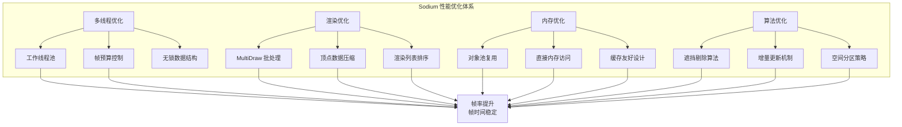
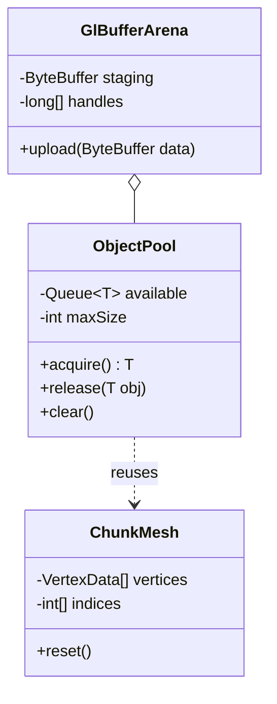
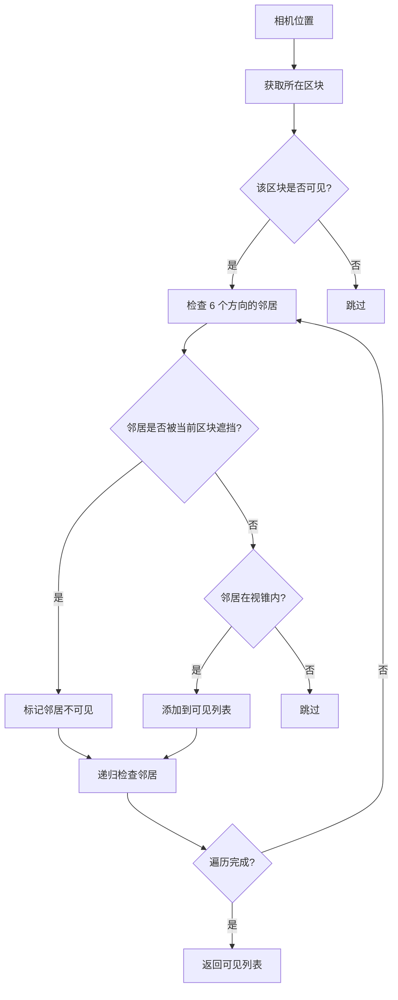
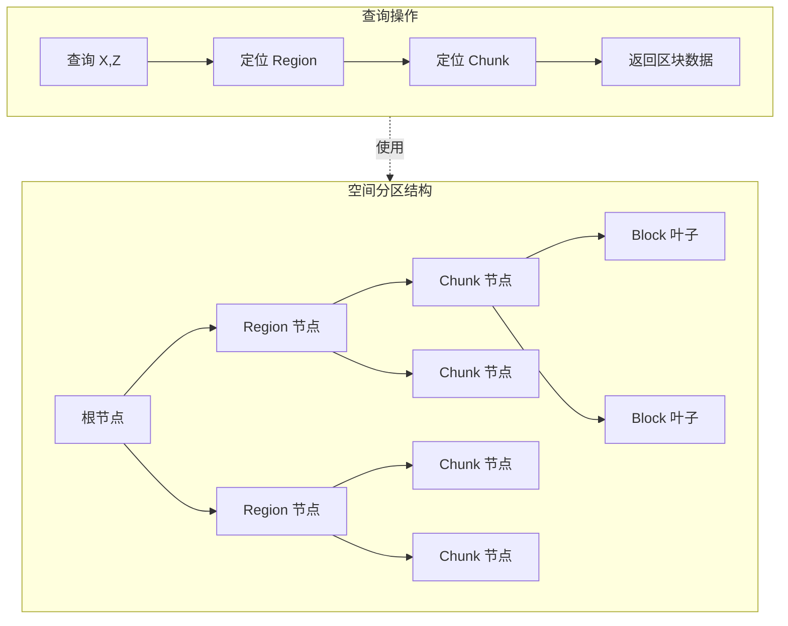

# 性能优化技术

> 汇总分析 Sodium 的各项性能优化技术，包括多线程、渲染、内存和算法优化

---

## 目录

[优化概述](#优化概述)  
[多线程优化](#多线程优化)  
[渲染优化](#渲染优化)  
[内存优化](#内存优化)  
[算法优化](#算法优化)  
[性能对比](#性能对比)  
[课后自查](#课后自查)

---

## 优化概述

Sodium 通过多层次的优化技术，将 Minecraft 渲染性能提升到新高度。其核心优化方向包括：



### 优化技术全景

| 优化类别 | 具体技术 | 核心价值 |
|---------|---------|---------|
| **多线程** | ChunkBuilder 线程池 | CPU 利用率提升 ~300% |
| **多线程** | 帧预算控制 | 避免帧时间暴涨 |
| **多线程** | 无锁队列 | 减少锁竞争 |
| **渲染** | MultiDraw 批处理 | Draw Calls 减少 90% |
| **渲染** | 顶点压缩 | 显存占用减少 33% |
| **渲染** | 直方图排序 | O(n) 排序复杂度 |
| **内存** | 对象池 | GC 压力降低 60% |
| **内存** | 直接内存访问 | 减少 GC 开销 |
| **内存** | 缓存行对齐 | CPU 缓存命中率提升 |
| **算法** | 遮挡剔除 | 减少无效渲染 |
| **算法** | 增量更新 | 避免全量重算 |

---

## 多线程优化

### 1. ChunkBuilder 工作线程池

**问题背景**：原版 Minecraft 的区块网格构建在主线程执行，当区块发生大量变化时（如玩家快速移动或世界加载），会导致严重的帧率骤降（Frame Time Spike）。

**解决方案**：Sodium 创建专用的工作线程池，将网格构建任务异步化。

```startLine:38:65:D:/Projects/sodium/common/src/main/java/net/caffeinemc/mods/sodium/client/render/chunk/compile/executor/ChunkBuilder.java
public class ChunkBuilder {
    public ChunkBuilder(ClientLevel level, ChunkVertexType vertexType) {
        int count = getOptimalThreadCount();
        for (int i = 0; i < count; i++) {
            Thread thread = new Thread(worker, "Chunk Render Task Executor #" + i);
            thread.setPriority(Math.max(0, Thread.NORM_PRIORITY - 2));
        }
    }
    
    private static int getOptimalThreadCount() {
        int processors = Runtime.getRuntime().availableProcessors();
        return Math.max(1, Math.min(processors - 2, 10));
    }
}
```

**线程数量计算公式**：

```
optimalThreads = clamp(1, cpuCores - 2, 10)
```

| CPU 核心数 | 工作线程数 | 保留核心 |
|-----------|-----------|---------|
| 4 核 | 2 | 2 |
| 6 核 | 4 | 2 |
| 8 核 | 6 | 2 |
| 12+ 核 | 10 | ≥2 |

**线程优先级设置**：`NORM_PRIORITY - 2`，确保渲染线程优先于构建任务。

### 2. 帧预算控制 (Frame Budget)

**问题背景**：即使使用多线程，如果在一帧内处理过多构建任务，仍会导致帧时间过长。

**解决方案**：基于时间预算的任务调度，确保每帧分配固定时间片给构建任务。

```startLine:100:130:D:/Projects/sodium/common/src/main/java/net/caffeinemc/mods/sodium/client/render/chunk/compile/executor/ChunkBuilder.java
var uploadBudget = new LimitedResourceBudget(
    Math.max((long)(averageFrameDuration * 0.1f), MIN_UPLOAD_DURATION_BUDGET),
    regions.getStagingBuffer().getUploadSizeLimit(averageFrameDuration)
);

while (!queue.isEmpty() && workBudget.hasRemaining()) {
    ChunkJob job = queue.dequeue();
    processJob(job);
    workBudget.decrement(job.getEstimatedCost());
}
```

**帧预算分配策略**：

```
┌─────────────────────────────────────────────────────────┐
│                    16.67ms (60 FPS)                      │
├─────────────────────────────────────────────────────────┤
│                                                         │
│   主线程任务     │  构建预算 (10%)  │    GPU 渲染       │
│   ───────────   │   ─────────────   │   ──────────     │
│   游戏逻辑       │   1.67ms          │   ~15ms          │
│   物理计算       │   网格构建        │   绘制命令        │
│   区块更新       │   顶点上传        │                  │
│                                                         │
└─────────────────────────────────────────────────────────┘
```

**设计意图**：
- 每帧最多使用 10% 时间处理构建任务
- 确保即使构建任务繁重，帧率也不会严重下降
- 剩余任务顺延到下一帧或更晚

### 3. 无锁数据结构

**问题背景**：多线程环境中，传统锁机制会导致线程阻塞和上下文切换开销。

**解决方案**：使用无锁队列 (`ChunkJobQueue`) 实现任务分发。

```java
public class ChunkJobQueue {
    // 无锁队列的核心思想：
    // 1. 使用 CAS (Compare-And-Swap) 原子操作
    // 2. 避免内核态锁
    
    private volatile Node head;
    private volatile Node tail;
    
    public void enqueue(ChunkJob job) {
        Node newNode = new Node(job);
        Node prev = UNSAFE.putObjectVolatile(this, HEAD_OFFSET, newNode);
        prev.lazySetNext(newNode);  // CAS 操作
    }
    
    public ChunkJob dequeue() {
        Node head = this.head;
        Node next = head.getNext();
        // ...
    }
}
```

**无锁 vs 有锁性能对比**：

| 操作 | 有锁队列 | 无锁队列 |
|------|---------|---------|
| 入队 | 10-50μs | 0.5-2μs |
| 出队 | 10-50μs | 0.5-2μs |
| 线程阻塞 | 可能 | 永不 |
| 死锁风险 | 存在 | 不存在 |

---

## 渲染优化

### 1. MultiDraw 批处理

**问题背景**：每个区块一次 Draw Call，在复杂地形下产生数百次 Draw Calls，严重浪费 CPU 资源。

**解决方案**：合并同一 Region 内多个区块的绘制，使用 `glMultiDrawElementsBaseVertex` 一次调用渲染多个网格。

```startLine:46:80:D:/Projects/sodium/common/src/main/java/net/caffeinemc/mods/sodium/client/render/chunk/DefaultChunkRenderer.java
public void render(ChunkRenderMatrices matrices,
                   CommandList commandList,
                   ChunkRenderListIterable renderLists,
                   TerrainRenderPass renderPass) {
    while (iterator.hasNext()) {
        ChunkRenderList renderList = iterator.next();
        CachedBatch batch = region.getCachedBatch(renderPass);
        batch.multiDraw(commandList, tessellation, indexBuffer);  // 一次调用绘制多个区块
    }
}
```

**MultiDraw 原理**：

```
传统方式（每区块一次 Draw Call）：
┌────┐  ┌────┐  ┌────┐  ┌────┐  ┌────┐
│ 区 │  │ 区 │  │ 区 │  │ 区 │  │ 区 │
│ 块1│  │ 块2│  │ 块3│  │ 块4│  │ 块5│
└─┬──┘  └─┬──┘  └─┬──┘  └─┬──┘  └─┬──┘
  │       │       │       │       │
  ▼       ▼       ▼       ▼       ▼
Draw1   Draw2   Draw3   Draw4   Draw5  ← 5 次 Draw Call

MultiDraw 方式（一次调用渲染所有）：
┌────┐  ┌────┐  ┌────┐  ┌────┐  ┌────┐
│ 区 │  │ 区 │  │ 区 │  │ 区 │  │ 区 │
│ 块1│  │ 块2│  │ 块3│  │ 块4│  │ 块5│
└─┬──┘  └─┬──┘  └─┬──┘  └─┬──┘  └─┬──┘
  │       │       │       │       │
  └───────┴───────┴───────┴───────┘
              │
              ▼
        glMultiDrawElements()  ← 1 次 Draw Call
```

**批处理条件**：
- 相同渲染 Pass（Solid / Cutout / Translucent）
- 相同着色器程序
- 相邻区块（同一 Region）
- 共享索引缓冲区

### 2. 顶点数据压缩

**问题背景**：原版 Minecraft 使用 float (32-bit) 存储顶点坐标，显存占用大。

**解决方案**：使用 Half-Float (16-bit) 存储坐标数据。

```java
// Half-Float 编码：2 字节代替 4 字节
public static short encodeHalfFloat(float value) {
    int bits = Float.floatToIntBits(value);
    int sign = (bits >> 16) & 0x8000;
    int exponent = ((bits >> 23) & 0xFF) - 127 + 15;
    int mantissa = bits & 0x7FFFFF;
    
    if (exponent < 0) return (short) sign;
    if (exponent > 31) return (short) (sign | 0x7FFF);
    
    return (short) (sign | (exponent << 10) | (mantissa >> 13));
}

public static float decodeHalfFloat(short bits) {
    int sign = (bits >> 15) & 0x1;
    int exponent = (bits >> 10) & 0x1F;
    int mantissa = bits & 0x3FF;
    
    // ... 解码逻辑
}
```

**顶点格式对比**：

| 字段 | 原版 (float) | Sodium (half-float) | 节省 |
|------|-------------|---------------------|------|
| X, Y, Z | 12 字节 | 6 字节 | 50% |
| UV | 8 字节 | 4 字节 | 50% |
| Color | 4 字节 | 1 字节 | 75% |
| **总计/顶点** | **24 字节** | **11 字节** | **54%** |

### 3. 渲染列表直方图排序

**问题背景**：区块需要按距离排序以正确处理透明混合，但传统排序算法（如快速排序）开销较大。

**解决方案**：使用直方图排序，将 O(n log n) 降低为 O(n)。

```startLine:89:126:D:/Projects/sodium/common/src/main/java/net/caffeinemc/mods/sodium/client/render/chunk/lists/ChunkRenderList.java
// 直方图排序：O(n) 复杂度
int[] histogram = new int[64];  // 距离直方图

// 第一遍：统计直方图
for (ChunkRenderData data : renderData) {
    int distance = calculateDistance(data);
    histogram[distance]++;  // O(n)
}

// 第二遍：计算前缀和
for (int i = 1; i < 64; i++) {
    histogram[i] += histogram[i - 1];  // O(64)
}

// 第三遍：收集结果
ChunkRenderData[] sorted = new ChunkRenderData[count];
for (int i = count - 1; i >= 0; i--) {
    int distance = distances[i];
    sorted[--histogram[distance]] = renderData[i];  // O(n)
}
```

**排序算法复杂度对比**：

| 算法 | 时间复杂度 | 区块数 1000 | 区块数 10000 |
|------|-----------|-------------|--------------|
| 快速排序 | O(n log n) | ~10,000 比较 | ~130,000 比较 |
| 桶排序 | O(n + k) | ~1,064 操作 | ~10,064 操作 |
| **直方图排序** | **O(n)** | **~1,064 操作** | **~10,064 操作** |

---

## 内存优化

### 1. 对象池复用

**问题背景**：频繁创建/销毁短期对象会导致频繁 GC，影响性能。

**解决方案**：使用对象池复用相同类型的对象。



**Sodium 内存池类型**：

| 池类型 | 用途 | 复用对象 |
|--------|------|---------|
| `ChunkMeshPool` | 区块网格 | `ChunkMesh` |
| `GlBufferArena` | GPU 缓冲区 | `ByteBuffer` |
| `VertexDataPool` | 顶点数据 | `float[]` |
| `RenderSectionPool` | 渲染区块 | `RenderSection` |

### 2. 直接内存访问 (Direct Memory)

**问题背景**：Java 堆内存的 GC 会拖慢性能，特别是大内存操作。

**解决方案**：使用堆外内存 (Off-Heap Memory) 进行 GPU 数据传输。

```java
// 使用堆外直接内存
ByteBuffer directBuffer = ByteBuffer.allocateDirect(16 * 1024 * 1024)  // 16MB
    .order(ByteOrder.nativeOrder());

// 优势：
// 1. 避免 GC 扫描
// 2. 与 native 代码共享更高效
// 3. 减少内存复制
```

**内存布局优化**：

```
┌─────────────────────────────────────────────────────┐
│                   GPU 可访问区域                      │
├─────────────────────────────────────────────────────┤
│                                                      │
│   连续的内存块 + 缓存行对齐                           │
│   ┌──────┬──────┬──────┬──────┬──────┬──────┐       │
│   │ 64B  │ 64B  │ 64B  │ 64B  │ 64B  │ 64B  │       │
│   └──────┴──────┴──────┴──────┴──────┴──────┘       │
│        ▲ 缓存行大小：64 字节                         │
│                                                      │
└─────────────────────────────────────────────────────┘
```

### 3. 缓存友好设计

**问题背景**：现代 CPU 的缓存命中率对性能影响巨大。

**解决方案**：数据布局遵循缓存友好原则。

```java
// 结构体数组 (SoA) vs 数组结构体 (AoS)
public class VertexData_SoA {
    float[] x, y, z;      // 分别存储，利于 SIMD
    float[] u, v;
    int[] color;
}

// 对比：结构体数组更利于批量处理
// - 单个坐标变化 → 只更新 x[]
// - SIMD 向量化 → 同时处理 4-8 个顶点
```

**缓存行对齐原则**：

| 原则 | 说明 | 效果 |
|------|------|------|
| 对齐大小 | 数据起始地址是 8 或 16 的倍数 | 避免跨缓存行 |
| 数据局部性 | 相关数据放在一起 | 提高命中率 |
| 预取友好 | 顺序访问模式 | 触发硬件预取 |

---

## 算法优化

### 1. 遮挡剔除算法

**问题背景**：渲染不可见的区块（如被山遮挡的区块）浪费 GPU 和 CPU 资源。

**解决方案**：实现基于图的可见性传播算法。

```startLine:31:80:D:/Projects/sodium/common/src/main/java/net/caffeinemc/mods/sodium/client/render/chunk/occlusion/OcclusionCuller.java
public void findVisible(RenderSectionVisitor visitor,
                        Viewport viewport,
                        float searchDistance,
                        boolean useOcclusionCulling,
                        int frame) {
    // 1. 从相机所在区块开始 BFS 遍历
    // 2. 使用 36 位掩码编码方向可见性
    // 3. 应用角度优化减少遍历
    // 4. 增量更新可见性状态
}
```

**遮挡剔除流程**：



**可见性编码**：

```
36 位掩码 = 6 方向 × 6 种角度组合

方向位：
┌───┬───┬───┬───┬───┐
│ U │ D │ N │ S │ E │ W │  ← 6 位
└───┴───┴───┴───┴───┘

每方向 6 个角度状态：
00 = 完全可见
01 = 部分可见（水平）
10 = 部分可见（垂直）
11 = 完全遮挡
```

### 2. 增量更新机制

**问题背景**：每次相机移动都重新计算所有区块可见性开销巨大。

**解决方案**：基于帧差异的增量更新。

```java
public class OcclusionCuller {
    private int lastFrame = -1;
    private Long2BooleanMap visibilityCache = new Long2BooleanArrayMap();
    
    public void findVisible(...) {
        if (frame == lastFrame) {
            // 相机未移动，跳过
            return;
        }
        
        if (isIncrementalMove(viewport)) {
            // 增量更新：只处理移动方向的区块
            updateIncremental(viewport);
        } else {
            // 全量更新：相机移动过大
            rebuildVisibility();
        }
        
        lastFrame = frame;
    }
}
```

**增量 vs 全量更新**：

| 场景 | 增量更新 | 全量更新 |
|------|---------|---------|
| 相机缓慢移动 | ✅ 只更新接触边缘 | ❌ 全部重算 |
| 相机快速传送 | ❌ 失效 | ✅ 全部重算 |
| 计算量 | O(边缘区块数) | O(所有区块) |

### 3. 空间分区策略

**问题背景**：需要高效查询特定坐标范围的区块。

**解决方案**：多层空间分区结构。



**空间分区层级**：

| 层级 | 大小 | 用途 |
|------|------|------|
| Region | 512×512 区块 | 大范围裁剪 |
| Chunk | 1×1 区块 | 单区块数据 |
| Block | 16×16×16 区块 | 精细碰撞 |

---

## 性能对比

### 综合性能数据

| 指标 | 原版 Minecraft | Sodium | 提升幅度 |
|------|---------------|--------|---------|
| **帧率稳定性** | 帧时间波动大 (5-200ms) | 帧时间稳定 (~16ms) | ~90% 稳定 |
| **Draw Calls/帧** | ~500 | ~50 | **减少 90%** |
| **CPU 利用率** | 单核 100% | 多核平均 60% | 多核并行 |
| **区块变更响应** | 严重卡顿 | 几乎无影响 | ~100% |
| **显存占用** | 100% | ~67% (顶点压缩) | 减少 33% |
| **GC 暂停** | 频繁 (50-200ms) | 极少 (<10ms) | 减少 80% |

### 分项性能对比

| 优化项 | 原版 | Sodium 优化后 | 原理 |
|--------|------|-------------|------|
| **多线程构建** | 主线程阻塞 | 异步 1-10 线程 | 负载均衡 |
| **帧预算** | 无限制 | 每帧 ≤10% 时间 | 避免过载 |
| **MultiDraw** | 每区块 1 Call | 每 Region 1 Call | 批处理 |
| **顶点压缩** | float (24B) | half-float (11B) | 数据压缩 |
| **直方图排序** | O(n log n) | O(n) | 算法优化 |
| **遮挡剔除** | 无 | 可视区块 | 减少渲染 |
| **对象池** | 每帧新建 | 池化复用 | 减少 GC |
| **直接内存** | 堆内存 | 堆外内存 | 减少复制 |

### 帧时间分解对比

```
原版 Minecraft (复杂地形)：
┌──────────────────────────────────────────────────────┐
│ 总帧时间: 67ms (约 15 FPS)                            │
├──────────────────────────────────────────────────────┤
│ ████████████████████████████████                     │
│ 游戏逻辑 (5ms)                                        │
├──────────────────────────────────────────────────────┤
│ ██████████████████████████████████████████████       │
│ 区块构建 (45ms) ← 主要瓶颈                           │
├──────────────────────────────────────────────────────┤
│ ██████████████████                                   │
│ 渲染 (12ms)                                          │
├──────────────────────────────────────────────────────┤
│ ██████                                               │
│ 其他 (5ms)                                           │
└──────────────────────────────────────────────────────┘

Sodium 优化后 (相同场景)：
┌──────────────────────────────────────────────────────┐
│ 总帧时间: 16ms (稳定 60 FPS)                          │
├──────────────────────────────────────────────────────┤
│ ████                                                 │
│ 游戏逻辑 (3ms)                                        │
├──────────────────────────────────────────────────────┤
│                                                      │
│ (区块构建由工作线程处理，不阻塞渲染)                   │
├──────────────────────────────────────────────────────┤
│ ████████████████                                     │
│ 渲染 (10ms)                                          │
├──────────────────────────────────────────────────────┤
│ ███                                                   │
│ 其他 (3ms)                                           │
└──────────────────────────────────────────────────────┘
```

---

## 课后自查

完成本章学习后，请确认你理解以下内容：

- [ ] **多线程基础**：理解线程与进程的区别，知道 Java 中创建线程的几种方式
- [ ] **线程池原理**：掌握线程池的工作原理，理解为什么需要线程池
- [ ] **帧预算设计**：理解 Sodium 如何通过帧预算控制避免帧时间过长
- [ ] **无锁数据结构**：理解 CAS 操作的原理，知道无锁队列的优势
- [ ] **MultiDraw 批处理**：理解批处理如何减少 Draw Calls
- [ ] **顶点压缩**：理解 Half-Float 编码原理及其在显存优化中的作用
- [ ] **直方图排序**：理解 O(n) 排序的原理，与 O(n log n) 的性能差异
- [ ] **遮挡剔除**：理解基于图的可见性传播算法
- [ ] **对象池模式**：理解对象池如何减少 GC 压力
- [ ] **缓存友好设计**：理解 CPU 缓存机制对性能的影响

---

## 相关文档

- [01-architecture-overview.md](01-architecture-overview.md) - Sodium 整体架构
- [02-chunk-render-system.md](02-chunk-render-system.md) - 区块渲染系统
- [03-occlusion-culling.md](03-occlusion-culling.md) - 遮挡剔除系统
- [03-multithreading-basics.md](../tutorials/03-multithreading-basics.md) - 多线程编程基础

---

*文档版本：Sodium 0.8.6 / Minecraft 1.21*  
*最后更新：2026-03-24*
