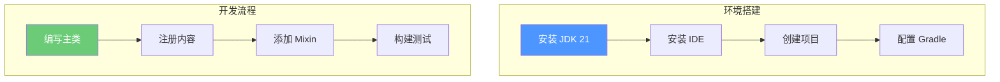

# 第一章：Mod 开发入门

> 了解 Fabric Mod 开发基础知识

---

## 目标

学完本章后，你将能够：

1. **理解 Mod 和 Mod Loader 的概念**
2. **搭建 Fabric Mod 开发环境**
3. **创建你的第一个 Fabric Mod**
4. **了解 Mod 的基本结构**

---

## 什么是 Mod？

### Mod 的定义

**Mod** = **Mod**ification（模组/修改）

Mod 是一种修改游戏内容的程序，可以在不改变原版游戏代码的情况下：
- 添加新的方块、物品、生物
- 修改游戏规则
- 优化游戏性能
- 添加全新的游戏系统

### Mod Loader

Mod 需要通过 **Mod Loader** 来加载到游戏中。常见的 Mod Loader 有：

| Mod Loader | 平台 | 特点 |
|------------|------|------|
| **Fabric** | 1.14+ | 轻量、简单、社区活跃 |
| **Forge** | 全版本 | 功能强大、兼容性好 |
| **Quilt** | 1.14+ | Fabric 的分支 |

### Minecraft 版本与 Mod 兼容性

```
Minecraft 版本
├── 1.21 (最新)
├── 1.20
├── 1.19
└── 1.18 及之前
         ↓
    不同版本使用不同的 Mod Loader
    Mod 一般不能跨版本使用
```

---

## Fabric Mod 开发环境搭建

### 1. 安装 JDK 21

```bash
# 检查 Java 版本
java -version

# 如果版本低于 21，需要安装
# 下载地址：https://adoptium.net/
```

### 2. 安装 IDE

推荐使用 IntelliJ IDEA 或 VSCode

**IntelliJ IDEA：**
- 社区版免费
- 内置 Gradle 支持
- Java 开发最佳选择

**VSCode：**
- 轻量级
- 需要安装 Java 扩展

### 3. 使用模板创建项目

```bash
# 方法 1：使用在线生成器
# 访问 https://fabricmc.net/develop/

# 方法 2：手动创建
# 克隆模板仓库
git clone https://github.com/FabricMC/fabric-example-mod.git my-mod
cd my-mod
```

### 4. Gradle 配置

```groovy
// build.gradle
plugins {
    id 'fabric-loom' version '1.4-SNAPSHOT'
    id 'maven-publish'
}

version = project.mod_version
group = project.maven_group

repositories {
    mavenCentral()
}

dependencies {
    minecraft "com.mojang:minecraft:${project.minecraft_version}"
    mappings "net.fabricmc:yarn:${project.yarn_mappings}:v2"
    modImplementation "net.fabricmc:fabric-loader:${project.loader_version}"

    // 添加你自己的依赖
}

processResources {
    inputs.property "version", project.version

    filesMatching("fabric.mod.json") {
        expand "version": project.version
    }
}
```

---

## 第一个 Fabric Mod

### 项目结构

```
my-mod/
├── src/
│   └── main/
│       ├── java/
│       │   └── com/example/
│       │       └── mymod/
│       │           └── MyMod.java      # 主类
│       └── resources/
│           └── fabric.mod.json         # Mod 元数据
├── build.gradle                        # 构建配置
├── gradle.properties                   # 属性文件
└── settings.gradle                     # 项目设置
```

### fabric.mod.json

```json
{
    "schemaVersion": 1,
    "id": "mymod",
    "version": "1.0.0",
    "name": "My Mod",
    "description": "我的第一个 Mod",
    "authors": ["Your Name"],
    "contact": {
        "homepage": "https://example.com"
    },
    "license": "MIT",
    "icon": "assets/mymod/icon.png",
    "environment": "*",
    "entrypoints": {
        "client": [
            "com.example.mymod.client.MyModClient"
        ],
        "main": [
            "com.example.mymod.MyMod"
        ]
    },
    "mixins": [
        "mymod.mixins.json"
    ],
    "depends": {
        "fabricloader": ">=0.14.0",
        "fabric": "*",
        "minecraft": "1.21.x",
        "java": ">=21"
    }
}
```

### 主类示例

```java
// MyMod.java
package com.example.mymod;

import net.fabricmc.api.ModInitializer;
import org.slf4j.Logger;
import org.slf4j.LoggerFactory;

public class MyMod implements ModInitializer {
    // 使用 Slf4j 日志
    public static final Logger LOGGER = LoggerFactory.getLogger("mymod");

    @Override
    public void onInitialize() {
        // Mod 初始化时调用
        LOGGER.info("My Mod 已加载！");

        // 注册方块
        Registry.register(
            Registry.BLOCK,
            new Identifier("mymod", "example_block"),
            new ExampleBlock()
        );

        // 注册物品
        Registry.register(
            Registry.ITEM,
            new Identifier("mymod", "example_item"),
            new ExampleItem()
        );

        LOGGER.info("注册完成！");
    }
}
```

### 客户端入口

```java
// MyModClient.java
package com.example.mymod.client;

import net.fabricmc.api.ClientModInitializer;
import net.fabricmc.api.EnvType;
import net.fabricmc.api.Environment;
import org.slf4j.Logger;
import org.slf4j.LoggerFactory;

@Environment(EnvType.CLIENT)
public class MyModClient implements ClientModInitializer {
    public static final Logger LOGGER = LoggerFactory.getLogger("mymod-client");

    @Override
    public void onInitializeClient() {
        // 客户端初始化代码
        LOGGER.info("客户端 Mod 已加载！");

        // 注册客户端渲染器
        // 注册按键绑定
        // 注册屏幕处理器
    }
}
```

---

## 注册系统

### 注册方块

```java
// 方法 1：使用静态初始化
public class MyBlocks {
    public static final Block EXAMPLE_BLOCK = new Block(
        FabricBlockSettings.copy(Blocks.STONE)
    );

    public static void register() {
        Registry.register(
            Registry.BLOCK,
            new Identifier("mymod", "example_block"),
            EXAMPLE_BLOCK
        );
    }
}

// 在主类中调用
public class MyMod implements ModInitializer {
    @Override
    public void onInitialize() {
        MyBlocks.register();
    }
}
```

### 注册物品

```java
public class MyItems {
    public static final Item EXAMPLE_ITEM = new Item(
        new Item.Settings()
            .group(ItemGroup.MISC)
            .maxCount(64)
    );

    public static void register() {
        Registry.register(
            Registry.ITEM,
            new Identifier("mymod", "example_item"),
            EXAMPLE_ITEM
        );
    }
}
```

### 注册方块物品

```java
// 自动生成方块对应的物品
Registry.register(
    Registry.ITEM,
    new Identifier("mymod", "example_block"),
    new BlockItem(
        MyBlocks.EXAMPLE_BLOCK,
        new Item.Settings().group(ItemGroup.BUILDING_BLOCKS)
    )
);
```

---

## Mixin 注入

### 什么是 Mixin？

Mixin 是一个字节码注入框架，允许你在不修改原始代码的情况下：
- 添加新方法
- 修改现有方法
- 注入新代码

### Mixin 配置

```json
// src/main/resources/mymod.mixins.json
{
    "required": true,
    "package": "com.example.mymod.mixin",
    "compatibilityLevel": "JAVA_21",
    "injectors": {
        "defaultRequire": 1
    },
    "mixins": [],
    "client": [
        "MixinExampleClient"
    ]
}
```

### Mixin 示例

```java
// MixinExampleClient.java
package com.example.mymod.mixin;

import net.fabricmc.api.Environment;
import net.fabricmc.api.EnvType;
import net.minecraft.client.MinecraftClient;
import net.minecraft.client.gui.screen.TitleScreen;
import org.spongepowered.asm.mixin.Mixin;
import org.spongepowered.asm.mixin.injection.At;
import org.spongepowered.asm.mixin.injection.Inject;
import org.spongepowered.asm.mixin.injection.callback.CallbackInfo;

@Mixin(TitleScreen.class)
@Environment(EnvType.CLIENT)
public class MixinExampleClient {

    // 在方法开头注入代码
    @Inject(at = @At("HEAD"), method = "render")
    private void onRender(CallbackInfo ci) {
        MinecraftClient client = MinecraftClient.getInstance();
        // 在标题屏幕渲染之前执行
    }
}
```

---

## 构建和测试

### 基本命令

```bash
# 构建 Mod
./gradlew build

# 运行 Minecraft 客户端
./gradlew runClient

# 运行带调试的客户端
./gradlew runClient --debug

# 清理
./gradlew clean
```

### 生成的文件

构建完成后，JAR 文件位于：
```
build/libs/
├── mymod-1.0.0.jar           # 仅你的代码
└── mymod-1.0.0-sources.jar   # 源代码（可选）
```

### 安装 Mod

将 JAR 文件复制到 Minecraft mods 目录：
```
.minecraft/mods/1.21/mymod-1.0.0.jar
```

---

## 小结



### 关键要点

1. **Mod Loader** - Fabric 是加载 Mod 的框架
2. **fabric.mod.json** - 描述 Mod 的元数据
3. **注册系统** - 通过 Registry 注册方块、物品等
4. **Mixin** - 字节码注入，用于修改原版代码
5. **Gradle** - 项目构建工具

---

## 练习

### 练习 1：创建空 Mod

按照教程创建并运行一个空的 Mod，确保环境正常。

### 练习 2：注册方块

创建一个新的方块并注册到游戏中。

### 练习 3：添加 Mixin

尝试使用 Mixin 在原版代码中添加日志输出。

---

## 相关链接

- 下一章：[渲染优化基础](./02-rendering-optimization.md) - 学习渲染优化技术
- [Sodium 源码分析](../analysis/README.md) - 深入理解 Sodium
- [Fabric Wiki](https://fabricmc.net/wiki/) - 官方文档
- [Fabric Example Mod](https://github.com/FabricMC/fabric-example-mod) - 官方模板

---

> 💡 **提示**：从简单的 Mod 开始，逐步添加复杂功能。遇到问题时查看官方文档和社区资源。

---

*文档版本：Sodium 0.8.x / Minecraft 1.21*
*最后更新：2026-03-21*
