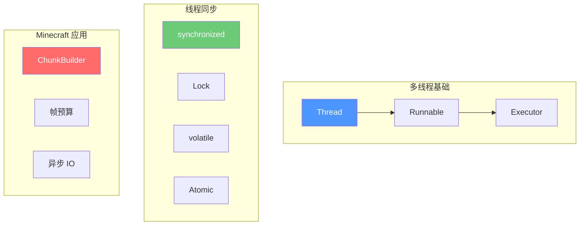

# 第二章：多线程编程

> 理解多线程与异步处理概念

---

## 目标

学完本章后，你将能够：

1. **理解并发与并行的区别**
2. **掌握 Java 多线程基础**
3. **了解线程池的使用**
4. **理解 Minecraft 中的多线程应用**

---

## 并发 vs 并行

### 基本概念

```
┌─────────────────────────────────────────────────────────────┐
│                        任务                                 │
├─────────────────────────────────────────────────────────────┤
│                                                             │
│   并发 (Concurrency)                                        │
│   ┌─────┐    ┌─────┐    ┌─────┐    ┌─────┐               │
│   │ CPU │    │ CPU │    │ CPU │    │ CPU │               │
│   └──┬──┘    └──┬──┘    └──┬──┘    └──┬──┘               │
│      │          │          │          │                   │
│   任务A      任务B      任务C      任务D                   │
│      │          │          │          │                   │
│      └──────────┴──────────┴──────────┘                   │
│           同一时刻只能执行一个任务（CPU 核心数有限）          │
│                                                             │
├─────────────────────────────────────────────────────────────┤
│                                                             │
│   并行 (Parallelism)                                        │
│   ┌─────┐    ┌─────┐    ┌─────┐    ┌─────┐               │
│   │ CPU │    │ CPU │    │ CPU │    │ CPU │               │
│   └──┬──┘    └──┬──┘    └──┬──┘    └──┬──┘               │
│      │          │          │          │                   │
│   任务A      任务B      任务C      任务D                   │
│                                                             │
│           同一时刻可以同时执行多个任务                        │
│                                                             │
└─────────────────────────────────────────────────────────────┘
```

### Minecraft 中的例子

| 场景 | 并发 | 并行 |
|------|------|------|
| 区块构建 | 主线程顺序构建 | Sodium 多线程同时构建 |
| 渲染 | 准备命令 → 发送命令 | GPU 并行绘制 |
| 物理计算 | 逐帧计算 | 多核并行 |

---

## Java 多线程基础

### 1. 创建线程

```java
// 方法 1：继承 Thread
public class MyThread extends Thread {
    @Override
    public void run() {
        // 线程执行的代码
        System.out.println("线程运行中...");
    }
}

// 使用
Thread thread = new MyThread();
thread.start();  // 注意是 start() 不是 run()

// 方法 2：实现 Runnable
public class MyRunnable implements Runnable {
    @Override
    public void run() {
        System.out.println("Runnable 线程运行中...");
    }
}

// 使用
Thread thread = new Thread(new MyRunnable());
thread.start();

// 方法 3：Lambda（推荐）
Thread thread = new Thread(() -> {
    System.out.println("Lambda 线程运行中...");
});
thread.start();
```

### 2. 线程生命周期

```
     ┌──────────┐
     │   新建    │ new Thread()
     └─────┬────┘
           │ start()
           ↓
     ┌──────────┐
     │  就绪状态 │ ←─── 等待 CPU 调度
     └─────┬────┘
           │ 获得 CPU
           ↓
     ┌──────────┐
     │  运行状态 │ ←─── yield() / 时间片用完
     └─────┬────┘
           │ run() 执行完毕
           │ 或发生异常
           ↓
     ┌──────────┐
     │  终止状态 │ 线程结束
     └──────────┘
```

### 3. 线程同步

多个线程访问共享资源时需要同步：

```java
public class Counter {
    private int count = 0;

    // 方法 1：synchronized 方法
    public synchronized void increment() {
        count++;
    }

    public synchronized int getCount() {
        return count;
    }

    // 方法 2：synchronized 块
    private final Object lock = new Object();

    public void incrementUnsafe() {
        synchronized (lock) {
            count++;
        }
    }
}
```

### 4. 线程通信

```java
public class ProducerConsumer {
    private final Queue<String> queue = new LinkedList<>();
    private final int MAX_SIZE = 10;

    // 生产者
    public synchronized void produce(String item) throws InterruptedException {
        while (queue.size() >= MAX_SIZE) {
            wait();  // 队列满，等待消费
        }
        queue.add(item);
        notifyAll();  // 通知消费者
    }

    // 消费者
    public synchronized String consume() throws InterruptedException {
        while (queue.isEmpty()) {
            wait();  // 队列空，等待生产
        }
        String item = queue.poll();
        notifyAll();  // 通知生产者
        return item;
    }
}
```

---

## 线程池

### 为什么需要线程池？

```
不使用线程池：
创建线程 → 运行任务 → 销毁线程 → 创建线程 → ...

问题：
- 创建/销毁线程开销大
- 线程数量不可控
- 资源浪费

使用线程池：
创建线程池 → 提交任务 → 任务完成复用线程 → ...

优点：
- 复用线程，减少开销
- 控制并发数量
- 统一管理
```

### Executors 工厂方法

```java
import java.util.concurrent.*;

// 1. 固定大小线程池
ExecutorService fixedPool = Executors.newFixedThreadPool(4);

// 2. 单线程池
ExecutorService singlePool = Executors.newSingleThreadExecutor();

// 3. 缓存线程池（自动扩展）
ExecutorService cachedPool = Executors.newCachedThreadPool();

// 4. 调度线程池（定时任务）
ScheduledExecutorService scheduledPool = Executors.newScheduledThreadPool(2);
```

### 使用线程池

```java
ExecutorService executor = Executors.newFixedThreadPool(4);

// 提交 Runnable 任务
executor.submit(() -> {
    System.out.println("任务1执行中，线程：" + Thread.currentThread().getName());
});

// 提交 Callable 任务（带返回值）
Future<String> future = executor.submit(() -> {
    Thread.sleep(1000);
    return "任务2的结果";
});

// 获取结果
String result = future.get();  // 会阻塞直到完成

// 关闭线程池
executor.shutdown();
try {
    if (!executor.awaitTermination(60, TimeUnit.SECONDS)) {
        executor.shutdownNow();
    }
} catch (InterruptedException e) {
    executor.shutdownNow();
}
```

### 自定义线程池

```java
ThreadPoolExecutor customPool = new ThreadPoolExecutor(
    2,                      // 核心线程数
    8,                      // 最大线程数
    60L,                    // 空闲线程存活时间
    TimeUnit.SECONDS,       // 时间单位
    new LinkedBlockingQueue<>(100),  // 任务队列
    new ThreadFactory() {   // 线程工厂
        @Override
        public Thread newThread(Runnable r) {
            Thread t = new Thread(r);
            t.setName("My-Worker-" + t.getId());
            return t;
        }
    },
    new ThreadPoolExecutor.CallerRunsPolicy()  // 拒绝策略
);
```

---

## Minecraft 中的多线程

### Sodium 的 ChunkBuilder

```java
// 简化版 Sodium ChunkBuilder
public class ChunkBuilder {
    // 专用工作线程池
    private final ExecutorService executor;

    public ChunkBuilder(int threadCount) {
        this.executor = Executors.newFixedThreadPool(
            threadCount,
            new ThreadFactory() {
                private int count = 0;
                @Override
                public Thread newThread(Runnable r) {
                    Thread t = new Thread(r, "ChunkBuilder-" + count++);
                    t.setPriority(Thread.MIN_PRIORITY);  // 低优先级
                    return t;
                }
            }
        );
    }

    // 异步构建区块
    public CompletableFuture<CompiledChunk> buildChunkAsync(ChunkRenderTask task) {
        return CompletableFuture.supplyAsync(() -> {
            // 在工作线程中执行
            return compileChunk(task);
        }, executor);
    }
}
```

### 帧预算控制

```java
public class FrameBudget {
    private static final long TARGET_FRAME_TIME = 16_666_666L;  // 60 FPS

    public void runWithBudget(ChunkBuilder builder) {
        long frameStart = System.nanoTime();
        long budgetRemaining = TARGET_FRAME_TIME;

        while (budgetRemaining > 0 && builder.hasMoreWork()) {
            ChunkRenderTask task = builder.peekNextTask();
            long estimatedTime = task.estimateCompileTime();

            if (estimatedTime <= budgetRemaining) {
                // 有足够时间，执行任务
                builder.executeTask(task);
                budgetRemaining -= estimatedTime;
            } else {
                // 时间不足，跳过
                break;
            }
        }
    }
}
```

---

## 最佳实践

### Do's ✅

```java
// 1. 使用线程池而不是直接创建线程
ExecutorService pool = Executors.newFixedThreadPool(4);

// 2. 优先使用 Callable 和 Future
Future<T> future = pool.submit(() -> {
    return compute();
});
T result = future.get();

// 3. 使用 CompletableFuture 进行链式操作
CompletableFuture.supplyAsync(() -> loadData(), pool)
    .thenApply(this::process)
    .thenAccept(this::display);

// 4. 正确处理异常
try {
    future.get();
} catch (ExecutionException e) {
    Throwable cause = e.getCause();
    // 处理具体异常
}
```

### Don'ts ❌

```java
// 1. 不要直接创建大量线程
// 错误
for (int i = 0; i < 10000; i++) {
    new Thread(() -> doWork()).start();
}

// 正确
ExecutorService pool = Executors.newFixedThreadPool(4);
for (int i = 0; i < 10000; i++) {
    pool.submit(() -> doWork());
}

// 2. 不要在持有锁时执行耗时操作
synchronized (lock) {
    // 错误：在锁内执行 IO 操作
    // networkCall();

    // 正确：只做必要的同步
    Object data = fetchData();
    process(data);
}

// 3. 不要忘记关闭线程池
pool.shutdown();
pool.awaitTermination(1, TimeUnit.MINUTES);
```

---

## 小结



### 关键要点

1. **并发 vs 并行** - 并发是交替执行，并行是同时执行
2. **线程池** - 复用线程，控制并发
3. **同步机制** - synchronized、Lock、volatile
4. **Future** - 获取异步任务结果
5. **帧预算** - Sodium 限制每帧工作时间避免卡顿

---

## 练习

### 练习 1：创建线程池

创建一个固定大小为 4 的线程池，提交 10 个任务。

### 练习 2：实现生产者-消费者

使用 wait/notifyAll 实现一个简单的生产者-消费者模型。

### 练习 3：分析 Sodium 代码

阅读 Sodium 源码中的 ChunkBuilder，理解它如何管理线程。

---

## 相关链接

- 下一章：[深入区块系统](./04-chunk-system-deep.md) - Minecraft 区块管理
- [Sodium 源码分析](../analysis/02-chunk-render-system.md) - 源码分析
- [Java 并发教程](https://docs.oracle.com/javase/tutorial/essential/concurrency/)

---

> 💡 **提示**：多线程编程容易出错，多使用线程安全的类（如 ConcurrentHashMap、AtomicInteger）来简化同步逻辑。

---

*文档版本：Sodium 0.8.x / Minecraft 1.21*
*最后更新：2026-03-21*
