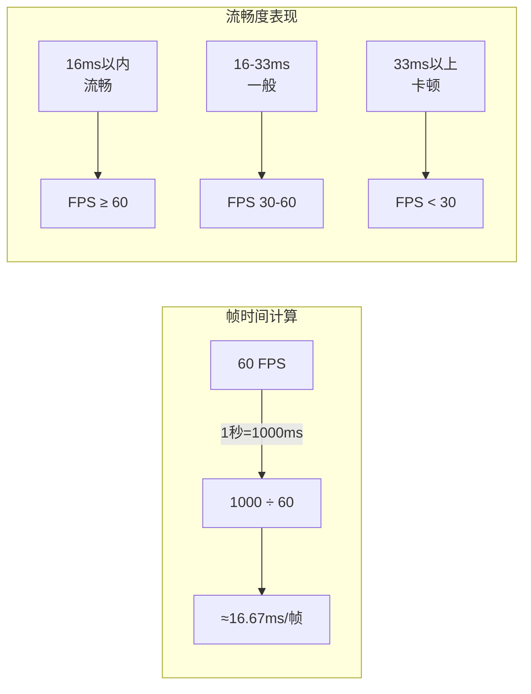
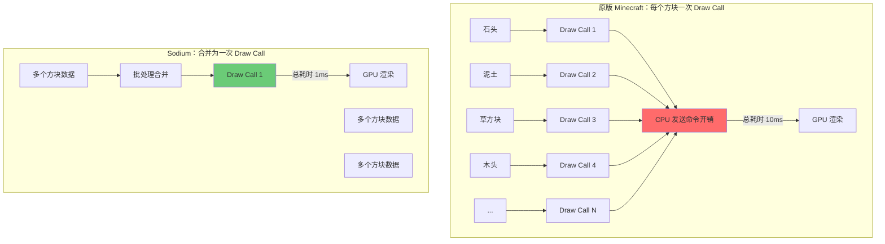
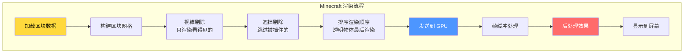

# 渲染优化入门

> ⭐ **欢迎来到渲染优化的世界！** 本章将带你了解帧率、Draw Call 等基础概念，为学习 Sodium 优化技术打下基础。

> 💡 **前置提示**：本教程面向零基础读者，用生活中的例子解释技术概念。

---

## 目标

学完本章后，你将理解：

1. **帧率 (FPS)** - 游戏每秒刷新多少次画面
2. **Draw Call** - 告诉 GPU "画这个" 的命令
3. **渲染管线** - 游戏画面是如何一步步生成的
4. **原版 Minecraft 的性能问题** - 为什么需要优化

---

## 前置知识

- 会玩 Minecraft（知道什么是区块、什么是显卡）
- 了解电脑的基本组成（CPU、GPU、内存）
- 有耐心思考一些"为什么"

---

## 目录

[什么是帧率 (FPS)](#什么是帧率-fps)  
[什么是 Draw Call](#什么是-draw-call)  
[渲染管线简介](#渲染管线简介)  
[原版 Minecraft 的渲染问题](#原版-minecraft-的渲染问题)  
[生活中的类比](#生活中的类比)  
[课后自查](#课后自查)

---

## 什么是帧率 (FPS)

### FPS = Frames Per Second

**帧率** (FPS) 是游戏每秒显示的**画面数量**。

```
60 FPS = 每秒显示 60 张图片
30 FPS = 每秒显示 30 张图片
```

### 帧率与流畅度的关系

| FPS | 描述 | 体验 |
|-----|------|------|
| 60+ | 流畅 | ✅ 如丝般顺滑 |
| 30-60 | 正常 | ✅ 可以接受 |
| 15-30 | 卡顿 | ⚠️ 能感觉到不流畅 |
| <15 | 幻灯片 | ❌ 几乎无法玩 |

### 帧时间 (Frame Time)

帧时间 = 渲染一帧需要的时间（毫秒）

```
60 FPS → 每帧约 16.67ms
30 FPS → 每帧约 33.33ms
```



### 💡 为什么 60 FPS 是目标？

人眼对流畅动画的感知下限大约是 **30 FPS**，但要达到"丝般顺滑"的体验，需要 **60 FPS**。

想象翻书动画：
- 10 页/秒 → 能看出每页切换（卡顿）
- 30 页/秒 → 看起来像动画
- 60 页/秒 → 非常流畅

---

## 什么是 Draw Call

### 概念解释

**Draw Call** = 应用程序（CPU）告诉显卡（GPU）"画这个东西" 的命令。

```
CPU                                    GPU
┌─────────────┐                       ┌─────────────┐
│  "画石头方块" │ ──── Draw Call ────→  │  渲染石头   │
│  "画泥土方块" │ ──── Draw Call ────→  │  渲染泥土   │
│  "画草地方块" │ ──── Draw Call ────→  │  渲染草地   │
│     ...      │                       │     ...     │
└─────────────┘                       └─────────────┘
```

### Draw Call 为什么会卡？

想象你是餐厅服务员：

```
❌ 低效模式：
    顾客A："我要一份汉堡" → 你跑去厨房 → 回来
    顾客B："我要一份薯条" → 你跑去厨房 → 回来  
    顾客C："我要一杯可乐" → 你跑去厨房 → 回来
    （每个顾客单独跑一趟厨房）

✅ 高效模式：
    你："顾客A要汉堡，顾客B要薯条，顾客C要可乐"
    厨房一次性做完，一起端出来
```

**Draw Call 就像"跑一趟厨房"**：
- 每次 Draw Call 都有开销（CPU-GPU 通信）
- Draw Call 太多 → CPU 成为瓶颈

### Minecraft 的 Draw Call 数量

```
原版 Minecraft 复杂场景：
┌─────────────────────────────────────────────────┐
│                                                  │
│   可视区块（约 400 个）× 每区块 5-10 个 Draw Call │
│   = 2000 - 4000 个 Draw Call/帧                   │
│                                                  │
└─────────────────────────────────────────────────┘

Sodium 优化后：
┌─────────────────────────────────────────────────┐
│                                                  │
│   400 个区块合并为 1 个 Draw Call（批处理）        │
│   = ~50 个 Draw Call/帧（减少 95%+）              │
│                                                  │
└─────────────────────────────────────────────────┘
```

### 💡 Draw Call 优化原理



---

## 渲染管线简介

### 什么是渲染管线？

**渲染管线** (Rendering Pipeline) = 游戏画面从"数据"到"屏幕上显示"的完整流程。

### 简单流程图

```
┌──────────────┐
│  游戏世界数据  │  ← 方块位置、材质、光照...
└──────┬───────┘
       ▼
┌──────────────┐
│  CPU 准备数据 │  ← 计算要渲染什么
└──────┬───────┘
       ▼
┌──────────────┐
│  发送 Draw   │  ← CPU → GPU 命令
│    Calls     │
└──────┬───────┘
       ▼
┌──────────────┐
│  GPU 顶点     │  ← 处理每个三角形的顶点
│    处理       │
└──────┬───────┘
       ▼
┌──────────────┐
│  GPU 图元    │  ← 将顶点组成三角形
│    装配       │
└──────┬───────┘
       ▼
┌──────────────┐
│  光栅化       │  ← 填充三角形像素
└──────┬───────┘
       ▼
┌──────────────┐
│  片段着色    │  ← 计算每个像素的颜色
└──────┬───────┘
       ▼
┌──────────────┐
│  测试与混合   │  ← 深度测试、透明混合
└──────┬───────┘
       ▼
┌──────────────┐
│  输出到屏幕   │  ← 渲染完成！
└──────────────┘
```

### Minecraft 渲染管线的特殊点



### 💡 关键术语解释

| 术语 | 简单解释 |
|------|----------|
| **视锥 (View Frustum)** | 相机能看到的空间范围，像个金字塔 |
| **剔除 (Culling)** | 把看不见的东西"扔掉"，不渲染 |
| **深度测试** | 决定哪个物体在前，哪个在后 |
| **透明混合** | 让水、玻璃等透明物体正确显示 |

---

## 原版 Minecraft 的渲染问题

### 问题一：Draw Call 爆炸

```
原版 Minecraft 渲染逻辑：
for (每个区块) {
    for (每个方块) {
        glBindTexture(...);      // 切换材质
        glDrawElements(...);     // 绘制
    }
}

结果：400+ 区块 × 10+ 方块/区块 = 4000+ Draw Calls
```

### 问题二：顶点数据冗余

```
原版 Minecraft 顶点格式：
┌─────────────────────────┐
│ X (float, 4字节)        │
│ Y (float, 4字节)         │
│ Z (float, 4字节)         │
│ U (float, 4字节)         │
│ V (float, 4字节)         │
│ R (byte, 1字节)          │
│ G (byte, 1字节)          │
│ B (byte, 1字节)          │
│ A (byte, 1字节)          │
│ 法线 (byte × 3)          │
├─────────────────────────┤
│ 总计：24 字节/顶点        │
└─────────────────────────┘

问题：16×256×16 方块的区块 ≈ 数十万个顶点
      × 24 字节 = 数百 MB 显存
```

### 问题三：区块构建阻塞主线程

```
原版 Minecraft：

┌─────────────────────────────────────────────────┐
│                    主线程                        │
├─────────────────────────────────────────────────┤
│ ████████████████████████████████████████████████│
│ 游戏逻辑 + 区块构建 + 渲染 全部在一起              │
│                                                  │
│ 结果：任何一个慢，都会导致帧率下降                │
└─────────────────────────────────────────────────┘

Sodium 优化：

┌─────────────────────────────────────────────────┐
│                    主线程                        │
├─────────────────────────────────────────────────┤
│ ████████████                                   │
│ 游戏逻辑 + 渲染（快速）                          │
└─────────────────────────────────────────────────┘

┌─────────────────────────────────────────────────┐
│                 工作线程池                       │
├─────────────────────────────────────────────────┤
│ ████████████████████████████████████████████████│
│ 区块构建（异步，不阻塞主线程）                     │
└─────────────────────────────────────────────────┘
```

### 问题四：没有遮挡剔除

```
场景：玩家站在山顶

原版 Minecraft：
┌─────────────────────────┐
│  山前的区块   →  渲染   │  ← 看得见
│  山后的区块   →  渲染   │  ← ❌ 被山挡住了，白渲染
│  更远的区块   →  渲染   │  ← ❌ 更远的也被挡了
└─────────────────────────┘

Sodium（遮挡剔除）：
┌─────────────────────────┐
│  山前的区块   →  渲染   │  ← 看得见
│  山后的区块   →  跳过   │  ← ✅ 检测到被遮挡
│  更远的区块   →  跳过   │  ← ✅ 检测到被遮挡
└─────────────────────────┘
```

---

## 生活中的类比

### 类比 1：超市结账

```
Draw Call = 每次叫一个顾客到收银台结账

❌ 原版：每件商品单独结账
    顾客："这个苹果" → 结账
    顾客："这瓶水" → 结账
    顾客："这包薯片" → 结账
    （顾客买了一车东西，要叫 20 次）

✅ Sodium：一堆东西一起结账
    顾客把购物车推过来
    "这些一起结"
    （一次搞定）
```

### 类比 2：画画

```
渲染 = 把 Minecraft 世界"画"到屏幕上

❌ 原版画画方式：
    1. 画第一棵树的一个叶子
    2. 换笔（Draw Call）
    3. 画第二棵树的叶子
    4. 换笔
    5. 画第一棵树的树干
    ...（无数次切换）

✅ Sodium 画画方式：
    1. 把所有绿色的东西放一起画
    2. 把所有棕色的东西放一起画
    （减少切换次数）
```

### 类比 3：餐厅点菜

```
Draw Call = 你对服务员说的话

❌ 低效：你点一道菜，服务员跑一趟厨房
    "我要汉堡" → 服务员跑厨房
    "我要薯条" → 服务员跑厨房
    "我要可乐" → 服务员跑厨房

✅ 高效：你把菜单全点了，服务员一次性报给厨房
    "一个汉堡、一份薯条、一杯可乐"
    服务员："好的，厨房准备！"
```

---

## 实战小例子：观察你的帧率

### 步骤 1：开启调试信息

在 Minecraft 中按 `F3` 打开调试屏幕，你会看到：

```
    Minecraft 1.21 | FPS: 60
    CPU: Intel i7-12700K | GPU: RTX 3080
```

### 步骤 2：观察帧率变化

1. 找一个空旷的地方（少方块）→ 帧率应该高
2. 飞到一个村庄/矿洞（多方块）→ 帧率应该下降
3. 快速移动（加载新区块）→ 帧率可能暴跌

### 步骤 3：安装 Sodium 后对比

安装 Sodium 后再观察：

1. 同样场景，FPS 更稳定
2. 区块加载时不再卡顿
3. 快速移动时帧率波动减小

---

## 课后自查

完成本章学习后，请确认你理解以下内容：

- [ ] **帧率 (FPS)** - 理解帧率与帧时间的关系，知道 60 FPS 意味着什么
- [ ] **Draw Call** - 理解 Draw Call 是 CPU 向 GPU 发出的渲染命令
- [ ] **Draw Call 优化** - 理解为什么合并 Draw Call 能提升性能
- [ ] **渲染管线** - 理解游戏画面从数据到屏幕的流程
- [ ] **原版问题** - 理解原版 Minecraft 的 4 个主要渲染问题

---

## 相关链接

### 进阶阅读

- [01-architecture-overview.md](../analysis/01-architecture-overview.md) - Sodium 整体架构
- [09-performance-optimization.md](../analysis/09-performance-optimization.md) - 性能优化技术详解
- [03-multithreading-basics.md](./03-multithreading-basics.md) - 多线程编程基础（进阶）

### 源码路径

本教程涉及的 Sodium 源码位于：

```
D:\Minecraft-Learning\assets\sodium\src\common\java\net\caffeinemc\mods\sodium\client\render\chunk\
```

---

> 💡 **提示**：理解这些基础概念后，下一章我们将学习 Sodium 的核心架构，看看它是如何解决这些问题的！

---

*文档版本：Sodium 0.8.6 / Minecraft 1.21*  
*最后更新：2026-03-24*
