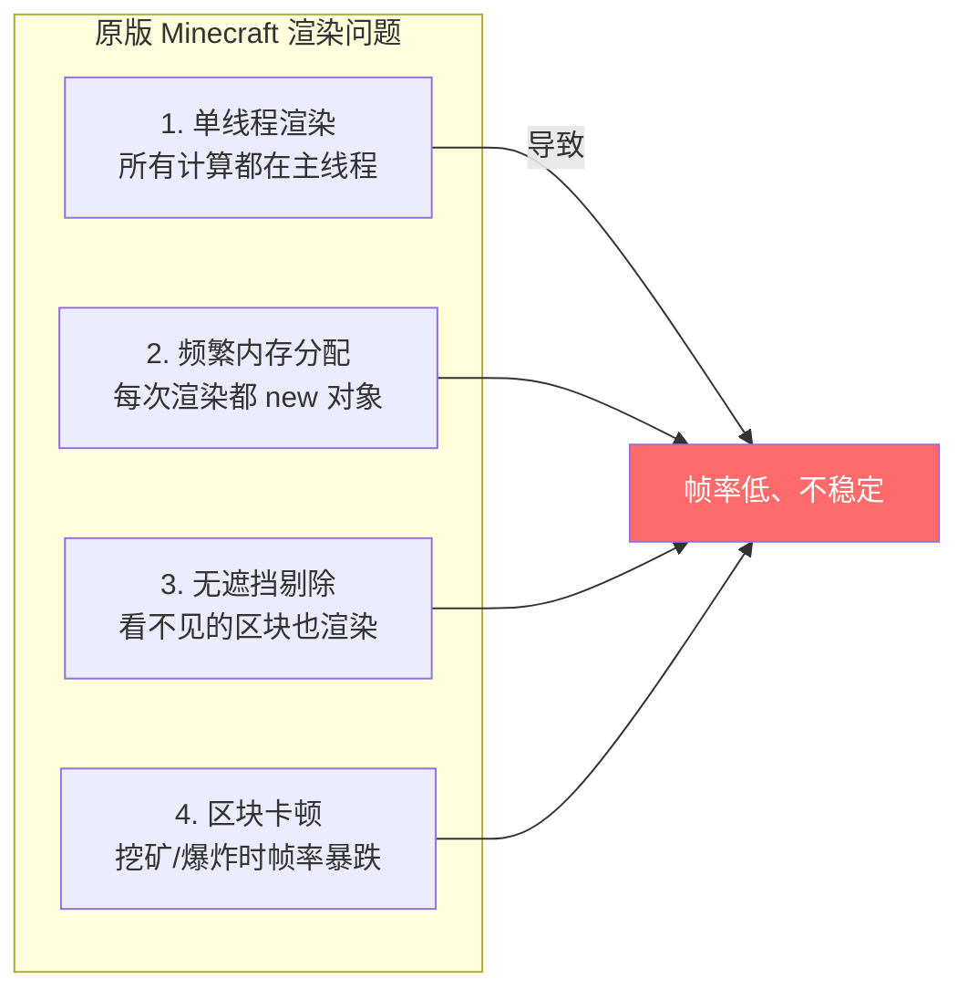
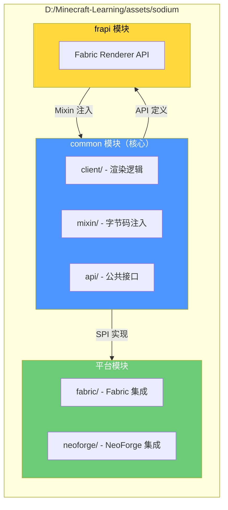
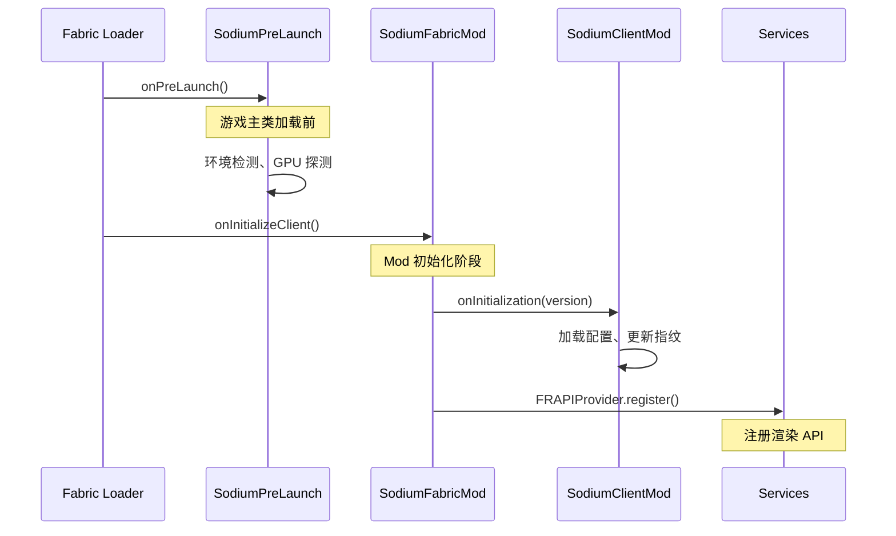
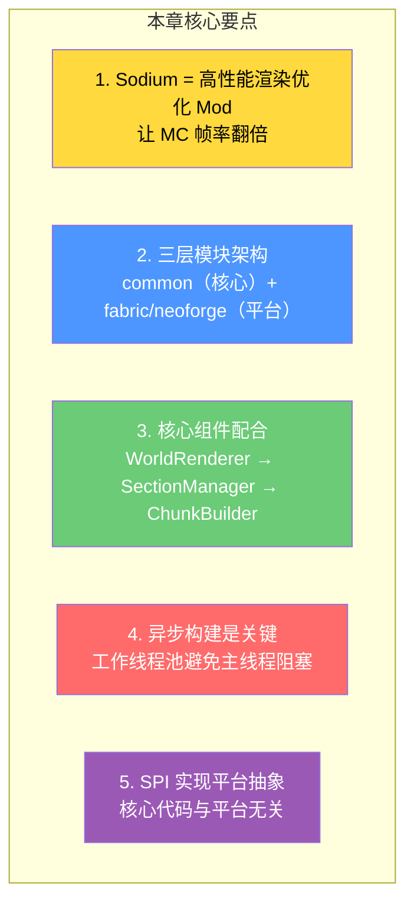

# 第一章：Sodium 简介与架构概述

> ⭐ **这是理解高性能渲染优化 Mod 的入门篇章！学完这章，你将明白 Sodium 为什么能让 Minecraft 帧率翻倍。**

> ⚠️ **注意**：源码示例来源于 Sodium 项目 v0.8.6+。部分代码经过简化以便于理解。

---

## 目标

学完本章后，你将理解：

1. **Sodium 是什么** - 专门优化 Minecraft 渲染性能的 Mod
2. **为什么需要 Sodium** - 原版 Minecraft 的渲染问题在哪里
3. **模块划分** - common/fabric/neoforge 三个模块各做什么
4. **核心组件** - 主要类的作用（用生活例子类比）
5. **设计原则** - 平台无关、多线程、内存优化

---

## 前置知识

- 了解 Minecraft Mod 的基本概念（Fabric/Forge 是什么）
- 知道 Java 的基本语法（类、接口、线程概念）
- 玩过 Minecraft 客户端（知道帧率、渲染距离是什么）

---

## 什么是 Sodium？

### 一句话介绍

**Sodium** 是一个免费的、开源的高性能渲染优化 Mod，专门让 Minecraft 跑得更流畅。

### 它能做什么？

| 功能 | 原版 Minecraft | 安装 Sodium 后 |
|------|---------------|----------------|
| 帧率（FPS） | 60 FPS（渲染距离 12） | 200+ FPS |
| 大规模建造 | 卡顿明显 | 流畅 |
| 区块加载 | 主线程阻塞 | 异步加载，不卡顿 |
| 内存占用 | 频繁 GC 停顿 | 更稳定的帧时间 |

### 生活中的例子

想象你在一家**餐厅**里：

- **原版 Minecraft** = 餐厅只有 1 个厨师（主线程），所有菜都要等这个厨师做完
- **Sodium** = 厨房有多个厨师（工作线程池），同时做多道菜，上菜更快

---

## 为什么需要 Sodium？

### 原版 Minecraft 的渲染问题

Minecraft 原版渲染有几个严重的性能瓶颈：



### Sodium 的解决方案

| 问题 | Sodium 解决方案 |
|------|----------------|
| 单线程 | 工作线程池（ChunkBuilder）异步构建区块网格 |
| 内存分配 | 对象池化 + 直接内存操作 |
| 无遮挡剔除 | 遮挡剔除算法（Occlusion Culling） |
| 区块卡顿 | 帧预算控制 + 任务队列调度 |

---

## 模块划分：Sodium 的三层架构

### 架构总览

Sodium 项目采用 **Gradle 多模块结构**，分为三个主要部分：



### 生活中的例子：模块划分

把 Sodium 想象成一家**连锁餐厅**：

```
┌─────────────────────────────────────────────────────────┐
│                    连锁餐厅 Sodium                       │
├─────────────────────────────────────────────────────────┤
│  common（中央厨房）                                       │
│  ├── 烹饪配方（渲染逻辑）                                  │
│  ├── 食材管理（内存优化）                                  │
│  └── 质量管理（API接口）                                  │
├─────────────────────────────────────────────────────────┤
│  fabric/（Fabric 分店）                                   │
│  ├── 使用 Fabric 点餐系统                                  │
│  └── 适配 Fabric 厨房设备                                  │
├─────────────────────────────────────────────────────────┤
│  neoforge/（NeoForge 分店）                              │
│  ├── 使用 NeoForge 点餐系统                               │
│  └── 适配 NeoForge 厨房设备                               │
└─────────────────────────────────────────────────────────┘
```

### 各模块职责

| 模块 | 依赖 | 职责 |
|------|------|------|
| **common** | Minecraft, Mixin | 所有渲染优化逻辑、异步构建、遮挡剔除 |
| **fabric** | common, Fabric API | Fabric 平台入口、Mixin 配置 |
| **neoforge** | common, NeoForge API | NeoForge 平台入口、Mixin 配置 |
| **frapi** | common, FR API | 为第三方 Mod 提供渲染 API |

### 源码目录结构

```
assets/sodium/
├── common/src/main/java/net/caffeinemc/mods/sodium/
│   ├── client/                    # 客户端核心代码
│   │   ├── SodiumClientMod.java  # 客户端入口类
│   │   ├── render/               # 渲染系统
│   │   │   ├── SodiumWorldRenderer.java
│   │   │   ├── chunk/            # 区块渲染子系统
│   │   │   └── gl/                # OpenGL 封装
│   │   ├── model/                # 模型/光照处理
│   │   ├── gui/                  # 配置 GUI
│   │   ├── config/               # 配置系统
│   │   └── services/             # 平台服务接口（SPI）
│   └── mixin/                    # Mixin 注入代码
├── fabric/src/main/java/
│   └── net/caffeinemc/mods/sodium/fabric/
│       ├── SodiumFabricMod.java  # Fabric 入口
│       └── SodiumPreLaunch.java  # Pre-launch 钩子
├── neoforge/                     # NeoForge 平台代码
└── frapi/                        # Fabric Renderer API 实现
```

---

## 核心组件：用生活例子理解

### 核心类一览

| 类名 | 职责 | 生活类比 |
|------|------|----------|
| `SodiumWorldRenderer` | 世界渲染协调器 | 餐厅前台服务员 |
| `RenderSectionManager` | 区块渲染管理器 | 厨房调度员 |
| `ChunkBuilder` | 异步构建执行器 | 多个厨师团队 |
| `RenderDevice` | OpenGL 设备抽象 | 厨房电器控制面板 |
| `LevelSlice` | 世界数据快照 | 一次性准备好所有食材 |

### 1. SodiumWorldRenderer - 世界渲染协调器

**是什么？**

管理 Minecraft 世界的渲染流程，协调所有区块的加载和绘制。

**生活例子：餐厅前台服务员**

```
服务员（SodiumWorldRenderer）
    │
    ├── 接收客人订单（相机位置）
    ├── 通知厨房准备菜品（调度区块构建）
    ├── 把做好的菜端上桌（绘制到屏幕）
    └── 处理突发情况（相机移动、视口变化）
```

**源码示例**

```java
public class SodiumWorldRenderer {
    private final Minecraft client;
    private ClientLevel level;
    private int renderDistance;
    private RenderSectionManager renderSectionManager;

    // 获取当前世界的渲染器实例
    public static SodiumWorldRenderer instance() {
        var instance = instanceNullable();
        if (instance == null) {
            throw new IllegalStateException("No renderer attached to active level");
        }
        return instance;
    }
    
    // 每帧开始时设置渲染状态
    public void setupTerrain(Vector3d cameraPos, float tickDelta) {
        // 设置相机、更新可见区块列表
    }
    
    // 执行单个渲染 Pass
    public void drawChunkLayer(RenderLayer layer) {
        // 绘制一个渲染层（实体、半透明、固体...）
    }
}
```

### 2. RenderSectionManager - 区块渲染管理器

**是什么？**

管理所有可见区块的渲染状态，协调区块的加载、构建和绘制。

**生活例子：厨房调度员**

```
调度员（RenderSectionManager）
    │
    ├── 追踪哪些菜需要重新做（需要重建的区块）
    ├── 分配厨师任务（调度 ChunkBuilder）
    ├── 决定哪些菜可以先上（遮挡剔除）
    └── 管理半透明菜品的顺序（半透明排序）
```

**源码示例**

```java
public class RenderSectionManager {
    private final ChunkBuilder builder;           // 工作线程池
    private final RenderRegionManager regions;    // GPU 缓冲区
    private final ClonedChunkSectionCache sectionCache;  // 克隆数据缓存
    private final Long2ReferenceMap<RenderSection> sectionByPosition;  // 区块索引
    private final OcclusionCuller occlusionCuller;  // 遮挡剔除器
    private final SortBehavior sortBehavior;      // 半透明排序策略

    public RenderSectionManager(ClientLevel level, int renderDistance) {
        this.builder = new ChunkBuilder(level, ChunkVertexType.CLIENT);
        this.regions = new RenderRegionManager(commandList);
        this.sectionCache = new ClonedChunkSectionCache(level);
        this.occlusionCuller = new OcclusionCuller(...);
    }
}
```

### 3. ChunkBuilder - 异步构建执行器

**是什么？**

管理工作线程池，异步构建区块网格，避免主线程阻塞。

**生活例子：多个厨师团队**

```
厨房团队（ChunkBuilder）
    │
    ├── Thread 1（厨师1）：构建区块 A 的网格
    ├── Thread 2（厨师2）：构建区块 B 的网格
    ├── Thread 3（厨师3）：构建区块 C 的网格
    └── ...
    
    💡 特点：
    ├── 同时工作，互不干扰
    ├── 自动根据 CPU 核心数决定厨师数量
    └── 控制每帧的工作量，避免卡顿
```

**源码示例**

```java
public class ChunkBuilder {
    private final ChunkJobQueue queue = new ChunkJobQueue();
    private final List<Thread> threads = new ArrayList<>();

    public ChunkBuilder(ClientLevel level, ChunkVertexType vertexType) {
        // 根据 CPU 核心数创建工作线程
        int count = getOptimalThreadCount();  // 通常是 CPU 核心数 / 3
        for (int i = 0; i < count; i++) {
            WorkerRunnable worker = new WorkerRunnable(...);
            Thread thread = new Thread(worker, "Chunk Render Task Executor #" + i);
            thread.setPriority(Math.max(0, Thread.NORM_PRIORITY - 2));
            thread.start();
            this.threads.add(thread);
        }
    }
    
    // 线程数量策略
    private static int getOptimalThreadCount() {
        // max(1, min(processors/3, processors-6, 10))
        return Mth.clamp(Math.max(getMaxThreadCount() / 3, getMaxThreadCount() - 6), 1, 10);
    }
}
```

### 4. RenderDevice - OpenGL 设备抽象

**是什么？**

封装所有 OpenGL 操作，提供统一的图形 API 访问。

**生活例子：厨房电器控制面板**

```
控制面板（RenderDevice）
    │
    ├── 烤箱控制（OpenGL 函数封装）
    ├── 火力调节（渲染状态管理）
    ├── 温度显示（GPU 能力检测）
    └── 安全锁定（线程安全）
```

### 5. LevelSlice - 世界数据快照

**是什么？**

为每个区块构建任务创建一致的区块数据副本，确保线程安全。

**生活例子：一次性准备好所有食材**

```
做宫保鸡丁前，厨房会：
    │
    ├── 准备好所有需要的食材
    │   ├── 鸡胸肉 200g
    │   ├── 花生 50g
    │   ├── 干辣椒 10 个
    │   └── ...
    │
    └── 把这些食材装在一个托盘里
        （LevelSlice = 包含 5x5x5 区块的数据副本）

💡 为什么需要快照？
    └── 确保厨师在切菜过程中，食材不会突然变化
        （确保线程看到一致的区块状态）
```

---

## 设计原则

### 1. 平台无关性（SPI 模式）

Sodium 的核心代码完全独立于 Fabric/NeoForge，通过 **SPI（Service Provider Interface）** 实现平台抽象。

```mermaid
flowchart TB
    S["Services.load()<br/>ServiceLoader.load()"]
    
    I1["PlatformRuntimeInformation"]
    I2["PlatformBlockAccess"]
    I3["FluidRendererFactory"]
    
    F1["FabricPlatformImpl"]
    F2["FabricBlockAccess"]
    
    N1["NeoForgePlatformImpl"]
    N2["NeoForgeBlockAccess"]
    
    S --> I1
    S --> I2
    S --> I3
    
    I1 <|-- F1
    I1 <|-- N1
    
    I2 <|-- F2
    I2 <|-- N2
    
    style I1 fill:#4d96ff,color:#fff
    style I2 fill:#4d96ff,color:#fff
    style I3 fill:#4d96ff,color:#fff
```

**SPI 工作原理**：

```
META-INF/services/net.caffeinemc.mods.sodium.client.services.PlatformRuntimeInformation
= net.caffeinemc.mods.sodium.fabric.FabricPlatformImpl    ← Fabric 实现
```

### 2. 异步处理驱动

原版 Minecraft 将所有区块网格构建放在主线程执行，导致大规模变化时帧率暴跌。

Sodium 通过 **工作线程池** 将网格构建任务异步化：

```
┌─────────────────────────────────────────────────────────┐
│                    帧时间线（16.67ms / 60 FPS）          │
├─────────────────────────────────────────────────────────┤
│ [主线程] Render | Input | GameLogic |  ... | Render     │
│              ↓                                          │
│ [工作线程] ─── 构建 A ─── 构建 B ─── 构建 C ───          │
│              ↓（完成后提交）                              │
│ [主线程] ─────────────── A ─── B ─── C                  │
└─────────────────────────────────────────────────────────┘
```

### 3. 内存拷贝最小化

Sodium 采用对象池化和直接内存操作，避免频繁的 GC 压力：

| 技术 | 作用 |
|------|------|
| **对象池化** | 复用缓冲区对象，减少 new 操作 |
| **直接内存操作** | 避免不必要的数据拷贝 |
| **线程本地缓存** | 每个工作线程有自己的数据副本 |

---

## 可运行小例子：理解异步构建

### 示例场景

创建一个简单的异步任务模拟，理解 Sodium 的 ChunkBuilder 原理：

```java
import java.util.concurrent.*;
import java.util.List;
import java.util.ArrayList;

public class AsyncChunkBuilderDemo {
    
    public static void main(String[] args) throws InterruptedException {
        // 模拟 ChunkBuilder 的工作线程池
        int threadCount = 3;  // 模拟 CPU 核心数 / 3
        ExecutorService executor = Executors.newFixedThreadPool(threadCount);
        
        // 模拟要构建的区块
        String[] chunks = {"Chunk-A", "Chunk-B", "Chunk-C", 
                          "Chunk-D", "Chunk-E", "Chunk-F"};
        
        // 提交构建任务
        List<Future<String>> futures = new ArrayList<>();
        for (String chunk : chunks) {
            Future<String> future = executor.submit(() -> {
                // 模拟网格构建（耗时操作）
                Thread.sleep(100);  // 100ms 模拟计算
                return chunk + " 已构建完成";
            });
            futures.add(future);
        }
        
        // 收集结果
        System.out.println("等待区块构建完成...\n");
        for (Future<String> future : futures) {
            try {
                System.out.println(future.get());  // 阻塞等待
            } catch (ExecutionException e) {
                e.printStackTrace();
            }
        }
        
        executor.shutdown();
        System.out.println("\n✅ 所有区块构建完成！");
    }
}
```

### 运行结果

```
等待区块构建完成...
Chunk-A 已构建完成
Chunk-C 已构建完成
Chunk-B 已构建完成
Chunk-D 已构建完成
Chunk-F 已构建完成
Chunk-E 已构建完成

✅ 所有区块构建完成！
```

💡 **注意**：输出顺序可能不同（因为线程并发执行），这正是 Sodium 异步构建的特点。

---

## 初始化流程

### Fabric 平台的启动链



### Pre-Launch 阶段（早期初始化）

```java
public class SodiumPreLaunch implements PreLaunchEntrypoint {
    @Override
    public void onPreLaunch() {
        // 1. 检测运行环境
        PreLaunchChecks.checkEnvironment();
        
        // 2. 探测 GPU 适配器
        GraphicsAdapterProbe.findAdapters();
        
        // 3. 初始化驱动兼容性修复
        Workarounds.init();
    }
}
```

### Client 初始化阶段

```java
public class SodiumFabricMod implements ClientModInitializer {
    @Override
    public void onInitializeClient() {
        // 获取 Mod 版本
        ModContainer mod = FabricLoader.getInstance()
                .getModContainer("sodium")
                .orElseThrow(NullPointerException::new);

        // 初始化客户端核心
        SodiumClientMod.onInitialization(mod.getMetadata().getVersion().getFriendlyString());

        // 加载配置
        ConfigManager.registerConfigsEarly();

        // 注册渲染 API
        FRAPIProvider.getInstance().register();
    }
}
```

---

## 核心服务接口

Sodium 通过 SPI 定义了多个平台服务接口：

| 接口 | 职责 |
|------|------|
| `PlatformRuntimeInformation` | 提供运行环境信息 |
| `PlatformBlockAccess` | 平台特定的方块属性查询 |
| `PlatformLevelAccess` | 世界级别数据访问 |
| `PlatformModelAccess` | 模型相关操作 |
| `FluidRendererFactory` | 流体渲染器工厂 |

**源码示例**：

```java
public class Services {
    public static <T> T load(Class<T> clazz) {
        final T loadedService = ServiceLoader.load(clazz)
                .findFirst()
                .orElseThrow(() -> new NullPointerException(
                    "Failed to load service for " + clazz.getName()));
        return loadedService;
    }
}
```

---

## 小结



### 记住这个流程

```
玩家视角移动（相机变化）
    ↓
SodiumWorldRenderer.setupTerrain()
    ↓
RenderSectionManager 更新可见区块列表
    ↓
OcclusionCuller 剔除不可见区块
    ↓
ChunkBuilder 调度异步构建任务
    ↓
工作线程构建网格 → 提交到 GPU 缓冲区
    ↓
主线程绘制到屏幕 → 流畅的高帧率！
```

---

## 课后自查

完成本章节学习后，请确认你能够：

- [ ] 用一句话解释 Sodium 是什么，以及它解决了什么问题
- [ ] 画出 Sodium 的模块依赖关系图（common、fabric、neoforge）
- [ ] 解释 SodiumWorldRenderer、RenderSectionManager、ChunkBuilder 各自的作用
- [ ] 描述 Sodium 如何通过工作线程池实现异步构建（避免主线程阻塞）
- [ ] 说明 SPI 模式如何让 Sodium 同时支持 Fabric 和 NeoForge

---

## 相关链接

### 源码文件

| 文件 | 路径 | 作用 |
|------|------|------|
| `SodiumFabricMod.java` | `D:\Minecraft-Learning\assets\sodium\fabric\src\...` | Fabric 入口 |
| `SodiumClientMod.java` | `D:\Minecraft-Learning\assets\sodium\common\src\...` | 客户端核心 |
| `SodiumWorldRenderer.java` | `D:\Minecraft-Learning\assets\sodium\common\src\...` | 世界渲染协调器 |
| `RenderSectionManager.java` | `D:\Minecraft-Learning\assets\sodium\common\src\...` | 区块渲染管理器 |
| `ChunkBuilder.java` | `D:\Minecraft-Learning\assets\sodium\common\src\...` | 异步构建执行器 |
| `Services.java` | `D:\Minecraft-Learning\assets\sodium\common\src\...` | SPI 服务加载器 |

### 进阶阅读

- 下一章：[第二章：区块渲染系统](./02-chunk-render-system.md) - 深入理解区块如何被渲染
- 下一章：[第三章：遮挡剔除算法](./03-occlusion-culling.md) - Sodium 如何跳过不可见的区块

---

> 💡 **提示**：Sodium 的架构设计非常优秀，SPI 模式和异步处理是现代高性能 Mod 的标杆。建议仔细阅读源码中的 `Services.java` 和 `ChunkBuilder.java`。

---

*文档版本：Sodium v0.8.6+*
*最后更新：2026-03-24*
