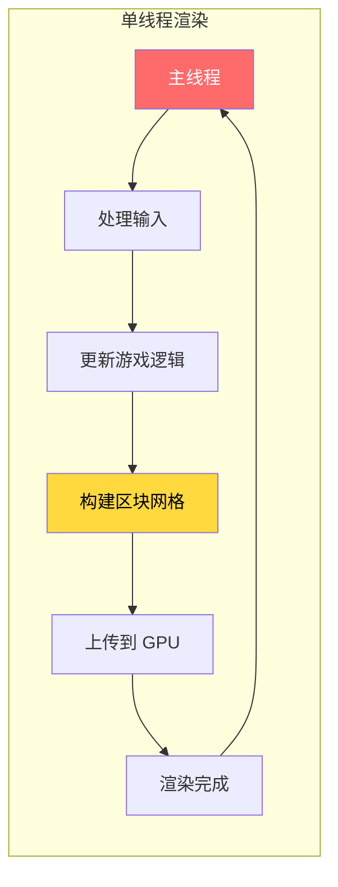
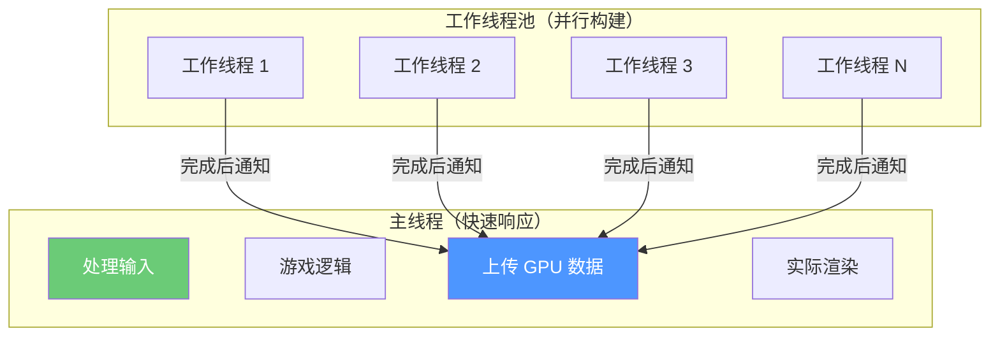
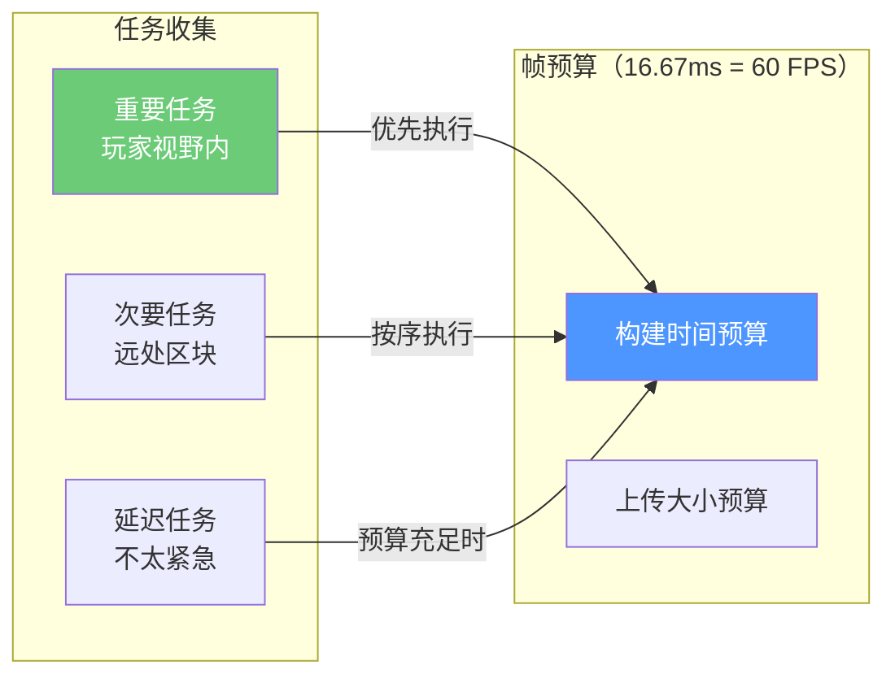
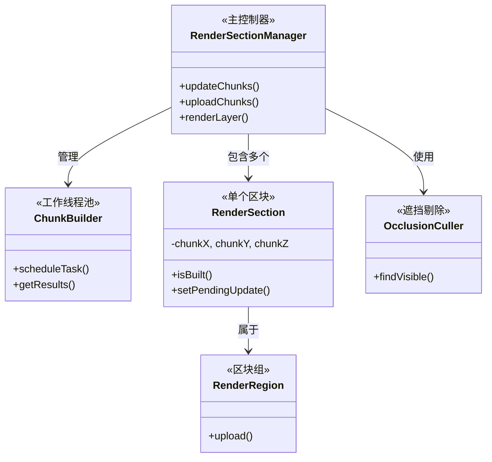
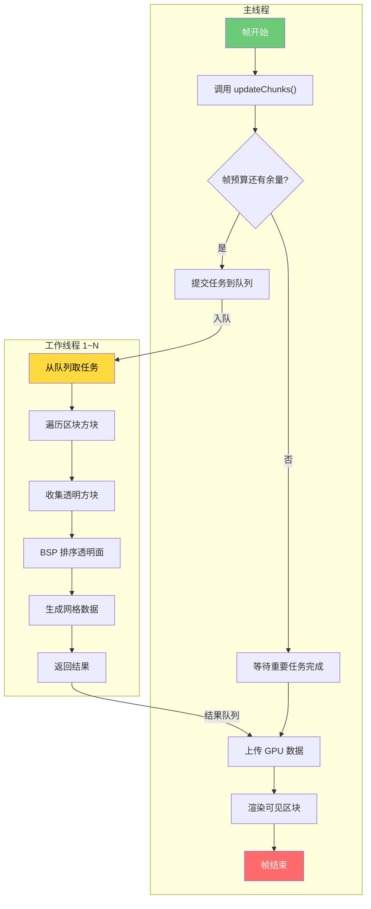
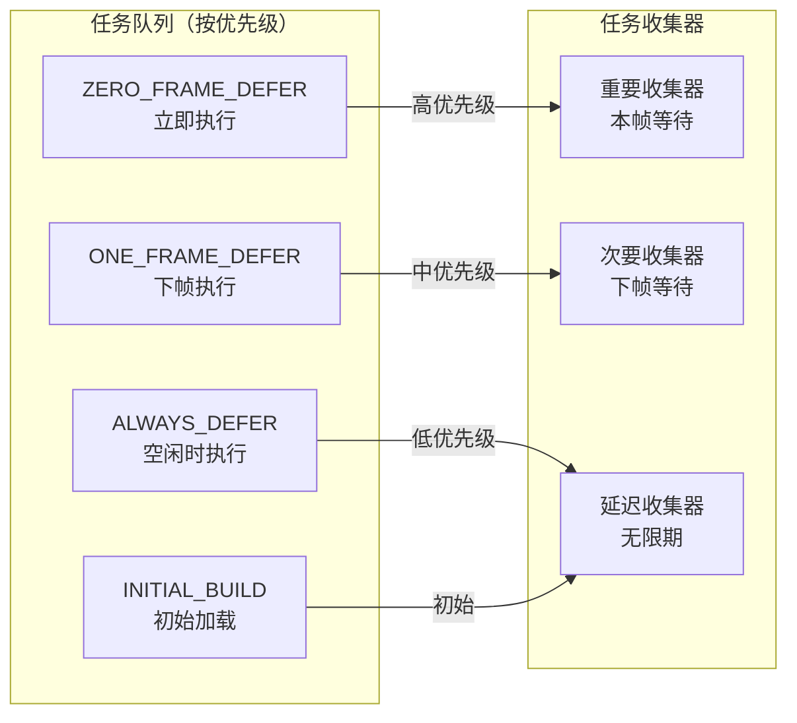

# 第二章：区块渲染系统（Chunk Render System）

> ⭐ **本章目标**：理解 Sodium 如何通过多线程和智能调度，让 Minecraft 在高渲染距离下依然流畅运行。

> 💡 **前置知识**：了解 Minecraft 的主线程概念，知道"帧"是什么（每秒显示的画面数）。

---

## 目标

学完本章后，你将理解：

1. **什么是区块（Chunk）** - Minecraft 世界的基本渲染单元
2. **原版 Minecraft 渲染的问题** - 为什么高渲染距离会卡顿
3. **Sodium 的解决方案** - 多线程构建 + 帧预算控制
4. **核心组件关系** - RenderSection、ChunkBuilder、OcclusionCuller 如何配合

---

## 前置知识

- 知道 Java 的 `Thread`（线程）概念
- 了解 Minecraft 每秒 20 帧的渲染节奏
- 知道什么是"阻塞"

---

## 目录

- [什么是区块（Chunk）？](#什么是区块chunk)
- [原版 Minecraft 渲染的问题](#原版-minecraft-渲染的问题)
- [Sodium 的解决方案](#sodium-的解决方案)
- [帧预算：不让主线程"加班"](#帧预算不让主线程加班)
- [核心组件及关系](#核心组件及关系)
- [多线程工作流程](#多线程工作流程)
- [课后自查](#课后自查)

---

## 什么是区块（Chunk）？

### 生活中的比喻

想象你在一座大城市里拍照：

| 城市概念 | Minecraft 对应 |
|---------|---------------|
| 整座城市 | 游戏世界 |
| 一个街区（16x16 米） | **区块（Chunk）** |
| 街区里的一栋楼 | 区块里的方块 |
| 相机只能拍到的区域 | 可见区块 |

### Minecraft 中的区块

Minecraft 世界由无数个 **16×16×256** 的区块组成：

```
        区块俯视图（16×16）
        
    ┌────────────────────────┐
    │  ·  ·  ·  ·  ·  ·  ·  │  Y = 顶（255）
    │  ·  🏠  ·  🏠  ·  🏠  │  方块高度方向
    │  ·  ·  ·  ·  ·  ·  · │
    │  ·  🌲  ·  ·  ·  🌲  │
    │  ·  ·  ·  ·  ·  ·  · │
    └────────────────────────┘
    X → (0 到 15)
    Z → (0 到 15)
```

每个区块包含 **16×16×256 = 65,536** 个方块位置！

### 为什么区块是渲染单位？

GPU 一次绘制一个区块比绘制 65,536 个方块要**高效得多**。

---

## 原版 Minecraft 渲染的问题

### 单线程的困境

原版 Minecraft 渲染采用**单线程模式**：



**问题**：当玩家在高渲染距离移动时：

```
帧 1: 构建区块 A (16ms) ✅ 正常
帧 2: 构建区块 B (16ms) ✅ 正常
帧 3: 构建区块 C (需要 50ms!) ❌ 卡顿！
帧 4: 继续构建 C ❌ 继续卡顿！
```

### 为什么会卡顿？

| 场景 | 区块数量 | 构建时间 |
|-----|---------|---------|
| 渲染距离 4 | ~81 个区块 | 可能卡顿 |
| 渲染距离 8 | ~289 个区块 | 明显卡顿 |
| 渲染距离 16 | ~1089 个区块 | 严重卡顿 |

> 💡 **核心问题**：主线程既要处理游戏逻辑，又要构建区块网格。当区块太多时，主线程"加班"也做不完，导致帧率下降。

---

## Sodium 的解决方案

### 核心理念：分离耗时任务

Sodium 把区块构建工作**从主线程搬到工作线程**：



### 关键技术点

| 技术 | 作用 | 效果 |
|-----|------|-----|
| **异步网格构建** | 工作线程处理构建 | 主线程不卡顿 |
| **多级任务队列** | 重要任务优先 | 玩家视野优先加载 |
| **遮挡剔除** | 不渲染被挡住的区块 | 减少工作量 |
| **增量更新** | 只重建变化的区块 | 避免重复计算 |
| **帧预算控制** | 每帧工作量有限制 | 保证帧率稳定 |

---

## 帧预算：不让主线程"加班"

### 生活比喻：时间管理

想象你在餐厅吃饭：

```
⏱️ 每道菜只能吃 3 分钟（帧预算）
🍽️ 服务员（主线程）负责上菜
👨‍🍳 厨房（工作线程）负责做菜

预算充足时：客人吃得很舒服
预算超限时：后面的菜上不来，整体变慢
```

### Sodium 的帧预算机制

Sodium 限制每帧用于区块构建的**时间和空间预算**：



### 预算计算逻辑

```
每帧预算 = 上一帧实际耗时 × 0.05（平滑调整系数）

如果上帧用了 10ms → 预算约 10ms
如果上帧用了 20ms → 预算约 15ms（防止无限增长）
```

### 为什么需要预算？

✅ **防止卡顿**：确保主线程不会因等待工作线程而超时
✅ **公平调度**：远处的区块不会抢玩家视野内的资源
✅ **平滑帧率**：避免忽快忽慢的体验

---

## 核心组件及关系

### 组件概览



### 核心类职责表

| 类名 | 职责 | 源码位置 |
|-----|------|---------|
| `RenderSectionManager` | 协调所有渲染子系统 | `render/chunk/RenderSectionManager.java` |
| `ChunkBuilder` | 工作线程池，调度构建任务 | `render/chunk/compile/executor/ChunkBuilder.java` |
| `RenderSection` | 单个区块的渲染状态 | `render/chunk/RenderSection.java` |
| `RenderRegion` | 多个区块组合，减少绘制调用 | `render/chunk/region/RenderRegion.java` |
| `OcclusionCuller` | 判断哪些区块可见 | `render/chunk/occlusion/OcclusionCuller.java` |

### RenderSection：区块的"身份证"

每个区块在 Sodium 中用一个 `RenderSection` 表示：

```java
public class RenderSection {
    // 区块位置
    private final int chunkX, chunkY, chunkZ;

    // 构建状态
    private boolean built = false;
    
    // 是否有待处理任务
    private int pendingUpdateType;
    
    // 正在运行的异步任务
    private ChunkJob runningJob;
    
    // 渲染数据
    private BuiltSectionInfo builtInfo;
}
```

### ChunkBuilder：工作线程池

```java
public class ChunkBuilder {
    private final ChunkJobQueue queue = new ChunkJobQueue();
    private final List<Thread> threads = new ArrayList<>();

    public ChunkBuilder(ClientLevel level) {
        // 根据 CPU 核心数创建工作线程
        int threadCount = Math.max(1, Runtime.getRuntime().availableProcessors() / 3);
        
        for (int i = 0; i < threadCount; i++) {
            Thread thread = new Thread(
                new WorkerRunnable(context),
                "Sodium Chunk Builder #" + i
            );
            thread.start();
        }
    }
}
```

> 💡 **线程数量**：通常为 CPU 核心数的 1/3，最多 10 个。留出 CPU 给主线程和其他任务。

---

## 多线程工作流程

### 整体流程图



### 任务提交流程



### 异步构建示例

当玩家移动到新区块时：

```java
// 1. 主线程检测到需要构建的区块
RenderSection section = getSection(x, y, z);

// 2. 标记为待构建（重要任务，因为玩家在此区块附近）
section.setPendingUpdate(ChunkUpdateTypes.REBUILD | ChunkUpdateTypes.IMPORTANT);

// 3. 在 updateChunks() 中提交到工作线程
public void updateChunks() {
    // 检查预算
    if (budget.hasRemaining()) {
        // 提交任务
        builder.scheduleTask(new ChunkBuilderMeshingTask(section));
    }
}

// 4. 工作线程异步执行（主线程继续其他工作）
// ... 工作线程中 ...
public ChunkBuildOutput execute(ChunkBuildContext context) {
    // 遍历区块内的所有方块
    for (int y = 0; y < 16; y++) {
        for (int z = 0; z < 16; z++) {
            for (int x = 0; x < 16; x++) {
                BlockState state = world.getBlockState(x, y, z);
                // 构建网格...
            }
        }
    }
    return new ChunkBuildOutput(meshes, renderData);
}

// 5. 结果返回主线程
ChunkBuildOutput result = builder.getResults().poll();
```

---

## 课后自查

完成本章节学习后，请确认你能够回答以下问题：

### 基础概念

1. **什么是 Chunk？它的尺寸是多少？**
   - 提示：Minecraft 世界由 16×16×256 的区块组成。

2. **为什么原版 Minecraft 在高渲染距离会卡顿？**
   - 提示：单线程 + 区块构建耗时 = 主线程阻塞。

3. **Sodium 把区块构建放到工作线程，主线程还需要做什么？**
   - 提示：主线程负责 GPU 上传和实际渲染。

### 核心机制

4. **什么是帧预算？为什么需要它？**
   - 提示：防止工作线程做太多，影响主线程的渲染时间。

5. **RenderSection 和 RenderRegion 的区别是什么？**
   - 提示：一个是单个区块，一个是区块组合。

6. **什么是遮挡剔除？它是如何工作的？**
   - 提示：被其他区块完全挡住的区块不需要渲染。

### 实践理解

7. **假设玩家以每秒 10 区块的速度移动，渲染距离 12，估算每秒需要构建多少区块？**
   - 提示：玩家周围的环形区域。

8. **为什么工作线程的优先级要低于主线程？**
   - 提示：考虑游戏响应的实时性。

---

## 相关链接

### 源码文件

| 文件 | 路径 | 作用 |
|-----|------|-----|
| `RenderSectionManager.java` | `render/chunk/` | 主控制器 |
| `ChunkBuilder.java` | `render/chunk/compile/executor/` | 工作线程池 |
| `RenderSection.java` | `render/chunk/` | 区块渲染单元 |
| `OcclusionCuller.java` | `render/chunk/occlusion/` | 遮挡剔除 |

### 进阶阅读

- 下一章：[第三章：多线程基础](./03-multithreading-basics.md) - 深入理解 Java 多线程
- 进阶主题：[Sodium 区块渲染系统分析](../analysis/02-chunk-render-system.md) - 源码级别的详细分析

---

> 📝 **提示**：区块渲染系统是 Sodium 性能优化的核心。建议配合源码阅读，理解实际实现细节。

---

*文档版本：Sodium 0.11*
*最后更新：2026-03-24*
