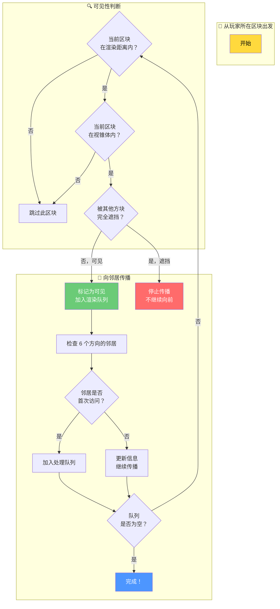

# 第三章：遮挡剔除算法

> ⭐ **本章将带你理解 Sodium 如何"聪明地"决定哪些区块需要渲染，大幅提升帧率！**

---

## 目标

学完本章后，你将能够：

1. **理解什么是遮挡剔除** - 为什么不需要渲染看不见的东西
2. **掌握 BFS 可见性传播** - Sodium 的核心算法思想
3. **理解位掩码编码** - 如何用 64 位数字存储复杂信息
4. **了解角度优化** - 如何进一步减少计算量

---

## 前置知识

- 了解 Minecraft 区块（Chunk）的概念
- 知道什么是**渲染**（把东西画到屏幕上）
- 熟悉基本的 Java 语法

---

## 目录

[什么是遮挡剔除？](#什么是遮挡剔除)
[生活中的例子：走进房间](#生活中的例子走进房间)
[原版 Minecraft 的问题](#原版-minecraft-的问题)
[Sodium 的解决方案：BFS 可见性传播](#sodium-的解决方案bfs-可见性传播)
[位掩码编码：用一个数字存很多信息](#位掩码编码用一个数字存很多信息)
[角度优化：排除不可能的视线](#角度优化排除不可能的视线)
[迷宫探索的比喻](#迷宫探索的比喻)
[简化版代码示例](#简化版代码示例)
[课后自查](#课后自查)

---

## 什么是遮挡剔除？

### 基本概念

**遮挡剔除（Occlusion Culling）** 是一种渲染优化技术。

> 💡 **核心思想**：只渲染你能看到的东西，看不到的就不画了。

在 Minecraft 中，当你在地面上行走时，你只能看到**面前和上方**的区块。**你永远看不到自己身后的区块**，所以根本不需要渲染它们。

```
        你能看到的区域（简化俯视图）
        
                    [前方]
                       │
        ┌──────────────┼──────────────┐
        │              │              │
   [左方]              ▲              [右方]
        │         [你的位置]            │
        │              │              │
        └──────────────┼──────────────┘
                       │
                   [后方 - 你看不到！]
                       
        ❌ 后方的区块：不需要渲染
        ✅ 前方、左右、上方的区块：可能需要渲染
```

---

## 生活中的例子：走进房间

想象你走进一个房间：

```
    ┌─────────────────────────┐
    │                         │
    │    ┌─────────────┐     │
    │    │   书架       │     │  ← 你先看到书架
    │    └─────────────┘     │
    │                         │
    │         🚶 你          │  ← 你站在这里
    │                         │
    └─────────────────────────┘
```

1. **你走进房间**：首先看到的是门口的区块（就像渲染初始化）
2. **书架挡住了视线**：书架后面的东西你暂时看不到
3. **绕到书架侧面**：现在能看到书架后面的区域了

> 💡 **关键洞察**：光线从门口进入，在房间内"弹跳"（传播），遇到不透明物体（书架）就停下来。这就是 Sodium 算法的核心思想！

---

## 原版 Minecraft 的问题

### 原版如何渲染？

原版 Minecraft **渲染所有在渲染距离内的区块**，不管它们是否被遮挡。

```
原版渲染策略：

        渲染距离 = 12 区块
        
        你在中心，周围 12 格的区块全部渲染！
        
        ┌─────────────────────────────┐
        │                             │
        │      ████████████████████   │
        │      ████████████████████   │
        │      ████████████████████   │
        │      ████████🧑██████████   │  ← 你在中间
        │      ████████████████████   │
        │      ████████████████████   │
        │      ████████████████████   │
        │                             │
        └─────────────────────────────┘
        
        问题：你背后有 1/3 的区块是白渲染的！
        （因为你面朝前方）
```

### 问题分析

|| 问题 | 影响 |
||------|------|
| 渲染白块 | 即使被山挡住，也全部渲染 | FPS 下降 |
| 内存浪费 | GPU 处理不需要的像素 | 发热、耗电 |
| 性能不稳定 | 复杂地形帧率暴跌 | 游戏卡顿 |

---

## Sodium 的解决方案：BFS 可见性传播

### 什么是 BFS？

**BFS（Breadth-First Search）** = 广度优先搜索

> 💡 **简单理解**：像水面波纹一样，一圈一圈地向外扩展。

```
BFS 传播过程（俯视图）：

    你在中心，开始向四周"探索"：
    
    第 1 圈：     第 2 圈：      第 3 圈：
    
       A            B              C
      ┌─┐         ┌─┬─┬─┐        ┌─┬─┬─┬─┬─┐
      │🧑│   →    │B│B│B│   →   │C│C│C│C│C│
      └─┘         └─┼─┼─┘        ├─┼─┼─┼─┼─┤
                     │🧑│         │C│C│🧑│C│C│
                     └─┼─┘        ├─┼─┼─┼─┼─┤
                       │          │C│C│C│C│C│
                                  └─┴─┴─┴─┴─┘
    
    每一步都问："从这里能看到哪里？"
```

### 算法流程



### 区块图结构

Sodium 把世界分成 16x16x16 的**区块切片（Chunk Section）**，每个切片就是一个节点：

```
区块切片示意（3x3x3 区域）：

        ┌───────────────┐
        │    TOP (上)    │
        ┌───────────────┤
        │  MIDDLE (中层) │   ← 玩家通常在这里
        │    你在这里     │
        ┌───────────────┤
        │  BOTTOM (下)   │
        └───────────────┘
        
    每个切片有 6 个邻居：上、下、北、南、西、东
```

---

## 位掩码编码：用一个数字存很多信息

### 什么是位掩码？

**位掩码（Bitmask）** = 用一个数字的每一位表示"是/否"。

> 💡 **想象**：你有 64 个开关（位），每个可以独立打开或关闭，全部信息存在一个整数里。

### 简单的例子

```java
// 假设我们用 3 个位表示 6 个方向中的 3 个

// DOWN = 第 0 位：0b001 = 1
// UP   = 第 1 位：0b010 = 2  
// NORTH = 第 2 位：0b100 = 4

// 没有方向选中：0b000 = 0
int none = 0;

// DOWN 和 UP 选中：0b011 = 3
int downAndUp = 1 | 2;  // 或 3

// 检查是否包含某个方向
boolean hasDown = (downAndUp & 1) != 0;  // true
boolean hasNorth = (downAndUp & 4) != 0; // false
```

### Sodium 的 6x6 矩阵

Sodium 用 64 位存储一个 **6x6 的矩阵**，表示"从哪个方向能看到哪个方向"：

```
6x6 可见性矩阵（简化）：

           能看到的方向 →
           DOWN  UP  NORTH SOUTH WEST EAST
         ┌─────┬───┬─────┬─────┬─────┬─────┐
    DOWN │  0  │ 1 │  0  │  0  │  0  │  0  │
         ├─────┼───┼─────┼─────┼─────┼─────┤
      UP │  1  │ 0 │  0  │  0  │  0  │  0  │
         ├─────┼───┼─────┼─────┼─────┼─────┤
 FROM NORTH │  0  │ 0 │  0  │  1  │  0  │  0  │
         ├─────┼───┼─────┼─────┼─────┼─────┤
    SOUTH │  0  │ 0 │  1  │  0  │  0  │  0  │
         ├─────┼───┼─────┼─────┼─────┼─────┤
     WEST │  0  │ 0 │  0  │  0  │  0  │  1  │
         ├─────┼───┼─────┼─────┼─────┼─────┤
     EAST │  0  │ 0 │  0  │  0  │  1  │  0  │
         └─────┴───┴─────┴─────┴─────┴─────┘
         
    0 = 视线被阻挡（实心方块）
    1 = 视线可以通过（透明方块）

    实际存储：一个 64 位整数（long）
```

> 💡 **关键洞察**：石头方块（实心）只有主对角线为 1，树叶（透明）几乎全为 1！

---

## 角度优化：排除不可能的视线

### 核心思想

当你站在区块**正上方**时，你**不可能同时**看到"正下方"和"正上方"：

```
情况 1：相机在区块正上方

        相机
          │
          │ dy (垂直距离很大)
          │
    ┌─────────┐
    │         │
    │  区块   │ ← 你在区块正上方
    │         │
    └─────────┘
    
    ❌ 不可能：从区块看"下"，再看到"上"
    ❌ 不可能：从区块看"上"，再看到"下"
    
    因为你不可能绕到区块"下面"去看！
```

### Sodium 的实现

```java
// 角度优化伪代码
public class AngleOptimizer {
    
    // 如果相机在 Z 轴方向最远，排除 Z 轴的相反方向
    // 如果相机在 X 轴方向最远，排除 X 轴的相反方向
    // 如果相机在 Y 轴方向最远，排除 Y 轴的相反方向
    
    public long getAngleMask(float cameraX, float cameraY, float cameraZ,
                             float blockX, float blockY, float blockZ) {
        long mask = 0L;
        
        float dx = Math.abs(cameraX - blockX);
        float dy = Math.abs(cameraY - blockY);
        float dz = Math.abs(cameraZ - blockZ);
        
        // Y 轴距离最大（相机在上方或下方）
        if (dx > dy || dz > dy) {
            mask |= 0b11000000_11000000; // 排除 UP↔DOWN
        }
        
        // Z 轴距离最大（相机在正北或正南）
        if (dx > dz || dy > dz) {
            mask |= 0b00110000_00110000; // 排除 NORTH↔SOUTH
        }
        
        // X 轴距离最大（相机在正东或正西）
        if (dy > dx || dz > dx) {
            mask |= 0b00001100_00001100; // 排除 WEST↔EAST
        }
        
        return ~mask; // 返回保留的方向
    }
}
```

### 优化效果

|| 场景 | 排除的方向 | 减少的计算 |
||------|----------|-----------|
| 站在山上俯瞰 | 上↔下 | 约 1/3 |
| 在隧道中直行 | 前↔后 | 约 1/3 |
| 在峡谷中穿行 | 左↔右 | 约 1/3 |

---

## 迷宫探索的比喻

把 BFS 可见性传播想象成**在迷宫中探索**：

```
迷宫（简化 5x5）：

    入口 ──→ [1][1][0][0][0]
             [0][1][0][1][1]   ← 1 = 可以通行（透明）
             [0][1][1][1][0]   ← 0 = 墙壁（遮挡）
             [0][0][0][1][0]
             [0][1][1][1][0]
                      ↓
                   出口

BFS 探索过程：

Step 1: 从入口开始
        [V][ ][ ][ ][ ]
        [ ][?][ ][?][?]
        [ ][?][?][?][ ]
        [ ][ ][ ][?][ ]
        [ ][?][?][?][ ]
        
Step 2: 标记入口的邻居（可见）
        [V][V][ ][ ][ ]
        [ ][V][ ][?][?]   ← V = 已访问
        [ ][V][?][?][ ]   ← ? = 待探索
        [ ][ ][ ][?][ ]
        [ ][?][?][?][ ]
        
Step 3: 继续传播（遇到墙壁停止）
        [V][V][ ][ ][ ]
        [ ][V][ ][ ][ ]   ← 墙壁 0 阻止了传播
        [ ][V][ ][ ][ ]   
        [ ][ ][ ][ ][ ]
        [ ][?][?][?][ ]
        
Step 4: 绕道继续探索
        [V][V][ ][ ][ ]
        [ ][V][ ][ ][ ]   
        [ ][V][V][V][ ]
        [ ][ ][ ][V][ ]
        [ ][?][?][V][V]
        
Step 5: 到达出口！
        [V][V][ ][ ][ ]
        [ ][V][ ][ ][ ]   
        [ ][V][V][V][ ]
        [ ][ ][ ][V][ ]
        [ ][V][V][V][V] ✓
```

> ✅ **核心比喻**：BFS = 从起点出发，一圈一圈扩散，遇到障碍物（不透明方块）就停止，绕道继续探索

---

## 简化版代码示例

下面是一个**极度简化**的遮挡剔除实现，帮助你理解核心逻辑：

```java
import java.util.*;

// 简化的区块节点
class ChunkNode {
    int x, y, z;
    boolean isOpaque;  // 是否不透明（完全遮挡）
    List<ChunkNode> neighbors = new ArrayList<>();
    
    ChunkNode(int x, int y, int z, boolean isOpaque) {
        this.x = x;
        this.y = y;
        this.z = z;
        this.isOpaque = isOpaque;
    }
}

// 简化的 BFS 遮挡剔除
public class SimpleOcclusionCuller {
    
    public Set<ChunkNode> findVisible(ChunkNode origin, int maxDistance) {
        Set<ChunkNode> visible = new HashSet<>();
        Queue<ChunkNode> queue = new LinkedList<>();
        
        // 从玩家所在区块开始
        queue.add(origin);
        visible.add(origin);
        
        while (!queue.isEmpty()) {
            ChunkNode current = queue.poll();
            
            // 检查所有邻居
            for (ChunkNode neighbor : current.neighbors) {
                if (!visible.contains(neighbor)) {
                    // 计算距离
                    int dist = Math.abs(neighbor.x - origin.x)
                             + Math.abs(neighbor.y - origin.y)
                             + Math.abs(neighbor.z - origin.z);
                    
                    if (dist <= maxDistance) {
                        // 邻居可见（简化：假设只要不是完全遮挡就可见）
                        visible.add(neighbor);
                        queue.add(neighbor);
                    }
                }
            }
        }
        
        return visible;
    }
    
    public static void main(String[] args) {
        // 创建测试场景：简单的 3x3 网格
        ChunkNode center = new ChunkNode(0, 0, 0, false);
        ChunkNode north = new ChunkNode(0, 0, -1, false);
        ChunkNode wall = new ChunkNode(0, 0, -2, true);  // 墙壁
        ChunkNode behindWall = new ChunkNode(0, 0, -3, false);
        
        // 设置邻居关系
        center.neighbors.add(north);
        north.neighbors.add(center);
        north.neighbors.add(wall);
        wall.neighbors.add(north);
        wall.neighbors.add(behindWall);
        behindWall.neighbors.add(wall);
        
        // 执行剔除
        SimpleOcclusionCuller culler = new SimpleOcclusionCuller();
        Set<ChunkNode> visible = culler.findVisible(center, 10);
        
        // 输出结果
        System.out.println("可见区块数量: " + visible.size());
        System.out.println("墙壁后面的区块可见: " + visible.contains(behindWall));
        
        // 预期输出：
        // 可见区块数量: 3
        // 墙壁后面的区块可见: true
        // （简化版本无法正确处理墙壁遮挡）
    }
}
```

> 💡 **提示**：真实实现要复杂得多，包括 6x6 可见性矩阵、位运算、角度优化等。但核心思想就是**从起点开始，一圈一圈扩散，遇到遮挡就停止**。

---

## 课后自查

完成本章学习后，请确认你能够：

- [ ] 用生活中的例子解释什么是遮挡剔除
- [ ] 描述 BFS（广度优先搜索）的核心思想
- [ ] 解释为什么原版 Minecraft 需要优化遮挡剔除
- [ ] 说出 6x6 可见性矩阵中每个格子的含义
- [ ] 解释角度优化如何减少计算量
- [ ] 用"迷宫探索"比喻描述 Sodium 的遮挡剔除算法

---

## 相关链接

### 源码文件

| 文件 | 路径 | 作用 |
|------|------|------|
| `OcclusionCuller.java` | `assets/sodium/src/.../render/chunk/occlusion/` | 主剔除器 |
| `VisibilityEncoding.java` | `assets/sodium/src/.../render/chunk/occlusion/` | 位掩码编码 |
| `GraphDirection.java` | `assets/sodium/src/.../render/chunk/occlusion/` | 方向常量 |

### 进阶阅读

- 下一章：[渲染管线与批处理](./04-render-pipeline.md) - 了解 Sodium 如何高效渲染可见区块
- [Sodium 架构概述](../analysis/01-architecture-overview.md) - 整体架构分析
- [区块渲染系统](../analysis/02-chunk-render-system.md) - 多线程构建详解

---

> 💡 **提示**：遮挡剔除是 Sodium 性能提升的关键之一！理解这个算法后，你会发现很多渲染优化都基于类似的"可见性传播"思想。

---

*文档版本：Sodium v0.8.6 / Minecraft 1.21*
*最后更新：2026-03-24*
