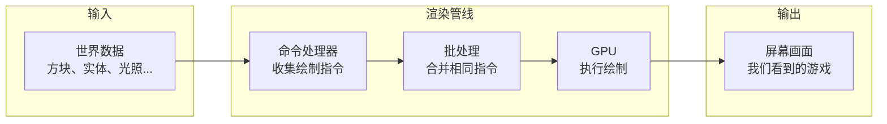
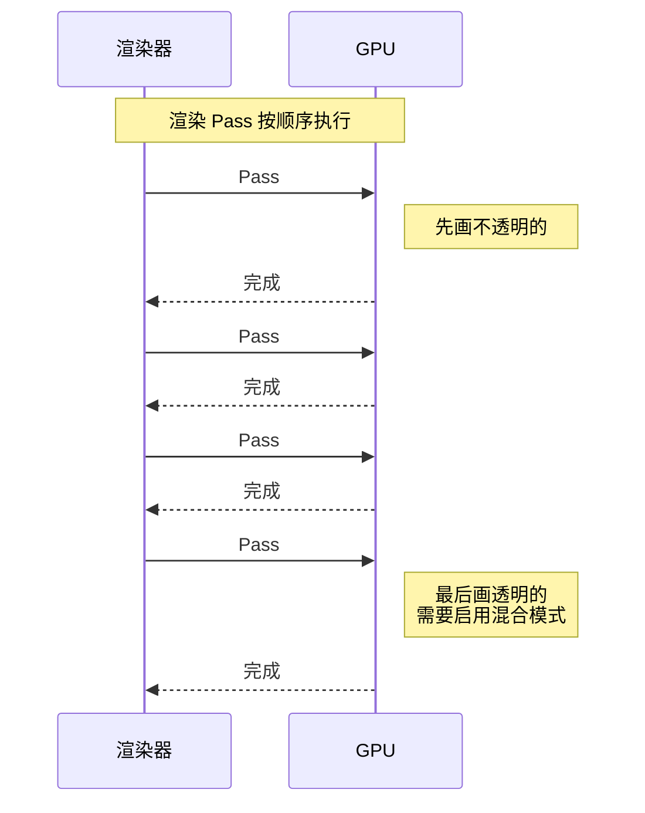
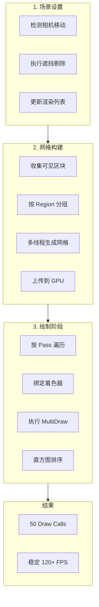
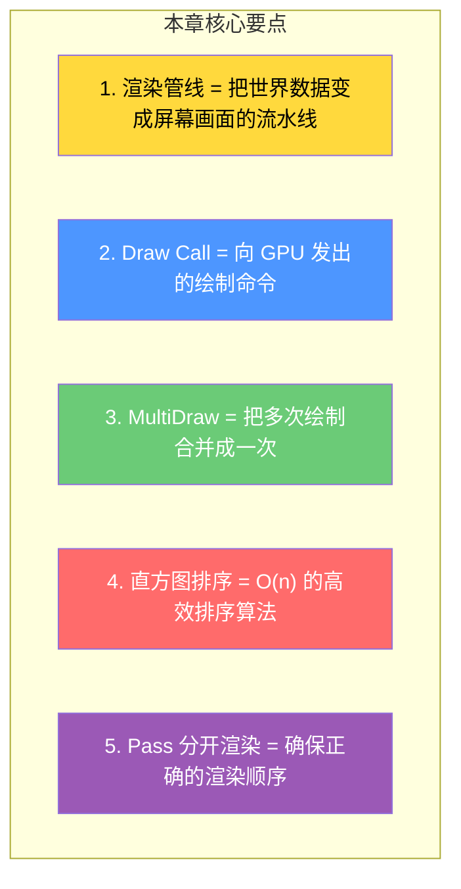

# 第四章：渲染管线与批处理

> ⭐ **本章将揭示 Minecraft 画面卡顿的真正原因，以及 Sodium 如何用"工厂流水线"的思路解决它！**

---

## 目标

学完本章后，你将理解：

1. **渲染管线是什么** - 想象成汽车工厂的装配流水线
2. **Draw Call 是什么** - 每帧向 GPU 发出的"绘制命令"
3. **原版的问题** - 为什么每个区块都要单独"喊话"一次
4. **MultiDraw 批处理** - Sodium 如何把多次命令合并成一次
5. **直方图排序** - 用"数手指"的方法快速排序

---

## 前置知识

- 了解 GPU 的基本概念（显卡负责画图）
- 知道 Java 的基本语法
- 知道什么是 `for` 循环（会遍历东西）

---

## 什么是渲染管线？

### 比喻：汽车工厂的装配线 🏭

想象你在经营一个**汽车工厂**：

```
┌─────────────────────────────────────────────────────────────┐
│                        汽车装配流水线                         │
├─────────────────────────────────────────────────────────────┤
│                                                               │
│  [零件区]  →  [焊接工位]  →  [喷漆工位]  →  [质检区]  →  [成品]  │
│                                                               │
│     │            │            │            │                   │
│     ▼            ▼            ▼            ▼                   │
│  准备车身      焊接车身      喷涂颜色      检查质量              │
│                                                               │
└─────────────────────────────────────────────────────────────┘
```

**渲染管线**（Render Pipeline）就是 Minecraft 的"工厂流水线"：

| 汽车工厂 | Minecraft 渲染管线 |
|---------|-------------------|
| 零件区 | 加载区块数据（方块、贴图） |
| 焊接工位 | 生成网格（Mesh） |
| 喷漆工位 | 应用着色器（Shader） |
| 质检区 | 剔除不可见的部分 |
| 成品车 | 最终画面 |

### 渲染管线的输入与输出



---

## Draw Call：向 GPU 发号施令

### 什么是 Draw Call？

**Draw Call** = 应用程序（CPU）向 GPU 发出的**"画这个"命令**。

就像工厂主管对工人喊话：
- "**画这块石头！**"
- "**画那棵树！**"
- "**画这片草地！**"

### 原版 Minecraft 的问题

Minecraft 原版的渲染方式，就像一个话痨主管，**每个方块都要单独喊一次**：

```
┌──────────────────────────────────────────────────────────────┐
│                    原版 Minecraft 的渲染方式                   │
├──────────────────────────────────────────────────────────────┤
│                                                                │
│  GPU 前面的队伍：                                               │
│                                                                │
│  [Draw Call #1: 画区块 0,0]                                    │
│  [Draw Call #2: 画区块 1,0]                                    │
│  [Draw Call #3: 画区块 2,0]                                    │
│  [Draw Call #4: 画区块 0,1]                                    │
│  ...                                                           │
│  [Draw Call #500: 画区块 20,20]                                │
│                                                                │
│  💡 总计：约 500 次 Draw Call/帧！                              │
│                                                                │
└──────────────────────────────────────────────────────────────┘
```

### 为什么多次 Draw Call 效率低？

| 问题 | 解释 |
|------|------|
| **CPU 开销** | 每次 Draw Call 都需要 CPU 准备数据、调用 API |
| **状态切换** | 不同方块可能需要不同的渲染状态，切换浪费时间 |
| **显卡繁忙** | GPU 不断被打断，无法高效工作 |

```
💡 想象你是一名厨师：

原版方式：来了 500 个顾客，每人点一道菜
         你要：接单 → 炒菜 → 装盘 → 送餐 → 接单 → ...
         结果：手忙脚乱，大部分时间在"接单送餐"

Sodium 方式：把 500 道菜分成 5 类
             50份宫保鸡丁 → 一起炒！
             50份鱼香肉丝 → 一起炒！
             ...
         结果：效率极高！
```

---

## MultiDraw：合并绘制命令

### Sodium 的解决方案

Sodium 发明了 **MultiDraw**（多次绘制）机制：

> 💡 **核心思路**：把"喊 500 次话"变成"喊 1 次话，但说 500 件事"

```
┌──────────────────────────────────────────────────────────────┐
│                   Sodium MultiDraw 的渲染方式                  │
├──────────────────────────────────────────────────────────────┤
│                                                                │
│  原来的喊法：                                                   │
│  "画区块0,0！" "画区块1,0！" "画区块2,0！" ...（500次）           │
│                                                                │
│  Sodium 的喊法：                                                │
│  "把这些区块都画了：[(0,0),(1,0),(2,0),...(20,20)]"（1次）       │
│                                                                │
└──────────────────────────────────────────────────────────────┘
```

### MultiDraw 的原理图

```mermaid
flowchart LR
    subgraph Before["原版方式"]
        B1["区块 #1"] -->|"Draw Call"| B2["GPU"]
        B3["区块 #2"] -->|"Draw Call"| B2
        B4["区块 #3"] -->|"Draw Call"| B2
        B5["..."] -->|"Draw Call"| B2
        B6["区块 #N"] -->|"Draw Call"| B2
    end

    subgraph After["Sodium MultiDraw"]
        A1["区块 #1"] ─┐
        A2["区块 #2"] ─┤
        A3["区块 #3"] ─┼-->|"1次 MultiDraw"| A7["GPU"]
        A4["..."] ────┤
        A5["区块 #N"] ─┘
    end

    style B2 fill:#ff6b6b,color:#fff
    style A7 fill:#6bcb77,color:#fff
```

### 源码中的 MultiDraw

Sodium 的批处理通过 `multiDrawElementsBaseVertex` 方法实现：

```java
// D:\Minecraft-Learning\assets\sodium\src\...\client\render\chunk\region\CachedBatch.java
public void multiDraw(CommandList commands,
                     Tessellationator tessellation,
                     GlBuffer indexBuffer) {

    // 绑定顶点缓冲
    commands.bindBuffer(this.vertexBuffer);

    // 绑定索引缓冲
    commands.bindBuffer(indexBuffer);

    // 设置顶点格式
    tessellation.bindAttributes(commands);

    // ⭐ 批量绘制：一次调用绘制多个几何体！
    commands.multiDrawElementsBaseVertex(
        GL_TRIANGLES,
        drawCounts,      // 每个绘制的顶点数（数组）
        GL_UNSIGNED_INT,
        drawOffsets,     // 偏移量数组
        baseVertices     // 基础顶点偏移
    );
}
```

### Region 分组策略

Sodium 不是把所有区块放一起，而是按 **Region（区域）** 分组：

```
┌─────────────────────────────────────────────────────────────┐
│                        世界地图                              │
├─────────────────────────────────────────────────────────────┤
│                                                               │
│  ┌─────────┐ ┌─────────┐ ┌─────────┐                        │
│  │ Region  │ │ Region  │ │ Region  │                        │
│  │   0,0   │ │   1,0   │ │   2,0   │                        │
│  │(4×4区块)│ │(4×4区块)│ │(4×4区块)│                        │
│  └─────────┘ └─────────┘ └─────────┘                        │
│                                                               │
│  ┌─────────┐ ┌─────────┐ ┌─────────┐                        │
│  │ Region  │ │ Region  │ │ Region  │                        │
│  │   0,1   │ │   1,1   │ │   2,1   │                        │
│  └─────────┘ └─────────┘ └─────────┘                        │
│                                                               │
│  ✅ 每个 Region 内的所有区块，1 次 MultiDraw 绘制完成          │
│                                                               │
└─────────────────────────────────────────────────────────────┘
```

---

## 直方图排序：更聪明的排队方式

### 问题：为什么需要排序？

渲染时按**从远到近**的顺序很重要（透明物体需要特殊处理）。

### 普通排序 vs 直方图排序

**普通排序**（像冒泡排序）：比较每个元素，时间复杂度 **O(n log n)**

**直方图排序**：Sodium 用的方法，时间复杂度 **O(n)** ⭐

### 数手指的比喻 👆

想象你有一堆卡片，每张卡片上写着距离（1-63），你要把它们按距离排序：

**普通人的做法**（冒泡）：
```
第1轮：比较相邻两张，如果顺序不对就交换
第2轮：再比较交换...
...
要比较很多次！😓
```

**聪明人的做法**（直方图）：
```
第1步：伸出一只手（5根手指），把卡片按距离分类
       距离1的放第1堆，距离2的放第2堆...
       （像数手指一样简单）

第2步：按顺序收集每堆卡片
       1,1,1 → 2,2 → 3 → 4,4,4,4 → ...
```

### 源码中的直方图排序

```java
// D:\Minecraft-Learning\assets\sodium\src\...\client\render\chunk\lists\ChunkRenderList.java
public void sort() {
    int[] histogram = new int[64];  // 距离直方图（0-63）

    // 第一遍：按距离分类（像数手指）
    for (int i = 0; i < visibleCount; i++) {
        int distance = getDistanceSquared(visibleSections[i]);
        histogram[distance]++;  // 统计每个距离有多少个
    }

    // 第二遍：计算前缀和（确定每个距离的起始位置）
    for (int i = 1; i < 64; i++) {
        histogram[i] += histogram[i - 1];
    }

    // 第三遍：收集结果（原地重排）
    ChunkRenderable[] sorted = new ChunkRenderable[visibleCount];
    for (int i = visibleCount - 1; i >= 0; i--) {
        int distance = getDistanceSquared(visibleSections[i]);
        sorted[--histogram[distance]] = renderables[i];
    }
}
```

### 排序效果对比

| 方法 | 时间复杂度 | 1000个区块耗时 |
|------|-----------|---------------|
| 冒泡排序 | O(n²) | ~1000 步 |
| 快速排序 | O(n log n) | ~100 步 |
| **直方图排序** | **O(n)** | **~10 步** |

---

## 渲染 Pass：分门别类处理

### 为什么要分 Pass？

不同类型的方块有不同的渲染要求：

| Pass 名称 | 处理的方块 | 特殊处理 |
|-----------|-----------|----------|
| SOLID | 石头、泥土、草方块 | 无需特殊处理 |
| CUTOUT | 花、栅栏、玻璃板 | 有透明缝隙 |
| TRANSLUCENT | 冰、染色玻璃 | 需要透明混合 |

### Pass 执行顺序



### 为什么透明要最后画？

```
💡 想象你在画一幅水彩画：

1. 先画背景（不透明）
2. 后画前景中的水（透明）

如果你先画水，后画背景，水就被盖住了！
```

---

## 性能对比：数字说话

### Draw Call 减少

| 指标 | 原版 Minecraft | Sodium | 提升 |
|------|---------------|--------|------|
| Draw Calls/帧 | ~500 | ~50 | **90% 减少** |
| 着色器切换次数 | 频繁 | 按 Region 分组 | 显著减少 |
| 区块网格构建 | 主线程 | 多线程 | **帧率更稳定** |

### 实际效果

```
┌─────────────────────────────────────────────────────────────┐
│                    性能对比测试                                │
├─────────────────────────────────────────────────────────────┤
│                                                               │
│  场景：玩家在主世界中心，向四周看                               │
│                                                               │
│  ┌─────────────────────────────────────────────────────┐       │
│  │                   原版 Minecraft                      │       │
│  │  FPS: 45 → 突然掉到 20（区块加载时）                   │       │
│  │  CPU: 单核 100%，其他核心闲置                          │       │
│  └─────────────────────────────────────────────────────┘       │
│                                                               │
│  ┌─────────────────────────────────────────────────────┐       │
│  │                   Sodium                              │       │
│  │  FPS: 稳定在 120+                                     │       │
│  │  CPU: 多核均衡负载                                    │       │
│  └─────────────────────────────────────────────────────┘       │
│                                                               │
└─────────────────────────────────────────────────────────────┘
```

### 帧率稳定性对比

```
时间 →
原版:   ████████████████░░░░░███████████████░░░░░███████████████
       (加载区块时卡顿)  (加载区块时卡顿)  (加载区块时卡顿)

Sodium: ████████████████████████████████░░░░░░░░░░░░░░░░░░░░░░░
       (稳定的帧率，偶有轻微波动)
```

---

## 流程总览图



---

## 小结



### 记住这个顺序

```
原版的问题：每个区块 → 单独 Draw Call → 500 次/帧
    ↓
Sodium 的解决：区块按 Region 分组 → MultiDraw → 50 次/帧
    ↓
背后的功臣：直方图排序（O(n)）+ 多线程构建 + 遮挡剔除
```

---

## 课后自查

完成本章节学习后，请确认你能回答以下问题：

- [ ] **Q1**: 渲染管线是什么？请用汽车工厂的比喻解释。
- [ ] **Q2**: Draw Call 是什么？为什么多次 Draw Call 会导致性能问题？
- [ ] **Q3**: MultiDraw 批处理的核心原理是什么？它如何减少 Draw Call 次数？
- [ ] **Q4**: 直方图排序相比普通排序有什么优势？时间复杂度是多少？
- [ ] **Q5**: 为什么透明物体要在不透明物体之后渲染？请解释原因。

---

## 相关文档

| 文档 | 说明 |
|------|------|
| [01-architecture-overview.md](../analysis/01-architecture-overview.md) | Sodium 整体架构设计 |
| [02-chunk-render-system.md](../analysis/02-chunk-render-system.md) | 区块渲染系统详解 |
| [03-occlusion-culling.md](../analysis/03-occlusion-culling.md) | 遮挡剔除算法 |
| [05-shader-system.md](../analysis/05-shader-system.md) | 着色器系统 |

---

## 附录：核心文件速查

| 功能 | 文件 |
|------|------|
| 主渲染器 | `SodiumWorldRenderer.java` |
| 区块管理 | `RenderSectionManager.java` |
| 异步构建 | `ChunkBuilder.java` |
| 区块渲染 | `DefaultChunkRenderer.java` |
| Pass 定义 | `TerrainRenderPass.java` |
| 默认 Pass | `DefaultTerrainRenderPasses.java` |
| 渲染列表 | `ChunkRenderList.java` |
| 批处理缓存 | `CachedBatch.java` |
| 缓冲区管理 | `GlBufferArena.java` |

---

*文档版本：Sodium v0.8.6, Minecraft 1.21.11*
*最后更新：2026-03-24*
