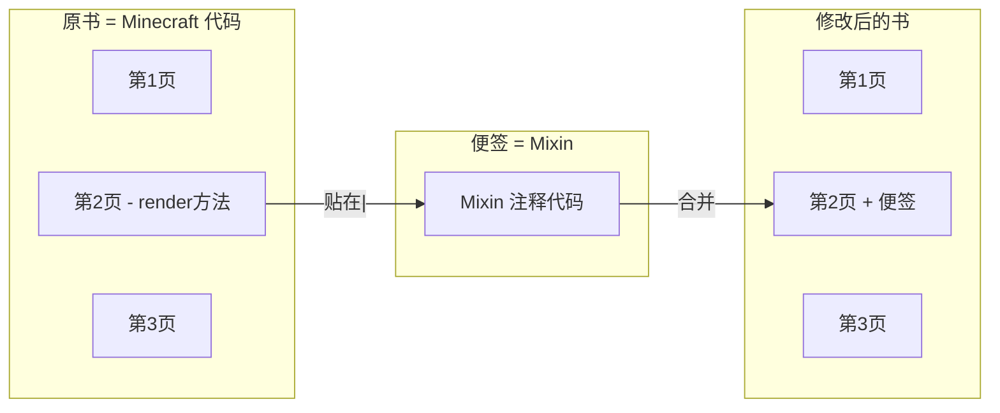
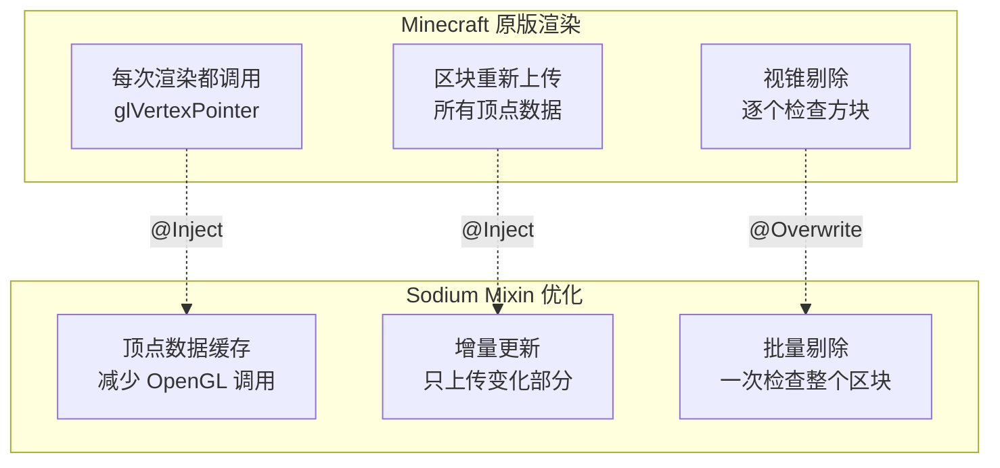
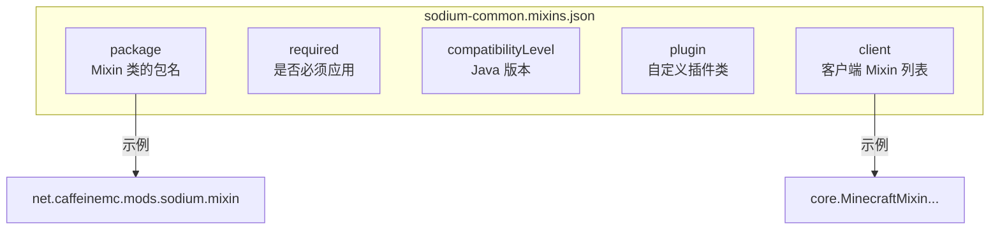
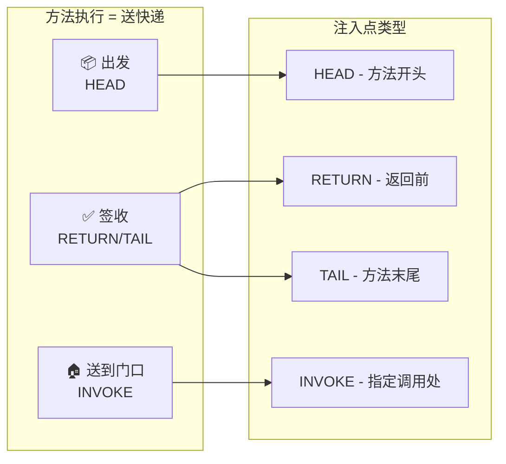
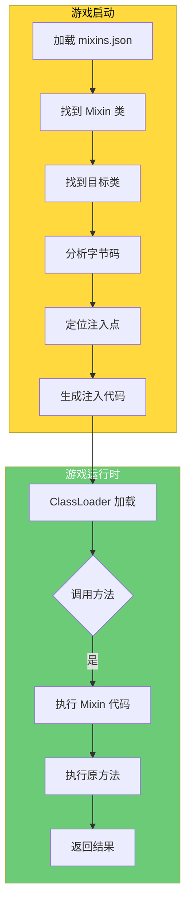

# Mixin 注入基础

> 💡 **什么是 Mixin？** 想象你有一本书（游戏代码），你想在不撕书的情况下添加注释。Mixin 就像给你的书贴上"便签"，在不修改原书的情况下添加新功能。

---

## 目标

学完本章后，你将理解：

1. **什么是 Mixin** - 一种在不修改原代码的情况下修改游戏行为的技术
2. **Mixin 能做什么** - 修改方块渲染、优化性能、添加新功能
3. **Mixin 配置文件** - 如何告诉游戏哪些类需要被修改
4. **注入点类型** - 在方法的什么位置插入代码
5. **回调方法** - 如何接收和操作被修改方法的参数

---

## 前置知识

- 了解 Java 基础（类、继承、注解）
- 知道什么是 `Minecraft` 和 `Mod`
- 了解 JSON 配置文件的格式

---

## 目录

[什么是 Mixin？](#什么是-mixin)
[Mixin 能做什么？](#mixin-能做什么)
[Mixin 配置文件](#mixin-配置文件)
[注入点类型](#注入点类型)
[回调方法](#回调方法)
[实战：写一个简单的 Mixin](#实战写一个简单的-mixin)
[课后自查](#课后自查)

---

## 什么是 Mixin？

### 生活比喻：给书贴便签

想象你有一本很厚的书（就像 Minecraft 的代码），你不能在书上直接写字，但你想添加一些注释。

**Mixin 的解决方案**：
1. 拿一张便签纸（Mixin 类）
2. 在便签上写你的注释（你的代码）
3. 把便签贴在书里指定的页码（注入点）
4. 当别人读这本书时，会同时读到你的注释



### 技术解释

**Mixin** 是 SpongePowered 开发的一个 Java 库，它允许你在**运行时**（游戏启动时）修改任何 Java 类的字节码，而不需要修改原始源代码。

| 概念 | 解释 |
|------|------|
| **Target Class** | 被修改的目标类（如 `LevelRenderer`） |
| **Mixin Class** | 包含注入代码的类（继承目标类） |
| **Injection Point** | 注入点，指定在目标方法的何处插入代码 |
| **Callback** | 回调方法，在注入点执行的代码 |

---

## Mixin 能做什么？

### Sodium 中的实际例子

Sodium 使用 Mixin 做了大量性能优化：



### 常见用途

| 用途 | 说明 | 示例 |
|------|------|------|
| 修改渲染 | 改变物体如何显示 | 让树叶透明、添加阴影 |
| 优化性能 | 改进游戏运行效率 | Sodium 的渲染优化 |
| 添加功能 | 在原方法中插入新逻辑 | 统计信息、调试信息 |
| 拦截事件 | 在特定时机执行代码 | 区块加载/卸载时通知 |

---

## Mixin 配置文件

### JSON 配置文件

每个 Mod 都有一个 Mixin 配置文件，告诉游戏需要修改哪些类。

```1:25:D:/Minecraft-Learning/assets/Sodium/common/src/main/resources/sodium-common.mixins.json
{
  "package": "net.caffeinemc.mods.sodium.mixin",
  "required": true,
  "compatibilityLevel": "JAVA_17",
  "plugin": "net.caffeinemc.mods.sodium.mixin.SodiumMixinPlugin",
  "injectors": {
    "defaultRequire": 1
  },
  "client": [
    "core.MinecraftMixin",
    "core.WindowMixin",
    "core.render.world.LevelRendererMixin"
  ]
}
```

### 配置项说明



| 配置项 | 作用 | 示例值 |
|--------|------|--------|
| `package` | Mixin 类的包名前缀 | `net.caffeinemc.mods.sodium.mixin` |
| `required` | 设为 `true` 表示必须成功应用 | `true` / `false` |
| `compatibilityLevel` | Java 版本兼容性要求 | `JAVA_17` |
| `plugin` | 自定义插件类，用于条件性应用 Mixin | `...SodiumMixinPlugin` |
| `client` | 客户端专用的 Mixin 类列表 | `["MixinA", "MixinB"]` |

### 在 mod.json 中注册

```java
// 在你的 Mod 主类中
@Mod.EventBusSubscriber(modid = "mymod", bus = Mod.EventBusSubscriber.Bus.FML)
public class MyMod {
    // Mixin 配置文件会被自动加载
}
```

或者在 `fabric.mod.json` 中：

```json
{
  "mixins": [
    "mymod.mixins.json"
  ]
}
```

---

## 注入点类型

### 比喻：包裹快递

想象你要在快递的**不同位置**添加追踪标签：



### 常用注入点详解

| 注入点 | 说明 | 使用场景 |
|--------|------|----------|
| `HEAD` | 方法的**最开始** | 初始化变量、前置检查 |
| `RETURN` | 方法**返回之前** | 后置处理、结果修改 |
| `TAIL` | 方法的**最后** | 与 RETURN 类似 |
| `INVOKE` | **特定方法调用**处 | 修改某个方法的行为 |
| `NEW` | **对象创建**处 | 替换对象构造方式 |

### INVOKE 注入的精确控制

```java
@Inject(
    method = "renderLevel",
    at = @At(
        value = "INVOKE",                          // 注入类型
        target = "Lnet/minecraft/client/renderer/LevelRenderer;cullTerrain()V",  // 目标方法
        shift = At.Shift.AFTER                     // 在目标方法之后
    )
)
private void afterCullTerrain(CallbackInfo ci) {
    // 在地形剔除完成后执行这里
}
```

`shift` 参数可以调整注入时机：

| Shift 值 | 说明 |
|----------|------|
| `BEFORE` | 在目标方法调用**之前** |
| `AFTER` | 在目标方法调用**之后** |
| `by = X` | 在目标方法调用后偏移 X 行 |

---

## 回调方法

### CallbackInfo - 基本回调

当你不关心原方法的参数和返回值时使用：

```java
@Inject(method = "runTick", at = @At("HEAD"))
private void preTick(CallbackInfo ci) {
    // 方法执行前会调用这里
    // ci 可以用来取消原方法的执行
}
```

### CallbackInfoReturnable - 可修改返回值

当你想**修改**原方法的返回值时使用：

```java
@Inject(method = "getRenderDistance", at = @At("HEAD"))
private void onGetRenderDistance(CallbackInfoReturnable<Integer> cir) {
    // 把渲染距离改成 32
    cir.setReturnValue(32);
}
```

### 捕获方法参数

Mixin 可以接收原方法的参数：

```java
@Inject(method = "onBlockClicked", at = @At("HEAD"))
private void onBlockClicked(
    BlockPos pos,           // 原方法的第一个参数
    CallbackInfo ci
) {
    System.out.println("玩家点击了方块：" + pos);
}
```

### 取消方法执行

```java
@Inject(method = "shouldRender", at = @At("HEAD"), cancellable = true)
private void shouldRender(CallbackInfoReturnable<Boolean> cir) {
    if (/* 某些条件 */) {
        cir.cancel();  // 取消原方法，返回 false
    }
}
```

---

## 实战：写一个简单的 Mixin

### 场景：统计玩家放置的方块数量

假设你想在玩家放置方块时统计数量，用 Mixin 实现：

### Step 1：创建 Mixin 配置文件

`src/main/resources/mymod.mixins.json`:

```json
{
  "package": "com.mymod.mixin",
  "mixins": [],
  "client": [
    "client.PlayerPlacementMixin"
  ]
}
```

### Step 2：创建 Mixin 类

`src/main/java/com/mymod/mixin/PlayerPlacementMixin.java`:

```java
package com.mymod.mixin;

import com.mymod.MyMod;
import net.minecraft.client.Minecraft;
import net.minecraft.core.BlockPos;
import net.minecraft.world.level.Level;
import net.minecraft.world.level.block.state.BlockState;
import org.spongepowered.asm.mixin.Mixin;
import org.spongepowered.asm.mixin.injection.At;
import org.spongepowered.asm.mixin.injection.Inject;
import org.spongepowered.asm.mixin.injection.callback.CallbackInfo;
import org.spongepowered.asm.mixin.injection.callback.LocalCapture;

@Mixin(Minecraft.class)  // 目标类：Minecraft
public class PlayerPlacementMixin {
    
    // 注入到 useItem 方法的开头
    @Inject(
        method = "useItem",  // 目标方法
        at = @At("HEAD")      // 在方法开头注入
    )
    private void onItemUse(CallbackInfo ci) {
        MyMod.LOGGER.info("玩家正在使用物品！");
    }
}
```

### Step 3：完整示例 - 监听方块放置

```java
package com.mymod.mixin;

import com.mymod.MyMod;
import net.minecraft.client.Minecraft;
import net.minecraft.core.BlockPos;
import net.minecraft.world.level.Level;
import net.minecraft.world.level.block.state.BlockState;
import org.spongepowered.asm.mixin.Mixin;
import org.spongepowered.asm.mixin.injection.At;
import org.spongepowered.asm.mixin.injection.Inject;
import org.spongepowered.asm.mixin.injection.callback.CallbackInfo;
import org.spongepowered.asm.mixin.injection.callback.LocalCapture;

@Mixin(Minecraft.class)
public class PlayerPlacementMixin {

    // 使用 LocalCapture 来捕获局部变量
    @Inject(
        method = "handleBlockBreakProgress",
        at = @At(
            value = "INVOKE",
            target = "Lnet/minecraft/world/level/Level;setBlock(Lnet/minecraft/core/BlockPos;Lnet/minecraft/world/level/block/state/BlockState;I)Z"
        ),
        locals = LocalCapture.CAPTURE_FAILSOFT
    )
    private void onBlockPlaced(
        BlockPos pos,
        CallbackInfo ci,
        Level level,
        BlockState state
    ) {
        // 统计放置的方块
        MyMod.blocksPlaced++;
        MyMod.LOGGER.info("方块被放置了！当前数量：" + MyMod.blocksPlaced);
    }
}
```

### Mixin 注入流程图



---

## 课后自查

完成本章学习后，检查你是否理解以下内容：

### ✅ 基本概念

1. [ ] 能用自己的话解释什么是 Mixin
2. [ ] 知道 Target Class 和 Mixin Class 的区别
3. [ ] 理解为什么需要 Mixin 配置文件

### ✅ 注入点

4. [ ] 能说出 HEAD、RETURN、INVOKE 三种注入点的区别
5. [ ] 知道什么情况下需要使用 `cancellable = true`
6. [ ] 理解 `shift = At.Shift.AFTER` 的作用

### ✅ 回调方法

7. [ ] 知道何时使用 `CallbackInfo` vs `CallbackInfoReturnable`
8. [ ] 能从方法签名中捕获参数
9. [ ] 知道如何调用 `ci.cancel()` 取消方法执行

### ✅ 实践

10. [ ] 能写一个简单的 Mixin 配置文件
11. [ ] 能创建继承目标类的 Mixin 类
12. [ ] 知道如何访问目标类的私有字段（使用 `@Shadow`）

---

## 相关文档

| 文档 | 说明 |
|------|------|
| [01-architecture-overview.md](../01-architecture-overview.md) | Sodium 整体架构 |
| [07-mixin-injection.md](../../analysis/07-mixin-injection.md) | Mixin 注入机制详解 |

---

*文档版本：v1.0*
*学习时间：约 25 分钟*
*基于 Sodium v0.8.6 源码*
