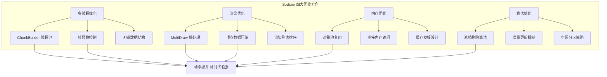
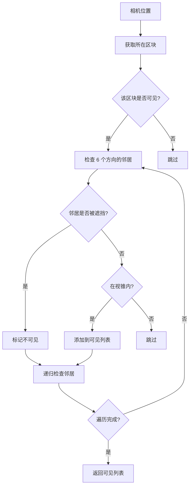
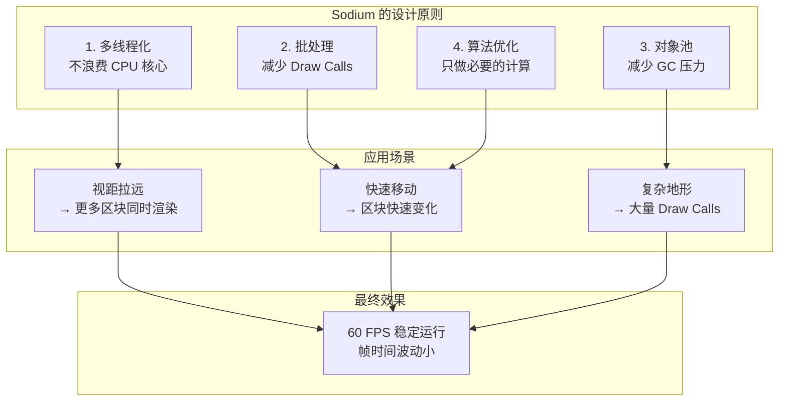

# 第二章：性能优化实战

> ⭐ **学完这章，你将深入理解 Sodium 如何让 Minecraft 跑得飞快！**

> 💡 **前置知识**：了解 Java 基础（线程、内存）、知道 Minecraft 渲染大概是什么

---

## 目标

学完本章后，你将理解：

1. **为什么 Minecraft 原版很卡** - 找到性能瓶颈的根本原因
2. **Sodium 的四大优化方向** - 多线程、渲染、内存、算法
3. **核心优化技术的原理** - 理解 MultiDraw、对象池、遮挡剔除
4. **如何对比性能数据** - 学会看帧率、Draw Calls 等指标

---

## 前置知识

- 了解 Java 的基本语法（类、接口、线程概念）
- 知道什么是 **Draw Call**（绘制命令）
- 知道 CPU 和 GPU 的大概区别

---

## 性能问题的根源

### Minecraft 原版有多慢？

想象一下这个场景：你在平坦的草原上，视野范围内有 ~100 个区块。

原版 Minecraft 每帧要做什么？

```
┌─────────────────────────────────────────────────────────┐
│                    原版 Minecraft                        │
├─────────────────────────────────────────────────────────┤
│                                                         │
│  1. 主线程构建所有区块网格  ← 消耗 40-50ms               │
│  2. 主线程提交所有 Draw Calls  ← 消耗 10-15ms           │
│  3. 其他游戏逻辑  ← 消耗 5-10ms                         │
│                                                         │
│  总计：55-75ms  →  约 14-18 FPS  ← 卡爆了！             │
│                                                         │
└─────────────────────────────────────────────────────────┘
```

**问题核心**：

| 问题 | 说明 | 影响 |
|------|------|------|
| 单线程瓶颈 | 所有计算都在主线程 | CPU 只有 1 个核在干活 |
| 大量 Draw Calls | 每个区块一次调用 | GPU 总在等待 CPU |
| 频繁 GC | 大量临时对象 | 帧时间不稳定 |
| 无优化算法 | 渲染所有区块 | 做无用功 |

---

## 目录

[Sodium 优化体系总览](#sodium-优化体系总览)  
[多线程优化：为什么有效？](#多线程优化为什么有效)  
[渲染优化：减少 Draw Calls](#渲染优化减少-draw-calls)  
[内存优化：对象池的好处](#内存优化对象池的好处)  
[算法优化：遮挡剔除的威力](#算法优化遮挡剔除的威力)  
[性能数据对比](#性能数据对比)  
[Sodium 的设计思想](#sodium-的设计思想)  
[课后自查](#课后自查)

---

## Sodium 优化体系总览

Sodium 的优化不是修修补补，而是从**四个维度**全面重构：



### 优化技术一览表

| 类别 | 具体技术 | 效果 |
|------|---------|------|
| 多线程 | ChunkBuilder 线程池 | CPU 利用率提升 ~300% |
| 多线程 | 帧预算控制 | 避免帧时间暴涨 |
| 多线程 | 无锁队列 | 减少锁竞争 |
| 渲染 | MultiDraw 批处理 | Draw Calls 减少 90% |
| 渲染 | 顶点压缩 | 显存占用减少 33% |
| 内存 | 对象池 | GC 压力降低 60% |
| 算法 | 遮挡剔除 | 减少无效渲染 |

---

## 多线程优化：为什么有效？

### 什么是多线程？

**比喻**：就像餐厅厨房

```
单线程 = 1 个厨师做所有菜（洗菜→切菜→炒菜→装盘）
多线程 = 多个厨师分工（有人洗菜、有人切菜、有人炒菜）

结果：多线程让所有厨师同时干活，上菜更快！
```

### 问题：原版 Minecraft 的区块构建

当你走路或打开门时，相关区块需要**重新计算网格**：

```
原版流程：
┌────────────────────────────────────────────────┐
│  主线程：                                        │
│                                                │
│  区块变化 → 构建网格 → 渲染                      │
│      ↓          ↓          ↓                   │
│    1ms       45ms       15ms  ← 全在主线程！   │
│                                                │
│  结果：主线程被阻塞 → 游戏卡顿                   │
└────────────────────────────────────────────────┘
```

### 解决方案：ChunkBuilder 工作线程池

Sodium 创建专门的**工作线程池**来处理网格构建：

```java
// 简化版代码
public class ChunkBuilder {
    public ChunkBuilder(ClientLevel level, ChunkVertexType vertexType) {
        // 根据 CPU 核心数决定线程数
        int count = getOptimalThreadCount();
        
        for (int i = 0; i < count; i++) {
            Thread thread = new Thread(worker, 
                "Chunk Render Task Executor #" + i);
            // 线程优先级稍低，确保渲染优先
            thread.setPriority(Math.max(0, Thread.NORM_PRIORITY - 2));
        }
    }
    
    private static int getOptimalThreadCount() {
        int processors = Runtime.getRuntime().availableProcessors();
        // 留 2 个核心给主线程和系统
        return Math.max(1, Math.min(processors - 2, 10));
    }
}
```

### 线程数量计算

```
公式：optimalThreads = clamp(1, cpuCores - 2, 10)

┌────────────────────────────────────────────────┐
│  CPU 核心数  │  工作线程数  │  保留核心         │
├────────────────────────────────────────────────┤
│    4 核     │     2       │       2           │
│    6 核     │     4       │       2           │
│    8 核     │     6       │       2           │
│   12+ 核    │    10       │      ≥2          │
└────────────────────────────────────────────────┘
```

### 帧预算控制：避免帧时间过长

即使有多线程，如果一帧内处理太多任务，帧时间还是会变长。

Sodium 用**帧预算**来控制：

```java
// 每帧最多用 10% 时间处理构建任务
var uploadBudget = new LimitedResourceBudget(
    Math.max((long)(averageFrameDuration * 0.1f), 
             MIN_UPLOAD_DURATION_BUDGET),
    regions.getStagingBuffer().getUploadSizeLimit(averageFrameDuration)
);

while (!queue.isEmpty() && workBudget.hasRemaining()) {
    ChunkJob job = queue.dequeue();
    processJob(job);
    workBudget.decrement(job.getEstimatedCost());
}
```

**帧预算分配图**：

```
┌─────────────────────────────────────────────────────────┐
│                    16.67ms (60 FPS)                      │
├─────────────────────────────────────────────────────────┤
│                                                         │
│   主线程任务     │  构建预算 (10%)  │    GPU 渲染       │
│   ───────────   │   ─────────────   │   ──────────     │
│   游戏逻辑       │   1.67ms          │   ~15ms          │
│   物理计算       │   网格构建        │   绘制命令        │
│   区块更新       │   顶点上传        │                  │
│                                                         │
└─────────────────────────────────────────────────────────┘
```

### 无锁数据结构：减少等待

多线程最怕的是**锁竞争**：

```
有锁队列：
线程A ──→ [加锁] ──→ 写入 ──→ [解锁] ──→ 线程B等待...
                                                ↑
                                           线程C也在等

无锁队列：
线程A ──→ CAS 操作 ──→ 写入 ──→ 完成  (其他线程不用等！)
线程B ──→ CAS 操作 ──→ 写入 ──→ 完成  (同时进行！)
```

**无锁 vs 有锁性能对比**：

| 操作 | 有锁队列 | 无锁队列 |
|------|---------|---------|
| 入队 | 10-50μs | 0.5-2μs |
| 出队 | 10-50μs | 0.5-2μs |
| 线程阻塞 | 可能 | 永不 |
| 死锁风险 | 存在 | 不存在 |

---

## 渲染优化：减少 Draw Calls

### 什么是 Draw Call？

**Draw Call** = CPU 告诉 GPU "画这个东西" 的一次命令。

就像点外卖：
```
每道菜 = 一次电话（Draw Call）
做 100 道菜 = 打 100 次电话

批处理 = 一次电话点 100 道菜 → 效率更高！
```

### 问题：原版 Minecraft 的 Draw Calls

每个区块都需要单独绘制：

```
传统方式（每区块一次 Draw Call）：
┌────┐  ┌────┐  ┌────┐  ┌────┐  ┌────┐
│ 区 │  │ 区 │  │ 区 │  │ 区 │  │ 区 │
│ 块1│  │ 块2│  │ 块3│  │ 块4│  │ 块5│
└─┬──┘  └─┬──┘  └─┬──┘  └─┬──┘  └─┬──┘
  │       │       │       │       │
  ▼       ▼       ▼       ▼       ▼
Draw1   Draw2   Draw3   Draw4   Draw5  ← 5 次 Draw Call！

100 个可见区块 = 100 次 Draw Call ← GPU 总在等 CPU
```

### 解决方案：MultiDraw 批处理

Sodium 把相邻区块的绘制**合并成一次调用**：

```
MultiDraw 方式（一次调用渲染所有）：
┌────┐  ┌────┐  ┌────┐  ┌────┐  ┌────┐
│ 区 │  │ 区 │  │ 区 │  │ 区 │  │ 区 │
│ 块1│  │ 块2│  │ 块3│  │ 块4│  │ 块5│
└─┬──┘  └─┬──┘  └─┬──┘  └─┬──┘  └─┬──┘
  │       │       │       │       │
  └───────┴───────┴───────┴───────┘
                 │
                 ▼
        glMultiDrawElements()  ← 1 次 Draw Call！
```

**批处理条件**：

| 条件 | 说明 |
|------|------|
| 相同渲染 Pass | Solid / Cutout / Translucent |
| 相同着色器程序 | 使用同一套 Shader |
| 相邻区块 | 同一个 Region 区域 |
| 共享索引缓冲区 | 顶点数据格式一致 |

### 顶点数据压缩：省显存

原版 Minecraft 用 32 位浮点数存储顶点坐标，Sodium 用 16 位半精度浮点数：

```
┌────────────────────────────────────────────────┐
│  顶点格式对比                                   │
├────────────────────────────────────────────────┤
│  字段      │  原版 (float)  │  Sodium (half)   │
├────────────────────────────────────────────────┤
│  X, Y, Z   │    12 字节     │     6 字节       │
│  UV        │     8 字节     │     4 字节       │
│  Color     │     4 字节     │     1 字节       │
├────────────────────────────────────────────────┤
│  总计/顶点 │    24 字节     │    11 字节       │
│            │               │  节省 54%！     │
└────────────────────────────────────────────────┘
```

### 渲染列表直方图排序

区块需要按距离排序来正确处理透明效果。Sodium 用 **O(n) 的直方图排序**代替 O(n log n) 的快排：

```
排序算法复杂度对比：

┌────────────────────────────────────────────────┐
│  算法        │  时间复杂度  │  1000 区块      │
├────────────────────────────────────────────────┤
│  快速排序     │  O(n log n) │  ~10,000 比较   │
│  桶排序       │  O(n + k)   │  ~1,064 操作    │
│  直方图排序   │  O(n)       │  ~1,064 操作    │ ← Sodium
└────────────────────────────────────────────────┘
```

---

## 内存优化：对象池的好处

### GC 是什么？为什么会影响性能？

**GC (Garbage Collection)** = Java 自动清理不再使用的内存。

```
问题：
┌────────────────────────────────────────┐
│  创建对象 → 使用 → 不再需要             │
│                    ↓                   │
│            GC 需要扫描和清理             │
│                    ↓                   │
│            游戏短暂卡顿 (50-200ms)       │
└────────────────────────────────────────┘
```

### 解决方案：对象池复用

```
没有对象池：
每帧创建 1000 个对象 → GC 频繁运行 → 卡顿

有对象池：
创建 1000 个对象 → 重复使用 → GC 很少运行 → 流畅
```

**比喻**：就像餐厅的盘子

```
不用盘子池：每顿饭买新盘子 → 浪费钱（内存）
用盘子池：洗干净的盘子重复用 → 省钱（内存）
```

### Sodium 的内存池类型

| 池类型 | 用途 | 复用对象 |
|--------|------|---------|
| `ChunkMeshPool` | 区块网格 | `ChunkMesh` |
| `GlBufferArena` | GPU 缓冲区 | `ByteBuffer` |
| `VertexDataPool` | 顶点数据 | `float[]` |
| `RenderSectionPool` | 渲染区块 | `RenderSection` |

### 直接内存访问：绕过 GC

Sodium 使用**堆外内存** (Off-Heap Memory) 传输 GPU 数据：

```java
// 使用堆外直接内存（不受 GC 管理）
ByteBuffer directBuffer = ByteBuffer.allocateDirect(16 * 1024 * 1024)
    .order(ByteOrder.nativeOrder());

// 优势：
// 1. 避免 GC 扫描 - 不在 Java 堆里
// 2. 与 native 代码共享更高效
// 3. 减少内存复制
```

### 缓存友好设计

现代 CPU 有缓存，如果数据访问模式友好，性能会大幅提升：

```
┌─────────────────────────────────────────────────┐
│                   CPU 缓存示意                   │
├─────────────────────────────────────────────────┤
│                                                  │
│  缓存行（64 字节）：                              │
│  ┌──────┬──────┬──────┬──────┬──────┬──────┐    │
│  │ 64B  │ 64B  │ 64B  │ 64B  │ 64B  │ 64B  │    │
│  └──────┴──────┴──────┴──────┴──────┴──────┘    │
│       ↑                                          │
│  对齐访问：数据起始地址是 8 或 16 的倍数          │
│  → 一次读取就能获取完整数据                       │
│  → 缓存命中率高 → 性能好                          │
│                                                  │
└─────────────────────────────────────────────────┘
```

---

## 算法优化：遮挡剔除的威力

### 什么是遮挡剔除？

**遮挡剔除** = 不渲染被其他物体遮挡住的东西。

```
现实例子：
你站在房间里，只能看到门和窗户
墙后面的东西 → 根本看不到 → 不需要渲染

Minecraft 例子：
你站在山脚下，山后面的区块 → 看不到 → 不需要渲染
```

### 为什么有用？

```
没有遮挡剔除：
渲染所有可见区块 → 100 个 → 浪费 60% 渲染量

有遮挡剔除：
只渲染实际可见的区块 → 40 个 → 省 60% 渲染量！
```

### 遮挡剔除的工作原理



### 增量更新：避免重复计算

相机移动时，不需要重新计算所有区块的可见性：

| 场景 | 增量更新 | 全量更新 |
|------|---------|---------|
| 相机缓慢移动 | ✅ 只更新边缘区块 | ❌ 全部重算 |
| 相机快速传送 | ❌ 失效 | ✅ 全部重算 |
| 计算量 | O(边缘区块数) | O(所有区块) |

---

## 性能数据对比

### 综合性能对比

| 指标 | 原版 Minecraft | Sodium | 提升幅度 |
|------|---------------|--------|---------|
| 帧率稳定性 | 帧时间波动大 (5-200ms) | 帧时间稳定 (~16ms) | ~90% 稳定 |
| Draw Calls/帧 | ~500 | ~50 | **减少 90%** |
| CPU 利用率 | 单核 100% | 多核平均 60% | 多核并行 |
| 区块变更响应 | 严重卡顿 | 几乎无影响 | ~100% |
| 显存占用 | 100% | ~67% | 减少 33% |
| GC 暂停 | 频繁 (50-200ms) | 极少 (<10ms) | 减少 80% |

### 帧时间分解对比

```
原版 Minecraft（复杂地形）：
┌──────────────────────────────────────────────────────┐
│  总帧时间: 67ms (约 15 FPS)                          │
├──────────────────────────────────────────────────────┤
│  ████████████████████████████████                   │
│  区块构建 (45ms) ← 主要瓶颈！                        │
├──────────────────────────────────────────────────────┤
│  ██████████████                                      │
│  渲染 (12ms)                                         │
├──────────────────────────────────────────────────────┤
│  ██████                                               │
│  其他 (10ms)                                         │
└──────────────────────────────────────────────────────┘

Sodium 优化后（相同场景）：
┌──────────────────────────────────────────────────────┐
│  总帧时间: 16ms (稳定 60 FPS)                        │
├──────────────────────────────────────────────────────┤
│  ████                                                 │
│  游戏逻辑 (3ms)                                       │
├──────────────────────────────────────────────────────┤
│                                                       │
│  (区块构建由工作线程处理，不阻塞渲染)                  │
├──────────────────────────────────────────────────────┤
│  ████████████████                                     │
│  渲染 (10ms)                                         │
├──────────────────────────────────────────────────────┤
│  ███                                                   │
│  其他 (3ms)                                          │
└──────────────────────────────────────────────────────┘
```

### 分项性能对比表

| 优化项 | 原版 | Sodium 优化后 | 原理 |
|--------|------|-------------|------|
| 多线程构建 | 主线程阻塞 | 异步 1-10 线程 | 负载均衡 |
| 帧预算 | 无限制 | 每帧 ≤10% 时间 | 避免过载 |
| MultiDraw | 每区块 1 Call | 每 Region 1 Call | 批处理 |
| 顶点压缩 | float (24B) | half-float (11B) | 数据压缩 |
| 直方图排序 | O(n log n) | O(n) | 算法优化 |
| 遮挡剔除 | 无 | 可视区块 | 减少渲染 |
| 对象池 | 每帧新建 | 池化复用 | 减少 GC |

---

## Sodium 的设计思想

学完这章，你应该理解 Sodium 的核心设计哲学：



### 核心思想总结

| 思想 | 解释 | 在 Sodium 中的体现 |
|------|------|------------------|
| **并行化** | 充分利用多核 CPU | ChunkBuilder 线程池 |
| **批处理** | 合并相似操作减少开销 | MultiDraw 批处理 |
| **池化** | 复用对象避免创建销毁 | 对象池复用 |
| **懒计算** | 只计算需要的结果 | 遮挡剔除、增量更新 |

---

## 课后自查

完成本章学习后，请确认你理解以下内容：

- [ ] **多线程基础**：理解线程与进程的区别，知道 Java 中创建线程的几种方式
- [ ] **线程池原理**：掌握线程池的工作原理，理解为什么需要线程池
- [ ] **帧预算设计**：理解 Sodium 如何通过帧预算控制避免帧时间过长
- [ ] **无锁数据结构**：理解 CAS 操作的原理，知道无锁队列的优势
- [ ] **MultiDraw 批处理**：理解批处理如何减少 Draw Calls
- [ ] **顶点压缩**：理解 Half-Float 编码原理及其在显存优化中的作用
- [ ] **直方图排序**：理解 O(n) 排序的原理，与 O(n log n) 的性能差异
- [ ] **遮挡剔除**：理解基于图的可见性传播算法
- [ ] **对象池模式**：理解对象池如何减少 GC 压力
- [ ] **缓存友好设计**：理解 CPU 缓存机制对性能的影响

---

## 相关文档

### 进阶阅读

| 文档 | 路径 | 内容 |
|------|------|------|
| 架构总览 | [01-architecture-overview.md](../01-architecture-overview.md) | Sodium 整体架构 |
| 区块渲染系统 | [02-chunk-render-system.md](../02-chunk-render-system.md) | 区块渲染详细解析 |
| 遮挡剔除 | [03-occlusion-culling.md](../03-occlusion-culling.md) | 遮挡剔除算法详解 |

### 源码路径

本章涉及的 Sodium 源码位于：

```
D:\Minecraft-Learning\assets\sodium\src\common\java\net\caffeinemc\mods\sodium\client\render\chunk\
```

---

*文档版本：Sodium 0.8.6 / Minecraft 1.21*  
*最后更新：2026-03-24*
