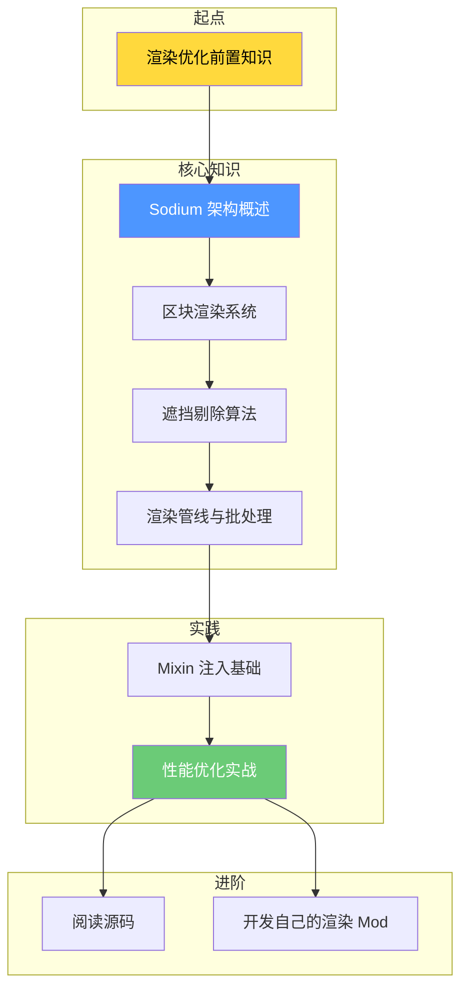

# Sodium 教程索引

> 基于 Sodium v0.8.6 源码的面向新手的教程

---

## 教程概览

本教程旨在帮助理解 Sodium 的渲染优化技术，适合想要学习：
- Minecraft 渲染系统优化原理
- 高性能 Mod 开发技术
- Mixin 字节码注入
- 图形编程基础

---

## 学习路线图

---

## 教程目录

### Part-0: 前置知识

| 章节 | 文件 | 内容 |
|------|------|------|
| 渲染优化入门 | `Part-0/01-rendering-prerequisites.md` | 渲染管线、帧率、Draw Calls 基础概念 |

### Part-1: 核心概念

| 章节 | 文件 | 内容 |
|------|------|------|
| Sodium 架构概述 | `Part-1/01-sodium-intro.md` | Sodium 是什么、模块划分、设计原则 |
| 区块渲染系统 | `Part-1/02-chunk-render.md` | 多线程构建、帧预算控制 |
| 遮挡剔除算法 | `Part-1/03-occlusion-culling.md` | 可见性判断、BFS 遍历 |
| 渲染管线与批处理 | `Part-1/04-render-pipeline.md` | MultiDraw、直方图排序 |

### Part-2: 实践

| 章节 | 文件 | 内容 |
|------|------|------|
| Mixin 注入基础 | `Part-2/01-mixin-basics.md` | Mixin 配置、注入点、回调 |
| 性能优化实战 | `Part-2/02-performance-practice.md` | 综合运用所学知识 |

---

## 前置知识

学习本教程前，你需要了解：

- Java 基础语法（类、接口、泛型）
- Minecraft Mod 开发基础（注册表概念）
- 基本的计算机科学概念（线程、内存）

---

## 相关资源

- [Sodium 分析文档](../analysis/) - 详细的源码分析
- [Sodium 官方仓库](https://github.com/CaffeineMC/sodium)
- [Mixin 官方文档](https://github.com/SpongePowered/Mixin)

---

## 关键术语表

| 术语 | 解释 |
|------|------|
| Draw Call | CPU 向 GPU 发送的渲染命令 |
| 帧率 (FPS) | 每秒渲染帧数 |
| 遮挡剔除 | 不渲染被遮挡住的内容 |
| 批处理 | 合并多个渲染命令 |
| Mixin | 字节码注入框架 |

---

*教程版本: Sodium v0.8.6 / Minecraft 1.21*
*最后更新: 2026-03-24*
