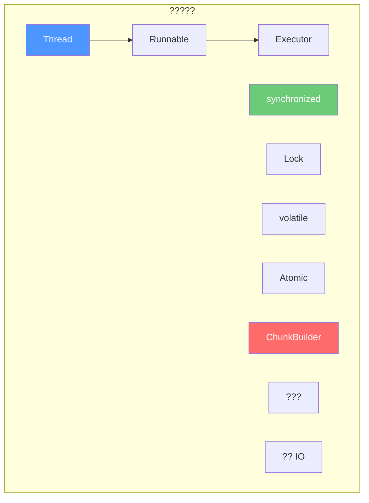

# ??????????
> ????????????

---

## ??

????????????
1. **??????????**
2. **?? Java ?????**
3. **????????**
4. **?? Minecraft ????????*

---

## ?? vs ??

### ????

```
??????????????????????????????????????????????????????????????????                       ??                                 ????????????????????????????????????????????????????????????????????                                                            ????  ?? (Concurrency)                                        ????  ????????   ????????   ????????   ????????              ????  ??CPU ??   ??CPU ??   ??CPU ??   ??CPU ??              ????  ????????   ????????   ????????   ????????              ????     ??         ??         ??         ??                  ????  ??A      ??B      ??C      ??D                   ????     ??         ??         ??         ??                  ????     ???????????????????????????????????                  ????          ?????????????CPU ??????          ????                                                            ????????????????????????????????????????????????????????????????????                                                            ????  ?? (Parallelism)                                        ????  ????????   ????????   ????????   ????????              ????  ??CPU ??   ??CPU ??   ??CPU ??   ??CPU ??              ????  ????????   ????????   ????????   ????????              ????     ??         ??         ??         ??                  ????  ??A      ??B      ??C      ??D                   ????                                                            ????          ??????????????                        ????                                                            ??????????????????????????????????????????????????????????????????```

### Minecraft ????

| ?? | ?? | ?? |
|------|------|------|
| ???? | ????????| Sodium ????????|
| ?? | ???? ???????| GPU ???? |
| ???? | ???? | ???? |

---

## Java ?????

### 1. ????

```java
// ?? 1????Thread
public class MyThread extends Thread {
    @Override
    public void run() {
        // ????????        System.out.println("??????..");
    }
}

// ??
Thread thread = new MyThread();
thread.start();  // ????start() ?? run()

// ?? 2????Runnable
public class MyRunnable implements Runnable {
    @Override
    public void run() {
        System.out.println("Runnable ??????..");
    }
}

// ??
Thread thread = new Thread(new MyRunnable());
thread.start();

// ?? 3?Lambda????
Thread thread = new Thread(() -> {
    System.out.println("Lambda ??????..");
});
thread.start();
```

### 2. ??????

```
     ?????????????     ??  ??    ??new Thread()
     ?????????????           ??start()
           ??     ?????????????     ?? ??????????? ?? CPU ??
     ?????????????           ???? CPU
           ??     ?????????????     ?? ??????????? yield() / ??????     ?????????????           ??run() ????
           ????????           ??     ?????????????     ?? ???????????
     ?????????????```

### 3. ????

????????????????

```java
public class Counter {
    private int count = 0;

    // ?? 1?synchronized ??
    public synchronized void increment() {
        count++;
    }

    public synchronized int getCount() {
        return count;
    }

    // ?? 2?synchronized ??    private final Object lock = new Object();

    public void incrementUnsafe() {
        synchronized (lock) {
            count++;
        }
    }
}
```

### 4. ????

```java
public class ProducerConsumer {
    private final Queue<String> queue = new LinkedList<>();
    private final int MAX_SIZE = 10;

    // ????    public synchronized void produce(String item) throws InterruptedException {
        while (queue.size() >= MAX_SIZE) {
            wait();  // ????????
        }
        queue.add(item);
        notifyAll();  // ??????    }

    // ????    public synchronized String consume() throws InterruptedException {
        while (queue.isEmpty()) {
            wait();  // ????????
        }
        String item = queue.poll();
        notifyAll();  // ??????        return item;
    }
}
```

---

## ????
### ??????????
```
???????????? ?????? ????????????? ??...

????- ??/????????- ????????- ????

??????
???????????? ?????????? ??...

????- ?????????
- ??????
- ????
```

### Executors ????

```java
import java.util.concurrent.*;

// 1. ????????ExecutorService fixedPool = Executors.newFixedThreadPool(4);

// 2. ????
ExecutorService singlePool = Executors.newSingleThreadExecutor();

// 3. ????????????ExecutorService cachedPool = Executors.newCachedThreadPool();

// 4. ????????????ScheduledExecutorService scheduledPool = Executors.newScheduledThreadPool(2);
```

### ??????
```java
ExecutorService executor = Executors.newFixedThreadPool(4);

// ?? Runnable ??
executor.submit(() -> {
    System.out.println("??1???????? + Thread.currentThread().getName());
});

// ?? Callable ????????
Future<String> future = executor.submit(() -> {
    Thread.sleep(1000);
    return "??2????;
});

// ????
String result = future.get();  // ????????
// ??????executor.shutdown();
try {
    if (!executor.awaitTermination(60, TimeUnit.SECONDS)) {
        executor.shutdownNow();
    }
} catch (InterruptedException e) {
    executor.shutdownNow();
}
```

### ??????

```java
ThreadPoolExecutor customPool = new ThreadPoolExecutor(
    2,                      // ??????    8,                      // ?????
    60L,                    // ????????
    TimeUnit.SECONDS,       // ????
    new LinkedBlockingQueue<>(100),  // ????
    new ThreadFactory() {   // ????
        @Override
        public Thread newThread(Runnable r) {
            Thread t = new Thread(r);
            t.setName("My-Worker-" + t.getId());
            return t;
        }
    },
    new ThreadPoolExecutor.CallerRunsPolicy()  // ????
);
```

---

## Minecraft ??????
### Sodium ??ChunkBuilder

```java
// ??? Sodium ChunkBuilder
public class ChunkBuilder {
    // ????????    private final ExecutorService executor;

    public ChunkBuilder(int threadCount) {
        this.executor = Executors.newFixedThreadPool(
            threadCount,
            new ThreadFactory() {
                private int count = 0;
                @Override
                public Thread newThread(Runnable r) {
                    Thread t = new Thread(r, "ChunkBuilder-" + count++);
                    t.setPriority(Thread.MIN_PRIORITY);  // ????
                    return t;
                }
            }
        );
    }

    // ??????
    public CompletableFuture<CompiledChunk> buildChunkAsync(ChunkRenderTask task) {
        return CompletableFuture.supplyAsync(() -> {
            // ????????
            return compileChunk(task);
        }, executor);
    }
}
```

### ??????
```java
public class FrameBudget {
    private static final long TARGET_FRAME_TIME = 16_666_666L;  // 60 FPS

    public void runWithBudget(ChunkBuilder builder) {
        long frameStart = System.nanoTime();
        long budgetRemaining = TARGET_FRAME_TIME;

        while (budgetRemaining > 0 && builder.hasMoreWork()) {
            ChunkRenderTask task = builder.peekNextTask();
            long estimatedTime = task.estimateCompileTime();

            if (estimatedTime <= budgetRemaining) {
                // ??????????
                builder.executeTask(task);
                budgetRemaining -= estimatedTime;
            } else {
                // ????????                break;
            }
        }
    }
}
```

---

## ?????
### Do's ??
```java
// 1. ???????????????ExecutorService pool = Executors.newFixedThreadPool(4);

// 2. ???? Callable ??Future
Future<T> future = pool.submit(() -> {
    return compute();
});
T result = future.get();

// 3. ?? CompletableFuture ??????
CompletableFuture.supplyAsync(() -> loadData(), pool)
    .thenApply(this::process)
    .thenAccept(this::display);

// 4. ??????
try {
    future.get();
} catch (ExecutionException e) {
    Throwable cause = e.getCause();
    // ??????
}
```

### Don'ts ??
```java
// 1. ??????????
// ??
for (int i = 0; i < 10000; i++) {
    new Thread(() -> doWork()).start();
}

// ??
ExecutorService pool = Executors.newFixedThreadPool(4);
for (int i = 0; i < 10000; i++) {
    pool.submit(() -> doWork());
}

// 2. ?????????????
synchronized (lock) {
    // ???????? IO ??
    // networkCall();

    // ??????????
    Object data = fetchData();
    process(data);
}

// 3. ??????????pool.shutdown();
pool.awaitTermination(1, TimeUnit.MINUTES);
```

---

## ??



### ????

1. **?? vs ??** - ????????????????2. **????* - ??????????3. **????** - synchronized?Lock?volatile
4. **Future** - ????????
5. **????* - Sodium ????????????

---

## ??

### ?? 1??????

????????? 4 ????????10 ?????
### ?? 2???????????
?? wait/notifyAll ??????????????????
### ?? 3????Sodium ??

?? Sodium ???? ChunkBuilder????????????
---

## ????

- ????[??????](/sodium/tutorials/04-chunk-system-deep/) - Minecraft ????
- [Sodium ????](/sodium/analysis/02-chunk-render-system/) - ????
- [Java ????](https://docs.oracle.com/javase/tutorial/essential/concurrency/)

---

> ?? **??**?????????????????????? ConcurrentHashMap?AtomicInteger??????????
---

*?????Sodium 0.8.x / Minecraft 1.21*
*?????2026-03-21*
