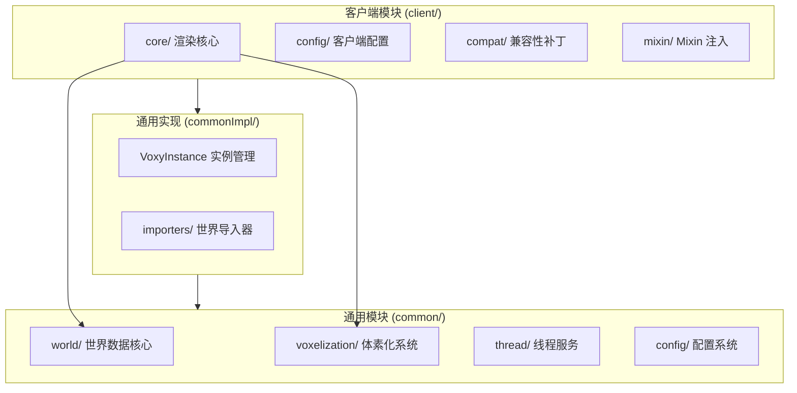
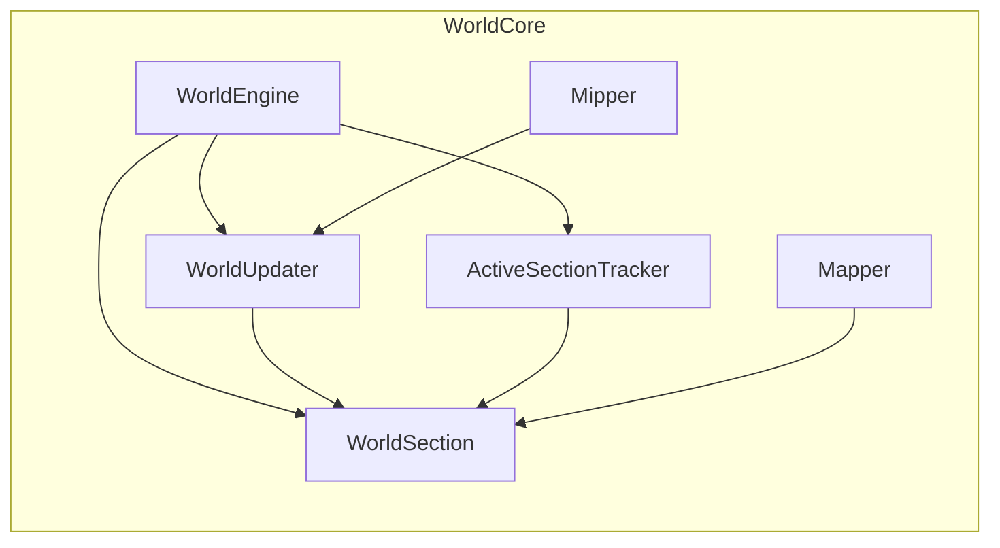
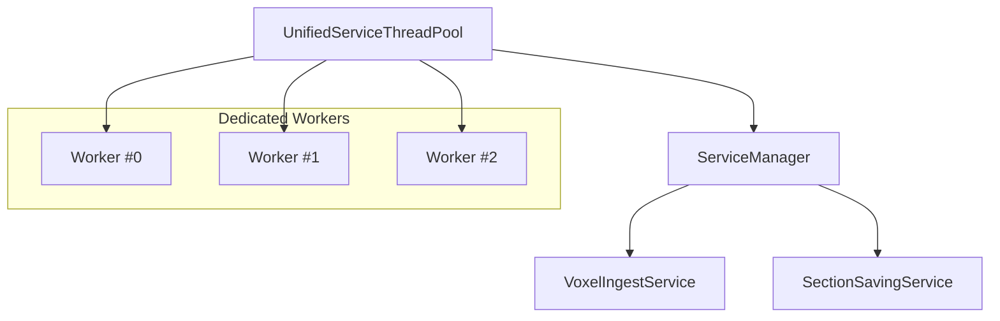
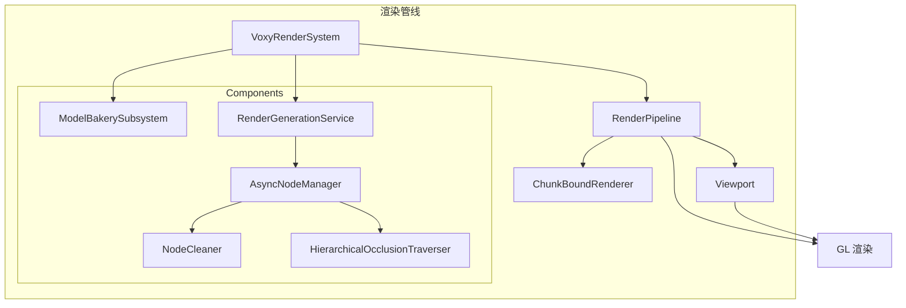
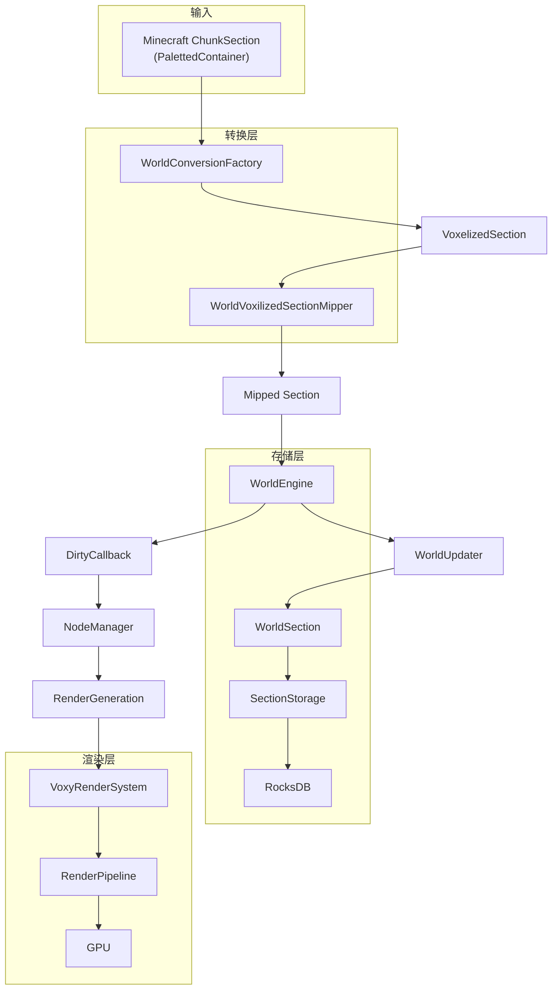
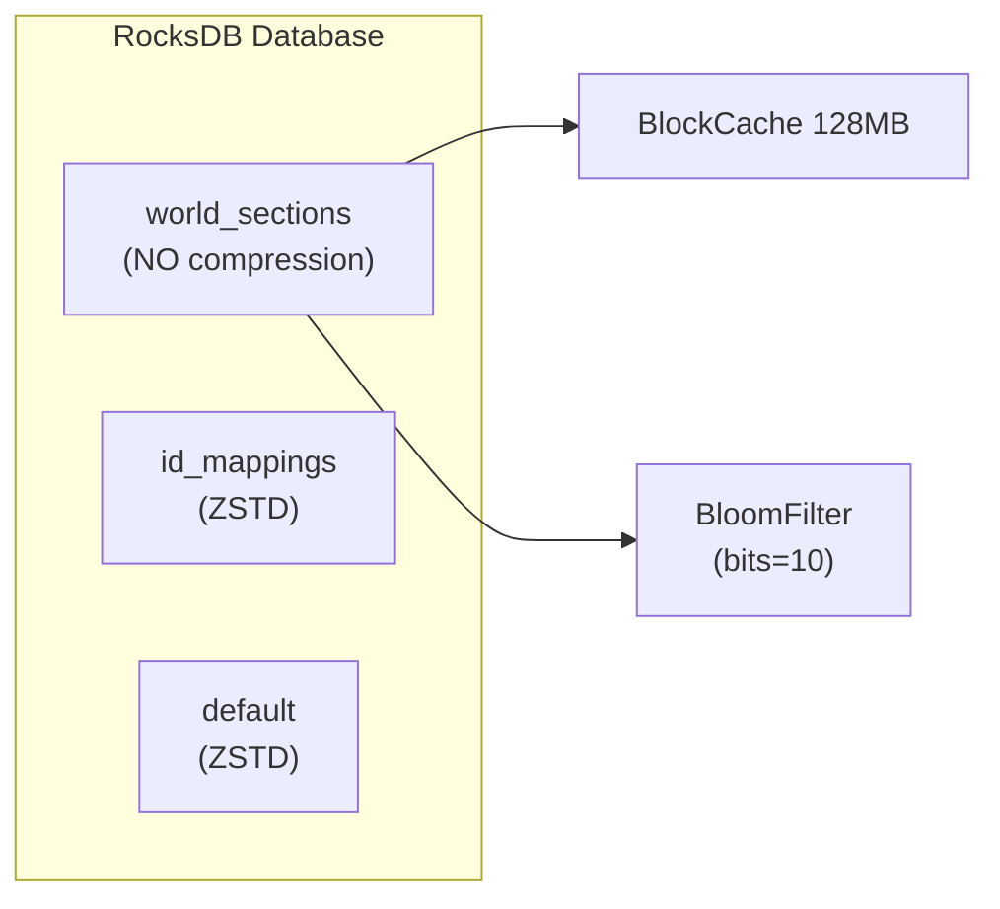
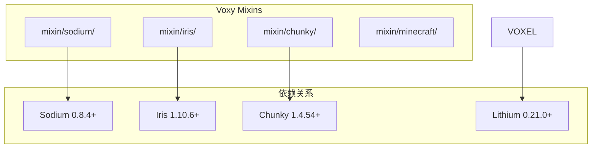
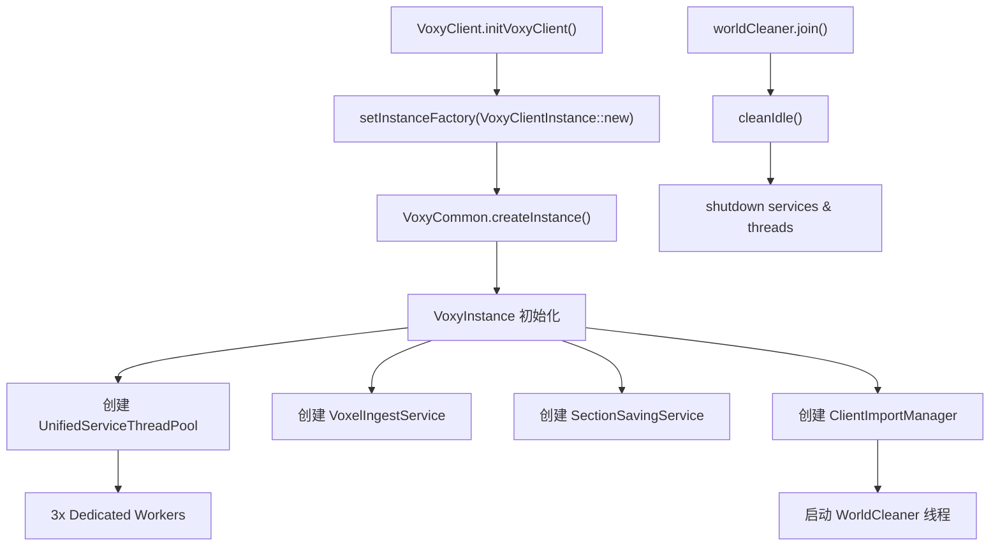

## 致谢

本分析文档是第三方学习笔记，旨在帮助开发者理解 voxy 模组的架构设计。voxy 由 **Cortex** 开发，是一款利用 LOD（多细节层级）技术实现远距离渲染的创新性 Minecraft 模组。

## 目录

- [系统概览](#系统概览)
- [核心概念：LOD 世界引擎](#核心概念lod-世界引擎)
- [子系统架构](#子系统架构)
- [数据流总览](#数据流总览)
- [线程模型](#线程模型)
- [存储系统](#存储系统)
- [Mixin 依赖关系](#mixin-依赖关系)
- [GPU 能力检测](#gpu-能力检测)

---

## 系统概览

voxy 是一款 Fabric 模组，通过引入 **LOD（Level of Detail）** 技术来扩展 Minecraft 的渲染距离。核心思想是将原生的 16x16x16 chunk section 重组为 32x32x32 的多层级结构。



---

## 核心概念：LOD 世界引擎

### LOD 层级结构

voxy 将世界划分为 5 个 LOD 层级，每个层级代表不同的细节级别：

| 层级 | 区块大小 | 压缩比 | 实际覆盖 |
|------|----------|--------|----------|
| L0 | 32x32x32 | 1:1 | 原始精度 |
| L1 | 64x64x64 | 1:2 | 2x2x2 合并 |
| L2 | 128x128x128 | 1:4 | 4x4x4 合并 |
| L3 | 256x256x256 | 1:8 | 8x8x8 合并 |
| L4 | 512x512x512 | 1:16 | 16x16x16 合并 |

### WorldSection 数据编码

每个 `WorldSection` 包含 `long[] data`（32768 个条目），编码格式为：

```text
┌─────────────┬─────────────┬───────────────────┐
│ light(8bit) │ biome(9bit) │   block(20bit)    │
└─────────────┴─────────────┴───────────────────┘
         ↑              ↑               ↑
     天空+方块      512 生物群系    ~100万方块状态
      光照值          ID              ID
```

```12:19:assets/voxy/src/main/java/me/cortex/voxy/common/world/WorldSection.java
public final class WorldSection {
    public static final int SECTION_VOLUME = 32*32*32;
    // ...
    long[] data = null;
```

### 位置编码

WorldEngine 使用 64 位 long 编码位置信息：

```91:93:assets/voxy/src/main/java/me/cortex/voxy/common/world/WorldEngine.java
public static long getWorldSectionId(int lvl, int x, int y, int z) {
    return ((long)lvl<<60)|((long)(y&0xFF)<<52)|((long)(z&((1<<24)-1))<<28)|((long)(x&((1<<24)-1))<<4);
}
```

---

## 子系统架构

### 1. 世界数据核心 (common/world/)



**核心组件职责：**

- **WorldEngine**: 世界引擎主控制器，管理所有 LOD 层级的 section
- **WorldSection**: 单个 32x32x32 数据块，包含 ref count 和 dirty state
- **WorldUpdater**: 向上传播更新，自动更新所有父级 LOD 层
- **ActiveSectionTracker**: LRU 缓存管理，负责 section 的加载/卸载
- **Mapper**: BlockState/Biome 到整数 ID 的映射表

```25:36:assets/voxy/src/main/java/me/cortex/voxy/common/world/WorldEngine.java
public class WorldEngine {
    public static final int MAX_LOD_LAYER = 4;
    public static final int UPDATE_TYPE_BLOCK_BIT = 1;
    public static final int UPDATE_TYPE_CHILD_EXISTENCE_BIT = 2;
    public static final int UPDATE_TYPE_DONT_SAVE = 4;
    // ...
    private final Mapper mapper;
    private final ActiveSectionTracker sectionTracker;
```

### 2. 体素化系统 (common/voxelization/)

体素化是连接 Minecraft 原生 chunk 和 voxy LOD 世界的桥梁：

```117:204:assets/voxy/src/main/java/me/cortex/voxy/common/voxelization/WorldConversionFactory.java
public static VoxelizedSection convert(VoxelizedSection section,
                                       Mapper stateMapper,
                                       PalettedContainer<BlockState> blockContainer,
                                       PalettedContainerRO<Holder<Biome>> biomeContainer,
                                       ILightingSupplier lightSupplier) {
    // 处理 Palette 类型：GlobalPalette, LinearPalette, HashMapPalette, LithiumHashPalette
    // ...
}
```

**VoxelizedSection** 包含预计算的 MIP 数据：

```12:14:assets/voxy/src/main/java/me/cortex/voxy/common/voxelization/VoxelizedSection.java
public class VoxelizedSection {
    public int x, y, z;
    public int lvl0NonAirCount;
    public final long[] section;  // 16³ + 8³ + 4³ + 2³ + 1 = 4913 longs
}
```

### 3. 线程服务 (common/thread/)



**核心设计：**

```19:24:assets/voxy/src/main/java/me/cortex/voxy/common/thread/UnifiedServiceThreadPool.java
public UnifiedServiceThreadPool() {
    this.dedicatedPool = new ThreadGroup("Voxy Dedicated Service");
    this.serviceManager = new ServiceManager(this::release);
    this.groupSemaphore = new MultiThreadPrioritySemaphore(this.serviceManager::tryRunAJob);
```

- 3 个专用 Voxy Worker 线程（优先级 3，daemon 模式）
- `VoxelIngestService`: 异步区块摄取，队列上限 5000
- `SectionSavingService`: 异步存储，软上限 5000，硬上限 1200

### 4. 渲染核心 (client/core/)



---

## 数据流总览



**详细数据流：**

```
Minecraft ChunkSection (16³ blocks)
    ↓ WorldConversionFactory.convert()
VoxelizedSection (16³ blocks → 4913 longs encoding)
    ↓ WorldVoxilizedSectionMipper.mipSection()
Mipped VoxelizedSection (all 5 LOD levels precomputed)
    ↓ WorldUpdater.insertUpdate()
WorldEngine (inserts into all LOD layers 0-4)
    ↓ ActiveSectionTracker (LRU cache)
WorldSection (loaded sections with ref count)
    ↓ SectionSavingService (async queue)
RocksDB (LZ4 + ZSTD compression)
    ↓
VoxyRenderSystem.renderOpaque()
    ↓
GPU (via Sodium/Iris Mixin integration)
```

---

## 线程模型

### VoxelIngestService

负责将 Minecraft chunk 转换为 voxy 格式：

```24:54:assets/voxy/src/main/java/me/cortex/voxy/common/world/service/VoxelIngestService.java
public class VoxelIngestService {
    private final Service service;
    private final ConcurrentLinkedDeque<IngestSection> ingestQueue = new ConcurrentLinkedDeque<>();
    
    public VoxelIngestService(ServiceManager pool) {
        this.service = pool.createServiceNoCleanup(()->this::processJob, 5000, "Ingest service");
    }
    
    private void processJob() {
        var task = this.ingestQueue.pop();
        VoxelizedSection csec = WorldConversionFactory.convert(...);
        WorldVoxilizedSectionMipper.mipSection(csec, task.world.getMapper());
        WorldUpdater.insertUpdate(task.world, csec);
    }
```

### SectionSavingService

异步持久化 dirty sections：

```14:38:assets/voxy/src/main/java/me/cortex/voxy/common/world/service/SectionSavingService.java
public class SectionSavingService {
    private static final int SOFT_MAX_QUEUE_SIZE = 5_000;
    private final Service service;
    private final ConcurrentLinkedDeque<SaveEntry> saveQueue = new ConcurrentLinkedDeque<>();
    
    public SectionSavingService(ServiceManager sm) {
        this.service = sm.createServiceNoCleanup(() -> this::processJob, 100, "Section saving service");
    }
    
    private void processJob() {
        var task = this.saveQueue.pop();
        section.setNotDirty();
        if (section.exchangeIsInSaveQueue(false)) {
            task.engine.storage.saveSection(section);
        }
    }
```

---

## 存储系统

### SectionStorage 抽象层

```7:11:assets/voxy/src/main/java/me/cortex/voxy/common/config/section/SectionStorage.java
public abstract class SectionStorage implements IMappingStorage, IStoredSectionPositionIterator {
    public abstract int loadSection(WorldSection into);
    public abstract void saveSection(WorldSection section);
}
```

### RocksDB 存储后端



关键配置：

```55:63:assets/voxy/src/main/java/me/cortex/voxy/common/config/storage/rocksdb/RocksDBStorageBackend.java
final ColumnFamilyOptions cfWorldSecOpts = new ColumnFamilyOptions()
    .setCompressionType(CompressionType.NO_COMPRESSION)
    .setCompactionPriority(CompactionPriority.MinOverlappingRatio)
    .setLevelCompactionDynamicLevelBytes(true)
    .optimizeForPointLookup(128);

var bCache = new HyperClockCache(128*1024L*1024L, 0, 4, false);
var filter = new BloomFilter(10);
```

---

## Mixin 依赖关系

voxy 通过 Mixin 与 Sodium、Iris、Chunky 等模组深度集成：



### 主要 Mixin 列表

| Mixin 类 | 目标 | 用途 |
|----------|------|------|
| `MixinSodiumWorldRenderer` | Sodium 渲染器 | 线程数协调 |
| `MixinRenderRegionManager` | Sodium 区块管理 | 区块事件拦截 |
| `MixinDefaultChunkRenderer` | Sodium 区块渲染 | 渲染集成 |
| `MixinFabricWorld` | Chunky 世界 | 预渲染支持 |

---

## GPU 能力检测

`Capabilities` 类在启动时检测系统 GPU 能力：

```30:52:assets/voxy/src/main/java/me/cortex/voxy/client/core/gl/Capabilities.java
public class Capabilities {
    public final boolean repFragTest;      // NV_representative_fragment_test
    public final boolean meshShaders;      // NV_mesh_shader
    public final boolean INT64_t;          // ARB_gpu_shader_int64
    public final boolean compute;          // glDispatchComputeIndirect
    public final boolean indirectParameters; // GL_ARB_multi_draw_elements_indirect_count
    public final boolean subgroup;         // KHR_shader_subgroup
    public final boolean sparseBuffer;     // ARB_sparse_buffer
    public final boolean hasBrokenDepthSampler; // AMD 特定问题
```

### 必需能力

```31:34:assets/voxy/src/main/java/me/cortex/voxy/client/VoxyClient.java
boolean systemSupported = Capabilities.INSTANCE.compute && 
                          Capabilities.INSTANCE.indirectParameters && 
                          !Capabilities.INSTANCE.hasBrokenDepthSampler;
if (!systemSupported) {
    Logger.error("Voxy is unsupported on your system.");
}
```

**最低要求：**
- `GL_ARB_compute_shader` (glDispatchComputeIndirect)
- `GL_ARB_multi_draw_elements_indirect_count`
- 无 AMD 损坏的深度采样器

**可选能力（警告但不禁用）：**
- `GL_KHR_shader_subgroup`（性能降级警告）

---

## 实例生命周期



```34:58:assets/voxy/src/main/java/me/cortex/voxy/commonImpl/VoxyInstance.java
public VoxyInstance() {
    Logger.info("Initializing voxy instance");
    this.threadPool = new UnifiedServiceThreadPool();
    this.savingService = new SectionSavingService(this.getServiceManager());
    this.ingestService = new VoxelIngestService(this.getServiceManager());
    this.importManager = this.createImportManager();
    this.savingServiceRateLimiter = ()->this.savingService.getTaskCount()<1200;
    this.worldCleaner = new Thread(()->{ /* 每秒清理 idle worlds */ });
    this.worldCleaner.start();
}
```

---

## 世界导入系统

voxy 支持从多种来源导入世界数据：

| 导入器 | 来源格式 | 用途 |
|--------|----------|------|
| `WorldImporter` | 标准 MCA (Anvil) | 从存档导入 |
| `DHImporter` | DistantHorizons | DH 数据复用 |
| `BobbyImporter` | Bobby | Bobby 数据复用 |

```52:68:assets/voxy/src/main/java/me/cortex/voxy/commonImpl/importers/WorldImporter.java
public class WorldImporter implements IDataImporter {
    public void importRegionDirectoryAsync(File directory) {
        // 扫描 r.x.z.mca 文件
        // 并行导入多个 region
    }
    
    private void importRegion(MemoryBuffer regionFile, int x, int z) {
        // 解析 region 头
        // 读取 chunk 数据
        // 异步处理每个 chunk
    }
}
```

---

## 课后自查

1. **LOD 层级**：voxy 有几个 LOD 层级？最高层级覆盖多少个原版 chunk？
2. **数据编码**：WorldSection 的 `long[] data` 每个条目编码了哪些信息？总共多少 bits？
3. **线程模型**：Dedicated Voxy Worker 线程有几个？它们分别负责什么任务？
4. **存储后端**：默认使用什么数据库存储？压缩策略是什么？
5. **GPU 要求**：voxy 运行需要哪些最低 GPU 能力？哪个 AMD 问题会导致模组禁用？
6. **数据流**：从 Minecraft ChunkSection 到最终渲染，数据经过哪些转换步骤？

---

## 参考源码

| 组件 | 源码路径 |
|------|----------|
| 客户端入口 | `assets/voxy/src/main/java/me/cortex/voxy/client/VoxyClient.java` |
| 通用入口 | `assets/voxy/src/main/java/me/cortex/voxy/commonImpl/VoxyCommon.java` |
| 世界引擎 | `assets/voxy/src/main/java/me/cortex/voxy/common/world/WorldEngine.java` |
| 体素化 | `assets/voxy/src/main/java/me/cortex/voxy/common/voxelization/WorldConversionFactory.java` |
| GPU 能力 | `assets/voxy/src/main/java/me/cortex/voxy/client/core/gl/Capabilities.java` |
| 渲染系统 | `assets/voxy/src/main/java/me/cortex/voxy/client/core/VoxyRenderSystem.java` |
