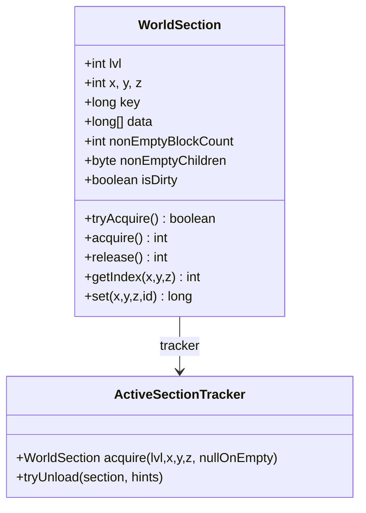
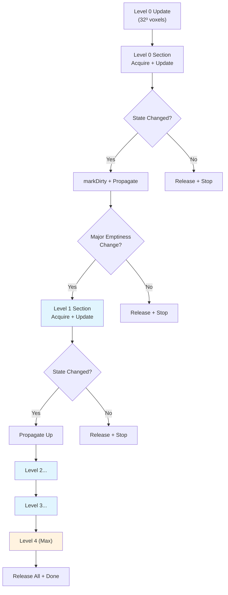
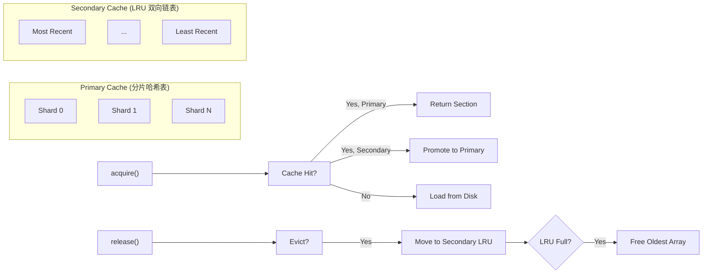
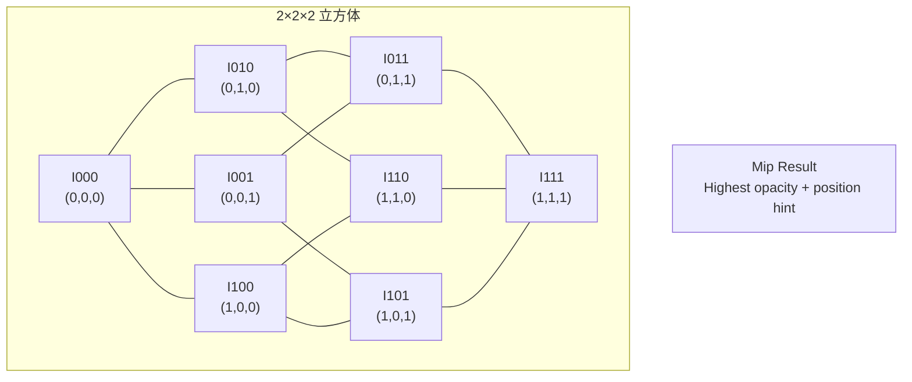
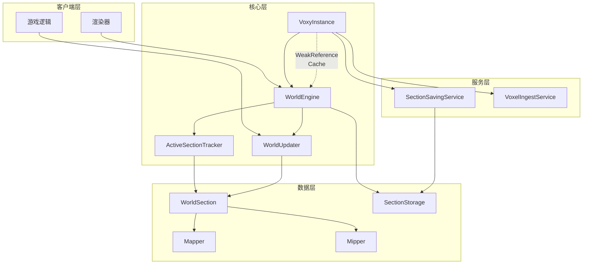

> 本文档基于 Voxy 模组 v0.2.13-alpha (MC 1.21.11) 源码分析，致谢原作者 Cortex 及其贡献者。

## 目录

- [概述](#概述)
- [WorldSection：32³ LOD 数据容器](#worldsection32³-lod-数据容器)
- [WorldEngine：世界引擎核心](#worldengine世界引擎核心)
- [WorldUpdater：LOD 更新传播](#worldupdaterlod-更新传播)
- [ActiveSectionTracker：双层 LRU 缓存](#activesectiontracker双层-lru-缓存)
- [Mapper：BlockState/Biome ID 映射](#mapperblockstatebiome-id-映射)
- [Mipper：LOD 层压缩算法](#mipperlod-层压缩算法)
- [VoxyInstance：世界生命周期管理](#voxyinstance世界生命周期管理)
- [系统交互关系图](#系统交互关系图)

---

## 概述

Voxy 的世界引擎是一个支持多级 LOD（Level of Detail）的区块数据管理系统。与原版 Minecraft 使用 16×16×16 的 chunk section 不同，Voxy 使用 **32×32×32** 的大尺寸 section，配合 0-4 五级 LOD 层，实现高效的远距离渲染和世界数据压缩。

核心设计目标：
- **内存效率**：通过多级 LOD 减少远距离渲染所需的数据量
- **并发安全**：使用 VarHandle 和 StampedLock 保证线程安全
- **持久化**：支持 Section 级别的懒加载和保存
- **缓存优化**：双层 LRU 缓存减少磁盘 IO

---

## WorldSection：32³ LOD 数据容器

`WorldSection` 是世界数据的基本存储单元，每个 section 覆盖 32×32×32 = 32768 个体素。

### 数据编码格式

每个体素用 37 bits 编码，存储在一个 `long[] data` 数组中：

```startLine:52:src/main/java/me/cortex/voxy/common/world/WorldSection.java
    long metadata;
    long[] data = null;
    volatile int nonEmptyBlockCount = 0;//Note: only needed for level 0 sections
    volatile byte nonEmptyChildren;
```

编码布局：

```
┌──────────────────────────────────────────────────────────────────┐
│ 63-56 (8 bits)  │  55-47 (9 bits)  │  46-27 (20 bits)  │ 26-0    │
├──────────────────┼──────────────────┼───────────────────┼─────────┤
│ light            │ biome            │ block             │ unused  │
│ 亮度             │ 生物群系          │ 方块状态          │         │
└──────────────────────────────────────────────────────────────────┘
```

- **light (8 bits)**：光照等级，包括方块光（4 bits）和天空光（4 bits）
- **biome (9 bits)**：生物群系 ID，支持最多 512 种生物群系
- **block (20 bits)**：方块状态 ID，支持最多约 100 万种方块状态

### 非空状态追踪

```startLine:243:src/main/java/me/cortex/voxy/common/world/WorldSection.java
    //Updates this.nonEmptyChildren atomically with respect to the child passed in
    // returns 0 if no change, 1 if it just updated and didnt do a major state change, 2 if it was a major state change (something -> nothing, nothing -> something)
    public int updateEmptyChildState(WorldSection child) {
        int childIdx = getChildIndex(child.x, child.y, child.z);
        byte msk = (byte) (1<<childIdx);
        byte prev, next;
        do {
            prev = this.getNonEmptyChildren();
            next = (byte) ((prev&(~msk))|(child.getNonEmptyChildren()!=0?msk:0));
        } while (!NON_EMPTY_CHILD_HANDLE.compareAndSet(this, prev, next));

        return ((prev!=0)^(next!=0))?2:(prev!=next?1:0);
    }
```

- `nonEmptyBlockCount`：仅 Level 0 使用，统计非空气方块数量
- `nonEmptyChildren`：8-bit mask，标识 8 个子 section 是否为空（用于快速排除检测）

### 引用计数机制

WorldSection 使用原子变量 `atomicState` 实现引用计数：

```startLine:95:src/main/java/me/cortex/voxy/common/world/WorldSection.java
    public boolean tryAcquire() {
        int prev, next;
        do {
            prev = (int) ATOMIC_STATE_HANDLE.get(this);
            if ((prev&1) == 0) {
                //The object has been released so early exit
                return false;
            }
            next = prev + 2;
        } while (!ATOMIC_STATE_HANDLE.compareAndSet(this, prev, next));
        return (next&1) != 0;
    }
```

- 最低位（bit 0）：加载标志位，0 = 已释放，1 = 已加载
- 其余位：引用计数（每 acquire +2，每次 release -2）

### 数组复用缓存

```startLine:38:src/main/java/me/cortex/voxy/common/world/WorldSection.java
    //TODO: should make it dynamically adjust the size allowance based on memory pressure/WorldSection allocation rate (e.g. is it doing a world import)
    private static final int ARRAY_REUSE_CACHE_SIZE = 400;//500;//32*32*32*8*ARRAY_REUSE_CACHE_SIZE == number of bytes
    private static final AtomicInteger ARRAY_REUSE_CACHE_COUNT = new AtomicInteger(0);
    private static final ConcurrentLinkedDeque<long[]> ARRAY_REUSE_CACHE = new ConcurrentLinkedDeque<>();
```

WorldSection 复用 `long[]` 数组而非每次新建，减少 GC 压力。数组大小为 32³ = 32768 longs。

### Mermaid 图：WorldSection 结构



---

## WorldEngine：世界引擎核心

`WorldEngine` 是管理世界数据的主类，协调 LOD 层、Section 追踪器和持久化存储。

### 核心字段

```startLine:14:src/main/java/me/cortex/voxy/common/world/WorldEngine.java
public class WorldEngine {
    public static final int MAX_LOD_LAYER = 4;

    public static final int UPDATE_TYPE_BLOCK_BIT = 1;
    public static final int UPDATE_TYPE_CHILD_EXISTENCE_BIT = 2;
    public static final int UPDATE_TYPE_DONT_SAVE = 4;
    public static final int DEFAULT_UPDATE_FLAGS = UPDATE_TYPE_BLOCK_BIT | UPDATE_TYPE_CHILD_EXISTENCE_BIT;

    public interface ISectionChangeCallback {void accept(WorldSection section, int updateFlags, int neighborMsk);}
    public interface ISectionSaveCallback {void save(WorldEngine engine, WorldSection section, boolean nonBlocking);}

    private final TrackedObject thisTracker = TrackedObject.createTrackedObject(this);

    public final SectionStorage storage;
    private final Mapper mapper;
    private final ActiveSectionTracker sectionTracker;
```

### Section ID 编码

```startLine:91:src/main/java/me/cortex/voxy/common/world/WorldEngine.java
    //TODO: Fixme/optimize, cause as the lvl gets higher, the size of x,y,z gets smaller so i can dynamically compact the format
    // depending on the lvl, which should optimize colisions and whatnot
    public static long getWorldSectionId(int lvl, int x, int y, int z) {
        return ((long)lvl<<60)|((long)(y&0xFF)<<52)|((long)(z&((1<<24)-1))<<28)|((long)(x&((1<<24)-1))<<4);//NOTE: 4 bits spare for whatever
    }
```

64-bit Section ID 布局：
- bits 60-63：LOD level (0-4)
- bits 52-59：Y 坐标
- bits 28-51：Z 坐标
- bits 4-27：X 坐标
- bits 0-3：预留

### LOD 层级映射

| Level | Section 大小 | 覆盖体素数 | 用途 |
|-------|-------------|-----------|------|
| 0 | 32³ | 32³ | 最高细节，近距离渲染 |
| 1 | 32³ | 64³ | 1:8 压缩 |
| 2 | 32³ | 128³ | 1:64 压缩 |
| 3 | 32³ | 256³ | 1:512 压缩 |
| 4 | 32³ | 512³ | 最低细节，远距离地平线 |

每个 LOD 层的一个 section 覆盖 2^(lvl+1) 个 Level 0 sections。

---

## WorldUpdater：LOD 更新传播

`WorldUpdater` 负责将 Level 0 的体素更新**向上传播**到所有 LOD 层。

### 传播算法

```startLine:13:src/main/java/me/cortex/voxy/common/world/WorldUpdater.java
    //NOTE: THIS RUNS ON THE THREAD IT WAS EXECUTED ON, when this method exits, the calling method may assume that VoxelizedSection is no longer needed
    public static void insertUpdate(WorldEngine into, VoxelizedSection section) {//TODO: add a bitset of levels to update and if it should force update
        if (!into.isLive) throw new IllegalStateException("World is not live");
        boolean shouldCheckEmptiness = false;
        WorldSection previousSection = null;
        for (int lvl = 0; lvl <= MAX_LOD_LAYER; lvl++) {
            var worldSection = into.acquire(lvl, section.x >> (lvl + 1), section.y >> (lvl + 1), section.z >> (lvl + 1));
```

核心流程：

1. **循环遍历 0-4 级 LOD**：对每个层级计算对应的 section 坐标
2. **状态变更检测**：`insertSectionLvlIntoWorld` 返回是否有实际变更
3. **空虚状态传播**：如果子 section 发生"全空↔非空"的重大变化，需要继续向上传播

### 坐标计算

```startLine:97:src/main/java/me/cortex/voxy/common/world/WorldUpdater.java
        final int msk = (1<<(lvl+1))-1;
        final int bx = (section.x&msk)<<(4-lvl);
        final int by = (section.y&msk)<<(4-lvl);
        final int bz = (section.z&msk)<<(4-lvl);
```

对于每个 LOD 层，数据在 `long[] data` 中的偏移位置不同：
- Level 0：每个体素占 1 个 entry
- Level 1：每 2³=8 个体素合并为 1 个 entry
- Level N：每 2^(N+1)³ 个体素合并为 1 个 entry

### Mermaid 图：LOD 传播流程



---

## ActiveSectionTracker：双层 LRU 缓存

`ActiveSectionTracker` 实现了高效的 Section 加载/卸载策略，采用双层缓存设计。

### 缓存架构

```startLine:37:src/main/java/me/cortex/voxy/common/world/ActiveSectionTracker.java
    private final AtomicInteger loadedSections = new AtomicInteger();
    private final Long2ObjectOpenHashMap<VolatileHolder<WorldSection>>[] loadedSectionCache;
    private final StampedLock[] locks;
    private final SectionLoader loader;

    private final int lruSize;
    private final StampedLock lruLock = new StampedLock();
    private final Long2ObjectLinkedOpenHashMap<WorldSection> lruSecondaryCache;//TODO: THIS NEEDS TO BECOME A GLOBAL STATIC CACHE
```

- **第一层**：分片哈希表 `loadedSectionCache[]`（默认 64 个分片），存储当前加载的 sections
- **第二层**：`lruSecondaryCache` 双向链表 LRU，存储已卸载但保留数据的 sections

### 分片锁优化

```startLine:75:src/main/java/me/cortex/voxy/common/world/ActiveSectionTracker.java
    public WorldSection acquire(long key, boolean nullOnEmpty) {
        int index = this.getCacheArrayIndex(key);
        var cache = this.loadedSectionCache[index];
        final var lock = this.locks[index];
        // ...
        {
            long stamp = lock.readLock();
            holder = cache.get(key);
            if (holder != null) {//Return already loaded entry
                section = holder.obj;
                if (section != null) {
                    section.acquire();
                    lock.unlockRead(stamp);
                    return section;
                }
```

使用 `StampedLock` 的读锁优化并发读操作，减少锁竞争。

### 卸载策略

```startLine:207:src/main/java/me/cortex/voxy/common/world/ActiveSectionTracker.java
    void tryUnload(WorldSection section, int hints) {
        if (section.isDirty&&this.engine!=null) {
            if (section.tryAcquire()) {
                if (section.setNotDirty()) {//If the section is dirty we must enqueue for saving
                    this.engine.saveSection(section);//can block
                }
                section.release(false, hints);//Special
            }
        }

        if (section.getRefCount() != 0) {
            return;
        }
        // ... remove from primary cache and add to secondary cache ...
```

卸载时：
1. 若 section 为脏，先保存到磁盘
2. 引用计数为 0 时，从主缓存移除
3. 添加到二级 LRU 缓存（保留 data 数组）
4. LRU 缓存超限时，释放最旧的数组

### Mermaid 图：双层 LRU 缓存



---

## Mapper：BlockState/Biome ID 映射

`Mapper` 负责将 Minecraft 的 BlockState 和 Biome 对象映射到紧凑的整数 ID。

### 双映射表设计

```startLine:42:src/main/java/me/cortex/voxy/common/world/other/Mapper.java
    private final IMappingStorage storage;
    public static final long UNKNOWN_MAPPING = -1;
    public static final long AIR = 0;

    private final ReentrantLock blockLock = new ReentrantLock();
    private final ConcurrentHashMap<BlockState, StateEntry> block2stateEntry = new ConcurrentHashMap<>(2000,0.75f, 10);
    private final ObjectArrayList<StateEntry> blockId2stateEntry = new ObjectArrayList<>();


    private final ReentrantLock biomeLock = new ReentrantLock();
    private final ConcurrentHashMap<String, BiomeEntry> biome2biomeEntry = new ConcurrentHashMap<>(2000,0.75f, 10);
    private final ObjectArrayList<BiomeEntry> biomeId2biomeEntry = new ObjectArrayList<>();
```

- `block2stateEntry`：HashMap 用于快速查找（State → ID）
- `blockId2stateEntry`：ArrayList 用于 ID 反查（ID → State）
- 类似结构用于 Biome

### ID 编码与解码

```startLine:68:src/main/java/me/cortex/voxy/common/world/other/Mapper.java
    public static boolean isAir(long id) {
        //Note: air can mean void, cave or normal air, as the block state is remapped during ingesting
        return (id&(((1L<<20)-1)<<27)) == 0;
    }

    public static int getBlockId(long id) {
        return (int) ((id>>27)&((1<<20)-1));
    }

    public static int getBiomeId(long id) {
        return (int) ((id>>47)&0x1FF);
    }

    public static int getLightId(long id) {
        return (int) ((id>>56)&0xFF);
    }
```

解析 64-bit 复合 ID：
- Block ID：bits 27-46（20 bits）
- Biome ID：bits 47-55（9 bits）
- Light ID：bits 56-63（8 bits）

### 动态注册

```startLine:183:src/main/java/me/cortex/voxy/common/world/other/Mapper.java
    private StateEntry registerNewBlockState(BlockState state) {
        this.blockLock.lock();
        var entry = this.block2stateEntry.get(state);
        if (entry != null) {
            this.blockLock.unlock();
            return entry;
        }

        entry = new StateEntry(this.blockId2stateEntry.size(), state);
        this.blockId2stateEntry.add(entry);
        this.block2stateEntry.put(state, entry);
        this.blockLock.unlock();

        byte[] serialized = entry.serialize();
        ByteBuffer buffer = MemoryUtil.memAlloc(serialized.length);
        buffer.put(serialized);
        buffer.rewind();
        this.storage.putIdMapping(entry.id | (BLOCK_STATE_TYPE<<30), buffer);
        MemoryUtil.memFree(buffer);

        if (this.newStateCallback!=null)this.newStateCallback.accept(entry);
        return entry;
    }
```

遇到新的 BlockState 时动态分配 ID，并持久化到存储。

---

## Mipper：LOD 层压缩算法

`Mipper` 实现了将 8 个子体素合并为 1 个父体素的 LOD 压缩算法。

### 压缩策略

```startLine:17:src/main/java/me/cortex/voxy/common/world/other/Mipper.java
    public static long mip(long I000, long I100, long I001, long I101,
                           long I010, long I110, long I011, long I111,
                          Mapper mapper) {
        // 8 个输入：对应 2×2×2 立方体的 8 个角点
        // Ixyz: x=X, y=Y, z=Z 位置的体素

        int max = -1;

        // 选择不透明度的体素（优先选择顶角/表面体素）
        if (!Mapper.isAir(I111)) {
            max = (mapper.getBlockStateOpacity(I111)<<4)|0b111;
        }
        if (!Mapper.isAir(I110)) {
            max = Math.max((mapper.getBlockStateOpacity(I110)<<4)|0b110, max);
        }
        // ... 对其余 6 个角点做类似处理 ...
```

### 选择逻辑

1. **优先非空气体素**：空气（AIR = 0）不会遮挡视线
2. **基于不透明度**：使用 `BlockState.getLightBlock()` 作为不透明度的近似
3. **角点位优先**：当不透明度相同时，优先选择较高/较远的角点（模拟从上方俯视的视角）
4. **光照平均**：若 8 个体素全为空气，则平均所有光照值

```startLine:73:src/main/java/me/cortex/voxy/common/world/other/Mipper.java
        } else {
            // All air, average the light levels
            int blockLight = (Mapper.getLightId(I000) & 0xF0) + ... + (Mapper.getLightId(I111) & 0xF0);
            int skyLight = (Mapper.getLightId(I000) & 0x0F) + ... + (Mapper.getLightId(I111) & 0x0F);
            blockLight = blockLight / 8;
            skyLight = (int) Math.ceil((double) skyLight / 8);

            return withLight(I111, (blockLight << 4) | skyLight);
        }
```

### 角点位编码



---

## VoxyInstance：世界生命周期管理

`VoxyInstance` 是整个 Voxy 系统的顶层抽象，管理多个 WorldEngine 实例的生命周期。

### 世界缓存策略

```startLine:92:src/main/java/me/cortex/voxy/common/voxy/VoxyInstance.java
    public WorldEngine getNullable(WorldIdentifier identifier) {
        var cache = identifier.cachedEngineObject;
        WorldEngine world;
        if (cache == null) {
            world = null;
        } else {
            world = cache.get();
            if (world == null) {
                identifier.cachedEngineObject = null;
            } else {
                if (world.isLive()) {
                    //Successful cache hit
                } else {
                    identifier.cachedEngineObject = null;
                    world = null;
                }
            }
        }
```

使用 `WeakReference` 缓存 WorldEngine，允许 GC 在内存压力时自动回收。

### 空闲世界清理

```startLine:41:src/main/java/me/cortex/voxy/common/voxy/VoxyInstance.java
        this.worldCleaner = new Thread(()->{
            try {
                while (this.isRunning) {
                    Thread.sleep(1000);
                    this.cleanIdle();
                }
            } catch (InterruptedException e) {
                //We are exiting, so just exit
            }
        });
        this.worldCleaner.setPriority(Thread.MIN_PRIORITY);
        this.worldCleaner.setName("Active world cleaner");
        this.worldCleaner.setDaemon(true);
        this.worldCleaner.start();
```

后台线程每 10 秒检查一次空闲世界：
- `isWorldIdle()`：当 refCount = 0 且无加载的 sections，且超过 10 秒未活动
- 满足条件则调用 `world.free()` 释放资源

### 服务线程池

```startLine:24:src/main/java/me/cortex/voxy/common/voxy/VoxyInstance.java
    public final BooleanSupplier savingServiceRateLimiter;//Can run if this returns true
    protected final UnifiedServiceThreadPool threadPool;
    protected final SectionSavingService savingService;
    protected final VoxelIngestService ingestService;
```

- `savingService`：异步保存 dirty sections
- `ingestService`：处理世界导入/ voxelization
- `savingServiceRateLimiter`：限制保存队列最大 1200 个任务

---

## 系统交互关系图



---

## 关键设计决策总结

| 设计点 | 实现方式 | 优势 |
|--------|----------|------|
| Section 大小 | 32³ | 平衡内存占用与批量处理效率 |
| LOD 层数 | 5 层 (0-4) | 覆盖 32³ 到 512³ 的完整距离范围 |
| 数据编码 | 37 bits/voxel | 紧凑存储，支持超百万方块状态 |
| 并发控制 | VarHandle + StampedLock | 高效无锁读，写锁分片优化 |
| 缓存策略 | 双层 LRU | 热数据在内存，冷数据保留数组复用 |
| 引用计数 | atomicState 位操作 | 零额外开销的精确引用追踪 |

---

## 课后自查

1. **Section ID 编码**：解释 `getWorldSectionId()` 如何在 64 位中编码 lvl, x, y, z
2. **LOD 传播**：为什么 `shouldCheckEmptiness` 在检测到"重大空虚状态变化"时才向上传播？
3. **缓存一致性**：当 `tryUnload()` 发现 section 为脏时，为什么先调用 `saveSection()` 再释放？
4. **Mipper 选择**：如果 8 个子体素都是非空气但不透明度相同，Mipper 如何选择？
5. **弱引用缓存**：为什么 `VoxyInstance` 使用 `WeakReference` 而非普通引用缓存 WorldEngine？
