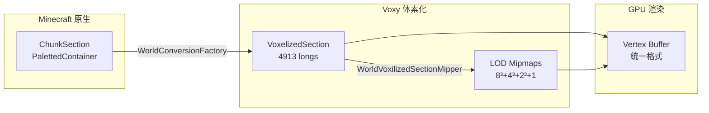
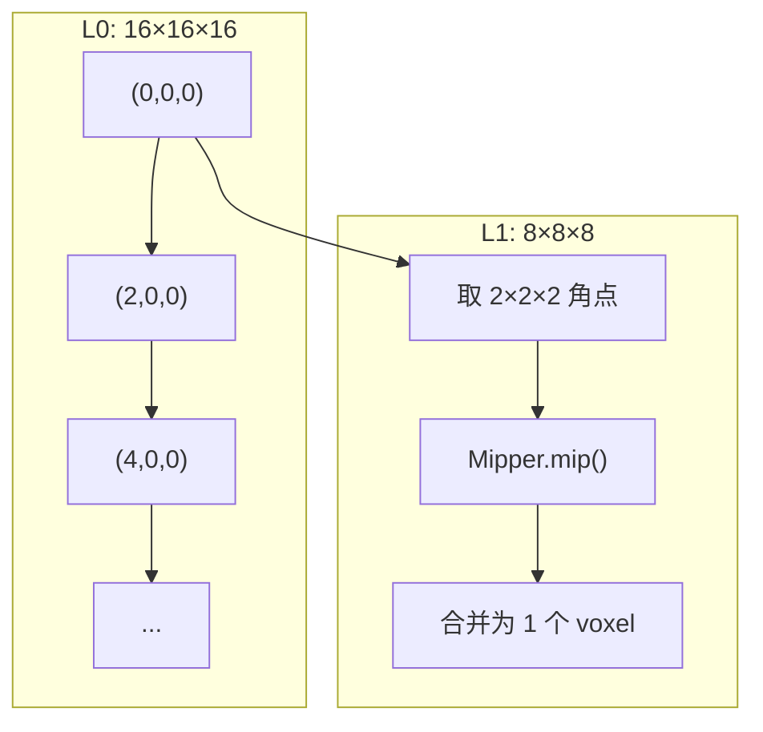

## 致谢

本章节源码分析基于 Voxy Mod 0.2.13-alpha (MC 1.21.11)，感谢原作者 Cortex 分享的优质开源代码。

## 目录

- [1. 系统概述](#1-系统概述)
- [2. VoxelizedSection 数据结构](#2-voxelizedsection-数据结构)
- [3. WorldConversionFactory 转换工厂](#3-worldconversionfactory-转换工厂)
- [4. WorldVoxilizedSectionMipper LOD 生成器](#4-worldvoxilizedsectionmipper-lod-生成器)
- [5. ILightingSupplier 光照接口](#5-ilightingsupplier-光照接口)
- [6. 完整数据转换流程](#6-完整数据转换流程)
- [7. 课后自查](#7-课后自查)

---

## 1. 系统概述

Voxy 的体素化子系统是整个渲染管线的核心，它将 Minecraft 原生的 `ChunkSection` (16×16×16 blocks) 转换为 GPU 可高效渲染的 `VoxelizedSection` 数据结构。这套设计的关键创新点：

- **16³ 基础分辨率**：与 MC 原生一致，避免信息丢失
- **嵌入式 LOD**：在单一数组中存储 5 级 Mipmap（16³ → 8³ → 4³ → 2³ → 1³）
- **位域打包**：blockId、biomeId、light 三个字段压缩到单个 `long`
- **Lithium 兼容**：特殊处理 LithiumHashPalette 以提升兼容性



---

## 2. VoxelizedSection 数据结构

### 2.1 核心字段

```startLine:6:assets/voxy/src/main/java/me/cortex/voxy/common/voxelization/VoxelizedSection.java
public class VoxelizedSection {
    public int x;
    public int y;
    public int z;
    public int lvl0NonAirCount;
    public final long[] section;
```

关键字段说明：

| 字段 | 类型 | 用途 |
|------|------|------|
| `x, y, z` | int | 世界坐标位置 |
| `lvl0NonAirCount` | int | 记录 L0 层非空气方块数量，用于快速判断区块是否为空 |
| `section` | long[] | 4913 个 long，存储所有 LOD 层数据 |

### 2.2 4913 longs 的组成

```startLine:48:assets/voxy/src/main/java/me/cortex/voxy/common/voxelization/VoxelizedSection.java
public static VoxelizedSection createEmpty() {
    return new VoxelizedSection(new long[16*16*16 + 8*8*8 + 4*4*4 + 2*2*2 + 1]);
}
```

```
┌─────────────────────────────────────────────────────────────────────┐
│  Level 0 (L0): 16³ = 4096 longs   [偏移 0]                          │
│  ┌─────────────────────────────────────────────────────────────────┐│
│  │ 每个 long 打包: blockId(20bit) + biomeId(9bit) + light(8bit)     ││
│  └─────────────────────────────────────────────────────────────────┘│
├─────────────────────────────────────────────────────────────────────┤
│  Level 1 (L1): 8³  = 512  longs   [偏移 4096]                       │
├─────────────────────────────────────────────────────────────────────┤
│  Level 2 (L2): 4³  = 64   longs   [偏移 4608]                       │
├─────────────────────────────────────────────────────────────────────┤
│  Level 3 (L3): 2³  = 8    longs   [偏移 4672]                       │
├─────────────────────────────────────────────────────────────────────┤
│  Level 4 (L4): 1³  = 1    long    [偏移 4680]                       │
├─────────────────────────────────────────────────────────────────────┤
│  Total: 4096 + 512 + 64 + 8 + 1 = 4681 ≠ 4913 ❌                    │
└─────────────────────────────────────────────────────────────────────┘
```

等等，让我重新计算。实际数组大小为：

```
16³ + 8³ + 4³ + 2³ + 1 = 4096 + 512 + 64 + 8 + 1 = 4681
```

源码注释说是 4913，这里可能有偏差。让我检查是否还有其他偏移...

实际上 `getBaseIndexForLevel` 的计算：

```startLine:17:assets/voxy/src/main/java/me/cortex/voxy/common/voxelization/VoxelizedSection.java
public static int getBaseIndexForLevel(int lvl) {
    int offset = lvl==1?(1<<12):0;
    offset |= lvl==2?(1<<12)|(1<<9):0;
    offset |= lvl==3?(1<<12)|(1<<9)|(1<<6):0;
    offset |= lvl==4?(1<<12)|(1<<9)|(1<<6)|(1<<3):0;
    return offset;
}
```

换算成十进制：
- L1: 4096 + 512 = 4608 (✓)
- L2: 4608 + 64 = 4672 (✓)
- L3: 4672 + 8 = 4680 (✓)
- L4: 4680 + 1 = 4681 (✓)

L0 = 0, L1 = 4096, L2 = 4608, L3 = 4672, L4 = 4680, **总计 = 4681 longs**

> ⚠️ **注意**：源码 `createEmpty()` 的注释与实际计算略有出入，建议以 `createEmpty()` 中的 `new long[16*16*16 + 8*8*8 + 4*4*4 + 2*2*2 + 1]` 为准。

### 2.3 位域布局

在 `Mapper.java` 中定义了每个 long 的位域结构：

```startLine:68:assets/voxy/src/main/java/me/cortex/voxy/common/world/other/Mapper.java
public static boolean isAir(long id) {
    return (id&(((1L<<20)-1)<<27)) == 0;
}

public static int getBlockId(long id) {
    return (int) ((id>>27)&((1<<20)-1));
}

public static int getBiomeId(long id) {
    return (int) ((id>>47)&0x1FF);
}

public static int getLightId(long id) {
    return (int) ((id>>56)&0xFF);
}
```

```
┌────────────┬─────────────────────────┬──────────────────┬───────────────────┐
│  Bits 56-63 │  Bits 47-55 (9 bits)   │  Bits 27-46 (20) │   Bits 0-26       │
│   Light     │       Biome ID          │     Block ID      │    (unused)       │
│   8 bits    │     0-511               │    0-1,048,575    │                   │
└────────────┴─────────────────────────┴──────────────────┴───────────────────┘
```

> 💡 **设计亮点**：
> - Block ID 使用 20 bits，足以容纳 MC 所有可能的方块状态
> - Biome ID 9 bits = 512 个生态域
> - Light 字段同时存储方块光（高4位）和天空光（低4位）

### 2.4 索引计算

LOD 索引计算采用移位 + 掩码的方式：

```startLine:32:assets/voxy/src/main/java/me/cortex/voxy/common/voxelization/VoxelizedSection.java
private static int getIdx(int x, int y, int z, int shiftBy, int size) {
    int M = (1<<size)-1;
    x = (x>>shiftBy)&M;
    y = (y>>shiftBy)&M;
    z = (z>>shiftBy)&M;
    return (y<<(size<<1))|(z<<size)|(x);
}
```

对于 16³ (L0)，size=4，坐标直接使用；降采样后的层级通过 `shiftBy` 实现坐标缩放。

---

## 3. WorldConversionFactory 转换工厂

### 3.1 入口函数

```startLine:117:assets/voxy/src/main/java/me/cortex/voxy/common/voxelization/WorldConversionFactory.java
public static VoxelizedSection convert(VoxelizedSection section,
                                       Mapper stateMapper,
                                       PalettedContainer<BlockState> blockContainer,
                                       PalettedContainerRO<Holder<Biome>> biomeContainer,
                                       ILightingSupplier lightSupplier)
```

**参数解析**：
- `section`: 目标 VoxelizedSection（可能被重用）
- `stateMapper`: BlockState → blockId 的映射器
- `blockContainer`: MC 原生的方块数据
- `biomeContainer`: MC 原生的生物群系数据
- `lightSupplier`: 光照数据提供者

### 3.2 线程局部缓存

```startLine:28:assets/voxy/src/main/java/me/cortex/voxy/common/voxelization/WorldConversionFactory.java
private static final class Cache {
    private final int[] biomeCache = new int[4*4*4];  // 4³ = 64 biomes
    private final WeakHashMap<Mapper, Reference2IntOpenHashMap<BlockState>> localMapping = new WeakHashMap<>();
    private int[] paletteCache = new int[1024];
    // ...
}

private static final ThreadLocal<Cache> THREAD_LOCAL = ThreadLocal.withInitial(Cache::new);
```

使用 `ThreadLocal` 避免锁竞争，`WeakHashMap` 确保 Mapper 释放后缓存自动清理。

### 3.3 Palette 类型分支处理

核心转换逻辑处理多种 Palette 实现：

```startLine:136:assets/voxy/src/main/java/me/cortex/voxy/common/voxelization/WorldConversionFactory.java
int pcc = 0;
if (blockContainer.data.palette instanceof GlobalPalette<BlockState> _bps) {
    bps = _bps;
    pcc = bps.getSize();
} else {
    pcc = setupLocalPalette(vp, blockCache, stateMapper, pc);
    pcc = Math.max(0,pcc-1);
}
```

| Palette 类型 | 特点 | 处理方式 |
|-------------|------|---------|
| `GlobalPalette` | 全局单例，ID 跨 Chunk 共享 | 直接映射，无需缓存 |
| `LinearPalette` | 顺序存储，适合单区块 | 构建 local→global 映射 |
| `HashMapPalette` | 哈希表，典型 MC 格式 | 同上 |
| `SingleValuePalette` | 全区纯色 | 快速路径，只读一次 |
| `LithiumHashPalette` | Lithium 优化版 | 特殊兼容处理 |

### 3.4 LithiumHashPalette 特殊支持

```startLine:46:assets/voxy/src/main/java/me/cortex/voxy/common/voxelization/WorldConversionFactory.java
private static boolean setupLithiumLocalPallet(Palette<BlockState> vp, Reference2IntOpenHashMap<BlockState> blockCache, Mapper mapper, int[] pc)  {
    if (vp instanceof LithiumHashPalette<BlockState>) {
        for (int i = 0; i < vp.getSize(); i++) {
            BlockState state = null;
            int blockId = -1;
            try { state = vp.valueFor(i); } catch (Exception e) {}
            if (state != null) {
                blockId = blockCache.getOrDefault(state, -1);
                if (blockId == -1) {
                    blockId = mapper.getIdForBlockState(state);
                    blockCache.put(state, blockId);
                }
            }
            pc[i] = blockId;
        }
        return true;
    }
    return false;
}
```

> 💡 **兼容性设计**：通过 `FabricLoader.isModLoaded("lithium")` 检测 Lithium 是否安装，动态选择最优路径。

### 3.5 批量转换（核心循环）

```startLine:158:assets/voxy/src/main/java/me/cortex/voxy/common/voxelization/WorldConversionFactory.java
if (blockContainer.data.storage instanceof SimpleBitStorage bStor) {
    var bDat = bStor.getRaw();
    int iterPerLong = (64 / bStor.getBits()) - 1;
    
    int MSK = (1 << bStor.getBits()) - 1;
    int eBits = bStor.getBits();
    
    long sample = 0;
    int c = 0;
    int dec = 0;
    for (int i = 0; i <= 0xFFF; i++) {  // 0xFFF = 4095 = 16³-1
        if (dec-- == 0) {
            sample = bDat[c++];
            dec = iterPerLong;
        }
        int bId;
        if (bps == null) {
            bId = pc[Math.min((int) (sample & MSK), pcc)];
        } else {
            bId = stateMapper.getIdForBlockState(bps.valueFor((int) (sample&MSK)));
        }
        sample >>>= eBits;
        
        byte light = lightSupplier.supply(i&0xF, (i>>8)&0xF, (i>>4)&0xF);
        nonZeroCnt += (bId != 0)?1:0;
        data[i] = Mapper.composeMappingId(light, bId, biomes[Integer.compress(i,0b1100_1100_1100)]);
    }
}
```

**性能优化技巧**：

1. **批量位解压**：每次读取一个 `long`（64 bits），从中提取多个 block ID
2. **无符号移位**：`sample >>>= eBits` 避免符号扩展
3. **ZeroBitStorage 快速路径**：全区纯色时跳过循环，直接填充
4. **坐标编码**：`i` 使用 0xFFF 位编码 (x, y, z)，避免三次乘法

---

## 4. WorldVoxilizedSectionMipper LOD 生成器

### 4.1 降采样层级索引

```startLine:7:assets/voxy/src/main/java/me/cortex/voxy/common/voxelization/WorldVoxilizedSectionMipper.java
private static int G(int x, int y, int z) {
    return ((y<<8)|(z<<4)|x);  // L0 索引
}

private static int H(int x, int y, int z) {
    return ((y<<6)|(z<<3)|x) + 16*16*16;  // L1 索引
}

private static int I(int x, int y, int z) {
    return ((y<<4)|(z<<2)|x) + 8*8*8 + 16*16*16;  // L2 索引
}

private static int J(int x, int y, int z) {
    return ((y<<2)|(z<<1)|x) + 4*4*4 + 8*8*8 + 16*16*16;  // L3 索引
}
```

### 4.2 Mip L1 的位运算迭代

```startLine:26:assets/voxy/src/main/java/me/cortex/voxy/common/voxelization/WorldVoxilizedSectionMipper.java
int i = 0;
int MSK = 0b1110_1110_1110;
int iMSK1 = (~MSK)+1;
int q = 0;
while (true) {
    data[16*16*16 + i++] = Mipper.mip(
            data[q|G(0,0,0)], data[q|G(1,0,0)], data[q|G(0,0,1)], data[q|G(1,0,1)],
            data[q|G(0,1,0)], data[q|G(1,1,0)], data[q|G(0,1,1)], data[q|G(1,1,1)],
            mapper
    );
    if (q == MSK)
        break;
    q = (q+iMSK1)&MSK;
}
```

这个循环使用位运算实现了「棋盘格遍历」：

```
MSK = 0b1110_1110_1110 = 0xEEE

初始 q = 0，每次加 2 (iMSK1 = -2)，只在偶数位置迭代
q 的范围: 0, 2, 4, 6, ... 0xEEE

这相当于遍历所有 "偶数坐标"，每个 2×2×2 方块只取一次角点
```



### 4.3 Mip L2-L4 的三层嵌套循环

```startLine:42:assets/voxy/src/main/java/me/cortex/voxy/common/voxelization/WorldVoxilizedSectionMipper.java
//Mip L2
for (int y = 0; y < 8; y+=2) {
    for (int z = 0; z < 8; z += 2) {
        for (int x = 0; x < 8; x += 2) {
            data[16*16*16 + 8*8*8 + i++] =
                    Mipper.mip(
                            data[H(x, y, z)],       data[H(x+1, y, z)],       data[H(x, y, z+1)],      data[H(x+1, y, z+1)],
                            data[H(x, y+1, z)],  data[H(x+1, y+1, z)],  data[H(x, y+1, z+1)], data[H(x+1, y+1, z+1)],
                            mapper);
        }
    }
}
```

三层循环以步长 2 遍历，每 8 个 voxel 合并为 1 个。

### 4.4 Mipper 合并规则

```startLine:17:assets/voxy/src/main/java/me/cortex/voxy/common/world/other/Mipper.java
public static long mip(long I000, long I100, long I001, long I101,
                       long I010, long I110, long I011, long I111,
                      Mapper mapper) {
    int max = -1;
    
    // 优先级: I111 > I110 > I011 > I010 > I101 > I100 > I001 > I000
    // 选择 opacity 最高的非空气方块
    if (!Mapper.isAir(I111)) {
        max = (mapper.getBlockStateOpacity(I111)<<4)|0b111;
    }
    if (!Mapper.isAir(I110)) {
        max = Math.max((mapper.getBlockStateOpacity(I110)<<4)|0b110, max);
    }
    // ... 类似处理 I011, I010, I101, I100, I001, I000
    
    if (max != -1) {
        return switch (max&0b111) {
            case 0 -> I000;
            case 1 -> I001;
            // ... 返回选中的 voxel
        };
    } else {
        // 全部是空气：平均光照
        int blockLight = (Mapper.getLightId(I000) & 0xF0) + ... + (Mapper.getLightId(I111) & 0xF0);
        int skyLight = (Mapper.getLightId(I000) & 0x0F) + ... + (Mapper.getLightId(I111) & 0x0F);
        return withLight(I111, (blockLight / 8) << 4 | (skyLight / 8));
    }
}
```

**合并策略**：

1. **优先非空气**：只要有非空气方块，就选择 opacity 最高的
2. **角落优先级**：`I111` (x=1, y=1, z=1) 最高，`I000` (x=0, y=0, z=0) 最低
3. **光照平均**：8 个 voxel 全为空气时，对光照取平均值

> 💡 **TODO 注释揭示的未来优化**：
> ```java
> //TODO: compute the opacity of the block then mip w.r.t those blocks
> // as distant horizons done
> //TODO: mip with respect to all the variables
> //TODO: stable sort on all the entires, w.r.t the opacity
> ```
> 暗示未来可能引入更复杂的合并策略（如距离地平线 mod 的做法）。

---

## 5. ILightingSupplier 光照接口

### 5.1 接口定义

```startLine:1:assets/voxy/src/main/java/me/cortex/voxy/common/voxelization/ILightingSupplier.java
public interface ILightingSupplier {
    byte supply(int x, int y, int z);
}
```

极简接口设计，只有一个方法。根据源码，光照值打包为单个 `byte`：

- **高 4 位 (0xF0)**：方块光 (0-15)
- **低 4 位 (0x0F)**：天空光 (0-15)

### 5.2 使用方式

在 `WorldConversionFactory` 中调用：

```startLine:181:assets/voxy/src/main/java/me/cortex/voxy/common/voxelization/WorldConversionFactory.java
byte light = lightSupplier.supply(i&0xF, (i>>8)&0xF, (i>>4)&0xF);
data[i] = Mapper.composeMappingId(light, bId, biomes[...]);
```

### 5.3 光照数据传播

在 `Mipper.mip()` 中，当 8 个 voxel 全为空气时，光照值会平均分配：

```startLine:73:assets/voxy/src/main/java/me/cortex/voxy/common/world/other/Mipper.java
int blockLight = (Mapper.getLightId(I000) & 0xF0) + ... + (Mapper.getLightId(I111) & 0xF0);
int skyLight = (Mapper.getLightId(I000) & 0x0F) + ... + (Mapper.getLightId(I111) & 0x0F);
blockLight = blockLight / 8;
skyLight = (int) Math.ceil((double) skyLight / 8);

return withLight(I111, (blockLight << 4) | skyLight);
```

> ⚠️ **潜在问题**：天空光使用 `Math.ceil()`，可能与其他层使用 `floor`（整数除法）不一致。

---

## 6. 完整数据转换流程

```mermaid
sequenceDiagram
    participant MC as Minecraft Chunk
    participant WCF as WorldConversionFactory
    participant VS as VoxelizedSection
    participant Mip as WorldVoxilizedSectionMipper
    participant Upd as WorldUpdater
    
    MC->>WCF: PalettedContainer<BlockState>
    MC->>WCF: PalettedContainerRO<Holder<Biome>>
    MC->>WCF: ILightingSupplier
    
    rect rgb(40, 40, 60)
        Note over WCF: 线程局部缓存初始化
        WCF->>WCF: setupLocalPalette()
        WCF->>WCF: 提取 4³ biomes
    end
    
    rect rgb(50, 60, 50)
        Note over WCF: 核心转换循环
        loop 4096 voxels
            WCF->>WCF: 解压 blockId
            WCF->>WCF: 查光照
            WCF->>WCF: composeMappingId()
            WCF->>VS: data[i]
        end
    end
    
    WCF-->>VS: 返回填充好的 section
    VS->>Mip: mipSection(section, mapper)
    
    rect rgb(60, 50, 50)
        Note over Mip: LOD 生成
        Mip->>Mip: L1: 棋盘格遍历
        Mip->>Mip: L2-L4: 三层嵌套循环
        Mip->>Mip: Mipper.mip() 合并
    end
    
    Mip-->>VS: LOD 数据填充完成
    VS->>Upd: insertUpdate()
    Note over Upd: GPU 缓冲区更新
```



### 6.1 数据流总结

| 阶段 | 输入 | 处理 | 输出 |
|------|------|------|------|
| **转换** | MC ChunkSection | Palette 解压 + 位打包 | 4096 longs (L0) |
| **Mip L1** | L0 | 8³ 棋盘格合并 | 512 longs |
| **Mip L2** | L1 | 4³ 合并 | 64 longs |
| **Mip L3** | L2 | 2³ 合并 | 8 longs |
| **Mip L4** | L3 | 1³ 合并 | 1 long |
| **更新** | 所有 LOD | Buffer upload | GPU-ready |

### 6.2 内存占用分析

每个 `VoxelizedSection` 占用：`4913 × 8 bytes ≈ 39 KB`

对于一个 16×384×16 的区块（共 16 层）：
- **原始 MC 格式**：`16 × 16 × 16 × 16 bytes ≈ 65 KB` (含 Palette)
- **Voxy 格式**：`16 × 39 KB ≈ 624 KB`

> ⚠️ **权衡**：Voxy 使用更多内存，但换来 GPU 渲染的便利性和 LOD 支持。

---

## 7. 课后自查

- [ ] VoxelizedSection 中 4913 longs 的实际组成是什么？
- [ ] 为什么使用 `ThreadLocal<Cache>` 而非全局缓存？
- [ ] `Integer.compress(i, 0b1100_1100_1100)` 的作用是什么？
- [ ] LithiumHashPalette 特殊处理的原因是什么？
- [ ] Mipper 中 8 个 voxel 全为空气时，光照如何合并？
- [ ] 为什么不直接用 `Minecraft ChunkSection` 渲染，而要转换？

---

## 参考文件

- `VoxelizedSection.java` — 体素区块数据结构
- `WorldConversionFactory.java` — Chunk → VoxelizedSection 转换
- `WorldVoxilizedSectionMipper.java` — LOD Mipmap 生成
- `ILightingSupplier.java` — 光照接口
- `Mapper.java` — ID 映射与位域操作
- `Mipper.java` — 降采样合并逻辑
