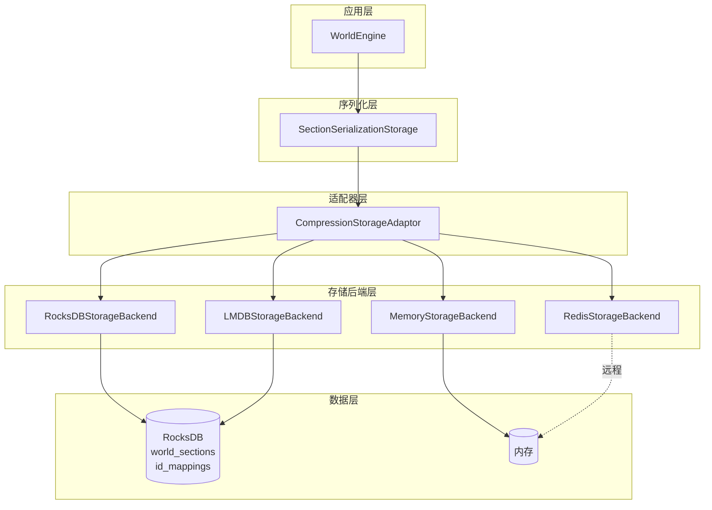
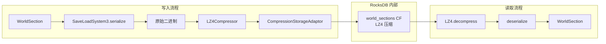

## 致谢

本分析基于 Voxy 模组（v0.2.13-alpha, MC 1.21.11）的开源源码，感谢原作者 Cortex 的贡献。

---

## 目录

- [存储架构总览](#存储架构总览)
- [RocksDB 存储设计](#rocksdb-存储设计)
- [压缩策略分析](#压缩策略分析)
- [存储后端抽象](#存储后端抽象)
- [ID Mapping 持久化](#id-mapping-持久化)
- [小结](#小结)

---

## 存储架构总览

Voxy 的存储子系统采用**分层适配器模式**，允许自由组合不同的存储后端和压缩器。以下是整体架构的 Mermaid 图：



### 关键设计决策

| 组件 | 设计模式 | 职责 |
|------|----------|------|
| `SectionStorage` | 抽象工厂 | 定义 Section 加载/保存接口 |
| `StorageBackend` | 策略模式 | 抽象底层存储操作 |
| `DelegatingStorageAdaptor` | 装饰器模式 | 透明转发请求给委托后端 |
| `CompressionStorageAdaptor` | 装饰器模式 | 在读写时透明加压缩 |

---

## RocksDB 存储设计

`RocksDBStorageBackend` 是 Voxy 的核心持久化实现，基于 Facebook 的 RocksDB 键值存储库。

### Column Family 配置

```19:116:D:\Minecraft-Learning\assets\voxy\src\main\java\me\cortex\voxy\common\config\storage\rocksdb\RocksDBStorageBackend.java
public class RocksDBStorageBackend extends StorageBackend {
    private final RocksDB db;
    private final ColumnFamilyHandle worldSections;
    private final ColumnFamilyHandle idMappings;
    // ...
    public RocksDBStorageBackend(String path) {
        RocksDB.loadLibrary();

        // Column Family 1: world_sections - 无内置压缩（外层处理）
        final ColumnFamilyOptions cfWorldSecOpts = new ColumnFamilyOptions()
                .setCompressionType(CompressionType.NO_COMPRESSION)
                .setCompactionPriority(CompactionPriority.MinOverlappingRatio)
                .setLevelCompactionDynamicLevelBytes(true)
                .optimizeForPointLookup(128);

        // BloomFilter 10 bits 加速点查询
        var bCache = new HyperClockCache(128*1024L*1024L, 0, 4, false);
        var filter = new BloomFilter(10);
        cfWorldSecOpts.setTableFormatConfig(new BlockBasedTableConfig()
                .setCacheIndexAndFilterBlocksWithHighPriority(true)
                .setBlockCache(bCache)
                .setDataBlockHashTableUtilRatio(0.75)
                .setDataBlockIndexType(DataBlockIndexType.kDataBlockBinaryAndHash)
                .setFilterPolicy(filter)
        );

        // Column Family 2: id_mappings - ZSTD 压缩
        final List<ColumnFamilyDescriptor> cfDescriptors = Arrays.asList(
            new ColumnFamilyDescriptor(RocksDB.DEFAULT_COLUMN_FAMILY, cfOpts),
            new ColumnFamilyDescriptor("world_sections".getBytes(), cfWorldSecOpts),
            new ColumnFamilyDescriptor("id_mappings".getBytes(), cfOpts)
        );

        // WAL 128MB 防止数据丢失
        final DBOptions options = new DBOptions()
                .setMaxTotalWalSize(1024*1024*128);
        // ...
    }
```

#### 参数解析

| 参数 | 值 | 说明 |
|------|-----|------|
| `BloomFilter` | 10 bits/entry | 约 0.1% 假阳性率，加速不存在的 key 查询 |
| `HyperClockCache` | 128MB | 索引和过滤器块缓存 |
| `MaxTotalWalSize` | 128MB | Write-Ahead Log 大小上限 |
| `CompactionPriority` | MinOverlappingRatio | 优化顺序 I/O |

### 位置编码 (swizzlePos)

```265:274:D:\Minecraft-Learning\assets\voxy\src\main\java\me\cortex\voxy\common\config\storage\rocksdb\RocksDBStorageBackend.java
    private static long swizzlePos(long key) {
        if (true) {
            return key;  // 当前版本直接返回
        }
        // 预留的位置混淆逻辑，用于优化 RocksDB 范围查询的局部性
        if (WorldEngine.POS_FORMAT_VERSION != 1) throw new IllegalStateException("TODO: UPDATE THIS");
        return  (key&(0xFUL<<60)) |
                Long.expand((key>>> 4)&((1L<<24)-1), 0b01010101010101010101010101010101_001001001001001001001001L) |
                Long.expand((key>>>52)&0xFF,         0b00000000000000000000000000000000_100100100100100100100100L) |
                Long.expand((key>>>28)&((1L<<24)-1), 0b10101010101010101010101010101010_010010010010010010010010L);
    }
```

`swizzlePos` 函数的设计意图是**优化 RocksDB 范围查询的局部性**：
- 将 level、y、x、z 坐标按位交叉排列
- 使得物理相邻的区块在 RocksDB 中也相邻存储
- 当前版本 `if (true)` 跳过了混淆，保留为未来优化空间

### Section Key 格式

Section 的 key 由 `WorldEngine.getWorldSectionId` 生成：

```91:93:D:\Minecraft-Learning\assets\voxy\src\main\java\me\cortex\voxy\common\world\WorldEngine.java
    public static long getWorldSectionId(int lvl, int x, int y, int z) {
        return ((long)lvl<<60)|((long)(y&0xFF)<<52)|((long)(z&((1<<24)-1))<<28)|((long)(x&((1<<24)-1))<<4);
    }
```

Key 布局（64-bit）：
```
bits  [63..60] = level (4 bits, 0-15)
bits  [59..52] = y (8 bits, 0-255)
bits  [51..28] = z (24 bits, 0-16M)
bits  [27..4]  = x (24 bits, 0-16M)
bits  [3..0]   = reserved (4 bits)
```

---

## 压缩策略分析

### 双压缩器实现

Voxy 实现了两种压缩器，分别针对不同的使用场景：

#### LZ4 压缩器

```11:51:D:\Minecraft-Learning\assets\voxy\src\main\java\me\cortex\voxy\common\config\compressors\LZ4Compressor.java
public class LZ4Compressor implements StorageCompressor {
    private static final ResizingThreadLocalMemoryBuffer SCRATCH =
        new ResizingThreadLocalMemoryBuffer(SaveLoadSystem.BIGGEST_SERIALIZED_SECTION_SIZE + 1024);

    private final net.jpountz.lz4.LZ4Compressor compressor;
    private final net.jpountz.lz4.LZ4FastDecompressor decompressor;

    public LZ4Compressor() {
        this.decompressor = LZ4Factory.nativeInstance().fastDecompressor();
        this.compressor = LZ4Factory.nativeInstance().fastCompressor();
    }

    @Override
    public MemoryBuffer compress(MemoryBuffer saveData) {
        var res = SCRATCH.get(this.compressor.maxCompressedLength((int) saveData.size)+4)
                .createUntrackedUnfreeableReference();
        MemoryUtil.memPutInt(res.address, (int) saveData.size);  // 前4字节存原始大小
        int size = this.compressor.compress(saveData.asByteBuffer(), 0, (int) saveData.size,
                                            res.asByteBuffer(), 4, (int) res.size-4);
        return res.subSize(size+4);
    }

    @Override
    public MemoryBuffer decompress(MemoryBuffer saveData) {
        var res = SCRATCH.get().createUntrackedUnfreeableReference();
        int size = this.decompressor.decompress(saveData.asByteBuffer(), 4,
                                                res.asByteBuffer(), 0,
                                                MemoryUtil.memGetInt(saveData.address));
        return res.subSize(size);
    }
}
```

#### ZSTD 压缩器

```12:54:D:\Minecraft-Learning\assets\voxy\src\main\java\me\cortex\voxy\common\config\compressors\ZSTDCompressor.java
public class ZSTDCompressor implements StorageCompressor {
    private static final ThreadLocal<Ref> COMPRESSION_CTX =
        ThreadLocal.withInitial(ZSTDCompressor::createCleanableCompressionContext);
    private static final ThreadLocal<Ref> DECOMPRESSION_CTX =
        ThreadLocal.withInitial(ZSTDCompressor::createCleanableDecompressionContext);

    @Override
    public MemoryBuffer compress(MemoryBuffer saveData) {
        var compressedData = SCRATCH.get(ZSTD_COMPRESSBOUND(saveData.size))
                .createUntrackedUnfreeableReference();
        long compressedSize = nZSTD_compressCCtx(COMPRESSION_CTX.get().ptr,
                compressedData.address, compressedData.size,
                saveData.address, saveData.size, this.level);
        return compressedData.subSize(compressedSize);
    }
}
```

### 压缩策略对比

| 特性 | LZ4 | ZSTD |
|------|-----|------|
| **压缩速度** | 极快 (~5GB/s) | 快 (~1GB/s) |
| **解压速度** | 极快 | 快 |
| **压缩率** | ~2x | ~3-5x |
| **内存占用** | 低 | 中 |
| **典型应用** | 热数据、高频访问 | 冷数据、长期存储 |
| **线程安全** | 无状态，可复用 | 需维护上下文 |

### 数据流图



### CompressionStorageAdaptor 设计

```10:39:D:\Minecraft-Learning\assets\voxy\src\main\java\me\cortex\voxy\common\config\storage\other\CompressionStorageAdaptor.java
public class CompressionStorageAdaptor extends DelegatingStorageAdaptor {
    private final StorageCompressor compressor;

    @Override
    public MemoryBuffer getSectionData(long key, MemoryBuffer scratch) {
        var data = this.delegate.getSectionData(key, scratch);
        if (data == null) {
            return null;
        }
        return this.compressor.decompress(data);
    }

    @Override
    public void setSectionData(long key, MemoryBuffer data) {
        var cdata = this.compressor.compress(data);
        this.delegate.setSectionData(key, cdata);
    }
}
```

这种设计实现了**透明压缩**：调用方无需关心数据是否被压缩，适配器自动处理编解码。

---

## 存储后端抽象

### StorageBackend 接口

```10:35:D:\Minecraft-Learning\assets\voxy\src\main\java\me\cortex\voxy\common\config\storage\StorageBackend.java
public abstract class StorageBackend implements IMappingStorage, IStoredSectionPositionIterator {

    public abstract MemoryBuffer getSectionData(long key, MemoryBuffer scratch);

    public abstract void setSectionData(long key, MemoryBuffer data);

    public abstract void deleteSectionData(long key);

    public abstract void flush();

    public abstract void close();

    public List<StorageBackend> getChildBackends() {
        return List.of();
    }

    public final List<StorageBackend> collectAllBackends() {
        List<StorageBackend> backends = new ArrayList<>();
        backends.add(this);
        for (var child : this.getChildBackends()) {
            backends.addAll(child.collectAllBackends());
        }
        return backends;
    }
}
```

### 多后端支持

Voxy 支持多种存储后端，通过配置自由选择：

| 后端 | 类 | 特点 |
|------|-----|------|
| RocksDB | `RocksDBStorageBackend` | 嵌入式，持久化，高性能 |
| LMDB | `LMDBStorageBackend` | 嵌入式，持久化，内存映射 |
| Memory | `MemoryStorageBackend` | 仅内存，重启丢失 |
| Redis | `RedisStorageBackend` | 远程，支持分布式 |

### DelegatingStorageAdaptor 模式

```11:59:D:\Minecraft-Learning\assets\voxy\src\main\java\me\cortex\voxy\common\config\storage\other\DelegatingStorageAdaptor.java
public class DelegatingStorageAdaptor extends StorageBackend {
    protected final StorageBackend delegate;

    @Override
    public List<StorageBackend> getChildBackends() {
        return List.of(this.delegate);
    }
    // 其他方法透明转发给 delegate...
}
```

`DelegatingStorageAdaptor` 是所有"包装类"存储的基类，确保 `collectAllBackends()` 能递归收集所有嵌套后端，便于统一管理和关闭。

### 配置构建链

```254:263:D:\Minecraft-Learning\assets\voxy\src\main\java\me\cortex\voxy\common\config\storage\rocksdb\RocksDBStorageBackend.java
    public static class Config extends StorageConfig {
        @Override
        public StorageBackend build(ConfigBuildCtx ctx) {
            return new RocksDBStorageBackend(
                ctx.ensurePathExists(
                    ctx.substituteString(
                        ctx.resolvePath()
                    )
                )
            );
        }
    }
```

配置类遵循 **Builder 模式**，通过 `ConfigBuildCtx` 解析路径变量（`{worldDir}` 等）。

---

## ID Mapping 持久化

### IMappingStorage 接口

```8:13:D:\Minecraft-Learning\assets\voxy\src\main\java\me\cortex\voxy\common\config\IMappingStorage.java
public interface IMappingStorage {
    void putIdMapping(int id, ByteBuffer data);
    Int2ObjectOpenHashMap<byte[]> getIdMappingsData();
    void flush();
    void close();
}
```

### ID 编码方案

Mapper 使用复合 ID 编码区分 BlockState 和 Biome：

```119:119:D:\Minecraft-Learning\assets\voxy\src\main\java\me\cortex\voxy\common\world\other\Mapper.java
            int entryType = entry.getIntKey()>>>30;
            int id = entry.getIntKey() & ((1<<30)-1);
```

| 类型 | 高 2 bits | 低 30 bits |
|------|-----------|------------|
| BlockState | `01` | block ID (0 ~ 2^30-1) |
| Biome | `10` | biome ID (0 ~ 2^30-1) |

### 序列化格式

BlockState 和 Biome 都使用 NBT + Zlib 压缩存储：

```366:376:D:\Minecraft-Learning\assets\voxy\src\main\java\me\cortex\voxy\common\world\other\Mapper.java
        public byte[] serialize() {
            try {
                var serialized = new CompoundTag();
                serialized.putInt("id", this.id);
                serialized.put("block_state", BlockState.CODEC.encodeStart(NbtOps.INSTANCE, this.state).result().get());
                var out = new ByteArrayOutputStream();
                NbtIo.writeCompressed(serialized, out);  // Zlib 压缩
                return out.toByteArray();
            } catch (Exception e) {
                throw new RuntimeException(e);
            }
        }
```

### 数据修复机制

```379:405:D:\Minecraft-Learning\assets\voxy\src\main\java\me\cortex\voxy\common\world\other\Mapper.java
        public static StateEntry deserialize(int id, byte[] data, boolean[] forceResave) {
            try {
                var compound = NbtIo.readCompressed(new ByteArrayInputStream(data), NbtAccounter.unlimitedHeap());
                // ...
                var state = BlockState.CODEC.parse(NbtOps.INSTANCE, bsc);
                if (state.isError()) {
                    // 尝试 DataFixerUpper 修复旧版本数据
                    bsc = (CompoundTag) DataFixers.getDataFixer().update(
                        References.BLOCK_STATE,
                        new Dynamic<>(NbtOps.INSTANCE, bsc),
                        0,
                        SharedConstants.getCurrentVersion().dataVersion().version()
                    ).getValue();
                    state = BlockState.CODEC.parse(NbtOps.INSTANCE, bsc);
                    if (state.isError()) {
                        return new StateEntry(id, Blocks.AIR.defaultBlockState());
                    } else {
                        forceResave[0] |= true;  // 触发重新保存
                    }
                }
            }
        }
```

**版本兼容处理流程**：
1. 尝试直接解析 NBT
2. 若失败，调用 DataFixerUpper 升级数据格式
3. 若仍失败，回退到空气方块
4. 若任意修复发生，标记 `forceResave` 重新序列化

---

## Section 序列化格式

### SaveLoadSystem3

```38:78:D:\Minecraft-Learning\assets\voxy\src\main\java\me\cortex\voxy\common\world\SaveLoadSystem3.java
    public static MemoryBuffer serialize(WorldSection section) {
        // 1. 写入 key
        MemoryUtil.memPutLong(ptr, section.key); ptr += 8;

        // 2. 预留 metadata 位置
        long metadataPtr = ptr; ptr += 8;

        // 3. 写入压缩的 block 数据
        long blockPtr = ptr; ptr += WorldSection.SECTION_VOLUME*2;
        long prev = data[0]; MemoryUtil.memPutLong(ptr, prev); ptr+=8;
        Long2ShortOpenHashMap LUT = cache.lutMapCache; LUT.clear();
        short mapping = 0;

        for (long block : data) {
            if (prev != block) {
                prev = block;
                mapping = LUT.putIfAbsent(block, (short) LUT.size());
                if (mapping == -1) {
                    mapping = (short) (LUT.size()-1);
                    MemoryUtil.memPutLong(ptr, block); ptr+=8;
                }
            }
            MemoryUtil.memPutShort(blockPtr, mapping); blockPtr+=2;
        }

        // 4. 写入 metadata
        long metadata = 0;
        metadata |= Integer.toUnsignedLong(LUT.size());        // 低 2 bytes: LUT 大小
        metadata |= Byte.toUnsignedLong(section.getNonEmptyChildren())<<16;  // 非空子节点
        MemoryUtil.memPutLong(metadataPtr, metadata);

        return buffer.subSize(ptr-buffer.address);
    }
```

#### 格式布局

```
+----------------+----------------+----------------+----------------+
| key (8 bytes)  | metadata (8)   | indices (4096)| LUT entries    |
+----------------+----------------+----------------+----------------+
```

- **key**: Section 唯一标识
- **metadata**: `[LUT size: 16bits][nonEmptyChildren: 8bits][reserved: 40bits]`
- **indices**: 每个 block 2 bytes 索引到 LUT
- **LUT entries**: 实际存储的 block ID 列表（去重）

#### 压缩优化

使用 **Run-Length Encoding (RLE) + Look-Up Table**：
- 相邻相同 block 只存一次 LUT 条目
- 典型区块空气多，压缩率可达 10-50x

---

## 小结

Voxy 的持久化存储子系统展现了成熟的技术选型：

| 维度 | 实现 |
|------|------|
| **存储引擎** | RocksDB + LMDB + Redis + Memory 多后端 |
| **压缩** | LZ4（速度优先）/ ZSTD（压缩率优先） |
| **索引** | BloomFilter + HyperClockCache |
| **持久化** | WAL 128MB 保证数据安全 |
| **版本兼容** | DataFixerUpper 支持跨版本迁移 |
| **内存管理** | Direct MemoryBuffer 减少 GC |

### 潜在优化方向

1. **启用 swizzlePos**：优化范围查询局部性
2. **压缩级别配置**：LOD 高层级可接受更高压缩率
3. **后台 Compaction**：RocksDB compaction 可能造成 I/O 峰值
4. **LMDB 对比测试**：与 RocksDB 在特定场景下的性能对比

---

## 参考源码路径

- 存储抽象: `assets/voxy/src/main/java/me/cortex/voxy/common/config/storage/`
- Section 存储: `assets/voxy/src/main/java/me/cortex/voxy/common/config/section/`
- 压缩器: `assets/voxy/src/main/java/me/cortex/voxy/common/config/compressors/`
- ID 映射: `assets/voxy/src/main/java/me/cortex/voxy/common/world/other/Mapper.java`
- 序列化: `assets/voxy/src/main/java/me/cortex/voxy/common/world/SaveLoadSystem3.java`
