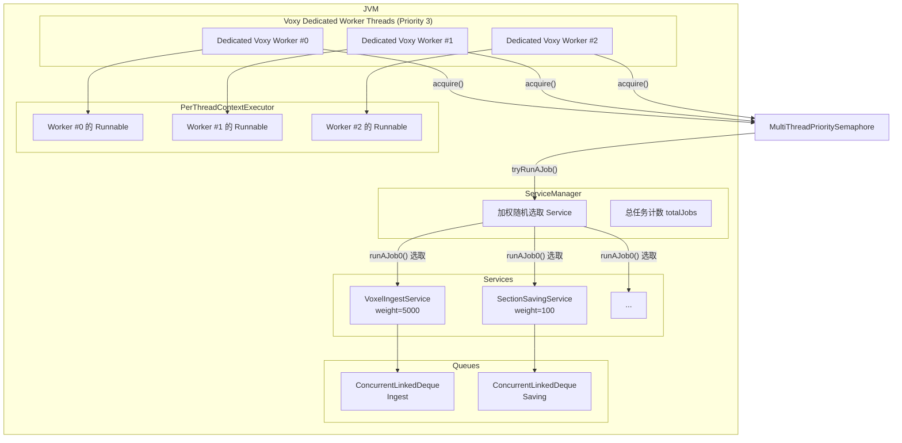
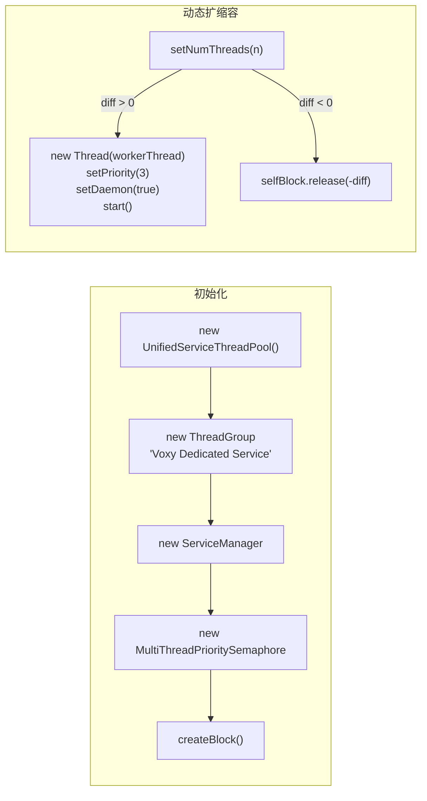
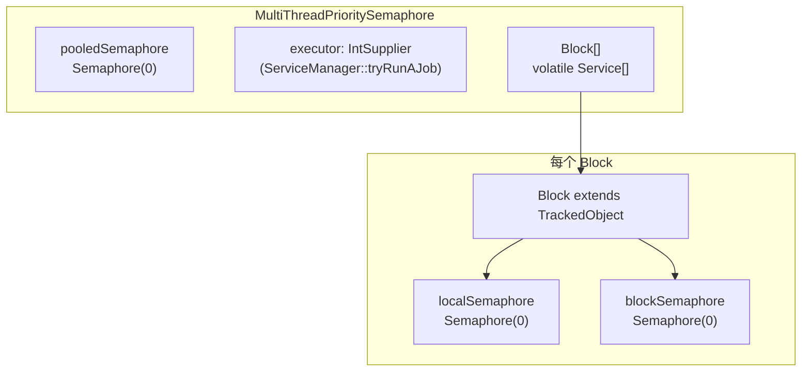
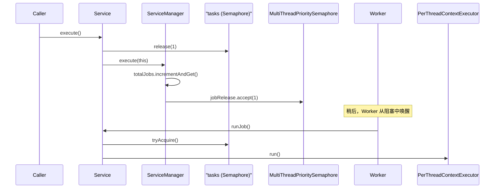
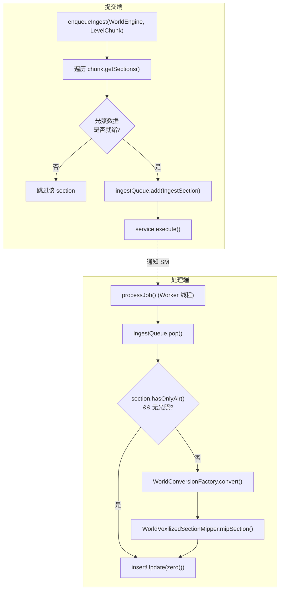
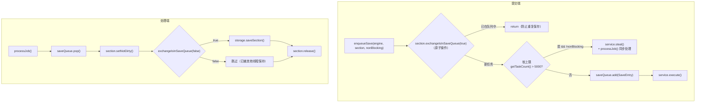

## 致谢

本章节源码分析基于 Cortextea (The True Cortex) 的开源工作。感谢原作者在 `voxy-0.2.13-alpha` 中构建的这套精密的异步任务调度系统。源码路径：

```
D:\Minecraft-Learning\assets\voxy\src\main\java\me\cortex\voxy\
```

---

## 目录

- [1. 概述](#1-概述)
- [2. 线程模型总览](#2-线程模型总览)
- [3. UnifiedServiceThreadPool：统一线程池](#3-unifiedservicethreadpool统一线程池)
- [4. MultiThreadPrioritySemaphore：优先级信号量](#4-multithreadprioritysemaphore优先级信号量)
- [5. Service 与 ServiceManager：任务抽象](#5-service-与 servicemanager-任务抽象)
- [6. 具体服务实现](#6-具体服务实现)
- [7. VoxyInstance 线程管理](#7-voxyinstance-线程管理)
- [8. 课后自查](#8-课后自查)

---

## 1. 概述

Voxy 使用一套**多线程专用 Worker + 优先级信号量 + Service 抽象**的三层任务调度体系。核心设计目标：

| 目标 | 实现方式 |
|------|----------|
| 异步区块处理 | 专用 Service 队列，非阻塞提交 |
| 多 Worker 竞争任务 | `ServiceManager` 加权随机选取 |
| 任务窃取与负载均衡 | `steal()` 方法跨 Service 转移任务 |
| 线程安全 | `ConcurrentLinkedDeque` + `AtomicInteger` |
| 优雅关闭 | `blockTillEmpty()` 等待队列排空 |

---

## 2. 线程模型总览



### 线程优先级为 3 的含义

```10:38:assets/voxy/src/main/java/me/cortex/voxy/common/thread/UnifiedServiceThreadPool.java
t.setPriority(3);
```

Java 线程优先级范围是 `Thread.MIN_PRIORITY`(1) 到 `Thread.MAX_PRIORITY`(10)，默认是 `NORM_PRIORITY`(5)。

**设为 3 的设计意图**：低于正常优先级，让 Voxy Worker 在有大量任务时不会过度抢占渲染线程/主线程的时间片。设置为 3 意味着 Voxy 工作线程在系统调度中处于「低优先级」——这在 Minecraft 客户端尤其关键，渲染帧率不能被后台存储操作拖累。

此外，`VoxyInstance` 中还有一个 `worldCleaner` 线程使用 `Thread.MIN_PRIORITY`（优先级 1），专门做空闲世界清理：

```54:56:assets/voxy/src/main/java/me/cortex/voxy/commonImpl/VoxyInstance.java
this.worldCleaner.setPriority(Thread.MIN_PRIORITY);
```

---

## 3. UnifiedServiceThreadPool：统一线程池



**`UnifiedServiceThreadPool`** 的核心职责是管理一组专用线程：

```10:12:assets/voxy/src/main/java/me/cortex/voxy/common/thread/UnifiedServiceThreadPool.java
public class UnifiedServiceThreadPool {
    public final ServiceManager serviceManager;
    public final MultiThreadPrioritySemaphore groupSemaphore;
    private final MultiThreadPrioritySemaphore.Block selfBlock;
    private final ThreadGroup dedicatedPool;
    private final List<Thread> threads = new ArrayList<>();
```

- **`ServiceManager`**：管理所有 Service，负责选取哪个 Service 执行任务
- **`MultiThreadPrioritySemaphore`**：协调 Worker 线程阻塞/唤醒，支持优先级调度
- **`ThreadGroup`**：将 Voxy Worker 归入名为 `"Voxy Dedicated Service"` 的线程组，便于调试
- **Daemon 线程**：设为 `true`，JVM 退出时自动销毁

### Worker 线程生命周期

```29:55:assets/voxy/src/main/java/me/cortex/voxy/common/thread/UnifiedServiceThreadPool.java
public boolean setNumThreads(int threads) {
    synchronized (this.threads) {
        int diff = threads - this.threads.size();
        if (diff==0) return false;
        if (diff<0) {
            this.selfBlock.release(-diff);  // 释放凭证，线程自行退出
        } else {
            for (int i = 0; i < diff; i++) {
                var t = new Thread(this.dedicatedPool, this::workerThread, "Dedicated Voxy Worker #"+(this.threadId++));
                t.setPriority(3);
                t.setDaemon(true);
                this.threads.add(t);
                t.start();
            }
        }
    }
```

每个 Worker 线程的执行体 `workerThread`：

```57:64:assets/voxy/src/main/java/me/cortex/voxy/common/thread/UnifiedServiceThreadPool.java
private void workerThread() {
    this.selfBlock.acquire();  // 阻塞在此，等待信号量

    // Worker 退出时将自己从列表中移除
    synchronized (this.threads) {
        this.threads.remove(Thread.currentThread());
    }
}
```

**动态扩缩容机制**：不直接 kill 线程，而是通过 `selfBlock.release(n)` 释放 n 个许可证，让 n 个 Worker 的 `acquire()` 返回后自然退出。这比强制中断线程更安全，不会产生半完成状态。

---

## 4. MultiThreadPrioritySemaphore：优先级信号量

这是 Voxy 线程体系中最复杂的组件。设计目标：**将多个线程池统一调度，同时保证本地任务优先于「窃取」任务**。

### 4.1 核心结构



每个 Worker 线程持有一个 `Block`，Worker 通过 `Block.acquire()` 进入阻塞状态。有任务时：

1. **`pooledRelease(permits)`** 被调用 → `pooledSemaphore` 增加计数
2. 所有 `Block.blockSemaphore` 同时增加计数
3. Worker 从 `acquire()` 返回后：
   - 优先从 `localSemaphore` 获取（本地任务）
   - 若无本地任务，调用 `man.tryRun(this)` 尝试执行池中任务

### 4.2 Block 的 acquire 逻辑

```49:66:assets/voxy/src/main/java/me/cortex/voxy/common/thread/MultiThreadPrioritySemaphore.java
while (true) {
    if (runJob) {
        this.blockSemaphore.acquireUninterruptibly();  // 等待任何任务
        if (this.localSemaphore.tryAcquire()) {       // 优先本地任务
            return;
        }
        if (this.man.tryRun(this)) {                  // 尝试执行共享池任务
            break;
        }
    } else {
        this.localSemaphore.acquireUninterruptibly();
        if (!this.blockSemaphore.tryAcquire()) {
            // This is technically/actually a failure state
        }
        break;
    }
}
```

### 4.3 tryRun 的返回值语义

```143:159:assets/voxy/src/main/java/me/cortex/voxy/common/thread/MultiThreadPrioritySemaphore.java
while (true) {
    int status = this.executor.getAsInt();
    if (status == 0) return false;   // 任务成功执行
    if (status == 1) return false;   // 无任务或无 Service
    if (2 <= status) {                // 2/3: 找到服务但无法运行，等待后重试
        if (block.localSemaphore.tryAcquire(10, TimeUnit.MILLISECONDS)) {
            block.blockSemaphore.tryAcquire();
            this.pooledRelease(1);   // 归还许可证
            return true;
        }
    }
}
```

`ServiceManager.tryRunAJob()` 返回的 0/1/2/3 语义由 `runAJob0()` 定义：

| 返回值 | 含义 |
|--------|------|
| 0 | 成功执行了一个任务 |
| 1 | 无任务或无 Service（正常退出） |
| 2 | 所有 Service 队列为空 |
| 3 | 部分 Service 被 `limiter` 跳过但可能有任务 |

---

## 5. Service 与 ServiceManager：任务抽象

### 5.1 Service：惰性执行的任务队列



`Service` 是惰性执行的代表——`execute()` 只是将任务加入内部 `Semaphore` 并通知 `ServiceManager`，**不执行任何实际工作**。实际执行由 Worker 线程从 `ServiceManager.runAJob0()` 中选取后触发。

```17:19:assets/voxy/src/main/java/me/cortex/voxy/common/thread/Service.java
private final Semaphore tasks = new Semaphore(0);
private volatile boolean isLive = true;
private volatile boolean isStopping = false;
```

### 5.2 ServiceManager：加权随机选取算法

`ServiceManager.runAJob0()` 是整个任务调度的核心，实现了一个**加权随机选取**算法：

```66:129:assets/voxy/src/main/java/me/cortex/voxy/common/thread/ServiceManager.java
private int runAJob0() {
    var ctx = this.accelerationContext.get();  // ThreadLocal 随机状态
    long skipMsk = 0;
    var services = this.services;
    long totalWeight = 0;
    int shiftFactor = (ctx.shiftFactor++)&Integer.MAX_VALUE;  // 轮转起始偏移

    // 第一遍：计算 totalWeight，检查 limiter
    for (int i = 0; i < services.length; i++) {
        var service = services[i];
        if (!service.isLive()) { Thread.yield(); continue; }
        if (service.limiter!=null && !service.limiter.getAsBoolean()) {
            skipMsk |= 1L<<i;  // 标记跳过
            continue;
        }
        totalWeight += service.numJobs() * service.weight;
    }
    if (totalWeight == 0) return skipMsk!=0?3:2;

    // 第二遍：加权随机选取
    long sample = ctx.rand(totalWeight);
    for (int i = 0; i < services.length; i++) {
        var service = services[(i+shiftFactor)%services.length];
        sample -= service.numJobs() * service.weight;
        if (sample<=0) {
            selectedService = service;
            break;
        }
    }
    // ...
    selectedService.runJob();
    this.totalJobs.decrementAndGet();
    return 0;
}
```

**选取策略**：
- 每次轮转通过 `shiftFactor` 改变起始位置，避免总是从同一个 Service 开始选取（防止低权重 Service 饿死）
- 选取概率与 `numJobs() * weight` 成正比
- 如果某个 Service 被 `limiter` 禁用（返回 false），则跳过

### 5.3 工作窃取：steal()

```85:91:assets/voxy/src/main/java/me/cortex/voxy/common/thread/Service.java
public boolean steal() {
    if (!this.tasks.tryAcquire()) {
        return false;
    }
    this.sm.remJobs(1);  // 通知 ServiceManager 任务数减 1
    return true;
}
```

`steal()` 用于**跨 Service 转移任务**。典型场景是 `SectionSavingService` 的非阻塞保存：当保存队列超过软上限 5000 时，主线程直接 `steal()` 并自行处理任务，避免队列无限膨胀。

### 5.4 生命周期管理

```72:83:assets/voxy/src/main/java/me/cortex/voxy/common/thread/Service.java
public int shutdown() {
    if (this.isStopping) throw new IllegalStateException("Service not live");
    this.isStopping = true;                  // 1. 标记停止
    this.sm.removeService(this);             // 2. 从管理器移除
    this.executor.shutdown();                // 3. 等待运行中的任务完成
    int remaining = this.tasks.drainPermits(); // 4. 排空队列
    this.isLive = false;                    // 5. 标记死亡
    this.sm.remJobs(remaining);             // 6. 更新总任务数
    return remaining;
}
```

---

## 6. 具体服务实现

### 6.1 VoxelIngestService：异步区块摄取



**关键设计**：

| 参数 | 值 | 说明 |
|------|-----|------|
| `weight` | 5000 | 高权重，保证区块加载优先处理 |
| 队列上限 | 无硬限制 | 依赖 Minecraft 区块加载管控 |
| 线程安全 | `ConcurrentLinkedDeque` | 允许多线程并发入队/出队 |
| `limiter` | `null` | 不限流 |

```24:32:assets/voxy/src/main/java/me/cortex/voxy/common/world/service/VoxelIngestService.java
public class VoxelIngestService {
    private final ConcurrentLinkedDeque<IngestSection> ingestQueue = new ConcurrentLinkedDeque<>();

    public VoxelIngestService(ServiceManager pool) {
        this.service = pool.createServiceNoCleanup(()->this::processJob, 5000, "Ingest service");
    }
```

### 6.2 SectionSavingService：异步区块存储



**关键设计**：

| 参数 | 值 | 说明 |
|------|-----|------|
| `weight` | 100 | 低权重，存储操作不影响区块加载 |
| 软上限 | 5000 | 超过后主线程同步处理部分任务 |
| 硬上限 | 1200 | `savingServiceRateLimiter` 控制写入速率 |
| 幂等性 | `exchangeIsInSaveQueue` | 防止同一 Section 被重复入队 |

```14:15:assets/voxy/src/main/java/me/cortex/voxy/common/world/service/SectionSavingService.java
public class SectionSavingService {
    private static final int SOFT_MAX_QUEUE_SIZE = 5_000;
    private final Service service;
    private final ConcurrentLinkedDeque<SaveEntry> saveQueue = new ConcurrentLinkedDeque<>();

    public SectionSavingService(ServiceManager sm) {
        this.service = sm.createServiceNoCleanup(() -> this::processJob, 100, "Section saving service");
    }
```

**`limiter` 的软限流**：VoxyInstance 传入 `savingServiceRateLimiter = ()->this.savingService.getTaskCount()<1200`。当保存任务超过 1200 时，`ServiceManager.runAJob0()` 会跳过该 Service，但主线程仍可通过 `steal()` 同步处理——这是一个**双层限流**设计。

---

## 7. VoxyInstance 线程管理

```mermaid
flowchart TB
    subgraph 启动阶段
        A["new VoxyInstance()"]
        A --> B["new UnifiedServiceThreadPool()"]
        B --> C["new ServiceManager + MultiThreadPrioritySemaphore"]
        C --> D["new SectionSavingService"]
        D --> E["new VoxelIngestService"]
        E --> F["new Thread(worldCleaner, MIN_PRIORITY)"]
        F --> G["worldCleaner.start()"]
        G --> H["updateDedicatedThreads() → setNumThreads(3)"]
    end

    subgraph 关闭阶段
        I["shutdown()"]
        I --> J["worldCleaner.join()"]
        J --> K["cleanIdle()"]
        K --> L["ingestService.shutdown()\nsavingService.shutdown()"]
        L --> M["world.free() for each"]
        M --> N["threadPool.shutdown()"]
    end
```



`VoxyInstance` 是所有线程资源的总入口：

```34:58:assets/voxy/src/main/java/me/cortex/voxy/commonImpl/VoxyInstance.java
public VoxyInstance() {
    Logger.info("Initializing voxy instance");
    this.threadPool = new UnifiedServiceThreadPool();
    this.savingService = new SectionSavingService(this.getServiceManager());
    this.ingestService = new VoxelIngestService(this.getServiceManager());
    this.importManager = this.createImportManager();
    this.savingServiceRateLimiter = ()->this.savingService.getTaskCount()<1200;
    this.worldCleaner = new Thread(()->{
        try {
            while (this.isRunning) {
                Thread.sleep(1000);
                this.cleanIdle();
            }
        } catch (InterruptedException e) { /* exit */ }
    });
    this.worldCleaner.setPriority(Thread.MIN_PRIORITY);
    this.worldCleaner.setName("Active world cleaner");
    this.worldCleaner.setDaemon(true);
    this.worldCleaner.start();
}
```

**世界清理线程**：每 1 秒检查一次空闲世界（无活跃区块引用）。空闲世界的判断标准由 `WorldEngine.isWorldIdle()` 定义，清理后调用 `world.free()` 释放资源。

**多世界管理**：

```29:30:assets/voxy/src/main/java/me/cortex/voxy/commonImpl/VoxyInstance.java
private final StampedLock activeWorldLock = new StampedLock();
private final HashMap<WorldIdentifier, WorldEngine> activeWorlds = new HashMap<>();
```

使用 `StampedLock`（读写锁）保护活跃世界映射。读取用 `readLock()`，写入用 `writeLock()`。同时通过 `WeakReference<WorldEngine>` 实现世界缓存，避免已释放的世界对象泄露。

---

## 8. 课后自查

- [ ] 解释 `Thread.setPriority(3)` 在 Voxy Worker 中的作用，以及为什么不是 1 或 5
- [ ] `MultiThreadPrioritySemaphore.Block` 的 `localSemaphore` vs `blockSemaphore` 各自的用途是什么？
- [ ] `ServiceManager.runAJob0()` 中 `shiftFactor` 的作用是什么？如果去掉会怎样？
- [ ] 为什么 `VoxelIngestService` 的 weight 是 5000 而 `SectionSavingService` 的 weight 是 100？这个比例如何影响调度？
- [ ] `steal()` 在 `SectionSavingService` 中被用于什么场景？它与 `drain()` 的区别是什么？
- [ ] 如果 `limiter` 返回 false，`ServiceManager` 会如何处理该 Service 的任务？
- [ ] `VoxyInstance.worldCleaner` 的优先级设为 `Thread.MIN_PRIORITY` 的设计意图是什么？
- [ ] 描述从调用 `VoxelIngestService.enqueueIngest()` 到区块数据被处理的完整时序
