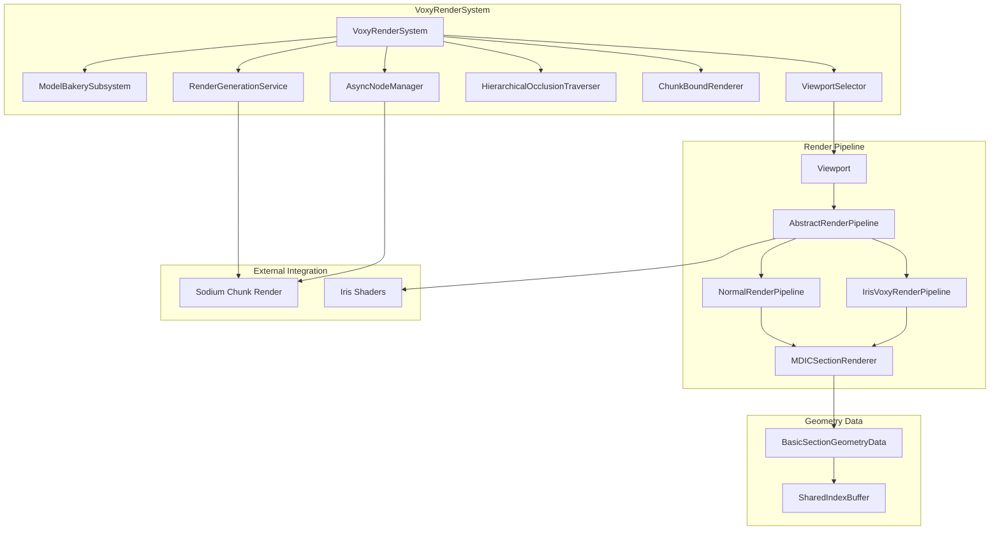
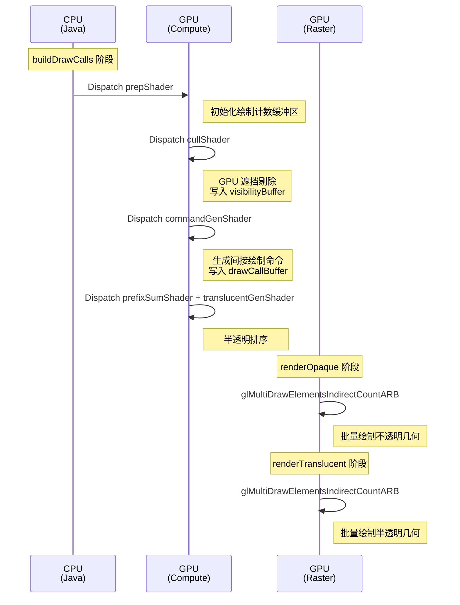
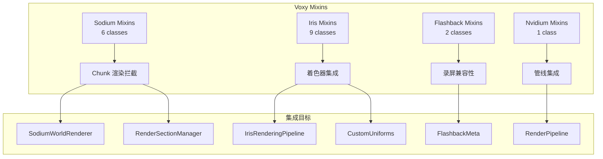

## 致谢

本文档基于 [Voxy](https://github.com/comp500/voxy) v0.2.13-alpha 模组源码分析撰写。Voxy 是由 comp500 开发的 Minecraft 地形渲染优化模组，采用 AGPL-3.0 许可证。感谢原作者开源分享如此高质量的渲染系统实现。

## 目录

- [GPU 能力检测机制](#1-gpu-能力检测机制)
- [渲染引擎架构](#2-渲染引擎架构)
- [共享索引缓冲设计](#3-共享索引缓冲设计)
- [Mixin 集成策略](#4-mixin-集成策略)
- [兼容性处理](#5-兼容性处理)
- [总结](#6-总结)

---

## 1. GPU 能力检测机制

Voxy 的渲染系统高度依赖现代 GPU 特性，因此必须在初始化阶段严格检测硬件能力。`Capabilities` 类是整个渲染系统的门槛。

### 1.1 必需特性

```53:57:D:\Minecraft-Learning\assets\voxy\src\main\java\me\cortex\voxy\client\core\gl\Capabilities.java
this.sparseBuffer = cap.GL_ARB_sparse_buffer;
this.compute = cap.glDispatchComputeIndirect != 0;
this.indirectParameters = cap.glMultiDrawElementsIndirectCountARB != 0;
this.repFragTest = cap.GL_NV_representative_fragment_test;
this.meshShaders = cap.GL_NV_mesh_shader;
this.canQueryGpuMemory = cap.GL_NVX_gpu_memory_info;
```

Voxy 的最低硬件要求：
- **compute**: 必须支持 `glDispatchComputeIndirect`，用于多线程 GPU 绘制调用生成
- **indirectParameters**: 必须支持 `GL_ARB_multi_draw_elements_indirect_count`，这是批量绘制的基础
- 如果任一特性不支持，模组将直接禁用

```31:34:D:\Minecraft-Learning\assets\voxy\src\main\java\me\cortex\voxy\client\VoxyClient.java
boolean systemSupported = Capabilities.INSTANCE.compute && Capabilities.INSTANCE.indirectParameters && !Capabilities.INSTANCE.hasBrokenDepthSampler;
if (!systemSupported) {
     Logger.error("Voxy is unsupported on your system.");
}
```

### 1.2 扩展特性检测

```61:83:D:\Minecraft-Learning\assets\voxy\src\main\java\me\cortex\voxy\client\core\gl\Capabilities.java
// INT64_t 检测：不能仅依赖 GL 扩展标志，必须实际编译着色器测试
this.INT64_t = testShaderCompilesOk(ShaderType.COMPUTE, """
        #version 430
        #extension GL_ARB_gpu_shader_int64 : require
        layout(local_size_x=32) in;
        void main() {
            uint64_t a = 1234;
        }
        """);

if (cap.GL_KHR_shader_subgroup) {
    this.subgroup = testShaderCompilesOk(ShaderType.COMPUTE, """
        #version 430
        #extension GL_KHR_shader_subgroup_basic : require
        #extension GL_KHR_shader_subgroup_arithmetic : require
        layout(local_size_x=32) in;
        void main() {
            uint a = subgroupExclusiveAdd(gl_LocalInvocationIndex);
        }
        """);
} else {
    this.subgroup = false;
}
```

关键设计：**扩展检测不可靠时，通过实际编译着色器来验证**。`INT64_t` 和 `subgroup` 的检测都采用了这种方式，避免了驱动报告与实际支持不符的问题。

### 1.3 厂商检测与特殊 Bug 处理

```88:111:D:\Minecraft-Learning\assets\voxy\src\main\java\me\cortex\voxy\client\core\gl\Capabilities.java
this.isMesa = glGetString(GL_VERSION).toLowerCase(Locale.ROOT).contains("mesa");
var vendor = glGetString(GL_VENDOR).toLowerCase(Locale.ROOT);
this.isIntel = vendor.contains("intel");
this.isNvidia = vendor.contains("nvidia");
this.isAmd = vendor.contains("amd")||vendor.contains("radeon");

if (this.compute&&this.isAmd) {
    this.hasBrokenDepthSampler = testDepthSampler();
    if (this.hasBrokenDepthSampler) {
        throw new IllegalStateException("it bork, amd is bork");
    }
}
```

**AMD 深度采样 Bug** 是 Voxy 遇到的典型硬件兼容性问题。部分 AMD 显卡在 Compute Shader 中对深度纹理的 `texelFetch` 返回错误值。Voxy 通过运行时测试检测此问题，一旦发现直接抛出异常禁用模组。

```117:199:D:\Minecraft-Learning\assets\voxy\src\main\java\me\cortex\voxy\client\core\gl\Capabilities.java
private static boolean testDepthSampler() {
    // 创建深度模板纹理，测试不同 mip 级别下 texelFetch 的正确性
    // 如果读取值与预期不符，说明该驱动存在 bug
}
```

### 1.4 内存信息查询

```94:100:D:\Minecraft-Learning\assets\voxy\src\main\java\me\cortex\voxy\client\core\gl\Capabilities.java
if (this.canQueryGpuMemory) {
    this.totalDedicatedMemory = glGetInteger64(GL_GPU_MEMORY_INFO_DEDICATED_VIDMEM_NVX)*1024;
    this.totalDynamicMemory = (glGetInteger64(GL_GPU_MEMORY_INFO_TOTAL_AVAILABLE_MEMORY_NVX)*1024) - this.totalDedicatedMemory;
} else {
    this.totalDedicatedMemory = -1;
    this.totalDynamicMemory = -1;
}
```

仅 NVIDIA 显卡支持通过 `GL_NVX_gpu_memory_info` 查询显存信息。这些数据用于内存管理和调度决策。

---

## 2. 渲染引擎架构

### 2.1 核心组件关系



`VoxyRenderSystem` 是渲染系统的入口点，协调所有子系统的生命周期：

```78:172:D:\Minecraft-Learning\assets\voxy\src\main\java\me\cortex\voxy\client\core\VoxyRenderSystem.java
public VoxyRenderSystem(WorldEngine world, ServiceManager sm) {
    // 1. 保留世界引用，防止 GC
    world.acquireRef();
    
    // 2. 创建几何数据管理
    this.geometryData = new BasicSectionGeometryData(1<<20, RenderResourceReuse.getOrCreateGeometryBuffer());
    
    // 3. 创建异步节点管理器
    this.nodeManager = new AsyncNodeManager(1 << 21, this.geometryData, this.renderGen);
    
    // 4. 创建分层遮挡剔除器
    this.traversal = new HierarchicalOcclusionTraverser(this.nodeManager, this.nodeCleaner, this.renderGen);
    
    // 5. 创建渲染管线（普通或 Iris 集成）
    this.pipeline = RenderPipelineFactory.createPipeline(this.nodeManager, this.nodeCleaner, this.traversal, this::frexStillHasWork);
    
    // 6. 创建视口选择器
    this.viewportSelector = new ViewportSelector<>(sectionRenderer::createViewport);
}
```

### 2.2 渲染管线设计

`AbstractRenderPipeline` 定义了渲染管线的标准流程：

```96:128:D:\Minecraft-Learning\assets\voxy\src\main\java\me\cortex\voxy\client\core\AbstractRenderPipeline.java
public void runPipeline(Viewport<?> viewport, int sourceFrameBuffer, int srcWidth, int srcHeight) {
    int depthTexture = this.setup(viewport, sourceFrameBuffer, srcWidth, srcHeight);

    // 1. 渲染不透明地形
    rs.renderOpaque(viewport);
    
    // 2. GPU 遮挡查询 + 节点更新
    this.innerPrimaryWork(viewport, depthTexture);
    
    // 3. 构建绘制调用
    rs.buildDrawCalls(viewport);
    
    // 4. 渲染时序内容
    rs.renderTemporal(viewport);
    
    // 5. 后期处理钩子
    this.postOpaquePreTranslucent(viewport);
    
    // 6. 渲染半透明内容
    if (!this.deferTranslucency) {
        rs.renderTranslucent(viewport);
    }
    
    this.finish(viewport, sourceFrameBuffer, srcWidth, srcHeight);
}
```

### 2.3 MDIC 渲染器架构

`MDICSectionRenderer` 是实际执行 GPU 绘制的核心组件，使用 `glMultiDrawElementsIndirectCountARB` 实现高效批量绘制：

```49:53:D:\Minecraft-Learning\assets\voxy\src\main\java\me\cortex\voxy\client\core\rendering\section\backend\mdic\MDICSectionRenderer.java
public static final int OPAQUE_DRAW_COUNT = 400_000;    // 不透明绘制调用上限
public static final int TRANSLUCENT_DRAW_COUNT = 100_000; // 半透明绘制调用上限
public static final int TEMPORAL_DRAW_COUNT = 100_000;   // 时序绘制调用上限
```

**绘制流程**：



### 2.4 着色器编译管线

```46:65:D:\Minecraft-Learning\assets\voxy\src\main\java\me\cortex\voxy\client\core\gl\shader\Shader.java
public static class Builder <T extends Shader> {
    public Builder<T> define(String name) { ... }
    public Builder<T> defineIf(String name, boolean condition) { ... }
    public Builder<T> add(ShaderType type, String id) { ... }
    public Builder<T> addSource(ShaderType type, String source) { ... }
    public T compile() {
        this.defineIf("IS_INTEL", Capabilities.INSTANCE.isIntel);
        this.defineIf("IS_WINDOWS", ThreadUtils.isWindows);
        return this.constructor.make(this, this.compileToProgram());
    }
}
```

着色器 Builder 使用链式 API，支持条件编译、平台特定宏定义：

```58:88:D:\Minecraft-Learning\assets\voxy\src\main\java\me\cortex\voxy\client\core\rendering\section\backend\mdic\MDICSectionRenderer.java
.add(ShaderType.COMPUTE, "voxy:lod/gl46/cmdgen.comp")
.defineIf("HAS_STATISTICS", RenderStatistics.enabled)
.defineIf("STATISTICS_BUFFER_BINDING", RenderStatistics.enabled, STATISTICS_BUFFER_BINDING)
```

---

## 3. 共享索引缓冲设计

### 3.1 设计目标

`SharedIndexBuffer` 预先生成并上传标准索引模式到 GPU，供所有渲染批次复用，避免重复创建：

```9:14:D:\Minecraft-Learning\assets\voxy\src\main\java\me\cortex\voxy\client\core\rendering\util\SharedIndexBuffer.java
public class SharedIndexBuffer {
    public static final int CUBE_INDEX_OFFSET = (1<<16)*6*2;
    public static final SharedIndexBuffer INSTANCE = new SharedIndexBuffer();
    public static final SharedIndexBuffer INSTANCE_BYTE = new SharedIndexBuffer(true);
    public static final SharedIndexBuffer INSTANCE_BB_BYTE = new SharedIndexBuffer(true, true);
```

### 3.2 索引模式生成

```188:206:D:\Minecraft-Learning\assets\voxy\src\main\java\me\cortex\voxy\client\core\rendering\util\SharedIndexBuffer.java
public static MemoryBuffer generateQuadIndicesShort(int quadCount) {
    if ((quadCount*4) >= 1<<16) {
        throw new ArgumentException("Quad count to large");
    }
    MemoryBuffer buffer = new MemoryBuffer(quadCount * 6L * 2);
    long ptr = buffer.address;
    for(int i = 0; i < quadCount*4; i += 4) {
        MemoryUtil.memPutShort(ptr + (0*2), (short) (i + 1));
        MemoryUtil.memPutShort(ptr + (1*2), (short) (i + 2));
        MemoryUtil.memPutShort(ptr + (2*2), (short) (i + 0));
        MemoryUtil.memPutShort(ptr + (3*2), (short) (i + 1));
        MemoryUtil.memPutShort(ptr + (4*2), (short) (i + 3));
        MemoryUtil.memPutShort(ptr + (5*2), (short) (i + 2));
        ptr += 6 * 2;
    }
    return buffer;
}
```

生成的四边形索引模式：
```
顶点: 0,1,2,3 → 索引: 1,2,0,1,3,2 (两个三角形)
```

### 3.3 多变体支持

| 变体 | 顶点索引类型 | 适用场景 |
|------|-------------|----------|
| `INSTANCE` | 16-bit short | 最多 16380 个四边形 |
| `INSTANCE_BYTE` | 8-bit byte | 最多 63 个四边形 |
| `INSTANCE_BB_BYTE` | 8-bit byte | 仅立方体 |

立方体索引预定义（用于实体渲染）：

```53:107:D:\Minecraft-Learning\assets\voxy\src\main\java\me\cortex\voxy\client\core\rendering\util\SharedIndexBuffer.java
private static MemoryBuffer generateCubeIndexBuffer() {
    var buffer = new MemoryBuffer(6*2*3);
    // 每个面 2 个三角形，每个三角形 3 个顶点
    
    // Bottom face:  0,1,2, 3,2,1
    // top face:    6,5,4, 5,6,7
    // north face:  0,4,1, 5,1,4
    // south face:  3,6,2, 6,3,7
    // west face:   2,4,0, 4,2,6
    // east face:   1,5,3, 7,3,5
}
```

---

## 4. Mixin 集成策略

Voxy 通过 Mixin 与 Minecraft、Sodium、Iris 等模组深度集成：



### 4.1 Sodium 集成

**核心目标**：拦截 Sodium 的区块渲染流程，注入 Voxy 的数据处理。

```12:19:D:\Minecraft-Learning\assets\voxy\src\main\java\me\cortex\voxy\client\mixin\sodium\MixinSodiumWorldRenderer.java
@Mixin(value = SodiumWorldRenderer.class, remap = false)
public class MixinSodiumWorldRenderer {
    @Inject(method = "initRenderer", at = @At("TAIL"), remap = false)
    private void voxy$injectThreadUpdate(CommandList cl, CallbackInfo ci) {
        var vi = VoxyCommon.getInstance();
        if (vi != null) vi.updateDedicatedThreads();
    }
}
```

**区块生命周期钩子**：

```51:77:D:\Minecraft-Learning\assets\voxy\src\main\java\me\cortex\voxy\client\mixin\sodium\MixinRenderSectionManager.java
@Inject(method = "onChunkRemoved", at = @At("HEAD"))
private void injectIngest(int x, int z, CallbackInfo ci) {
    if (VoxyConfig.CONFIG.ingestEnabled && !BOBBY_INSTALLED) {
        // 触发区块数据摄取
        VoxelIngestService.tryAutoIngestChunk(chunk);
    }
}

@Inject(method = "onChunkAdded", at = @At("HEAD"))
private void voxy$ingestOnAdd(int x, int z, CallbackInfo ci) {
    if (VoxyConfig.CONFIG.ingestEnabled) {
        VoxelIngestService.tryAutoIngestChunk(chunk);
    }
}
```

### 4.2 Iris 集成

**核心目标**：将 Voxy 的地形渲染融入 Iris 着色器管线。

```22:63:D:\Minecraft-Learning\assets\voxy\src\main\java\me\cortex\voxy\client\mixin\iris\MixinIrisRenderingPipeline.java
@Mixin(value = IrisRenderingPipeline.class, remap = false)
public class MixinIrisRenderingPipeline implements IGetVoxyPatchData, IGetIrisVoxyPipelineData {
    
    @Inject(method = "<init>", at = @At(value = "INVOKE", 
        target = "Lnet/irisshaders/iris/pipeline/transform/ShaderPrinter;resetPrintState()V", 
        shift = At.Shift.AFTER))
    private void voxy$injectPatchDataStore(ProgramSet programSet, CallbackInfo ci) {
        if (IrisUtil.SHADER_SUPPORT) {
            this.patchData = ((IGetVoxyPatchData) programSet).voxy$getPatchData();
        }
    }

    @Inject(method = "<init>", at = @At(value = "INVOKE",
        target = "Lnet/irisshaders/iris/pipeline/IrisRenderingPipeline;createSetupComputes..."))
    private void voxy$injectPipeline(ProgramSet programSet, CallbackInfo ci) {
        if (this.patchData != null) {
            this.pipeline = IrisVoxyRenderPipelineData.buildPipeline(...);
        }
    }
}
```

**着色器补丁注入**：

```46:62:D:\Minecraft-Learning\assets\voxy\src\main\java\me\cortex\voxy\client\core\IrisVoxyRenderPipeline.java
@Override
public String patchOpaqueShader(AbstractSectionRenderer<?, ?> renderer, String input) {
    var builder = this.buildGenericShaderHeader(renderer, input);
    builder.append(this.data.opaqueFragPatch());
    return builder.toString();
}

@Override
public String patchTranslucentShader(AbstractSectionRenderer<?, ?> renderer, String input) {
    if (this.data.translucentFragPatch() == null) return null;
    var builder = this.buildGenericShaderHeader(renderer, input);
    builder.append(this.data.translucentFragPatch());
    return builder.toString();
}
```

### 4.3 管线工厂

```15:48:D:\Minecraft-Learning\assets\voxy\src\main\java\me\cortex\voxy\client\core\RenderPipelineFactory.java
public static AbstractRenderPipeline createPipeline(AsyncNodeManager nodeManager, 
        NodeCleaner nodeCleaner, HierarchicalOcclusionTraverser traversal, 
        BooleanSupplier frexSupplier) {
    
    AbstractRenderPipeline pipeline = null;
    
    // 优先尝试创建 Iris 集成管线
    if (IrisUtil.IRIS_INSTALLED && IrisUtil.SHADER_SUPPORT) {
        pipeline = createIrisPipeline(nodeManager, nodeCleaner, traversal, frexSupplier);
    }
    
    // 回退到普通管线
    if (pipeline == null) {
        pipeline = new NormalRenderPipeline(nodeManager, nodeCleaner, traversal, frexSupplier);
    }
    
    return pipeline;
}
```

---

## 5. 兼容性处理

### 5.1 Flashback 录屏兼容性

Flashback 是录制回放模组，需要特殊处理 Voxy 的 LOD 数据路径：

```12:41:D:\Minecraft-Learning\assets\voxy\src\main\java\me\cortex\voxy\client\compat\FlashbackCompat.java
public class FlashbackCompat {
    public static final boolean FLASHBACK_INSTALLED = 
        FabricLoader.getInstance().isModLoaded("flashback");

    public static Path getReplayStoragePath() {
        if (!FLASHBACK_INSTALLED) {
            return null;
        }
        
        ReplayServer replayServer = Flashback.getReplayServer();
        if (replayServer != null) {
            FlashbackMeta meta = replayServer.getMetadata();
            if (meta != null) {
                var path = ((IFlashbackMeta)meta).getVoxyPath();
                if (path != null && path.exists()) {
                    return path.toPath();
                }
            }
        }
        return null;
    }
}
```

**Mixin 注入**：将 Voxy 存储路径保存到 Flashback 元数据中：

```19:28:D:\Minecraft-Learning\assets\voxy\src\main\java\me\cortex\voxy\client\mixin\flashback\MixinFlashbackRecorder.java
@Inject(method = "<init>", at = @At("TAIL"))
private void voxy$getStoragePath(RegistryAccess registryAccess, CallbackInfo retInf) {
    if (VoxyCommon.isAvailable()) {
        var instance = VoxyCommon.getInstance();
        if (instance instanceof VoxyClientInstance ci) {
            ((IFlashbackMeta)this.metadata).setVoxyPath(
                ci.getStorageBasePath().toFile());
        }
    }
}
```

**元数据序列化**：

```28:44:D:\Minecraft-Learning\assets\voxy\src\main\java\me\cortex\voxy\client\mixin\flashback\MixinFlashbackMeta.java
@Inject(method = "toJson", at = @At("RETURN"))
private void voxy$injectSaveVoxyPath(CallbackInfoReturnable<JsonObject> cir) {
    var val = cir.getReturnValue();
    if (val != null && this.voxyPath != null) {
        val.addProperty("voxy_storage_path", this.voxyPath.getAbsoluteFile().getPath());
    }
}

@Inject(method = "fromJson", at = @At("RETURN"))
private static void voxy$injectGetVoxyPath(JsonObject meta, 
        CallbackInfoReturnable<FlashbackMeta> cir) {
    if (meta.has("voxy_storage_path")) {
        ((IFlashbackMeta)val).setVoxyPath(
            new File(meta.get("voxy_storage_path").getAsString()));
    }
}
```

### 5.2 Nvidium 集成

Nvidium 是另一个高性能渲染模组，Voxy 通过 Mixin 在其管线完成后追加渲染：

```18:25:D:\Minecraft-Learning\assets\voxy\src\main\java\me\cortex\voxy\client\mixin\nvidium\MixinRenderPipeline.java
@Mixin(value = RenderPipeline.class, remap = false)
public class MixinRenderPipeline {
    @Inject(method = "renderFrame", at = @At("RETURN"))
    private void voxy$injectRender(TerrainRenderPass pass, Viewport frustum, 
            FogParameters fogParameters, ChunkRenderMatrices crm, 
            double px, double py, double pz, GpuSampler terrainSampler, 
            CallbackInfo ci) {
        var renderer = ((IGetVoxyRenderSystem) Minecraft.getInstance().levelRenderer)
            .getVoxyRenderSystem();
        if (renderer != null) {
            renderer.renderOpaque(renderer.setupViewport(crm, fogParameters, px, py, pz));
        }
    }
}
```

### 5.3 Bobby 多世界支持

Bobby 是另一个扩展渲染距离的模组，Voxy 需要避免与之冲突：

```34:34:D:\Minecraft-Learning\assets\voxy\src\main\java\me\cortex\voxy\client\mixin\sodium\MixinRenderSectionManager.java
@Unique
private static final boolean BOBBY_INSTALLED = 
    FabricLoader.getInstance().isModLoaded("bobby");

@Inject(method = "onChunkRemoved", at = @At("HEAD"))
private void injectIngest(int x, int z, CallbackInfo ci) {
    if (VoxyConfig.CONFIG.ingestEnabled && !BOBBY_INSTALLED) {
        // Bobby 已处理区块生命周期，Voxy 不再干预
    }
}
```

---

## 6. 总结

Voxy 的渲染核心子系统展现了现代游戏渲染引擎的典型架构：

### 架构亮点

1. **严格的 GPU 能力检测**：不依赖单一的 GL 扩展标志，通过实际运行测试验证特性可用性
2. **GPU 驱动批量绘制**：使用 `glMultiDrawElementsIndirectCountARB` 将成千上万的绘制调用合并为少量批量命令
3. **分层设计**：从 `AbstractRenderPipeline` 到具体实现的解耦，便于扩展和测试
4. **Mixin 集成策略**：针对 Sodium/Iris/Flashback/Nvidium 等模组的精确注入点选择

### 关键技术点

| 技术 | 作用 |
|------|------|
| Compute Shader 遮挡剔除 | GPU 端判断可见性，避免 CPU-GPU 同步 |
| 间接绘制命令 | `DrawElementsIndirect` 减少 CPU 提交开销 |
| Subgroup 操作 | AMD/NVIDIA 优化的 SIMD 指令 |
| 深度模板优化 | 避免深度缓冲区格式转换 |
| 异步几何生成 | `AsyncNodeManager` 后台处理几何数据 |

### 课后自查

1. 为什么 Voxy 要求 `glMultiDrawElementsIndirectCountARB` 而非普通的 `glDrawElementsIndirect`？
2. AMD 深度采样 Bug 的检测原理是什么？它影响了哪些渲染阶段？
3. `SharedIndexBuffer` 为什么提供多种变体（byte/short）？
4. Iris 集成中，着色器补丁是如何注入到现有渲染管线的？
5. Flashback 兼容性处理中，元数据序列化的目的是什么？

---

**相关文档**：
- [Voxy 架构概览](./01-architecture-overview.md)
- [地形数据摄取系统](./07-terrain-ingestion.md)
- [分层遮挡剔除](./08-hierarchical-occlusion.md)
