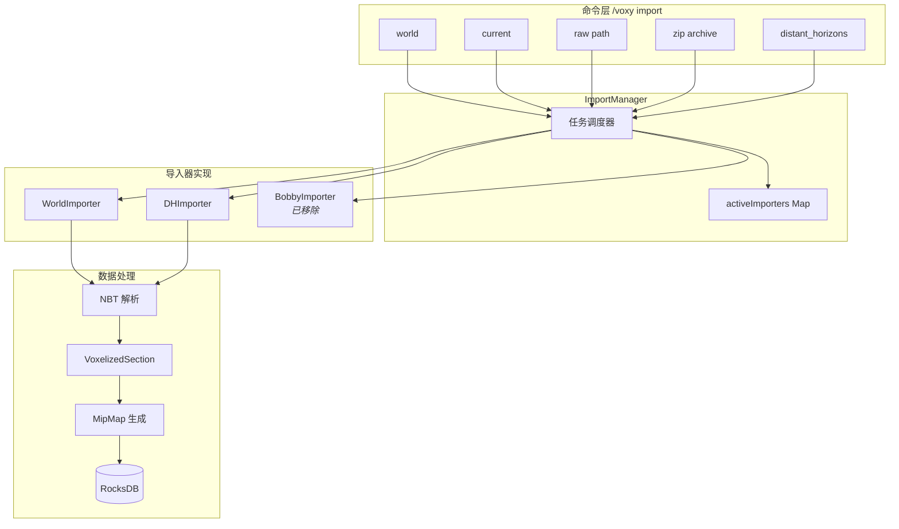
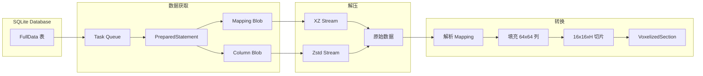

## 致谢

本章节分析基于 Voxy 模组 v0.2.13-alpha 源码，由 modauthor Cortex 编写。本分析仅供学习研究使用，版权归属原作者。

## 目录

- [概述](#概述)
- [ImportManager 架构](#importmanager-架构)
- [IDataImporter 接口设计](#idataimporter-接口设计)
- [WorldImporter - 标准 MCA 导入](#worldimporter---标准-mca-导入)
- [DHImporter - Distant Horizons 数据导入](#dhimporter---distant-horizons-数据导入)
- [导入命令集成](#导入命令集成)
- [数据流与架构图](#数据流与架构图)
- [总结](#总结)

---

## 概述

Voxy 的世界数据导入子系统是其核心功能之一，负责将各种来源的世界数据转换为 Voxy 专有的 RocksDB 存储格式。该系统支持三种主要数据源：

| 数据源 | 导入器 | 数据格式 |
|--------|--------|----------|
| 标准 Minecraft 世界 | `WorldImporter` | `.mca` 区域文件 (NBT) |
| Distant Horizons | `DHImporter` | SQLite 数据库 |
| ~~Bobby 模组~~ | ~~`BobbyImporter`~~ | ~~已移除~~ |

> **关键术语**：VoxelizedSection — Voxy 内部使用的体素化区块表示，将 MC 的方块数据转换为更适合光线追踪的格式。

---

## ImportManager 架构

`ImportManager`（`commonImpl/ImportManager.java`）是导入任务的核心调度器，采用**线程安全**的任务队列设计。

### 核心组件

```10:59:assets/voxy/src/main/java/me/cortex/voxy/commonImpl/ImportManager.java
public class ImportManager {
    private final Map<WorldEngine, ImportTask> activeImporters = new HashMap<>();

    protected class ImportTask {
        protected final IDataImporter importer;
        protected long startTime;
        protected long timer;
        protected long updateEvery = 50;
        // ...
    }
}
```

### 任务生命周期

```61:83:assets/voxy/src/main/java/me/cortex/voxy/commonImpl/ImportManager.java
protected synchronized ImportTask createImportTask(IDataImporter importer) {
    return new ImportTask(importer);
}

public boolean tryRunImport(IDataImporter importer) {
    ImportTask task;
    synchronized (this) {
        var importerTask = this.activeImporters.get(importer.getEngine());
        if (importerTask != null) {
            if (!importerTask.isCompleted()) {
                return false;  // 任务已在运行
            } else {
                throw new IllegalStateException();
            }
        }
        task = this.createImportTask(importer);
        this.activeImporters.put(importer.getEngine(), task);
    }
    task.start();
    return true;
}
```

### 关键设计决策

1. **每个 WorldEngine 只能有一个活跃导入任务** — 通过 `activeImporters` Map 保证
2. **双重锁定检查** — `tryRunImport` 使用 synchronized 块确保线程安全
3. **引用计数管理** — `makeAndRunIfNone` 方法通过 `acquireRef()` / `releaseRef()` 管理引擎生命周期

```85:97:assets/voxy/src/main/java/me/cortex/voxy/commonImpl/ImportManager.java
public boolean makeAndRunIfNone(WorldEngine engine, Supplier<IDataImporter> factory) {
    try {
        engine.acquireRef();
        synchronized (this) {
            if (this.activeImporters.containsKey(engine)) {
                return false;
            }
        }
        return this.tryRunImport(factory.get());
    } finally {
        engine.releaseRef();
    }
}
```

4. **优雅取消** — `cancelImport` 方法可随时中断正在进行的导入

```99:112:assets/voxy/src/main/java/me/cortex/voxy/commonImpl/ImportManager.java
public boolean cancelImport(WorldEngine engine) {
    ImportTask task;
    synchronized (this) {
        task = this.activeImporters.get(engine);
        if (task == null) {
            return false;
        }
    }
    task.shutdown();
    synchronized (this) {
        this.activeImporters.remove(engine);
    }
    return true;
}
```

---

## IDataImporter 接口设计

`IDataImporter`（`importers/IDataImporter.java`）定义了所有导入器的统一接口，采用了**回调模式**进行进度通知。

```1:15:assets/voxy/src/main/java/me/cortex/voxy/commonImpl/importers/IDataImporter.java
public interface IDataImporter {
    interface ICompletionCallback{void onCompletion(int chunks);}
    interface IUpdateCallback{void onUpdate(int finished, int outOf);}

    void runImport(IUpdateCallback updateCallback, ICompletionCallback completionCallback);

    WorldEngine getEngine();

    void shutdown();
    boolean isRunning();
}
```

### 接口契约

| 方法 | 职责 |
|------|------|
| `runImport(update, completion)` | 启动导入，传入回调函数 |
| `getEngine()` | 返回关联的 WorldEngine |
| `shutdown()` | 立即停止导入，释放资源 |
| `isRunning()` | 查询当前运行状态 |

### 回调模式优势

- **解耦** — 导入器不需要了解 UI 如何显示进度
- **异步** — 回调在导入器内部线程触发
- **可组合** — 多个导入器可共享同一个回调实例

---

## WorldImporter - 标准 MCA 导入

`WorldImporter` 负责解析 Minecraft 标准区域文件（`.mca` 格式），是使用最广泛的导入器。

### 初始化与线程池

```66:127:assets/voxy/src/main/java/me/cortex/voxy/commonImpl/importers/WorldImporter.java
public WorldImporter(WorldEngine worldEngine, Level mcWorld, ServiceManager sm, BooleanSupplier runChecker) {
    this.world = worldEngine;
    this.service = sm.createService(()->new Pair<>(()->this.jobQueue.poll().run(), ()->{}), 3, "World importer", runChecker);
    // ... 注册表初始化
}
```

关键点：
- **3 线程并发处理** — 通过 `ServiceManager` 创建服务
- **作业队列** — 使用 `ConcurrentLinkedDeque` 存储待处理的区块任务
- **速率限制** — `runChecker` 用于控制处理速度，避免内存溢出

### 区域文件解析

```181:194:assets/voxy/src/main/java/me/cortex/voxy/commonImpl/importers/WorldImporter.java
public void importRegionDirectoryAsync(File directory) {
    var files = directory.listFiles((dir, name) -> {
        var sections = name.split("\\.");
        if (sections.length != 4 || (!sections[0].equals("r")) || (!sections[3].equals("mca"))) {
            Logger.error("Unknown file: " + name);
            return false;
        }
        return true;
    });
    if (files == null) {
        return;
    }
    Arrays.sort(files, File::compareTo);
    this.importRegionsAsync(files, this::importRegionFile);
}
```

文件名格式验证：`r.X.Z.mca`，其中 X、Z 是区域坐标。

### MCA 文件格式解析

```331:405:assets/voxy/src/main/java/me/cortex/voxy/commonImpl/importers/WorldImporter.java
private void importRegion(MemoryBuffer regionFile, int x, int z) {
    if (regionFile.size < 8192) {// 文件头 8192 字节
        Logger.warn("Header of region file invalid");
        return;
    }
    for (int idx = 0; idx < 1024; idx++) { // 每个区域最多 1024 个区块
        int sectorMeta = Integer.reverseBytes(MemoryUtil.memGetInt(regionFile.address+idx*4));
        if (sectorMeta == 0) continue;
        
        int sectorStart = sectorMeta>>>8;
        int sectorCount = sectorMeta&((1<<8)-1);
        
        // 读取并解析区块数据...
        var data = new MemoryBuffer(n);
        this.jobQueue.add(()-> {
            try {
                try (var decompressedData = this.decompress(b, data)) {
                    var nbt = NbtIo.read(decompressedData);
                    this.importChunkNBT(nbt, x, z);
                }
            } catch (Exception e) {
                throw new RuntimeException(e);
            }
        });
        this.totalChunks.incrementAndGet();
        this.service.execute();
    }
}
```

### Minecraft NBT 到 VoxelizedSection 转换

```477:530:assets/voxy/src/main/java/me/cortex/voxy/commonImpl/importers/WorldImporter.java
private void importSectionNBT(int x, int y, int z, CompoundTag section) {
    if (section.getCompound("block_states").isEmpty()) {
        return;
    }

    byte[] blockLightData = section.getByteArray("BlockLight").orElse(EMPTY);
    byte[] skyLightData = section.getByteArray("SkyLight").orElse(EMPTY);
    
    // 使用 Codec 解析方块状态
    var blockStatesRes = blockStateCodec.parse(NbtOps.INSTANCE, section.getCompound("block_states").get());
    if (!blockStatesRes.hasResultOrPartial()) {
        return;
    }
    var blockStates = blockStatesRes.getPartialOrThrow();
    
    // 转换为 VoxelizedSection
    VoxelizedSection csec = WorldConversionFactory.convert(
            SECTION_CACHE.get().setPosition(x, y, z),
            this.world.getMapper(),
            blockStates,
            biomes,
            (bx, by, bz) -> (byte)(skyLight | (blockLight << 4))
    );

    // 生成多级 MIP
    WorldVoxilizedSectionMipper.mipSection(csec, this.world.getMapper());
    WorldUpdater.insertUpdate(this.world, csec);
}
```

**关键转换流程**：
```
MCA NBT → PalettedContainer<BlockState> → VoxelizedSection → RocksDB
```

### 进度控制与背压

```245:289:assets/voxy/src/main/java/me/cortex/voxy/commonImpl/importers/WorldImporter.java
private <T> void importRegionsAsync(T[] regionFiles, IImporterMethod<T> importer) {
    // ...
    for (var file : regionFiles) {
        importer.importRegion(file);
        
        // 背压控制：队列超过 10000 时等待
        while ((this.totalChunks.get()-this.chunksProcessed.get() > 10_000) && this.isRunning) {
            Thread.sleep(1);
        }
    }
    // 等待所有任务完成
    while (this.chunksProcessed.get() != this.totalChunks.get() && this.isRunning) {
        Thread.yield();
        Thread.sleep(10);
    }
}
```

---

## DHImporter - Distant Horizons 数据导入

`DHImporter` 处理 Distant Horizons 模组的 LOD（Level of Detail）数据，支持从其 SQLite 数据库导入预先生成的远距离渲染数据。

### 数据库连接与初始化

```100:135:assets/voxy/src/main/java/me/cortex/voxy/commonImpl/importers/DHImporter.java
public DHImporter(File file, WorldEngine worldEngine, Level mcWorld, ServiceManager servicePool, BooleanSupplier rateLimiter) {
    this.engine = worldEngine;
    this.world = mcWorld;
    this.biomeRegistry = mcWorld.registryAccess().lookupOrThrow(Registries.BIOME);
    this.blockRegistry = mcWorld.registryAccess().lookupOrThrow(Registries.BLOCK);
    
    String con = "jdbc:sqlite:" + file.getPath();
    this.db = DriverManager.getConnection(con);
    
    // 创建 10 线程的服务
    this.service = servicePool.createService(()->{
        var dataFetchStmt = this.db.prepareStatement(
            "SELECT Data,ColumnGenerationStep,Mapping FROM FullData WHERE DetailLevel = 0 AND PosX = ? AND PosZ = ?;");
        var ctx = new WorkCTX(dataFetchStmt, this.worldHeightSections*16);
        return new Pair<>(()->{
            this.importSection(dataFetchStmt, ctx, this.tasks.poll());
        }, ()->ctx.free());
    }, 10, "DH Importer", rateLimiter);
}
```

### 数据库 Schema

DHImporter 查询 `FullData` 表：

| 列名 | 类型 | 说明 |
|------|------|------|
| `PosX`, `PosZ` | INT | DH 区块坐标（每个 DH 区块 = 4x4 MC 区块） |
| `DetailLevel` | INT | LOD 级别（0 = 最高细节） |
| `Data` | BLOB | 压缩的列数据 |
| `ColumnGenerationStep` | BLOB | 生成步骤数据 |
| `Mapping` | BLOB | 方块/生物群系映射表 |
| `CompressionMode` | INT | 压缩模式（3=XZ, 4=Zstd） |
| `DataFormatVersion` | INT | 数据格式版本 |

### 任务调度

```137:197:assets/voxy/src/main/java/me/cortex/voxy/commonImpl/importers/DHImporter.java
public void runImport(IUpdateCallback updateCallback, ICompletionCallback completionCallback) {
    this.engine.acquireRef();
    this.runner = new Thread(()-> {
        Queue<Task> taskQ = new PriorityQueue<>(Comparator.comparingLong(Task::distanceFromZero));
        
        // 按距离原点的距离排序，先处理近处
        var resSet = stmt.executeQuery(
            "SELECT PosX,PosZ,CompressionMode,DataFormatVersion FROM FullData WHERE DetailLevel = 0;");
        while (resSet.next()) {
            taskQ.add(new Task(x, z, format, compression));
        }
        
        this.totalChunks = taskQ.size() * (4*4);  // 每个 DH 区块 = 16 个 MC 区块
        
        // 任务队列控制：最多同时 100 个任务
        while (this.isRunning && !taskQ.isEmpty()) {
            this.tasks.add(taskQ.poll());
            this.service.execute();
            while (this.tasks.size() > 100 && this.isRunning) {
                Thread.sleep(500);
            }
        }
    });
}
```

### Mapping 解析

DH 数据使用自定义的 Mapping 格式，需要解析字符串形式的方块状态引用：

```214:274:assets/voxy/src/main/java/me/cortex/voxy/commonImpl/importers/DHImporter.java
private long[] readMappings(InputStream in, WorkCTX ctx) throws IOException {
    final String BLOCK_STATE_SEPARATOR_STRING = "_DH-BSW_";
    final String STATE_STRING_SEPARATOR = "_STATE_";
    
    var stream = new DataInputStream(in);
    int entries = stream.readInt();
    long[] out = new long[entries];
    
    for (int i = 0; i < entries; i++) {
        String encEntry = stream.readUTF();  // 格式: "minecraft:oak_log_DH-BSW_minecraft:oak_log_STATE_{...}"
        int idx = encEntry.indexOf(BLOCK_STATE_SEPARATOR_STRING);
        
        // 解析生物群系
        var biomeRes = Identifier.parse(encEntry.substring(0, idx));
        biomeId = this.engine.getMapper().getIdForBiome(biome);
        
        // 解析方块状态
        var bId = Identifier.parse(encEntry.substring(b, sIdx));
        var state = block.defaultBlockState();
        if (bStateStr != null) {
            // 查找匹配的方块状态属性
            for (BlockState bState : block.getStateDefinition().getPossibleStates()) {
                if (getSerialBlockState(bState).equals(bStateStr)) {
                    state = bState;
                    break;
                }
            }
        }
        blockId = this.engine.getMapper().getIdForBlockState(state);
        out[i] = Mapper.composeMappingId((byte) 0, blockId, biomeId);
    }
}
```

### 列数据解压

DH 支持两种压缩格式：

```296:332:assets/voxy/src/main/java/me/cortex/voxy/commonImpl/importers/DHImporter.java
private static InputStream createDecompressedStream(int decompressor, InputStream in, WorkCTX ctx) {
    if (decompressor == 3) {
        // XZ 压缩
        return new XZInputStream(IOUtils.toBufferedInputStream(in), -1, false, ctx.cache);
    } else if (decompressor == 4) {
        // Zstd 压缩
        int decompSize = (int) Zstd.ZSTD_getFrameContentSize(ctx.zstdScratch);
        long size = Zstd.ZSTD_decompressDCtx(ctx.zstdDCtx, ctx.zstdScratch, ctx.zstdScratch2);
        ctx.zstdScratch2.limit((int) size);
        return new ByteBufferBackedInputStream(ctx.zstdScratch2);
    }
}
```

### 64x64 列数据处理

```335:398:assets/voxy/src/main/java/me/cortex/voxy/commonImpl/importers/DHImporter.java
private void readColumnData(int X, int Z, InputStream in, WorkCTX ctx, long[] mapping) {
    var stream = new DataInputStream(in);
    long[] storage = ctx.storageCache;
    VoxelizedSection section = ctx.section;
    
    for (int x = 0; x < 64; x++) {
        for (int z = 0; z < 64; z++) {
            short cl = stream.readShort();  // 列中条目数
            stream.read(col, 0, cl*8);
            
            for (int j = 0; j < cl; j++) {
                long entry = LONG.get(col, j*8);
                int id = getId(entry);
                int skyLight = getSkyLight(entry);
                int blockLight = getBlockLight(entry);
                int startY = getMinHeight(entry);
                int tall = getHeight(entry);
                
                // 填充 3D 存储数组
                for (int y = startY; y != endY; y = (y+iMsk1)&Msk) {
                    storage[y+bPos] = Mapper.withLight(mapping[id], (blockLight << 4) | skyLight);
                }
            }
        }
        
        // 每 16 列（构成 4x4 MC 区块）处理一次
        if ((x+1)%16==0) {
            for (int sz = 0; sz < 4; sz++) {
                for (int sy = 0; sy < this.worldHeightSections; sy++) {
                    // 复制数据到 VoxelizedSection
                    for (int i = 0; i < 4096; i++) {
                        dat[i] = storage[i+base];
                    }
                    
                    WorldVoxilizedSectionMipper.mipSection(section, engine.getMapper());
                    section.setPosition(X*4+(x>>4), sy+(bottomOfWorld>>4), (Z*4)+sz);
                    WorldUpdater.insertUpdate(engine, section);
                }
            }
            Arrays.fill(storage, 0);  // 重置缓冲区
        }
    }
}
```

### 库依赖检查

```456:470:assets/voxy/src/main/java/me/cortex/voxy/commonImpl/importers/DHImporter.java
public static final boolean HasRequiredLibraries;

static {
    boolean hasJDBC = false;
    try {
        Class.forName("org.sqlite.JDBC");
        Class.forName("org.tukaani.xz.XZInputStream");
        hasJDBC = true;
    } catch (ClassNotFoundException | NoClassDefFoundError e) {
        Logger.warn("Unable to load sqlite JDBC or lzma decompressor, DHImporting wont be available");
    }
    HasRequiredLibraries = hasJDBC;
}
```

---

## 导入命令集成

Voxy 通过 Fabric 的命令 API 注册 `/voxy` 命令，提供客户端命令行导入接口。

### 命令注册结构

```39:81:assets/voxy/src/main/java/me/cortex/voxy/client/VoxyCommands.java
public static LiteralArgumentBuilder<FabricClientCommandSource> register() {
    var imports = ClientCommandManager.literal("import")
            .then(ClientCommandManager.literal("world")
                    .then(ClientCommandManager.argument("world_name", StringArgumentType.string())
                            .suggests(VoxyCommands::importWorldSuggester)
                            .executes(VoxyCommands::importWorld)))
            .then(ClientCommandManager.literal("bobby")
                    .then(ClientCommandManager.argument("world_name", StringArgumentType.string())
                            .suggests(VoxyCommands::importBobbySuggester)
                            .executes(VoxyCommands::importBobby)))
            .then(ClientCommandManager.literal("raw")
                    .then(ClientCommandManager.argument("path", StringArgumentType.string())
                            .executes(VoxyCommands::importRaw)))
            .then(ClientCommandManager.literal("zip")
                    .then(ClientCommandManager.argument("zipPath", StringArgumentType.string())
                            .executes(VoxyCommands::importZip)
                            .then(ClientCommandManager.argument("innerPath", StringArgumentType.string())
                                    .executes(VoxyCommands::importZip))))
            .then(ClientCommandManager.literal("current")
                    .executes(VoxyCommands::importCurrentWorldIn))
            .then(ClientCommandManager.literal("cancel")
                    .executes(VoxyCommands::cancelImport));

    if (DHImporter.HasRequiredLibraries) {
        imports = imports
                .then(ClientCommandManager.literal("distant_horizons")
                .then(ClientCommandManager.argument("sqlDbPath", StringArgumentType.string())
                        .executes(VoxyCommands::importDistantHorizons)));
    }
    
    return ClientCommandManager.literal("voxy")
            .then(ClientCommandManager.literal("reload")
                    .executes(VoxyCommands::reloadInstance))
            .then(imports)
            .then(debug);
}
```

### 可用命令

| 命令 | 说明 |
|------|------|
| `/voxy import world <name>` | 从 `saves/` 目录导入指定世界 |
| `/voxy import current` | 导入当前游戏所在的世界 |
| `/voxy import raw <path>` | 从任意路径导入 `.mca` 区域文件 |
| `/voxy import zip <path> [inner]` | 从 ZIP 压缩包导入 |
| `/voxy import distant_horizons <path>` | 导入 DH SQLite 数据库 |
| `/voxy import cancel` | 取消当前导入任务 |
| `/voxy reload` | 重载 Voxy 实例 |

### 导入实现

```141:154:assets/voxy/src/main/java/me/cortex/voxy/client/VoxyCommands.java
private static boolean fileBasedImporter(File directory) {
    var instance = (VoxyClientInstance)VoxyCommon.getInstance();
    var engine = WorldIdentifier.ofEngine(Minecraft.getInstance().level);
    if (engine==null) return false;
    
    return instance.getImportManager().makeAndRunIfNone(engine, ()->{
        var importer = new WorldImporter(engine, Minecraft.getInstance().level, 
                instance.getServiceManager(), instance.savingServiceRateLimiter);
        importer.importRegionDirectoryAsync(directory);
        return importer;
    });
}
```

---

## 数据流与架构图

### 导入架构总览



### WorldImporter 数据流

```mermaid
flowchart LR
    subgraph Input["输入"]
        MCA[r.X.Z.mca]
    end

    subgraph Parse["解析"]
        HDR[Header 8KB]
        CHUNK[Chunk 索引]
        DATA[压缩数据]
        DEC[解压]
        NBT[NBT Tag]
    end

    subgraph Transform["转换"]
        PS[PalettedContainer]
        CONV[WorldConversionFactory]
        VS[VoxelizedSection]
        MIP[WorldVoxilizedSectionMipper]
    end

    subgraph Output["存储"]
        QUEUE[Job Queue]
        SVC[Service Pool]
        UPDATE[WorldUpdater]
        DB[(RocksDB)]
    end

    MCA --> HDR
    HDR --> CHUNK
    CHUNK --> DATA
    DATA --> DEC
    DEC --> NBT
    NBT --> PS
    PS --> CONV
    CONV --> VS
    VS --> MIP
    MIP --> QUEUE
    QUEUE --> SVC
    SVC --> UPDATE
    UPDATE --> DB
```



### DHImporter 数据流



---

## 线程模型总结

| 组件 | 线程数 | 职责 |
|------|--------|------|
| ImportManager | 1 (主) | 任务调度、同步 |
| WorldImporter | 1 (worker) + 3 (service) | 区域解析 + 并行区块处理 |
| DHImporter | 1 (runner) + 10 (service) | 查询 + 并行列处理 |

### 内存管理

```476:476:assets/voxy/src/main/java/me/cortex/voxy/commonImpl/importers/WorldImporter.java
private static final ThreadLocal<VoxelizedSection> SECTION_CACHE = ThreadLocal.withInitial(VoxelizedSection::createEmpty);
```

使用 `ThreadLocal` 复用 `VoxelizedSection` 对象，减少 GC 压力。

### 背压控制

- WorldImporter：队列差值 > 10,000 时等待
- DHImporter：任务队列 > 100 时等待
- 两者都使用 `BooleanSupplier rateLimiter` 进行最终速率控制

---

## 总结

Voxy 的世界数据导入子系统展现了**插件化架构**的精妙设计：

1. **统一的导入接口** — `IDataImporter` 使新增导入器变得简单
2. **高效的并发模型** — 生产者-消费者模式 + 线程池
3. **精确的进度控制** — 背压机制防止内存溢出
4. **灵活的格式支持** — 从标准 MC 格式到第三方模组数据

> 💡 **设计亮点**：使用 `Supplier<IDataImporter>` 工厂模式 + `makeAndRunIfNone` 方法，确保每个 WorldEngine 同时只有一个导入任务在运行，同时提供了简洁的 API。

---

## 课后自查

- [ ] ImportManager 如何保证每个 WorldEngine 同时只有一个导入任务？
- [ ] WorldImporter 如何解析 `.mca` 文件的 Header 和 Chunk 索引？
- [ ] DHImporter 的 Mapping 数据格式是什么？方块状态如何序列化/反序列化？
- [ ] 为什么 DHImporter 需要按距离原点排序处理任务？
- [ ] 两种导入器都使用 `ConcurrentLinkedDeque` 作为任务队列，有什么优势？
- [ ] 背压控制是如何实现的？`totalChunks` 和 `chunksProcessed` 的差值代表什么？
