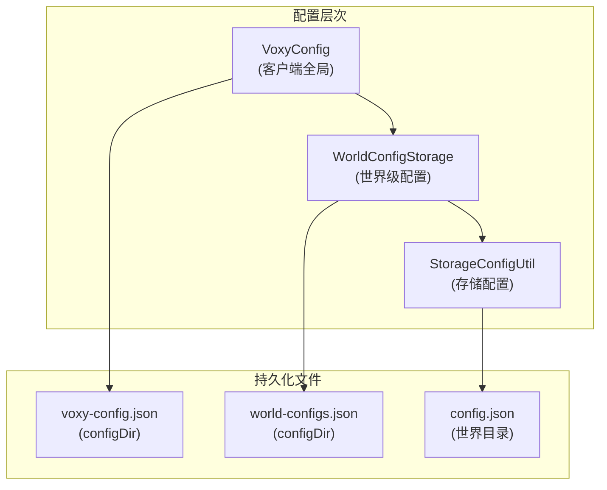
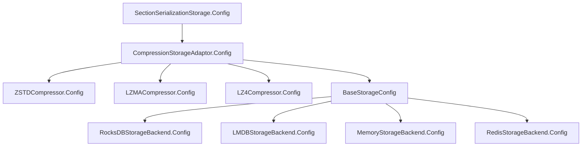
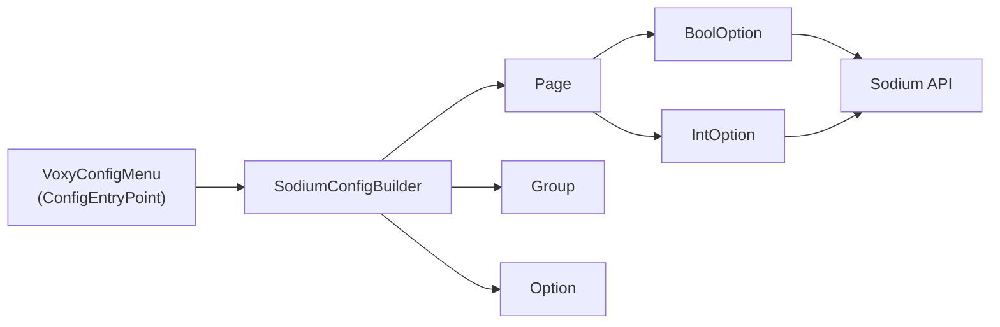

## 致谢

本分析基于 [Voxy](https://github.com/voxelmodpack/voxy) v0.2.13-alpha 模组源码，感谢原开发者 Cortex 开放源码。

## 目录

- [概述](#概述)
- [Serialization 机制](#serialization-机制)
- [配置构建上下文](#配置构建上下文)
- [存储配置系统](#存储配置系统)
- [客户端配置系统](#客户端配置系统)
- [UI 集成架构](#ui-集成架构)
- [fabric.mod.json 分析](#fabricmodjson-分析)

---

## 概述

Voxy 模组采用**分层配置架构**，将配置分为以下几个层次：

| 层次 | 作用域 | 持久化方式 |
|------|--------|-----------|
| 客户端配置 | 全局 | `voxy-config.json` |
| 世界级配置 | 每个世界独立 | `world-configs.json` |
| 存储配置 | 每个世界独立 | `config.json` |



---

## Serialization 机制

### Gson 多态序列化核心

Voxy 使用 Gson 的 `TypeAdapterFactory` 实现 Java 多态类型的 JSON 序列化。这是处理抽象配置类（如 `StorageConfig`、`SectionStorageConfig`）的关键机制。

```27:91:D:\Minecraft-Learning\assets\voxy\src\main\java\me\cortex\voxy\common\config\Serialization.java
    private static final class GsonConfigSerialization <T> implements TypeAdapterFactory {
        private final String typeField = "TYPE";
        private final Class<T> clz;

        private final Map<String, Class<? extends T>> name2type = new HashMap<>();
        private final Map<Class<? extends T>, String> type2name = new HashMap<>();
```

**核心设计**：
- 使用 `TYPE` 字段标识具体子类型
- 维护 `name2type` 和 `type2name` 双向映射
- 序列化时将 `TYPE` 字段放在 JSON 对象最前面

```49:52:D:\Minecraft-Learning\assets\voxy\src\main\java\me\cortex\voxy\common\config\Serialization.java
        private T deserialize(Gson gson, JsonElement json) {
            var retype = this.name2type.get(json.getAsJsonObject().remove(this.typeField).getAsString());
            return gson.getDelegateAdapter(this, TypeToken.get(retype)).fromJsonTree(json);
        }
```

### 自动注册机制

`Serialization.init()` 方法通过反射扫描所有配置类：

```93:157:D:\Minecraft-Learning\assets\voxy\src\main\java\me\cortex\voxy\common\config\Serialization.java
    public static void init() {
        String BASE_SEARCH_PACKAGE = "me.cortex.voxy";
        // ...
        for (var clzName : clazzs) {
            if (VoxyCommon.IS_DEDICATED_SERVER&&clzName.startsWith("me.cortex.voxy.client")) {
                continue;//Dont load stuff from client path when were on a dedicated server
            }
            if (!clzName.toLowerCase(Locale.ROOT).contains("config")) {
                continue;//Only load classes that contain the word config
            }
            // ...
            while ((clz = clz.getSuperclass()) != null) {
                if (CONFIG_TYPES.contains(clz)) {
                    Method nameMethod = original.getMethod("getConfigTypeName");
                    String name = (String) nameMethod.invoke(null);
                    serializers.computeIfAbsent(clz, GsonConfigSerialization::new)
                            .register(name, (Class) original);
```

**注册流程**：
1. 扫描 `me.cortex.voxy` 包下所有类
2. 跳过客户端类（专用服务器环境）
3. 仅处理包含 "config" 的类名
4. 查找继承自 `CONFIG_TYPES` 中登记的抽象类
5. 调用子类的 `getConfigTypeName()` 静态方法获取类型标识

### 配置类型注册

任何可序列化的配置类必须在类加载时将自己注册到 `CONFIG_TYPES`：

```9:12:D:\Minecraft-Learning\assets\voxy\src\main\java\me\cortex\voxy\common\config\storage\StorageConfig.java
public abstract class StorageConfig {
    static {
        Serialization.CONFIG_TYPES.add(StorageConfig.class);
    }
```

这形成了一个**注册表模式**，让新的存储后端可以热注册自己的序列化器。

---

## 配置构建上下文

### ConfigBuildCtx 职责

`ConfigBuildCtx` 管理配置构建时的路径解析和属性替换：

```9:18:D:\Minecraft-Learning\assets\voxy\src\main\java\me\cortex\voxy\common\config\ConfigBuildCtx.java
public class ConfigBuildCtx {
    public static final String BASE_SAVE_PATH = "{base_save_path}";
    public static final String WORLD_IDENTIFIER = "{world_identifier}";
    public static final String PLAYER_UUID = "{player_uuid}";
    public static final String DEFAULT_STORAGE_PATH = BASE_SAVE_PATH+"/"+WORLD_IDENTIFIER+"/storage/";
    
    private final Map<String, String> properties = new HashMap<>();
    private final Stack<String> pathStack = new Stack<>();
```

**支持的占位符**：

| 占位符 | 含义 |
|--------|------|
| `{base_save_path}` | 基础存储路径 |
| `{world_identifier}` | 世界唯一标识 |
| `{player_uuid}` | 玩家 UUID |

### 路径栈管理

使用栈结构支持嵌套路径解析：

```39:51:D:\Minecraft-Learning\assets\voxy\src\main\java\me\cortex\voxy\common\config\ConfigBuildCtx.java
    public ConfigBuildCtx pushPath(String path) {
        this.pathStack.push(path);
        return this;
    }

    public ConfigBuildCtx popPath() {
        this.pathStack.pop();
        return this;
    }
```

---

## 存储配置系统

### 存储后端配置层次



### StorageConfigUtil

用于加载或创建存储配置：

```17:53:D:\Minecraft-Learning\assets\voxy\src\main\java\me\cortex\voxy\common\StorageConfigUtil.java
    public static <T> T getCreateStorageConfig(Class<T> clz, Predicate<T> verifier, Supplier<T> defaultConfig, Path path) {
        var json = path.resolve("config.json");
        T config = null;
        if (Files.exists(json)) {
            config = Serialization.GSON.fromJson(Files.readString(json), clz);
            if (config == null || !verifier.test(config)) {
                config = null;
            }
        }

        if (config == null) {
            config = defaultConfig.get();
        }
        Files.writeString(json, Serialization.GSON.toJson(config));
        return config;
    }
```

### 默认存储配置

```55:70:D:\Minecraft-Learning\assets\voxy\src\main\java\me\cortex\voxy\common\StorageConfigUtil.java
    public static SectionSerializationStorage.Config createDefaultSerializer() {
        var baseDB = new RocksDBStorageBackend.Config();
        var compressor = new ZSTDCompressor.Config();
        compressor.compressionLevel = 1;
        var compression = new CompressionStorageAdaptor.Config();
        compression.delegate = baseDB;
        compression.compressor = compressor;
        var serializer = new SectionSerializationStorage.Config();
        serializer.storage = compression;
        return serializer;
    }
```

默认使用 **RocksDB + ZSTD** 组合。

---

## 客户端配置系统

### VoxyConfig 客户端配置

客户端配置存储在 `configDir/voxy-config.json`：

```17:35:D:\Minecraft-Learning\assets\voxy\src\main\java\me\cortex\voxy\client\config\VoxyConfig.java
public class VoxyConfig {
    private static final Gson GSON = new GsonBuilder()
            .setFieldNamingPolicy(FieldNamingPolicy.LOWER_CASE_WITH_UNDERSCORES)
            .setPrettyPrinting()
            .excludeFieldsWithModifiers(Modifier.PRIVATE)
            .create();

    public static VoxyConfig CONFIG = loadOrCreate();

    public boolean enabled = true;
    public boolean enableRendering = true;
    public boolean ingestEnabled = true;
    public float sectionRenderDistance = 16;
    public int serviceThreads = (int) Math.max(CpuLayout.getCoreCount()/1.5, 1);
    public float subDivisionSize = 64;
    public boolean useEnvironmentalFog = true;
    public boolean dontUseSodiumBuilderThreads = false;
```

**配置项说明**：

| 字段 | 类型 | 默认值 | 说明 |
|------|------|--------|------|
| `enabled` | boolean | true | 全局启用开关 |
| `enableRendering` | boolean | true | 渲染启用 |
| `ingestEnabled` | boolean | true | 数据摄入启用 |
| `sectionRenderDistance` | float | 16 | Section 渲染距离 |
| `serviceThreads` | int | CPU核心数/1.5 | 服务线程数 |
| `subDivisionSize` | float | 64 | 子分割大小 |
| `useEnvironmentalFog` | boolean | true | 环境雾效果 |
| `dontUseSodiumBuilderThreads` | boolean | false | 是否使用 Sodium 线程 |

---

## UI 集成架构

### ModMenu 集成

Voxy 通过 ModMenu API 集成到 Mod Menu 配置界面：

```11:23:D:\Minecraft-Learning\assets\voxy\src\main\java\me\cortex\voxy\client\config\ModMenuIntegration.java
public class ModMenuIntegration implements ModMenuApi {
    @Override
    public ConfigScreenFactory<?> getModConfigScreenFactory() {
        return parent -> {
            if (VoxyCommon.isAvailable()) {
                var page = (OptionPage) ConfigManager.CONFIG.getModOptions().stream()
                    .filter(a->a.configId().equals("voxy"))
                    .findFirst().get().pages().get(0);
                var screen = (VideoSettingsScreen)VideoSettingsScreen.createScreen(parent, page);
                return screen;
            } else {
                return null;
            }
        };
    }
}
```

### Sodium 配置菜单集成

Voxy 利用 Sodium 的配置 API 来构建自己的配置界面：



### VoxyConfigMenu 实现

作为 `ConfigEntryPoint` 晚注册到 Sodium：

```21:32:D:\Minecraft-Learning\assets\voxy\src\main\java\me\cortex\voxy\client\config\VoxyConfigMenu.java
public class VoxyConfigMenu implements ConfigEntryPoint {
    @Override
    public void registerConfigLate(ConfigBuilder B) {
        if (!VoxyCommon.isAvailable()) return;

        var cc = B.registerModOptions("voxy", "Voxy", VoxyCommon.MOD_VERSION)
                .setIcon(Identifier.parse("voxy:icon.png"));

        SodiumConfigBuilder.buildToSodium(B, cc, CFG::save, postOp->{...},
            new Page(Component.translatable("voxy.config.general"),
                new Group(
                    new BoolOption("voxy:enabled", ...).setEnabler(null)
                ),
                // ...
            ),
            new Page(Component.translatable("voxy.config.rendering"),
                // ...
            )
        );
    }
}
```

### SodiumConfigBuilder DSL

自定义配置构建器，提供流畅的 API：

```74:115:D:\Minecraft-Learning\assets\voxy\src\main\java\me\cortex\voxy\client\config\SodiumConfigBuilder.java
    public static class Page extends Enableable<Page> {
        protected Component name;
        protected Group[] groups;
        // ...
    }

    public static class Group extends Enableable<Group> {
        protected Option[] options;
        // ...
    }

    public abstract static class Option<TYPE, OPTION, STYPE> extends Enableable<Option<TYPE,OPTION,STYPE>> {
        protected String id;
        protected Supplier<TYPE> getter;
        protected Consumer<TYPE> setter;
        
        public OPTION setPostChangeRunner(Consumer<TYPE> postRunner, String... dontRunIfChangedVars) { ... }
        public OPTION setPostChangeFlags(String... flags) { ... }
    }
```

**链式配置示例**：

```java
new BoolOption("voxy:enabled", Component.translatable("voxy.config.general.enabled"),
        ()->CFG.enabled, v->CFG.enabled=v)
    .setPostChangeRunner(c->{ /* 状态变更回调 */ }, "voxy:rendering")
    .setPostChangeFlags(RENDER_RELOAD, "voxy:iris_reload")
    .setEnabler(null)
```

---

## fabric.mod.json 分析

```json
{
  "schemaVersion": 1,
  "id": "voxy",
  "version": "${version}",
  "name": "Voxy",
  "description": "Far distance rendering mod utilising LoDs",
  "entrypoints": {
    "client": ["me.cortex.voxy.client.VoxyClient"],
    "modmenu": ["me.cortex.voxy.client.config.ModMenuIntegration"],
    "sodium:config_api_user": ["me.cortex.voxy.client.config.VoxyConfigMenu"],
    "main": ["me.cortex.voxy.commonImpl.VoxyCommon"]
  },
  "depends": {
    "minecraft": ["1.21.11"],
    "fabricloader": ">=0.14.22",
    "fabric-api": ">=0.91.1",
    "sodium": ["=0.8.4","=0.8.6"]
  }
}
```

**入口点说明**：

| 入口点 | 处理器 | 触发时机 |
|--------|--------|----------|
| `client` | `VoxyClient` | 客户端启动 |
| `main` | `VoxyCommon` | 通用启动 |
| `modmenu` | `ModMenuIntegration` | ModMenu 扫描 |
| `sodium:config_api_user` | `VoxyConfigMenu` | Sodium 配置 API 初始化 |

**关键依赖**：
- 严格依赖 Sodium 特定版本（`=0.8.4` 或 `=0.8.6`）
- 依赖 Fabric API ≥ 0.91.1

---

## 总结

Voxy 的配置系统设计特点：

1. **多态序列化**：通过 `TypeAdapterFactory` + 反射注册实现灵活的类型扩展
2. **分层存储**：客户端配置、世界级配置、存储配置分离
3. **UI 集成**：借力 Sodium 的配置 API，避免重复造轮子
4. **DSL 构建**：使用流畅接口构建复杂配置页面

这种设计使得：
- 新增存储后端只需实现 `StorageConfig` 并注册
- 配置 UI 与业务逻辑分离
- 世界级配置支持 per-world 自定义

---

## 课后自查

- [ ] 理解 Gson 多态序列化的 TYPE 字段机制
- [ ] 掌握 ConfigBuildCtx 的路径解析逻辑
- [ ] 能说明 StorageConfig 的继承层次结构
- [ ] 理解 SodiumConfigBuilder 的 DSL 设计
- [ ] 了解 ModMenu 和 Sodium 配置 API 的集成方式
